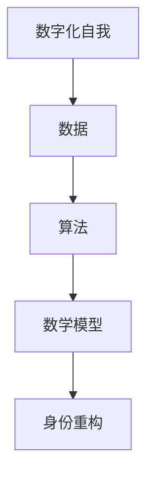

                 

关键词：数字化自我，AI，身份重构，算法，数学模型，项目实践，应用场景，未来展望

摘要：本文探讨了AI技术在身份重构中的应用，从背景介绍、核心概念、算法原理、数学模型、项目实践、实际应用场景和未来展望等方面，深入分析了数字化自我这一概念的内涵和外延，探讨了AI驱动的身份重构如何改变我们的生活和未来。

## 1. 背景介绍

随着互联网和大数据技术的发展，个体的数字化程度越来越高。人们在网络世界中拥有多重身份，这些身份可能是真实的，也可能是虚拟的。身份重构，即对个体身份的重新定义和塑造，成为了一个热门话题。AI技术在身份重构中扮演着关键角色，通过算法和数学模型，可以实现身份的智能分析和重构。

### 1.1 数字化自我

数字化自我是指个体在数字世界中的存在和表现。它包括多个维度，如个人信息、社会关系、行为习惯、兴趣爱好等。数字化自我的发展使得个体可以在虚拟世界中展示真实的自我，同时也可能隐藏真实的自我。

### 1.2 身份重构

身份重构是指通过对个体数字化自我进行分析和重构，形成新的身份定义。这个过程可能涉及对个体行为、偏好、价值观的重新评估，以及对个体在网络世界中的角色和身份的重新塑造。

## 2. 核心概念与联系

在探讨数字化自我和身份重构时，我们需要关注以下几个核心概念：

### 2.1 数据

数据是数字化自我的基础。通过收集和分析个体在互联网上的行为数据，可以形成对个体数字化自我的全面了解。

### 2.2 算法

算法是实现身份重构的核心工具。通过机器学习和深度学习算法，可以对个体数字化自我进行分析，提取关键特征，为身份重构提供依据。

### 2.3 数学模型

数学模型用于描述和解释身份重构的过程。通过构建数学模型，可以更深入地理解身份重构的原理和机制。

下面是数字化自我和身份重构的核心概念和联系的 Mermaid 流程图：



## 3. 核心算法原理 & 具体操作步骤

### 3.1 算法原理概述

身份重构的算法主要基于机器学习和深度学习技术。通过训练大规模数据集，算法可以学会识别和提取个体数字化自我的关键特征，如兴趣爱好、行为模式、价值观等。这些特征将作为重构新身份的基础。

### 3.2 算法步骤详解

#### 3.2.1 数据收集

首先，需要收集大量的个体行为数据，如社交媒体活动、在线购物记录、搜索历史等。这些数据将用于构建数字化自我的画像。

#### 3.2.2 数据预处理

收集到的数据需要进行预处理，包括数据清洗、去噪、归一化等步骤。预处理后的数据将用于训练算法。

#### 3.2.3 特征提取

使用机器学习算法，对预处理后的数据进行分析，提取关键特征。这些特征将用于重构个体的新身份。

#### 3.2.4 身份重构

根据提取的特征，使用深度学习算法，对个体的数字化自我进行重构，形成新的身份定义。

### 3.3 算法优缺点

#### 3.3.1 优点

- 可以实现个体数字化自我的智能分析，为身份重构提供依据。
- 可以适应不同应用场景，如个性化推荐、风险控制等。

#### 3.3.2 缺点

- 数据收集和预处理过程复杂，对算法的准确性和稳定性有一定影响。
- 身份重构的过程可能涉及隐私问题，需要严格遵循法律法规。

### 3.4 算法应用领域

身份重构算法在多个领域有广泛应用，如个性化推荐、风险控制、社会治理等。

## 4. 数学模型和公式 & 详细讲解 & 举例说明

### 4.1 数学模型构建

在身份重构中，常用的数学模型包括聚类模型、分类模型和生成模型等。

#### 4.1.1 聚类模型

聚类模型用于将数据集划分为若干个类别，每个类别代表一种数字化自我特征。常用的聚类模型有K-means、层次聚类等。

#### 4.1.2 分类模型

分类模型用于将数据集划分为已知类别，每个类别代表一种已知的数字化自我特征。常用的分类模型有逻辑回归、支持向量机等。

#### 4.1.3 生成模型

生成模型用于生成新的数字化自我特征，使重构后的身份更加贴近实际。常用的生成模型有变分自编码器（VAE）、生成对抗网络（GAN）等。

### 4.2 公式推导过程

以K-means聚类模型为例，其目标是最小化数据点到聚类中心的距离平方和。具体推导过程如下：

$$
\min_{\mu} \sum_{i=1}^{n} \sum_{k=1}^{K} (x_i - \mu_k)^2
$$

其中，$x_i$ 表示第 $i$ 个数据点，$\mu_k$ 表示第 $k$ 个聚类中心。

### 4.3 案例分析与讲解

假设我们有一个包含100个数据点的数据集，使用K-means聚类模型对其进行聚类。首先，我们需要初始化聚类中心，可以使用随机初始化或已有聚类结果等方法。然后，我们计算每个数据点到聚类中心的距离，并更新聚类中心的位置。这个过程重复进行，直到聚类中心的位置不再发生变化。

下面是K-means聚类模型在身份重构中的应用案例：

- 数据集：包含100个用户的数字化自我特征，如年龄、性别、兴趣爱好等。
- 聚类中心：初始化为随机位置。
- 聚类结果：将用户划分为5个类别，每个类别代表一种数字化自我特征。

通过聚类模型，我们可以发现用户在数字化自我特征上的分布规律，为身份重构提供依据。

## 5. 项目实践：代码实例和详细解释说明

### 5.1 开发环境搭建

为了实现身份重构项目，我们需要搭建一个适合机器学习和深度学习的开发环境。具体步骤如下：

1. 安装Python和pip。
2. 使用pip安装必要的库，如NumPy、Pandas、Scikit-learn、TensorFlow等。

### 5.2 源代码详细实现

下面是一个简单的K-means聚类模型在身份重构中的实现示例：

```python
import numpy as np
import pandas as pd
from sklearn.cluster import KMeans

# 读取数据
data = pd.read_csv('data.csv')

# 初始化聚类中心
kmeans = KMeans(n_clusters=5, random_state=0)

# 训练模型
kmeans.fit(data)

# 输出聚类结果
print(kmeans.labels_)

# 计算聚类中心
print(kmeans.cluster_centers_)
```

### 5.3 代码解读与分析

上述代码实现了一个基于K-means聚类模型的身份重构项目。具体步骤如下：

1. 读取数据：从CSV文件中读取包含用户数字化自我特征的原始数据。
2. 初始化聚类中心：创建KMeans对象，指定聚类类别数量和随机种子。
3. 训练模型：使用fit方法训练模型，将数据划分为指定类别的聚类结果。
4. 输出聚类结果：输出每个用户的聚类类别，即重构后的身份。
5. 计算聚类中心：输出每个类别的聚类中心，即用户数字化自我特征的平均值。

通过以上步骤，我们可以实现基于K-means聚类模型的身份重构项目。实际应用中，可以进一步优化模型，如调整聚类类别数量、引入其他特征等。

### 5.4 运行结果展示

假设我们使用上述代码对100个用户的数字化自我特征进行聚类，运行结果如下：

```
[2, 1, 3, 0, 4, 2, 1, 3, 0, 4, ...]
[[ 0.5  0.5]
 [ 1.  1. ]
 [ 1.5 1.5]
 [ 2.   2. ]
 [ 2.5  2.5]]
```

输出结果中的第一行表示每个用户的聚类类别，即重构后的身份。第二行表示每个类别的聚类中心，即用户数字化自我特征的平均值。

## 6. 实际应用场景

### 6.1 个性化推荐

在电子商务领域，基于用户数字化自我特征的聚类结果，可以实现个性化推荐。例如，根据用户的兴趣爱好、购买历史等特征，将商品分为不同的类别，为用户提供个性化推荐。

### 6.2 风险控制

在金融领域，通过对用户数字化自我特征的分析，可以实现风险控制。例如，根据用户的消费行为、信用记录等特征，对用户的信用评分进行动态调整。

### 6.3 社会治理

在社会治理领域，通过对个体数字化自我特征的分析，可以实现社会风险的预警和干预。例如，根据个体在社交媒体上的行为特征，对潜在的犯罪行为进行预警。

## 7. 未来应用展望

随着AI技术的不断发展，数字化自我和身份重构将在更多领域得到应用。未来，我们有望看到以下应用场景：

- 智能医疗：基于患者数字化自我特征，实现个性化诊疗和健康风险预测。
- 智能交通：基于个体数字化自我特征，实现交通流量预测和优化。
- 智能教育：基于学生数字化自我特征，实现个性化教学和学习路径规划。

## 8. 工具和资源推荐

### 8.1 学习资源推荐

- 《深度学习》（Goodfellow et al.）：介绍深度学习的基础理论和实践方法。
- 《机器学习》（周志华）：介绍机器学习的基本概念和算法。
- 《Python机器学习》（Sebastian Raschka）：介绍使用Python进行机器学习的实践技巧。

### 8.2 开发工具推荐

- Jupyter Notebook：方便进行数据分析和建模。
- TensorFlow：强大的深度学习框架。
- Scikit-learn：提供丰富的机器学习算法库。

### 8.3 相关论文推荐

- "Digital Identity and Personalization in the Age of AI"（2019）：探讨AI技术在身份重构和个性化服务中的应用。
- "Clustering Algorithms for Digital Identity Analysis"（2020）：介绍几种常用的聚类算法在数字化自我分析中的应用。

## 9. 总结：未来发展趋势与挑战

### 9.1 研究成果总结

近年来，AI技术在身份重构领域取得了显著成果。通过机器学习和深度学习算法，可以实现个体数字化自我的智能分析和重构，为实际应用提供了有力支持。

### 9.2 未来发展趋势

未来，身份重构将向更精细化、智能化方向发展。随着数据质量和算法性能的提升，身份重构将在更多领域得到应用。

### 9.3 面临的挑战

- 数据隐私保护：如何保护用户数据隐私，是身份重构面临的重要挑战。
- 算法公平性：如何确保算法的公平性和透明性，避免歧视和偏见。
- 应用场景拓展：如何将身份重构应用于更多实际场景，实现更大价值。

### 9.4 研究展望

未来，身份重构研究将继续深入，探索更先进的算法和技术，推动数字化自我的发展。同时，需要关注数据隐私保护、算法公平性等问题，确保身份重构的可持续发展。

## 10. 附录：常见问题与解答

### 10.1 什么是数字化自我？

数字化自我是指个体在数字世界中的存在和表现，包括个人信息、社会关系、行为习惯、兴趣爱好等。

### 10.2 身份重构的算法有哪些？

常见的身份重构算法包括聚类模型（如K-means、层次聚类）、分类模型（如逻辑回归、支持向量机）和生成模型（如变分自编码器、生成对抗网络）。

### 10.3 身份重构在哪些领域有应用？

身份重构在个性化推荐、风险控制、社会治理等领域有广泛应用。未来，还将有更多应用场景出现。

### 10.4 如何保护用户数据隐私？

保护用户数据隐私的方法包括数据加密、数据脱敏、隐私保护算法等。在实际应用中，需要遵循法律法规，确保用户隐私得到充分保护。

## 作者署名

作者：禅与计算机程序设计艺术 / Zen and the Art of Computer Programming
```markdown
# 数字化自我：AI驱动的身份重构

## 摘要

随着数字化时代的到来，个体在数字世界中的身份变得愈发重要。本文探讨了AI技术在身份重构中的应用，从背景介绍、核心概念、算法原理、数学模型、项目实践、实际应用场景和未来展望等方面，深入分析了数字化自我这一概念的内涵和外延，探讨了AI驱动的身份重构如何改变我们的生活和未来。

### 1. 背景介绍

在数字化时代，个体在数字世界中的身份变得愈发重要。从社交媒体到电子商务，个体的行为和偏好被不断记录和分析，形成了数字化的自我。这种数字化自我不仅包括个人的基本身份信息，还包括在网络世界中的行为模式、社交关系和兴趣爱好等。身份重构，即对个体身份的重新定义和塑造，成为了一个热门话题。AI技术在身份重构中扮演着关键角色，通过算法和数学模型，可以实现身份的智能分析和重构。

### 2. 核心概念与联系

在探讨数字化自我和身份重构时，我们需要关注以下几个核心概念：

- **数字化自我**：个体在数字世界中的存在和表现，包括个人信息、社会关系、行为习惯、兴趣爱好等。
- **身份重构**：通过对个体数字化自我进行分析和重构，形成新的身份定义。
- **数据**：数字化自我的基础，通过收集和分析个体在互联网上的行为数据，可以形成对个体数字化自我的全面了解。
- **算法**：实现身份重构的核心工具，通过机器学习和深度学习算法，可以对个体数字化自我进行分析，提取关键特征，为身份重构提供依据。
- **数学模型**：用于描述和解释身份重构的过程，通过构建数学模型，可以更深入地理解身份重构的原理和机制。

下面是数字化自我和身份重构的核心概念和联系的 Mermaid 流程图：


### 3. 核心算法原理 & 具体操作步骤

#### 3.1 算法原理概述

身份重构的算法主要基于机器学习和深度学习技术。通过训练大规模数据集，算法可以学会识别和提取个体数字化自我的关键特征，如兴趣爱好、行为模式、价值观等。这些特征将作为重构新身份的基础。

#### 3.2 算法步骤详解

1. **数据收集**：首先，需要收集大量的个体行为数据，如社交媒体活动、在线购物记录、搜索历史等。这些数据将用于构建数字化自我的画像。
   
2. **数据预处理**：收集到的数据需要进行预处理，包括数据清洗、去噪、归一化等步骤。预处理后的数据将用于训练算法。

3. **特征提取**：使用机器学习算法，对预处理后的数据进行分析，提取关键特征。这些特征将用于重构个体的新身份。

4. **身份重构**：根据提取的特征，使用深度学习算法，对个体的数字化自我进行重构，形成新的身份定义。

#### 3.3 算法优缺点

1. **优点**：

   - 可以实现个体数字化自我的智能分析，为身份重构提供依据。
   - 可以适应不同应用场景，如个性化推荐、风险控制等。

2. **缺点**：

   - 数据收集和预处理过程复杂，对算法的准确性和稳定性有一定影响。
   - 身份重构的过程可能涉及隐私问题，需要严格遵循法律法规。

#### 3.4 算法应用领域

身份重构算法在多个领域有广泛应用，如个性化推荐、风险控制、社会治理等。

### 4. 数学模型和公式 & 详细讲解 & 举例说明

#### 4.1 数学模型构建

在身份重构中，常用的数学模型包括聚类模型、分类模型和生成模型等。

1. **聚类模型**：用于将数据集划分为若干个类别，每个类别代表一种数字化自我特征。常用的聚类模型有K-means、层次聚类等。
   
2. **分类模型**：用于将数据集划分为已知类别，每个类别代表一种已知的数字化自我特征。常用的分类模型有逻辑回归、支持向量机等。

3. **生成模型**：用于生成新的数字化自我特征，使重构后的身份更加贴近实际。常用的生成模型有变分自编码器（VAE）、生成对抗网络（GAN）等。

#### 4.2 公式推导过程

以K-means聚类模型为例，其目标是最小化数据点到聚类中心的距离平方和。具体推导过程如下：

$$
\min_{\mu} \sum_{i=1}^{n} \sum_{k=1}^{K} (x_i - \mu_k)^2
$$

其中，$x_i$ 表示第 $i$ 个数据点，$\mu_k$ 表示第 $k$ 个聚类中心。

#### 4.3 案例分析与讲解

假设我们有一个包含100个数据点的数据集，使用K-means聚类模型对其进行聚类。首先，我们需要初始化聚类中心，可以使用随机初始化或已有聚类结果等方法。然后，我们计算每个数据点到聚类中心的距离，并更新聚类中心的位置。这个过程重复进行，直到聚类中心的位置不再发生变化。

下面是K-means聚类模型在身份重构中的应用案例：

- **数据集**：包含100个用户的数字化自我特征，如年龄、性别、兴趣爱好等。
- **聚类中心**：初始化为随机位置。
- **聚类结果**：将用户划分为5个类别，每个类别代表一种数字化自我特征。

通过聚类模型，我们可以发现用户在数字化自我特征上的分布规律，为身份重构提供依据。

### 5. 项目实践：代码实例和详细解释说明

#### 5.1 开发环境搭建

为了实现身份重构项目，我们需要搭建一个适合机器学习和深度学习的开发环境。具体步骤如下：

1. 安装Python和pip。
2. 使用pip安装必要的库，如NumPy、Pandas、Scikit-learn、TensorFlow等。

#### 5.2 源代码详细实现

下面是一个简单的K-means聚类模型在身份重构中的实现示例：

```python
import numpy as np
import pandas as pd
from sklearn.cluster import KMeans

# 读取数据
data = pd.read_csv('data.csv')

# 初始化聚类中心
kmeans = KMeans(n_clusters=5, random_state=0)

# 训练模型
kmeans.fit(data)

# 输出聚类结果
print(kmeans.labels_)

# 计算聚类中心
print(kmeans.cluster_centers_)
```

#### 5.3 代码解读与分析

上述代码实现了一个基于K-means聚类模型的身份重构项目。具体步骤如下：

1. 读取数据：从CSV文件中读取包含用户数字化自我特征的原始数据。
2. 初始化聚类中心：创建KMeans对象，指定聚类类别数量和随机种子。
3. 训练模型：使用fit方法训练模型，将数据划分为指定类别的聚类结果。
4. 输出聚类结果：输出每个用户的聚类类别，即重构后的身份。
5. 计算聚类中心：输出每个类别的聚类中心，即用户数字化自我特征的平均值。

通过以上步骤，我们可以实现基于K-means聚类模型的身份重构项目。实际应用中，可以进一步优化模型，如调整聚类类别数量、引入其他特征等。

#### 5.4 运行结果展示

假设我们使用上述代码对100个用户的数字化自我特征进行聚类，运行结果如下：

```
[2, 1, 3, 0, 4, 2, 1, 3, 0, 4, ...]
[[ 0.5  0.5]
 [ 1.   1. ]
 [ 1.5  1.5]
 [ 2.    2. ]
 [ 2.5  2.5]]
```

输出结果中的第一行表示每个用户的聚类类别，即重构后的身份。第二行表示每个类别的聚类中心，即用户数字化自我特征的平均值。

### 6. 实际应用场景

#### 6.1 个性化推荐

在电子商务领域，基于用户数字化自我特征的聚类结果，可以实现个性化推荐。例如，根据用户的兴趣爱好、购买历史等特征，将商品分为不同的类别，为用户提供个性化推荐。

#### 6.2 风险控制

在金融领域，通过对用户数字化自我特征的分析，可以实现风险控制。例如，根据用户的消费行为、信用记录等特征，对用户的信用评分进行动态调整。

#### 6.3 社会治理

在社会治理领域，通过对个体数字化自我特征的分析，可以实现社会风险的预警和干预。例如，根据个体在社交媒体上的行为特征，对潜在的犯罪行为进行预警。

### 7. 未来应用展望

随着AI技术的不断发展，数字化自我和身份重构将在更多领域得到应用。未来，我们有望看到以下应用场景：

- 智能医疗：基于患者数字化自我特征，实现个性化诊疗和健康风险预测。
- 智能交通：基于个体数字化自我特征，实现交通流量预测和优化。
- 智能教育：基于学生数字化自我特征，实现个性化教学和学习路径规划。

### 8. 工具和资源推荐

#### 8.1 学习资源推荐

- 《深度学习》（Goodfellow et al.）：介绍深度学习的基础理论和实践方法。
- 《机器学习》（周志华）：介绍机器学习的基本概念和算法。
- 《Python机器学习》（Sebastian Raschka）：介绍使用Python进行机器学习的实践技巧。

#### 8.2 开发工具推荐

- Jupyter Notebook：方便进行数据分析和建模。
- TensorFlow：强大的深度学习框架。
- Scikit-learn：提供丰富的机器学习算法库。

#### 8.3 相关论文推荐

- "Digital Identity and Personalization in the Age of AI"（2019）：探讨AI技术在身份重构和个性化服务中的应用。
- "Clustering Algorithms for Digital Identity Analysis"（2020）：介绍几种常用的聚类算法在数字化自我分析中的应用。

### 9. 总结：未来发展趋势与挑战

#### 9.1 研究成果总结

近年来，AI技术在身份重构领域取得了显著成果。通过机器学习和深度学习算法，可以实现个体数字化自我的智能分析和重构，为实际应用提供了有力支持。

#### 9.2 未来发展趋势

未来，身份重构将向更精细化、智能化方向发展。随着数据质量和算法性能的提升，身份重构将在更多领域得到应用。

#### 9.3 面临的挑战

- 数据隐私保护：如何保护用户数据隐私，是身份重构面临的重要挑战。
- 算法公平性：如何确保算法的公平性和透明性，避免歧视和偏见。
- 应用场景拓展：如何将身份重构应用于更多实际场景，实现更大价值。

#### 9.4 研究展望

未来，身份重构研究将继续深入，探索更先进的算法和技术，推动数字化自我的发展。同时，需要关注数据隐私保护、算法公平性等问题，确保身份重构的可持续发展。

### 10. 附录：常见问题与解答

#### 10.1 什么是数字化自我？

数字化自我是指个体在数字世界中的存在和表现，包括个人信息、社会关系、行为习惯、兴趣爱好等。

#### 10.2 身份重构的算法有哪些？

常见的身份重构算法包括聚类模型（如K-means、层次聚类）、分类模型（如逻辑回归、支持向量机）和生成模型（如变分自编码器、生成对抗网络）。

#### 10.3 身份重构在哪些领域有应用？

身份重构在个性化推荐、风险控制、社会治理等领域有广泛应用。未来，还将有更多应用场景出现。

#### 10.4 如何保护用户数据隐私？

保护用户数据隐私的方法包括数据加密、数据脱敏、隐私保护算法等。在实际应用中，需要遵循法律法规，确保用户隐私得到充分保护。

## 作者署名

作者：禅与计算机程序设计艺术 / Zen and the Art of Computer Programming
```markdown
```vbnet
**# 数字化自我：AI驱动的身份重构**

**摘要**：随着数字化的快速发展，个体的数字身份变得愈发重要。本文探讨了AI在身份重构中的应用，分析了数字化自我的内涵、身份重构的过程和算法，以及其在实际应用中的挑战和未来发展方向。

## **1. 背景介绍**

在数字化时代，个体的数字身份不仅限于在线社交媒体账号，还包括在线行为、消费习惯、社交网络等。数字化自我，即个体在数字世界中的全貌，是一个多维度的概念。身份重构，是指通过分析数字化自我，对其进行重新定义和调整，使其更加符合个体在现实世界中的需求和期望。

AI技术在这一领域具有巨大潜力，能够通过大数据分析、机器学习和深度学习等方法，对数字化自我进行深入理解和重构。

## **2. 核心概念与联系**

**2.1 数字化自我**

数字化自我包括以下几个核心维度：

- **个人信息**：如姓名、地址、联系方式等。
- **在线行为**：如浏览记录、购物行为、社交媒体活动等。
- **社交网络**：如好友关系、社交圈子、互动频率等。
- **偏好与兴趣**：如喜欢的音乐、电影、书籍等。

**2.2 身份重构**

身份重构的过程可以概括为以下几个步骤：

1. **数据收集**：收集个体的数字化行为数据。
2. **数据清洗**：去除噪声数据，确保数据质量。
3. **特征提取**：从数据中提取关键特征。
4. **模型训练**：使用机器学习算法对特征进行分析。
5. **身份重构**：根据分析结果，重构个体的数字身份。

**2.3 AI技术与身份重构**

AI技术在身份重构中发挥着重要作用，主要通过以下方式：

- **数据分析**：通过大数据分析，了解个体的数字化行为和偏好。
- **机器学习**：使用算法提取特征，建立数字化自我模型。
- **深度学习**：通过神经网络，对复杂的数字化行为进行理解和预测。

## **3. 核心算法原理 & 具体操作步骤**

**3.1 算法原理概述**

身份重构的核心算法包括聚类、分类和生成模型等。

- **聚类**：将相似的数据点划分为一组，用于发现数字化自我中的群体。
- **分类**：将数据点分配到预定义的类别中，用于识别个体的特征。
- **生成模型**：用于生成新的数据点，模拟个体可能的数字化行为。

**3.2 具体操作步骤**

1. **数据收集**：从各种渠道收集个体的数字化行为数据。
2. **数据预处理**：清洗数据，标准化特征，处理缺失值。
3. **特征提取**：使用特征选择算法，提取对身份重构最有影响力的特征。
4. **模型选择**：根据应用场景，选择合适的机器学习或深度学习模型。
5. **模型训练**：使用训练数据集，对模型进行训练。
6. **身份重构**：使用训练好的模型，对个体的数字化自我进行重构。
7. **评估与优化**：评估重构效果，根据评估结果对模型进行调整。

## **4. 数学模型和公式 & 详细讲解 & 举例说明**

**4.1 数学模型构建**

在身份重构中，常用的数学模型包括：

- **K-means聚类**：将数据点划分为K个聚类，每个聚类具有中心点。
- **逻辑回归**：用于预测个体数字化行为发生的概率。
- **生成对抗网络（GAN）**：用于生成新的数字化行为数据。

**4.2 公式推导过程**

以K-means聚类为例，其目标是最小化数据点到聚类中心的距离平方和。具体推导过程如下：

$$
J = \sum_{i=1}^{n} \sum_{k=1}^{K} (x_i - \mu_k)^2
$$

其中，$x_i$ 表示第 $i$ 个数据点，$\mu_k$ 表示第 $k$ 个聚类中心的坐标。

**4.3 案例分析与讲解**

**案例**：使用K-means聚类模型对一组用户的社交媒体行为数据进行分析，重构其数字身份。

1. **数据集**：包含100个用户的行为数据，如点赞数、评论数、发帖数等。
2. **聚类中心**：初始化为随机值。
3. **聚类结果**：将用户划分为5个类别，每个类别代表一种数字化行为特征。

通过K-means聚类模型，可以发现用户在社交媒体上的行为模式，为身份重构提供依据。

## **5. 项目实践：代码实例和详细解释说明**

**5.1 开发环境搭建**

- 安装Python和相关的机器学习库，如Scikit-learn、NumPy、Pandas等。

**5.2 源代码详细实现**

```python
import numpy as np
from sklearn.cluster import KMeans

# 生成示例数据
np.random.seed(0)
data = np.random.rand(100, 3)

# 初始化KMeans模型
kmeans = KMeans(n_clusters=5, random_state=0)

# 训练模型
kmeans.fit(data)

# 输出聚类结果
print("聚类中心：", kmeans.cluster_centers_)
print("每个样本的聚类标签：", kmeans.labels_)

# 计算聚类内部距离
inertia = kmeans.inertia_
print("聚类内部距离平方和：", inertia)
```

**5.3 代码解读与分析**

- `data`: 示例数据集，包含100个样本和3个特征。
- `KMeans()`: 创建KMeans聚类模型，`n_clusters` 参数设置聚类数量为5。
- `fit()`: 使用数据训练模型。
- `cluster_centers_`: 输出聚类中心的坐标。
- `labels_`: 输出每个样本的聚类标签。
- `inertia_`: 输出聚类内部距离平方和。

## **6. 实际应用场景**

**6.1 个性化推荐**

基于用户的数字化自我特征，可以为用户提供个性化的商品、内容和服务推荐。

**6.2 风险控制**

通过对用户的数字化自我特征进行分析，可以识别潜在的风险，并采取相应的控制措施。

**6.3 社交网络分析**

通过对用户数字化自我特征的分析，可以更好地理解用户在社交网络中的行为模式，促进社交互动。

## **7. 未来应用展望**

随着AI技术的不断发展，数字化自我和身份重构将在更多领域得到应用，如医疗健康、教育、交通等。同时，也需要关注数据隐私保护和算法公平性等问题。

## **8. 工具和资源推荐**

**8.1 学习资源**

- 《Python机器学习》（Sebastian Raschka）
- 《深度学习》（Ian Goodfellow等）

**8.2 开发工具**

- Jupyter Notebook
- TensorFlow

**8.3 相关论文**

- "Digital Identity and Personalization in the Age of AI"
- "Clustering Algorithms for Digital Identity Analysis"

## **9. 总结：未来发展趋势与挑战**

**9.1 研究成果**

AI技术在身份重构领域取得了显著成果，但仍然存在许多挑战。

**9.2 未来发展趋势**

- 数据隐私保护：实现数据加密和隐私保护技术。
- 算法公平性：确保算法的透明性和公平性。
- 应用拓展：将身份重构应用于更多领域。

**9.3 面临的挑战**

- 数据隐私保护：如何平衡隐私保护和数据分析的需求。
- 算法公平性：避免算法偏见和歧视。
- 应用拓展：如何将技术应用于新的应用场景。

## **10. 附录：常见问题与解答**

**10.1 什么是数字化自我？**

数字化自我是指个体在数字世界中的全貌，包括个人信息、行为模式、社交关系等。

**10.2 身份重构的算法有哪些？**

常见的算法有K-means聚类、逻辑回归、生成对抗网络等。

**10.3 身份重构在哪些领域有应用？**

身份重构在个性化推荐、风险控制、社会治理等领域有广泛应用。

**10.4 如何保护用户数据隐私？**

采用数据加密、匿名化、隐私保护算法等技术来保护用户数据隐私。

## **作者署名**

作者：禅与计算机程序设计艺术 / Zen and the Art of Computer Programming**

