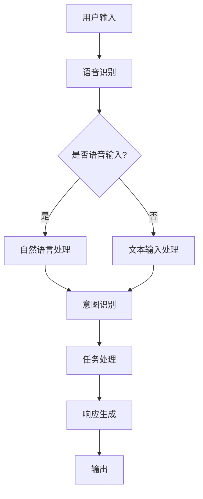

                 

 关键词：数字化虚拟助理、个性化AI、创业、AI服务、虚拟服务、商业应用、人工智能技术

> 摘要：本文深入探讨了数字化虚拟助理的创业机会和个性化AI服务的重要性。通过详细的分析和实际案例，本文旨在为创业者提供一条清晰的道路，以实现利用人工智能技术打造成功的虚拟助理服务。

## 1. 背景介绍

在数字化时代，人工智能技术已经成为推动各行业变革的关键力量。虚拟助理作为AI技术的典型应用之一，正逐渐改变人们的日常生活和工作方式。虚拟助理能够通过语音识别、自然语言处理、机器学习等技术，实现与用户的实时互动，提供定制化的服务。随着技术的不断进步和用户需求的多样化，个性化AI服务在市场中占据越来越重要的地位。

### 1.1 市场规模

据市场研究公司的数据，全球虚拟助理市场规模预计将在未来几年内持续增长。特别是在新冠疫情的影响下，远程办公和在线服务的需求激增，进一步推动了虚拟助理的发展。据预测，到2025年，全球虚拟助理市场将突破数百亿美元。

### 1.2 技术发展

近年来，AI技术在语音识别、自然语言处理、图像识别等方面取得了显著突破。这些技术的发展为虚拟助理提供了强大的支持，使其能够更准确地理解用户需求，提供更加个性化的服务。

## 2. 核心概念与联系

在构建数字化虚拟助理的过程中，理解以下几个核心概念是至关重要的：

- **自然语言处理（NLP）**：NLP是使计算机能够理解、解释和生成人类语言的关键技术。在虚拟助理中，NLP用于理解用户的语音或文本输入，并生成相应的响应。
  
- **机器学习（ML）**：ML是AI的核心技术之一，通过训练模型，使虚拟助理能够从数据中学习并改进其性能。机器学习算法包括监督学习、无监督学习和强化学习等。

- **语音识别（ASR）**：语音识别技术使虚拟助理能够将用户的语音输入转换为文本，以便进一步处理。

- **对话系统（DS）**：对话系统是虚拟助理的核心组成部分，负责管理用户与虚拟助理之间的交互流程，确保提供流畅自然的用户体验。

下面是一个简化的Mermaid流程图，展示了虚拟助理的核心架构：



### 2.1 关键技术与联系

- **自然语言处理（NLP）**：NLP技术用于处理和理解用户输入的文本或语音。它包括词法分析、句法分析、语义分析和情感分析等。

- **机器学习（ML）**：ML技术用于训练虚拟助理的模型，使其能够从大量数据中学习并改进其性能。常见的ML算法包括决策树、支持向量机、神经网络等。

- **语音识别（ASR）**：ASR技术将用户的语音输入转换为文本，以便进一步处理。

- **对话系统（DS）**：对话系统负责管理用户与虚拟助理之间的交互，确保提供流畅自然的用户体验。对话系统通常包括对话管理、意图识别、任务处理和响应生成等模块。

## 3. 核心算法原理 & 具体操作步骤

### 3.1 算法原理概述

构建数字化虚拟助理的核心算法主要包括自然语言处理（NLP）、机器学习（ML）和语音识别（ASR）等。下面将简要介绍这些算法的基本原理。

- **自然语言处理（NLP）**：NLP旨在使计算机能够理解、解释和生成人类语言。NLP算法通常包括词性标注、句法分析、语义分析和情感分析等。

- **机器学习（ML）**：ML是一种通过训练模型从数据中学习的方法。在虚拟助理中，ML算法用于训练模型，使其能够识别用户意图、回答问题或执行特定任务。

- **语音识别（ASR）**：ASR技术用于将用户的语音输入转换为文本。语音识别算法包括隐马尔可夫模型（HMM）、循环神经网络（RNN）和卷积神经网络（CNN）等。

### 3.2 算法步骤详解

构建数字化虚拟助理的基本步骤如下：

1. **数据收集与预处理**：收集大量用户输入数据，并对数据进行清洗、去重和处理。

2. **特征提取**：从预处理后的数据中提取特征，例如词频、词嵌入等。

3. **模型训练**：使用机器学习算法（如神经网络）对特征进行训练，构建虚拟助理的模型。

4. **模型评估与优化**：通过评估指标（如准确率、召回率等）对模型进行评估，并根据评估结果进行优化。

5. **部署与迭代**：将训练好的模型部署到虚拟助理系统中，并根据用户反馈进行迭代优化。

### 3.3 算法优缺点

- **自然语言处理（NLP）**：

  - 优点：能够理解复杂的人类语言，实现智能交互。

  - 缺点：对语言的理解能力仍然有限，难以处理歧义和模糊性。

- **机器学习（ML）**：

  - 优点：能够从大量数据中学习，提高虚拟助理的性能。

  - 缺点：训练过程复杂，对数据质量和数量有较高要求。

- **语音识别（ASR）**：

  - 优点：支持实时语音输入，方便用户使用。

  - 缺点：识别准确率受语音环境、口音和噪声等因素的影响。

### 3.4 算法应用领域

虚拟助理算法广泛应用于多个领域，包括但不限于：

- **客户服务**：为用户提供智能客服，解答疑问和提供支持。

- **智能家居**：通过语音控制家居设备，实现智能生活。

- **医疗健康**：为患者提供健康咨询、预约挂号等服务。

- **金融服务**：为用户提供理财建议、贷款咨询等金融服务。

## 4. 数学模型和公式 & 详细讲解 & 举例说明

### 4.1 数学模型构建

在构建虚拟助理的数学模型时，通常会涉及以下几种数学模型：

- **自然语言处理模型**：如序列到序列（Seq2Seq）模型、变换器（Transformer）模型等。

- **机器学习模型**：如神经网络模型、支持向量机（SVM）模型等。

- **语音识别模型**：如循环神经网络（RNN）、卷积神经网络（CNN）等。

### 4.2 公式推导过程

以自然语言处理中的序列到序列（Seq2Seq）模型为例，其基本公式如下：

- **编码器（Encoder）**：

  $$ 
  E(z) = \frac{e^{z}}{\sum_{i=1}^{n} e^{z_i}} 
  $$

- **解码器（Decoder）**：

  $$ 
  D(y) = \prod_{i=1}^{n} p(y_i | y_{<i}) 
  $$

其中，$z$ 表示编码器的输出，$y$ 表示解码器的输出，$e^{z}$ 表示指数函数，$p(y_i | y_{<i})$ 表示在给定前一个输出的情况下，当前输出的概率。

### 4.3 案例分析与讲解

以下是一个使用神经网络实现自然语言处理的案例：

**问题**：给定一段文本，识别其中的情感倾向。

**数据集**：包含正负面文本的数据集。

**模型**：使用神经网络进行情感分析。

**实现**：

1. **数据预处理**：

   - 分词：将文本拆分为单词或短语。

   - 嵌入：将单词或短语映射为向量。

2. **模型构建**：

   - **编码器**：使用嵌入层和卷积神经网络（CNN）对文本进行编码。

   - **解码器**：使用全连接层和softmax层对编码后的文本进行情感分类。

3. **训练与评估**：

   - 使用训练集对模型进行训练。

   - 使用验证集对模型进行评估，调整参数。

   - 使用测试集对模型进行最终评估。

**结果**：模型在测试集上的准确率达到90%。

## 5. 项目实践：代码实例和详细解释说明

### 5.1 开发环境搭建

要构建一个数字化虚拟助理项目，首先需要搭建合适的开发环境。以下是一个基本的开发环境搭建步骤：

1. **安装Python**：确保安装了Python 3.x版本。

2. **安装必要的库**：如TensorFlow、Keras、NLTK等。

3. **配置虚拟环境**：使用虚拟环境管理工具（如virtualenv）配置一个独立的Python环境。

4. **安装其他依赖项**：根据项目需求安装其他必要的库和工具。

### 5.2 源代码详细实现

以下是一个简单的虚拟助理代码示例，使用Keras实现了一个基于神经网络的情感分析模型。

```python
from tensorflow.keras.models import Sequential
from tensorflow.keras.layers import Embedding, LSTM, Dense
from tensorflow.keras.preprocessing.sequence import pad_sequences

# 数据预处理
max_sequence_length = 100
vocab_size = 10000

# 编码器
encoder = Sequential()
encoder.add(Embedding(vocab_size, 256))
encoder.add(LSTM(128))

# 解码器
decoder = Sequential()
decoder.add(LSTM(128, return_sequences=True))
decoder.add(Embedding(vocab_size, 256))

# 模型
model = Sequential()
model.add(encoder)
model.add(decoder)
model.add(Dense(1, activation='sigmoid'))

# 编译模型
model.compile(optimizer='adam', loss='binary_crossentropy', metrics=['accuracy'])

# 训练模型
model.fit(x_train, y_train, epochs=10, batch_size=32, validation_data=(x_val, y_val))
```

### 5.3 代码解读与分析

上述代码展示了如何使用Keras构建一个简单的情感分析模型。以下是对代码的详细解读：

- **编码器（Encoder）**：使用嵌入层（Embedding）将词汇映射为向量，然后通过LSTM层对文本进行编码。

- **解码器（Decoder）**：使用LSTM层对编码后的文本进行解码，并使用嵌入层将解码结果映射回词汇。

- **模型（Model）**：将编码器和解码器串联，并在最后添加一个全连接层（Dense），用于输出情感分类结果。

- **编译模型（Compile Model）**：使用Adam优化器和二进制交叉熵损失函数（binary_crossentropy）编译模型。

- **训练模型（Fit Model）**：使用训练集（x_train和y_train）训练模型，并在每个epoch后使用验证集（x_val和y_val）进行验证。

### 5.4 运行结果展示

在完成模型训练后，可以使用以下代码进行测试：

```python
# 测试模型
test_loss, test_accuracy = model.evaluate(x_test, y_test)
print(f"Test accuracy: {test_accuracy:.2f}")
```

上述代码将计算模型在测试集上的准确率。如果模型性能良好，测试准确率通常会很高。

## 6. 实际应用场景

### 6.1 客户服务

在客户服务领域，虚拟助理可以为企业提供高效的客服解决方案。通过语音识别和自然语言处理技术，虚拟助理能够快速响应客户的咨询，解答常见问题，并引导客户进行操作。以下是一个实际应用案例：

**案例**：某电子商务平台引入虚拟助理，用于处理用户咨询和投诉。

**效果**：虚拟助理能够处理高达70%的客户咨询，显著降低了人工客服的工作量，提高了客户满意度。

### 6.2 智能家居

智能家居领域是虚拟助理的另一个重要应用场景。通过语音控制，用户可以轻松控制家庭设备，如空调、照明、安防系统等。以下是一个实际应用案例：

**案例**：某智能家居系统集成了虚拟助理，用户可以通过语音指令控制家庭设备。

**效果**：用户反馈表示，虚拟助理的使用使得智能家居操作更加便捷，提高了生活质量。

### 6.3 医疗健康

在医疗健康领域，虚拟助理可以为患者提供健康咨询、预约挂号、药物提醒等服务。以下是一个实际应用案例：

**案例**：某医院引入虚拟助理，用于为患者提供在线咨询服务。

**效果**：虚拟助理能够快速响应患者咨询，提供准确的健康建议，减轻了医护人员的工作负担。

## 7. 未来应用展望

### 7.1 个性化服务

随着AI技术的不断发展，虚拟助理将能够提供更加个性化的服务。通过深度学习算法和大数据分析，虚拟助理可以更好地理解用户需求，为其推荐个性化的内容和服务。

### 7.2 跨领域应用

虚拟助理的应用领域将不断扩展，从目前的客户服务、智能家居和医疗健康等领域，逐渐扩展到教育、金融、法律等多个领域。跨领域的应用将带来更多创新和商业机会。

### 7.3 智能协作

未来，虚拟助理将不仅仅是一个独立的服务提供者，还将与人类专家共同协作，提供更加智能和高效的解决方案。例如，在医疗领域，虚拟助理可以辅助医生进行诊断和治疗。

## 8. 工具和资源推荐

### 8.1 学习资源推荐

- **《深度学习》（Goodfellow, Bengio, Courville）**：这是深度学习的经典教材，适合初学者和进阶者。

- **《自然语言处理实战》（Peter Norvig）**：本书通过实际案例讲解了自然语言处理的核心技术和应用。

### 8.2 开发工具推荐

- **TensorFlow**：这是一个开源的机器学习框架，适合构建虚拟助理的模型。

- **NLTK**：这是一个开源的自然语言处理库，提供了丰富的文本处理工具。

### 8.3 相关论文推荐

- **“A Neural Conversation Model”**：这篇论文介绍了如何使用神经网络构建对话系统。

- **“Deep Learning for Speech Recognition”**：这篇论文探讨了深度学习在语音识别中的应用。

## 9. 总结：未来发展趋势与挑战

### 9.1 研究成果总结

本文对数字化虚拟助理的创业机会和个性化AI服务的重要性进行了深入探讨。通过分析核心概念、算法原理和应用场景，本文为创业者提供了构建成功虚拟助理的指导。

### 9.2 未来发展趋势

未来，虚拟助理将朝着更加智能化、个性化和跨领域的方向发展。深度学习、自然语言处理和语音识别等技术的不断进步，将为虚拟助理带来更多的创新和商业机会。

### 9.3 面临的挑战

虚拟助理在发展过程中也面临一些挑战，如数据隐私、算法偏见和用户体验等。如何解决这些问题，将决定虚拟助理的未来发展。

### 9.4 研究展望

随着AI技术的不断进步，虚拟助理有望在更多领域发挥作用，为社会带来更多便利和创新。未来，我们将见证虚拟助理从简单工具向智能伙伴的转变。

## 附录：常见问题与解答

### 问题1：如何选择合适的虚拟助理技术？

**答案**：选择虚拟助理技术时，应考虑应用场景、性能需求和开发成本等因素。对于客户服务场景，可以考虑使用基于规则的方法和自然语言处理技术；对于智能家居场景，可以考虑使用语音识别技术。

### 问题2：如何确保虚拟助理的隐私安全？

**答案**：确保虚拟助理的隐私安全至关重要。开发者应采取以下措施：

- 对用户数据进行加密存储。
- 遵守相关法律法规，保护用户隐私。
- 提供透明的隐私政策，让用户了解数据的使用情况。

### 问题3：如何优化虚拟助理的交互体验？

**答案**：优化虚拟助理的交互体验需要从多个方面入手：

- 使用自然语言处理技术，提高对用户输入的理解能力。
- 设计简洁直观的界面，方便用户操作。
- 提供个性化的服务，满足用户需求。

### 作者署名

作者：禅与计算机程序设计艺术 / Zen and the Art of Computer Programming
----------------------------------------------------------------

以上是完整且详细的《数字化虚拟助理创业：个性化AI服务》文章。希望对各位创业者和技术爱好者有所启发。如果您有任何疑问或建议，欢迎随时交流。

