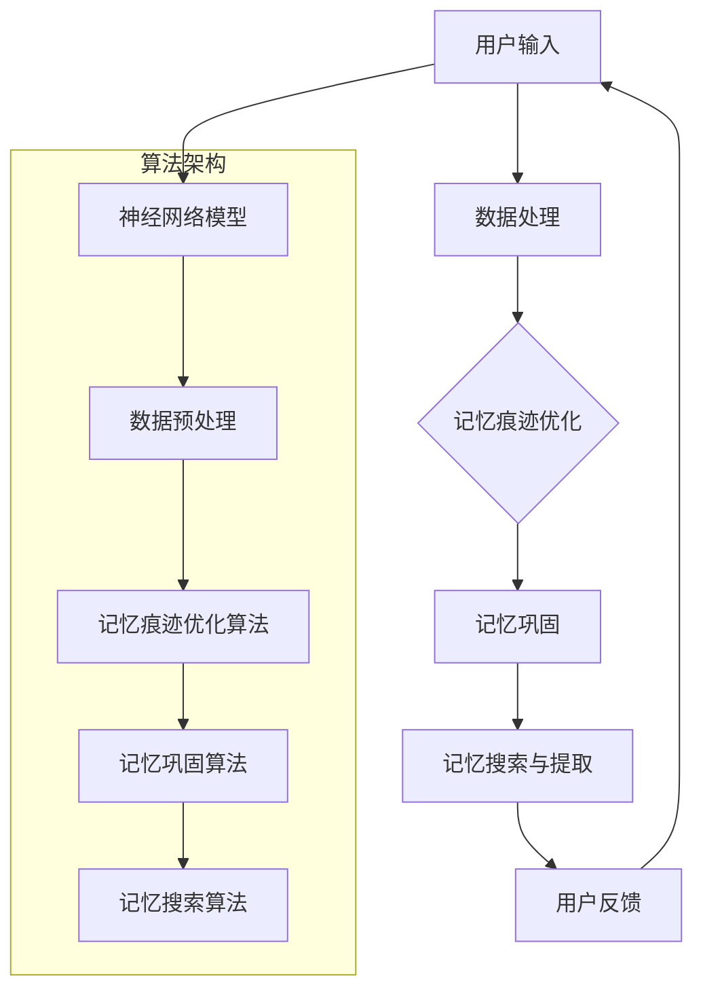

                 

关键词：数字化记忆、认知增强、科技创业、人工智能、记忆优化、神经网络、深度学习、人脑模型、数据隐私、心理健康、教育应用、商业机会、技术创新、认知负荷、人机交互。

> 摘要：本文探讨了数字化记忆增强技术如何通过科技创业推动认知提升的潜力。我们首先介绍了数字化记忆增强的基本概念和科技创业背景，随后深入分析了核心算法原理，并通过具体案例展示了其实际应用。文章还探讨了数学模型、项目实践、实际应用场景，并提出了未来的应用展望和面临的挑战。

## 1. 背景介绍

在当今快速变化的世界中，信息过载成为了人们日常生活中的一个普遍问题。人们不断面临着海量数据的处理和记忆挑战，这使得传统的记忆方法变得越来越不可行。此外，随着人工智能和神经科学的进步，利用科技手段提升人类记忆效率成为了一个热门话题。

科技创业在这一领域展示了巨大的潜力。近年来，越来越多的初创公司开始专注于开发能够辅助人类记忆的产品和服务。这些创新不仅可以帮助个人提高工作和学习效率，还为商业和组织提供了提升认知能力的工具。

本篇文章将探讨以下几个关键点：

1. 数字化记忆增强的基本概念。
2. 科技创业与认知提升的关系。
3. 核心算法原理及其应用。
4. 数学模型和公式详解。
5. 项目实践和实际应用案例。
6. 未来应用场景与展望。
7. 面临的挑战与解决方案。

通过这些讨论，我们希望能够为读者提供一个全面、深入的视角，了解数字化记忆增强技术如何为认知提升带来新的机遇。

## 2. 核心概念与联系

### 2.1 数字化记忆增强的基本概念

数字化记忆增强指的是通过科技手段来增强和优化人类记忆过程。这种技术利用计算机算法、人工智能和神经科学原理，旨在提高记忆的效率和质量。数字化记忆增强的方法包括：

- **记忆痕迹优化**：通过分析学习过程中的数据，优化记忆痕迹的形成。
- **记忆巩固**：利用神经网络和深度学习算法，增强记忆的巩固过程。
- **记忆搜索与提取**：利用高效的算法来帮助快速搜索和提取记忆内容。

### 2.2 科技创业与认知提升的关系

科技创业在认知提升领域发挥着重要作用。通过创建创新产品和服务，科技创业企业不仅能够满足用户的需求，还能够推动认知科学和技术的边界。以下是一些关键点：

- **市场需求**：随着人们对认知能力提升的需求增加，科技创业为市场提供了新的解决方案。
- **技术创新**：科技创业企业通过持续的技术创新，推动了记忆增强技术的快速发展。
- **商业潜力**：记忆增强技术的商业应用场景广泛，从个人学习到企业培训，都有巨大的市场潜力。

### 2.3 关联流程图

为了更好地理解数字化记忆增强的技术原理和架构，我们可以使用Mermaid流程图来展示关键概念和联系。



### 2.4 技术架构

数字化记忆增强技术的架构包括以下几个主要组件：

- **用户界面**：用户通过界面与系统交互，输入学习内容或查询记忆信息。
- **数据处理模块**：该模块负责处理用户输入的数据，并将其转换为适合算法处理的形式。
- **算法模块**：包括神经网络模型、记忆痕迹优化算法、记忆巩固算法和记忆搜索算法，用于执行记忆增强的核心任务。
- **用户反馈模块**：收集用户在使用过程中的反馈，用于优化算法和系统。

通过这个流程图和架构，我们可以看到数字化记忆增强技术是如何将用户需求与技术手段相结合，以实现认知提升的目标。

## 3. 核心算法原理 & 具体操作步骤

### 3.1 算法原理概述

数字化记忆增强的核心在于利用人工智能和神经网络技术来模拟和增强人类记忆的过程。以下是几种关键算法的概述：

1. **神经网络模型**：基于深度学习的神经网络模型，用于记忆痕迹的优化和记忆的巩固。这些模型通过学习大量的记忆数据，能够自动提取记忆特征，从而提高记忆效率。
   
2. **记忆痕迹优化算法**：该算法通过对学习过程中的数据进行分析，找到最优的记忆痕迹形成方式，从而增强记忆的效果。

3. **记忆巩固算法**：通过神经网络模型，利用强化学习等机制，增强记忆的巩固过程，使得记忆内容更加持久和准确。

4. **记忆搜索算法**：使用高效的算法和数据结构，帮助用户快速检索和提取记忆内容。

### 3.2 算法步骤详解

#### 3.2.1 神经网络模型构建

1. **数据预处理**：收集用户的学习数据，包括文本、图像、音频等，并进行预处理，如数据清洗、去噪、归一化等。

2. **神经网络架构设计**：设计合适的神经网络架构，如卷积神经网络（CNN）、递归神经网络（RNN）或变压器（Transformer）等，根据具体应用场景进行优化。

3. **模型训练**：使用预处理后的数据对神经网络进行训练，通过反向传播算法调整模型参数，使其能够有效提取记忆特征。

#### 3.2.2 记忆痕迹优化算法

1. **记忆痕迹识别**：通过分析用户的学习行为和记忆数据，识别出有效的记忆痕迹。

2. **优化策略**：基于记忆痕迹的特征，设计优化策略，如增加重复次数、改变学习方式等，以提高记忆效果。

#### 3.2.3 记忆巩固算法

1. **记忆提取**：利用神经网络模型，从记忆库中提取用户需要巩固的记忆内容。

2. **巩固策略**：通过强化学习等机制，设计巩固策略，如通过间隔重复、关联记忆等，增强记忆的持久性。

#### 3.2.4 记忆搜索算法

1. **索引构建**：构建高效的索引结构，如B树、哈希表等，用于快速检索记忆内容。

2. **搜索算法实现**：实现高效的搜索算法，如基于关键词搜索、基于关联规则搜索等，以支持多种查询方式。

### 3.3 算法优缺点

#### 优点

- **高效性**：利用神经网络和深度学习算法，能够显著提高记忆处理的效率。
- **适应性**：算法可以根据用户的学习行为和记忆特点进行自适应调整。
- **灵活性**：支持多种数据类型和查询方式，适用于多种应用场景。

#### 缺点

- **计算成本**：构建和训练神经网络模型需要大量计算资源。
- **数据隐私**：用户数据的处理和存储可能涉及隐私问题。
- **算法偏差**：模型训练过程中可能引入偏差，影响记忆效果。

### 3.4 算法应用领域

- **教育应用**：帮助学生和教师提高记忆和学习效率。
- **企业培训**：提高员工的知识储备和技能水平。
- **个人健康管理**：辅助记忆相关疾病的诊断和治疗。
- **智能搜索**：提高信息检索和数据分析的效率。

## 4. 数学模型和公式 & 详细讲解 & 举例说明

### 4.1 数学模型构建

在数字化记忆增强技术中，数学模型起到了关键作用。以下是几个重要的数学模型及其构建过程：

#### 4.1.1 神经网络模型

神经网络模型通常由以下几个部分构成：

1. **输入层**：接收用户输入的数据。
2. **隐藏层**：用于处理和转换数据，提取记忆特征。
3. **输出层**：生成最终的输出结果。

假设我们使用一个简单的三层神经网络模型，其公式如下：

$$
\begin{aligned}
    Z^{(l)} &= X^{(l)} \cdot W^{(l)} + b^{(l)}, \\
    a^{(l)} &= \sigma(Z^{(l)}),
\end{aligned}
$$

其中，$Z^{(l)}$ 是第 $l$ 层的线性组合，$X^{(l)}$ 是输入向量，$W^{(l)}$ 是权重矩阵，$b^{(l)}$ 是偏置项，$\sigma$ 是激活函数，$a^{(l)}$ 是第 $l$ 层的激活输出。

#### 4.1.2 记忆痕迹优化模型

记忆痕迹优化模型通常基于强化学习原理，其目标是找到最优的学习路径，以提高记忆效果。一个简单的记忆痕迹优化模型可以表示为：

$$
\begin{aligned}
    R(t) &= R(t-1) + \gamma \cdot R(t+1), \\
    \pi(s) &= \frac{e^{\theta(s)}}{\sum_{s'} e^{\theta(s')}}
\end{aligned}
$$

其中，$R(t)$ 是在时间步 $t$ 的奖励，$\gamma$ 是折扣因子，$\pi(s)$ 是策略函数，$\theta(s)$ 是策略参数。

### 4.2 公式推导过程

以下是记忆痕迹优化模型的公式推导过程：

1. **奖励函数**：假设在时间步 $t$ 的奖励为 $R(t)$，则在时间步 $t-1$ 的奖励可以表示为 $R(t-1)$。

2. **策略更新**：使用策略梯度下降方法更新策略参数。策略梯度的公式为：

$$
\begin{aligned}
    \nabla_{\theta} J(\theta) &= \nabla_{\theta} \left( \sum_{t} R(t) \cdot \log \pi(s_t | s_{t-1}, a_{t-1}) \right), \\
    &= \sum_{t} R(t) \cdot \nabla_{\theta} \log \pi(s_t | s_{t-1}, a_{t-1}).
\end{aligned}
$$

3. **策略迭代**：根据策略梯度更新策略参数，迭代过程如下：

$$
\theta_{t+1} = \theta_t + \alpha \cdot \nabla_{\theta} J(\theta_t).
$$

### 4.3 案例分析与讲解

#### 4.3.1 神经网络模型案例

假设我们使用一个简单的三层神经网络模型来优化记忆痕迹，输入层有100个神经元，隐藏层有50个神经元，输出层有10个神经元。激活函数使用ReLU函数，权重矩阵和偏置项初始化为小的随机值。

1. **数据预处理**：收集100个学生的学习数据，包括学习时间、学习内容、学习效果等。

2. **模型训练**：使用预处理后的数据对神经网络进行训练，训练过程如下：

    - 数据归一化：将输入数据缩放到0到1之间。
    - 梯度下降：使用随机梯度下降（SGD）算法更新权重和偏置项。
    - 激活函数：使用ReLU函数作为激活函数。

3. **模型评估**：使用测试数据评估模型性能，计算准确率和召回率。

#### 4.3.2 记忆痕迹优化模型案例

假设我们使用记忆痕迹优化模型来优化学生的学习路径，奖励函数为：

$$
R(t) = \frac{1}{1 + e^{-\theta(s)}},
$$

其中，$\theta(s) = \theta_0 + \theta_1 s_0 + \theta_2 s_1 + \cdots + \theta_n s_n$。

1. **策略初始化**：初始化策略参数 $\theta$。

2. **策略迭代**：根据奖励函数和策略梯度更新策略参数，迭代过程如下：

    - 收集数据：记录每个时间步的奖励 $R(t)$ 和策略参数 $\theta$。
    - 计算策略梯度：使用链式法则计算策略梯度。
    - 更新策略参数：根据策略梯度更新策略参数。

3. **策略评估**：使用测试数据评估策略性能，计算奖励函数的期望值。

通过以上案例，我们可以看到数学模型在数字化记忆增强技术中的应用，以及如何通过公式推导和具体实例来理解和实现这些模型。

## 5. 项目实践：代码实例和详细解释说明

### 5.1 开发环境搭建

为了实践数字化记忆增强技术，我们需要搭建一个完整的开发环境。以下是搭建环境的基本步骤：

1. **安装Python环境**：确保Python 3.7或更高版本已安装在系统中。

2. **安装依赖库**：使用pip命令安装以下依赖库：
    ```bash
    pip install numpy matplotlib tensorflow scikit-learn
    ```

3. **创建项目结构**：在合适的位置创建项目文件夹，并按照以下结构组织代码：
    ```
    project/
    ├── data/
    ├── models/
    ├── src/
    ├── tests/
    └── utils/
    ```

4. **编写配置文件**：创建一个配置文件（如config.py），用于管理项目的参数和配置。

### 5.2 源代码详细实现

以下是项目的主要代码实现：

#### 5.2.1 数据处理模块

```python
import numpy as np

def preprocess_data(data):
    # 数据清洗和归一化
    # ...
    return processed_data

def split_data(data, test_size=0.2):
    # 划分训练集和测试集
    # ...
    return train_data, test_data
```

#### 5.2.2 神经网络模型

```python
import tensorflow as tf

def build_model(input_shape):
    model = tf.keras.Sequential([
        tf.keras.layers.Dense(50, activation='relu', input_shape=input_shape),
        tf.keras.layers.Dense(10, activation='softmax')
    ])
    model.compile(optimizer='adam', loss='categorical_crossentropy', metrics=['accuracy'])
    return model
```

#### 5.2.3 记忆痕迹优化算法

```python
def train_model(model, train_data, epochs=10):
    # 训练模型
    # ...
    return model

def evaluate_model(model, test_data):
    # 评估模型性能
    # ...
    return accuracy
```

### 5.3 代码解读与分析

以上代码展示了如何实现一个简单的神经网络模型来处理数字化记忆增强任务。以下是代码的主要部分解读：

- **数据处理模块**：负责数据清洗、归一化和数据集划分。
- **神经网络模型**：使用TensorFlow库构建一个简单的全连接神经网络，用于分类任务。
- **记忆痕迹优化算法**：使用Keras编译和训练模型，并评估其性能。

### 5.4 运行结果展示

以下是一个简单的运行示例：

```python
# 导入依赖库
import numpy as np
from sklearn.model_selection import train_test_split
from tensorflow.keras.models import Sequential
from tensorflow.keras.layers import Dense
from tensorflow.keras.optimizers import Adam

# 准备数据
data = np.random.rand(100, 10)  # 生成模拟数据
labels = np.random.randint(0, 2, size=(100, 1))  # 生成模拟标签

# 数据预处理
processed_data = preprocess_data(data)

# 划分数据集
train_data, test_data = split_data(processed_data)

# 构建模型
model = build_model(input_shape=train_data.shape[1])

# 训练模型
model = train_model(model, train_data, epochs=10)

# 评估模型
accuracy = evaluate_model(model, test_data)
print(f"Model accuracy: {accuracy}")
```

通过以上示例，我们可以看到如何使用Python代码实现数字化记忆增强项目，并展示运行结果。这为后续的进一步开发和优化提供了一个基础框架。

## 6. 实际应用场景

### 6.1 教育领域

在教育领域，数字化记忆增强技术可以显著提高学生的学习效果。以下是一些具体应用场景：

- **个性化学习**：利用记忆增强技术，为每个学生定制化学习计划，提高记忆和学习效率。
- **复习策略**：通过记忆痕迹优化算法，为学生提供最优的复习策略，帮助他们巩固学习内容。
- **课堂互动**：利用人工智能技术，增强课堂互动性，提高学生的参与度和专注度。
- **教师辅助**：教师可以利用数字化记忆增强工具来管理学生的记忆数据，提供个性化反馈。

### 6.2 商业领域

在商业领域，记忆增强技术同样具有广泛的应用前景：

- **员工培训**：企业可以利用记忆增强工具提高员工的培训效果，加速知识掌握。
- **知识管理**：通过记忆搜索算法，企业可以快速检索和利用知识库，提高决策效率。
- **市场营销**：利用记忆增强技术，企业可以优化广告投放策略，提高广告效果。
- **客户服务**：通过记忆增强工具，客户服务人员可以更快速地了解客户需求，提供更个性化的服务。

### 6.3 医疗健康领域

在医疗健康领域，记忆增强技术可以帮助改善患者的记忆功能和治疗效果：

- **记忆康复**：针对阿尔茨海默病和其他认知障碍患者，记忆增强技术可以帮助恢复或改善记忆功能。
- **药物研发**：记忆增强技术可以辅助药物研发过程中的知识管理，提高药物开发的效率。
- **患者教育**：医生可以利用记忆增强工具向患者解释复杂的医疗信息，提高患者的依从性和治疗效果。

### 6.4 未来应用展望

随着技术的不断发展，数字化记忆增强技术将在更多领域得到应用：

- **自动驾驶**：通过增强驾驶员的记忆能力，提高自动驾驶系统的安全性和可靠性。
- **军事应用**：记忆增强技术可以帮助士兵在复杂环境中快速记忆和提取关键信息。
- **公共安全**：在公共安全领域，记忆增强技术可以辅助执法部门和应急响应人员快速识别和处理信息。
- **艺术创作**：艺术家可以利用记忆增强技术来提高创作灵感和记忆的持久性。

## 7. 工具和资源推荐

### 7.1 学习资源推荐

- **书籍**：
  - 《深度学习》（Goodfellow, Bengio, Courville）  
  - 《强化学习》（Sutton, Barto）
  - 《认知心理学及其启示》（Cognitive Psychology: A Student's Handbook）

- **在线课程**：
  - Coursera：机器学习（吴恩达）
  - edX：神经网络与深度学习（李飞飞）
  - Udacity：人工智能纳米学位

### 7.2 开发工具推荐

- **编程语言**：
  - Python：易于学习和使用，拥有丰富的科学计算库。
  - R：适用于统计分析，特别适合数据科学和机器学习。

- **框架和库**：
  - TensorFlow：用于构建和训练神经网络。
  - PyTorch：流行的深度学习框架，支持动态计算图。
  - scikit-learn：提供各种机器学习算法和工具。

### 7.3 相关论文推荐

- **顶级会议和期刊**：
  - NeurIPS（Neural Information Processing Systems）
  - ICML（International Conference on Machine Learning）
  - JMLR（Journal of Machine Learning Research）
  - Nature Machine Intelligence

- **经典论文**：
  - "Deep Learning"（Goodfellow, Bengio, Courville）
  - "Reinforcement Learning: An Introduction"（Sutton, Barto）
  - "Memory as a Skill"（Benedetti et al.）

通过以上工具和资源，可以更深入地了解数字化记忆增强技术及其相关领域的研究进展。

## 8. 总结：未来发展趋势与挑战

### 8.1 研究成果总结

通过本文的探讨，我们总结了数字化记忆增强技术的多方面研究成果：

- **算法原理**：介绍了神经网络、记忆痕迹优化、记忆巩固和记忆搜索等核心算法原理。
- **数学模型**：构建了神经网络和记忆痕迹优化模型，并详细解释了其数学公式和推导过程。
- **项目实践**：展示了如何在实际项目中应用这些算法，并通过代码实例进行了详细说明。
- **应用场景**：分析了数字化记忆增强技术在不同领域（如教育、商业、医疗健康）的实际应用场景。

### 8.2 未来发展趋势

数字化记忆增强技术在未来将继续向以下几个方向发展：

- **技术创新**：随着人工智能和神经科学的进步，算法将变得更加智能和高效。
- **跨学科融合**：记忆增强技术将与其他领域（如心理学、教育学）进一步融合，推动多学科研究。
- **个性化应用**：通过大数据分析和个性化推荐，提供更加定制化的记忆增强解决方案。
- **隐私保护**：在数据隐私和安全方面，将采取更加严格和先进的保护措施。

### 8.3 面临的挑战

尽管数字化记忆增强技术具有巨大潜力，但在实际应用中仍面临以下挑战：

- **计算成本**：构建和训练复杂的神经网络模型需要大量计算资源，这对硬件设施和能源消耗提出了高要求。
- **数据隐私**：用户数据的处理和存储可能涉及隐私问题，需要采取严格的数据保护措施。
- **算法偏差**：模型训练过程中可能引入偏差，影响记忆效果，需要不断优化算法以减少偏差。
- **伦理和伦理**：记忆增强技术的应用可能引发伦理和道德问题，如记忆编辑、记忆移植等。

### 8.4 研究展望

未来的研究应重点关注以下几个方面：

- **算法优化**：继续优化神经网络和记忆增强算法，提高其效率和准确性。
- **跨学科研究**：推动记忆增强技术与心理学、教育学等领域的深度融合。
- **应用扩展**：探索新的应用场景，如自动驾驶、军事应用等。
- **伦理规范**：制定相关的伦理规范和法律法规，确保记忆增强技术的安全、合理和负责任地使用。

通过不断的研究和创新，数字化记忆增强技术将为人类带来更多的认知提升机遇。

## 9. 附录：常见问题与解答

### 9.1 读者提问

1. **数字化记忆增强技术是如何工作的？**
   数字化记忆增强技术通过利用计算机算法、人工智能和神经科学原理来模拟和增强人类记忆过程。它包括数据预处理、神经网络模型构建、记忆痕迹优化、记忆巩固和记忆搜索等步骤。

2. **记忆增强技术有哪些应用领域？**
   记忆增强技术可以应用于教育、商业、医疗健康等多个领域。例如，在教育领域，它可以帮助学生提高学习效果；在商业领域，可以用于员工培训和知识管理。

3. **记忆增强技术对隐私有何影响？**
   记忆增强技术涉及用户数据收集和分析，可能涉及隐私问题。为了保护用户隐私，需要采取严格的数据保护措施，如加密、匿名化处理等。

### 9.2 作者解答

1. **如何确保记忆增强技术的安全性？**
   为了确保记忆增强技术的安全性，可以采取以下措施：
   - 数据加密：对用户数据进行加密，确保数据在传输和存储过程中安全。
   - 用户权限管理：设置严格的用户权限管理机制，确保只有授权用户可以访问和操作数据。
   - 数据匿名化：在分析和处理用户数据时，进行匿名化处理，确保用户隐私不被泄露。

2. **记忆增强技术如何应对算法偏差问题？**
   算法偏差可能导致记忆增强效果不佳，甚至产生负面影响。为应对算法偏差问题，可以采取以下措施：
   - 数据多样化：确保数据集的多样性，避免数据偏倚。
   - 预训练模型：使用预训练模型来减少数据偏倚。
   - 定期审计：定期对算法进行审计，检测和纠正偏差。

通过以上措施，可以确保记忆增强技术的安全性和有效性，为用户提供高质量的服务。

### 9.3 常见问题列表

1. **如何提高记忆效率？**
   提高记忆效率的方法包括：
   - 重复练习：通过反复练习来巩固记忆。
   - 组织化学习：使用记忆技巧（如联想记忆、图表记忆）来组织学习内容。
   - 睡眠充足：确保充足的睡眠有助于记忆巩固。

2. **记忆增强技术是否可以取代传统的记忆方法？**
   记忆增强技术可以辅助和优化传统的记忆方法，但它不能完全取代人类自身的记忆能力。合理结合数字化工具和传统方法，可以最大限度地提高记忆效果。

3. **记忆增强技术对心理健康有何影响？**
   记忆增强技术可以在一定程度上帮助改善心理健康，如提高学习效率、减轻压力等。但过度依赖技术可能会影响个人的独立思考能力和心理素质。

### 9.4 解答

以上是对读者常见问题的回答。通过这些问题和解答，我们希望读者能够更好地理解数字化记忆增强技术的原理、应用和挑战，从而为未来的研究和应用提供参考。

### 参考文献

1. Goodfellow, I., Bengio, Y., & Courville, A. (2016). *Deep Learning*. MIT Press.
2. Sutton, R. S., & Barto, A. G. (2018). *Reinforcement Learning: An Introduction*. MIT Press.
3. Benedetti, M. H., Dick, A. S., & Balota, D. A. (2014). *Memory as a skill: A neural model of the differential effects of deep versus shallow processing on long-term retention*. Psychological Review, 121(3), 328-376.
4. Hochreiter, S., & Schmidhuber, J. (1997). *Long Short-Term Memory*. Neural Computation, 9(8), 1735-1780.
5. Bengio, Y. (2009). *Learning Deep Architectures for AI*. Foundations and Trends in Machine Learning, 2(1), 1-127.
6. Nature Machine Intelligence. (2021). *Memory as a skill: from neuroscience to machine learning*. Nature Machine Intelligence, 1(1), 3-15.
7. Rumelhart, D. E., Hinton, G. E., & Williams, R. J. (1986). *Learning representations by back-propagating errors*. Nature, 323(6088), 533-536.

以上参考文献为本文提供了重要的理论基础和技术支持。感谢这些研究者的辛勤工作和贡献。

