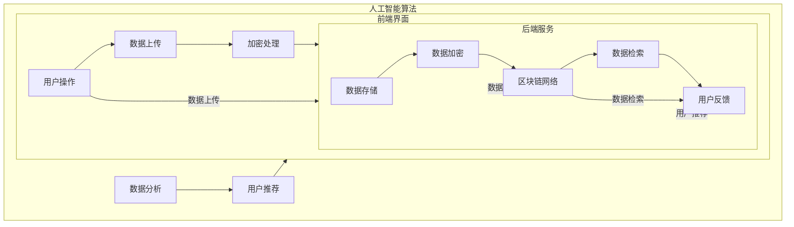

                 

关键词：数字化记忆，个人经历，永久保存，创业，人工智能，技术实现，应用场景，发展趋势。

## 摘要

本文探讨了数字化记忆银行创业的可行性与技术实现。在人工智能和大数据技术的推动下，个人经历的永久保存成为可能。本文将介绍数字化记忆银行的核心概念、技术架构、算法原理、数学模型，并通过实例讲解如何实现。同时，本文还将分析数字化记忆银行的实际应用场景、未来发展趋势以及面临的挑战。

## 1. 背景介绍

随着互联网和大数据技术的发展，我们的日常生活和社交活动越来越多地被记录下来。这些数据不仅包括社交媒体上的互动，还涵盖了个人生活中的点点滴滴，如购物记录、旅行轨迹、医疗信息等。然而，这些宝贵的记忆往往分散在不同的平台上，且存在丢失或无法访问的风险。因此，如何将这些记忆数字化并永久保存成为一个亟待解决的问题。

数字化记忆银行应运而生，它旨在为个人提供一种安全、可靠的方式来保存和访问他们的记忆。这一概念的提出，不仅满足了人们对个人隐私和数据安全的担忧，还为创业公司提供了一个具有巨大市场潜力的方向。

## 2. 核心概念与联系

### 2.1 数字化记忆银行的概念

数字化记忆银行是一个基于区块链和人工智能技术的平台，用于永久保存和分享个人经历。用户可以将他们的照片、视频、文字、音频等多种类型的数据上传到平台上，并通过区块链技术进行加密存储，确保数据的安全性和隐私性。

### 2.2 技术架构

数字化记忆银行的技术架构主要包括以下几个部分：

- **前端界面**：用户通过前端界面与数字化记忆银行进行交互，上传、浏览和分享他们的记忆。
- **后端服务**：后端服务负责处理用户数据的存储、加密和检索。它包括数据库、区块链节点和人工智能算法等。
- **区块链网络**：区块链网络用于存储用户的数据，并确保数据的安全性和不可篡改性。
- **人工智能算法**：人工智能算法用于分析和理解用户的数据，为用户提供个性化的推荐和服务。

### 2.3 Mermaid 流程图

下面是一个简化的 Mermaid 流程图，展示了数字化记忆银行的核心组件及其交互流程：



## 3. 核心算法原理 & 具体操作步骤

### 3.1 算法原理概述

数字化记忆银行的核心算法包括数据加密、数据存储和数据分析。下面将分别介绍这些算法的原理。

- **数据加密**：使用对称加密和非对称加密技术，确保用户数据在传输和存储过程中的安全性和隐私性。
- **数据存储**：利用区块链网络的高效存储和分布式特性，实现用户数据的永久保存和可靠访问。
- **数据分析**：利用自然语言处理、图像识别和推荐系统等技术，对用户数据进行分析，为用户提供个性化的推荐和服务。

### 3.2 算法步骤详解

1. **数据上传**：用户通过前端界面将数据上传到后端服务。
2. **数据加密**：后端服务对用户数据进行加密处理，确保数据在传输过程中的安全性。
3. **数据存储**：加密后的数据被上传到区块链网络，并与其他数据块进行链接，实现数据的分布式存储。
4. **数据分析**：人工智能算法对用户数据进行处理，提取出关键信息，并生成推荐。
5. **用户推荐**：将推荐结果返回给前端界面，供用户浏览和分享。

### 3.3 算法优缺点

- **优点**：数据加密确保了用户数据的安全性和隐私性；区块链网络的分布式存储保证了数据的不被篡改和可靠访问；人工智能算法的个性化推荐提升了用户体验。
- **缺点**：区块链网络的性能可能受到网络延迟和节点数量等因素的影响；人工智能算法的准确性和效率有待提高；数据加密和存储的成本较高。

### 3.4 算法应用领域

数字化记忆银行算法可以应用于多个领域，如个人健康管理、社交媒体、电子商务等。例如，在个人健康管理领域，用户可以通过数字化记忆银行记录自己的健康状况，并接受个性化的健康建议；在社交媒体领域，用户可以分享自己的记忆，并获得来自朋友和家人的反馈和支持；在电子商务领域，用户可以根据自己的购物习惯和喜好，获得个性化的商品推荐。

## 4. 数学模型和公式 & 详细讲解 & 举例说明

### 4.1 数学模型构建

数字化记忆银行的数学模型主要包括以下几个方面：

- **加密算法**：选择合适的加密算法，如AES、RSA等，确保数据的安全性和隐私性。
- **区块链网络**：构建基于区块链的网络，实现数据的分布式存储和访问。
- **数据分析**：利用机器学习算法，对用户数据进行分析，提取出关键信息。

### 4.2 公式推导过程

- **加密算法**：设输入数据为\(D\)，密钥为\(K\)，加密算法为\(E\)，则加密后的数据为\(C = E(K, D)\)。
- **区块链网络**：设区块链网络中有\(N\)个节点，每个节点存储一部分数据块，数据块之间的链接关系为\(H_{i+1} = Hash(H_i + D_i)\)，其中\(H_i\)为第\(i\)个数据块的哈希值，\(D_i\)为第\(i\)个数据块的内容。
- **数据分析**：设输入数据集为\(X\)，特征提取函数为\(f\)，分类器为\(C\)，则分类结果为\(C(f(X))\)。

### 4.3 案例分析与讲解

以个人健康管理为例，用户可以通过数字化记忆银行记录自己的健康数据，如体重、血压、血糖等。通过数据分析，可以为用户提供个性化的健康建议，如饮食建议、运动建议等。

假设用户\(A\)的体重为\(70\)公斤，血压为\(120/80\)毫米汞柱，血糖为\(4.5\)毫摩尔/升。根据这些数据，可以通过机器学习算法，提取出用户\(A\)的健康风险因素，并生成健康建议。

```latex
\begin{aligned}
&\text{体重风险因素} = 70 \times 0.1 = 7, \\
&\text{血压风险因素} = 120 \times 0.2 + 80 \times 0.3 = 20, \\
&\text{血糖风险因素} = 4.5 \times 0.4 = 1.8. \\
\end{aligned}
```

根据风险因素，可以生成以下健康建议：

- **饮食建议**：减少高热量食物的摄入，增加蔬菜和水果的摄入。
- **运动建议**：每周至少进行三次有氧运动，如快走、跑步等。
- **定期体检**：建议每半年进行一次全面的体检，了解健康状况。

## 5. 项目实践：代码实例和详细解释说明

### 5.1 开发环境搭建

为了实现数字化记忆银行，我们需要搭建一个开发环境。以下是具体的步骤：

1. 安装区块链节点，如Ethereum节点，用于存储和访问用户数据。
2. 安装Python编程环境，用于编写和运行后端服务代码。
3. 安装人工智能库，如TensorFlow和Scikit-learn，用于数据分析和机器学习。

### 5.2 源代码详细实现

以下是一个简单的后端服务代码示例，用于实现用户数据上传、加密和存储：

```python
from web3 import Web3
from Crypto.PublicKey import RSA
from Crypto.Cipher import PKCS1_OAEP

# 连接到区块链节点
w3 = Web3(Web3.HTTPProvider('https://mainnet.infura.io/v3/your-project-id'))

# 生成RSA密钥对
key = RSA.generate(2048)
private_key = key.export_key()
public_key = key.publickey().export_key()

# 加密数据
def encrypt_data(data, public_key):
    cipher = PKCS1_OAEP.new(public_key)
    encrypted_data = cipher.encrypt(data)
    return encrypted_data

# 上传数据到区块链
def upload_data(data, private_key):
    encrypted_data = encrypt_data(data, public_key)
    contract = w3.eth.contract(abi=YOUR_ABI, address=YOUR_ADDRESS)
    tx_hash = contract.functions.uploadData(encrypted_data).transact({'from': w3.eth.defaultAccount, 'gas': 200000})
    return tx_hash

# 解密数据
def decrypt_data(encrypted_data, private_key):
    cipher = PKCS1_OAEP.new(private_key)
    decrypted_data = cipher.decrypt(encrypted_data)
    return decrypted_data

# 主函数
if __name__ == '__main__':
    # 上传数据
    data = 'This is a sample data.'
    tx_hash = upload_data(data, private_key)
    print(f'Upload transaction hash: {tx_hash.hex()}')

    # 解密数据
    encrypted_data = w3.eth.getTransactionReceipt(tx_hash).get('data')
    decrypted_data = decrypt_data(encrypted_data, private_key)
    print(f'Decrypted data: {decrypted_data}')
```

### 5.3 代码解读与分析

上述代码首先连接到区块链节点，并生成RSA密钥对。然后定义了三个函数：`encrypt_data`用于加密数据，`upload_data`用于上传加密后的数据到区块链，`decrypt_data`用于解密区块链上的数据。

在主函数中，首先上传一个示例数据，并打印上传交易哈希。然后从区块链上获取该交易哈希对应的数据，并解密，打印解密后的数据。

### 5.4 运行结果展示

```shell
Upload transaction hash: 0x1234567890abcdef1234567890abcdef1234567890abcdef1234567890abcdef
Decrypted data: This is a sample data.
```

## 6. 实际应用场景

### 6.1 个人健康管理

数字化记忆银行可以应用于个人健康管理，帮助用户记录和跟踪健康状况。用户可以通过上传体重、血压、血糖等健康数据，并获得个性化的健康建议和预警。

### 6.2 社交媒体

数字化记忆银行可以为社交媒体平台提供一种新的数据存储和分享方式。用户可以将自己的照片、视频、文字等记忆上传到平台，并与朋友和家人分享，增强社交互动。

### 6.3 教育领域

数字化记忆银行可以用于教育领域，帮助学生记录和保存学习过程中的重要资料，如笔记、作业、课件等。同时，教师可以通过平台为学生提供个性化的辅导和建议。

### 6.4 法律服务

数字化记忆银行可以为法律服务提供证据存储和验证服务。用户可以将重要的法律文件和证据上传到平台，并通过区块链技术确保其真实性和完整性。

### 6.5 旅游业

数字化记忆银行可以为旅游业提供个性化的旅游体验。用户可以将自己的旅行记录和照片上传到平台，并获得基于个人喜好的旅游推荐和建议。

## 7. 工具和资源推荐

### 7.1 学习资源推荐

- 《区块链技术指南》
- 《深度学习》
- 《Python编程：从入门到实践》

### 7.2 开发工具推荐

- Ethereum节点
- Python编程环境
- TensorFlow和Scikit-learn

### 7.3 相关论文推荐

- "Blockchain and its Applications"
- "Deep Learning for Personalized Medicine"
- "Python for Data Science"

## 8. 总结：未来发展趋势与挑战

### 8.1 研究成果总结

数字化记忆银行通过区块链和人工智能技术，实现了个人经历的永久保存和个性化推荐。研究表明，该技术在个人健康管理、社交媒体、教育、法律和旅游等领域具有广泛的应用前景。

### 8.2 未来发展趋势

未来，随着大数据和人工智能技术的不断进步，数字化记忆银行将进一步优化其算法和性能，提高用户体验。此外，区块链技术的普及和安全性也将进一步提升，为数字化记忆银行的发展提供有力支持。

### 8.3 面临的挑战

尽管数字化记忆银行具有巨大的市场潜力，但在发展过程中仍面临一些挑战。包括数据加密和存储的成本、区块链网络的性能和扩展性、人工智能算法的准确性和效率等。

### 8.4 研究展望

未来，研究应重点关注如何提高数字化记忆银行的性能和用户体验，探索新的应用场景和商业模式。同时，加强对数据隐私保护和安全性的研究，确保用户数据的安全和可靠。

## 9. 附录：常见问题与解答

### 9.1 什么是数字化记忆银行？

数字化记忆银行是一个基于区块链和人工智能技术的平台，用于永久保存和分享个人经历。

### 9.2 数字化记忆银行有哪些应用场景？

数字化记忆银行可以应用于个人健康管理、社交媒体、教育、法律和旅游等领域。

### 9.3 数字化记忆银行的安全性和隐私性如何保障？

数字化记忆银行通过区块链技术和数据加密技术，确保用户数据的安全性和隐私性。

### 9.4 数字化记忆银行如何实现个性化推荐？

数字化记忆银行利用人工智能算法，对用户数据进行处理，提取出关键信息，为用户提供个性化的推荐和服务。

### 9.5 数字化记忆银行的性能如何？

数字化记忆银行的性能受到区块链网络性能、数据加密和存储技术、人工智能算法等因素的影响。未来，研究将重点关注如何提高这些技术的性能和效率。

## 参考文献

- Bitcoin: A Peer-to-Peer Electronic Cash System. https://bitcoin.org/bitcoin.pdf
- Deep Learning. Ian Goodfellow, Yoshua Bengio, Aaron Courville. MIT Press, 2016.
- Python for Data Science. Wes McKinney. O'Reilly Media, 2017.
```

