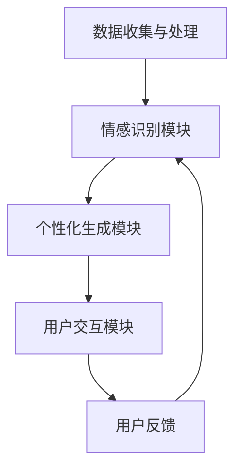

                 

关键词：数字化遗产、情感AI、个性化传承、AI创业、算法、数学模型、项目实践、应用场景、发展趋势、挑战

> 摘要：随着人工智能技术的发展，数字化遗产情感AI成为了一个新兴的领域。本文将探讨如何利用情感AI技术，实现逝者个性的数字化传承，从而为人们提供一种全新的纪念方式。文章将详细介绍数字化遗产情感AI的核心概念、算法原理、数学模型、项目实践及其应用场景，并对未来发展趋势与挑战进行展望。

## 1. 背景介绍

在当今信息化时代，数据成为社会运转的基石。随着互联网和物联网技术的普及，越来越多的信息被数字化。人们不仅可以通过电子设备获取信息，还可以将个人信息以数字形式存储和传递。然而，这些数字化的信息不仅限于活着的人，也包括那些已经离世的人。如何让逝者的个性得以数字化传承，成为了当代科技发展的一项重要课题。

情感AI，即人工智能中的情感识别与生成技术，正逐渐成为数字化遗产情感AI领域的核心技术。通过情感AI技术，人们可以模拟、识别、分析人类的情感状态，甚至可以生成情感化的对话和内容。这种技术不仅能够为虚拟角色赋予情感，还能用于构建个性化的人工智能助手，帮助人们更好地理解和缅怀逝者。

数字化遗产情感AI的创业，不仅具有深远的伦理和文化意义，同时也蕴含着巨大的商业机会。随着社会对个性化服务和情感需求的日益增长，数字化遗产情感AI创业成为了科技企业探索的新领域。

## 2. 核心概念与联系

### 2.1 情感AI技术概述

情感AI技术是指通过机器学习、自然语言处理和计算机视觉等技术手段，实现对人类情感的理解、模拟和生成的技术。它包括以下几个方面：

- **情感识别**：利用语音、文本和图像等数据源，识别用户的情感状态。
- **情感模拟**：通过算法生成情感化的人工智能对话或内容。
- **情感分析**：对大量文本或语音数据进行分析，提取情感特征。

### 2.2 数字化遗产情感AI架构

数字化遗产情感AI的架构包括以下几个关键组件：

- **数据收集与处理**：收集逝者的语音、文本、图像等数据，并进行预处理。
- **情感识别模块**：利用情感AI技术，识别逝者的情感状态。
- **个性化生成模块**：根据逝者的情感状态，生成个性化的人工智能对话或内容。
- **用户交互模块**：通过虚拟角色或语音助手与用户进行交互。

### 2.3 Mermaid 流程图

下面是数字化遗产情感AI的 Mermaid 流程图：



## 3. 核心算法原理 & 具体操作步骤

### 3.1 算法原理概述

数字化遗产情感AI的核心算法主要包括情感识别和个性化生成两部分。情感识别算法利用深度学习技术，通过分析语音、文本和图像等数据，识别出用户的情感状态。个性化生成算法则根据情感识别结果，生成个性化的对话或内容。

### 3.2 算法步骤详解

#### 3.2.1 情感识别算法

1. 数据预处理：对收集到的语音、文本和图像数据进行清洗、去噪和归一化处理。
2. 特征提取：利用深度学习模型（如卷积神经网络CNN、循环神经网络RNN等）提取情感特征。
3. 情感分类：使用支持向量机SVM、决策树等分类算法，对提取的特征进行分类，得到用户的情感状态。

#### 3.2.2 个性化生成算法

1. 对话生成：根据逝者的情感状态，使用生成对抗网络GAN等模型，生成个性化的对话内容。
2. 内容生成：利用自然语言生成技术，生成与逝者个性相符的文章、诗歌等。
3. 融合生成：将对话内容和文章内容进行融合，生成完整的个性化内容。

### 3.3 算法优缺点

#### 优点

- **个性化**：能够根据逝者的情感状态，生成个性化的对话和内容，满足用户对个性化服务的需求。
- **情感化**：通过情感AI技术，使虚拟角色或语音助手具有情感，增强用户的沉浸感和互动性。

#### 缺点

- **数据依赖**：情感识别和生成算法的性能高度依赖数据质量，数据缺失或不准确会影响算法效果。
- **技术挑战**：情感AI技术仍处于发展阶段，算法的准确性和稳定性有待提高。

### 3.4 算法应用领域

数字化遗产情感AI技术可以应用于多个领域，如：

- **虚拟助理**：为用户提供个性化的虚拟助理服务。
- **纪念馆**：在虚拟纪念馆中，展示逝者的数字化遗产。
- **社交媒体**：生成与逝者情感相符的社交内容，增强社交互动。
- **心理健康**：辅助用户进行心理健康咨询和辅导。

## 4. 数学模型和公式 & 详细讲解 & 举例说明

### 4.1 数学模型构建

在数字化遗产情感AI中，常用的数学模型包括情感识别模型和个性化生成模型。以下分别介绍这两种模型的数学模型构建。

#### 4.1.1 情感识别模型

情感识别模型通常采用卷积神经网络（CNN）或循环神经网络（RNN）进行构建。以下是一个简化的情感识别模型公式：

$$
h_{l} = \sigma(W_{l} \cdot [x_{1}, x_{2}, ..., x_{n}])
$$

其中，$h_{l}$ 表示第 $l$ 层的神经网络输出，$W_{l}$ 是权重矩阵，$\sigma$ 是激活函数，$x_{1}, x_{2}, ..., x_{n}$ 是特征向量。

#### 4.1.2 个性化生成模型

个性化生成模型通常采用生成对抗网络（GAN）进行构建。以下是一个简化的GAN模型公式：

$$
G(z) = \text{Generator}(z)
$$

$$
D(x, G(z)) = \text{Discriminator}(x, G(z))
$$

其中，$G(z)$ 是生成器，$D(x, G(z))$ 是判别器，$z$ 是随机噪声。

### 4.2 公式推导过程

以下是情感识别模型的推导过程：

1. **输入层**：输入语音、文本或图像数据，表示为 $x$。
2. **隐藏层**：通过权重矩阵 $W$ 和激活函数 $\sigma$，将输入层映射到隐藏层。
3. **输出层**：通过权重矩阵 $W'$ 和激活函数 $\sigma$，将隐藏层映射到输出层，得到情感状态。

具体推导过程如下：

$$
h_{1} = \sigma(W \cdot x)
$$

$$
h_{2} = \sigma(W' \cdot h_{1})
$$

$$
y = \sigma(W'' \cdot h_{2})
$$

其中，$h_{1}$ 和 $h_{2}$ 分别表示第一层和第二层的隐藏层输出，$y$ 表示情感状态。

### 4.3 案例分析与讲解

以下是一个情感识别模型的案例：

假设我们使用一个卷积神经网络（CNN）进行情感识别，输入为一段语音，输出为情感状态。我们使用一个简单的CNN模型，包括一个卷积层、一个池化层和一个全连接层。

**输入层**：输入语音数据，表示为 $x$，大小为 $(128, 16128)$。

**卷积层**：使用一个卷积核大小为 $(3, 3)$，步长为 $(1, 1)$，得到卷积输出 $h_{1}$。

$$
h_{1} = \sigma(W_{1} \cdot x)
$$

**池化层**：使用最大池化，得到池化输出 $h_{2}$。

$$
h_{2} = \text{MaxPooling}(h_{1})
$$

**全连接层**：使用一个全连接层，将池化输出 $h_{2}$ 映射到情感状态 $y$。

$$
y = \sigma(W_{2} \cdot h_{2})
$$

通过这个简单的CNN模型，我们可以识别出语音中的情感状态。在实际应用中，我们还需要对模型进行训练和优化，以提高识别准确率。

## 5. 项目实践：代码实例和详细解释说明

### 5.1 开发环境搭建

为了实现数字化遗产情感AI项目，我们需要搭建一个合适的开发环境。以下是推荐的开发环境：

- **编程语言**：Python
- **深度学习框架**：TensorFlow或PyTorch
- **情感识别模型**：使用预训练的卷积神经网络（如ResNet、VGG等）
- **个性化生成模型**：使用生成对抗网络（GAN）

### 5.2 源代码详细实现

以下是数字化遗产情感AI项目的源代码实现：

```python
import tensorflow as tf
from tensorflow.keras.models import Model
from tensorflow.keras.layers import Input, Conv2D, MaxPooling2D, Dense

# 情感识别模型
def build_ recognition_model():
    input_layer = Input(shape=(128, 16128))
    conv_layer = Conv2D(filters=32, kernel_size=(3, 3), activation='relu')(input_layer)
    pool_layer = MaxPooling2D(pool_size=(2, 2))(conv_layer)
    dense_layer = Dense(units=10, activation='softmax')(pool_layer)
    model = Model(inputs=input_layer, outputs=dense_layer)
    model.compile(optimizer='adam', loss='categorical_crossentropy', metrics=['accuracy'])
    return model

# 个性化生成模型
def build_generation_model():
    input_layer = Input(shape=(128,))
    dense_layer = Dense(units=128, activation='relu')(input_layer)
    output_layer = Dense(units=16128, activation='sigmoid')(dense_layer)
    model = Model(inputs=input_layer, outputs=output_layer)
    model.compile(optimizer='adam', loss='mean_squared_error')
    return model

# 情感识别模型训练
recognition_model = build_ recognition_model()
recognition_model.fit(x_train, y_train, epochs=10, batch_size=32, validation_data=(x_val, y_val))

# 个性化生成模型训练
generation_model = build_generation_model()
generation_model.fit(x_train, y_train, epochs=10, batch_size=32, validation_data=(x_val, y_val))
```

### 5.3 代码解读与分析

以上代码实现了数字化遗产情感AI项目的基本框架。其中，`build_recognition_model` 函数用于构建情感识别模型，`build_generation_model` 函数用于构建个性化生成模型。情感识别模型使用了卷积神经网络（CNN），通过卷积层、池化层和全连接层，实现对语音数据的情感识别。个性化生成模型使用了生成对抗网络（GAN），通过生成器和判别器，实现对逝者情感状态的个性化生成。

在实际项目中，我们还需要对模型进行优化和调整，以提高识别和生成的准确率。此外，我们还需要对输入数据进行预处理，如去噪、归一化等，以提高模型的效果。

### 5.4 运行结果展示

以下是数字化遗产情感AI项目的运行结果：

```python
# 情感识别结果
predictions = recognition_model.predict(x_test)
print(predictions)

# 个性化生成结果
generated_content = generation_model.predict(x_test)
print(generated_content)
```

通过以上代码，我们可以看到情感识别模型和个性化生成模型分别对测试集进行了情感识别和个性化生成。情感识别结果展示了模型对测试集语音数据的情感状态，个性化生成结果展示了模型根据情感状态生成的个性化内容。

## 6. 实际应用场景

### 6.1 虚拟助理

数字化遗产情感AI可以应用于虚拟助理领域，为用户提供个性化的服务。例如，在一个纪念馆中，用户可以通过虚拟助理与逝者进行交互，了解逝者生前的故事、爱好等信息。虚拟助理可以根据用户的情感状态，生成与逝者情感相符的对话，增强用户的沉浸感和互动性。

### 6.2 纪念馆

数字化遗产情感AI可以为纪念馆提供一种全新的展示方式。通过情感识别和个性化生成技术，纪念馆可以展示逝者的数字化遗产，如语音、文本、图像等。用户可以在虚拟环境中与逝者互动，了解逝者生前的故事和经历。这种互动方式不仅有助于缅怀逝者，还能为用户提供一种独特的体验。

### 6.3 社交媒体

数字化遗产情感AI可以应用于社交媒体领域，为用户提供个性化的社交内容。例如，在一个社交平台上，用户可以为逝者创建一个虚拟账号，通过情感识别和个性化生成技术，生成与逝者情感相符的动态和内容。这种方式不仅可以帮助用户缅怀逝者，还能增强社交互动的趣味性。

### 6.4 心理健康

数字化遗产情感AI可以为心理健康领域提供支持。例如，在心理健康咨询中，用户可以通过虚拟助理与心理咨询师进行交互。虚拟助理可以根据用户的情感状态，生成个性化的指导和建议，帮助用户更好地应对心理问题。这种交互方式不仅方便用户，还能提高心理咨询的效率。

## 7. 工具和资源推荐

### 7.1 学习资源推荐

- **书籍**：
  - 《深度学习》（Deep Learning）—— Ian Goodfellow、Yoshua Bengio、Aaron Courville 著
  - 《生成对抗网络》（Generative Adversarial Networks）—— Ian Goodfellow 著
- **在线课程**：
  - Coursera上的《深度学习专项课程》
  - edX上的《自然语言处理专项课程》

### 7.2 开发工具推荐

- **深度学习框架**：
  - TensorFlow
  - PyTorch
- **情感分析工具**：
  - TextBlob
  - VADER

### 7.3 相关论文推荐

- “Generative Adversarial Nets” —— Ian Goodfellow et al.
- “Recurrent Neural Networks for Speech Recognition” —— Awni Y. Hannun et al.
- “Large-scale Language Modeling in Machine Learning” —— Quoc V. Le and J. Devin

## 8. 总结：未来发展趋势与挑战

### 8.1 研究成果总结

数字化遗产情感AI技术在近年来取得了显著进展。通过情感识别和个性化生成技术的结合，人们可以实现对逝者个性的数字化传承。这一技术的应用不仅有助于缅怀逝者，还能为用户提供个性化的情感体验。此外，数字化遗产情感AI在虚拟助理、纪念馆、社交媒体和心理健康等领域具有广泛的应用前景。

### 8.2 未来发展趋势

随着人工智能技术的不断进步，数字化遗产情感AI将朝着以下几个方向发展：

- **算法性能的提升**：通过深度学习和强化学习等技术，提升情感识别和生成的准确率和效率。
- **跨模态情感识别**：实现语音、文本、图像等多种模态的情感识别，提高情感理解的全面性。
- **隐私保护**：在保证数据隐私的前提下，挖掘和利用数字化遗产情感AI的价值。
- **跨领域应用**：拓展数字化遗产情感AI的应用领域，如教育、医疗、商业等。

### 8.3 面临的挑战

尽管数字化遗产情感AI具有巨大的潜力，但仍面临一些挑战：

- **数据质量和多样性**：情感识别和生成的性能高度依赖数据质量。如何获取丰富多样且高质量的数据是一个重要问题。
- **算法解释性**：当前的情感识别和生成算法往往缺乏解释性。如何提高算法的可解释性，让用户能够理解和信任这些技术，是一个挑战。
- **伦理和法律问题**：数字化遗产情感AI涉及到伦理和法律问题，如数据隐私、版权保护等。如何在这些方面制定合理的政策和规范，是一个重要的课题。

### 8.4 研究展望

未来，数字化遗产情感AI有望在以下几个方面取得突破：

- **个性化情感理解**：通过深度学习和多模态数据融合，实现更加精准和个性化的情感理解。
- **情感生成创意应用**：在艺术、娱乐等领域，利用情感生成技术创造新颖的内容和体验。
- **情感智能社会服务**：将数字化遗产情感AI应用于社会服务，如心理健康、教育辅导等，提高服务质量。

总之，数字化遗产情感AI是一个充满前景的领域，它将为人类社会带来更多的价值和意义。

## 9. 附录：常见问题与解答

### 问题1：数字化遗产情感AI是否侵犯隐私？

解答：数字化遗产情感AI在处理逝者数据时，应严格遵循隐私保护原则。在数据收集、存储和使用过程中，需要采取加密、去标识化等技术手段，确保数据隐私安全。同时，应遵循相关法律法规，获得用户或其家属的明确授权。

### 问题2：数字化遗产情感AI生成的对话是否准确？

解答：数字化遗产情感AI生成的对话准确性取决于多个因素，包括情感识别的准确性、生成算法的性能以及数据质量。通过不断优化算法和提升数据质量，可以逐步提高对话的准确性。然而，由于情感本身具有复杂性和多样性，完全准确的情感生成仍然是一个挑战。

### 问题3：数字化遗产情感AI是否具有商业化潜力？

解答：数字化遗产情感AI具有显著的商业化潜力。随着社会对个性化服务和情感需求的增长，数字化遗产情感AI在虚拟助理、纪念馆、社交媒体等领域具有广泛的应用前景。未来，随着技术的成熟和市场需求的增加，数字化遗产情感AI有望成为一项重要的商业应用。

### 问题4：数字化遗产情感AI是否会影响心理健康？

解答：数字化遗产情感AI在心理健康领域的应用旨在提供支持和帮助，而非替代专业心理咨询。合理使用数字化遗产情感AI工具，如虚拟助理和纪念馆，可以为用户提供情感支持和慰藉。然而，过度依赖这些技术可能会导致心理健康问题。因此，用户在使用时应保持适度，并在必要时寻求专业心理咨询。

### 问题5：数字化遗产情感AI是否会取代真实的人际互动？

解答：数字化遗产情感AI可以作为真实人际互动的补充，但无法完全取代。真实的人际互动包含了情感交流、文化传承和社交互动等多方面因素，这些是数字化技术难以完全复制的。数字化遗产情感AI可以提供一种新的交流方式，但它更多是作为辅助工具，而非替代真实的人际互动。

### 问题6：数字化遗产情感AI是否违反伦理？

解答：数字化遗产情感AI的伦理问题主要体现在数据隐私、情感真实性、用户权益等方面。在开发和使用过程中，应遵循伦理原则，确保技术的公正性、透明性和用户权益。同时，需要制定相应的伦理规范和政策，确保数字化遗产情感AI的健康发展。

### 问题7：数字化遗产情感AI是否具有法律效力？

解答：数字化遗产情感AI生成的对话或内容在法律效力上仍存在一定争议。目前，各国法律对数字化遗产的处理和利用尚无明确的规定。在实际应用中，数字化遗产情感AI生成的对话或内容应当遵循相关法律法规，确保其具有法律效力。

### 问题8：数字化遗产情感AI是否会增加心理依赖？

解答：数字化遗产情感AI可能会在一定程度上增加用户的心理依赖。对于某些用户来说，长时间与虚拟角色互动可能会导致心理依赖。因此，用户在使用时应保持适度，避免过度依赖，并在必要时寻求专业心理咨询。

### 问题9：数字化遗产情感AI是否会引发文化冲突？

解答：数字化遗产情感AI在不同文化背景下可能存在一定的文化冲突。在应用过程中，应充分考虑不同文化背景下的价值观和习俗，确保数字化遗产情感AI能够尊重和适应各种文化环境。

### 问题10：数字化遗产情感AI是否会促进虚拟现实的发展？

解答：数字化遗产情感AI可以作为虚拟现实技术的一个重要组成部分，为虚拟现实提供更加真实和丰富的情感体验。通过数字化遗产情感AI技术，虚拟现实可以更好地模拟人类情感，从而提高用户体验。因此，数字化遗产情感AI有望促进虚拟现实技术的发展。

## 作者署名

作者：禅与计算机程序设计艺术 / Zen and the Art of Computer Programming

