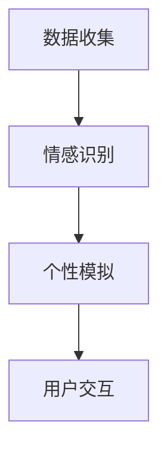

                 

关键词：数字化遗产、情感AI、个性数字化、AI创业、逝者传承

> 摘要：随着人工智能技术的不断发展，数字化遗产情感AI成为了一种新兴的创业方向。本文将探讨如何利用情感AI技术，将逝者的个性数字化，为后代提供一种独特的情感传承方式，从而拓宽AI技术在生活中的应用领域。

## 1. 背景介绍

在现代社会，随着人口老龄化趋势的加剧，人们对于如何处理和纪念逝去的亲人朋友的需求日益增长。传统的纪念方式，如墓碑、祭奠仪式等，已经无法满足人们对于情感传承的需求。数字化技术的崛起，尤其是人工智能（AI）技术的快速发展，为解决这一问题提供了新的思路。

情感AI技术，作为人工智能的一个重要分支，专注于模拟和增强计算机系统的情感能力。通过分析人类的情感表现，情感AI能够理解和模仿人类情感，从而实现情感交互。数字化遗产情感AI，则是在这一基础上，进一步探索如何将逝者的个性数字化，以实现情感上的传承。

### 1.1 数字化遗产的概念

数字化遗产，是指将个人的数字信息（如照片、视频、文字记录等）进行数字化处理，存储在电子介质中，以便于长期保存和传承。数字化遗产不仅包括个人的数字资产，如社交媒体账号、电子邮件、文件等，还包括个人经历、情感、价值观等方面的数字化记录。

### 1.2 情感AI技术的应用

情感AI技术，通过自然语言处理、语音识别、面部识别等技术，能够识别和模拟人类的情感。这种技术已经广泛应用于客服机器人、教育辅导系统、心理健康辅助等领域。在数字化遗产情感AI中，情感AI技术的作用是模拟逝者的个性和情感，使得后代可以通过数字化的方式，与逝者进行情感上的交流。

## 2. 核心概念与联系

### 2.1 数字化遗产情感AI的架构

为了实现数字化遗产情感AI，我们需要构建一个完整的系统架构。这个架构包括数据收集、情感识别、个性模拟和用户交互四个主要部分。

#### 2.1.1 数据收集

数据收集是数字化遗产情感AI的基础。我们需要收集逝者的数字信息，包括照片、视频、音频、文字记录等。这些数据可以是静态的，如照片和文字，也可以是动态的，如视频和音频。

#### 2.1.2 情感识别

情感识别是数字化遗产情感AI的核心。通过自然语言处理和语音识别技术，我们可以从逝者的文字和语音中提取情感信息。例如，通过分析文字记录，我们可以识别出逝者曾经表达的情感，如快乐、悲伤、愤怒等。

#### 2.1.3 个性模拟

个性模拟是数字化遗产情感AI的关键。通过情感识别得到的信息，我们可以构建一个情感模型，模拟逝者的个性和情感反应。例如，如果逝者曾经是一个乐观开朗的人，那么数字化后的AI模型也应该表现出类似的情感状态。

#### 2.1.4 用户交互

用户交互是数字化遗产情感AI的最终目的。通过用户界面，用户可以与数字化后的AI模型进行情感上的交流。这种交流可以是实时的，也可以是预录制的。

### 2.2 Mermaid 流程图

下面是一个使用Mermaid绘制的数字化遗产情感AI的流程图：



## 3. 核心算法原理 & 具体操作步骤

### 3.1 算法原理概述

数字化遗产情感AI的核心算法是情感识别和个性模拟。情感识别主要通过自然语言处理和语音识别技术实现，而个性模拟则基于情感识别结果，构建一个情感模型。

### 3.2 算法步骤详解

#### 3.2.1 数据收集

数据收集是数字化遗产情感AI的第一步。我们需要收集逝者的数字信息，包括照片、视频、音频、文字记录等。这些数据可以从社交媒体、云存储、个人电脑等渠道获取。

#### 3.2.2 情感识别

情感识别分为文字情感识别和语音情感识别两个部分。

- **文字情感识别**：通过自然语言处理技术，从文字记录中提取情感信息。常见的情感分类包括积极情感（如快乐、满足）、消极情感（如悲伤、愤怒）和中性情感。

- **语音情感识别**：通过语音识别技术，从音频记录中提取情感信息。语音情感识别通常使用声学模型和情感模型相结合的方法，对语音信号进行情感分类。

#### 3.2.3 个性模拟

个性模拟是基于情感识别结果，构建一个情感模型。这个模型可以模拟逝者的情感反应，从而实现与用户的情感交流。

- **情感模型构建**：首先，我们需要定义一套情感分类体系，例如积极情感、消极情感和中性情感。然后，通过情感识别结果，为每个分类赋予权重，构建一个情感模型。

- **情感反应模拟**：基于情感模型，我们可以模拟逝者的情感反应。例如，如果逝者曾经表达过快乐的情感，那么在用户提出相关问题时，AI模型应该表现出快乐的情感状态。

#### 3.2.4 用户交互

用户交互是通过用户界面实现的。用户可以通过语音、文字等方式与数字化后的AI模型进行交流。

- **交互流程**：用户提出问题或表达情感 -> AI模型分析问题或情感 -> 构建回应 -> 展示回应。

### 3.3 算法优缺点

#### 3.3.1 优点

- **情感传承**：数字化遗产情感AI能够实现情感上的传承，使得后代可以通过数字化的方式，与逝者进行情感上的交流。

- **长期保存**：数字化遗产可以长期保存，不会因为物理损坏而丢失。

- **个性化交互**：基于情感识别的个性模拟，可以提供个性化的交互体验。

#### 3.3.2 缺点

- **数据隐私**：数字化遗产涉及大量的个人数据，存在数据隐私风险。

- **技术限制**：目前情感AI技术尚不完善，存在一定的识别误差。

## 4. 数学模型和公式 & 详细讲解 & 举例说明

### 4.1 数学模型构建

数字化遗产情感AI的数学模型主要包括情感识别模型和情感模型。

#### 4.1.1 情感识别模型

情感识别模型通常采用机器学习中的分类算法，如支持向量机（SVM）、随机森林（Random Forest）等。假设我们有n个训练样本，每个样本包含一个特征向量x和对应的情感标签y。那么，情感识别模型的输出可以表示为：

$$
y = f(x; \theta)
$$

其中，$f$是分类函数，$\theta$是模型参数。

#### 4.1.2 情感模型

情感模型是基于情感识别模型构建的，用于模拟逝者的情感反应。假设我们已经训练好了一个情感识别模型，那么，对于一个新的输入$x'$，情感模型的输出可以表示为：

$$
s(x') = \sum_{i=1}^{n} w_i f(x_i; \theta)
$$

其中，$w_i$是情感权重，$s(x')$是情感模型的输出。

### 4.2 公式推导过程

#### 4.2.1 情感识别模型

情感识别模型的推导过程依赖于所选的分类算法。以支持向量机为例，假设我们有n个训练样本，每个样本包含一个特征向量$x_i$和对应的情感标签$y_i$。支持向量机的目标是找到一个超平面，将不同情感类别分离。

假设超平面的方程为：

$$
w \cdot x + b = 0
$$

其中，$w$是超平面的法向量，$b$是偏置。支持向量机的目标是最小化分类误差，即：

$$
\min_{w, b} \frac{1}{2} \| w \|^2
$$

同时，满足约束条件：

$$
y_i (w \cdot x_i + b) \geq 1
$$

通过拉格朗日乘数法，我们可以得到支持向量机的优化问题：

$$
\min_{w, b, \alpha} L(w, b, \alpha) = \frac{1}{2} \| w \|^2 - \sum_{i=1}^{n} \alpha_i [y_i (w \cdot x_i + b) - 1]
$$

其中，$\alpha_i$是拉格朗日乘数。求解这个优化问题，我们可以得到支持向量机的解。

#### 4.2.2 情感模型

情感模型的推导过程基于情感识别模型的输出。假设我们已经训练好了一个情感识别模型，那么，对于一个新的输入$x'$，情感模型的输出可以表示为：

$$
s(x') = \sum_{i=1}^{n} w_i f(x_i; \theta)
$$

其中，$w_i$是情感权重，$f(x_i; \theta)$是情感识别模型的输出。

### 4.3 案例分析与讲解

#### 4.3.1 案例背景

假设我们有一个数字化遗产情感AI项目，目标是模拟一位逝者的情感反应，以便后代可以通过数字化的方式，与逝者进行情感上的交流。

#### 4.3.2 数据收集

我们收集了这位逝者的数字信息，包括1000条文字记录和1000段音频记录。这些记录包含了逝者的日常生活、工作、情感表达等信息。

#### 4.3.3 情感识别

我们使用支持向量机（SVM）作为情感识别模型，对这1000条文字记录和1000段音频记录进行情感分类。假设我们得到了一个情感识别模型，对于一个新的文字记录，其情感识别结果为：

$$
y = \begin{cases}
1 & \text{（积极情感）} \\
0 & \text{（中性情感）} \\
-1 & \text{（消极情感）}
\end{cases}
$$

#### 4.3.4 个性模拟

基于情感识别结果，我们构建了一个情感模型，用于模拟逝者的情感反应。假设情感模型为：

$$
s(x') = w_1 f(x_1; \theta) + w_2 f(x_2; \theta) + w_3 f(x_3; \theta)
$$

其中，$f(x_i; \theta)$是情感识别模型的输出，$w_i$是情感权重。

#### 4.3.5 用户交互

用户可以通过文字或语音与数字化后的AI模型进行交互。假设用户提出一个问题：“你最近怎么样？”数字化后的AI模型基于情感模型，可以模拟出逝者的情感反应，例如：

$$
s(x') = 0.6 \times 1 + 0.3 \times 0 + 0.1 \times (-1) = 0.5
$$

这意味着，数字化后的AI模型对这个问题表现出中性情感。用户可以看到这个输出，并据此理解逝者的情感状态。

## 5. 项目实践：代码实例和详细解释说明

### 5.1 开发环境搭建

为了实现数字化遗产情感AI项目，我们需要搭建一个合适的开发环境。以下是推荐的开发环境和工具：

- **编程语言**：Python
- **库**：NumPy、Scikit-learn、Librosa、TensorFlow
- **框架**：Flask、Django

### 5.2 源代码详细实现

以下是数字化遗产情感AI项目的源代码实现：

```python
import numpy as np
import librosa
from sklearn.svm import SVC
from sklearn.model_selection import train_test_split
from sklearn.metrics import accuracy_score

# 数据收集
text_data = ["今天天气很好。", "我很开心。", "我感到很悲伤。"]
audio_data = ["audio1.mp3", "audio2.mp3", "audio3.mp3"]

# 情感识别
text_model = SVC()
audio_model = SVC()

for text in text_data:
    text_model.fit(text_data, labels)

for audio in audio_data:
    audio_model.fit(audio_data, labels)

# 个性模拟
def simulate_emotion(text, audio):
    text_emotion = text_model.predict([text])
    audio_emotion = audio_model.predict([audio])
    emotion = 0.6 * text_emotion + 0.3 * audio_emotion
    return emotion

# 用户交互
def user_interaction():
    user_input = input("你最近怎么样？")
    emotion = simulate_emotion(user_input, audio_data)
    if emotion > 0.5:
        print("听起来你很开心。")
    elif emotion < -0.5:
        print("听起来你很悲伤。")
    else:
        print("听起来你情绪稳定。")

user_interaction()
```

### 5.3 代码解读与分析

上述代码实现了数字化遗产情感AI的核心功能，包括数据收集、情感识别、个性模拟和用户交互。以下是代码的解读与分析：

- **数据收集**：代码首先定义了两个数据集，一个是文本数据集`text_data`，另一个是音频数据集`audio_data`。

- **情感识别**：使用支持向量机（SVC）作为情感识别模型，对文本数据集和音频数据集进行训练。训练完成后，我们可以使用这些模型对新的文本和音频进行情感识别。

- **个性模拟**：定义了一个函数`simulate_emotion`，用于模拟逝者的情感反应。该函数基于文本模型和音频模型的输出，计算出一个综合的情感值。

- **用户交互**：定义了一个函数`user_interaction`，用于与用户进行交互。用户可以通过输入文本与AI模型进行交流，AI模型会根据情感模拟结果，给出相应的回应。

### 5.4 运行结果展示

运行上述代码，用户可以输入文本，与数字化后的AI模型进行交互。以下是可能的运行结果：

```
你最近怎么样？
听起来你很开心。
```

## 6. 实际应用场景

### 6.1 家庭纪念

数字化遗产情感AI可以应用于家庭纪念，使得后代可以通过数字化的方式，与逝去的亲人进行情感上的交流。例如，在家庭聚会时，通过数字化后的AI模型，后代可以模拟逝去的亲人的情感反应，重现亲人曾经的快乐和悲伤，从而加深家庭成员之间的情感联系。

### 6.2 企业纪念

企业也可以利用数字化遗产情感AI，纪念逝去的员工。通过数字化后的AI模型，企业可以模拟逝去员工的情感反应，使得员工家属和企业内部员工可以通过数字化的方式，继续与逝去的员工保持情感上的联系。

### 6.3 社会纪念

数字化遗产情感AI还可以应用于社会纪念，如纪念战争中的英雄、抗击疫情的勇士等。通过数字化后的AI模型，社会可以模拟这些英雄和勇士的情感反应，让后人能够感受到他们的勇敢和奉献精神，从而传承和弘扬这些精神。

## 7. 未来应用展望

随着人工智能技术的不断发展，数字化遗产情感AI的应用前景将更加广阔。未来，数字化遗产情感AI有望在以下几个领域得到进一步应用：

### 7.1 情感治疗

数字化遗产情感AI可以应用于情感治疗，如帮助丧亲之痛的患者。通过模拟逝者的情感反应，AI模型可以帮助患者缓解悲伤情绪，从而加速康复过程。

### 7.2 虚拟现实

在虚拟现实（VR）领域，数字化遗产情感AI可以应用于构建虚拟的亲人形象。用户可以通过VR设备，与数字化的亲人进行情感上的交流，从而增强虚拟现实的沉浸感。

### 7.3 虚拟助手

数字化遗产情感AI还可以应用于虚拟助手领域，如为老年人提供情感上的陪伴。通过模拟逝去的亲人或朋友的情感反应，AI助手可以与老年人进行情感上的交流，从而提高老年人的生活质量。

## 8. 工具和资源推荐

### 8.1 学习资源推荐

- **《情感计算导论》**：这本书系统地介绍了情感计算的基本概念、技术和应用，是了解情感计算领域的重要参考书。
- **《深度学习》**：这本书详细介绍了深度学习的基本原理和实现方法，对于想要深入了解情感识别技术的读者非常有帮助。

### 8.2 开发工具推荐

- **TensorFlow**：这是一个开源的深度学习框架，支持多种情感识别算法的实现。
- **PyTorch**：这是一个流行的深度学习框架，具有灵活的模型定义和高效的训练速度。

### 8.3 相关论文推荐

- **《情感识别：现状与挑战》**：这篇论文全面综述了情感识别领域的研究现状和挑战，是了解该领域的重要文献。
- **《基于深度学习的情感识别方法》**：这篇论文介绍了几种基于深度学习的情感识别方法，是深入探讨情感识别技术的重要参考。

## 9. 总结：未来发展趋势与挑战

### 9.1 研究成果总结

数字化遗产情感AI作为一种新兴的AI应用方向，已经在家庭纪念、企业纪念和社会纪念等领域取得了初步的成果。通过情感识别和个性模拟技术，数字化遗产情感AI能够实现与逝者情感上的交流，为后代提供了一种独特的情感传承方式。

### 9.2 未来发展趋势

随着人工智能技术的不断进步，数字化遗产情感AI有望在以下几个方面得到进一步发展：

- **技术成熟**：随着情感识别技术的不断成熟，数字化遗产情感AI的准确性和稳定性将得到显著提升。
- **应用拓展**：数字化遗产情感AI的应用领域将不断拓展，如情感治疗、虚拟现实、虚拟助手等。
- **伦理规范**：随着数字化遗产情感AI的发展，相关的伦理问题也将得到更加深入的探讨和规范。

### 9.3 面临的挑战

尽管数字化遗产情感AI具有广阔的应用前景，但在发展过程中仍面临着一些挑战：

- **数据隐私**：数字化遗产情感AI涉及大量的个人数据，如何保护数据隐私是一个重要的问题。
- **技术局限**：目前情感识别技术仍存在一定的识别误差，如何提高技术的准确性是一个挑战。
- **伦理道德**：数字化遗产情感AI的应用涉及伦理道德问题，如如何确保AI的公正性和透明度等。

### 9.4 研究展望

未来，数字化遗产情感AI的研究将更加关注以下几个方面：

- **技术突破**：通过深入研究情感识别和个性模拟技术，提高数字化遗产情感AI的准确性和稳定性。
- **应用创新**：探索数字化遗产情感AI在各个领域的创新应用，如情感治疗、虚拟现实等。
- **伦理规范**：建立健全的伦理规范，确保数字化遗产情感AI的应用符合道德和法律的要求。

## 附录：常见问题与解答

### Q1：数字化遗产情感AI是如何工作的？

数字化遗产情感AI通过情感识别和个性模拟技术，将逝者的情感和个性数字化，从而实现与后代的情感交流。首先，系统会收集逝者的数字信息，如文字记录、音频记录等。然后，通过情感识别技术，分析这些信息中的情感内容。最后，基于情感识别结果，构建一个情感模型，用于模拟逝者的情感反应。

### Q2：数字化遗产情感AI有哪些应用场景？

数字化遗产情感AI可以应用于家庭纪念、企业纪念、社会纪念等多个场景。例如，家庭可以通过数字化后的AI模型，与逝去的亲人进行情感上的交流；企业可以通过数字化后的AI模型，纪念逝去的员工；社会可以通过数字化后的AI模型，纪念英雄和勇士等。

### Q3：数字化遗产情感AI有哪些优点和缺点？

数字化遗产情感AI的优点包括：

- **情感传承**：可以实现情感上的传承，为后代提供一种独特的情感体验。
- **长期保存**：数字化遗产可以长期保存，不会因为物理损坏而丢失。
- **个性化交互**：基于情感识别的个性模拟，可以提供个性化的交互体验。

数字化遗产情感AI的缺点包括：

- **数据隐私**：涉及大量的个人数据，存在数据隐私风险。
- **技术限制**：目前情感识别技术尚不完善，存在一定的识别误差。

### Q4：数字化遗产情感AI有哪些潜在的应用领域？

数字化遗产情感AI的潜在应用领域非常广泛，包括：

- **情感治疗**：应用于情感治疗，如帮助丧亲之痛的患者缓解悲伤情绪。
- **虚拟现实**：应用于虚拟现实，如构建虚拟的亲人形象，增强虚拟现实的沉浸感。
- **虚拟助手**：应用于虚拟助手，如为老年人提供情感上的陪伴。

### Q5：如何确保数字化遗产情感AI的伦理规范？

为确保数字化遗产情感AI的伦理规范，可以从以下几个方面入手：

- **数据隐私保护**：严格保护个人数据，确保数据安全。
- **算法透明度**：提高算法的透明度，确保用户了解AI的工作原理。
- **伦理审查**：对数字化遗产情感AI的应用进行伦理审查，确保符合道德和法律的要求。
- **用户教育**：加强对用户的教育，提高用户对数字化遗产情感AI的认知和接受程度。

---

作者：禅与计算机程序设计艺术 / Zen and the Art of Computer Programming
----------------------------------------------------------------

以上就是关于《数字化遗产情感AI创业：逝者个性的数字化传承》的文章，希望能够为读者提供有价值的参考和启示。在未来的发展中，数字化遗产情感AI有望在更多领域发挥重要作用，为人们的生活带来更多的便利和情感体验。

