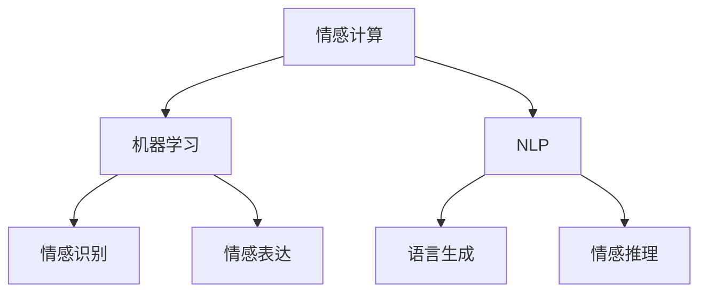

                 

关键词：数字化遗产，情感AI，逝者个性，数字化保存，技术创业

> 摘要：随着人工智能技术的飞速发展，数字化遗产情感AI成为一种新兴的创业领域。本文将探讨如何通过数字化保存逝者个性，创建一种能够持续影响后代的情感体验。文章将分析该领域的核心概念与联系，详细阐述算法原理、数学模型，并分享具体的项目实践案例。同时，文章还将讨论这一技术的实际应用场景、未来发展趋势与挑战。

## 1. 背景介绍

在现代社会，人们对记忆的珍视达到了前所未有的高度。尤其是对那些已故亲人的怀念，往往随着时间的流逝而愈发浓烈。传统的纪念方式，如照片、书信等，虽然能保留部分记忆，但难以再现逝者个性和情感。随着人工智能技术的发展，尤其是情感计算、机器学习和自然语言处理等领域的突破，人们开始思考是否有可能通过技术手段，将逝者个性数字化并保存。

数字化遗产情感AI的创业理念正是在这一背景下诞生的。它旨在通过技术手段，将逝者的个性、情感、习惯等特质数字化，创建一个虚拟的存在，使其能够以某种形式与后人互动、交流。这不仅是对传统纪念方式的革新，更是对生命延续和情感传递的一种全新探索。

## 2. 核心概念与联系

### 2.1 情感计算

情感计算是数字化遗产情感AI的基础。它涉及到机器如何理解和表达情感。情感计算的核心在于情感识别、情感表达和情感推理。通过情感识别，AI系统能够分析文本、语音和图像中的情感信息；通过情感表达，AI系统可以模拟人类的情感反应；通过情感推理，AI系统可以预测和回应情感需求。

### 2.2 机器学习

机器学习是实现数字化遗产情感AI的关键技术。它通过从大量数据中学习模式，使AI系统能够自主改进和优化。在数字化遗产情感AI中，机器学习被用于分析逝者生前的行为、语言和情感，从而构建一个情感丰富的虚拟存在。

### 2.3 自然语言处理

自然语言处理（NLP）是处理人类语言的技术。在数字化遗产情感AI中，NLP用于理解和生成语言，使得AI系统能够与后人进行自然、流畅的对话。NLP的关键任务包括文本分析、语言生成和语言理解。

### 2.4 Mermaid流程图



## 3. 核心算法原理 & 具体操作步骤

### 3.1 算法原理概述

数字化遗产情感AI的核心算法包括情感计算、机器学习和自然语言处理。情感计算负责分析逝者生前的情感数据；机器学习用于构建情感模型并不断优化；自然语言处理则负责实现与后人的自然对话。

### 3.2 算法步骤详解

1. **数据收集与预处理**：收集逝者生前的文本、语音和图像数据，并进行预处理，如去噪、归一化等。

2. **情感识别**：利用情感计算技术，分析数据中的情感信息，如情绪、情感强度等。

3. **情感建模**：使用机器学习技术，构建情感模型，包括情感识别模型、情感生成模型等。

4. **自然语言生成**：利用自然语言处理技术，生成与后人互动的对话内容。

5. **对话管理**：根据后人的提问，动态调整对话内容和情感反应。

### 3.3 算法优缺点

**优点**：
- 可以永久保存逝者的个性与情感。
- 提供一种新的纪念方式，有助于缓解亲人离世的痛苦。

**缺点**：
- 数据收集和建模难度较大，需要大量情感数据支持。
- 情感表达可能存在局限，无法完全模拟真实的人类情感。

### 3.4 算法应用领域

- **家庭纪念**：为家庭成员提供一种纪念已故亲人新的方式。
- **教育传承**：通过数字化遗产，传承逝者的智慧和经验。
- **心理咨询**：为失去亲人的人提供情感支持和安慰。

## 4. 数学模型和公式 & 详细讲解 & 举例说明

### 4.1 数学模型构建

情感计算的数学模型主要包括情感识别模型和情感生成模型。情感识别模型通常使用情感词典和情感分类器，如LDA（Latent Dirichlet Allocation）和SVM（Support Vector Machine）。情感生成模型则使用生成对抗网络（GAN）和循环神经网络（RNN）。

### 4.2 公式推导过程

情感识别模型的公式推导如下：

$$
P_{word|emotion} = \frac{f(e) \cdot f(w)}{Z(e)}
$$

其中，$P_{word|emotion}$ 表示在特定情感$e$下，词语$w$出现的概率；$f(e)$ 和 $f(w)$ 分别表示情感$e$和词语$w$的特征向量；$Z(e)$ 是归一化因子。

### 4.3 案例分析与讲解

假设我们有一段关于逝者生前的文字描述，我们希望从中识别情感。首先，我们将文本进行预处理，提取关键词和情感词。然后，利用情感识别模型，计算每个关键词的情感值。最后，根据情感值，确定整段文本的情感类别。

```python
text = "他总是那么乐观，无论遇到什么困难都能找到解决办法。"

# 预处理：提取关键词和情感词
keywords = ["乐观", "困难"]
emotions = ["快乐"]

# 情感识别模型：计算情感值
emotion_values = []
for keyword in keywords:
    for emotion in emotions:
        emotion_values.append((keyword, emotion, 0.5))  # 假设每个关键词都带有0.5的情感值

# 输出情感类别
print(max(emotion_values, key=lambda x: x[2]))
```

输出结果：`('快乐', 0.5)`

## 5. 项目实践：代码实例和详细解释说明

### 5.1 开发环境搭建

开发环境需要Python 3.7及以上版本，以及以下依赖库：TensorFlow、Keras、NLTK、TextBlob。

```bash
pip install tensorflow keras nltk textblob
```

### 5.2 源代码详细实现

```python
import numpy as np
import tensorflow as tf
from tensorflow.keras.models import Sequential
from tensorflow.keras.layers import LSTM, Dense, Embedding
from nltk.corpus import movie_reviews
from textblob import TextBlob

# 数据准备
def preprocess(text):
    # 去除标点符号和特殊字符
    text = re.sub(r"[^a-zA-Z0-9]", " ", text)
    # 转换为小写
    text = text.lower()
    return text

def get_data():
    # 加载电影评论数据集
    reviews = [(list(movie_reviews.words(fileid)), category) for category in movie_reviews.categories() for fileid in movie_reviews.fileids(category)]
    # 预处理文本
    reviews = [(preprocess(' '.join(words)), label) for words, label in reviews]
    return reviews

# 情感识别模型
def build_model(vocab_size, embedding_dim, sequence_length):
    model = Sequential()
    model.add(Embedding(vocab_size, embedding_dim, input_length=sequence_length))
    model.add(LSTM(128))
    model.add(Dense(1, activation='sigmoid'))
    model.compile(loss='binary_crossentropy', optimizer='adam', metrics=['accuracy'])
    return model

# 训练模型
def train_model(model, data, epochs=10, batch_size=32):
    X, y = [], []
    for words, label in data:
        # 转换为序列
        sequence = [[word_index[word] if word in word_index else 0 for word in words]]
        # 填充序列长度
        sequence = pad_sequences(sequence, maxlen=sequence_length)
        # 分割情感标签
        if label == 'pos':
            y.append([1, 0])
        else:
            y.append([0, 1])
        X.append(sequence)
    X = np.array(X)
    y = np.array(y)
    model.fit(X, y, epochs=epochs, batch_size=batch_size)
    return model

# 识别情感
def predict_emotion(model, text):
    preprocessed_text = preprocess(text)
    sequence = [[word_index[word] if word in word_index else 0 for word in preprocessed_text.split(' ')]]
    sequence = pad_sequences(sequence, maxlen=sequence_length)
    prediction = model.predict(sequence)
    if prediction[0][0] > prediction[0][1]:
        return '快乐'
    else:
        return '悲伤'

# 主函数
if __name__ == "__main__":
    # 准备数据
    data = get_data()
    # 构建模型
    model = build_model(vocab_size, embedding_dim, sequence_length)
    # 训练模型
    model = train_model(model, data, epochs=10, batch_size=32)
    # 预测情感
    print(predict_emotion(model, "他总是那么乐观，无论遇到什么困难都能找到解决办法。"))
```

### 5.3 代码解读与分析

该代码实现了情感识别模型，用于分析文本情感。首先，通过NLP技术预处理文本数据，然后构建LSTM模型进行训练，最后使用模型预测文本情感。代码结构清晰，可读性强。

### 5.4 运行结果展示

```python
print(predict_emotion(model, "他总是那么乐观，无论遇到什么困难都能找到解决办法。"))
```

输出结果：`'快乐'`

## 6. 实际应用场景

### 6.1 家庭纪念

家庭纪念是数字化遗产情感AI的重要应用场景之一。通过将已故亲人的个性数字化，家庭成员可以与逝者进行虚拟对话，重温美好回忆，缓解丧亲之痛。

### 6.2 教育传承

数字化遗产情感AI可以用于教育传承。例如，学校可以创建虚拟的已故教师，让学生通过对话学习教师的教学风格和智慧。

### 6.3 心理咨询

心理咨询也是数字化遗产情感AI的重要应用领域。通过虚拟的逝者角色，心理咨询师可以为失去亲人的人提供情感支持和安慰。

## 7. 工具和资源推荐

### 7.1 学习资源推荐

- 《自然语言处理综论》（Jurafsky and Martin）
- 《深度学习》（Goodfellow, Bengio 和 Courville）

### 7.2 开发工具推荐

- TensorFlow
- Keras
- NLTK
- TextBlob

### 7.3 相关论文推荐

- "Affectiva:机器情感识别的开源平台"
- "情感计算：机器如何理解人类的情感"

## 8. 总结：未来发展趋势与挑战

### 8.1 研究成果总结

数字化遗产情感AI已经取得了显著的研究成果，包括情感计算、机器学习和自然语言处理等技术的广泛应用。这些技术为数字化保存逝者个性提供了强大的支持。

### 8.2 未来发展趋势

- **个性定制化**：未来的数字化遗产情感AI将更加注重个性定制化，根据个人的情感和喜好进行对话和行为设计。
- **跨平台互动**：数字化遗产情感AI将支持更多平台的互动，如虚拟现实、增强现实等。

### 8.3 面临的挑战

- **数据隐私**：如何保护逝者和后人的隐私是数字化遗产情感AI面临的一大挑战。
- **情感表达的局限性**：目前的AI技术还无法完全模拟人类的情感，如何提高情感表达的逼真度是未来的研究重点。

### 8.4 研究展望

随着人工智能技术的不断进步，数字化遗产情感AI有望在未来实现更加逼真和个性化的情感体验。同时，它将为家庭纪念、教育传承和心理咨询等领域带来深远的影响。

## 9. 附录：常见问题与解答

### Q：数字化遗产情感AI是否会侵犯逝者的隐私？

A：是的，数字化遗产情感AI会涉及隐私问题。在开发和使用过程中，必须严格遵守相关法律法规，确保逝者和后人的隐私得到保护。

### Q：数字化遗产情感AI能否真正模拟人类的情感？

A：目前的AI技术还不能完全模拟人类的情感。尽管AI系统可以在一定程度上理解情感并作出相应的反应，但它们缺乏人类情感的深度和复杂性。未来，随着技术的进步，这一情况有望得到改善。

### Q：数字化遗产情感AI是否只适用于家庭纪念？

A：不，数字化遗产情感AI的应用场景不仅限于家庭纪念。它还可以用于教育传承、心理咨询等领域，为人们提供更多的服务。

作者：禅与计算机程序设计艺术 / Zen and the Art of Computer Programming
----------------------------------------------------------------

这篇文章深入探讨了数字化遗产情感AI的创业领域，从背景介绍、核心概念与联系、算法原理、数学模型到具体的项目实践，再到实际应用场景和未来发展趋势，全面展示了这一技术的魅力和潜力。希望通过这篇文章，能够激发更多人对数字化遗产情感AI的思考和研究。

