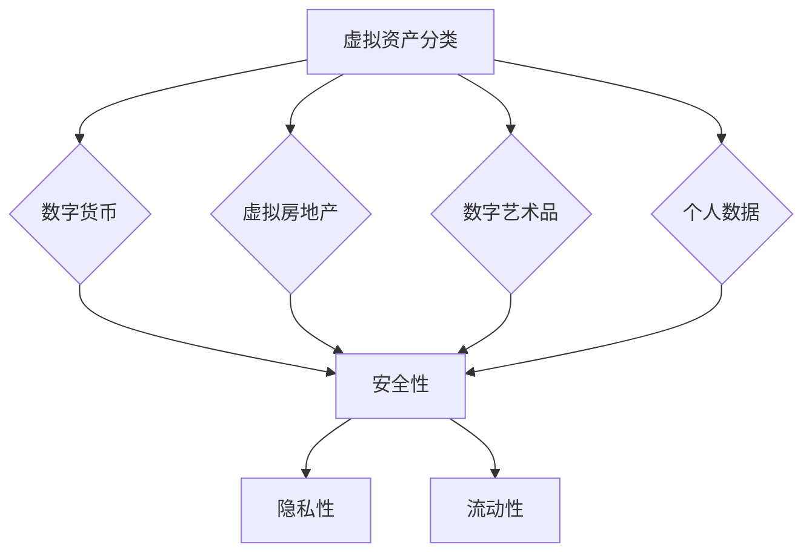

                 

关键词：数字化遗产、虚拟资产、长期管理、创业、IT技术

> 摘要：本文探讨了数字化遗产投资创业领域中的虚拟资产长期管理问题。通过分析虚拟资产的特点和挑战，本文提出了一个系统的框架，用于指导创业者在数字经济时代中有效管理和保护虚拟资产。文章还讨论了相关技术和工具的应用，以及未来发展的趋势和挑战。

## 1. 背景介绍

随着互联网的普及和虚拟经济的发展，虚拟资产已经成为现代社会中不可或缺的一部分。从数字货币到虚拟房地产，再到数字艺术品，这些虚拟资产的价值和影响力日益增加。然而，虚拟资产的管理和保护面临诸多挑战，包括安全性、隐私性、流动性等。

### 1.1 数字化遗产的概念

数字化遗产是指个人或企业在互联网上留下的数字信息，包括电子邮件、社交媒体账户、在线文档、数字资产等。随着互联网用户数量的增加，数字化遗产的问题也逐渐凸显出来。如何合理管理数字化遗产，确保其安全性和可访问性，成为当务之急。

### 1.2 虚拟资产的重要性

虚拟资产在数字经济中的地位日益重要。例如，数字货币如比特币已经成为一种重要的投资工具，虚拟房地产和数字艺术品也吸引了大量投资者。这些虚拟资产不仅具有价值，还承载着用户的身份信息和交易记录。

## 2. 核心概念与联系

在数字化遗产和虚拟资产的管理中，理解以下核心概念和它们之间的联系至关重要。

### 2.1 虚拟资产分类

虚拟资产可以大致分为以下几类：

- **数字货币**：如比特币、以太坊等。
- **虚拟房地产**：虚拟世界中的房产、土地等。
- **数字艺术品**：如NFT（非同质化代币）。
- **个人数据**：用户在互联网上留下的个人信息。

### 2.2 安全性

安全性是虚拟资产管理的核心。这包括保护资产免受黑客攻击、数据泄露和欺诈等威胁。加密技术是确保虚拟资产安全的关键。

### 2.3 隐私性

虚拟资产的管理还需要考虑隐私性，特别是在处理个人数据时。隐私保护措施，如零知识证明，可以帮助用户在不泄露个人信息的情况下进行交易。

### 2.4 流动性

虚拟资产的流动性是指资产能够快速转换为现金或其他资产的能力。提高流动性对于创业者和管理者来说至关重要。

### 2.5 Mermaid 流程图



## 3. 核心算法原理 & 具体操作步骤

### 3.1 算法原理概述

虚拟资产管理的核心算法主要包括：

- **加密算法**：用于保护虚拟资产的安全性。
- **区块链技术**：用于实现虚拟资产的去中心化和不可篡改性。
- **智能合约**：用于自动化虚拟资产的交易和管理。

### 3.2 算法步骤详解

#### 3.2.1 加密算法

1. **选择加密算法**：根据具体需求选择合适的加密算法，如RSA、AES等。
2. **加密过程**：使用加密算法对虚拟资产进行加密，确保只有合法用户才能访问。
3. **密钥管理**：妥善管理加密密钥，确保密钥的安全和隐私。

#### 3.2.2 区块链技术

1. **选择区块链平台**：根据虚拟资产的特点选择合适的区块链平台，如以太坊、EOS等。
2. **创建区块链账户**：为虚拟资产创建区块链账户，确保资产的去中心化管理。
3. **交易记录**：使用区块链技术记录虚拟资产的所有交易，确保交易的透明性和不可篡改性。

#### 3.2.3 智能合约

1. **编写智能合约**：使用智能合约语言（如Solidity）编写智能合约，实现虚拟资产的自动化管理和交易。
2. **部署智能合约**：将智能合约部署到区块链上，使其生效。
3. **合约执行**：根据智能合约的规则自动执行虚拟资产的交易和管理。

### 3.3 算法优缺点

- **加密算法**：优点是能够有效保护虚拟资产的安全性，缺点是加密和解密过程相对复杂，可能影响系统的性能。
- **区块链技术**：优点是去中心化和不可篡改性，缺点是交易速度相对较慢，可能不适合高频交易。
- **智能合约**：优点是能够实现自动化管理和交易，缺点是编写和部署过程相对复杂，可能存在安全漏洞。

### 3.4 算法应用领域

- **数字货币**：加密算法和区块链技术广泛应用于数字货币的交易和管理。
- **虚拟房地产**：区块链技术和智能合约用于虚拟房地产的买卖和租赁管理。
- **数字艺术品**：智能合约和NFT技术用于数字艺术品的交易和版权保护。

## 4. 数学模型和公式 & 详细讲解 & 举例说明

### 4.1 数学模型构建

虚拟资产管理中的数学模型主要包括：

- **加密算法模型**：用于描述加密和解密过程。
- **区块链模型**：用于描述区块链的结构和交易过程。
- **智能合约模型**：用于描述智能合约的规则和执行过程。

### 4.2 公式推导过程

以下是加密算法中的RSA公钥加密和解密公式：

$$
加密：c = (m^e) \mod n
$$

$$
解密：m = (c^d) \mod n
$$

其中，\(m\) 是明文，\(c\) 是密文，\(e\) 和 \(d\) 分别是加密密钥和解密密钥，\(n\) 是模数。

### 4.3 案例分析与讲解

#### 案例一：数字货币交易

假设用户A想要购买数字货币B，使用区块链和智能合约进行交易。

1. **选择区块链平台**：以太坊。
2. **创建区块链账户**：用户A和用户B分别在以太坊上创建账户。
3. **编写智能合约**：编写一个简单的智能合约，用于自动执行交易。
4. **部署智能合约**：将智能合约部署到以太坊上。
5. **执行交易**：用户A调用智能合约执行交易，用户B接收数字货币。

#### 案例二：虚拟房地产租赁

假设用户C想要出租虚拟房地产D。

1. **选择虚拟房地产平台**：Decentraland。
2. **创建虚拟房地产**：用户C在Decentraland上创建虚拟房地产。
3. **编写智能合约**：编写一个智能合约，用于自动执行租赁和管理。
4. **部署智能合约**：将智能合约部署到Decentraland区块链上。
5. **执行租赁**：用户E调用智能合约执行租赁，用户C自动接收租金。

## 5. 项目实践：代码实例和详细解释说明

### 5.1 开发环境搭建

为了演示虚拟资产管理的项目实践，我们选择使用以太坊和Solidity作为开发平台。

1. **安装Node.js**：从官方网站下载并安装Node.js。
2. **安装Truffle框架**：使用npm安装Truffle，这是一个以太坊的开发框架。
3. **创建项目**：使用Truffle创建一个新的智能合约项目。

### 5.2 源代码详细实现

以下是实现一个简单的数字货币交易智能合约的代码：

```solidity
// SPDX-License-Identifier: MIT
pragma solidity ^0.8.0;

contract DigitalCoin {
    mapping(address => uint256) public balanceOf;

    function transfer(address recipient, uint256 amount) public {
        require(balanceOf[msg.sender] >= amount, "Insufficient balance");
        balanceOf[msg.sender] -= amount;
        balanceOf[recipient] += amount;
    }
}
```

### 5.3 代码解读与分析

- **合约结构**：合约使用Solidity语言编写，包含一个`balanceOf`映射和`transfer`函数。
- **映射**：`balanceOf`用于存储每个用户的余额。
- **转移函数**：`transfer`函数用于将余额从一个用户转移到另一个用户。

### 5.4 运行结果展示

假设用户A有100个数字货币，想要转移到用户B的账户中。

1. **部署合约**：在本地或远程以太坊网络上部署智能合约。
2. **调用转移函数**：用户A调用`transfer`函数，将100个数字货币转移到用户B。
3. **查看结果**：通过以太坊区块链浏览器查看交易结果，确认用户B的余额变为100。

## 6. 实际应用场景

### 6.1 数字货币交易

数字货币交易是虚拟资产管理的典型应用场景。通过区块链和智能合约，用户可以安全、透明地完成数字货币的买卖。

### 6.2 虚拟房地产交易

虚拟房地产交易在虚拟世界中越来越受欢迎。通过区块链和智能合约，用户可以在线上购买、租赁和交易虚拟房地产。

### 6.3 数字艺术品交易

数字艺术品交易，如NFT，已经成为一种新兴的投资领域。通过区块链技术，艺术家和收藏家可以安全地交易和验证数字艺术品的版权。

## 7. 工具和资源推荐

### 7.1 学习资源推荐

- **《区块链技术指南》**：了解区块链的基础知识。
- **《智能合约开发实战》**：学习智能合约的开发和部署。

### 7.2 开发工具推荐

- **Truffle**：用于以太坊的智能合约开发和部署。
- **Hardhat**：另一个流行的以太坊开发框架。

### 7.3 相关论文推荐

- **《区块链：一场颠覆性的技术革命》**：深入探讨区块链技术的原理和应用。
- **《智能合约的安全性和可靠性》**：分析智能合约的安全性和潜在风险。

## 8. 总结：未来发展趋势与挑战

### 8.1 研究成果总结

虚拟资产管理在区块链技术和智能合约的发展下取得了显著成果。然而，仍有许多挑战需要克服，如安全性、隐私性和流动性。

### 8.2 未来发展趋势

随着技术的不断进步，虚拟资产管理将在数字经济中扮演越来越重要的角色。未来，我们可能会看到更多创新的虚拟资产类型和应用场景。

### 8.3 面临的挑战

- **安全性**：确保虚拟资产的安全存储和交易。
- **隐私性**：保护用户的隐私数据。
- **流动性**：提高虚拟资产的市场流动性。

### 8.4 研究展望

未来的研究应重点关注虚拟资产管理的算法优化、隐私保护技术和市场流动性提升策略。

## 9. 附录：常见问题与解答

### 9.1 数字化遗产管理中常见问题

- **如何确保数字化遗产的安全性？**
  - 使用强加密算法和区块链技术确保遗产数据的安全。
- **数字化遗产如何继承？**
  - 通过智能合约和法定程序实现数字化遗产的合法继承。

### 9.2 虚拟资产交易常见问题

- **虚拟资产交易是否合法？**
  - 在许多国家和地区，虚拟资产交易是合法的，但需要遵守相关法律法规。
- **如何评估虚拟资产的价值？**
  - 通过市场分析和专业评估机构来确定虚拟资产的价值。

# 作者：禅与计算机程序设计艺术 / Zen and the Art of Computer Programming
----------------------------------------------------------------

这篇文章详细探讨了数字化遗产投资创业领域中的虚拟资产长期管理问题。通过分析虚拟资产的特点和挑战，提出了一个系统的框架，并介绍了相关技术和工具。文章还讨论了虚拟资产的实际应用场景，并展望了未来的发展趋势和挑战。希望这篇文章能帮助创业者更好地理解和应对虚拟资产管理的复杂性。

