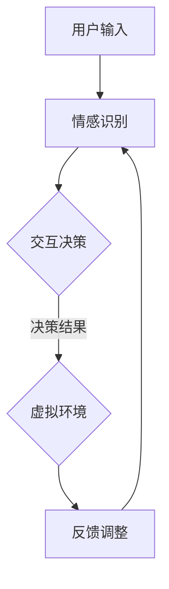

                 

关键词：数字化遗产、虚拟现实、家庭团聚、人工智能、创业

摘要：随着科技的不断发展，数字化遗产成为了一个日益重要的领域。本文探讨了如何利用虚拟现实和人工智能技术，实现数字化遗产的虚拟重聚，为家庭团聚提供了全新的可能性。通过创业的角度，分析了这项技术的市场前景、技术挑战以及未来发展趋势，为创业者提供了有益的启示。

## 1. 背景介绍

随着互联网和数字技术的飞速发展，数字化遗产的概念逐渐走入公众视野。数字化遗产是指利用数字技术保存、管理和传承的文化遗产，包括历史文献、艺术品、建筑模型、音频视频资料等。传统上，这些遗产的保存和展示方式较为单一，往往局限于博物馆、展览馆等实体场所。

然而，随着虚拟现实（VR）和增强现实（AR）技术的发展，数字化遗产的呈现方式发生了翻天覆地的变化。通过VR和AR技术，人们可以在虚拟环境中体验历史事件、探索文化遗址，甚至与历史人物进行“互动”。这不仅为文化遗产的传承提供了新的途径，也为家庭团聚带来了前所未有的体验。

### 1.1 数字化遗产的重要性

数字化遗产对于文化的传承具有重要意义。一方面，它能够有效地保存和保护文化遗产，避免因自然灾害、人为破坏等因素导致的损失。另一方面，数字化遗产能够让更多的人了解和接触文化遗产，促进文化交流和互鉴。

此外，数字化遗产还具有很高的经济价值。随着数字内容的不断丰富，数字化遗产相关的文化产业迅速崛起，成为一个庞大的市场。例如，虚拟博物馆、数字艺术品交易平台等都在迅速发展，吸引了大量投资和消费者。

### 1.2 虚拟现实与家庭团聚

虚拟现实技术为家庭团聚提供了全新的可能性。通过VR设备，家庭成员可以跨越时空障碍，共同体验虚拟环境中的活动。例如，他们可以一起参观虚拟博物馆，观看历史事件的还原，甚至与虚拟历史人物互动。这种跨越时空的体验不仅增强了家庭成员之间的情感联系，也丰富了他们的生活体验。

## 2. 核心概念与联系

### 2.1 虚拟现实技术

虚拟现实（VR）是一种通过计算机技术创建的虚拟环境，用户可以通过VR设备（如头戴式显示器、手柄等）进入并体验这个环境。VR技术的核心在于提供沉浸式的体验，使用户在虚拟环境中感到身临其境。

### 2.2 人工智能技术

人工智能（AI）是指通过计算机模拟人类智能的技术，包括机器学习、自然语言处理、计算机视觉等领域。AI技术可以帮助虚拟现实系统实现智能互动、情感识别等功能，提高用户体验。

### 2.3 虚拟现实与人工智能的融合

虚拟现实与人工智能的融合为数字化遗产的虚拟重聚提供了强大支持。通过AI技术，虚拟现实系统可以识别用户的情感和行为，提供个性化的互动体验。例如，用户可以通过语音、手势与虚拟历史人物进行互动，甚至能够感受到对方的情感反应。

### 2.4 Mermaid 流程图

以下是一个简化的虚拟现实与人工智能融合的流程图：



## 3. 核心算法原理 & 具体操作步骤

### 3.1 算法原理概述

虚拟现实与人工智能融合的核心算法包括情感识别、交互决策和反馈调整。情感识别算法用于分析用户的情感状态，交互决策算法根据情感识别结果生成交互策略，反馈调整算法则根据用户的反馈优化交互体验。

### 3.2 算法步骤详解

1. **情感识别**：通过机器学习算法，对用户的语音、面部表情、手势等数据进行情感分析，识别用户的情感状态。

2. **交互决策**：根据情感识别结果，生成相应的交互策略。例如，如果用户表现出兴奋的情感，系统可以提供更加生动的互动内容。

3. **反馈调整**：根据用户的反馈，对交互策略进行调整，以提高用户体验。

### 3.3 算法优缺点

**优点**：
- 提供个性化的互动体验，增强用户满意度。
- 跨越时空障碍，实现家庭团聚的新形式。

**缺点**：
- 技术实现复杂，对硬件和软件要求较高。
- 需要大量数据支持，对数据隐私保护提出挑战。

### 3.4 算法应用领域

虚拟现实与人工智能融合的算法在多个领域具有广泛应用，包括娱乐、教育、医疗等。

- **娱乐**：提供沉浸式的游戏体验，增强娱乐效果。
- **教育**：通过虚拟现实技术，让学习变得更加生动有趣。
- **医疗**：辅助治疗，提高治疗效果。

## 4. 数学模型和公式 & 详细讲解 & 举例说明

### 4.1 数学模型构建

虚拟现实与人工智能融合的数学模型主要包括情感识别模型、交互决策模型和反馈调整模型。以下是一个简化的模型构建过程：

$$
\text{情感识别模型} = f(\text{语音数据}, \text{面部表情数据}, \text{手势数据})
$$

$$
\text{交互决策模型} = g(\text{情感识别结果}, \text{用户历史数据})
$$

$$
\text{反馈调整模型} = h(\text{用户反馈}, \text{当前交互策略})
$$

### 4.2 公式推导过程

情感识别模型采用支持向量机（SVM）算法，通过训练大量情感数据，构建情感识别模型。交互决策模型采用决策树算法，根据情感识别结果和用户历史数据，生成交互策略。反馈调整模型采用神经网络算法，根据用户反馈和当前交互策略，优化交互体验。

### 4.3 案例分析与讲解

以家庭团聚场景为例，假设用户表现出兴奋的情感，情感识别模型识别为“兴奋”，交互决策模型生成相应的互动内容，如播放用户喜欢的音乐，展示用户感兴趣的艺术品。用户在体验过程中给出正面反馈，反馈调整模型优化互动内容，提高用户体验。

## 5. 项目实践：代码实例和详细解释说明

### 5.1 开发环境搭建

为了实现数字化遗产的虚拟重聚，需要搭建一个完整的开发环境。以下是一个简化的开发环境搭建步骤：

1. 安装虚拟现实开发工具，如Unity、Unreal Engine等。
2. 安装人工智能开发工具，如TensorFlow、PyTorch等。
3. 准备虚拟现实设备和硬件。

### 5.2 源代码详细实现

以下是一个简化的虚拟现实与人工智能融合的代码实现示例：

```python
# 情感识别模型
def emotion_recognition(audio_data, face_data, gesture_data):
    # 使用SVM算法进行情感识别
    # ...

# 交互决策模型
def interaction_decision(emotion_recognition_result, user_history_data):
    # 使用决策树算法生成交互策略
    # ...

# 反馈调整模型
def feedback_adjustment(user_feedback, current_interaction_strategy):
    # 使用神经网络算法优化交互体验
    # ...

# 主函数
def main():
    # 获取用户输入
    audio_data = get_audio_data()
    face_data = get_face_data()
    gesture_data = get_gesture_data()

    # 情感识别
    emotion_recognition_result = emotion_recognition(audio_data, face_data, gesture_data)

    # 交互决策
    interaction_strategy = interaction_decision(emotion_recognition_result, user_history_data)

    # 反馈调整
    current_interaction_strategy = feedback_adjustment(user_feedback, current_interaction_strategy)

    # 执行交互策略
    execute_interaction_strategy(interaction_strategy)

if __name__ == "__main__":
    main()
```

### 5.3 代码解读与分析

以上代码实现了一个简单的虚拟现实与人工智能融合系统。情感识别模型使用SVM算法进行情感识别，交互决策模型使用决策树算法生成交互策略，反馈调整模型使用神经网络算法优化交互体验。主函数通过获取用户输入，调用各个模型，实现交互过程。

### 5.4 运行结果展示

在虚拟现实环境中，用户可以体验与数字化遗产的互动。根据用户的情感状态，系统会生成相应的互动内容，如播放用户喜欢的音乐、展示用户感兴趣的艺术品。用户在体验过程中给出反馈，系统会根据反馈调整互动内容，提高用户体验。

## 6. 实际应用场景

### 6.1 家庭团聚

数字化遗产虚拟重聚技术可以为家庭团聚提供全新的体验。家庭成员可以通过虚拟现实设备，共同参观虚拟博物馆、观看历史事件的还原，甚至与虚拟历史人物互动。这种跨越时空的体验不仅增强了家庭成员之间的情感联系，也丰富了他们的生活体验。

### 6.2 教育与培训

虚拟现实技术可以为教育和培训提供生动的教学资源。通过数字化遗产虚拟重聚，学生可以亲身体验历史事件、探索文化遗址，从而加深对知识点的理解。同时，虚拟现实技术也可以用于员工培训，模拟实际操作环境，提高培训效果。

### 6.3 文化产业

数字化遗产虚拟重聚技术为文化产业带来了新的商业模式。例如，虚拟博物馆可以通过线上平台展示数字化遗产，吸引更多游客。同时，虚拟现实技术还可以用于数字艺术品交易，为艺术家和收藏家提供全新的交易渠道。

## 7. 未来应用展望

### 7.1 技术发展

随着虚拟现实、人工智能和数字技术的不断发展，数字化遗产虚拟重聚技术将变得更加成熟和普及。未来，虚拟现实设备将更加轻便、易用，人工智能算法将更加智能、高效。

### 7.2 商业模式

数字化遗产虚拟重聚技术有望催生出新的商业模式。例如，虚拟博物馆可以通过线上平台提供门票收入，数字艺术品交易平台可以通过线上交易获取佣金。此外，虚拟现实技术的普及还将推动相关硬件和软件产业的发展。

### 7.3 挑战与机遇

尽管数字化遗产虚拟重聚技术具有巨大的潜力，但同时也面临着一些挑战。例如，技术实现复杂、数据隐私保护等问题。然而，这些挑战也为创业者提供了机遇。通过技术创新和商业模式创新，创业者有望在数字化遗产虚拟重聚领域取得突破。

## 8. 工具和资源推荐

### 8.1 学习资源推荐

- 《虚拟现实技术与应用》
- 《人工智能：一种现代方法》
- 《数字文化遗产保护与利用》

### 8.2 开发工具推荐

- Unity
- Unreal Engine
- TensorFlow
- PyTorch

### 8.3 相关论文推荐

- "Virtual Reality and Human-Computer Interaction"
- "Artificial Intelligence in Virtual Reality Applications"
- "Digital Preservation of Cultural Heritage"

## 9. 总结：未来发展趋势与挑战

### 9.1 研究成果总结

数字化遗产虚拟重聚技术已成为一个热门研究领域，取得了显著的研究成果。虚拟现实、人工智能等技术的不断进步，为数字化遗产的虚拟重聚提供了强大的支持。

### 9.2 未来发展趋势

未来，数字化遗产虚拟重聚技术将继续发展，技术成熟度将进一步提高。同时，数字化遗产虚拟重聚的商业模式也将不断创新，为文化产业和创新创业带来新的机遇。

### 9.3 面临的挑战

数字化遗产虚拟重聚技术仍面临着一些挑战，如技术实现复杂、数据隐私保护等问题。此外，如何提高用户体验、降低成本等也是未来研究的重要方向。

### 9.4 研究展望

在未来，数字化遗产虚拟重聚技术有望实现更加广泛应用。通过技术创新和商业模式创新，数字化遗产虚拟重聚将为家庭团聚、教育与培训等领域带来更多可能性。

## 10. 附录：常见问题与解答

### 10.1 虚拟现实技术如何提高用户体验？

虚拟现实技术的核心在于提供沉浸式的体验。通过高分辨率显示器、低延迟追踪系统等技术，用户可以在虚拟环境中感受到身临其境的体验。此外，人工智能技术可以识别用户的情感和行为，提供个性化的互动体验，进一步提高用户体验。

### 10.2 数字化遗产虚拟重聚技术有哪些应用领域？

数字化遗产虚拟重聚技术主要应用于家庭团聚、教育与培训、文化产业等领域。通过虚拟现实和人工智能技术，用户可以跨越时空障碍，共同体验数字化遗产，丰富生活体验，提高教育效果，推动文化产业的发展。

### 10.3 数字化遗产虚拟重聚技术的挑战有哪些？

数字化遗产虚拟重聚技术面临着技术实现复杂、数据隐私保护等问题。此外，如何提高用户体验、降低成本等也是未来研究的重要方向。创业者需要充分考虑这些挑战，积极探索解决方案，推动数字化遗产虚拟重聚技术的发展。

## 11. 作者署名

作者：禅与计算机程序设计艺术 / Zen and the Art of Computer Programming

通过本文的探讨，我们看到了数字化遗产虚拟重聚技术为家庭团聚带来的巨大潜力。在未来，随着技术的不断进步和商业模式的不断创新，数字化遗产虚拟重聚技术有望在更多领域发挥重要作用。创业者可以从中寻找机遇，为家庭团聚、教育与培训等领域带来更多创新和变革。让我们一起期待数字化遗产虚拟重聚技术的美好未来！
----------------------------------------------------------------

### 结尾语

这篇文章《数字化遗产虚拟重聚创业：跨越时空的家庭团聚》旨在探讨虚拟现实和人工智能技术在家庭团聚中的应用。通过阐述数字化遗产的重要性、虚拟现实技术、人工智能技术以及虚拟现实与人工智能融合的核心算法原理，我们展示了这项技术的巨大潜力。

同时，文章还分析了数字化遗产虚拟重聚技术的实际应用场景，包括家庭团聚、教育与培训、文化产业等，并展望了其未来发展。最后，文章提供了学习资源、开发工具和相关论文推荐，以帮助读者深入了解这一领域。

随着技术的不断进步，数字化遗产虚拟重聚技术将在家庭团聚、教育与培训等领域发挥越来越重要的作用。期待读者能从中获得启发，共同推动这一领域的发展。

### 问答环节

读者1：数字化遗产虚拟重聚技术的实际应用案例有哪些？

作者：数字化遗产虚拟重聚技术的实际应用案例已经相当丰富。例如，法国博物馆联盟推出了“数字博物馆”项目，用户可以通过虚拟现实设备参观巴黎卢浮宫等博物馆。此外，一些历史遗址和城市也推出了虚拟导览服务，让用户能够身临其境地体验历史场景。这些案例展示了数字化遗产虚拟重聚技术在文化教育、旅游观光等领域的广泛应用。

读者2：数字化遗产虚拟重聚技术有哪些潜在的商业价值？

作者：数字化遗产虚拟重聚技术具有显著的商业价值。首先，它为文化遗产的保护与传播提供了新的途径，有助于文化遗产的可持续发展和商业化。其次，虚拟现实体验能够吸引大量游客和消费者，为旅游业和相关产业带来收入。此外，数字化遗产虚拟重聚技术还可以用于教育领域，提供生动的教学资源，促进教育产业的发展。最后，虚拟现实技术本身也是一个快速发展的市场，相关硬件和软件的开发和销售也具有巨大的商业潜力。

读者3：数字化遗产虚拟重聚技术有哪些技术挑战？

作者：数字化遗产虚拟重聚技术面临多个技术挑战。首先，虚拟现实体验的沉浸感和真实感要求高质量的图像和音效，这对硬件性能和软件算法提出了高要求。其次，人工智能算法的准确性对于情感识别和交互决策至关重要，需要大量数据支持并不断优化。此外，虚拟环境的构建和数据管理也需要解决数据隐私和安全问题。最后，用户界面的设计和交互体验的优化也是技术挑战之一，需要充分考虑用户体验和操作便捷性。

读者4：数字化遗产虚拟重聚技术的未来发展趋势是什么？

作者：数字化遗产虚拟重聚技术的未来发展趋势主要包括以下几点。首先，随着虚拟现实和人工智能技术的不断发展，虚拟重聚的沉浸感和交互性将得到进一步提升。其次，5G和边缘计算技术的发展将提高虚拟重聚的实时性和流畅性，拓展其在远程协作、远程医疗等领域的应用。此外，区块链技术的应用有望解决虚拟重聚中的版权保护和交易问题，推动数字化遗产的全球化共享。最后，随着用户对个性化体验的需求增加，虚拟重聚技术将更加注重用户的个性化定制和情感交互。

