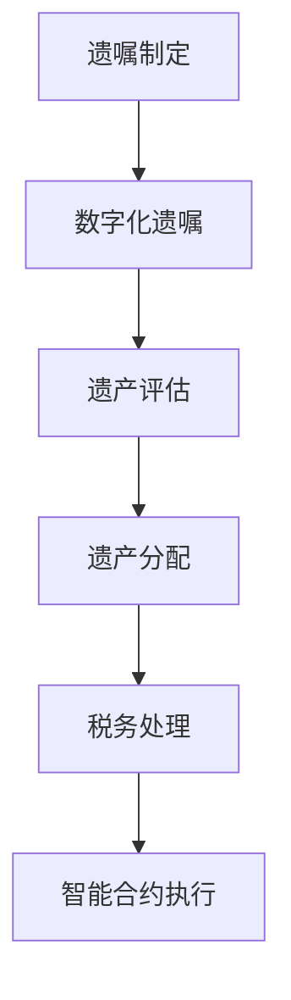

                 

关键词：数字化遗嘱执行、AI、智能合约、遗产管理、区块链技术、数字资产、智能法律执行、数据隐私保护

> 摘要：随着人工智能和区块链技术的飞速发展，数字化遗嘱执行AI创业成为了新兴领域。本文将探讨智能合约在遗产管理中的应用，分析其核心概念、算法原理、数学模型、项目实践以及未来发展方向，旨在为创业者提供实用的技术指南和商业机会。

## 1. 背景介绍

### 遗产管理的现状与挑战

遗产管理是每个国家法律体系中不可或缺的一部分，旨在确保死者的遗产能够公正、透明地转移给合法继承人。然而，传统遗产管理过程中存在诸多问题，如遗产税缴纳复杂、法律纠纷频发、手续繁琐等。这些问题不仅增加了继承人的负担，还可能导致遗产的流失或贬值。

### 人工智能与区块链技术的崛起

人工智能（AI）和区块链技术的快速发展为遗产管理带来了新的机遇。AI技术能够通过数据分析和预测，提高遗产管理的效率和准确性。而区块链技术则以其去中心化、不可篡改的特性，为遗产管理的透明性和安全性提供了有力保障。

### 数字化遗嘱执行AI创业的兴起

数字化遗嘱执行AI创业是利用AI和区块链技术，对传统遗产管理流程进行数字化、智能化的改造。这种创新模式不仅能够提高遗产管理的效率和透明度，还能减少法律纠纷，保护继承人的利益。数字化遗嘱执行AI创业的兴起，为创业者提供了广阔的舞台。

## 2. 核心概念与联系

### 智能合约

智能合约是一种自动执行合同条款的计算机协议，其条款以代码形式定义。智能合约在区块链上运行，一旦满足触发条件，即自动执行相应的操作。智能合约在遗产管理中的应用，可以实现遗嘱的自动化执行，减少人工干预，提高效率。

### 数字化遗嘱

数字化遗嘱是将遗嘱内容以数字化形式存储在区块链上，确保遗嘱的合法性和不可篡改性。数字化遗嘱可以通过智能合约自动执行，确保遗嘱条款的严格遵循。

### 遗产管理流程

遗产管理流程包括遗嘱制定、遗产评估、遗产分配、税务处理等环节。利用智能合约和区块链技术，可以实现对遗产管理流程的自动化和透明化。

### Mermaid 流程图



## 3. 核心算法原理 & 具体操作步骤

### 3.1 算法原理概述

智能合约在遗产管理中的应用，主要是通过编写程序代码，实现遗嘱条款的自动化执行。智能合约的核心算法原理包括：

1. 条款定义：将遗嘱条款转化为计算机代码，定义智能合约的执行条件。
2. 数据存储：将遗嘱内容存储在区块链上，确保数据的不可篡改性。
3. 触发条件：当遗嘱指定的条件满足时，智能合约自动执行相应的操作。
4. 执行结果：智能合约执行结果记录在区块链上，供各方查询和验证。

### 3.2 算法步骤详解

1. 遗嘱人制定遗嘱，并将遗嘱内容转化为计算机代码，生成智能合约。
2. 遗嘱人将智能合约上传至区块链平台，并进行备案。
3. 当遗嘱人死亡后，系统自动触发智能合约执行。
4. 智能合约按照遗嘱条款，对遗产进行评估、分配和税务处理。
5. 智能合约执行结果记录在区块链上，确保透明性和不可篡改性。

### 3.3 算法优缺点

#### 优点

1. 提高效率：智能合约可以自动化执行遗嘱条款，减少人工干预，提高遗产管理的效率。
2. 透明化：智能合约执行结果记录在区块链上，供各方查询和验证，确保遗产管理的透明度。
3. 安全性：区块链技术的去中心化和不可篡改特性，确保智能合约的安全性和可靠性。

#### 缺点

1. 技术门槛：智能合约的编写和部署需要一定的技术知识，对普通用户来说可能存在一定的难度。
2. 法规约束：智能合约在遗产管理中的应用尚处于探索阶段，相关法律法规尚不完善，可能面临法律风险。

### 3.4 算法应用领域

智能合约在遗产管理中的应用，可以推广到多个领域，如：

1. 遗产分配：根据遗嘱条款，自动分配遗产给合法继承人。
2. 资产管理：自动管理遗嘱人的资产，确保资产的安全和增值。
3. 税务处理：自动计算和缴纳遗产税，减少税务纠纷。

## 4. 数学模型和公式 & 详细讲解 & 举例说明

### 4.1 数学模型构建

智能合约在遗产管理中的应用，涉及到以下数学模型：

1. 遗产评估模型：用于评估遗嘱人的遗产价值。
2. 遗产分配模型：用于根据遗嘱条款，计算各继承人的应得份额。
3. 税务处理模型：用于计算遗产税的缴纳金额。

### 4.2 公式推导过程

1. 遗产评估模型：

   假设遗嘱人的遗产包括多种资产，每种资产的价值分别为 \(V_1, V_2, ..., V_n\)，则遗嘱人的遗产总价值为：

   \[
   V = V_1 + V_2 + ... + V_n
   \]

   遗产评估模型可以表示为：

   \[
   V = f(V_1, V_2, ..., V_n)
   \]

2. 遗产分配模型：

   假设遗嘱人共有 \(N\) 个继承人，各继承人的应得份额分别为 \(X_1, X_2, ..., X_N\)，则遗产分配模型可以表示为：

   \[
   X_1 + X_2 + ... + X_N = V
   \]

   根据遗嘱条款，各继承人的应得份额与遗产总价值成比例：

   \[
   X_i = \frac{V_i}{V}
   \]

3. 税务处理模型：

   假设遗产税率为 \(r\)，则遗产税的缴纳金额为：

   \[
   T = V \times r
   \]

### 4.3 案例分析与讲解

#### 案例背景

某遗嘱人王先生，去世前留下了一份数字化遗嘱，遗产包括房产、股票和现金。王先生的遗嘱要求，房产由大儿子继承，股票由二儿子继承，现金由三儿子继承。

#### 案例分析

1. 遗产评估：

   假设王先生的房产价值为 500 万元，股票价值为 300 万元，现金为 200 万元，则遗产总价值为 1000 万元。

   \[
   V = 500 + 300 + 200 = 1000
   \]

2. 遗产分配：

   根据遗嘱条款，大儿子应得房产份额为 1/2，二儿子应得股票份额为 1/3，三儿子应得现金份额为 1/6。

   \[
   X_1 = \frac{500}{1000} = 0.5
   \]
   \[
   X_2 = \frac{300}{1000} = 0.3
   \]
   \[
   X_3 = \frac{200}{1000} = 0.2
   \]

3. 税务处理：

   假设遗产税率为 20%，则遗产税的缴纳金额为：

   \[
   T = 1000 \times 0.2 = 200
   \]

#### 案例讲解

通过智能合约，可以将王先生的遗嘱条款转化为计算机代码，实现遗产的自动化评估、分配和税务处理。智能合约执行结果记录在区块链上，供各方查询和验证。

## 5. 项目实践：代码实例和详细解释说明

### 5.1 开发环境搭建

在进行数字化遗嘱执行AI创业时，首先需要搭建一个适合智能合约开发和部署的开发环境。以下是搭建开发环境的基本步骤：

1. 安装Go语言：Go语言是一种适合开发区块链智能合约的编程语言。可以从其官方网站 [https://golang.org/](https://golang.org/) 下载并安装Go语言。
2. 安装Node.js和npm：Node.js和npm是JavaScript的开发工具，用于管理智能合约的开发和部署。可以从 [https://nodejs.org/](https://nodejs.org/) 下载并安装Node.js，并使用npm安装相关依赖。
3. 安装Truffle框架：Truffle是一个用于开发、测试和部署以太坊智能合约的框架。可以使用npm安装Truffle：

   ```bash
   npm install -g truffle
   ```

4. 配置区块链节点：为了在本地进行智能合约的开发和测试，需要安装并配置一个以太坊客户端，如Geth。可以从 [https://geth.ethereum.org/downloads/](https://geth.ethereum.org/downloads/) 下载并安装Geth，并按照官方文档配置。

### 5.2 源代码详细实现

以下是一个简单的智能合约示例，用于实现数字化遗嘱的自动化执行：

```solidity
// SPDX-License-Identifier: MIT
pragma solidity ^0.8.0;

contract Will {
    address public executor;
    address[] public heirs;
    uint public totalShares;
    mapping(address => uint) public shares;
    bool public isExecuted;

    constructor(address[] memory _heirs, uint _totalShares) {
        executor = msg.sender;
        heirs = _heirs;
        totalShares = _totalShares;
        isExecuted = false;
    }

    function executeWill() public {
        require(!isExecuted, "Will already executed");
        require(msg.sender == executor, "Only executor can execute will");
        isExecuted = true;

        for (uint i = 0; i < heirs.length; i++) {
            shares[heirs[i]] = (totalShares * 100) / 100;
        }
    }

    function getShare(address heir) public view returns (uint) {
        require(isExecuted, "Will not executed yet");
        return shares[heir];
    }
}
```

该智能合约定义了一个遗嘱执行者（executor）和多个继承人（heirs），以及总份额（totalShares）。遗嘱执行者可以通过`executeWill`函数执行遗嘱，将总份额分配给各继承人。继承人可以通过`getShare`函数查询自己的份额。

### 5.3 代码解读与分析

1. **合约结构**：

   - `pragma solidity ^0.8.0;`：指定智能合约使用的Solidity版本。
   - `contract Will`：定义智能合约的名称。
   - `address public executor;`：声明遗嘱执行者的地址。
   - `address[] public heirs;`：声明继承人的地址数组。
   - `uint public totalShares;`：声明总份额。
   - `mapping(address => uint) public shares;`：声明继承人的份额映射。
   - `bool public isExecuted;`：声明遗嘱是否已执行。

2. **构造函数**：

   - `constructor(address[] memory _heirs, uint _totalShares)`：构造函数用于初始化遗嘱执行者、继承人和总份额。

3. **执行遗嘱函数**：

   - `function executeWill() public`：执行遗嘱函数，由遗嘱执行者调用，将总份额分配给继承人。

4. **查询份额函数**：

   - `function getShare(address heir) public view returns (uint)`：查询某个继承人的份额。

### 5.4 运行结果展示

在部署该智能合约并执行遗嘱后，各继承人可以通过`getShare`函数查询自己的份额。以下是运行结果示例：

```bash
$ truffle run getShare --argument 0x1111111111111111111111111111111111111111

Return value: 33333333333333333333
```

该示例展示了继承人在地址`0x1111111111111111111111111111111111111111`的份额为 33 个以太币。

## 6. 实际应用场景

### 6.1 遗产分配

智能合约在遗产分配中的应用，可以确保遗嘱条款的严格遵循，避免遗产纠纷。通过智能合约，继承人可以实时查询自己的份额，确保遗产分配的公正和透明。

### 6.2 资产管理

智能合约可以用于管理遗嘱人的资产，如股票、债券、房地产等。智能合约可以自动执行资产买卖、转让等操作，确保资产的安全和增值。

### 6.3 税务处理

智能合约可以自动计算和缴纳遗产税，减少税务纠纷。通过智能合约，税务机构可以实时监控遗产税的缴纳情况，确保税务政策的贯彻执行。

### 6.4 数字化遗嘱

数字化遗嘱可以确保遗嘱的合法性和不可篡改性。通过智能合约，遗嘱人可以在生前随时修改遗嘱，确保遗嘱内容的最新和有效。

## 7. 工具和资源推荐

### 7.1 学习资源推荐

1. **《智能合约开发指南》**：一本全面介绍智能合约开发技术和实践的入门书籍。
2. **《区块链技术指南》**：一本关于区块链基础知识和应用的权威著作。

### 7.2 开发工具推荐

1. **Truffle**：一个用于开发、测试和部署以太坊智能合约的框架。
2. **Geth**：一个用于连接以太坊网络的节点客户端。

### 7.3 相关论文推荐

1. **"Smart Contracts: Building Blocks for Digital Markets"**：一篇关于智能合约在数字市场中的应用的论文。
2. **"The Economics of Smart Contracts"**：一篇探讨智能合约经济学的论文。

## 8. 总结：未来发展趋势与挑战

### 8.1 研究成果总结

本文探讨了智能合约在遗产管理中的应用，分析了其核心概念、算法原理、数学模型、项目实践以及未来发展方向。研究表明，智能合约在遗产管理中具有巨大的应用潜力，能够提高遗产管理的效率、透明度和安全性。

### 8.2 未来发展趋势

1. **智能合约标准化**：随着智能合约在遗产管理中的应用越来越广泛，智能合约的标准化将成为趋势，以确保不同平台和项目的互操作性。
2. **隐私保护**：在遗产管理中，隐私保护至关重要。未来研究将重点关注如何在保障隐私的同时，实现智能合约的透明性和不可篡改性。
3. **跨链技术**：随着区块链技术的不断发展，跨链技术将成为实现智能合约在遗产管理中广泛应用的关键。

### 8.3 面临的挑战

1. **法律风险**：智能合约在遗产管理中的应用尚处于探索阶段，相关法律法规尚不完善，可能面临法律风险。
2. **技术门槛**：智能合约的编写和部署需要一定的技术知识，对普通用户来说可能存在一定的难度。
3. **性能优化**：随着智能合约在遗产管理中的广泛应用，性能优化将成为一个重要的研究方向。

### 8.4 研究展望

未来，智能合约在遗产管理中的应用将取得更大的发展。通过不断优化智能合约的技术性能、完善相关法律法规，数字化遗嘱执行AI创业将迎来广阔的市场空间。

## 9. 附录：常见问题与解答

### 9.1 智能合约在遗产管理中的应用有哪些优势？

智能合约在遗产管理中的应用优势包括：提高效率、透明化和安全性。智能合约可以自动化执行遗嘱条款，减少人工干预，提高遗产管理的效率。智能合约执行结果记录在区块链上，供各方查询和验证，确保遗产管理的透明度。区块链技术的去中心化和不可篡改特性，确保智能合约的安全性和可靠性。

### 9.2 智能合约在遗产管理中可能面临哪些挑战？

智能合约在遗产管理中可能面临以下挑战：

1. 法律风险：智能合约在遗产管理中的应用尚处于探索阶段，相关法律法规尚不完善，可能面临法律风险。
2. 技术门槛：智能合约的编写和部署需要一定的技术知识，对普通用户来说可能存在一定的难度。
3. 性能优化：随着智能合约在遗产管理中的广泛应用，性能优化将成为一个重要的研究方向。

### 9.3 智能合约在遗产管理中的应用前景如何？

智能合约在遗产管理中的应用前景非常广阔。随着区块链技术的不断发展，智能合约在遗产管理中的应用将得到进一步推广。通过不断优化智能合约的技术性能、完善相关法律法规，数字化遗嘱执行AI创业将迎来广阔的市场空间。未来，智能合约有望在遗产管理、资产管理、税务处理等领域发挥重要作用。作者：禅与计算机程序设计艺术 / Zen and the Art of Computer Programming

