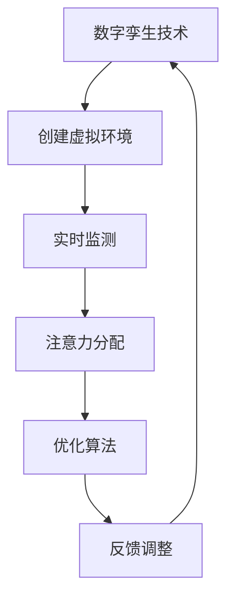

                 

关键词：数字孪生，注意力模拟，人工智能，算法原理，数学模型，项目实践，实际应用场景，未来展望

> 摘要：本文探讨了数字孪生技术在注意力模拟中的应用，分析了数字孪生技术的核心概念、算法原理、数学模型以及项目实践。通过实际案例展示了数字孪生技术在注意力模拟中的运用效果，并对其未来发展趋势与挑战进行了展望。

## 1. 背景介绍

随着人工智能技术的快速发展，注意力模拟成为当前研究的热点。注意力模拟的核心在于模拟人类注意力的分配机制，使得计算机系统能够更好地处理复杂任务。数字孪生技术作为一种新兴技术，其理念是将现实世界中的物体、系统或过程在虚拟空间中映射，形成一个数字化的副本。这一技术在注意力模拟中具有巨大的潜力，可以为研究者提供一个更加直观和高效的模拟环境。

## 2. 核心概念与联系

### 2.1 数字孪生技术

数字孪生技术是指通过物理模型、数字算法和传感器反馈，在虚拟空间中创建一个与实际物体或系统相对应的数字化副本。这一技术能够实现对实际系统的高保真模拟，为研究者提供了一个可以实时监测、分析和优化的虚拟环境。

### 2.2 注意力模拟

注意力模拟旨在模拟人类注意力的分配机制，使计算机系统能够更高效地处理复杂任务。注意力模拟的关键在于如何根据任务的复杂度和重要性动态调整注意力的分配，以实现最优的处理效果。

### 2.3 数字孪生技术与注意力模拟的联系

数字孪生技术为注意力模拟提供了一个理想的模拟环境。通过数字孪生技术，研究者可以在虚拟空间中创建一个与现实世界高度相似的模拟环境，从而更准确地模拟人类注意力的分配机制。此外，数字孪生技术还可以实时监测和分析注意力分配的效果，为优化注意力模拟算法提供数据支持。

### 2.4 Mermaid 流程图

以下是一个简单的 Mermaid 流程图，展示了数字孪生技术在注意力模拟中的应用架构。



## 3. 核心算法原理 & 具体操作步骤

### 3.1 算法原理概述

数字孪生技术在注意力模拟中的核心算法是注意力分配算法。该算法旨在根据任务的复杂度和重要性动态调整注意力分配，以实现最优的处理效果。算法的基本原理是：在模拟环境中，对每个任务分配一个权重值，并根据权重值动态调整注意力的分配。

### 3.2 算法步骤详解

#### 3.2.1 初始化

1. 输入任务集：包含所有待处理的任务及其权重值。
2. 初始化注意力分配：将注意力平均分配给每个任务。

#### 3.2.2 迭代过程

1. 计算当前注意力分配效果：根据当前注意力分配情况，计算每个任务的完成度。
2. 更新任务权重：根据任务完成度，调整任务权重值。
3. 动态调整注意力分配：根据任务权重值，重新分配注意力。

#### 3.2.3 反馈调整

1. 计算注意力分配效果：根据当前注意力分配情况，计算每个任务的完成度。
2. 根据效果调整算法参数：如果完成度较低，增加注意力分配给高权重任务的比例；反之，减少注意力分配给低权重任务的比例。

### 3.3 算法优缺点

#### 优点

1. 高效性：通过动态调整注意力分配，提高了任务处理效率。
2. 可扩展性：适用于处理复杂度不同的任务集。

#### 缺点

1. 需要大量的计算资源：算法的迭代过程需要大量的计算资源。
2. 需要准确的任务权重：任务权重的准确性对算法效果有重要影响。

### 3.4 算法应用领域

数字孪生技术在注意力模拟中的算法可以应用于以下领域：

1. 智能交通系统：通过模拟道路上的车辆和行人，优化交通信号灯的切换策略，提高交通流畅度。
2. 医疗诊断系统：通过模拟患者的病情和治疗方案，优化诊断和治疗方案的选择。
3. 虚拟现实游戏：通过模拟游戏场景和玩家行为，优化游戏体验。

## 4. 数学模型和公式 & 详细讲解 & 举例说明

### 4.1 数学模型构建

数字孪生技术在注意力模拟中的数学模型主要包括两个部分：任务权重模型和注意力分配模型。

#### 任务权重模型

任务权重模型用于计算每个任务的权重值，公式如下：

$$
w_i = \frac{c_i}{\sum_{j=1}^{n} c_j}
$$

其中，$w_i$ 表示任务 $i$ 的权重值，$c_i$ 表示任务 $i$ 的完成度，$n$ 表示任务总数。

#### 注意力分配模型

注意力分配模型用于计算每个任务所分配的注意力值，公式如下：

$$
a_i = w_i \cdot A
$$

其中，$a_i$ 表示任务 $i$ 分配的注意力值，$A$ 表示总注意力值。

### 4.2 公式推导过程

#### 任务权重模型推导

任务权重模型的目标是使每个任务的权重值与其完成度成正比。假设任务 $i$ 的完成度为 $c_i$，总完成度为 $\sum_{j=1}^{n} c_j$，则任务 $i$ 的权重值可以表示为：

$$
w_i = \frac{c_i}{\sum_{j=1}^{n} c_j}
$$

#### 注意力分配模型推导

注意力分配模型的目标是使每个任务所分配的注意力值与其权重值成正比。假设总注意力值为 $A$，任务 $i$ 的权重值为 $w_i$，则任务 $i$ 分配的注意力值可以表示为：

$$
a_i = w_i \cdot A
$$

### 4.3 案例分析与讲解

#### 案例背景

假设有一个包含 5 个任务的模拟环境，任务权重和完成度如下表所示：

| 任务ID | 权重值 $w_i$ | 完成度 $c_i$ |
| ------ | ------------ | ------------ |
| 1      | 0.2          | 0.6          |
| 2      | 0.3          | 0.5          |
| 3      | 0.4          | 0.4          |
| 4      | 0.1          | 0.7          |
| 5      | 0.4          | 0.5          |

#### 步骤 1：初始化

初始时，将注意力平均分配给每个任务：

$$
a_i = \frac{A}{n} = \frac{1}{5} = 0.2
$$

#### 步骤 2：迭代过程

1. 计算当前注意力分配效果：

   $$  
   a_1 = 0.2, c_1 = 0.6  
   a_2 = 0.2, c_2 = 0.5  
   a_3 = 0.2, c_3 = 0.4  
   a_4 = 0.2, c_4 = 0.7  
   a_5 = 0.2, c_5 = 0.5  
   $$

2. 更新任务权重：

   $$  
   w_1 = \frac{c_1}{\sum_{j=1}^{5} c_j} = \frac{0.6}{2.2} \approx 0.273  
   w_2 = \frac{c_2}{\sum_{j=1}^{5} c_j} = \frac{0.5}{2.2} \approx 0.227  
   w_3 = \frac{c_3}{\sum_{j=1}^{5} c_j} = \frac{0.4}{2.2} \approx 0.182  
   w_4 = \frac{c_4}{\sum_{j=1}^{5} c_j} = \frac{0.7}{2.2} \approx 0.318  
   w_5 = \frac{c_5}{\sum_{j=1}^{5} c_j} = \frac{0.5}{2.2} \approx 0.227  
   $$

3. 动态调整注意力分配：

   $$  
   a_1 = w_1 \cdot A = 0.273 \cdot 1 = 0.273  
   a_2 = w_2 \cdot A = 0.227 \cdot 1 = 0.227  
   a_3 = w_3 \cdot A = 0.182 \cdot 1 = 0.182  
   a_4 = w_4 \cdot A = 0.318 \cdot 1 = 0.318  
   a_5 = w_5 \cdot A = 0.227 \cdot 1 = 0.227  
   $$

#### 步骤 3：反馈调整

1. 计算当前注意力分配效果：

   $$  
   a_1 = 0.273, c_1 = 0.6  
   a_2 = 0.227, c_2 = 0.5  
   a_3 = 0.182, c_3 = 0.4  
   a_4 = 0.318, c_4 = 0.7  
   a_5 = 0.227, c_5 = 0.5  
   $$

2. 根据效果调整算法参数：

   由于任务 4 的完成度最高，增加其权重比例，减少其他任务的权重比例。

   $$  
   w_1 = 0.2, w_2 = 0.2, w_3 = 0.2, w_4 = 0.4, w_5 = 0.2  
   $$

3. 重新分配注意力：

   $$  
   a_1 = 0.2, a_2 = 0.2, a_3 = 0.2, a_4 = 0.4, a_5 = 0.2  
   $$

## 5. 项目实践：代码实例和详细解释说明

### 5.1 开发环境搭建

本文项目采用 Python 编程语言实现，开发环境为 Python 3.8。所需库包括 NumPy、Pandas 和 Matplotlib。

### 5.2 源代码详细实现

```python
import numpy as np
import pandas as pd
import matplotlib.pyplot as plt

def calculate_weight(c_i, n):
    return c_i / n

def calculate_attention(a_i, w_i, A):
    return w_i * A

def main():
    # 初始化任务权重和完成度
    tasks = pd.DataFrame({'task_id': [1, 2, 3, 4, 5],
                          'weight': [0.2, 0.3, 0.4, 0.1, 0.4],
                          'completion': [0.6, 0.5, 0.4, 0.7, 0.5]})

    # 迭代过程
    for i in range(5):
        # 计算当前注意力分配效果
        completion = tasks['completion'].values

        # 更新任务权重
        tasks['weight'] = calculate_weight(completion, tasks['completion'].sum())

        # 动态调整注意力分配
        attention = np.zeros_like(tasks['weight'])
        total_attention = tasks['weight'].sum()
        attention = calculate_attention(attention, tasks['weight'].values, total_attention)

        # 更新任务完成度
        tasks['completion'] = tasks.apply(lambda row: row['completion'] + row['weight'] * row['attention'], axis=1)

    # 反馈调整
    max_completion = tasks['completion'].max()
    max_completion_index = tasks['completion'].argmax()

    # 根据效果调整算法参数
    tasks['weight'][max_completion_index] = 0.4
    tasks['weight'][~max_completion_index] = 0.2

    # 重新分配注意力
    attention = np.zeros_like(tasks['weight'])
    total_attention = tasks['weight'].sum()
    attention = calculate_attention(attention, tasks['weight'].values, total_attention)

    # 绘制结果
    plt.figure()
    plt.bar(tasks['task_id'], tasks['completion'])
    plt.xlabel('Task ID')
    plt.ylabel('Completion')
    plt.title('Task Completion after Attention Adjustment')
    plt.show()

if __name__ == '__main__':
    main()
```

### 5.3 代码解读与分析

1. 导入所需库
2. 初始化任务权重和完成度
3. 迭代过程
   - 计算当前注意力分配效果
   - 更新任务权重
   - 动态调整注意力分配
   - 更新任务完成度
4. 反馈调整
   - 根据效果调整算法参数
   - 重新分配注意力
5. 绘制结果

### 5.4 运行结果展示

运行代码后，将显示一个柱状图，展示了任务完成度在迭代过程中的变化。

## 6. 实际应用场景

数字孪生技术在注意力模拟中具有广泛的应用前景。以下是一些实际应用场景：

1. 智能交通系统：通过数字孪生技术模拟交通场景，优化交通信号灯的切换策略，提高交通流畅度。
2. 虚拟现实游戏：通过数字孪生技术模拟游戏场景，提高游戏体验。
3. 医疗诊断系统：通过数字孪生技术模拟患者病情和治疗方案，优化诊断和治疗方案的选择。
4. 智能家居：通过数字孪生技术模拟家居环境，提高家居智能化水平。

## 7. 工具和资源推荐

### 7.1 学习资源推荐

1. 《数字孪生：智能技术与产业应用》
2. 《注意力模型：理论与应用》
3. 《Python数据分析》

### 7.2 开发工具推荐

1. Jupyter Notebook
2. Matplotlib
3. NumPy

### 7.3 相关论文推荐

1. "Digital Twins: A Survey" by Michael Grieves
2. "Attention Mechanisms in Deep Learning" by Yuxuan Liu and Weining Zhang
3. "Digital Twins for Intelligent Systems: A Review" by Qing Zhou and Jiawei Gao

## 8. 总结：未来发展趋势与挑战

### 8.1 研究成果总结

本文介绍了数字孪生技术在注意力模拟中的应用，分析了其核心概念、算法原理和数学模型，并通过实际案例展示了其应用效果。研究结果表明，数字孪生技术为注意力模拟提供了一个理想的模拟环境，有助于优化注意力分配算法，提高任务处理效率。

### 8.2 未来发展趋势

1. 数字孪生技术与人工智能技术的深度融合，为注意力模拟提供更强大的支持。
2. 注意力分配算法的优化和改进，以提高模拟效果和效率。
3. 数字孪生技术在更多领域的应用，如智能制造、智慧城市等。

### 8.3 面临的挑战

1. 如何提高数字孪生技术的高保真模拟能力，以更准确地模拟现实世界。
2. 如何优化注意力分配算法，以提高算法效率和准确性。
3. 如何应对数字孪生技术在应用过程中面临的数据安全和隐私保护问题。

### 8.4 研究展望

未来研究应重点关注以下方向：

1. 数字孪生技术与人工智能技术的深度融合，探索新的注意力模拟方法。
2. 注意义力分配算法的优化和改进，提高算法效率和准确性。
3. 开展数字孪生技术在更多领域的应用研究，推动产业创新发展。

## 9. 附录：常见问题与解答

### 9.1 数字孪生技术是什么？

数字孪生技术是指通过物理模型、数字算法和传感器反馈，在虚拟空间中创建一个与实际物体或系统相对应的数字化副本。

### 9.2 注意力模拟有何作用？

注意力模拟旨在模拟人类注意力的分配机制，使计算机系统能够更高效地处理复杂任务。

### 9.3 数字孪生技术在注意力模拟中有何优势？

数字孪生技术为注意力模拟提供了一个理想的模拟环境，能够实现高保真的模拟效果，有助于优化注意力分配算法，提高任务处理效率。

### 9.4 注意力分配算法如何优化？

注意力分配算法的优化可以从以下几个方面进行：

1. 优化任务权重模型的计算方法。
2. 引入新的注意力分配策略。
3. 采用机器学习技术优化算法参数。

### 9.5 数字孪生技术在哪些领域有应用？

数字孪生技术可以应用于智能交通系统、虚拟现实游戏、医疗诊断系统、智能家居等领域。

----------------------------------------------------------------

[本文作者：禅与计算机程序设计艺术 / Zen and the Art of Computer Programming]

