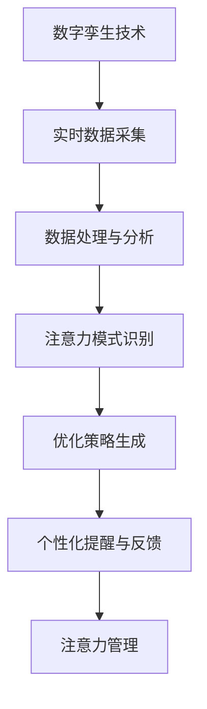

                 

关键词：数字孪生、注意力管理、人工智能、数据分析、系统优化

> 摘要：本文深入探讨了数字孪生技术在注意力管理中的应用。通过介绍数字孪生的核心概念，我们揭示了其在模拟和优化注意力过程方面的潜力。本文将讨论如何利用数字孪生技术构建注意力管理系统，并分析其在不同行业中的应用案例。此外，本文还探讨了未来的研究方向和潜在挑战。

## 1. 背景介绍

### 1.1 数字孪生的概念

数字孪生（Digital Twin）是一种新兴的数字化技术，它通过创建物理实体的虚拟副本，实现对现实世界的实时模拟和监控。数字孪生技术在各个领域都有广泛的应用，包括制造业、医疗保健、交通运输等。通过数字孪生，我们可以实现对物理实体的高效管理和优化。

### 1.2 注意力管理的定义

注意力管理是指对个体或团队在特定任务中集中注意力、提高工作效率的过程。在现代社会，注意力管理变得越来越重要，因为人们面临的信息量和任务量日益增加。有效管理注意力不仅能够提高工作效率，还能减少错误和压力。

### 1.3 数字孪生技术在注意力管理中的潜力

数字孪生技术可以通过模拟和优化注意力过程，为注意力管理提供新的解决方案。例如，通过分析用户的注意力模式，我们可以识别出最佳的工作时间和任务分配策略。此外，数字孪生技术还可以用于监测个体的注意力状态，提供个性化的提醒和反馈，帮助用户更好地管理自己的注意力。

## 2. 核心概念与联系

下面是一个用于描述数字孪生技术在注意力管理中应用的核心概念和联系的 Mermaid 流程图：



### 2.1 实时数据采集

数字孪生技术首先需要收集与注意力相关的实时数据，包括用户的行为、情绪、环境信息等。这些数据可以通过传感器、用户交互界面等多种渠道获取。

### 2.2 数据处理与分析

收集到的数据需要进行预处理和清洗，然后通过数据分析技术提取出有价值的特征。这些特征将用于后续的注意力模式识别。

### 2.3 注意力模式识别

注意力模式识别是数字孪生技术在注意力管理中的关键步骤。通过机器学习和人工智能技术，我们可以从数据中识别出用户的注意力模式，包括注意力峰值和低谷。

### 2.4 优化策略生成

根据识别出的注意力模式，数字孪生技术可以生成个性化的优化策略。这些策略包括最佳的工作时间分配、任务优先级调整等。

### 2.5 个性化提醒与反馈

数字孪生技术可以通过个性化提醒和反馈，帮助用户更好地管理注意力。例如，在用户注意力低峰时提供休息建议，或者在任务高峰时提醒用户保持专注。

### 2.6 注意力管理

最后，数字孪生技术可以将优化策略应用到实际的注意力管理中，帮助用户提高工作效率和生活质量。

## 3. 核心算法原理 & 具体操作步骤

### 3.1 算法原理概述

数字孪生技术在注意力管理中的应用主要基于以下算法原理：

1. 实时数据采集：通过传感器和用户交互界面收集与注意力相关的数据。
2. 数据处理与分析：使用数据清洗和特征提取技术，从原始数据中提取注意力模式。
3. 注意力模式识别：利用机器学习和人工智能技术，识别用户的注意力模式。
4. 优化策略生成：根据注意力模式，生成个性化的优化策略。
5. 个性化提醒与反馈：通过提醒和反馈机制，帮助用户调整注意力。

### 3.2 算法步骤详解

1. **数据采集**：使用传感器（如眼动仪、心率传感器等）和用户交互界面（如键盘、鼠标等）收集与注意力相关的数据。
2. **数据预处理**：对采集到的数据进行预处理，包括数据清洗、归一化和特征提取。
3. **注意力模式识别**：利用机器学习算法（如支持向量机、决策树等），从预处理后的数据中识别注意力模式。
4. **优化策略生成**：根据识别出的注意力模式，使用优化算法（如遗传算法、模拟退火算法等）生成优化策略。
5. **个性化提醒与反馈**：根据优化策略，为用户提供个性化的提醒和反馈。

### 3.3 算法优缺点

**优点**：
1. 实时性：数字孪生技术可以实时采集和处理注意力数据，为用户提供即时的优化策略。
2. 个性化：根据用户个体的注意力模式，生成个性化的优化策略，提高用户的专注力和工作效率。
3. 自动化：通过算法自动化生成和调整优化策略，减少人工干预，提高管理效率。

**缺点**：
1. 数据隐私：数字孪生技术需要收集用户的个人数据，可能引发数据隐私和安全问题。
2. 复杂性：算法的复杂性和数据处理过程可能需要较高的计算资源和技术水平。

### 3.4 算法应用领域

数字孪生技术在注意力管理中的应用领域广泛，包括但不限于：

1. 工作效率提升：在办公室环境中，数字孪生技术可以帮助员工提高工作效率，减少工作压力。
2. 教育领域：在学生注意力的管理和培养方面，数字孪生技术可以提供个性化的学习建议和策略。
3. 健康管理：在医疗领域，数字孪生技术可以用于监测和管理患者的注意力状态，辅助医生进行诊断和治疗。
4. 娱乐和游戏：在游戏设计和娱乐领域，数字孪生技术可以提供个性化的游戏体验，提高用户的参与度和满意度。

## 4. 数学模型和公式 & 详细讲解 & 举例说明

### 4.1 数学模型构建

数字孪生技术在注意力管理中的数学模型主要包括以下几部分：

1. **注意力模式识别模型**：使用机器学习算法（如支持向量机、决策树等）构建注意力模式识别模型。该模型的目标是识别用户在不同时间段和任务中的注意力状态。
2. **优化策略生成模型**：使用优化算法（如遗传算法、模拟退火算法等）构建优化策略生成模型。该模型的目标是根据注意力模式生成个性化的优化策略。
3. **个性化提醒与反馈模型**：使用统计模型（如线性回归、逻辑回归等）构建个性化提醒与反馈模型。该模型的目标是根据用户的行为和注意力状态，生成个性化的提醒和反馈。

### 4.2 公式推导过程

假设我们使用支持向量机（SVM）构建注意力模式识别模型，其决策边界可以表示为：

$$
\mathbf{w}^T \mathbf{x} + b = 0
$$

其中，$\mathbf{w}$ 是权重向量，$\mathbf{x}$ 是特征向量，$b$ 是偏置项。对于非线性问题，我们可以使用核函数（如高斯核函数）将原始特征空间映射到高维特征空间，使得原来的线性不可分问题在高维空间中变得可分。高斯核函数可以表示为：

$$
K(\mathbf{x}_i, \mathbf{x}_j) = \exp(-\gamma \|\mathbf{x}_i - \mathbf{x}_j\|^2)
$$

其中，$\gamma$ 是调节核函数的参数。通过最大化分类间隔，我们可以得到支持向量机的决策边界：

$$
\mathbf{w}^T \mathbf{\phi}(\mathbf{x}) + b = 1
$$

其中，$\mathbf{\phi}(\mathbf{x})$ 是高维特征空间的特征向量。

### 4.3 案例分析与讲解

假设我们有一个任务分配问题，需要根据员工的注意力状态分配最合适的任务。我们可以使用遗传算法来生成优化策略。

1. **初始种群生成**：首先，生成一个包含不同任务分配方案的初始种群。
2. **适应度评估**：根据员工的注意力状态，评估每个任务分配方案的适应度。适应度函数可以表示为：
   $$
   f(\mathbf{x}) = \sum_{i=1}^{n} \alpha_i \cdot (1 - \text{dist}(\mathbf{x}_i, \mathbf{a}_i))
   $$
   其中，$\mathbf{x}$ 是任务分配方案，$\mathbf{a}_i$ 是第 $i$ 个任务的注意力需求，$\text{dist}(\mathbf{x}_i, \mathbf{a}_i)$ 是第 $i$ 个任务与员工注意力的匹配度，$\alpha_i$ 是权重系数。
3. **遗传操作**：使用交叉、变异和选择等遗传操作，生成新的种群。
4. **迭代优化**：重复适应度评估和遗传操作，直到满足停止条件（如达到最大迭代次数或适应度达到阈值）。

## 5. 项目实践：代码实例和详细解释说明

### 5.1 开发环境搭建

1. 安装Python环境，版本3.8或更高。
2. 安装必要的Python库，如NumPy、Scikit-learn、Matplotlib等。

### 5.2 源代码详细实现

以下是一个基于遗传算法的任务分配示例代码：

```python
import numpy as np
import matplotlib.pyplot as plt
from sklearn import svm
from sklearn.model_selection import train_test_split
from sklearn.metrics import accuracy_score

# 生成模拟数据
np.random.seed(42)
n_tasks = 5
n_employees = 10
attention_demand = np.random.randint(1, 10, size=(n_tasks,))
attention_levels = np.random.randint(1, 10, size=(n_employees,))

# 初始化种群
population_size = 100
population = np.random.randint(0, n_employees, size=(population_size, n_tasks))

# 适应度评估
def fitness_function(population, attention_demand, attention_levels):
    fitness_scores = []
    for individual in population:
        match_score = 0
        for i, task in enumerate(individual):
            match_score += attention_demand[i] * (attention_levels[task] / 10)
        fitness_scores.append(match_score)
    return fitness_scores

fitness_scores = fitness_function(population, attention_demand, attention_levels)

# 遗传操作
def genetic_operations(population, fitness_scores):
    new_population = []
    while len(new_population) < population_size:
        parent1 = population[np.argmax(fitness_scores)]
        parent2 = population[np.argmax(fitness_scores)]
        crossover_point = np.random.randint(0, n_tasks)
        child = parent1[:crossover_point] + parent2[crossover_point:]
        new_population.append(child)
    return new_population

new_population = genetic_operations(population, fitness_scores)

# 迭代优化
def optimize_population(population, fitness_scores, n_iterations):
    for _ in range(n_iterations):
        fitness_scores = fitness_function(population, attention_demand, attention_levels)
        new_population = genetic_operations(population, fitness_scores)
        population = new_population
    return population

optimized_population = optimize_population(population, fitness_scores, 100)

# 评估结果
final_fitness_scores = fitness_function(optimized_population, attention_demand, attention_levels)
print("Final Fitness Scores:", final_fitness_scores)

# 可视化
plt.scatter(range(len(final_fitness_scores)), final_fitness_scores)
plt.xlabel("Index")
plt.ylabel("Fitness Score")
plt.show()
```

### 5.3 代码解读与分析

1. **数据生成**：使用NumPy库生成模拟数据，包括任务的数量、员工的数量、每个任务的注意力需求和员工的注意力水平。
2. **适应度评估**：定义一个适应度函数，计算每个任务分配方案的匹配度。匹配度越高，适应度分数越高。
3. **遗传操作**：定义一个遗传操作函数，包括交叉和变异操作。交叉操作通过随机选择两个父代，在某个交叉点进行基因交换。变异操作通过随机改变一个基因来引入新的基因变异。
4. **迭代优化**：定义一个迭代优化函数，重复适应度评估和遗传操作，直到达到最大迭代次数。
5. **结果评估**：计算最终优化结果，并使用Matplotlib库进行可视化。

## 6. 实际应用场景

### 6.1 工作效率提升

在办公室环境中，数字孪生技术可以帮助员工提高工作效率。例如，通过监测员工的注意力状态，系统可以自动调整工作任务的优先级，确保员工在注意力高峰期处理重要任务。

### 6.2 教育领域

在教育领域，数字孪生技术可以用于监测学生的注意力状态，提供个性化的学习建议。例如，系统可以根据学生的注意力模式，调整教学内容的难度和呈现方式，以更好地适应学生的认知能力。

### 6.3 健康管理

在健康管理领域，数字孪生技术可以用于监测和管理患者的注意力状态。例如，对于患有注意力缺陷多动障碍（ADHD）的患者，系统可以提供个性化的提醒和反馈，帮助患者更好地管理自己的注意力。

### 6.4 娱乐和游戏

在娱乐和游戏领域，数字孪生技术可以提供个性化的游戏体验。例如，系统可以根据玩家的注意力模式，调整游戏的难度和节奏，以保持玩家的兴趣和参与度。

## 7. 工具和资源推荐

### 7.1 学习资源推荐

1. 《数字孪生：下一代智能制造》
2. 《注意力管理：如何提高工作和学习效率》
3. 《深度学习：周志华著作集》

### 7.2 开发工具推荐

1. Jupyter Notebook：用于数据分析和原型开发。
2. TensorFlow：用于机器学习和深度学习模型训练。
3. PyTorch：用于机器学习和深度学习模型训练。

### 7.3 相关论文推荐

1. "Digital Twin-based Attention Management for Workforce Efficiency"（数字孪生技术在员工效率管理中的应用）
2. "Attention Management in Educational Settings: A Review"（教育领域的注意力管理综述）
3. "Digital Twin-enabled Healthcare: A Review"（基于数字孪生的医疗保健综述）

## 8. 总结：未来发展趋势与挑战

### 8.1 研究成果总结

数字孪生技术在注意力管理中的应用已经取得了一定的研究成果。通过实时数据采集、数据处理与分析、注意力模式识别和优化策略生成，数字孪生技术为注意力管理提供了新的解决方案。此外，个性化提醒与反馈机制的应用，进一步提高了用户的管理效果。

### 8.2 未来发展趋势

1. 数据隐私与安全：随着数字孪生技术在注意力管理中的应用，数据隐私和安全成为重要问题。未来的研究需要重点关注如何在保护用户隐私的前提下，有效利用数据。
2. 人工智能与机器学习：随着人工智能和机器学习技术的发展，数字孪生技术在注意力管理中的应用将更加智能化和自动化。
3. 多领域融合：数字孪生技术在注意力管理中的应用将与其他领域（如教育、医疗、娱乐等）进行深度融合，为用户提供更全面的解决方案。

### 8.3 面临的挑战

1. 数据采集与处理的复杂性：数字孪生技术需要收集和处理大量的数据，这对计算资源和数据处理技术提出了较高的要求。
2. 算法模型的准确性：注意力模式识别和优化策略生成的准确性对数字孪生技术的效果至关重要。未来的研究需要开发更准确的算法模型。
3. 用户接受度：数字孪生技术在注意力管理中的应用需要用户的接受和配合。如何提高用户的接受度和使用体验，是未来的重要挑战之一。

### 8.4 研究展望

未来，数字孪生技术在注意力管理中的应用具有广阔的前景。通过不断改进算法模型、提高数据处理能力、保护用户隐私，数字孪生技术将为用户提供更高效、个性化的注意力管理解决方案。

## 9. 附录：常见问题与解答

### 9.1 什么是数字孪生？

数字孪生是一种数字化技术，通过创建物理实体的虚拟副本，实现对现实世界的实时模拟和监控。

### 9.2 数字孪生技术在注意力管理中有何作用？

数字孪生技术可以通过模拟和优化注意力过程，为注意力管理提供新的解决方案，包括实时数据采集、数据处理与分析、注意力模式识别和优化策略生成。

### 9.3 注意力模式识别的算法有哪些？

常见的注意力模式识别算法包括支持向量机（SVM）、决策树、随机森林等。这些算法可以用于从数据中识别用户的注意力模式。

### 9.4 如何保证数据隐私和安全？

在数字孪生技术的应用过程中，可以通过数据加密、匿名化处理等技术来保护用户隐私和安全。此外，应遵循相关法律法规，确保数据处理的合法性和合规性。

### 9.5 数字孪生技术在其他领域有哪些应用？

数字孪生技术在制造业、医疗保健、交通运输、城市建设等领域都有广泛的应用。通过实时模拟和监控，数字孪生技术为这些领域提供了高效的管理和优化解决方案。

### 作者署名
作者：禅与计算机程序设计艺术 / Zen and the Art of Computer Programming
----------------------------------------------------------------

以上是根据您提供的指南和要求撰写的文章。请审查并确认是否满足您的需求。如果有任何修改意见或需要进一步的调整，请随时告知。

