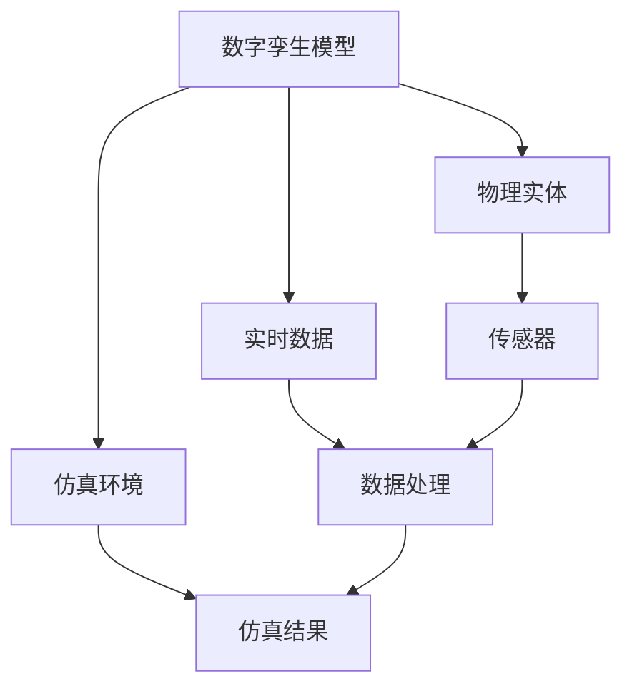

                 

关键词：数字孪生，虚拟世界，物理世界，建模，仿真，数据驱动，物联网，智能制造

> 摘要：本文探讨了数字孪生技术的核心概念、原理和应用。通过详细阐述数字孪生如何作为虚拟世界与物理世界的桥梁，本文分析了数字孪生技术的应用领域、数学模型、算法原理以及项目实践。同时，本文还展望了数字孪生技术的未来发展趋势、面临的挑战以及研究展望。

## 1. 背景介绍

随着信息技术的飞速发展，数据采集和处理能力得到了极大提升，这为物理世界的数字化提供了可能。数字孪生技术（Digital Twin Technology）应运而生，它通过建立一个与物理实体高度相似的虚拟模型，实现对物理世界的实时监测、仿真和分析。数字孪生技术为智能制造、物联网、智慧城市等领域带来了深刻的变革。

数字孪生最早可以追溯到2002年，由美国密歇根大学教授Michael Grieves提出。他提出将数字孪生作为一种新的设计和开发工具，用于模拟、分析和优化物理实体。随着技术的不断进步，数字孪生技术逐渐应用于各个领域，成为一个跨学科的综合性技术。

## 2. 核心概念与联系

数字孪生技术涉及多个核心概念，包括建模、仿真、数据驱动等。下面通过Mermaid流程图来展示数字孪生技术的核心概念和联系。



### 2.1 数字孪生模型

数字孪生模型是数字孪生技术的核心，它是一个高度精确的虚拟实体，能够模拟物理实体的各种行为和状态。数字孪生模型通常由以下几个部分组成：

- **物理特征**：包括尺寸、形状、材质等物理属性。
- **行为特征**：包括运动、变形、磨损等行为特性。
- **环境特征**：包括温度、湿度、光照等环境因素。

### 2.2 物理实体

物理实体是指现实世界中的物体或系统，如机器、建筑物、城市等。物理实体通过传感器收集数据，并将数据传输到数字孪生模型。

### 2.3 实时数据

实时数据是数字孪生技术的关键，它来源于物理实体的传感器，包括温度、压力、速度等物理量。实时数据能够实时反映物理实体的状态，为数字孪生模型提供数据支持。

### 2.4 仿真环境

仿真环境是数字孪生技术的重要组成部分，它提供了一个虚拟的环境，用于模拟物理实体的行为。通过仿真环境，可以提前预测物理实体在各种工况下的表现，为物理实体的设计和优化提供依据。

### 2.5 传感器

传感器是数字孪生技术的重要组件，它负责收集物理实体的实时数据。传感器种类繁多，如温度传感器、压力传感器、加速度传感器等。

### 2.6 数据处理

数据处理是对实时数据进行处理和分析的过程。通过数据处理，可以从海量数据中提取有价值的信息，为数字孪生模型提供支持。

### 2.7 仿真结果

仿真结果是数字孪生技术在仿真环境中的输出，它反映了物理实体在各种工况下的表现。通过分析仿真结果，可以优化物理实体的设计和运行。

## 3. 核心算法原理 & 具体操作步骤

### 3.1 算法原理概述

数字孪生技术涉及多个核心算法，包括建模算法、仿真算法、数据处理算法等。下面简要介绍这些算法的原理。

### 3.2 算法步骤详解

数字孪生技术的具体操作步骤如下：

1. **数据采集**：通过传感器收集物理实体的实时数据。
2. **数据预处理**：对采集到的数据进行清洗、去噪和归一化处理。
3. **建模**：根据预处理后的数据，构建物理实体的数字孪生模型。
4. **仿真**：在仿真环境中运行数字孪生模型，模拟物理实体的行为。
5. **结果分析**：对仿真结果进行分析，提取有价值的信息。
6. **优化设计**：根据分析结果，优化物理实体的设计和运行。

### 3.3 算法优缺点

数字孪生技术的核心算法具有以下优缺点：

- **优点**：
  - 提高设计效率：通过仿真和分析，可以提前发现并解决潜在问题，提高设计效率。
  - 优化运行性能：通过对仿真结果的分析，可以优化物理实体的运行性能。
  - 降低维护成本：通过实时监测和预测，可以提前发现并解决故障，降低维护成本。
- **缺点**：
  - 数据质量要求高：数字孪生技术依赖于实时数据，数据质量对算法效果有直接影响。
  - 计算资源需求大：仿真算法通常需要大量计算资源，对硬件设备有较高要求。

### 3.4 算法应用领域

数字孪生技术已广泛应用于多个领域，如智能制造、物联网、智慧城市等。下面简要介绍这些领域的应用情况。

- **智能制造**：数字孪生技术可以实现对生产线的实时监控和优化，提高生产效率和产品质量。
- **物联网**：数字孪生技术可以实现对物联网设备的实时监控和预测性维护，提高设备运行稳定性和寿命。
- **智慧城市**：数字孪生技术可以实现对城市基础设施的实时监测和仿真分析，提高城市管理效率和应急响应能力。

## 4. 数学模型和公式 & 详细讲解 & 举例说明

### 4.1 数学模型构建

数字孪生技术的数学模型主要包括物理模型的建立和仿真模型的构建。下面以一个简单的例子来说明数学模型的构建过程。

假设我们有一个简单的机械臂，其运动轨迹可以用以下数学模型描述：

- 运动方程：\[ x(t) = x_0 + v_0 \cdot t \]
- 角度方程：\[ \theta(t) = \theta_0 + \omega_0 \cdot t \]

其中，\( x(t) \)和\( \theta(t) \)分别为机械臂在时间和角度上的位置，\( x_0 \)和\( \theta_0 \)分别为初始位置，\( v_0 \)和\( \omega_0 \)分别为速度和角速度。

### 4.2 公式推导过程

为了构建数字孪生模型，我们需要对物理模型进行数值求解。这里采用经典的欧拉方法进行求解，具体推导过程如下：

1. **离散化时间**：将时间\( t \)离散化，设时间步长为\( \Delta t \)。
2. **位置更新**：根据运动方程，机械臂在下一个时间步的位置可以表示为：\[ x(t+\Delta t) = x(t) + v(t) \cdot \Delta t \]
3. **角度更新**：根据角度方程，机械臂在下一个时间步的角度可以表示为：\[ \theta(t+\Delta t) = \theta(t) + \omega(t) \cdot \Delta t \]

### 4.3 案例分析与讲解

为了说明数学模型的应用，我们以一个简单的例子来分析机械臂的运动轨迹。

假设机械臂的初始位置为\( (0, 0) \)，初始角度为\( 0^\circ \)，速度为\( 1 \)单位长度/秒，角速度为\( 1^\circ \)/秒。我们使用欧拉方法进行求解，时间步长设为\( 1 \)秒。

经过1秒后，机械臂的位置和角度分别为：

\[ x(1) = 0 + 1 \cdot 1 = 1 \]
\[ \theta(1) = 0 + 1 \cdot 1 = 1 \]

经过2秒后，机械臂的位置和角度分别为：

\[ x(2) = 1 + 1 \cdot 1 = 2 \]
\[ \theta(2) = 1 + 1 \cdot 1 = 2 \]

以此类推，我们可以计算出机械臂在不同时间点的位置和角度。

通过这个简单的例子，我们可以看到数学模型在数字孪生技术中的应用。在实际应用中，数学模型会更加复杂，需要考虑更多的因素，如摩擦力、负载等。

## 5. 项目实践：代码实例和详细解释说明

### 5.1 开发环境搭建

为了演示数字孪生技术的应用，我们将使用Python编写一个简单的机械臂仿真程序。以下是开发环境的搭建步骤：

1. 安装Python：下载并安装Python 3.x版本，建议使用最新版本。
2. 安装必要库：使用pip命令安装以下库：numpy、matplotlib、scipy。
   ```bash
   pip install numpy matplotlib scipy
   ```

### 5.2 源代码详细实现

下面是机械臂仿真程序的源代码：

```python
import numpy as np
import matplotlib.pyplot as plt
from scipy.integrate import odeint

# 定义机械臂的运动方程
def mechanical_arm(y, t, x0, theta0, v0, omega0):
    x, theta = y
    v = v0
    omega = omega0

    dxdt = v
    dthetadt = omega

    return [dxdt, dthetadt]

# 设置初始条件
x0 = 0
theta0 = 0
v0 = 1
omega0 = 1

# 设置时间步长
t = np.linspace(0, 10, 1000)

# 求解运动方程
y = odeint(mechanical_arm, [x0, theta0], t, args=(x0, theta0, v0, omega0))

# 绘制运动轨迹
plt.plot(t, y[:, 0], label='Position')
plt.plot(t, y[:, 1], label='Angle')
plt.xlabel('Time (s)')
plt.ylabel('Value')
plt.legend()
plt.show()
```

### 5.3 代码解读与分析

这段代码实现了一个简单的机械臂仿真程序，主要分为以下几个部分：

1. **导入库**：导入numpy、matplotlib和scipy库，用于数学计算和绘图。
2. **定义运动方程**：机械臂的运动方程由两个部分组成，位置和角度。这里使用欧拉方法进行数值求解。
3. **设置初始条件**：定义机械臂的初始位置、角度、速度和角速度。
4. **求解运动方程**：使用scipy库的odeint函数求解运动方程，得到机械臂在不同时间点的位置和角度。
5. **绘制运动轨迹**：使用matplotlib库绘制机械臂的运动轨迹。

### 5.4 运行结果展示

运行上述代码，我们可以得到机械臂在10秒内的位置和角度变化曲线。通过分析这些曲线，可以了解机械臂的运动规律。


## 6. 实际应用场景

数字孪生技术已经在多个领域取得了显著的应用成果。以下是一些典型的实际应用场景：

### 6.1 智能制造

在制造业中，数字孪生技术可以实现对生产线的实时监控和优化。例如，在汽车制造过程中，通过数字孪生技术可以模拟汽车在不同工况下的性能，优化汽车的设计和制造工艺，提高生产效率和产品质量。

### 6.2 物联网

在物联网领域，数字孪生技术可以实现对设备的实时监控和预测性维护。例如，在智能家居中，数字孪生技术可以监控家中的各种设备，如空调、热水器等，预测设备的运行状态，提前进行维护，提高设备的使用寿命。

### 6.3 智慧城市

在智慧城市中，数字孪生技术可以实现对城市基础设施的实时监测和仿真分析。例如，在城市交通管理中，通过数字孪生技术可以模拟交通流量，优化交通信号控制，提高城市交通运行效率。

## 7. 工具和资源推荐

为了更好地学习和应用数字孪生技术，以下是一些推荐的工具和资源：

### 7.1 学习资源推荐

- 《数字孪生：定义、架构与应用》
- 《智能制造与数字孪生》
- 《物联网与数字孪生技术》

### 7.2 开发工具推荐

- Python：强大的编程语言，适用于数据分析和仿真。
- MATLAB：专业的数学软件，适用于数学建模和仿真。
- Simulink：MATLAB的仿真工具箱，适用于系统级仿真。

### 7.3 相关论文推荐

- "Digital Twin: A Symbolic Representation of Physical World in Cyber-Physical Systems"
- "A Framework for Digital Twin System Design and Application"
- "Digital Twin-Based Condition Monitoring and Maintenance Optimization for Industrial Systems"

## 8. 总结：未来发展趋势与挑战

### 8.1 研究成果总结

数字孪生技术自提出以来，已经取得了显著的成果。在智能制造、物联网、智慧城市等领域，数字孪生技术为优化设计和运行提供了有力支持。同时，随着人工智能、物联网等技术的发展，数字孪生技术的应用前景更加广阔。

### 8.2 未来发展趋势

未来，数字孪生技术将朝着更加智能化、精细化、集成化的方向发展。具体表现为：

- **智能化**：通过引入人工智能技术，提高数字孪生模型的预测能力和自适应能力。
- **精细化**：通过精细化的数据采集和处理，提高数字孪生模型的精度和可靠性。
- **集成化**：通过集成不同的技术和平台，构建全面的数字孪生系统，实现跨领域的协同。

### 8.3 面临的挑战

尽管数字孪生技术取得了显著成果，但仍面临一些挑战：

- **数据质量**：数字孪生技术依赖于高质量的数据，数据质量对算法效果有直接影响。
- **计算资源**：仿真算法通常需要大量计算资源，对硬件设备有较高要求。
- **安全性**：数字孪生技术涉及到大量的敏感数据，确保数据安全和隐私保护是一个重要挑战。

### 8.4 研究展望

未来，数字孪生技术的研究将继续深入，主要集中在以下几个方面：

- **算法优化**：研究更高效的算法，提高数字孪生模型的性能。
- **跨领域应用**：探索数字孪生技术在更多领域的应用，实现跨领域的协同。
- **标准化**：制定数字孪生技术的标准和规范，促进技术的普及和应用。

## 9. 附录：常见问题与解答

### 9.1 数字孪生技术是什么？

数字孪生技术是一种通过构建虚拟模型实现对物理实体实时监测、仿真和分析的技术。它将物理世界的实体映射到虚拟世界，为物理实体的设计和运行提供支持。

### 9.2 数字孪生技术的核心组成部分是什么？

数字孪生技术的核心组成部分包括数字孪生模型、传感器、数据处理和仿真环境。

### 9.3 数字孪生技术在哪些领域有应用？

数字孪生技术已广泛应用于智能制造、物联网、智慧城市、航空航天、医疗健康等领域。

### 9.4 如何保证数字孪生模型的质量？

保证数字孪生模型的质量需要从数据质量、建模精度、算法优化等多个方面进行综合考虑。

### 9.5 数字孪生技术面临的挑战有哪些？

数字孪生技术面临的主要挑战包括数据质量、计算资源、安全性等。

### 9.6 数字孪生技术的未来发展趋势是什么？

数字孪生技术的未来发展趋势包括智能化、精细化、集成化等。

### 9.7 如何学习和应用数字孪生技术？

学习和应用数字孪生技术可以从以下方面入手：

- 学习相关理论和知识，了解数字孪生技术的基本原理。
- 掌握相关编程语言和工具，如Python、MATLAB等。
- 参与实践项目，积累实际操作经验。
- 关注最新的研究进展，了解前沿技术和应用案例。

---

以上是数字孪生技术的详细介绍，希望对您有所帮助。在未来的发展中，数字孪生技术将不断推动各领域的创新和进步，为人类带来更多便利和效益。作者：禅与计算机程序设计艺术 / Zen and the Art of Computer Programming。

