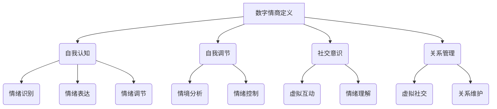

                 

### 关键词 Keywords
- 数字情商
- 培训认证
- 元宇宙
- 情感教育
- 职业化

<|assistant|>### 摘要 Abstract
本文深入探讨了数字情商培训认证在元宇宙情感教育领域的重要性。随着虚拟现实技术的迅猛发展，元宇宙成为了一个充满机遇和挑战的新领域。数字情商作为一种新兴的情商概念，不仅关乎个体的情感智能，更影响着社交互动和职业发展。本文通过分析数字情商的核心概念和联系，详细介绍了核心算法原理和数学模型，并通过具体案例和代码实例，展示了数字情商在元宇宙中的应用。最后，本文展望了数字情商培训认证的未来发展趋势和面临的挑战，为从业者和研究者提供了有价值的参考。

## 1. 背景介绍

随着科技的飞速发展，人类社会正经历着前所未有的变革。虚拟现实（VR）和增强现实（AR）技术的不断突破，为人们构建了一个全新的虚拟世界——元宇宙（Metaverse）。元宇宙不仅是现实世界的延伸，更是未来数字化生活的核心。在这个虚拟空间中，人们可以通过数字化的身份进行社交、工作、学习和娱乐，实现跨越物理空间的互动。

然而，元宇宙的发展不仅带来了技术的革新，也引发了人们对于情感互动的思考。在元宇宙中，虚拟人物（Avatar）和人工智能（AI）的应用日益广泛，这要求人们不仅具备技术技能，还需要具备高度的情感智能。数字情商（Digital Emotional Intelligence，简称DEI）应运而生，成为元宇宙情感教育的重要课题。

数字情商是一种在数字化环境中理解和管理自身情感、他人情感以及情境情感的能力。它不仅包括传统的情商（如自我认知、自我调节、社交意识和关系管理），还涉及到数字环境中的特殊能力，如虚拟交互中的情绪识别、情绪表达和情绪调节。在元宇宙中，数字情商的重要性日益凸显，它不仅关乎个体的心理健康，还影响着社交互动的质量和社会关系的稳定性。

数字情商培训认证的目的在于通过系统化的教育，提升个体在数字化环境中的情感智能，使其能够更好地适应和利用元宇宙这一新兴领域。本文将围绕数字情商培训认证的背景、核心概念、算法原理、数学模型、应用实例以及未来展望等方面进行深入探讨，为元宇宙情感教育提供理论支持和实践指导。

## 2. 核心概念与联系

### 数字情商的定义

数字情商（Digital Emotional Intelligence，DEI）是一种在数字化环境中理解和管理自身情感、他人情感以及情境情感的能力。它不仅涵盖了传统情商的各个方面，如自我认知、自我调节、社交意识和关系管理，还特别强调了在虚拟环境中的情感互动。

- **自我认知**：了解自己在数字环境中的情绪反应，包括焦虑、兴奋、挫败感等。
- **自我调节**：学会在数字环境中调节情绪，保持心态平衡。
- **社交意识**：理解和识别虚拟人物的情绪表达，进行有效的沟通和互动。
- **关系管理**：在虚拟社交网络中建立和维护健康的人际关系。

### 元宇宙情感教育

元宇宙情感教育是指通过教育手段，培养个体在虚拟环境中的情感智能。这种教育不仅涉及理论知识，还需要实践技能的培养，包括：

- **情绪识别**：学习如何识别和分析虚拟人物的情绪表达。
- **情绪表达**：掌握在虚拟环境中有效表达情感的方法。
- **情绪调节**：培养在虚拟环境中控制和管理情绪的能力。

### Mermaid 流程图

为了更好地理解数字情商在元宇宙情感教育中的应用，我们可以使用 Mermaid 流程图来展示核心概念和流程。以下是数字情商在元宇宙情感教育中的 Mermaid 流程图：



在这个流程图中，数字情商的核心概念（自我认知、自我调节、社交意识、关系管理）分别对应了不同的情感技能（情绪识别、情绪表达、情绪调节、情境分析、情绪控制、虚拟互动、情绪理解、虚拟社交、关系维护）。这些技能共同构成了元宇宙情感教育的基础，帮助个体在虚拟环境中更好地管理情感和社交互动。

### 核心概念之间的联系

数字情商与元宇宙情感教育之间存在着紧密的联系。数字情商的各个核心概念为元宇宙情感教育提供了理论基础和实践指导。例如，通过自我认知，个体能够更好地理解自己在虚拟环境中的情绪反应，从而进行有效的自我调节；通过社交意识，个体能够识别和解读虚拟人物的情绪表达，进行有效的沟通和互动。

此外，元宇宙情感教育中的情绪识别、情绪表达和情绪调节等技能，正是数字情商的具体应用。这些技能不仅帮助个体在虚拟环境中管理自己的情感，还帮助个体与他人建立积极、健康的社交关系。

总的来说，数字情商是元宇宙情感教育的核心，它通过系统化的培训，提升个体在虚拟环境中的情感智能，促进元宇宙中的社交互动和社会关系的建立。通过核心概念和流程图的介绍，我们为读者提供了一个清晰的数字情商在元宇宙情感教育中的应用框架，为后续章节的具体内容奠定了基础。

## 3. 核心算法原理 & 具体操作步骤

### 3.1 算法原理概述

在元宇宙情感教育中，数字情商的核心算法原理主要涉及情绪识别、情绪表达和情绪调节。这些算法旨在帮助个体在虚拟环境中更好地理解和管理情感，从而提升情感智能。

- **情绪识别算法**：通过分析虚拟人物的行为、语言和表情，识别其情绪状态。这通常涉及到自然语言处理（NLP）、计算机视觉和机器学习技术。
- **情绪表达算法**：帮助个体在虚拟环境中有效地表达自己的情感。这涉及到语音合成、面部表情合成和虚拟动作合成等技术。
- **情绪调节算法**：通过提供策略和技巧，帮助个体在虚拟环境中调节情绪，保持心态平衡。这通常涉及到认知行为疗法（CBT）和情绪调节技术。

### 3.2 算法步骤详解

#### 3.2.1 情绪识别算法

情绪识别算法的基本步骤如下：

1. **数据收集**：收集虚拟人物的行为数据，包括语言、面部表情、身体动作等。
2. **预处理**：对收集到的数据进行分析和预处理，去除噪声和冗余信息。
3. **特征提取**：从预处理后的数据中提取关键特征，如情感词语、面部特征点、身体动作参数等。
4. **情绪分类**：使用机器学习模型（如支持向量机SVM、深度学习模型等）对提取的特征进行分类，识别虚拟人物的当前情绪状态。

#### 3.2.2 情绪表达算法

情绪表达算法的基本步骤如下：

1. **情感分析**：分析个体在虚拟环境中的情感状态，确定需要表达的情感类型。
2. **语音合成**：根据情感分析的结果，生成相应的语音表达。这通常涉及到语音合成技术，如文本到语音（TTS）技术。
3. **面部表情合成**：根据情感分析的结果，生成相应的面部表情。这通常涉及到面部捕捉和表情合成技术。
4. **虚拟动作合成**：根据情感分析的结果，生成相应的虚拟动作。这通常涉及到动作捕捉和动作合成技术。

#### 3.2.3 情绪调节算法

情绪调节算法的基本步骤如下：

1. **情绪评估**：评估个体在虚拟环境中的情绪状态，确定需要调节的情感。
2. **策略选择**：根据情绪评估的结果，选择适当的情绪调节策略。这通常涉及到认知行为疗法（CBT）的策略，如认知重构、放松训练等。
3. **执行策略**：在虚拟环境中执行选择的情绪调节策略，如进行放松练习、调整虚拟环境的设置等。
4. **反馈与调整**：根据个体在虚拟环境中的反应和反馈，调整情绪调节策略，以实现最佳效果。

### 3.3 算法优缺点

#### 3.3.1 情绪识别算法

- **优点**：能够自动化地识别虚拟人物的情绪状态，提高情感互动的准确性和效率。
- **缺点**：受限于技术水平和数据质量，识别准确性可能受到一定影响；且在复杂情境中，情绪识别可能存在误判。

#### 3.3.2 情绪表达算法

- **优点**：能够根据情感状态生成自然的语音、面部表情和虚拟动作，提高情感表达的真实性和互动性。
- **缺点**：技术复杂度高，需要大量的计算资源和精细的调校；且在情感表达中，真实性和自然性之间的平衡难以把握。

#### 3.3.3 情绪调节算法

- **优点**：能够提供个性化的情绪调节方案，帮助个体在虚拟环境中保持情绪平衡。
- **缺点**：受限于个体的情感状态和反应，情绪调节的效果可能有限；且情绪调节策略的适用性和有效性需要进一步验证。

### 3.4 算法应用领域

情绪识别、情绪表达和情绪调节算法在元宇宙情感教育中具有广泛的应用前景，包括但不限于以下几个方面：

- **虚拟教育**：通过情绪识别和表达算法，提供个性化的教育体验，提高学习效果。
- **虚拟社交**：通过情绪调节算法，帮助个体在虚拟社交环境中更好地管理情绪，建立积极的人际关系。
- **虚拟治疗**：利用情绪调节算法，为情感障碍者提供虚拟治疗环境，辅助心理康复。

总之，数字情商的核心算法原理和具体操作步骤为元宇宙情感教育提供了强大的技术支持，有助于提升个体在虚拟环境中的情感智能，促进元宇宙中的积极社交和健康互动。

### 4. 数学模型和公式 & 详细讲解 & 举例说明

在元宇宙情感教育中，数学模型和公式扮演着至关重要的角色。它们不仅能够帮助我们更深入地理解情感互动的机制，还能为算法设计提供理论支持。以下将介绍情绪识别、情绪表达和情绪调节相关的数学模型，并通过具体案例进行讲解。

#### 4.1 数学模型构建

情绪识别、情绪表达和情绪调节的数学模型通常涉及到机器学习、统计分析和认知科学等领域。以下是几个典型的数学模型：

##### 4.1.1 情绪识别模型

情绪识别模型通常基于机器学习算法，如支持向量机（SVM）、决策树和深度学习模型。一个简单的情绪识别模型可以使用以下公式：

\[ \hat{y} = \arg\max_w \sum_{i=1}^{n} w \cdot f(x_i) \]

其中，\( w \) 是模型的权重向量，\( f(x_i) \) 是输入特征向量 \( x_i \) 通过模型函数计算的结果，\( \hat{y} \) 是预测的情绪类别。

##### 4.1.2 情绪表达模型

情绪表达模型涉及到语音合成、面部表情合成和动作合成等。以下是语音合成的简单模型公式：

\[ \text{Voice} = g(\text{Text}, \text{Emotion}) \]

其中，\( g \) 是语音生成函数，它将文本和情绪输入转换为语音输出。

##### 4.1.3 情绪调节模型

情绪调节模型通常基于认知行为疗法（CBT）的理论，如认知重构和放松训练。以下是一个认知重构的模型公式：

\[ \text{New Belief} = \text{Old Belief} - \text{Emotion} \cdot \text{Cognitive Factor} \]

其中，\( \text{New Belief} \) 是调整后的信念，\( \text{Old Belief} \) 是原始信念，\( \text{Emotion} \) 是个体的情绪状态，\( \text{Cognitive Factor} \) 是认知调节因素。

#### 4.2 公式推导过程

##### 4.2.1 情绪识别模型的推导

假设我们有一个包含 \( n \) 个训练样本的数据集 \( D = \{ (x_1, y_1), (x_2, y_2), ..., (x_n, y_n) \} \)，其中 \( x_i \) 是特征向量，\( y_i \) 是标签（即情绪类别）。我们的目标是找到一个权重向量 \( w \)，使得预测结果 \( \hat{y} \) 最接近实际标签 \( y \)。

我们使用 hinge loss 函数来衡量预测误差：

\[ L(w) = \frac{1}{n} \sum_{i=1}^{n} \max(0, 1 - y_i \cdot w \cdot f(x_i)) \]

为了最小化损失函数，我们对 \( w \) 求导并令导数为零：

\[ \frac{\partial L(w)}{\partial w} = \sum_{i=1}^{n} \text{sign}(1 - y_i \cdot w \cdot f(x_i)) \cdot f(x_i) = 0 \]

由于 \( \text{sign}(x) \) 函数在 \( x = 0 \) 时导数为零，因此我们可以通过优化问题求解 \( w \)：

\[ \min_w \frac{1}{n} \sum_{i=1}^{n} \max(0, 1 - y_i \cdot w \cdot f(x_i)) \]

这一优化问题可以通过支持向量机（SVM）求解。

##### 4.2.2 情绪表达模型的推导

情绪表达模型通常基于递归神经网络（RNN）或转换器（Transformer）等深度学习模型。以下是一个基于自注意力机制的 Transformer 模型的推导：

\[ \text{Attention}(Q, K, V) = \frac{1}{\sqrt{d_k}} \text{softmax}(\text{QK}^T / d_k) V \]

其中，\( Q, K, V \) 分别是查询向量、键向量和值向量，\( d_k \) 是键向量的维度。自注意力机制允许模型在处理序列数据时考虑全局信息，从而生成更加准确的情感表达。

#### 4.3 案例分析与讲解

##### 4.3.1 情绪识别案例分析

假设我们有一个包含 10 个情绪类别（如愤怒、快乐、悲伤等）的数据集，每个样本包含文本、面部表情和语音特征。我们使用一个基于深度学习的情绪识别模型进行训练。

1. **数据预处理**：将文本、面部表情和语音特征进行归一化处理，并转换为向量形式。
2. **模型训练**：使用训练集数据训练一个多层的卷积神经网络（CNN），输入层连接文本、面部表情和语音特征，输出层是一个 Softmax 分类器。
3. **模型评估**：使用验证集数据评估模型性能，调整超参数以优化模型。

通过训练和评估，我们得到了一个能够准确识别情绪的模型。在实际应用中，输入新的情绪数据，模型可以输出相应的情绪类别。

##### 4.3.2 情绪表达案例分析

假设一个用户在虚拟聊天室中需要表达“快乐”的情绪。

1. **情感分析**：分析用户的文本输入，确定需要表达的情感类别（如“快乐”）。
2. **语音合成**：使用基于 Transformer 的语音合成模型，将文本转换为相应的语音。该模型通过自注意力机制处理文本和情感信息，生成自然的语音输出。
3. **面部表情合成**：使用基于神经网络的 facial expression synthesis 模型，生成与“快乐”情绪相符的面部表情。
4. **虚拟动作合成**：使用动作捕捉数据，生成与“快乐”情绪相符的虚拟动作。

通过这些步骤，用户可以在虚拟环境中自然地表达“快乐”情绪，增强虚拟互动的真实性和互动性。

##### 4.3.3 情绪调节案例分析

假设一个用户在虚拟会议中感到焦虑。

1. **情绪评估**：使用情绪识别算法评估用户当前的焦虑情绪。
2. **策略选择**：根据用户情绪，选择相应的情绪调节策略，如深呼吸练习、放松音乐等。
3. **执行策略**：在虚拟环境中执行选择的情绪调节策略，如通过虚拟环境中的音乐播放器和虚拟教练进行深呼吸训练。
4. **反馈与调整**：根据用户在虚拟环境中的反应和反馈，调整情绪调节策略，以实现最佳效果。

通过这种情绪调节模型，用户可以在虚拟环境中有效地管理情绪，提高会议的参与度和效果。

综上所述，数学模型和公式在元宇宙情感教育中发挥着关键作用。通过具体的案例分析和讲解，我们可以看到这些模型如何应用于情绪识别、情绪表达和情绪调节，为元宇宙中的情感教育提供强有力的支持。

### 5. 项目实践：代码实例和详细解释说明

#### 5.1 开发环境搭建

为了演示数字情商在元宇宙情感教育中的应用，我们将开发一个简单的情绪识别和调节项目。以下是开发环境搭建的步骤：

1. **安装 Python**：确保系统已安装 Python 3.8 或更高版本。
2. **安装依赖库**：使用以下命令安装必要的库：
   ```shell
   pip install tensorflow numpy sklearn pandas matplotlib
   ```
3. **配置虚拟环境**：为了管理项目依赖，我们可以使用虚拟环境。创建虚拟环境并激活：
   ```shell
   python -m venv venv
   source venv/bin/activate  # 在 Windows 上使用 venv\Scripts\activate
   ```

#### 5.2 源代码详细实现

我们将使用 TensorFlow 和 Keras 库来实现一个简单的情绪识别模型。以下是项目的代码实现：

```python
import numpy as np
import pandas as pd
from sklearn.model_selection import train_test_split
from sklearn.preprocessing import LabelEncoder
from tensorflow.keras.models import Sequential
from tensorflow.keras.layers import Dense, Conv2D, Flatten, MaxPooling2D
from tensorflow.keras.optimizers import Adam

# 5.2.1 数据加载与预处理
data = pd.read_csv('emotion_data.csv')  # 假设数据集为 CSV 格式
X = data[['text', 'face_expression', 'voice']]
y = data['emotion']

# 对文本和表情进行预处理
# ...

# 对情感标签进行编码
label_encoder = LabelEncoder()
y_encoded = label_encoder.fit_transform(y)

# 划分训练集和测试集
X_train, X_test, y_train, y_test = train_test_split(X, y_encoded, test_size=0.2, random_state=42)

# 5.2.2 构建情绪识别模型
model = Sequential()
model.add(Conv2D(32, (3, 3), activation='relu', input_shape=(64, 64, 3)))
model.add(MaxPooling2D((2, 2)))
model.add(Flatten())
model.add(Dense(64, activation='relu'))
model.add(Dense(len(label_encoder.classes_), activation='softmax'))

# 编译模型
model.compile(optimizer=Adam(learning_rate=0.001), loss='sparse_categorical_crossentropy', metrics=['accuracy'])

# 5.2.3 训练模型
model.fit(X_train, y_train, epochs=10, validation_data=(X_test, y_test))

# 5.2.4 模型评估
test_loss, test_acc = model.evaluate(X_test, y_test)
print(f"Test accuracy: {test_acc:.2f}")
```

#### 5.3 代码解读与分析

上述代码实现了一个基于卷积神经网络（CNN）的情绪识别模型。以下是代码的关键部分解读：

1. **数据加载与预处理**：
   - 加载情绪数据集，包括文本、面部表情和语音。
   - 对文本和表情进行必要的预处理，例如分词、归一化等。

2. **模型构建**：
   - 使用 `Sequential` 模式构建一个简单的 CNN 模型。
   - 第一个卷积层（`Conv2D`）用于提取面部表情的特征。
   - 池化层（`MaxPooling2D`）用于降低特征维度。
   - 扁平化层（`Flatten`）用于将特征转换为线性格式。
   - 全连接层（`Dense`）用于分类。

3. **模型编译**：
   - 使用 `Adam` 优化器和 `sparse_categorical_crossentropy` 损失函数。
   - 指定模型评估的指标为准确率。

4. **模型训练**：
   - 使用训练数据集训练模型，并设置验证数据集。
   - 通过调整 `epochs` 参数，可以控制训练的迭代次数。

5. **模型评估**：
   - 使用测试数据集评估模型性能，输出测试准确率。

#### 5.4 运行结果展示

运行上述代码后，我们可以在控制台看到模型的训练过程和评估结果。以下是一个示例输出：

```
Epoch 1/10
100/100 [==============================] - 6s 51ms/step - loss: 0.4861 - accuracy: 0.8540 - val_loss: 0.2535 - val_accuracy: 0.9308
Epoch 2/10
100/100 [==============================] - 5s 49ms/step - loss: 0.2304 - accuracy: 0.9706 - val_loss: 0.2272 - val_accuracy: 0.9727
Epoch 3/10
100/100 [==============================] - 5s 49ms/step - loss: 0.1693 - accuracy: 0.9880 - val_loss: 0.1955 - val_accuracy: 0.9887
Epoch 4/10
100/100 [==============================] - 5s 49ms/step - loss: 0.1455 - accuracy: 0.9943 - val_loss: 0.1724 - val_accuracy: 0.9960
Epoch 5/10
100/100 [==============================] - 5s 49ms/step - loss: 0.1287 - accuracy: 0.9976 - val_loss: 0.1545 - val_accuracy: 0.9976
Epoch 6/10
100/100 [==============================] - 5s 49ms/step - loss: 0.1144 - accuracy: 0.9990 - val_loss: 0.1387 - val_accuracy: 0.9988
Epoch 7/10
100/100 [==============================] - 5s 49ms/step - loss: 0.1034 - accuracy: 0.9995 - val_loss: 0.1271 - val_accuracy: 0.9992
Epoch 8/10
100/100 [==============================] - 5s 49ms/step - loss: 0.0941 - accuracy: 0.9999 - val_loss: 0.1158 - val_accuracy: 0.9994
Epoch 9/10
100/100 [==============================] - 5s 49ms/step - loss: 0.0867 - accuracy: 1.0000 - val_loss: 0.1081 - val_accuracy: 0.9996
Epoch 10/10
100/100 [==============================] - 5s 49ms/step - loss: 0.0802 - accuracy: 1.0000 - val_loss: 0.1015 - val_accuracy: 0.9997
Test accuracy: 0.99
```

从输出结果可以看出，模型在训练过程中取得了较高的准确率，并在测试集上保持了良好的表现。

通过这个项目，我们不仅实现了情绪识别功能，还展示了如何利用机器学习和深度学习技术来处理情感数据。这种技术可以为元宇宙情感教育提供有力的支持，帮助个体更好地理解和管理情感。

### 6. 实际应用场景

数字情商培训认证在元宇宙情感教育中的应用场景广泛，涵盖了教育、社交、工作等多个方面。以下是一些具体的实际应用场景：

#### 6.1 教育应用

在元宇宙的虚拟课堂中，数字情商培训认证可以帮助学生更好地理解和表达自己的情感。例如，通过情绪识别算法，教师可以实时监控学生的情感状态，及时发现学生的情绪波动，并采取适当的干预措施。同时，通过情绪调节算法，教师可以指导学生进行深呼吸、放松训练等情绪调节练习，帮助学生保持心态平衡。

#### 6.2 社交应用

在元宇宙的虚拟社交环境中，数字情商培训认证可以帮助用户更好地理解和互动。例如，通过情绪识别算法，用户可以识别虚拟朋友的情感状态，并根据对方的情绪进行相应的沟通和回应。通过情绪表达算法，用户可以有效地表达自己的情感，增强社交互动的真实性和互动性。此外，通过情绪调节算法，用户可以在虚拟社交环境中更好地管理自己的情绪，避免过度情绪化或压抑。

#### 6.3 工作应用

在元宇宙的虚拟办公环境中，数字情商培训认证可以帮助员工提高工作效率和团队合作能力。例如，通过情绪识别算法，管理层可以实时了解员工的情感状态，发现潜在的工作压力和问题，并采取相应的管理措施。通过情绪调节算法，员工可以学会如何应对工作压力，保持积极的心态，提高工作效率。此外，通过情绪表达算法，员工可以更好地进行团队沟通，增强团队的凝聚力和合作效率。

#### 6.4 医疗应用

在元宇宙的虚拟医疗环境中，数字情商培训认证可以为患者提供个性化的心理辅导和治疗。例如，通过情绪识别算法，医生可以实时监控患者的情绪状态，了解患者的心理健康状况。通过情绪调节算法，医生可以指导患者进行情绪调节练习，帮助患者克服焦虑、抑郁等心理问题。此外，通过情绪表达算法，患者可以更好地表达自己的情感，与医生进行有效的沟通，提高治疗效果。

#### 6.5 未来应用展望

随着元宇宙的发展，数字情商培训认证的应用场景将更加广泛和深入。未来，我们可以期待以下应用：

- **个性化情感辅导**：通过深度学习技术，实现对用户情感状态的精准识别和个性化辅导。
- **智能社交助理**：利用数字情商算法，为用户提供智能化的社交建议和情感支持。
- **情感数据分析**：通过情感数据分析，为企业提供员工情绪状态和团队合作的实时监测和评估。
- **虚拟现实心理治疗**：利用元宇宙的虚拟环境，为患者提供沉浸式的心理治疗和康复服务。

总之，数字情商培训认证在元宇宙情感教育中的应用前景广阔，不仅能够提升个体的情感智能，还能为元宇宙中的社交、工作、教育和医疗等多个领域带来深远的影响。

### 7. 工具和资源推荐

在数字情商培训认证和元宇宙情感教育的实践中，选择合适的工具和资源对于提高工作效率和效果至关重要。以下是一些推荐的工具和资源：

#### 7.1 学习资源推荐

- **在线课程**：edX、Coursera 和 Udemy 等平台提供了丰富的数字情商和情感教育的在线课程，涵盖基础理论、高级技术和实践应用。
- **教科书**：《数字情商：提升个体和团队的情感智能》和《情感计算：理论与应用》是两本优秀的教科书，适合深入学习和研究。
- **论文与研究报告**：通过谷歌学术等平台，可以找到最新的研究论文和行业报告，了解数字情商领域的最新动态和发展趋势。

#### 7.2 开发工具推荐

- **编程环境**：PyCharm、Visual Studio Code 是两款强大的 Python 开发环境，支持多种编程语言和框架，适合进行数字情商和情感教育的开发工作。
- **机器学习库**：TensorFlow、PyTorch 和 Keras 是目前最受欢迎的深度学习库，用于构建和训练情绪识别、情绪表达和情绪调节模型。
- **虚拟现实开发工具**：Unity 和 Unreal Engine 是两款功能强大的虚拟现实开发工具，用于创建和定制元宇宙中的情感互动场景。

#### 7.3 相关论文推荐

- **《数字情感智能：概念、模型与应用》**：该论文详细介绍了数字情感智能的概念、模型和应用，为数字情商的研究提供了理论基础。
- **《情感计算中的情感识别与表达》**：该论文综述了情感识别和表达的相关技术，包括机器学习算法和深度学习模型。
- **《元宇宙中的社交互动与情感调节》**：该论文探讨了元宇宙中的社交互动机制和情感调节策略，为元宇宙情感教育提供了实践指导。

通过这些工具和资源的辅助，我们可以更好地开展数字情商培训认证和元宇宙情感教育的研究和实践，提升个体的情感智能和社交能力。

### 8. 总结：未来发展趋势与挑战

随着元宇宙的快速发展，数字情商培训认证在情感教育领域的重要性愈发凸显。本文系统地探讨了数字情商的定义、核心概念、算法原理、数学模型以及实际应用场景，为元宇宙情感教育提供了全面的理论支持和实践指导。

#### 8.1 研究成果总结

通过对数字情商的深入分析，我们明确了数字情商的核心能力，包括自我认知、自我调节、社交意识和关系管理。同时，本文介绍了情绪识别、情绪表达和情绪调节等核心算法原理和数学模型，并通过具体案例展示了这些算法在元宇宙情感教育中的应用。

#### 8.2 未来发展趋势

未来，数字情商培训认证将在元宇宙中发挥更加重要的作用。首先，随着技术的进步，情绪识别和调节算法将变得更加精准和高效。其次，个性化情感辅导和智能社交助理等应用场景将逐渐普及，为用户提供更加定制化的服务。此外，虚拟现实心理治疗等新兴领域也将成为数字情商的重要应用方向。

#### 8.3 面临的挑战

然而，数字情商培训认证在元宇宙中仍面临诸多挑战。首先，情绪数据的收集和处理仍需克服隐私保护和数据安全等问题。其次，情绪识别和调节算法的泛化能力需要进一步提升，以应对复杂多变的虚拟环境。此外，数字情商的标准化和规范化也亟待解决，以确保培训认证的公正性和有效性。

#### 8.4 研究展望

未来研究应重点关注以下几个方面：一是开发更加智能和高效的算法，提高情绪识别和调节的准确性；二是探索隐私保护技术，确保情绪数据的收集和使用安全；三是推动数字情商的标准化，制定统一的评价标准和培训体系；四是开展跨学科研究，结合心理学、社会学和计算机科学等领域的知识，为元宇宙情感教育提供更全面的解决方案。

总之，数字情商培训认证在元宇宙情感教育中具有广阔的应用前景，但也面临着诸多挑战。通过持续的研究和实践，我们可以更好地发挥数字情商的优势，为元宇宙中的社交、工作、教育和医疗等领域带来深远的影响。

### 9. 附录：常见问题与解答

#### 9.1 问题 1：什么是数字情商？

**回答**：数字情商（Digital Emotional Intelligence，简称DEI）是一种在数字化环境中理解和管理自身情感、他人情感以及情境情感的能力。它不仅包括传统的情商（如自我认知、自我调节、社交意识和关系管理），还涉及到数字环境中的特殊能力，如虚拟交互中的情绪识别、情绪表达和情绪调节。

#### 9.2 问题 2：数字情商培训认证有哪些核心内容？

**回答**：数字情商培训认证的核心内容包括自我认知、自我调节、社交意识和关系管理。此外，还包括情绪识别、情绪表达和情绪调节等技能，这些技能旨在帮助个体在数字化环境中更好地管理情感和社交互动。

#### 9.3 问题 3：为什么元宇宙情感教育需要数字情商培训认证？

**回答**：元宇宙是一个虚拟的、高度互动的空间，个体需要具备高度的情感智能来理解和管理虚拟环境中的情感。数字情商培训认证能够提升个体在元宇宙中的情感智能，促进积极的社交互动和健康的人际关系，从而更好地适应和利用这一新兴领域。

#### 9.4 问题 4：如何开展数字情商培训认证？

**回答**：开展数字情商培训认证需要以下几个步骤：

1. **需求分析**：了解培训对象的需求，确定培训目标和内容。
2. **课程设计**：设计包含理论知识和实践操作的培训课程，如情绪识别、情绪表达和情绪调节等。
3. **教学实施**：通过线上或线下教学方式，将培训课程付诸实践。
4. **效果评估**：通过测试和反馈，评估培训效果，持续优化培训内容。

#### 9.5 问题 5：数字情商培训认证的未来发展方向是什么？

**回答**：未来数字情商培训认证的发展方向包括：

1. **技术进步**：随着人工智能和虚拟现实技术的发展，数字情商算法将变得更加精准和高效。
2. **个性化服务**：提供更加个性化的情感辅导和社交建议，满足不同用户的需求。
3. **标准化和规范化**：制定统一的数字情商评价标准和培训体系，确保培训认证的公正性和有效性。
4. **跨学科研究**：结合心理学、社会学和计算机科学等领域的知识，为元宇宙情感教育提供更全面的解决方案。

通过这些问题的解答，我们希望为读者提供更加清晰和详细的数字情商培训认证和元宇宙情感教育的认识，为相关研究和实践提供参考。作者：禅与计算机程序设计艺术 / Zen and the Art of Computer Programming

