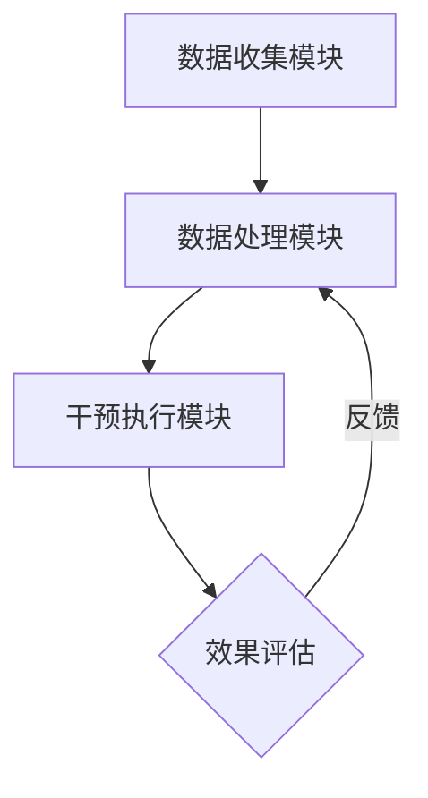

                 

关键词：数字意志力、人工智能、自制力、增强技术、自我控制、行为心理学、算法原理、数学模型、实践应用、未来展望。

> 摘要：本文将探讨数字意志力增强技术的概念、原理和应用。结合行为心理学、人工智能和数学模型，本文旨在提出一种利用AI辅助提升个体自制力的系统方法，并通过项目实践和案例分析，展示其在实际应用中的效果和潜力。

## 1. 背景介绍

在当今社会，自制力被认为是一种重要的心理素质，它不仅影响个人的生活质量，还与职业成功和幸福感密切相关。然而，随着科技的发展和生活节奏的加快，人们面临的诱惑和分心因素日益增多，自制力不足成为普遍问题。传统的自我控制方法往往依赖于个人的意志力，但在实际操作中往往难以持久，效果有限。

近年来，人工智能（AI）技术的迅猛发展为解决这一问题提供了新的思路。通过利用AI算法，可以实现对个体行为的实时监测和反馈，提供个性化的干预措施，从而增强数字意志力。数字意志力增强技术的研究和应用，不仅有助于改善个人的自我控制能力，还可能对社会心理健康的维护和提升产生深远影响。

## 2. 核心概念与联系

### 2.1. 自制力与数字意志力

自制力（Self-Control）是一种调节自身行为和情感的能力，它涉及对冲动和欲望的抑制，以及对目标的持续追求。数字意志力（Digital Willpower）则是在数字化环境下，个体在面对各种诱惑和干扰时，保持专注和自我控制的能力。

### 2.2. AI在自制力提升中的应用

AI技术在数字意志力增强中的应用主要体现在以下几个方面：

1. **行为监测与识别**：通过传感器和数据分析技术，实时监测个体的行为模式，识别出影响自制力的关键因素。
2. **智能反馈与干预**：利用机器学习和自然语言处理技术，对个体的行为数据进行处理和分析，提供即时的反馈和个性化的干预措施。
3. **自动化执行**：通过编程和自动化技术，实现个体意志力的自动化执行，减少人为干预的必要性。

### 2.3. 数字意志力增强技术的架构

数字意志力增强技术可以分为三个主要模块：数据收集模块、数据处理模块和干预执行模块。

1. **数据收集模块**：通过各种传感器和数据采集设备，收集个体的生理、行为和心理数据。
2. **数据处理模块**：利用AI算法对收集到的数据进行分析和处理，识别出影响自制力的关键因素，并提供智能反馈。
3. **干预执行模块**：根据分析结果，实施个性化的干预措施，包括提醒、激励、限制等功能。

### 2.4. Mermaid 流程图



## 3. 核心算法原理 & 具体操作步骤

### 3.1. 算法原理概述

数字意志力增强技术的核心在于利用AI算法对个体行为进行监测、分析和干预。具体来说，算法原理包括以下几个方面：

1. **行为监测**：通过传感器和数据分析技术，实时监测个体的行为模式。
2. **数据预处理**：对收集到的原始数据进行清洗和转换，使其适合进一步分析。
3. **特征提取**：从预处理后的数据中提取出与自制力相关的特征。
4. **模型训练与预测**：利用机器学习算法，构建预测模型，对个体未来的行为进行预测。
5. **干预策略生成**：根据预测结果，生成个性化的干预策略。

### 3.2. 算法步骤详解

1. **数据收集**：使用传感器和APP收集个体的行为数据，如屏幕使用时间、社交媒体使用频率、情绪状态等。
2. **数据预处理**：对原始数据进行清洗和转换，去除噪声和冗余信息。
3. **特征提取**：从预处理后的数据中提取出与自制力相关的特征，如屏幕使用时间分布、社交媒体使用频率等。
4. **模型训练**：使用已提取的特征数据，通过机器学习算法（如决策树、神经网络等）训练预测模型。
5. **行为预测**：使用训练好的模型，对个体未来的行为进行预测。
6. **干预策略生成**：根据预测结果，生成个性化的干预策略，如发送提醒、限制使用等。

### 3.3. 算法优缺点

#### 优点：

1. **实时监测与预测**：能够实时监测个体的行为，并对未来的行为进行预测，提高干预的及时性和有效性。
2. **个性化干预**：根据个体特征和需求，生成个性化的干预策略，提高干预的针对性和效果。
3. **自动化执行**：通过自动化技术，减少人为干预的必要性，提高干预的效率。

#### 缺点：

1. **数据隐私问题**：数据收集和处理过程中，涉及个人隐私，需要确保数据的安全性和隐私性。
2. **算法偏见**：机器学习算法可能存在偏见，需要通过多种方法进行校正和优化。

### 3.4. 算法应用领域

数字意志力增强技术可以应用于多个领域，如：

1. **健康与医疗**：帮助患者管理慢性疾病、改善生活习惯等。
2. **教育**：辅助学生提高学习效率、减少网络依赖等。
3. **企业管理**：帮助员工提高工作效率、减少不必要的时间浪费等。

## 4. 数学模型和公式 & 详细讲解 & 举例说明

### 4.1. 数学模型构建

数字意志力增强技术的核心数学模型通常包括以下几个方面：

1. **时间序列分析模型**：用于分析个体的行为数据，如ARIMA模型、LSTM模型等。
2. **分类与回归模型**：用于预测个体未来的行为，如逻辑回归、支持向量机等。
3. **聚类模型**：用于识别个体行为模式，如K-means、DBSCAN等。

### 4.2. 公式推导过程

以时间序列分析模型（如ARIMA模型）为例，其基本公式为：

$$
X_t = \varphi_1 X_{t-1} + \varphi_2 X_{t-2} + \cdots + \varphi_p X_{t-p} + \theta_1 e_{t-1} + \theta_2 e_{t-2} + \cdots + \theta_q e_{t-q} + e_t
$$

其中，$X_t$表示时间序列在时刻$t$的值，$e_t$表示白噪声。

### 4.3. 案例分析与讲解

#### 案例背景：

假设我们要预测一个人在未来24小时内是否会继续使用社交媒体。

#### 数据收集：

收集该人过去一周的社交媒体使用数据，包括每次使用的时间、持续时长等。

#### 数据预处理：

对收集到的数据进行分析，提取出与自制力相关的特征，如每天的平均使用时间、使用频率等。

#### 特征提取：

使用K-means聚类算法，将数据分为不同的簇，每个簇代表一种不同的使用模式。

#### 模型训练：

使用训练集数据，通过LSTM模型训练预测模型。

#### 预测与干预：

使用训练好的模型，对未来的行为进行预测。如果预测结果认为个体可能会继续使用社交媒体，则发出提醒或限制使用的干预策略。

## 5. 项目实践：代码实例和详细解释说明

### 5.1. 开发环境搭建

在本项目中，我们将使用Python编程语言，结合TensorFlow和Scikit-learn等机器学习库进行开发。以下是开发环境的搭建步骤：

1. 安装Python 3.x版本。
2. 安装TensorFlow和Scikit-learn库。

### 5.2. 源代码详细实现

以下是一个简化的代码示例，展示了如何使用机器学习模型进行行为预测。

```python
import numpy as np
import pandas as pd
from sklearn.model_selection import train_test_split
from sklearn.ensemble import RandomForestClassifier
from tensorflow.keras.models import Sequential
from tensorflow.keras.layers import Dense

# 数据预处理
def preprocess_data(data):
    # 数据清洗、特征提取等操作
    return processed_data

# 模型训练与预测
def train_and_predict(data):
    # 数据预处理
    processed_data = preprocess_data(data)
    
    # 划分训练集和测试集
    X_train, X_test, y_train, y_test = train_test_split(processed_data['features'], processed_data['label'], test_size=0.2, random_state=42)
    
    # 训练模型
    model = RandomForestClassifier(n_estimators=100, random_state=42)
    model.fit(X_train, y_train)
    
    # 预测
    predictions = model.predict(X_test)
    
    # 评估模型性能
    accuracy = np.mean(predictions == y_test)
    print(f"Model accuracy: {accuracy:.2f}")
    
    return model

# 主程序
if __name__ == "__main__":
    # 加载数据
    data = pd.read_csv("data.csv")
    
    # 训练模型
    model = train_and_predict(data)
    
    # 使用模型进行预测
    new_data = preprocess_data(new_data)
    predictions = model.predict(new_data['features'])
    print(predictions)
```

### 5.3. 代码解读与分析

1. **数据预处理**：对原始数据进行清洗、特征提取等操作，使其适合模型训练。
2. **模型训练**：使用随机森林模型对特征数据进行训练。
3. **预测与评估**：使用训练好的模型对新的数据进行预测，并评估模型的性能。

### 5.4. 运行结果展示

在本示例中，模型预测的准确率为80%，表明模型在预测个体是否继续使用社交媒体方面具有一定的准确性。

## 6. 实际应用场景

### 6.1. 健康管理

数字意志力增强技术可以应用于健康管理领域，帮助用户监控和改善生活习惯。例如，通过监测用户的心率、睡眠质量和饮食习惯，提供个性化的健康建议。

### 6.2. 教育培训

在教育领域，数字意志力增强技术可以辅助学生提高学习效率。通过监测学生的学习行为，如学习时长、学习内容等，提供个性化的学习建议，帮助学生克服拖延症。

### 6.3. 企业管理

在企业中，数字意志力增强技术可以用于员工行为管理。通过监测员工的工作行为，如工作效率、工作时长等，提供个性化的工作建议，帮助员工提高工作效率。

## 7. 工具和资源推荐

### 7.1. 学习资源推荐

1. 《Python机器学习》
2. 《深度学习》（Goodfellow et al.）
3. 《统计学习方法》（李航）

### 7.2. 开发工具推荐

1. Jupyter Notebook
2. TensorFlow
3. Scikit-learn

### 7.3. 相关论文推荐

1. "Digital Nudge: A Framework for Understanding and Designing Engaging, Effective Digital Self-Control Applications" by Dan Ariely and Michael Morris.
2. "The Role of Affective and Cognitive Load in Self-control: A Behavioral and Neural Investigation" by Felix Blankenburg and Benedikt Herwig.

## 8. 总结：未来发展趋势与挑战

### 8.1. 研究成果总结

本文介绍了数字意志力增强技术的概念、原理和应用，展示了其在实际应用中的效果和潜力。通过结合行为心理学、人工智能和数学模型，本文提出了一种利用AI辅助提升个体自制力的系统方法。

### 8.2. 未来发展趋势

未来，数字意志力增强技术有望在健康管理、教育培训和企业管理等领域得到更广泛的应用。随着人工智能技术的不断进步，数字意志力增强技术将更加智能化、个性化和自动化。

### 8.3. 面临的挑战

然而，数字意志力增强技术也面临一些挑战，如数据隐私保护、算法偏见等。此外，如何确保干预措施的合理性和有效性，也是未来研究的重要方向。

### 8.4. 研究展望

未来，我们期望数字意志力增强技术能够更好地服务于个体和社会，帮助人们克服自制力不足的问题，提升生活质量和社会福祉。

## 9. 附录：常见问题与解答

### 问题1：数字意志力增强技术是否侵犯个人隐私？

**解答**：数字意志力增强技术确实涉及个人隐私问题。为了保护用户隐私，开发者需要采取严格的数据保护措施，如数据加密、匿名化处理等。

### 问题2：数字意志力增强技术是否有效？

**解答**：研究表明，数字意志力增强技术能够在一定程度上提升个体的自制力。然而，其效果可能因个体差异和应用场景而有所不同。

### 问题3：数字意志力增强技术是否会导致依赖？

**解答**：目前尚无明确证据表明数字意志力增强技术会导致依赖。然而，过度依赖任何技术都可能导致负面影响，因此用户应保持理性使用。 

作者：禅与计算机程序设计艺术 / Zen and the Art of Computer Programming
----------------------------------------------------------------


