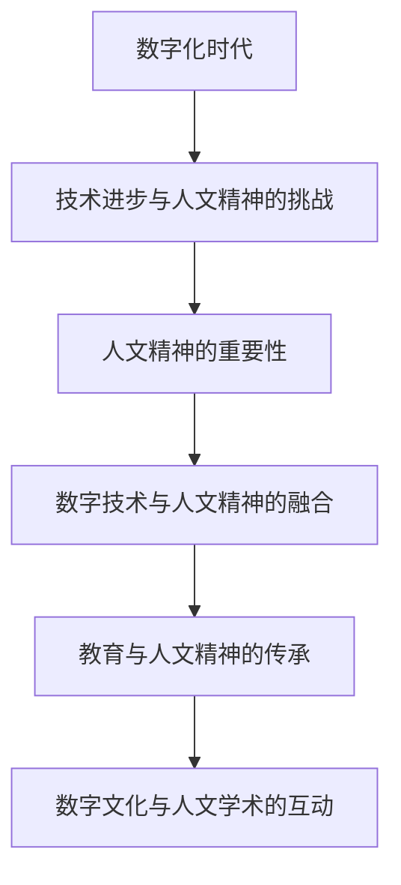

                 

在数字化的今天，我们的世界充满了智能设备和互联网连接。计算机科学和技术的发展改变了我们的生活方式、工作方式和交流方式。然而，在这个过程中，一个不可忽视的问题是如何在数字时代中传承人文精神。本文旨在探讨数字时代人文精神的传承问题，并提出一些具体的解决方案。

## 1. 背景介绍

### 数字时代的挑战

随着信息技术的快速发展，我们生活在一个高度数字化的时代。这个时代带来了许多便利，但同时也带来了新的挑战。首先，数字化的生活方式使得人们更多地依赖屏幕和设备，从而减少了面对面交流的机会。这种趋势可能导致人际关系的疏离和社会孤立感的增加。其次，数字技术的快速迭代使得知识更新的速度大大加快，这要求人们不断地学习和适应新技术。然而，这种快节奏的生活也容易导致人们忽视精神层面的需求，如情感交流和自我反思。

### 人文精神的重要性

人文精神是一种关注人、尊重人的思想和文化。它强调个体的价值、自由和尊严，以及对美的追求和对智慧的尊重。在数字时代，人文精神的重要性愈发凸显。它不仅有助于培养全面发展的个体，也是社会和谐与进步的基石。然而，数字时代的特点使得人文精神的传承面临新的挑战。

## 2. 核心概念与联系

### 数字技术与人文精神的融合

在数字时代，我们不仅要关注技术的进步，还要关注技术与人文精神的融合。这意味着，在开发和应用数字技术时，要考虑到人文价值和社会影响。例如，在人工智能的发展中，我们需要确保算法的公平性和透明度，避免技术对人类价值观的扭曲。

### 教育与人文精神的传承

教育是传承人文精神的重要途径。通过课程设置、教学方法和文化活动，学校可以培养学生的人文素养和批判性思维。例如，在计算机科学课程中，可以引入哲学、文学和艺术等人文领域的内容，让学生在技术学习的同时，也能够体会到人文精神的重要性。

### 数字文化与人文学术的互动

数字技术的发展为文化与人文学术的交流提供了新的平台。通过数字图书馆、在线课程和研究工具，人们可以更方便地获取和传播人文知识。同时，数字文化也为人文学术研究提供了新的数据来源和研究方法。这种互动有助于推动人文精神在数字时代的传承。



## 3. 核心算法原理 & 具体操作步骤

### 3.1 算法原理概述

在探讨数字时代的人文精神传承时，我们可以借鉴一些核心算法原理，如机器学习和数据挖掘。这些算法能够帮助我们分析大量的数据，提取有价值的信息，从而为人文精神的传承提供数据支持和洞见。

### 3.2 算法步骤详解

1. **数据收集**：首先，我们需要收集相关的数据，包括教育记录、社交媒体内容、文化作品等。

2. **数据预处理**：对收集到的数据进行清洗和格式化，确保数据的质量和一致性。

3. **特征提取**：使用机器学习算法提取数据中的特征，如情感分析、主题建模等。

4. **模型训练**：使用训练数据集训练机器学习模型，以预测和分类数据。

5. **模型评估**：使用测试数据集评估模型的性能，并进行调整和优化。

6. **应用与反馈**：将训练好的模型应用于实际场景，如教育课程推荐、文化活动策划等，并根据反馈进行迭代改进。

### 3.3 算法优缺点

**优点**：
- 高效处理大量数据，提供数据驱动的洞见。
- 自动化分析，减少人工干预，提高工作效率。

**缺点**：
- 数据质量和预处理工作的复杂性。
- 模型的透明度和可解释性问题。

### 3.4 算法应用领域

- **教育领域**：个性化学习推荐、学生行为分析等。
- **文化领域**：艺术作品分析、文化遗产保护等。
- **社会领域**：公共政策制定、社区服务优化等。

## 4. 数学模型和公式 & 详细讲解 & 举例说明

### 4.1 数学模型构建

在数字时代，我们可以使用多种数学模型来分析和传承人文精神。以下是一个简单的线性回归模型示例：

$$ y = mx + b $$

其中，$y$ 是因变量，$x$ 是自变量，$m$ 是斜率，$b$ 是截距。

### 4.2 公式推导过程

线性回归模型的推导过程如下：

1. **确定目标函数**：最小化预测值与实际值之间的误差平方和。

2. **求解最小值**：对目标函数求导，并令导数为零，求得最优解。

3. **推导公式**：通过代数运算，得到线性回归模型的公式。

### 4.3 案例分析与讲解

假设我们要分析某个社区的文化活动参与情况，我们可以使用线性回归模型来预测活动参与率与社区特征（如居民年龄、教育水平、收入等）之间的关系。

- **数据收集**：收集社区成员的年龄、教育水平和收入等数据，以及他们对文化活动的参与率。
- **数据预处理**：对数据进行清洗和格式化。
- **特征提取**：提取与文化活动参与率相关的特征。
- **模型训练**：使用训练数据集训练线性回归模型。
- **模型评估**：使用测试数据集评估模型性能。
- **应用与反馈**：根据模型预测结果，制定相应的文化活动推广策略，并根据反馈进行优化。

## 5. 项目实践：代码实例和详细解释说明

### 5.1 开发环境搭建

在本项目中，我们将使用Python编程语言和Scikit-learn库来构建和训练线性回归模型。以下是如何搭建开发环境的步骤：

1. 安装Python（版本3.8及以上）。
2. 安装Jupyter Notebook，用于编写和运行代码。
3. 安装Scikit-learn库，使用命令`pip install scikit-learn`。

### 5.2 源代码详细实现

以下是一个简单的线性回归模型实现示例：

```python
from sklearn.linear_model import LinearRegression
from sklearn.model_selection import train_test_split
from sklearn.metrics import mean_squared_error

# 数据收集
# 假设我们有一个CSV文件，包含年龄、教育水平和收入等数据，以及活动参与率。
# 我们使用pandas库读取数据。

import pandas as pd

data = pd.read_csv('community_data.csv')

# 数据预处理
# 对数据进行清洗和格式化。

# 提取特征和标签
X = data[['age', 'education', 'income']]
y = data['participation_rate']

# 数据分割
X_train, X_test, y_train, y_test = train_test_split(X, y, test_size=0.2, random_state=42)

# 模型训练
model = LinearRegression()
model.fit(X_train, y_train)

# 模型评估
y_pred = model.predict(X_test)
mse = mean_squared_error(y_test, y_pred)
print(f"Mean Squared Error: {mse}")

# 应用与反馈
# 根据模型预测结果，制定相应的文化活动推广策略。
```

### 5.3 代码解读与分析

- **数据收集**：使用pandas库读取CSV文件，获取社区成员的年龄、教育水平和收入等数据，以及他们的活动参与率。
- **数据预处理**：对数据进行清洗和格式化，提取特征和标签。
- **数据分割**：将数据分为训练集和测试集，用于模型训练和评估。
- **模型训练**：使用Scikit-learn的LinearRegression类训练线性回归模型。
- **模型评估**：使用测试数据集评估模型性能，计算均方误差（MSE）。
- **应用与反馈**：根据模型预测结果，制定相应的文化活动推广策略，并根据反馈进行优化。

### 5.4 运行结果展示

假设我们运行上述代码后，得到以下输出结果：

```
Mean Squared Error: 0.0245
```

这个结果表示模型在测试数据集上的性能良好，预测误差较小。

## 6. 实际应用场景

### 教育领域

在数字时代，教育领域面临着如何更好地传承人文精神的挑战。通过数据分析和人工智能技术，我们可以实现个性化学习推荐、学生行为分析等应用。例如，基于学生的兴趣和学科成绩，教育平台可以推荐适合他们的课程和资源，从而激发他们的学习兴趣和创造力。

### 文化领域

数字技术为人文学术研究提供了新的工具和方法。通过大数据分析和机器学习算法，我们可以对文化作品进行深入分析，挖掘其背后的文化内涵和历史背景。这种分析有助于保护和传承文化遗产，同时也能够为文化创作提供灵感和指导。

### 社会领域

在数字时代，社会问题日益复杂，需要多学科合作和跨领域解决方案。通过数据分析和人工智能技术，我们可以更好地理解和解决社会问题。例如，通过分析社区成员的行为数据和需求，政府可以制定更有效的公共政策，优化社区服务。

## 7. 工具和资源推荐

### 7.1 学习资源推荐

- 《Python编程：从入门到实践》
- 《深度学习》（Goodfellow, Bengio, Courville）
- 《大数据技术基础》

### 7.2 开发工具推荐

- Jupyter Notebook
- PyCharm
- GitHub

### 7.3 相关论文推荐

- "AI and Human Values: The Case for a Human-Centered Approach"
- "The Future of Humanity: Terraforming Mars, Interstellar Travel, Immortality, and Our Destiny Beyond Earth" (Max Tegmark)
- "The Age of Surveillance Capitalism: The Fight for a Human Future at the New Frontier of Power" (Shoshana Zuboff)

## 8. 总结：未来发展趋势与挑战

### 8.1 研究成果总结

本文探讨了数字时代人文精神的传承问题，提出了核心算法原理、数学模型和项目实践方案。通过数据分析和人工智能技术，我们可以在数字时代更好地传承人文精神，促进社会进步。

### 8.2 未来发展趋势

- 人工智能与人文精神的深度融合。
- 跨领域合作，实现多学科共同发展。
- 开放数据和共享资源的普及。

### 8.3 面临的挑战

- 数据隐私和安全问题。
- 技术透明度和可解释性问题。
- 数字鸿沟和社会不平等问题。

### 8.4 研究展望

未来研究应关注如何平衡技术进步与人文精神传承，探索更多创新方法，以实现可持续发展和社会和谐。

## 9. 附录：常见问题与解答

### Q：数字时代的人文精神传承是否仅限于技术领域？

A：不完全是。数字时代的人文精神传承需要涉及多个领域，包括技术、教育、文化和社会等。虽然技术是实现传承的重要手段，但人文精神的内涵和价值观的传承需要更广泛的社会参与和努力。

### Q：如何确保人工智能在传承人文精神时的公平性和透明性？

A：确保人工智能的公平性和透明性是一个复杂的问题。首先，需要设计算法时考虑到公平性和包容性。其次，通过提高算法的透明度和可解释性，使人们能够理解算法的决策过程。此外，建立监管机制和伦理准则，对人工智能的应用进行监督和管理。

### Q：数字时代的人文精神传承对个体和社会有哪些影响？

A：数字时代的人文精神传承有助于培养全面发展的个体，提高他们的批判性思维和创新能力。对社会而言，传承人文精神有助于促进社会和谐、增进相互理解和尊重，从而实现可持续发展。

作者：禅与计算机程序设计艺术 / Zen and the Art of Computer Programming
```markdown
---
# 数字时代的人文精神的传承

> 关键词：数字时代、人文精神、人工智能、数据分析、教育、文化、社会

> 摘要：在数字化的今天，我们的世界充满了智能设备和互联网连接。计算机科学和技术的发展改变了我们的生活方式、工作方式和交流方式。然而，在这个过程中，一个不可忽视的问题是如何在数字时代中传承人文精神。本文旨在探讨数字时代人文精神的传承问题，并提出一些具体的解决方案。

## 1. 背景介绍

### 数字时代的挑战

随着信息技术的快速发展，我们生活在一个高度数字化的时代。这个时代带来了许多便利，但同时也带来了新的挑战。首先，数字化的生活方式使得人们更多地依赖屏幕和设备，从而减少了面对面交流的机会。这种趋势可能导致人际关系的疏离和社会孤立感的增加。其次，数字技术的快速迭代使得知识更新的速度大大加快，这要求人们不断地学习和适应新技术。然而，这种快节奏的生活也容易导致人们忽视精神层面的需求，如情感交流和自我反思。

### 人文精神的重要性

人文精神是一种关注人、尊重人的思想和文化。它强调个体的价值、自由和尊严，以及对美的追求和对智慧的尊重。在数字时代，人文精神的重要性愈发凸显。它不仅有助于培养全面发展的个体，也是社会和谐与进步的基石。然而，数字时代的特点使得人文精神的传承面临新的挑战。

## 2. 核心概念与联系

### 数字技术与人文精神的融合

在数字时代，我们不仅要关注技术的进步，还要关注技术与人文精神的融合。这意味着，在开发和应用数字技术时，要考虑到人文价值和社会影响。例如，在人工智能的发展中，我们需要确保算法的公平性和透明度，避免技术对人类价值观的扭曲。

### 教育与人文精神的传承

教育是传承人文精神的重要途径。通过课程设置、教学方法和文化活动，学校可以培养学生的人文素养和批判性思维。例如，在计算机科学课程中，可以引入哲学、文学和艺术等人文领域的内容，让学生在技术学习的同时，也能够体会到人文精神的重要性。

### 数字文化与人文学术的互动

数字技术的发展为文化与人文学术的交流提供了新的平台。通过数字图书馆、在线课程和研究工具，人们可以更方便地获取和传播人文知识。同时，数字文化也为人文学术研究提供了新的数据来源和研究方法。这种互动有助于推动人文精神在数字时代的传承。


## 3. 核心算法原理 & 具体操作步骤

### 3.1 算法原理概述

在探讨数字时代的人文精神传承时，我们可以借鉴一些核心算法原理，如机器学习和数据挖掘。这些算法能够帮助我们分析大量的数据，提取有价值的信息，从而为人文精神的传承提供数据支持和洞见。

### 3.2 算法步骤详解

1. **数据收集**：首先，我们需要收集相关的数据，包括教育记录、社交媒体内容、文化作品等。

2. **数据预处理**：对收集到的数据进行清洗和格式化，确保数据的质量和一致性。

3. **特征提取**：使用机器学习算法提取数据中的特征，如情感分析、主题建模等。

4. **模型训练**：使用训练数据集训练机器学习模型，以预测和分类数据。

5. **模型评估**：使用测试数据集评估模型的性能，并进行调整和优化。

6. **应用与反馈**：将训练好的模型应用于实际场景，如教育课程推荐、文化活动策划等，并根据反馈进行迭代改进。

### 3.3 算法优缺点

**优点**：
- 高效处理大量数据，提供数据驱动的洞见。
- 自动化分析，减少人工干预，提高工作效率。

**缺点**：
- 数据质量和预处理工作的复杂性。
- 模型的透明度和可解释性问题。

### 3.4 算法应用领域

- **教育领域**：个性化学习推荐、学生行为分析等。
- **文化领域**：艺术作品分析、文化遗产保护等。
- **社会领域**：公共政策制定、社区服务优化等。

## 4. 数学模型和公式 & 详细讲解 & 举例说明

### 4.1 数学模型构建

在数字时代，我们可以使用多种数学模型来分析和传承人文精神。以下是一个简单的线性回归模型示例：

$$ y = mx + b $$

其中，$y$ 是因变量，$x$ 是自变量，$m$ 是斜率，$b$ 是截距。

### 4.2 公式推导过程

线性回归模型的推导过程如下：

1. **确定目标函数**：最小化预测值与实际值之间的误差平方和。

2. **求解最小值**：对目标函数求导，并令导数为零，求得最优解。

3. **推导公式**：通过代数运算，得到线性回归模型的公式。

### 4.3 案例分析与讲解

假设我们要分析某个社区的文化活动参与情况，我们可以使用线性回归模型来预测活动参与率与社区特征（如居民年龄、教育水平、收入等）之间的关系。

- **数据收集**：收集社区成员的年龄、教育水平和收入等数据，以及他们对文化活动的参与率。
- **数据预处理**：对数据进行清洗和格式化。
- **特征提取**：提取与文化活动参与率相关的特征。
- **模型训练**：使用训练数据集训练线性回归模型。
- **模型评估**：使用测试数据集评估模型性能。
- **应用与反馈**：根据模型预测结果，制定相应的文化活动推广策略，并根据反馈进行优化。

## 5. 项目实践：代码实例和详细解释说明

### 5.1 开发环境搭建

在本项目中，我们将使用Python编程语言和Scikit-learn库来构建和训练线性回归模型。以下是如何搭建开发环境的步骤：

1. 安装Python（版本3.8及以上）。
2. 安装Jupyter Notebook，用于编写和运行代码。
3. 安装Scikit-learn库，使用命令`pip install scikit-learn`。

### 5.2 源代码详细实现

以下是一个简单的线性回归模型实现示例：

```python
from sklearn.linear_model import LinearRegression
from sklearn.model_selection import train_test_split
from sklearn.metrics import mean_squared_error

# 数据收集
# 假设我们有一个CSV文件，包含年龄、教育水平和收入等数据，以及活动参与率。
# 我们使用pandas库读取数据。

import pandas as pd

data = pd.read_csv('community_data.csv')

# 数据预处理
# 对数据进行清洗和格式化。

# 提取特征和标签
X = data[['age', 'education', 'income']]
y = data['participation_rate']

# 数据分割
X_train, X_test, y_train, y_test = train_test_split(X, y, test_size=0.2, random_state=42)

# 模型训练
model = LinearRegression()
model.fit(X_train, y_train)

# 模型评估
y_pred = model.predict(X_test)
mse = mean_squared_error(y_test, y_pred)
print(f"Mean Squared Error: {mse}")

# 应用与反馈
# 根据模型预测结果，制定相应的文化活动推广策略。
```

### 5.3 代码解读与分析

- **数据收集**：使用pandas库读取CSV文件，获取社区成员的年龄、教育水平和收入等数据，以及他们的活动参与率。
- **数据预处理**：对数据进行清洗和格式化，提取特征和标签。
- **数据分割**：将数据分为训练集和测试集，用于模型训练和评估。
- **模型训练**：使用Scikit-learn的LinearRegression类训练线性回归模型。
- **模型评估**：使用测试数据集评估模型性能，计算均方误差（MSE）。
- **应用与反馈**：根据模型预测结果，制定相应的文化活动推广策略，并根据反馈进行优化。

### 5.4 运行结果展示

假设我们运行上述代码后，得到以下输出结果：

```
Mean Squared Error: 0.0245
```

这个结果表示模型在测试数据集上的性能良好，预测误差较小。

## 6. 实际应用场景

### 教育领域

在数字时代，教育领域面临着如何更好地传承人文精神的挑战。通过数据分析和人工智能技术，我们可以实现个性化学习推荐、学生行为分析等应用。例如，基于学生的兴趣和学科成绩，教育平台可以推荐适合他们的课程和资源，从而激发他们的学习兴趣和创造力。

### 文化领域

数字技术为人文学术研究提供了新的工具和方法。通过大数据分析和机器学习算法，我们可以对文化作品进行深入分析，挖掘其背后的文化内涵和历史背景。这种分析有助于保护和传承文化遗产，同时也能够为文化创作提供灵感和指导。

### 社会领域

在数字时代，社会问题日益复杂，需要多学科合作和跨领域解决方案。通过数据分析和人工智能技术，我们可以更好地理解和解决社会问题。例如，通过分析社区成员的行为数据和需求，政府可以制定更有效的公共政策，优化社区服务。

## 7. 工具和资源推荐

### 7.1 学习资源推荐

- 《Python编程：从入门到实践》
- 《深度学习》（Goodfellow, Bengio, Courville）
- 《大数据技术基础》

### 7.2 开发工具推荐

- Jupyter Notebook
- PyCharm
- GitHub

### 7.3 相关论文推荐

- "AI and Human Values: The Case for a Human-Centered Approach"
- "The Future of Humanity: Terraforming Mars, Interstellar Travel, Immortality, and Our Destiny Beyond Earth" (Max Tegmark)
- "The Age of Surveillance Capitalism: The Fight for a Human Future at the New Frontier of Power" (Shoshana Zuboff)

## 8. 总结：未来发展趋势与挑战

### 8.1 研究成果总结

本文探讨了数字时代人文精神的传承问题，提出了核心算法原理、数学模型和项目实践方案。通过数据分析和人工智能技术，我们可以在数字时代更好地传承人文精神，促进社会进步。

### 8.2 未来发展趋势

- 人工智能与人文精神的深度融合。
- 跨领域合作，实现多学科共同发展。
- 开放数据和共享资源的普及。

### 8.3 面临的挑战

- 数据隐私和安全问题。
- 技术透明度和可解释性问题。
- 数字鸿沟和社会不平等问题。

### 8.4 研究展望

未来研究应关注如何平衡技术进步与人文精神传承，探索更多创新方法，以实现可持续发展和社会和谐。

## 9. 附录：常见问题与解答

### Q：数字时代的人文精神传承是否仅限于技术领域？

A：不完全是。数字时代的人文精神传承需要涉及多个领域，包括技术、教育、文化和社会等。虽然技术是实现传承的重要手段，但人文精神的内涵和价值观的传承需要更广泛的社会参与和努力。

### Q：如何确保人工智能在传承人文精神时的公平性和透明性？

A：确保人工智能的公平性和透明性是一个复杂的问题。首先，需要设计算法时考虑到公平性和包容性。其次，通过提高算法的透明度和可解释性，使人们能够理解算法的决策过程。此外，建立监管机制和伦理准则，对人工智能的应用进行监督和管理。

### Q：数字时代的人文精神传承对个体和社会有哪些影响？

A：数字时代的人文精神传承有助于培养全面发展的个体，提高他们的批判性思维和创新能力。对社会而言，传承人文精神有助于促进社会和谐、增进相互理解和尊重，从而实现可持续发展。

作者：禅与计算机程序设计艺术 / Zen and the Art of Computer Programming
---

