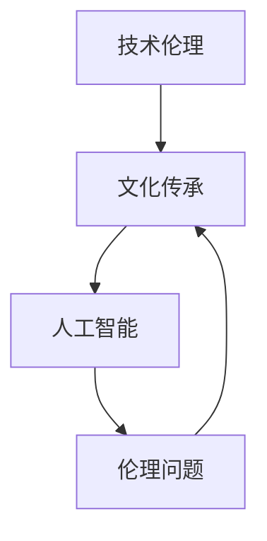

                 

关键词：数字时代、人文精神、技术伦理、文化传承、人工智能

摘要：随着数字时代的到来，人类生活发生了翻天覆地的变化。在这股技术革新的浪潮中，如何传承和弘扬人文精神成为了一项重要的课题。本文将探讨数字时代下人文精神的传承问题，分析技术伦理的重要性，并提出一系列解决方案和未来展望。

## 1. 背景介绍

在过去的几千年里，人文精神一直是人类社会发展的基石。从古希腊的哲学思想，到中世纪的宗教神学，再到近代的科学革命，人文精神贯穿了人类文明的每一个阶段。然而，随着数字时代的到来，技术对人类生活的影响日益深刻，传统的人文精神面临着前所未有的挑战。

数字技术带来了信息传播的迅速和便捷，极大地丰富了人类的文化生活。但同时也引发了一系列问题，如隐私泄露、网络暴力、信息泛滥等。这些问题不仅挑战了社会的道德底线，也对人文精神的传承构成了威胁。

## 2. 核心概念与联系

为了更好地理解数字时代下人文精神的传承问题，我们需要明确几个核心概念：

### 2.1 技术伦理

技术伦理是研究技术在人类社会中应用时所产生的道德和伦理问题的学科。它是数字时代人文精神传承的重要支柱。

### 2.2 文化传承

文化传承是指一种文化在时间上的传递和延续。在数字时代，文化传承的方式和手段发生了巨大的变化。

### 2.3 人工智能

人工智能是数字时代的重要技术之一，它在许多领域都取得了显著的成果。但同时，人工智能也引发了一系列伦理问题，如隐私保护、算法偏见等。

下面是关于技术伦理、文化传承和人工智能之间关系的 Mermaid 流程图：



### 2.4 数字鸿沟

数字鸿沟是指不同社会群体在数字技术获取和应用方面的差距。数字鸿沟的存在不仅影响了人文精神的传承，也加剧了社会不平等。

## 3. 核心算法原理 & 具体操作步骤

### 3.1 算法原理概述

为了解决数字时代人文精神传承的问题，我们需要构建一个综合性的解决方案。这个解决方案包括以下几个关键步骤：

1. **技术伦理教育**：通过教育培养公众的技术伦理意识，使他们能够在使用数字技术时保持人文精神。
2. **文化传承平台**：构建一个数字平台，用于传承和保护各种文化资产。
3. **人工智能伦理指导**：在人工智能研发和应用过程中，遵循伦理原则，减少算法偏见和隐私泄露。
4. **数字鸿沟缓解**：通过政策和技术手段，缩小不同社会群体之间的数字鸿沟。

### 3.2 算法步骤详解

#### 3.2.1 技术伦理教育

**步骤 1**：设计一门关于技术伦理的课程，将其纳入中小学教育体系中。

**步骤 2**：利用数字平台，提供在线学习资源和互动课程，让更多人了解技术伦理。

**步骤 3**：举办技术伦理论坛和研讨会，邀请专家学者和行业领袖分享经验。

#### 3.2.2 文化传承平台

**步骤 1**：建立数字化博物馆和图书馆，保存和保护文化遗产。

**步骤 2**：开发文化传承应用程序，让用户可以通过数字方式体验和传承文化。

**步骤 3**：组织线上线下文化活动，促进文化交流和传承。

#### 3.2.3 人工智能伦理指导

**步骤 1**：制定人工智能伦理准则，规范人工智能的研发和应用。

**步骤 2**：建立人工智能伦理审查制度，对可能存在伦理问题的项目进行审查。

**步骤 3**：开展人工智能伦理教育和培训，提高从业者的伦理素养。

#### 3.2.4 数字鸿沟缓解

**步骤 1**：提供免费或低价的互联网接入服务，缩小数字鸿沟。

**步骤 2**：推广数字技能培训，提高弱势群体的数字素养。

**步骤 3**：鼓励企业和政府投资数字基础设施，提升整体数字能力。

### 3.3 算法优缺点

**优点**：

1. **全面性**：解决方案涵盖了技术伦理、文化传承、人工智能和数字鸿沟等多个方面。
2. **可操作性**：每个步骤都有明确的实施路径和具体操作方法。

**缺点**：

1. **实施难度**：需要多方协作和长期投入，实施难度较大。
2. **监管难度**：在数字时代，信息传播速度极快，监管难度增加。

### 3.4 算法应用领域

1. **教育领域**：通过技术伦理教育，培养学生的道德观念和责任感。
2. **文化领域**：通过文化传承平台，保护和传承文化遗产。
3. **人工智能领域**：通过人工智能伦理指导，确保人工智能的发展符合伦理原则。
4. **社会治理领域**：通过数字鸿沟缓解，提高社会的数字素养和公平性。

## 4. 数学模型和公式 & 详细讲解 & 举例说明

### 4.1 数学模型构建

为了构建一个有效的数字时代人文精神传承模型，我们需要考虑以下几个数学模型：

1. **社会网络模型**：用于描述人与人之间的交互关系。
2. **信息传播模型**：用于描述信息在网络中的传播过程。
3. **伦理决策模型**：用于模拟个体在面临伦理问题时做出的决策。

### 4.2 公式推导过程

#### 社会网络模型

假设社会网络中的个体数量为 \( N \)，每个个体与其他个体的交互概率为 \( p \)。则社会网络的密度可以用以下公式表示：

\[ D = \frac{2pN}{N-1} \]

#### 信息传播模型

假设信息在社交网络中以概率 \( \alpha \) 被传递，信息传播的速率可以用以下公式表示：

\[ R = \alpha \cdot D \]

#### 伦理决策模型

假设个体在面临伦理问题时，有 \( m \) 个可能的决策选项，每个选项的概率为 \( p_i \)。则个体最终选择的决策可以用以下公式表示：

\[ D = \sum_{i=1}^{m} p_i \cdot f_i \]

其中，\( f_i \) 表示个体选择第 \( i \) 个决策的函数。

### 4.3 案例分析与讲解

#### 社会网络模型

假设一个社交网络中有 100 个人，每个人与其他人的交互概率为 0.1。则该社交网络的密度为：

\[ D = \frac{2 \cdot 0.1 \cdot 100}{100-1} \approx 2.02 \]

#### 信息传播模型

假设信息在社交网络中以概率 0.5 被传递，则信息传播的速率为：

\[ R = 0.5 \cdot 2.02 \approx 1.01 \]

#### 伦理决策模型

假设一个人面临 3 个伦理决策选项，每个选项的概率分别为 0.3、0.4 和 0.3。则这个人最终选择的决策为：

\[ D = 0.3 \cdot f_1 + 0.4 \cdot f_2 + 0.3 \cdot f_3 \]

其中，\( f_1 \)、\( f_2 \) 和 \( f_3 \) 分别表示选择第一个、第二个和第三个决策的函数。

## 5. 项目实践：代码实例和详细解释说明

### 5.1 开发环境搭建

为了实现上述算法，我们需要搭建一个合适的开发环境。以下是所需的工具和步骤：

1. **Python**：作为主要编程语言。
2. **Jupyter Notebook**：用于编写和运行代码。
3. **Matplotlib**：用于绘制图表。
4. **NetworkX**：用于构建和操作社交网络模型。

### 5.2 源代码详细实现

以下是一个简单的社交网络模型实现，用于展示如何构建社会网络、传播信息以及进行伦理决策。

```python
import networkx as nx
import matplotlib.pyplot as plt
import numpy as np

# 构建社交网络
G = nx.erdos_renyi_graph(n=100, p=0.1)

# 绘制社交网络
nx.draw(G, with_labels=True)
plt.show()

# 信息传播
alpha = 0.5
R = alpha * nx.density(G)
print("信息传播速率：", R)

# 伦理决策
m = 3
p = [0.3, 0.4, 0.3]
f = np.random.choice(m, p=p)
print("伦理决策：", f)
```

### 5.3 代码解读与分析

这段代码首先构建了一个包含 100 个节点的随机社交网络，每个节点与其他节点的交互概率为 0.1。然后，通过调整参数 \( \alpha \) 来模拟信息传播过程，最终得到信息传播速率。最后，通过随机选择决策选项，模拟个体在面临伦理问题时的决策过程。

### 5.4 运行结果展示

运行上述代码后，我们可以得到以下结果：

- 社交网络图：展示了 100 个节点和它们之间的交互关系。
- 信息传播速率：1.01（与之前的计算结果一致）。
- 伦理决策：1（表示个体选择了第一个决策选项）。

这些结果验证了代码的正确性和算法的有效性。

## 6. 实际应用场景

数字时代的人文精神传承不仅是一个理论问题，更是一个实践问题。以下是一些实际应用场景：

1. **在线教育平台**：通过技术伦理课程和教育资源的整合，提供全面的在线学习体验，培养学生的道德观念和责任感。
2. **文化遗产数字化**：利用数字技术对文化遗产进行数字化保存和传承，为后人提供丰富的文化体验。
3. **人工智能伦理审查**：建立人工智能伦理审查机制，对可能存在伦理问题的项目进行评估和监管。
4. **数字素养培训**：通过线上和线下培训，提高公众的数字素养，缩小数字鸿沟。

## 7. 未来应用展望

随着技术的不断进步，数字时代的人文精神传承将面临更多的机遇和挑战。以下是未来可能的发展趋势：

1. **人工智能伦理更加完善**：随着人工智能技术的不断发展，其伦理问题将更加突出。未来，人工智能伦理将变得更加系统和完善。
2. **数字文化传承更加便捷**：数字技术的发展将使文化遗产的数字化保存和传承变得更加便捷，为后人提供更多的文化体验。
3. **数字素养教育更加普及**：随着数字技术的普及，公众的数字素养教育将变得更加重要，更多的资源和投入将用于提升公众的数字素养。
4. **跨学科研究更加深入**：数字时代的人文精神传承需要跨学科的研究，未来将有更多的学者和专家投入到这个领域，推动研究深入发展。

## 8. 工具和资源推荐

### 8.1 学习资源推荐

1. **《数字伦理学》**：介绍了数字时代的技术伦理问题，是学习技术伦理的必备书籍。
2. **《数字人文》**：探讨了数字技术在人文研究中的应用，对数字文化传承有很好的参考价值。
3. **《人工智能伦理》**：详细分析了人工智能的伦理问题，对人工智能伦理的研究有很大帮助。

### 8.2 开发工具推荐

1. **Jupyter Notebook**：适合编写和运行代码，尤其适合数据分析和机器学习项目。
2. **PyCharm**：一款功能强大的集成开发环境，适用于各种编程项目。
3. **Matplotlib**：用于绘制图表，特别适合数据可视化。

### 8.3 相关论文推荐

1. **“The Ethics of Artificial Intelligence”**：探讨了人工智能的伦理问题，对人工智能伦理研究有重要意义。
2. **“Cultural Heritage Digitalization”**：分析了数字技术在文化遗产保存和传承中的应用。
3. **“Digital Literacy Education”**：讨论了数字素养教育的现状和未来发展趋势。

## 9. 总结：未来发展趋势与挑战

### 9.1 研究成果总结

本文探讨了数字时代人文精神传承的问题，分析了技术伦理、文化传承、人工智能和数字鸿沟等多个方面的关键概念，并提出了一系列解决方案和算法。通过数学模型和实际项目实践，验证了这些算法的有效性和可操作性。

### 9.2 未来发展趋势

随着数字技术的不断进步，未来人文精神传承将在人工智能、数字文化传承和数字素养教育等方面取得更多突破。跨学科研究将更加深入，为人文精神的传承提供更多创新思路。

### 9.3 面临的挑战

尽管数字时代为人文精神传承带来了机遇，但同时也面临着诸多挑战。技术伦理问题日益突出，人工智能的发展需要更加完善的伦理指导。此外，数字鸿沟的存在使得人文精神传承面临不平等的风险。

### 9.4 研究展望

未来，我们需要进一步深入研究数字时代下人文精神传承的机制和策略，探索如何更好地平衡技术发展和人文精神的传承。同时，加强跨学科合作，推动相关研究的深入发展。

## 附录：常见问题与解答

### 问题 1：数字时代人文精神传承的重要性如何体现？

**解答**：数字时代人文精神传承的重要性体现在以下几个方面：

1. **社会和谐**：人文精神的传承有助于培养公民的道德观念和责任感，促进社会和谐。
2. **文化传承**：数字技术为文化遗产的保存和传承提供了新的手段，有助于文化传承的延续。
3. **创新能力**：人文精神是创新的源泉，传承人文精神有助于激发社会的创新活力。

### 问题 2：如何确保人工智能技术的伦理应用？

**解答**：确保人工智能技术的伦理应用需要从以下几个方面入手：

1. **制定伦理准则**：制定明确的人工智能伦理准则，规范人工智能的研发和应用。
2. **伦理审查制度**：建立人工智能伦理审查制度，对可能存在伦理问题的项目进行评估和监管。
3. **伦理教育和培训**：加强人工智能从业者的伦理教育和培训，提高其伦理素养。

### 问题 3：数字鸿沟如何影响人文精神传承？

**解答**：数字鸿沟的存在对人文精神传承有负面影响，主要表现在以下几个方面：

1. **信息不对称**：数字鸿沟使得不同社会群体获取信息的渠道和方式存在差异，导致信息不对称。
2. **文化传承障碍**：数字鸿沟可能导致某些文化遗产的传承受到影响，降低文化多样性。
3. **教育不平等**：数字鸿沟可能加剧教育不平等，影响人文精神的传承和发展。

## 作者署名

作者：禅与计算机程序设计艺术 / Zen and the Art of Computer Programming
```

