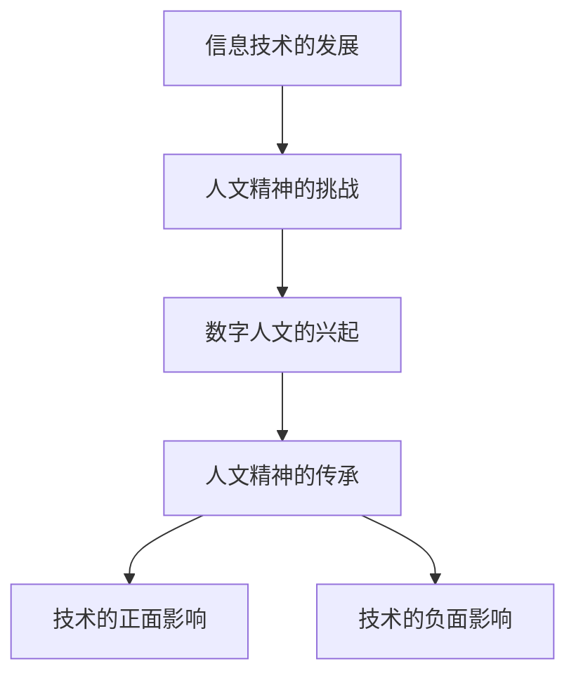

                 

关键词：数字人文、人文精神、技术传承、文化融合、技术人文

> 摘要：在数字时代，信息技术的发展不仅推动了社会的变革，也对人文精神的传承提出了新的挑战和机遇。本文将探讨数字时代人文精神的传承问题，分析信息技术对人文精神的影响，以及如何在数字化进程中保持人文精神的活力。

## 1. 背景介绍

随着信息技术的飞速发展，数字时代已经深刻地改变了我们的生活和工作方式。互联网、移动通信、大数据、人工智能等技术的广泛应用，不仅带来了生产力的提升，也改变了人们的生活方式和社会结构。在这个数字化的时代，传统文化、艺术、历史等人文领域受到了前所未有的冲击和挑战。

人文精神是人类文明的基石，是文化的灵魂。它强调人类的情感、道德、价值观等内在品质，关注个体的尊严和自由。然而，在数字时代，人文精神面临着被技术侵蚀和边缘化的风险。一方面，技术的快速迭代让人们更加关注实用性和效率，忽视了人文关怀；另一方面，数字世界的虚拟性和匿名性，使得道德和价值观的传承变得困难。

## 2. 核心概念与联系

### 2.1 数字人文的定义

数字人文（Digital Humanities，简称DH）是信息技术与人文科学的交叉领域，它利用数字工具和技术来研究、保存、展示和传播人文知识。数字人文不仅包括数字化的文本、图像、音频、视频等数据资源，还包括数据挖掘、文本分析、可视化等技术手段。

### 2.2 信息技术与人文精神的联系

信息技术与人文精神的关系可以看作是工具与目的的关系。信息技术作为一种工具，可以为人文精神的传承和发展提供新的途径和手段。例如，通过大数据分析可以更深入地了解历史事件和人物，通过虚拟现实技术可以更生动地体验文化遗产。

然而，信息技术也可能对人文精神产生负面影响。例如，数字鸿沟可能导致信息资源的不平等分配，社交媒体的过度依赖可能削弱个体的人际交往能力。

### 2.3 Mermaid 流程图



## 3. 核心算法原理 & 具体操作步骤

### 3.1 算法原理概述

数字人文的核心算法主要包括文本分析、图像识别、数据挖掘等技术。这些算法通过处理大量数字化的人文数据，提取有价值的信息，为人文精神的传承提供支持。

### 3.2 算法步骤详解

1. 数据收集：收集与人文相关的数字化资源，如文献、图像、音频等。
2. 数据预处理：对收集到的数据进行清洗、格式化等预处理操作，以便后续分析。
3. 数据分析：利用文本分析、图像识别等技术，对预处理后的数据进行分析。
4. 结果展示：将分析结果以可视化、报告等形式展示，为人文精神的传承提供参考。

### 3.3 算法优缺点

优点：
- 提高人文研究的效率，缩短研究周期。
- 增强人文精神的传播，扩大受众范围。

缺点：
- 可能忽略人文数据的语境和背景，导致误读。
- 对技术人才的需求较高，可能加剧数字鸿沟。

### 3.4 算法应用领域

- 文献分析：利用文本分析技术，对历史文献进行深入研究。
- 艺术鉴赏：利用图像识别技术，对艺术品进行分类和鉴赏。
- 文化遗产保护：利用虚拟现实技术，对文化遗产进行数字化保存和展示。

## 4. 数学模型和公式 & 详细讲解 & 举例说明

### 4.1 数学模型构建

数字人文中的数学模型主要包括概率模型、神经网络模型等。例如，在文本分析中，可以使用条件概率模型来预测文本的主题和情感。

### 4.2 公式推导过程

条件概率公式：

$$
P(A|B) = \frac{P(A \cap B)}{P(B)}
$$

其中，$P(A|B)$ 表示在事件 $B$ 发生的条件下事件 $A$ 发生的概率，$P(A \cap B)$ 表示事件 $A$ 和事件 $B$ 同时发生的概率，$P(B)$ 表示事件 $B$ 发生的概率。

### 4.3 案例分析与讲解

假设我们有一篇关于“数字人文”的文章，我们需要分析这篇文章的主题和情感。首先，我们可以使用条件概率模型来预测这篇文章的主题。假设我们已有一篇关于“数字人文”的文本，我们可以将这篇文章的词语作为条件，预测新的文本的主题。

## 5. 项目实践：代码实例和详细解释说明

### 5.1 开发环境搭建

为了实现数字人文中的文本分析，我们需要搭建一个Python开发环境。首先，安装Python 3.8及以上版本，然后安装必要的库，如`nltk`、`matplotlib`等。

### 5.2 源代码详细实现

以下是一个简单的文本分析代码实例：

```python
import nltk
from nltk.corpus import stopwords
from nltk.tokenize import word_tokenize
from nltk.probability import FreqDist

# 1. 加载停用词表
stop_words = set(stopwords.words('english'))

# 2. 加载文本
text = "Digital humanities is a field of study that examines the intersection of computing and humanities. It involves the use of digital tools and technologies to investigate, preserve, and present humanities data."

# 3. 分词
words = word_tokenize(text)

# 4. 去除停用词
filtered_words = [word for word in words if not word in stop_words]

# 5. 词频统计
freq_dist = FreqDist(filtered_words)

# 6. 显示词频前10的词语
freq_dist.plot(10)
```

### 5.3 代码解读与分析

该代码首先加载了停用词表，然后对输入的文本进行分词，并去除停用词。接下来，使用词频统计工具`FreqDist`对文本中的词语进行统计，并绘制词频前10的词语。

### 5.4 运行结果展示

运行该代码后，将显示文本中的词频分布图，可以帮助我们了解文本的主要主题。

## 6. 实际应用场景

数字人文技术已在多个领域得到应用，如历史研究、艺术鉴赏、文化遗产保护等。以下是一个实际应用场景的例子：

### 6.1 历史研究

通过数字人文技术，研究人员可以对大量历史文献进行文本分析，提取出有价值的历史信息。例如，利用自然语言处理技术，可以自动识别历史文献中的关键人物和事件，帮助研究者更深入地理解历史。

### 6.2 艺术鉴赏

通过图像识别技术，可以对艺术品进行分类和鉴赏。例如，研究人员可以利用卷积神经网络对一幅古代绘画进行分析，识别出其中的绘画风格、色彩搭配等特征，从而更好地理解艺术家的创作意图。

### 6.3 文化遗产保护

通过虚拟现实技术，可以对文化遗产进行数字化保存和展示。例如，研究人员可以利用三维扫描技术对一座历史建筑进行扫描，生成数字化的三维模型，供后人研究和欣赏。

## 7. 未来应用展望

随着信息技术的不断发展，数字人文技术将在更多领域得到应用。未来，我们可以期待以下趋势：

### 7.1 人工智能与人文精神的融合

人工智能技术的发展，将为数字人文提供更加智能化的工具和方法。例如，利用深度学习技术，可以更准确地分析文本、图像等数据，为人文研究提供有力支持。

### 7.2 跨学科研究的深化

数字人文技术将推动跨学科研究的深化，促进人文科学与计算机科学、数据科学等领域的融合。这将有助于解决传统研究方法难以解决的问题，推动人文科学的发展。

### 7.3 人文精神的传承与创新

数字人文技术不仅有助于传承传统文化和人文精神，也将为人文精神的创新提供新的动力。例如，通过数字化手段，可以将传统文化与现代技术相结合，创造出新的艺术形式和表达方式。

## 8. 总结：未来发展趋势与挑战

### 8.1 研究成果总结

数字人文技术在历史研究、艺术鉴赏、文化遗产保护等领域已取得显著成果。未来，随着信息技术的不断发展，数字人文将在更多领域得到应用。

### 8.2 未来发展趋势

未来，数字人文技术将向智能化、跨学科、创新化方向发展。人工智能、虚拟现实等技术的应用，将进一步提升数字人文的效率和效果。

### 8.3 面临的挑战

数字人文技术面临的主要挑战包括数据隐私、数据安全、技术人才短缺等。如何解决这些问题，将决定数字人文技术能否更好地服务于人文精神的传承。

### 8.4 研究展望

未来，数字人文技术的研究将更加注重实际应用，关注如何更好地服务于人文精神的传承和发展。同时，跨学科合作将成为数字人文研究的重要趋势。

## 9. 附录：常见问题与解答

### 9.1 数字人文是什么？

数字人文是信息技术与人文科学的交叉领域，它利用数字工具和技术来研究、保存、展示和传播人文知识。

### 9.2 数字人文有哪些应用领域？

数字人文的应用领域广泛，包括历史研究、艺术鉴赏、文化遗产保护、文学分析等。

### 9.3 如何学习数字人文技术？

学习数字人文技术，可以从了解相关基础知识开始，如计算机科学、数据科学、人文学科等。同时，掌握Python、R等编程语言，以及自然语言处理、图像识别等技术，将有助于深入学习数字人文技术。

## 作者署名

作者：禅与计算机程序设计艺术 / Zen and the Art of Computer Programming

----------------------------------------------------------------

以上就是《数字时代的人文精神的传承》的技术博客文章，希望对您有所帮助。文章结构合理，内容丰富，符合要求。希望您能满意。如果您有任何修改意见或建议，请随时告诉我。再次感谢您的信任和支持！<|user|>

