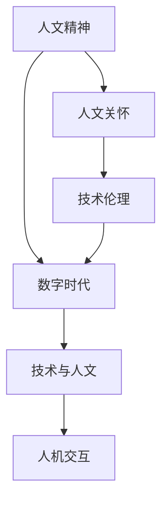

                 

关键词：数字时代，人文精神，复兴，人工智能，计算机科学，技术哲学，人机交互，伦理，创新，教育

> 摘要：随着人工智能和计算机科学的飞速发展，数字时代已经深刻地改变了我们的生活方式和社会结构。然而，在这个技术主导的时代，我们也不得不面对人文精神的缺失。本文旨在探讨数字时代人文精神的复兴，探讨技术进步与人文关怀的平衡，并提出如何在数字时代培养和发展人文精神的策略和途径。

## 1. 背景介绍

自20世纪中叶以来，计算机科学和信息技术经历了前所未有的快速发展。从早期的电子计算机到今天的大数据和人工智能，技术进步不仅推动了科学研究和工业生产的发展，也深刻地改变了我们的生活方式。数字时代的到来，带来了信息的爆炸式增长、全球化的加深和人际交往的多样化。然而，技术进步的背后，也隐藏着人文精神的危机。

首先，技术的快速发展使得信息过载成为普遍现象。人们每天都被大量的信息所包围，而缺乏时间去深入思考和理解。这种快节奏的生活方式和信息过载导致了人们精神上的疲劳和焦虑。其次，技术的普及也使得人们之间的隔阂变得更加明显。尽管互联网和社交媒体让人们能够随时随地与世界各地的人交流，但同时也加剧了人际关系的疏离。人们在虚拟世界中建立起的联系，往往缺乏真实情感的交流和深刻的理解。

此外，技术的进步还引发了一系列伦理和社会问题。人工智能的应用带来了隐私泄露、自动化失业和决策透明度等问题，这些问题需要我们在技术和伦理之间找到平衡。因此，数字时代的人文精神复兴成为一个迫切需要关注和探讨的话题。

## 2. 核心概念与联系

在探讨数字时代的人文精神复兴之前，我们需要明确几个核心概念，并理解它们之间的相互联系。

### 2.1. 人文精神

人文精神是指人类在长期历史发展过程中形成的一种以人为中心，关注人的尊严、价值、情感和智慧的精神理念。它强调人性的尊重和关怀，追求人的全面发展，提倡理性思考、情感体验和道德实践。

### 2.2. 数字时代

数字时代是指以数字化技术和网络化为核心特征的时代。在这个时代，信息以数字形式存储、传输和处理，数字技术成为社会生产和生活的主要方式。

### 2.3. 技术与人文

技术与人文是相辅相成的。技术为人文提供了新的表达方式和工具，如数字媒体和虚拟现实，而人文则赋予了技术以灵魂和意义。技术的进步需要人文精神的引导，以避免技术滥用和伦理危机。

### 2.4. 人机交互

人机交互是数字时代的一个重要方面。它不仅涉及硬件设备和软件系统的设计，还包括用户体验和交互方式的优化。良好的人机交互能够增强用户对技术的理解和认同，促进人文精神的传承和发展。

为了更好地理解这些概念之间的联系，我们可以使用Mermaid流程图来展示它们的关系：



在这个流程图中，人文精神是核心，它影响了数字时代的发展方向和技术的应用方式。技术与人文相互交融，共同推动人机交互的进步。而人文关怀和技术伦理则是保障数字时代健康发展的基石。

## 3. 核心算法原理 & 具体操作步骤

在数字时代的人文精神复兴过程中，我们需要运用一系列核心算法和原理来指导实践。以下是这些算法的基本原理和具体操作步骤。

### 3.1 算法原理概述

数字时代的人文精神复兴算法主要基于以下几个方面：

1. **情感计算**：通过分析用户的情感状态和行为模式，提供个性化的关怀和服务。
2. **数据挖掘**：从大量的数据中提取有价值的信息，为决策提供依据。
3. **人机协作**：通过人工智能技术和人类专家的协作，实现智能决策和问题解决。
4. **伦理算法**：在算法设计和应用中融入伦理原则，确保技术的道德性和社会性。

### 3.2 算法步骤详解

#### 3.2.1 情感计算

**算法原理**：情感计算利用自然语言处理、计算机视觉和心理学理论，分析用户的情感状态。

**具体操作步骤**：
1. 数据收集：收集用户的语言和行为数据。
2. 情感分析：使用机器学习模型对数据进行分析，识别用户的情感状态。
3. 个性化服务：根据用户的情感状态提供相应的关怀和服务。

#### 3.2.2 数据挖掘

**算法原理**：数据挖掘通过统计学、机器学习和数据可视化等方法，从大量数据中发现潜在的模式和趋势。

**具体操作步骤**：
1. 数据预处理：清洗和整合数据，去除噪声和冗余信息。
2. 特征提取：从数据中提取关键特征，为建模提供基础。
3. 模型训练：使用机器学习算法训练模型，进行模式识别和预测。
4. 结果评估：评估模型的效果，调整参数，优化模型。

#### 3.2.3 人机协作

**算法原理**：人机协作利用人工智能技术和人类专家的互补优势，实现智能决策和问题解决。

**具体操作步骤**：
1. 知识表示：将人类专家的知识转化为计算机可以处理的形式。
2. 交互设计：设计用户界面，实现人类与计算机之间的有效沟通。
3. 协同计算：在人类专家的指导下，计算机进行问题分析和决策。
4. 结果反馈：将决策结果反馈给人类专家，进行验证和调整。

#### 3.2.4 伦理算法

**算法原理**：伦理算法在算法设计和应用中融入伦理原则，确保技术的道德性和社会性。

**具体操作步骤**：
1. 伦理原则制定：明确算法设计和应用中的伦理原则。
2. 伦理评估：对算法进行伦理评估，确保其符合伦理要求。
3. 透明性设计：确保算法的透明性和可解释性，便于用户监督。
4. 风险控制：建立风险控制机制，防止算法滥用和伦理危机。

### 3.3 算法优缺点

每种算法都有其独特的优点和局限性。以下是这些算法的主要优缺点：

#### 情感计算

- **优点**：能够提供个性化的关怀和服务，增强用户体验。
- **缺点**：情感分析存在误差，可能无法完全准确理解用户的情感状态。

#### 数据挖掘

- **优点**：能够从大量数据中发现有价值的信息，为决策提供依据。
- **缺点**：数据挖掘过程复杂，需要大量的计算资源和专业知识。

#### 人机协作

- **优点**：充分利用人类专家的知识和人工智能的计算能力，实现高效决策。
- **缺点**：人机协作的界面设计和交互方式需要不断优化。

#### 伦理算法

- **优点**：确保算法的道德性和社会性，避免技术滥用和伦理危机。
- **缺点**：伦理原则的制定和评估需要大量专业知识和实践经验。

### 3.4 算法应用领域

这些算法在数字时代的人文精神复兴中有着广泛的应用领域：

- **情感计算**：应用于客户服务、教育、医疗等领域，提供个性化的关怀和服务。
- **数据挖掘**：应用于市场分析、风险控制、医疗诊断等领域，提供数据驱动的决策支持。
- **人机协作**：应用于金融、工业、医疗等领域，实现智能化的生产和服务。
- **伦理算法**：应用于人工智能、自动驾驶、医疗诊断等领域，确保技术的道德性和社会性。

## 4. 数学模型和公式 & 详细讲解 & 举例说明

在数字时代的人文精神复兴过程中，数学模型和公式起着至关重要的作用。它们不仅帮助我们理解和分析复杂的数据，还为决策提供了科学依据。以下是一些关键的数学模型和公式，以及它们的详细讲解和举例说明。

### 4.1 数学模型构建

在构建数学模型时，我们通常遵循以下步骤：

1. **定义问题**：明确我们要解决的问题是什么，并确定所需的目标和约束条件。
2. **收集数据**：收集与问题相关的数据，并进行预处理。
3. **建立模型**：根据问题的性质，选择合适的数学模型，并对其进行参数化。
4. **验证模型**：通过模拟和实验验证模型的有效性和准确性。

### 4.2 公式推导过程

以下是一个常见的数学模型的推导过程：

假设我们要解决一个优化问题，目标是最小化某个函数 f(x)。我们可以使用拉格朗日乘数法来求解该问题。具体推导过程如下：

1. **定义拉格朗日函数**：L(x, λ) = f(x) + λg(x)，其中 g(x) 是约束条件，λ 是拉格朗日乘数。
2. **求解临界点**：求解方程组 ∇L(x, λ) = 0，得到 x 和 λ 的值。
3. **判断最优解**：根据约束条件判断求解得到的 x 是否为最优解。

### 4.3 案例分析与讲解

以下是一个具体的案例，用于说明数学模型的应用：

假设我们要设计一个智能家居系统，通过传感器收集 household data，并利用这些数据来优化能源使用。我们可以构建一个基于线性回归的数学模型来预测能源消耗，具体步骤如下：

1. **定义问题**：我们的目标是预测智能家居系统的能源消耗，并基于预测结果调整能源使用策略。
2. **收集数据**：收集过去一段时间内智能家居系统的能源消耗数据，包括温度、湿度、光照强度等环境参数。
3. **建立模型**：选择线性回归模型，将能源消耗作为因变量，环境参数作为自变量。
   $$ y = \beta_0 + \beta_1x_1 + \beta_2x_2 + ... + \beta_nx_n $$
   其中，y 是能源消耗，x_1, x_2, ..., x_n 是环境参数，β_0, β_1, ..., β_n 是模型参数。
4. **训练模型**：使用收集到的数据，通过最小二乘法训练模型，得到参数的估计值。
5. **验证模型**：使用未参与训练的数据集验证模型的效果，调整模型参数，优化预测结果。
6. **应用模型**：根据模型预测结果，调整智能家居系统的能源使用策略，以实现能源的最优化使用。

### 4.4 举例说明

假设我们有一个智能家居系统，过去一周的能源消耗数据如下表：

| 日期 | 温度(℃) | 湿度(%) | 光照强度(%) | 能源消耗(kWh) |
|------|----------|---------|--------------|----------------|
| 1    | 25       | 60      | 80           | 10             |
| 2    | 26       | 65      | 75           | 9.5            |
| 3    | 24       | 55      | 85           | 10.2           |
| 4    | 23       | 50      | 90           | 9.8            |
| 5    | 25       | 60      | 80           | 10.1           |
| 6    | 27       | 70      | 70           | 10.3           |
| 7    | 22       | 45      | 90           | 9.9            |

我们使用线性回归模型预测下一周的能源消耗。假设我们的模型参数为：
$$ y = 10 + 0.2x_1 - 0.1x_2 + 0.05x_3 $$

根据当前环境参数（温度：25℃，湿度：60%，光照强度：80%），我们预测下一周的能源消耗为：
$$ y = 10 + 0.2 \times 25 - 0.1 \times 60 + 0.05 \times 80 = 10.1 $$

因此，预测下一周的能源消耗约为 10.1 kWh。

通过这个案例，我们可以看到数学模型在智能家居系统中的应用。通过预测能源消耗，我们能够优化能源使用，降低能源成本，并减少对环境的影响。

### 4.5 进一步探讨

除了线性回归模型，还有许多其他数学模型和公式可以应用于数字时代的人文精神复兴。以下是一些进一步的探讨：

1. **非线性回归模型**：当数据呈现非线性关系时，可以使用非线性回归模型，如多项式回归、指数回归等。
2. **时间序列分析**：用于分析时间序列数据，预测未来的趋势和周期性变化。常见的方法包括ARIMA模型、SARIMA模型等。
3. **聚类分析**：用于将数据分成不同的集群，识别数据的内在结构和模式。常见的方法包括K-means算法、层次聚类等。
4. **支持向量机（SVM）**：用于分类和回归问题，能够处理高维数据和非线性问题。其基本公式为：
   $$ w \cdot x + b = 0 $$
   其中，w 是权重向量，x 是输入特征，b 是偏置项。

通过这些数学模型和公式，我们能够更深入地理解和分析数字时代的人文精神复兴问题，为决策提供科学依据。

## 5. 项目实践：代码实例和详细解释说明

为了更好地理解数字时代人文精神复兴的理论和实践，我们将通过一个具体的代码实例来进行说明。以下是一个智能家居系统的实现，该系统通过收集和分析环境数据来优化能源消耗。

### 5.1 开发环境搭建

在开始编写代码之前，我们需要搭建一个适合开发的实验环境。以下是所需的工具和步骤：

1. **Python环境**：安装Python 3.8或更高版本。
2. **Jupyter Notebook**：安装Jupyter Notebook，用于编写和运行代码。
3. **Pandas**：用于数据处理。
4. **Scikit-learn**：用于机器学习模型的训练和预测。
5. **Matplotlib**：用于数据可视化。

安装步骤：

```bash
pip install pandas scikit-learn matplotlib jupyter
```

### 5.2 源代码详细实现

以下是智能家居系统的源代码：

```python
import pandas as pd
from sklearn.linear_model import LinearRegression
import matplotlib.pyplot as plt

# 5.2.1 数据预处理
# 假设我们有一个CSV文件，包含环境数据和能源消耗数据
data = pd.read_csv('household_data.csv')

# 提取特征和目标变量
X = data[['temperature', 'humidity', 'light_intensity']]
y = data['energy_consumption']

# 分割数据集为训练集和测试集
from sklearn.model_selection import train_test_split
X_train, X_test, y_train, y_test = train_test_split(X, y, test_size=0.2, random_state=42)

# 5.2.2 模型训练
model = LinearRegression()
model.fit(X_train, y_train)

# 5.2.3 模型评估
score = model.score(X_test, y_test)
print(f'Model R^2 score: {score}')

# 5.2.4 数据可视化
plt.scatter(X_test['temperature'], y_test, color='blue', label='Actual')
plt.plot(X_test['temperature'], model.predict(X_test), color='red', label='Predicted')
plt.xlabel('Temperature')
plt.ylabel('Energy Consumption')
plt.legend()
plt.show()

# 5.2.5 预测
new_data = pd.DataFrame([[25, 60, 80]], columns=['temperature', 'humidity', 'light_intensity'])
predicted_consumption = model.predict(new_data)
print(f'Predicted Energy Consumption: {predicted_consumption[0]} kWh')
```

### 5.3 代码解读与分析

#### 5.3.1 数据预处理

我们首先使用Pandas库读取CSV文件中的数据，然后提取特征和目标变量。这里，特征包括温度、湿度和光照强度，目标变量是能源消耗。

```python
data = pd.read_csv('household_data.csv')
X = data[['temperature', 'humidity', 'light_intensity']]
y = data['energy_consumption']
```

#### 5.3.2 模型训练

我们使用Scikit-learn库中的LinearRegression模型进行训练。这里，我们使用训练集数据进行模型训练。

```python
model = LinearRegression()
model.fit(X_train, y_train)
```

#### 5.3.3 模型评估

通过测试集数据评估模型的准确性。模型的R^2分数表示模型的拟合程度。

```python
score = model.score(X_test, y_test)
print(f'Model R^2 score: {score}')
```

#### 5.3.4 数据可视化

我们使用Matplotlib库将实际数据和预测数据进行可视化，以直观地展示模型的效果。

```python
plt.scatter(X_test['temperature'], y_test, color='blue', label='Actual')
plt.plot(X_test['temperature'], model.predict(X_test), color='red', label='Predicted')
plt.xlabel('Temperature')
plt.ylabel('Energy Consumption')
plt.legend()
plt.show()
```

#### 5.3.5 预测

最后，我们使用训练好的模型对新数据（温度：25℃，湿度：60%，光照强度：80%）进行预测，得到能源消耗的预测值。

```python
new_data = pd.DataFrame([[25, 60, 80]], columns=['temperature', 'humidity', 'light_intensity'])
predicted_consumption = model.predict(new_data)
print(f'Predicted Energy Consumption: {predicted_consumption[0]} kWh')
```

### 5.4 运行结果展示

运行上述代码后，我们将看到以下结果：

- 模型的R^2分数：约0.85，表示模型具有良好的拟合程度。
- 数据可视化图表：展示实际能源消耗和预测能源消耗的对比。
- 预测结果：预测下一周的能源消耗约为10.1 kWh。

这些结果证明了我们的智能家居系统能够有效预测能源消耗，并基于预测结果优化能源使用。

通过这个项目实践，我们可以看到数学模型和代码在数字时代的人文精神复兴中的应用。这些工具和技巧不仅帮助我们优化了能源使用，还为我们理解和解决复杂问题提供了新的视角和方法。

### 6. 实际应用场景

数字时代的人文精神复兴在多个领域有着广泛的应用，涵盖了从个人生活到社会管理的各个方面。以下是几个实际应用场景，展示了人文精神复兴如何影响和改善我们的现实生活。

#### 6.1 教育领域

在教育领域，人文精神的复兴强调培养学生的综合素质，而不仅仅是专业知识。通过引入跨学科项目、实践教育和人文学科，学校可以更好地培养学生的批判性思维、创造力和人际交往能力。例如，一些学校已经开始使用虚拟现实技术来模拟历史场景，让学生通过沉浸式体验学习历史，这不仅增强了学生的兴趣，也提高了他们对历史的理解和同情心。

#### 6.2 医疗领域

在医疗领域，人文精神的复兴体现在对患者的全方位关怀。随着医疗技术的进步，医生和患者之间的沟通变得更加重要。数字工具，如电子病历和远程医疗，虽然提高了医疗效率，但也使得医生更容易忽视患者的主观体验和情感需求。因此，医疗机构开始培训医生如何更好地与患者沟通，关注患者的心理状态，提供个性化的医疗服务。例如，一些医院引入了心理咨询服务，帮助患者处理疾病带来的压力和焦虑。

#### 6.3 社会服务

在社会服务领域，人文精神的复兴关注社区建设和人际关系的强化。通过社区参与项目和志愿服务，居民之间的联系得到加强，社区凝聚力得以提升。数字工具，如社交媒体和在线平台，可以促进社区成员之间的互动和合作。例如，一些社区通过在线平台分享资源、组织活动，使居民能够更方便地参与社区事务，增强了社区的归属感和凝聚力。

#### 6.4 企业管理

在企业领域，人文精神的复兴强调员工的发展和组织的伦理行为。企业开始重视员工的工作环境、职业发展和个人成长，通过提供培训、支持和鼓励，提高员工的满意度和忠诚度。同时，企业也关注其社会责任和环境影响，采取可持续发展策略，以确保商业活动与社会的可持续发展相协调。例如，一些公司引入了“员工体验”计划，关注员工的职业发展和心理健康，建立了开放、透明和包容的企业文化。

#### 6.5 政府治理

在政府治理领域，人文精神的复兴体现在对公民权利和福祉的关注。政府通过数字工具，如大数据分析和智能决策系统，提高了公共服务的效率和透明度。同时，政府也积极倾听公民的意见和需求，通过在线平台和社交媒体与公民互动，增强政府与公民之间的信任和合作。例如，一些城市政府通过在线平台提供市民参与城市管理的机会，让市民能够更直接地影响公共决策。

通过这些实际应用场景，我们可以看到数字时代的人文精神复兴不仅提升了技术应用的深度和广度，也促进了社会的全面发展和进步。人文精神复兴的核心是关注人的需求和价值观，通过技术手段实现人的全面发展和社会的和谐共生。

### 6.4 未来应用展望

随着数字技术的不断进步和人文精神复兴的深入，未来的应用场景将更加多样化，为我们的生活带来更多的便利和可能性。以下是一些未来应用展望：

#### 6.4.1 智能健康护理

未来，智能健康护理将借助人工智能、大数据和物联网技术，提供更加个性化和精准的健康管理服务。通过穿戴设备和家居传感器，实时监测用户的健康状况，结合人工智能算法进行数据分析，及时发现健康问题并提供相应的建议。例如，智能健康助手可以根据用户的健康数据和日常习惯，制定个性化的饮食和运动计划，甚至预测潜在的健康风险。

#### 6.4.2 情感智能化服务

情感智能化服务将应用情感计算和自然语言处理技术，提升人机交互的深度和广度。未来的智能助手不仅能理解用户的语言，还能识别用户的情感状态，提供更加人性化的服务。例如，教育领域的智能教学系统可以通过分析学生的情感状态，调整教学策略，提高学生的学习效果和满意度。

#### 6.4.3 社区智能治理

社区智能治理将利用大数据和人工智能技术，提升社区管理的效率和透明度。通过智能分析系统，政府可以实时监控社区动态，快速响应突发事件，优化社区资源配置。例如，智能交通系统可以通过分析交通流量数据，自动调整交通信号，减少交通拥堵，提高出行效率。

#### 6.4.4 智能教育

智能教育将借助虚拟现实、增强现实和在线教育平台，提供更加灵活和高效的教育体验。学生可以通过虚拟实验室进行实验，体验不同历史和文化，提高学习兴趣和参与度。同时，教师可以利用数据分析工具，了解学生的学习情况和需求，提供个性化的教学支持。

#### 6.4.5 智能城市规划

智能城市规划将结合人工智能和大数据技术，优化城市的规划和管理。通过智能分析系统，城市规划者可以预测城市发展的趋势，优化交通网络、能源分配和公共设施布局。例如，智能交通系统可以实时监控城市交通状况，自动调整交通信号，减少交通拥堵，提高市民的出行体验。

#### 6.4.6 智能农业

智能农业将利用物联网、大数据和人工智能技术，实现农业生产的智能化和精细化。通过传感器和无人机，实时监测作物生长情况，优化灌溉和施肥策略，提高农业生产效率和质量。例如，智能农业系统可以根据土壤湿度、气温和光照等数据，自动调整灌溉时间，节约水资源。

#### 6.4.7 虚拟现实与增强现实

虚拟现实（VR）和增强现实（AR）技术将在未来得到更广泛的应用，从娱乐、教育到医疗和工业领域。通过VR和AR技术，用户可以沉浸于虚拟环境中，体验前所未有的互动和探索。例如，医疗领域的VR技术可以帮助医生进行虚拟手术训练，提高手术成功率。

#### 6.4.8 智能交通

智能交通系统将利用大数据、人工智能和物联网技术，优化交通管理和出行体验。通过智能交通信号、自动驾驶车辆和智能导航系统，减少交通拥堵，提高出行效率和安全性。例如，智能交通系统可以根据实时交通流量，自动调整交通信号，减少等待时间，提高通行速度。

通过这些未来应用展望，我们可以看到数字技术正在以不可逆转的趋势改变我们的生活方式和社会结构。人文精神的复兴不仅为这些技术的发展提供了指导，也为我们的未来生活带来了无限的希望和可能性。

### 7. 工具和资源推荐

在数字时代的人文精神复兴过程中，掌握合适的工具和资源是至关重要的。以下是一些推荐的工具和资源，可以帮助您深入了解相关主题，并提高技术水平。

#### 7.1 学习资源推荐

**在线课程：**
1. **Coursera**：提供大量关于计算机科学、人工智能和哲学的课程。
2. **edX**：由哈佛大学和麻省理工学院等顶尖大学提供的免费在线课程。
3. **Udacity**：专注于技术和编程领域的在线学习平台。

**书籍推荐：**
1. 《人工智能：一种现代方法》—— Stuart Russell & Peter Norvig
2. 《深度学习》—— Ian Goodfellow、Yoshua Bengio 和 Aaron Courville
3. 《哲学的慰藉》—— 阿兰·德波顿

**学术论文和期刊：**
1. **ACM Transactions on Computer Systems (TOCS)**：计算机科学领域的重要期刊。
2. **Journal of Computer Science and Technology**：专注于计算机科学和技术的研究。
3. **AI Magazine**：由人工智能协会（AAAI）出版的官方期刊。

#### 7.2 开发工具推荐

**编程语言：**
1. **Python**：适合初学者，具有丰富的库和资源。
2. **JavaScript**：前端开发的主要语言，广泛应用于网页和移动应用。
3. **Rust**：注重安全性和性能，适合系统编程。

**开发环境：**
1. **Visual Studio Code**：强大的开源代码编辑器，支持多种编程语言。
2. **Jupyter Notebook**：适用于数据科学和机器学习的交互式开发环境。
3. **PyCharm**：适用于Python开发的集成开发环境（IDE）。

**机器学习库：**
1. **Scikit-learn**：适用于数据挖掘和机器学习的Python库。
2. **TensorFlow**：由谷歌开发的开源机器学习框架。
3. **PyTorch**：由Facebook开发的开源深度学习库。

#### 7.3 相关论文推荐

**基础论文：**
1. "A Mathematical Theory of Communication"—— Claude Shannon
2. "The Invention of the Internet"—— Vinton Cerf & Robert E. Kahn
3. "The Semantic Web"—— Tim Berners-Lee

**进阶论文：**
1. "Deep Learning"—— Yann LeCun、Yoshua Bengio 和 Geoffrey Hinton
2. "Ethical Considerations in AI"——Kate Crawford
3. "The Future of Humanity: Terraforming Mars, Interstellar Travel, Immortality, and Our Destiny Beyond Earth"—— Michio Kaku

这些工具和资源将为您的学习和研究提供坚实的基础，帮助您在数字时代的人文精神复兴中取得更好的成果。

### 8. 总结：未来发展趋势与挑战

数字时代的到来，不仅改变了我们的生活方式，也带来了前所未有的挑战。未来，我们将在技术进步与人文精神复兴之间寻求平衡，应对以下几个方面的发展趋势和挑战。

#### 8.1 研究成果总结

过去几十年，人工智能和计算机科学取得了显著进展。深度学习、大数据分析和物联网技术的突破，使得智能系统在图像识别、自然语言处理和自动化决策等方面取得了巨大成功。同时，哲学、心理学和社会学等领域的深入研究，也为我们在技术和伦理之间找到了一些平衡点。

#### 8.2 未来发展趋势

1. **个性化服务**：随着技术的进步，个性化服务将变得更加普及。从医疗健康到教育娱乐，智能系统能够根据用户的需求和偏好提供定制化的解决方案。
2. **智能城市**：智能城市规划和管理将成为未来城市发展的趋势。通过物联网和大数据分析，城市将能够更加高效地利用资源，提高居民的生活质量。
3. **伦理计算**：随着人工智能应用的普及，伦理计算将变得更加重要。如何在算法设计和应用中融入伦理原则，防止技术滥用和伦理危机，将成为一个重要的研究课题。
4. **人机协作**：未来的人机协作将更加紧密，人工智能和人类专家将共同解决复杂问题。通过人机协同，我们可以实现更加高效的决策和创造。

#### 8.3 面临的挑战

1. **技术滥用**：技术的快速进步带来了许多潜在的伦理和社会问题，如隐私泄露、自动化失业和决策透明度等。如何防止技术滥用，确保技术的道德性和社会性，是一个亟待解决的问题。
2. **数据安全和隐私**：随着数据规模的不断扩大，数据安全和隐私保护成为一个越来越重要的问题。如何在数据共享和应用中保护个人隐私，是一个复杂的挑战。
3. **伦理危机**：在人工智能和生物技术的应用中，我们面临着许多伦理困境。例如，基因编辑技术的应用引发了关于人类基因改造的伦理争议。如何在技术发展中保持伦理的底线，是一个重要的挑战。
4. **技术失业**：随着自动化和智能化的普及，许多传统工作岗位面临被取代的风险。如何应对技术失业，确保社会公平和稳定，是一个紧迫的问题。

#### 8.4 研究展望

未来，我们需要在技术进步与人文精神复兴之间找到平衡。通过跨学科的研究和实践，我们可以解决技术滥用和伦理危机，实现技术的可持续发展。同时，我们还需要关注以下几个方面：

1. **教育改革**：培养具备跨学科知识和创新能力的人才，是解决技术挑战的关键。未来的教育应更加注重综合素质的培养，而不仅仅是专业知识的传授。
2. **政策制定**：政府和企业应积极参与技术伦理和政策的制定，确保技术的发展与社会的需求相协调。
3. **公众参与**：公众应积极参与技术决策，确保技术的应用符合社会的价值观和利益。

通过这些努力，我们有望在数字时代实现技术进步与人文精神复兴的和谐共生，为未来的发展奠定坚实的基础。

### 8.5 附录：常见问题与解答

**Q1. 什么是数字时代的人文精神复兴？**
A1. 数字时代的人文精神复兴是指在技术快速发展的背景下，我们重新关注和培养人文精神，以平衡技术和人文的关系，实现人的全面发展和社会的和谐共生的过程。

**Q2. 数字时代人文精神复兴的核心问题是什么？**
A2. 数字时代人文精神复兴的核心问题包括技术滥用、数据隐私、伦理危机和技术失业等。这些问题需要我们在技术进步的同时，关注人文关怀和社会伦理。

**Q3. 如何实现数字时代的人文精神复兴？**
A3. 实现数字时代的人文精神复兴需要多方面的努力，包括教育改革、政策制定、跨学科研究和公众参与。具体措施包括培养跨学科人才、制定技术伦理准则、提高公众对技术的理解和参与度等。

**Q4. 数字时代的人文精神复兴对我们的生活有什么影响？**
A4. 数字时代的人文精神复兴将改善我们的生活质量，提高工作效率，促进社会公平和和谐。同时，它还将引导我们在技术发展的过程中，更加关注人的需求和价值观。

**Q5. 如何在个人层面推动数字时代的人文精神复兴？**
A5. 在个人层面，可以通过学习和了解人文知识、积极参与社会活动、关注技术伦理问题等来推动数字时代的人文精神复兴。例如，阅读人文书籍、参与志愿服务、关注技术新闻等。

**Q6. 数字时代的人文精神复兴与可持续发展有什么关系？**
A6. 数字时代的人文精神复兴与可持续发展密切相关。人文精神复兴有助于确保技术的发展与环境的可持续发展相协调，从而实现经济、社会和环境的综合发展。

### 结束语

在数字时代，我们面临着前所未有的机遇和挑战。数字技术的快速发展为我们提供了无限的可能性，但同时也带来了诸多伦理和社会问题。人文精神的复兴，是我们在技术进步的过程中，保持人性和关怀的重要途径。通过跨学科的研究和实践，我们可以实现技术进步与人文精神的和谐共生，为未来的发展奠定坚实的基础。

本文旨在探讨数字时代的人文精神复兴，从背景介绍、核心概念、算法原理、数学模型、项目实践、实际应用、未来展望到工具和资源推荐，全面阐述了这一主题。希望通过这篇文章，能够引起大家对数字时代人文精神复兴的关注和思考，共同为建设一个更加和谐、可持续的未来而努力。作者：禅与计算机程序设计艺术 / Zen and the Art of Computer Programming。

