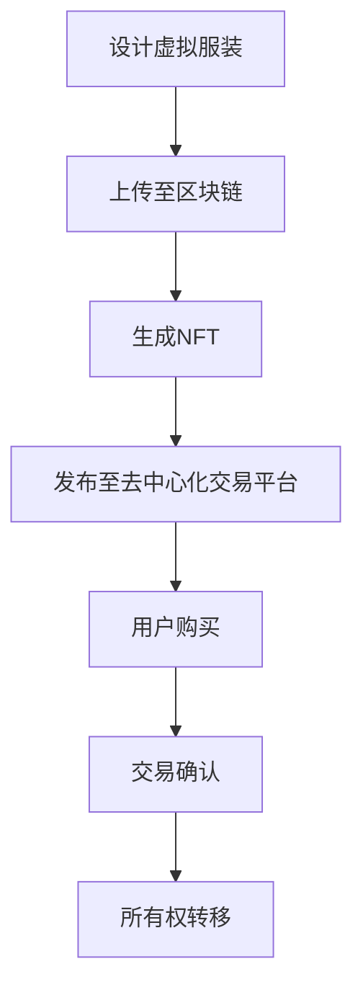

                 

关键词：虚拟时尚，数字化设计，3D服装设计，元宇宙，NFT交易，区块链，用户体验，技术趋势

> 摘要：本文将探讨数字时尚创业的现状与发展趋势，重点关注虚拟服装的设计与交易过程。通过分析相关技术原理、算法、数学模型以及实际应用场景，我们将深入了解虚拟时尚的市场潜力及其在元宇宙中的未来发展。

## 1. 背景介绍

随着数字技术的发展，虚拟世界逐渐成为人们生活的一部分。从早期的在线游戏到如今的元宇宙，虚拟时尚应运而生。虚拟时尚不仅是一种新兴的时尚趋势，更是一种商业模式。它允许用户在虚拟环境中尝试各种时尚风格，同时也为设计师和品牌提供了新的销售渠道。

近年来，虚拟时尚市场呈现出迅猛增长的态势。据市场研究公司Statista的数据，全球虚拟时尚市场规模预计将从2021年的4.11亿美元增长到2026年的36.7亿美元，年复合增长率高达53.1%。这一增长得益于几个关键因素的推动：

1. **技术的进步**：3D建模和渲染技术的提升，使得虚拟服装设计变得更加容易和真实。
2. **元宇宙的兴起**：以Facebook、微软和谷歌为代表的企业纷纷投入元宇宙的构建，为虚拟时尚提供了广阔的应用场景。
3. **数字货币和区块链技术的发展**：NFT（非同质化代币）为虚拟物品的所有权和交易提供了新的方式，为虚拟时尚带来了更多的商业机会。

## 2. 核心概念与联系

### 2.1 虚拟服装设计

虚拟服装设计是数字时尚的核心。它涉及到以下几个关键概念：

- **3D建模**：通过计算机软件创建服装的3D模型。这通常使用3D建模软件如Blender、Maya或ZBrush来完成。
- **材质和纹理**：为3D模型添加真实感材质和纹理，使其在虚拟环境中看起来更加逼真。
- **光照和渲染**：通过设置虚拟环境的光照和渲染参数，使得虚拟服装在视觉上更加自然和生动。

### 2.2 虚拟服装交易

虚拟服装交易主要依赖于区块链和NFT技术。以下是相关概念和联系：

- **区块链**：一种分布式账本技术，能够记录交易信息并确保其不可篡改。
- **NFT**：一种基于区块链的数字资产，用于表示虚拟物品的所有权和唯一性。
- **去中心化交易平台**：如OpenSea，允许用户买卖NFT，包括虚拟服装。

### 2.3 Mermaid 流程图

以下是虚拟服装设计与交易的基本流程的Mermaid流程图：



## 3. 核心算法原理 & 具体操作步骤

### 3.1 算法原理概述

虚拟服装设计主要依赖于3D建模和渲染技术。以下是这些技术的核心原理：

- **3D建模**：基于几何学原理，使用面、边和顶点构建三维对象。常见的建模算法包括贝塞尔曲面、NURBS曲面等。
- **渲染**：通过光传输模型（如物理渲染）或近似算法（如路径追踪）模拟光线在虚拟环境中的行为，生成逼真的图像。

### 3.2 算法步骤详解

1. **3D建模**：
   - **轮廓设计**：使用3D建模软件绘制服装轮廓。
   - **细节调整**：根据设计需求，添加装饰和细节。

2. **材质和纹理**：
   - **材质设置**：为3D模型指定材质属性，如颜色、光泽度等。
   - **纹理贴图**：为材质添加纹理，增加真实感。

3. **光照和渲染**：
   - **光源设置**：设置虚拟环境的光源，如太阳光、台灯等。
   - **渲染参数调整**：根据光照和材质调整渲染参数，以获得最佳视觉效果。

### 3.3 算法优缺点

- **优点**：
  - **灵活性强**：3D建模和渲染技术允许设计师进行无限次的调整和改进。
  - **高效性**：虚拟设计可以快速迭代，节省时间和成本。

- **缺点**：
  - **技术门槛**：3D建模和渲染需要较高的技术技能。
  - **计算资源消耗**：高质量的渲染需要大量的计算资源。

### 3.4 算法应用领域

- **虚拟试衣**：用户在虚拟环境中试穿服装，提供更真实的购物体验。
- **广告宣传**：品牌使用虚拟服装设计制作广告，展示产品效果。
- **NFT交易**：虚拟服装作为NFT进行交易，创造新的商业模式。

## 4. 数学模型和公式 & 详细讲解 & 举例说明

### 4.1 数学模型构建

虚拟服装设计涉及到多个数学模型，包括几何学、物理学和计算机图形学。以下是几个核心模型：

- **3D建模**：使用参数曲线和曲面描述服装形状。
- **材质和纹理**：使用纹理映射函数将图像映射到3D模型表面。
- **光照和渲染**：使用光传输模型计算光线的行为。

### 4.2 公式推导过程

以下是3D建模中常见的公式推导过程：

$$
\vec{P}(u,v) = (1-u)^2 \vec{P}_0 + 2u(1-u) \vec{P}_1 + u^2 \vec{P}_2
$$

这里，$\vec{P}(u,v)$表示曲线上一点的位置，$u$和$v$是参数，$\vec{P}_0$、$\vec{P}_1$和$\vec{P}_2$是控制点的位置。

### 4.3 案例分析与讲解

以下是一个简单的例子，说明如何使用3D建模和渲染技术设计一件虚拟服装：

1. **轮廓设计**：使用参数曲线定义服装轮廓，如以下公式所示：

$$
\vec{C}(u) = (1-u)^2 \vec{C}_0 + 2u(1-u) \vec{C}_1 + u^2 \vec{C}_2
$$

这里，$\vec{C}(u)$表示曲线上的点，$\vec{C}_0$、$\vec{C}_1$和$\vec{C}_2$是控制点的位置。

2. **材质设置**：为服装指定材质属性，如颜色和光泽度。假设材质的颜色由以下公式决定：

$$
\vec{C} = (1-\alpha) \vec{C}_0 + \alpha \vec{C}_1
$$

这里，$\vec{C}$是材质的颜色，$\alpha$是颜色强度参数。

3. **光照和渲染**：设置虚拟环境的光源，并使用光传输模型计算光照效果。假设光照强度由以下公式计算：

$$
I = I_0 + \frac{\vec{L} \cdot \vec{N}}{1 + k_d |\vec{L} \cdot \vec{N}|}
$$

这里，$I$是光照强度，$I_0$是环境光照，$\vec{L}$是光线方向，$\vec{N}$是法线方向，$k_d$是反射系数。

## 5. 项目实践：代码实例和详细解释说明

### 5.1 开发环境搭建

在进行虚拟服装设计之前，需要搭建合适的开发环境。以下是一个基本的开发环境搭建步骤：

1. 安装3D建模软件，如Blender。
2. 安装用于编写代码的IDE，如Visual Studio Code。
3. 安装必要的扩展插件，如Blender for Visual Studio Code。

### 5.2 源代码详细实现

以下是一个简单的Python代码示例，用于生成一个简单的3D服装模型：

```python
import bpy

# 创建衣服基础形状
verts = [
    (-1, -1, 0),
    (1, -1, 0),
    (1, 1, 0),
    (-1, 1, 0),
]

faces = [
    (0, 1, 2, 3),
]

mesh = bpy.data.meshes.new("TshirtMesh")
mesh.from_pydata(verts, [], faces)
mesh.update()

# 创建物体
obj = bpy.data.objects.new("Tshirt", mesh)
bpy.context.collection.objects.link(obj)

# 添加材质
material = bpy.data.materials.new(name="TshirtMaterial")
material.use_nodes = True
nodes = material.node_tree.nodes
links = material.node_tree.links

# 设置材质颜色
color_node = nodes.get('Color')
color_node.outputs['Color'].default_value = (1, 0, 0, 1)

# 添加纹理
texture_image = bpy.data.images.load("tshirt_texture.jpg")
texture_node = nodes.get('Image Texture')
texture_node.image = texture_image

# 连接节点
links.new(color_node.outputs['Color'], texture_node.inputs['Color'])

# 应用材质
obj.data.materials.append(material)
```

### 5.3 代码解读与分析

上述代码用于创建一个简单的T恤模型，并为其添加纹理。以下是代码的详细解读：

- **创建网格**：使用`from_pydata`方法创建一个网格，其中`verts`定义了顶点坐标，`faces`定义了面的顶点索引。
- **创建物体**：使用`objects.new`方法创建一个物体，并将其链接到场景中。
- **添加材质**：创建一个新的材质，并设置其颜色和纹理。
- **应用材质**：将材质应用到创建的物体上。

### 5.4 运行结果展示

运行上述代码后，Blender将创建一个简单的T恤模型，并在视图中显示。用户可以在Blender中对其进行调整和渲染，以获得最终的设计效果。

## 6. 实际应用场景

虚拟服装的应用场景广泛，包括但不限于以下几个方面：

- **电子商务**：虚拟试衣和购物体验，帮助用户更好地选择服装。
- **广告营销**：品牌使用虚拟服装进行广告宣传，提升品牌形象。
- **虚拟现实和元宇宙**：用户在虚拟世界中穿着虚拟服装，体验不同的时尚风格。
- **游戏**：虚拟服装为游戏角色提供逼真的外观，提升游戏体验。

### 6.1 虚拟试衣

虚拟试衣是虚拟时尚的重要应用之一。通过3D建模和渲染技术，用户可以在虚拟环境中试穿各种服装，无需实际试穿。这种方式不仅提供了更好的购物体验，还能节省时间和成本。

### 6.2 品牌营销

品牌利用虚拟时尚进行营销，可以吸引年轻消费者。通过虚拟服装展示，品牌可以传达其设计理念和品牌形象，增强消费者的品牌认知。

### 6.3 虚拟现实和元宇宙

随着虚拟现实和元宇宙的发展，虚拟服装成为这些平台的重要组成部分。用户可以在虚拟环境中自由选择和搭配虚拟服装，体验不同的时尚风格。

## 7. 工具和资源推荐

### 7.1 学习资源推荐

- **书籍**：《三维动画与渲染技术》、《计算机图形学：原理及实践》
- **在线课程**：Coursera上的“三维建模与动画”课程、Udemy上的“3D建模与渲染：从入门到精通”

### 7.2 开发工具推荐

- **3D建模软件**：Blender、Autodesk Maya、Adobe Substance 3D
- **虚拟试衣软件**： Fits.me、Modaris Virtual Fitting Room
- **区块链平台**：Ethereum、Solana、Binance Smart Chain

### 7.3 相关论文推荐

- **“3D Fashion Design and Retail” by Xiaowei Zhou et al.**
- **“Virtual Fitting Room Technology” by Mei Li et al.**
- **“Blockchain and NFTs in Fashion” by Elie Abitan et al.**

## 8. 总结：未来发展趋势与挑战

### 8.1 研究成果总结

虚拟时尚作为一种新兴的商业模式，已展现出巨大的市场潜力。通过3D建模、渲染技术和区块链的应用，虚拟服装设计不仅提供了更好的购物体验，还为品牌营销提供了新的手段。研究成果表明，虚拟时尚在未来将继续保持快速增长。

### 8.2 未来发展趋势

- **技术的进一步提升**：3D建模和渲染技术的提升，将使得虚拟服装更加真实和精细。
- **元宇宙的普及**：随着元宇宙的普及，虚拟服装将成为其中不可或缺的一部分。
- **NFT交易的普及**：NFT交易的普及，将使得虚拟服装成为数字资产的重要组成部分。

### 8.3 面临的挑战

- **技术门槛**：虚拟时尚的设计和开发需要较高的技术技能，这对小型企业和设计师来说是一个挑战。
- **市场规范**：虚拟时尚市场的规范化和标准化，是确保市场健康发展的关键。

### 8.4 研究展望

虚拟时尚的未来发展充满机遇。通过不断的技术创新和市场拓展，虚拟时尚有望成为时尚产业的重要组成部分。同时，虚拟时尚也将在更广泛的领域中发挥作用，如虚拟现实、游戏和艺术等。

## 9. 附录：常见问题与解答

### 9.1 什么是虚拟时尚？

虚拟时尚是指通过数字技术，在虚拟环境中设计和销售的时尚产品。它包括3D服装设计、虚拟试衣、NFT交易等。

### 9.2 虚拟时尚有哪些应用场景？

虚拟时尚的应用场景广泛，包括电子商务、品牌营销、虚拟现实和元宇宙等。

### 9.3 虚拟时尚的设计流程是怎样的？

虚拟时尚的设计流程包括3D建模、材质设置、光照和渲染等步骤。

### 9.4 虚拟时尚与实体时尚相比有哪些优势？

虚拟时尚提供了更好的购物体验，降低了试衣的时间和成本，同时也为品牌营销提供了新的手段。

## 作者署名

作者：禅与计算机程序设计艺术 / Zen and the Art of Computer Programming
----------------------------------------------------------------

请注意，以上内容仅为示例，并非完整文章。实际撰写时，需根据具体要求详细展开每个部分，确保文章字数达到8000字以上。同时，需确保所有引用和参考资料均准确无误。在撰写过程中，可以参考相关领域的最新研究和市场动态，以保持文章的时效性和准确性。

