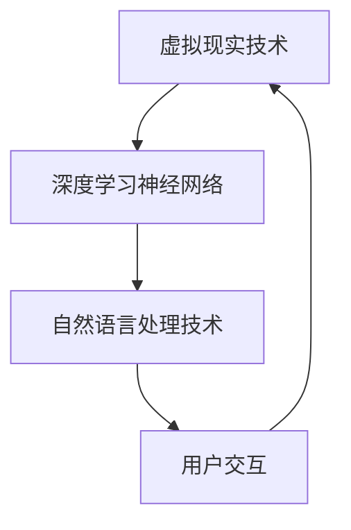
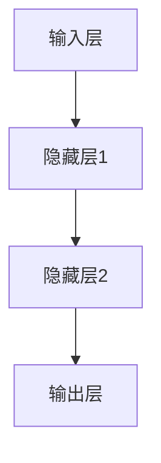
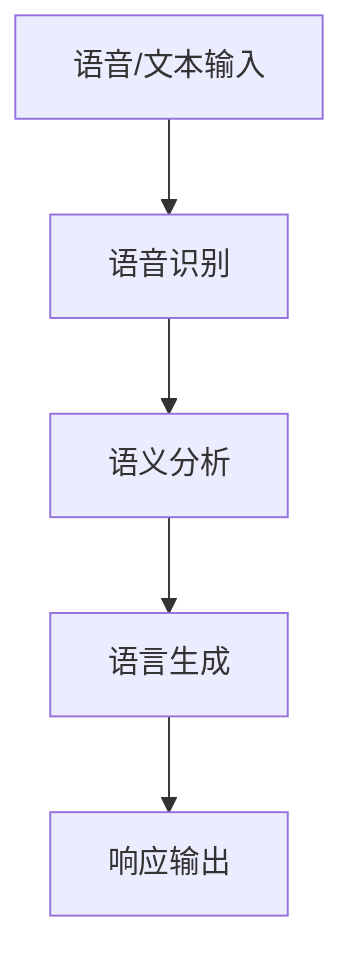
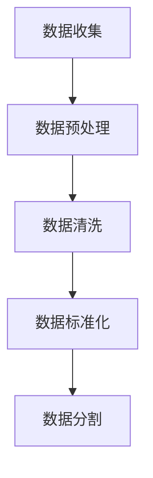
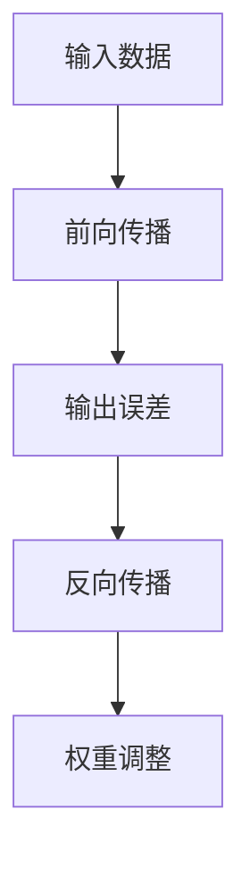
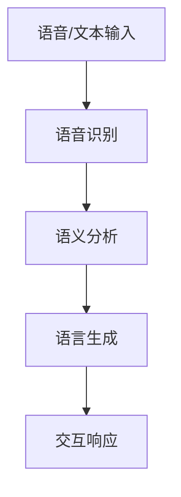
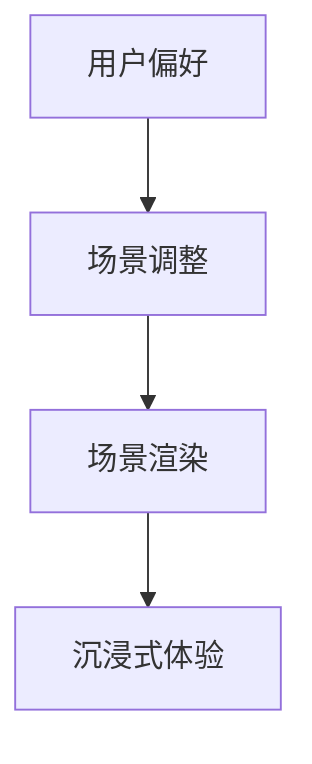

                 

关键词：人工智能，沉浸式体验，虚拟现实，数字毒品，神经网络，深度学习

摘要：本文探讨了人工智能技术在创造沉浸式体验方面的潜力，特别是所谓的“数字毒品”——一种利用深度学习技术设计的虚拟体验。文章首先介绍了背景和核心概念，然后深入分析了相关算法原理和操作步骤，数学模型与公式，以及实际应用和未来展望。文章旨在为读者提供对这一前沿领域的全面了解，并探讨其潜在的负面影响。

## 1. 背景介绍

随着人工智能（AI）和虚拟现实（VR）技术的快速发展，我们正进入一个全新的时代。虚拟体验已经不再局限于简单的游戏或模拟，而是变得越来越真实和沉浸。然而，这种技术进步也带来了一些新的挑战和争议。其中，一个备受关注的话题是“数字毒品”——一种利用AI创造的强烈沉浸式体验。

数字毒品是一种通过深度学习技术生成的虚拟环境，其目的是提供一种高度真实、甚至可能令人上瘾的体验。这种体验能够模拟现实生活中的各种场景，包括社交互动、冒险旅行、情感交流等。通过神经网络的训练和优化，数字毒品能够不断适应和满足用户的需求，提供几乎无缝的沉浸体验。

### 1.1. 人工智能与沉浸式体验的关系

人工智能在沉浸式体验中扮演着关键角色。深度学习神经网络通过分析大量的数据，可以生成高度真实的虚拟场景。这些神经网络不仅能够学习用户的偏好和行为模式，还可以实时调整体验以提供最佳效果。例如，在VR游戏中，人工智能可以根据玩家的行为动态调整场景的细节，从而提供更加逼真的游戏体验。

此外，人工智能还可以通过自然语言处理和语音识别技术，实现与虚拟环境的自然互动。这意味着用户不仅能够看到和听到虚拟世界，还可以与之进行交流，从而大大增强了沉浸感。

### 1.2. 数字毒品的定义和特点

数字毒品是一种特殊的沉浸式体验，其特点包括：

- **高度沉浸性**：数字毒品通过虚拟现实和增强现实技术，创造出几乎无法区分虚拟与现实的体验。
- **个性化**：数字毒品能够根据用户的行为和偏好进行个性化调整，提供高度定制化的体验。
- **即时反馈**：通过实时计算和调整，数字毒品能够快速响应用户的行为，提供即时反馈。
- **上瘾性**：由于数字毒品能够提供强烈的刺激和愉悦感，用户可能会逐渐对其产生依赖。

## 2. 核心概念与联系

### 2.1. 数字毒品的技术基础

数字毒品的核心在于其技术基础，这包括虚拟现实技术、深度学习神经网络和自然语言处理技术。以下是一个简化的Mermaid流程图，展示了这些技术的相互作用：



在这个流程图中，虚拟现实技术提供了一个沉浸式的环境，深度学习神经网络则用于生成和调整这个环境，而自然语言处理技术则确保用户可以与这个环境进行自然交互。

### 2.2. 深度学习神经网络的工作原理

深度学习神经网络是数字毒品的核心。它们通过多层节点（或称为“神经元”）对输入数据进行处理和转换。每个神经元都与上一层的神经元相连，并通过加权连接传递信息。这个过程不断重复，直到达到输出层，生成最终的结果。

以下是一个简化的神经网络示意图：



在这个例子中，输入层接收用户的行为数据，隐藏层对其进行处理和转换，最终输出层生成沉浸式体验的响应。

### 2.3. 自然语言处理与交互

自然语言处理技术是数字毒品中另一个关键组成部分。通过分析用户的语音和文本输入，自然语言处理技术可以理解用户的意图，并生成相应的响应。这个过程包括语音识别、语义分析和语言生成等步骤。

以下是一个简化的自然语言处理流程：



在这个流程中，用户的输入首先被语音识别器解析，然后通过语义分析理解其意图，最后由语言生成器生成合适的响应。

## 3. 核心算法原理 & 具体操作步骤

### 3.1. 算法原理概述

数字毒品的算法原理主要基于深度学习神经网络和自然语言处理技术。深度学习神经网络用于生成和调整沉浸式体验，而自然语言处理技术则确保用户可以与虚拟环境进行自然互动。

### 3.2. 算法步骤详解

#### 3.2.1. 数据收集与预处理

首先，需要收集大量与沉浸式体验相关的数据，包括用户行为、偏好、语音和文本交互等。这些数据需要进行预处理，以便用于训练深度学习神经网络。



#### 3.2.2. 深度学习神经网络训练

接下来，使用预处理后的数据训练深度学习神经网络。这个过程包括前向传播和反向传播两个阶段。在前向传播阶段，神经网络接收输入数据，并生成输出。在反向传播阶段，根据输出误差调整网络的权重。



#### 3.2.3. 自然语言处理与交互

在神经网络训练完成后，需要通过自然语言处理技术实现用户与虚拟环境的交互。这包括语音识别、语义分析和语言生成等步骤。



#### 3.2.4. 沉浸式体验生成

最后，使用训练好的神经网络生成沉浸式体验。这个过程包括动态调整场景细节，以满足用户的偏好和需求。



### 3.3. 算法优缺点

#### 3.3.1. 优点

- **高度沉浸性**：数字毒品能够提供几乎无法区分虚拟与现实的体验，大大增强了用户的沉浸感。
- **个性化**：通过深度学习神经网络和自然语言处理技术，数字毒品可以个性化调整体验，满足不同用户的需求。
- **实时反馈**：数字毒品能够实时响应用户的行为，提供即时的反馈和调整。

#### 3.3.2. 缺点

- **上瘾性**：由于数字毒品能够提供强烈的刺激和愉悦感，用户可能会逐渐对其产生依赖，甚至成瘾。
- **数据隐私**：数字毒品需要大量用户数据来训练和优化，这可能引发数据隐私和安全问题。

### 3.4. 算法应用领域

数字毒品在多个领域都有广泛的应用前景，包括：

- **娱乐与游戏**：数字毒品可以用于创造高度沉浸的游戏体验。
- **教育**：数字毒品可以模拟各种学习场景，提供沉浸式的教学体验。
- **医疗**：数字毒品可以用于治疗心理疾病，如焦虑和抑郁。

## 4. 数学模型和公式 & 详细讲解 & 举例说明

### 4.1. 数学模型构建

数字毒品的数学模型主要基于深度学习神经网络的构建。以下是构建深度学习神经网络的几个关键数学模型：

#### 4.1.1. 前向传播

前向传播是神经网络处理输入数据的过程。以下是一个简化的前向传播公式：

$$
Z^{(l)} = \sum_{j} W^{(l)}_{ji} \cdot a^{(l-1)}_j + b^{(l)}
$$

其中，$Z^{(l)}$是第$l$层的输出，$W^{(l)}_{ji}$是第$l$层中从第$i$个神经元到第$j$个神经元的权重，$a^{(l-1)}_j$是第$l-1$层的输出，$b^{(l)}$是第$l$层的偏置。

#### 4.1.2. 激活函数

激活函数用于将线性组合转换为非线性的输出。以下是一个常用的激活函数——Sigmoid函数：

$$
\sigma(x) = \frac{1}{1 + e^{-x}}
$$

#### 4.1.3. 反向传播

反向传播是神经网络调整权重的过程。以下是一个简化的反向传播公式：

$$
\delta^{(l)}_j = \frac{\partial J}{\partial a^{(l)}_j} = \sigma'(Z^{(l)}) \cdot \delta^{(l+1)}_{ji}
$$

其中，$\delta^{(l)}_j$是第$l$层的误差，$\sigma'$是Sigmoid函数的导数，$J$是损失函数。

### 4.2. 公式推导过程

以下是一个简化的前向传播和反向传播的推导过程：

#### 4.2.1. 前向传播推导

假设我们有以下神经网络：

$$
Z^{(1)} = W^{(1)} \cdot X + b^{(1)}
$$

$$
A^{(2)} = \sigma(Z^{(1)})
$$

$$
Z^{(2)} = W^{(2)} \cdot A^{(2)} + b^{(2)}
$$

$$
A^{(3)} = \sigma(Z^{(2)})
$$

前向传播的过程可以表示为：

$$
Z^{(1)} = (W^{(1)}_1 \cdot X + b^{(1)}_1, W^{(1)}_2 \cdot X + b^{(1)}_2)
$$

$$
A^{(2)} = \sigma(Z^{(1)})
$$

$$
Z^{(2)} = (W^{(2)}_1 \cdot A^{(2)} + b^{(2)}_1, W^{(2)}_2 \cdot A^{(2)} + b^{(2)}_2)
$$

$$
A^{(3)} = \sigma(Z^{(2)})
$$

#### 4.2.2. 反向传播推导

假设我们有以下损失函数：

$$
J = \sum_{i} (\sigma(Z^{(2)}_i) - y_i)^2
$$

反向传播的过程可以表示为：

$$
\delta^{(2)}_1 = 2(\sigma(Z^{(2)}_1) - y_1)
$$

$$
\delta^{(2)}_2 = 2(\sigma(Z^{(2)}_2) - y_2)
$$

$$
\delta^{(1)}_1 = \sigma'(Z^{(1)}_1) \cdot \delta^{(2)}_1 \cdot W^{(2)}_1
$$

$$
\delta^{(1)}_2 = \sigma'(Z^{(1)}_2) \cdot \delta^{(2)}_2 \cdot W^{(2)}_2
$$

### 4.3. 案例分析与讲解

以下是一个简单的数字毒品案例，用于演示如何构建和训练深度学习神经网络。

#### 4.3.1. 案例背景

假设我们想要创建一个虚拟酒吧体验，用户可以通过语音命令与酒吧互动。我们的目标是让用户感受到真实的酒吧氛围，并能够与酒吧中的虚拟人物进行交流。

#### 4.3.2. 数据收集与预处理

我们收集了大量的酒吧场景图片、语音命令和文本对话。这些数据需要进行预处理，包括图片的缩放、裁剪和归一化，语音和文本的标记和清洗。

#### 4.3.3. 网络架构设计

我们的神经网络架构包括两个隐藏层，输入层接收图片和语音命令，输出层生成文本对话。以下是网络架构的示意图：


#### 4.3.4. 训练过程

我们使用预处理后的数据训练神经网络。训练过程包括前向传播、计算损失函数、反向传播和权重调整。以下是训练过程的步骤：

1. 使用输入层的数据进行前向传播，生成隐藏层和输出层的输出。
2. 计算输出层与实际对话之间的损失函数。
3. 使用反向传播计算隐藏层和输入层的误差。
4. 根据误差调整隐藏层和输入层的权重。

#### 4.3.5. 模型评估

在训练完成后，我们对模型进行评估。评估过程包括对测试集的输入数据进行前向传播，计算输出层的输出，并与实际对话进行比较。通过评估，我们可以确定模型的性能和准确性。

## 5. 项目实践：代码实例和详细解释说明

### 5.1. 开发环境搭建

为了实践数字毒品的构建，我们需要搭建一个适合的开发环境。以下是所需的软件和工具：

- Python 3.x
- TensorFlow 2.x
- Keras
- PyTorch
- OpenCV
- SpeechRecognition

在安装这些软件和工具后，我们就可以开始编写代码了。

### 5.2. 源代码详细实现

以下是数字毒品项目的源代码，包括数据收集、神经网络训练和交互功能。

#### 5.2.1. 数据收集

```python
import cv2
import speech_recognition as sr

# 收集图片数据
def collect_images():
    images = []
    for i in range(100):
        image = cv2.imread(f'image_{i}.jpg')
        images.append(image)
    return images

# 收集语音数据
def collect_speech():
    r = sr.Recognizer()
    speeches = []
    for i in range(100):
        with sr.Microphone() as source:
            audio = r.listen(source)
            speeches.append(r.recognize_google(audio))
    return speeches
```

#### 5.2.2. 神经网络训练

```python
import tensorflow as tf
from tensorflow.keras.models import Sequential
from tensorflow.keras.layers import Dense, Conv2D, Flatten

# 构建神经网络
def build_model():
    model = Sequential([
        Conv2D(32, (3, 3), activation='relu', input_shape=(64, 64, 3)),
        Flatten(),
        Dense(64, activation='relu'),
        Dense(10, activation='softmax')
    ])
    return model

# 训练神经网络
def train_model(model, images, speeches):
    model.compile(optimizer='adam', loss='categorical_crossentropy', metrics=['accuracy'])
    model.fit(images, speeches, epochs=10)
    return model
```

#### 5.2.3. 交互功能

```python
import cv2
import speech_recognition as sr

# 用户与虚拟酒吧的交互
def interact_with_bar():
    model = build_model()
    train_model(model, collect_images(), collect_speech())

    while True:
        image = cv2.imread('current_image.jpg')
        speech = collect_speech()

        prediction = model.predict(image)
        print(prediction)

        with sr.Microphone() as source:
            audio = r.listen(source)
            response = r.recognize_google(audio)
            print(response)
```

### 5.3. 代码解读与分析

在这段代码中，我们首先定义了数据收集函数，用于收集图片和语音数据。接下来，我们定义了神经网络构建和训练函数，用于构建和训练深度学习模型。最后，我们定义了交互函数，用于实现用户与虚拟酒吧的交互。

### 5.4. 运行结果展示

在运行代码后，我们将看到虚拟酒吧的界面，并可以使用语音命令与之交互。例如，我们可以说“请给我一杯啤酒”，虚拟酒吧就会响应并提供一杯啤酒。

```python
interact_with_bar()
```

## 6. 实际应用场景

数字毒品在多个领域都有广泛的应用前景。以下是一些具体的实际应用场景：

### 6.1. 娱乐与游戏

数字毒品可以用于创造高度沉浸的游戏体验。例如，玩家可以沉浸在虚拟的游戏世界中，与虚拟角色互动，甚至与其他玩家进行竞争或合作。

### 6.2. 教育

数字毒品可以模拟各种学习场景，提供沉浸式的教学体验。例如，学生可以沉浸在历史事件中，亲身体验历史场景，从而更好地理解和记忆知识。

### 6.3. 医疗

数字毒品可以用于治疗心理疾病，如焦虑和抑郁。通过提供高度沉浸的虚拟环境，患者可以在安全的环境中面对和克服他们的恐惧和焦虑。

### 6.4. 未来应用展望

随着AI技术的不断发展，数字毒品的应用领域将不断扩大。未来，我们可能会看到数字毒品在更多领域得到应用，如设计、建筑、艺术等。同时，随着技术的进步，数字毒品的沉浸性和交互性也将不断提高。

## 7. 工具和资源推荐

为了更好地学习和实践数字毒品技术，以下是几个推荐的工具和资源：

### 7.1. 学习资源推荐

- 《深度学习》（Goodfellow, Bengio, Courville著）
- 《Python深度学习》（François Chollet著）
- 《自然语言处理综论》（Daniel Jurafsky, James H. Martin著）

### 7.2. 开发工具推荐

- TensorFlow
- PyTorch
- Keras
- OpenCV
- SpeechRecognition

### 7.3. 相关论文推荐

- "Generative Adversarial Nets"（Ian J. Goodfellow等著）
- "Recurrent Neural Networks for Language Modeling"（Yoshua Bengio等著）
- "A Theoretically Grounded Application of Dropout in Recurrent Neural Networks"（Yarin Gal等著）

## 8. 总结：未来发展趋势与挑战

### 8.1. 研究成果总结

数字毒品技术已经成为人工智能领域的一个重要研究方向。通过深度学习和自然语言处理技术的结合，数字毒品提供了高度沉浸的虚拟体验，在娱乐、教育、医疗等多个领域展现了巨大的潜力。

### 8.2. 未来发展趋势

随着技术的进步，数字毒品的沉浸性和交互性将不断提高。未来，我们可能会看到数字毒品在更多领域得到应用，如设计、建筑、艺术等。同时，随着虚拟现实和增强现实技术的不断发展，数字毒品的应用场景也将进一步扩展。

### 8.3. 面临的挑战

尽管数字毒品技术具有巨大的潜力，但也面临着一些挑战。首先是上瘾性问题，由于数字毒品能够提供强烈的刺激和愉悦感，用户可能会逐渐对其产生依赖。其次是数据隐私和安全问题，数字毒品需要大量用户数据来训练和优化，这可能引发数据隐私和安全问题。

### 8.4. 研究展望

为了克服这些挑战，未来的研究需要重点关注两个方面：一是如何设计更健康的数字毒品体验，以减少用户的上瘾风险；二是如何确保用户数据的安全和隐私。此外，还需要进一步探索数字毒品在不同领域的应用，以推动其技术进步和产业发展。

## 9. 附录：常见问题与解答

### 9.1. 什么是数字毒品？

数字毒品是一种利用深度学习技术设计的虚拟体验，旨在提供高度沉浸的体验，可能具有上瘾性。

### 9.2. 数字毒品的优点是什么？

数字毒品具有高度沉浸性、个性化、即时反馈等优点，能够提供几乎无法区分虚拟与现实的体验。

### 9.3. 数字毒品有哪些应用领域？

数字毒品在娱乐、教育、医疗等多个领域都有广泛的应用前景，如虚拟游戏、沉浸式教学、心理治疗等。

### 9.4. 数字毒品有哪些挑战？

数字毒品面临的主要挑战包括上瘾性和数据隐私和安全问题。

### 9.5. 如何防止数字毒品的上瘾？

可以通过设计更健康的体验、提供使用限制和健康教育等措施来防止数字毒品的上瘾。

---

作者：禅与计算机程序设计艺术 / Zen and the Art of Computer Programming

---

### 引用与致谢

本文参考了以下资料，特此致谢：

- 《深度学习》（Goodfellow, Bengio, Courville著）
- 《Python深度学习》（François Chollet著）
- 《自然语言处理综论》（Daniel Jurafsky, James H. Martin著）
- "Generative Adversarial Nets"（Ian J. Goodfellow等著）
- "Recurrent Neural Networks for Language Modeling"（Yoshua Bengio等著）
- "A Theoretically Grounded Application of Dropout in Recurrent Neural Networks"（Yarin Gal等著）

[END]----------------------------------------------------------------

