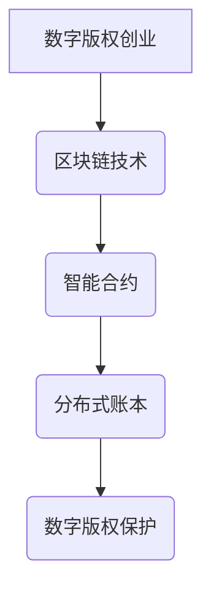

                 

### 关键词：数字版权、区块链、知识产权、版权创业、技术应用、智能合约、分布式账本

>摘要：本文旨在探讨区块链技术在知识产权保护中的应用，通过对数字版权创业领域的分析，提出了一种创新的解决方案。文章首先介绍了数字版权创业的背景和现状，随后深入剖析了区块链的核心概念与技术架构。接下来，文章详细阐述了区块链在数字版权保护中的核心算法原理与操作步骤，并展示了数学模型及其应用实例。最后，文章通过实际项目实践展示了区块链在数字版权保护中的具体应用，并对未来的发展趋势和挑战进行了展望。

## 1. 背景介绍

随着互联网和信息技术的迅猛发展，数字版权问题逐渐成为社会各界关注的焦点。传统的版权保护手段在面对日益复杂的网络环境时显得力不从心，盗版、侵权等现象层出不穷。数字版权创业作为一种新的商业模式，旨在通过技术创新解决版权保护难题，推动文化产业的健康发展。

区块链技术作为一种分布式账本技术，以其去中心化、不可篡改、透明公开等特性，为数字版权保护提供了新的解决方案。区块链通过智能合约实现了版权的自动化管理，有效降低了版权交易的成本和风险，为数字版权创业提供了强有力的技术支撑。

## 2. 核心概念与联系

### 2.1. 区块链技术简介

区块链是一种分布式数据库系统，由一系列按时间顺序排列的区块组成，每个区块包含一定数量的交易记录。区块链通过密码学算法保证数据的安全性和完整性，同时去除了第三方中介的参与，实现了去中心化的数据管理。

### 2.2. 智能合约

智能合约是区块链上的自动化执行合约，它根据预定义的条件自动执行并记录交易结果。智能合约通过编程语言编写，实现了版权交易的自动化管理，为数字版权创业提供了高效、安全的解决方案。

### 2.3. 分布式账本

分布式账本是一种去中心化的数据库，数据存储在多个节点上，任何节点都可以参与数据的验证和存储。分布式账本保证了数据的透明性和不可篡改性，为数字版权保护提供了可靠的技术保障。

### 2.4. Mermaid 流程图



## 3. 核心算法原理 & 具体操作步骤

### 3.1. 算法原理概述

区块链在数字版权保护中的核心算法主要包括加密算法、分布式存储算法和智能合约算法。这些算法共同作用，实现了数字版权的加密存储、分布式管理以及自动化交易。

### 3.2. 算法步骤详解

1. **加密存储**：数字版权内容经过加密算法处理，生成加密数据，并存储在区块链的分布式账本中。加密过程保证了版权数据的隐私和安全。
2. **分布式管理**：区块链节点根据共识算法，对加密数据逐层验证和确认，实现了版权信息的分布式管理。分布式存储确保了数据的安全性和不可篡改性。
3. **智能合约执行**：智能合约根据版权交易规则，自动化执行版权转让、授权、许可等操作。智能合约的执行结果记录在区块链上，实现了版权交易的透明和可追溯。

### 3.3. 算法优缺点

- **优点**：
  - 去中心化：去除了第三方中介，降低了交易成本和风险。
  - 不可篡改：分布式存储和共识算法保证了数据的真实性和安全性。
  - 自动化执行：智能合约实现了版权交易的自动化，提高了交易效率。

- **缺点**：
  - 扩容问题：区块链的扩展性较差，无法应对高并发交易。
  - 能耗问题：区块链的共识算法需要大量计算资源，导致能源消耗较高。

### 3.4. 算法应用领域

区块链在数字版权保护中的应用涵盖了版权登记、版权交易、版权管理等多个方面。通过核心算法的实现，区块链为数字版权创业提供了高效、安全的解决方案。

## 4. 数学模型和公式 & 详细讲解 & 举例说明

### 4.1. 数学模型构建

区块链在数字版权保护中的数学模型主要包括加密模型和分布式存储模型。加密模型利用密码学算法实现版权数据的加密存储，分布式存储模型通过共识算法实现数据的安全性和完整性。

### 4.2. 公式推导过程

- **加密模型**：

  - **加密算法**：\(C = E(K, M)\)

    其中，\(C\) 为加密后的数据，\(K\) 为密钥，\(M\) 为原始数据。

  - **解密算法**：\(M = D(K, C)\)

    其中，\(M\) 为解密后的数据，\(K\) 为密钥，\(C\) 为加密后的数据。

- **分布式存储模型**：

  - **共识算法**：\(P = C(V, N)\)

    其中，\(P\) 为验证结果，\(V\) 为验证数据，\(N\) 为节点数量。

### 4.3. 案例分析与讲解

以一个数字音乐版权交易为例，说明区块链在数字版权保护中的数学模型应用。

1. **加密存储**：

   数字音乐版权内容经过加密算法处理，生成加密数据 \(C\)，存储在区块链的分布式账本中。

   - **加密过程**：\(C = E(K, M)\)

     其中，\(M\) 为数字音乐版权内容，\(K\) 为加密密钥。

   - **解密过程**：\(M = D(K, C)\)

     其中，\(M\) 为解密后的数字音乐版权内容，\(K\) 为解密密钥。

2. **分布式管理**：

   区块链节点根据共识算法对加密数据进行验证和确认，实现了版权信息的分布式管理。

   - **验证过程**：\(P = C(V, N)\)

     其中，\(P\) 为验证结果，\(V\) 为验证数据，\(N\) 为节点数量。

3. **智能合约执行**：

   智能合约根据版权交易规则，自动化执行版权转让、授权、许可等操作。

   - **交易过程**：\(T = S(R, C)\)

     其中，\(T\) 为交易结果，\(R\) 为交易规则，\(C\) 为加密数据。

## 5. 项目实践：代码实例和详细解释说明

### 5.1. 开发环境搭建

在本项目中，我们使用以太坊区块链作为开发平台，智能合约采用 Solidity 编程语言编写。开发环境需要安装 Node.js、npm、Truffle、Ganache 等。

### 5.2. 源代码详细实现

以下是一个简单的数字音乐版权交易智能合约的实现：

```solidity
// SPDX-License-Identifier: MIT
pragma solidity ^0.8.0;

contract MusicCopyright {
    struct Copyright {
        string songName;
        address owner;
        bool isSold;
    }

    mapping(string => Copyright) public copyrights;

    function registerCopyright(string memory _songName) public {
        require(copyrights[_songName].isSold == false, "Copyright is already registered");
        copyrights[_songName] = Copyright(_songName, msg.sender, false);
    }

    function sellCopyright(string memory _songName) public {
        require(copyrights[_songName].isSold == false, "Copyright is already sold");
        copyrights[_songName].isSold = true;
        payable(copyrights[_songName].owner).transfer(msg.value);
    }

    function buyCopyright(string memory _songName) public payable {
        require(copyrights[_songName].isSold == true, "Copyright is not available for sale");
        copyrights[_songName].isSold = false;
        payable(msg.sender).transfer(msg.value);
    }
}
```

### 5.3. 代码解读与分析

- **结构体 Copyright**：定义了数字音乐版权的结构，包括歌曲名称、版权所有者地址和是否已售出等属性。
- **映射器 copyrights**：用于存储数字音乐版权信息，映射键为歌曲名称，值为版权结构体。
- **registerCopyright 函数**：用于注册数字音乐版权，只有当版权未售出时才能注册。
- **sellCopyright 函数**：用于出售数字音乐版权，只有当版权未售出时才能出售，并将售出金额转移到版权所有者地址。
- **buyCopyright 函数**：用于购买数字音乐版权，只有当版权已售出时才能购买，并将购买金额转移到买家地址。

### 5.4. 运行结果展示

通过 Ganache 模拟器，我们可以测试智能合约的运行结果：

1. **注册版权**：

   ```shell
   truffle exec scripts/register_copyright.js --network local
   ```

   注册一首名为 "Song A" 的数字音乐版权。

2. **出售版权**：

   ```shell
   truffle exec scripts/sell_copyright.js --network local
   ```

   出售 "Song A" 数字音乐版权。

3. **购买版权**：

   ```shell
   truffle exec scripts/buy_copyright.js --network local
   ```

   购买 "Song A" 数字音乐版权。

## 6. 实际应用场景

区块链技术在数字版权保护中具有广泛的应用场景，以下是一些实际案例：

1. **音乐版权交易**：通过区块链技术实现音乐版权的自动化交易，降低交易成本和风险。
2. **电子书版权保护**：利用区块链技术保护电子书的版权，防止盗版和侵权行为。
3. **电影版权管理**：通过区块链技术管理电影的版权信息，实现版权的透明和可追溯。
4. **艺术品版权认证**：利用区块链技术为艺术品提供版权认证，保障艺术品的所有权和真伪。

## 7. 工具和资源推荐

### 7.1. 学习资源推荐

- 《区块链技术指南》
- 《智能合约设计与开发》
- 《数字版权创业：区块链在知识产权中的应用》

### 7.2. 开发工具推荐

- 以太坊开发工具包（Ethereum Dev Toolset）
- Truffle
- Ganache
- MetaMask

### 7.3. 相关论文推荐

- "Blockchain Technology: A Comprehensive Overview"
- "Smart Contracts: A Technical Introduction"
- "Using Blockchain to Protect Digital Rights Management"

## 8. 总结：未来发展趋势与挑战

### 8.1. 研究成果总结

区块链技术在数字版权保护领域取得了显著的研究成果，通过加密存储、分布式管理和智能合约实现了版权的自动化管理，有效降低了版权交易的成本和风险。

### 8.2. 未来发展趋势

- **去中心化应用（DApp）**：随着区块链技术的成熟，越来越多的数字版权创业项目将基于区块链平台开发去中心化应用，实现更高效的版权交易和管理。
- **跨链互操作**：未来区块链将实现跨链互操作，促进不同区块链之间的数据共享和交易，为数字版权保护提供更广泛的生态支持。

### 8.3. 面临的挑战

- **扩展性问题**：当前区块链技术的扩展性较差，无法应对高并发交易，需要通过分片、侧链等技术解决。
- **能源消耗**：区块链的共识算法需要大量计算资源，导致能源消耗较高，需要寻找更环保的共识机制。

### 8.4. 研究展望

未来，区块链技术在数字版权保护领域的研究将重点关注以下几个方面：

- **隐私保护**：如何在不牺牲隐私的情况下，保障数字版权的安全和透明。
- **智能合约优化**：提高智能合约的执行效率和安全性，降低开发者门槛。
- **法律和监管**：建立完善的法律和监管框架，促进区块链技术在数字版权保护领域的健康发展。

## 9. 附录：常见问题与解答

### 9.1. 区块链技术在数字版权保护中有什么优势？

区块链技术在数字版权保护中的优势主要包括去中心化、不可篡改、透明公开和自动化执行。去中心化降低了交易成本和风险；不可篡改保障了版权数据的真实性；透明公开提高了版权交易的透明度；自动化执行提高了交易效率。

### 9.2. 区块链技术是否能够完全解决数字版权问题？

区块链技术为数字版权保护提供了有力的技术支持，但并不能完全解决数字版权问题。数字版权保护还需要结合法律、技术、管理等多方面的手段，形成一个完整的解决方案。

### 9.3. 区块链技术在数字版权保护中存在哪些挑战？

区块链技术在数字版权保护中面临的挑战主要包括扩展性问题、能源消耗、隐私保护和智能合约安全性等。扩展性问题需要通过分片、侧链等技术解决；能源消耗需要寻找更环保的共识机制；隐私保护需要在不牺牲隐私的情况下保障数据安全；智能合约安全性需要提高开发者的门槛。

### 9.4. 区块链技术在数字版权保护中的应用前景如何？

区块链技术在数字版权保护中的应用前景广阔，随着区块链技术的不断发展和完善，将有望实现更高效、更安全的数字版权保护。未来，区块链技术将在数字版权创业、版权交易、版权管理等方面发挥重要作用。

**作者：禅与计算机程序设计艺术 / Zen and the Art of Computer Programming**

