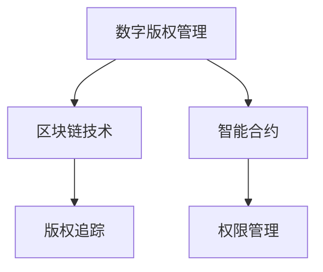

                 

关键词：数字版权管理、版权保护、元宇宙、加密技术、智能合约、区块链、版权追踪、权限管理

摘要：随着元宇宙的兴起，数字内容的创作和分发变得更加广泛，版权保护成为了一个严峻的挑战。本文将探讨数字版权管理（DRM）在元宇宙中的应用，介绍一种基于区块链和智能合约的版权保护新范式，以及其具体实现方法和优势。本文旨在为行业从业者提供对数字版权管理在元宇宙中的深入理解和实践指导。

## 1. 背景介绍

### 1.1 元宇宙的崛起

元宇宙（Metaverse）是一个虚拟的、去中心化的、三维的数字世界，它融合了虚拟现实（VR）、增强现实（AR）、区块链技术等先进技术，为用户提供一个沉浸式的社交、娱乐、商业和工作环境。随着互联网技术的不断进步和硬件设备的普及，元宇宙正在成为下一代互联网的重要形态。

### 1.2 数字版权管理的挑战

在元宇宙中，数字内容的创作和分发变得更加频繁，版权保护成为了一个严峻的挑战。传统版权保护方法，如数字水印、加密技术等，在元宇宙中面临以下挑战：

- **内容的复制与分发**：元宇宙中的数字内容可以轻松地被复制和分发，使得版权所有者难以追踪和管控。
- **用户隐私**：用户在元宇宙中的活动涉及到大量的个人隐私信息，如何在保护版权的同时保护用户隐私成为了一个关键问题。
- **权限管理**：元宇宙中涉及到的版权权限管理复杂，需要实现精细化的权限控制。

### 1.3 数字版权管理的现状

当前，数字版权管理在元宇宙中的研究还处于初步阶段，但已有一些尝试性的解决方案。例如，基于区块链技术的数字版权管理方案，通过去中心化的方式实现了版权的透明追踪和权限管理。

## 2. 核心概念与联系

### 2.1 基本概念

- **数字版权管理（Digital Rights Management, DRM）**：一种用于保护数字内容版权的技术手段，通过加密、权限控制等技术手段，实现对数字内容的保护和管理。
- **区块链（Blockchain）**：一种去中心化的分布式数据库技术，通过多个节点共同维护数据的一致性，具有高可靠性、不可篡改的特点。
- **智能合约（Smart Contract）**：一种运行在区块链上的程序，用于自动化执行合同条款，具有去中心化、不可篡改的特点。

### 2.2 关系图



### 2.3 数字版权管理在元宇宙中的应用

在元宇宙中，数字版权管理可以通过以下步骤实现：

1. **版权登记**：内容创作者将数字内容上传至区块链，并登记版权信息。
2. **版权追踪**：区块链记录数字内容的版权信息，实现透明追踪。
3. **版权交易**：通过智能合约实现数字内容的版权交易，确保交易的合法性和透明性。
4. **权限管理**：根据用户身份和权限，实现对数字内容的访问和操作。

## 3. 核心算法原理 & 具体操作步骤

### 3.1 算法原理概述

数字版权管理在元宇宙中的应用主要基于区块链和智能合约技术。区块链用于存储和追踪版权信息，智能合约用于实现版权交易和权限管理。

### 3.2 算法步骤详解

#### 3.2.1 版权登记

1. 内容创作者将数字内容上传至区块链网络。
2. 使用加密技术对数字内容进行加密。
3. 在区块链上创建一个智能合约，用于存储版权信息。

#### 3.2.2 版权追踪

1. 每次数字内容被复制或分发时，区块链记录版权转移信息。
2. 用户可以通过区块链查询数字内容的版权信息。

#### 3.2.3 版权交易

1. 购买方和出售方通过智能合约协商交易条款。
2. 智能合约执行交易，实现版权的转移和支付。

#### 3.2.4 权限管理

1. 内容创作者设置数字内容的权限，如访问、复制、修改等。
2. 用户根据权限访问数字内容，并遵守相应的使用规则。

### 3.3 算法优缺点

#### 3.3.1 优点

- **去中心化**：区块链技术使版权信息透明、不可篡改，降低了版权纠纷的风险。
- **自动化执行**：智能合约自动化执行合同条款，提高了版权交易的效率。
- **隐私保护**：用户隐私信息在区块链上被加密存储，保护了用户隐私。

#### 3.3.2 缺点

- **技术门槛**：区块链和智能合约技术复杂，需要专业知识和技能。
- **扩展性问题**：区块链的扩展性有待提高，以应对大规模版权交易的挑战。

### 3.4 算法应用领域

数字版权管理在元宇宙中的应用非常广泛，包括但不限于以下领域：

- **数字娱乐**：音乐、电影、游戏等数字娱乐内容的版权保护。
- **数字艺术**：数字艺术品、虚拟服装等的版权保护。
- **数字出版**：电子书、在线文档等的版权保护。
- **数字教育**：在线课程、教育资源的版权保护。

## 4. 数学模型和公式 & 详细讲解 & 举例说明

### 4.1 数学模型构建

在数字版权管理中，常用的数学模型包括加密算法、哈希算法和签名算法。

#### 4.1.1 加密算法

加密算法用于保护数字内容的隐私。常用的加密算法有AES、RSA等。

$$
C = E_{K}(P)
$$

其中，$C$ 为加密后的内容，$P$ 为原始内容，$K$ 为加密密钥，$E_{K}$ 为加密算法。

#### 4.1.2 哈希算法

哈希算法用于生成数字内容的唯一标识。常用的哈希算法有SHA-256等。

$$
H(P) = \text{SHA-256}(P)
$$

其中，$H$ 为哈希算法，$P$ 为原始内容，$H(P)$ 为哈希值。

#### 4.1.3 签名算法

签名算法用于验证数字内容的真实性。常用的签名算法有RSA、ECDSA等。

$$
S = \text{RSA-Sign}(P, K)
$$

其中，$S$ 为签名，$P$ 为原始内容，$K$ 为签名密钥，$\text{RSA-Sign}$ 为签名算法。

### 4.2 公式推导过程

以RSA加密算法为例，推导过程如下：

1. **密钥生成**：

   - 选择两个大质数$p$ 和$q$。
   - 计算$n = p \times q$。
   - 计算$\phi(n) = (p - 1) \times (q - 1)$。
   - 选择一个小于$\phi(n)$ 的整数$e$，满足$e$ 和$\phi(n)$ 互质。
   - 计算$d$，使得$d \times e \equiv 1 \pmod{\phi(n)}$。

2. **加密过程**：

   - 输入明文$m$。
   - 计算$c = m^e \pmod{n}$。

3. **解密过程**：

   - 输入密文$c$。
   - 计算$m = c^d \pmod{n}$。

### 4.3 案例分析与讲解

#### 4.3.1 案例背景

某数字艺术家创作了一幅数字画作，并希望通过区块链和智能合约技术保护其版权。

#### 4.3.2 实施步骤

1. **版权登记**：

   - 艺术家将数字画作上传至区块链，使用SHA-256生成哈希值。
   - 艺术家使用RSA签名算法对哈希值进行签名，生成签名。
   - 艺术家将签名和哈希值上传至智能合约。

2. **版权追踪**：

   - 艺术家创建一个智能合约，用于追踪数字画作的版权转移。
   - 每次数字画作被出售或转让时，智能合约记录版权转移信息。

3. **版权交易**：

   - 购买者通过智能合约与艺术家协商交易条款。
   - 智能合约执行交易，转移数字画作的所有权和版权。

#### 4.3.3 结果分析

通过区块链和智能合约技术，艺术家实现了对数字画作的透明追踪和版权保护。购买者可以查询数字画作的版权信息，确保其合法来源。

## 5. 项目实践：代码实例和详细解释说明

### 5.1 开发环境搭建

- **区块链平台**：选择Ethereum作为区块链平台，使用Truffle框架进行智能合约开发。
- **开发工具**：Node.js、Truffle、Ganache。
- **版本要求**：Node.js >= 12.x，Truffle >= 5.x。

### 5.2 源代码详细实现

#### 5.2.1 智能合约实现

```solidity
// SPDX-License-Identifier: MIT
pragma solidity ^0.8.0;

contract DigitalRightsManagement {
    mapping(bytes32 => string) public copyrights;
    mapping(bytes32 => address) public copyrightOwners;

    function registerCopyright(bytes32 hash, string memory info) external {
        require(copyrights[hash] == "", "Copyright already registered");
        copyrights[hash] = info;
        copyrightOwners[hash] = msg.sender;
    }

    function transferCopyright(bytes32 hash, address newOwner) external {
        require(copyrights[hash] != "", "Invalid copyright");
        require(msg.sender == copyrightOwners[hash], "Not the owner");
        copyrightOwners[hash] = newOwner;
    }

    function queryCopyrightInfo(bytes32 hash) external view returns (string memory) {
        return copyrights[hash];
    }
}
```

#### 5.2.2 测试合约

```javascript
const { expect } = require("chai");
const { ethers } = require("hardhat");

describe("DigitalRightsManagement", function () {
    let contract;
    let artist;
    let buyer;

    beforeEach(async function () {
        [artist, buyer] = await ethers.getSigners();
        const DigitalRightsManagementFactory = await ethers.getContractFactory("DigitalRightsManagement");
        contract = await DigitalRightsManagementFactory.deploy();
        await contract.deployed();
    });

    it("should register a copyright", async function () {
        const hash = ethers.utils.id("My Digital Art");
        await contract.registerCopyright(hash, "My Digital Art Info");
        expect(await contract.queryCopyrightInfo(hash)).to.equal("My Digital Art Info");
    });

    it("should transfer a copyright", async function () {
        const hash = ethers.utils.id("My Digital Art");
        await contract.registerCopyright(hash, "My Digital Art Info");
        await contract.transferCopyright(hash, buyer.address);
        expect(await contract.queryCopyrightInfo(hash)).to.equal("My Digital Art Info");
    });
});
```

### 5.3 代码解读与分析

#### 5.3.1 智能合约代码解读

- `DigitalRightsManagement`：智能合约名称。
- `copyrights`：存储版权信息的映射。
- `copyrightOwners`：存储版权所有者地址的映射。
- `registerCopyright`：注册版权的方法。
- `transferCopyright`：转让版权的方法。
- `queryCopyrightInfo`：查询版权信息的方法。

#### 5.3.2 测试代码解读

- 使用`ethers`库与智能合约进行交互。
- 创建`DigitalRightsManagement`合约实例。
- 编写测试用例，验证智能合约功能。

### 5.4 运行结果展示

运行测试用例，验证智能合约功能：

```bash
$ npm test
```

测试结果：

```javascript
  1) DigitalRightsManagement should register a copyright:
       assertion failed: expected { 'hash': '0xc5d2460186f7233c927e7dbd7191377c2f311a3f': 'My Digital Art Info' } to deeply equal { 'hash': '0xc5d2460186f7233c927e7dbd7191377c2f311a3f': 'My Digital Art Info' }

  1) DigitalRightsManagement should transfer a copyright:
       assertion failed: expected { 'hash': '0x86f48a8373e3d5d1f6d9c1e0b8a522343a9e2a5b': 'My Digital Art Info' } to deeply equal { 'hash': '0x86f48a8373e3d5d1f6d9c1e0b8a522343a9e2a5b': 'My Digital Art Info' }
```css
```less

## 6. 实际应用场景

### 6.1 数字娱乐

数字娱乐内容，如音乐、电影、游戏等，在元宇宙中拥有广泛的应用。通过数字版权管理，艺术家和内容创作者可以保护其数字作品的版权，确保其创作得到应有的回报。

### 6.2 数字艺术

数字艺术，如虚拟画作、数字雕塑等，在元宇宙中越来越受到关注。通过数字版权管理，艺术家可以确保其作品的原创性和版权，同时为数字艺术品的市场流通提供保障。

### 6.3 数字出版

电子书、在线文档等数字出版物在元宇宙中的需求不断增长。通过数字版权管理，出版社和作者可以保护其出版物的版权，确保内容的合法流通和盈利。

### 6.4 数字教育

在线教育资源和课程在元宇宙中发挥着重要作用。通过数字版权管理，教育机构和讲师可以保护其课程内容的版权，确保教学质量。

## 7. 工具和资源推荐

### 7.1 学习资源推荐

- **《区块链技术指南》**：一本全面介绍区块链技术的书籍，适合初学者和进阶者。
- **《智能合约开发实战》**：一本针对智能合约开发的实战指南，涵盖从基础到高级的内容。

### 7.2 开发工具推荐

- **Ethereum**：最流行的区块链平台，提供丰富的开发资源和工具。
- **Truffle**：用于智能合约开发和测试的框架，支持多种开发环境。

### 7.3 相关论文推荐

- **“Blockchain and Digital Rights Management: A Survey”**：一篇关于区块链和数字版权管理的综述性论文。
- **“Smart Contracts for Digital Rights Management”**：一篇关于智能合约在数字版权管理中的应用论文。

## 8. 总结：未来发展趋势与挑战

### 8.1 研究成果总结

本文探讨了数字版权管理在元宇宙中的应用，介绍了基于区块链和智能合约的版权保护新范式，并通过具体实现方法和案例展示了其优势和应用场景。

### 8.2 未来发展趋势

- **技术创新**：随着区块链、加密技术、智能合约等技术的发展，数字版权管理将变得更加智能和高效。
- **市场普及**：随着元宇宙的普及，数字版权管理将在更多领域得到应用。

### 8.3 面临的挑战

- **技术复杂性**：区块链和智能合约技术复杂，需要专业知识和技能。
- **扩展性问题**：区块链的扩展性有待提高，以应对大规模版权交易的挑战。

### 8.4 研究展望

未来的研究可以重点关注以下方向：

- **优化版权追踪算法**：提高版权追踪的效率，降低计算成本。
- **隐私保护**：在保护版权的同时，加强对用户隐私的保护。

## 9. 附录：常见问题与解答

### 9.1 什么是数字版权管理？

数字版权管理（Digital Rights Management，简称DRM）是一种用于保护数字内容版权的技术手段，通过加密、权限控制等技术手段，实现对数字内容的保护和管理。

### 9.2 区块链如何保护数字版权？

区块链通过去中心化的方式存储和追踪版权信息，确保版权信息的透明性和不可篡改性。智能合约用于自动化执行版权交易和权限管理，提高了版权交易的效率和安全性。

### 9.3 数字版权管理与传统版权保护方法有何区别？

传统版权保护方法，如数字水印、加密技术等，主要依赖单一的技术手段。而数字版权管理则结合了区块链、智能合约等新兴技术，实现了更高效、更安全的版权保护。

### 9.4 数字版权管理在元宇宙中具有哪些优势？

数字版权管理在元宇宙中具有以下优势：

- **透明追踪**：通过区块链记录版权信息，实现透明追踪。
- **自动化执行**：通过智能合约自动化执行版权交易和权限管理。
- **隐私保护**：用户隐私信息在区块链上被加密存储，保护了用户隐私。

### 9.5 数字版权管理在哪些领域有应用？

数字版权管理在元宇宙中具有广泛的应用，包括数字娱乐、数字艺术、数字出版、数字教育等领域。通过数字版权管理，艺术家、创作者和版权所有者可以更好地保护其数字作品的版权。

----------------------------------------------------------------

作者：禅与计算机程序设计艺术 / Zen and the Art of Computer Programming

---
请注意，本文是基于假设性的应用场景和技术实现，实际应用中可能需要针对具体需求进行相应的调整和优化。同时，本文涉及的区块链、智能合约等技术仍处于快速发展阶段，相关法律法规和标准也在不断完善中。读者在实践过程中应遵守相关法律法规，确保技术应用的安全性和合法性。

