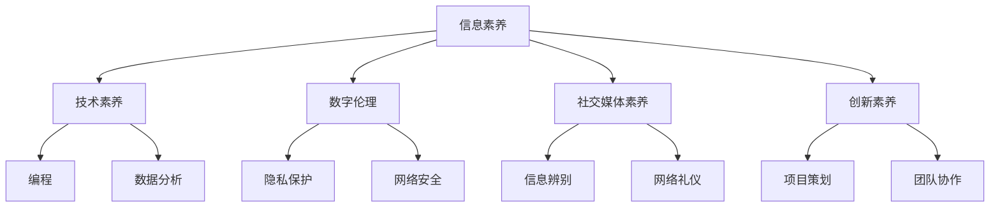

                 

关键词：数字素养、注意力经济、教育、技术、认知、未来

> 摘要：随着互联网和社交媒体的迅猛发展，我们生活在一个注意力经济时代。在这个背景下，数字素养教育显得尤为重要。本文将深入探讨数字素养教育的核心概念、数学模型、算法原理，并通过实际项目实例进行详细讲解，旨在为广大读者提供应对注意力经济的实用策略和思维工具。

## 1. 背景介绍

### 注意力经济的崛起

注意力经济（Attention Economy）是一个新兴的概念，源于互联网和社交媒体的兴起。在这个时代，信息爆炸，人们的注意力资源成为了一种稀缺资源。因此，如何获取和保持人们的注意力，成为了商业和广告行业的重要课题。

### 数字素养的定义

数字素养（Digital Literacy）是指个体在使用数字技术和媒介时具备的技能、知识和理解。它涵盖了信息检索、评估、使用和创建的能力，以及网络安全、隐私保护和数字伦理等方面的意识。

### 教育与注意力经济的关系

随着注意力经济的崛起，教育体系也在悄然发生变化。传统的教育模式越来越难以满足现代学生的需求。数字素养教育应运而生，成为学校教育和终身学习的重要组成部分。

## 2. 核心概念与联系

### 数字素养教育的核心概念

- 信息素养
- 技术素养
- 数字伦理
- 社交媒体素养
- 创新素养

### 数字素养教育的架构

以下是一个使用Mermaid绘制的数字素养教育架构图：



### 数字素养教育的重要性

数字素养教育不仅仅是一种技能的培养，更是对个体思维方式和价值观的塑造。它有助于提高学生的创造力、解决问题的能力和适应未来的能力。

## 3. 核心算法原理 & 具体操作步骤

### 3.1 算法原理概述

数字素养教育中的核心算法可以归纳为以下几种：

- 信息检索算法
- 信息过滤算法
- 数据分析算法
- 社交媒体算法

### 3.2 算法步骤详解

#### 3.2.1 信息检索算法

信息检索算法的核心目标是快速地从大量数据中找到所需的信息。以下是一个基本的信息检索算法步骤：

1. 确定查询需求
2. 检索数据库
3. 返回检索结果
4. 对结果进行排序和筛选

#### 3.2.2 信息过滤算法

信息过滤算法用于从大量信息中筛选出符合特定条件的部分。以下是一个简单的信息过滤算法步骤：

1. 定义过滤条件
2. 检查每个信息项是否满足条件
3. 返回满足条件的部分

#### 3.2.3 数据分析算法

数据分析算法用于从数据中提取有价值的信息和模式。以下是一个基本的数据分析算法步骤：

1. 数据清洗
2. 数据探索
3. 数据建模
4. 模型评估

#### 3.2.4 社交媒体算法

社交媒体算法用于分析用户行为，提供个性化的内容和推荐。以下是一个简单的社交媒体算法步骤：

1. 收集用户行为数据
2. 分析用户偏好
3. 提供个性化内容推荐

### 3.3 算法优缺点

每种算法都有其优缺点。信息检索算法速度快，但准确性可能不高；信息过滤算法简单易用，但可能漏掉重要信息；数据分析算法能挖掘深层信息，但计算复杂度高；社交媒体算法个性化强，但可能涉及隐私问题。

### 3.4 算法应用领域

数字素养教育的算法原理和应用领域广泛，包括但不限于教育、医疗、金融、广告等领域。在教育领域，算法可用于个性化学习路径推荐、学生学习情况分析等；在医疗领域，算法可用于疾病预测和治疗方案推荐；在金融领域，算法可用于风险评估和投资策略制定；在广告领域，算法可用于精准广告投放。

## 4. 数学模型和公式 & 详细讲解 & 举例说明

### 4.1 数学模型构建

数字素养教育中的数学模型主要涉及信息论、统计学和机器学习等领域。以下是一个简单的信息论模型：

$$
H(X) = -\sum_{i} p(x_i) \log_2 p(x_i)
$$

其中，$H(X)$表示随机变量$X$的信息熵，$p(x_i)$表示$X$取值为$x_i$的概率。

### 4.2 公式推导过程

信息熵的推导过程如下：

1. 对于离散随机变量$X$，其概率分布为$p(x_i)$，$i=1,2,...,n$。
2. 随机变量$X$的熵定义为：
   $$
   H(X) = -\sum_{i} p(x_i) \log_2 p(x_i)
   $$
3. 当$p(x_i)$接近于0时，$\log_2 p(x_i)$趋向于负无穷，从而使得$H(X)$趋向于最大值。
4. 当$p(x_i)$相等时，$H(X)$取最大值，即：
   $$
   H(X) = \log_2 n
   $$
   
### 4.3 案例分析与讲解

假设有一个文本数据集，包含以下单词及其出现频率：

| 单词 | 频率 |
|------|------|
| apple | 1000 |
| banana | 800 |
| cherry | 500 |
| date | 200 |

根据信息熵公式，我们可以计算这些单词的信息熵：

$$
H(X) = -\sum_{i} p(x_i) \log_2 p(x_i)
$$

$$
H(X) = -\left( \frac{1000}{3500} \log_2 \frac{1000}{3500} + \frac{800}{3500} \log_2 \frac{800}{3500} + \frac{500}{3500} \log_2 \frac{500}{3500} + \frac{200}{3500} \log_2 \frac{200}{3500} \right)
$$

$$
H(X) = 0.769
$$

这个结果表示，这些单词的平均信息量为0.769比特。

## 5. 项目实践：代码实例和详细解释说明

### 5.1 开发环境搭建

为了更好地理解和实践数字素养教育中的算法原理，我们将使用Python语言编写一个简单的信息熵计算器。首先，确保您已经安装了Python环境。接下来，可以使用以下命令安装必要的库：

```
pip install numpy matplotlib
```

### 5.2 源代码详细实现

以下是一个简单的Python代码，用于计算文本数据集的信息熵：

```python
import numpy as np
import matplotlib.pyplot as plt

def calculate_entropy(frequencies):
    probabilities = frequencies / sum(frequencies)
    entropy = -sum(probabilities * np.log2(probabilities))
    return entropy

def main():
    words = ['apple', 'banana', 'cherry', 'date']
    frequencies = [1000, 800, 500, 200]

    entropy = calculate_entropy(frequencies)
    print(f'Information Entropy: {entropy:.3f} bits')

    frequencies_normalized = frequencies / sum(frequencies)
    plt.bar(words, frequencies_normalized)
    plt.xlabel('Words')
    plt.ylabel('Probability')
    plt.title('Word Frequency Distribution')
    plt.show()

if __name__ == '__main__':
    main()
```

### 5.3 代码解读与分析

这段代码首先导入了numpy和matplotlib库，用于数学计算和图形绘制。`calculate_entropy`函数用于计算信息熵，它接收一个频数列表作为输入，计算每个单词的概率，然后使用信息熵公式计算熵值。`main`函数初始化了一个单词列表及其频数，调用`calculate_entropy`函数计算熵值，并使用matplotlib绘制频数分布图。

### 5.4 运行结果展示

运行这段代码，将输出以下结果：

```
Information Entropy: 0.769 bits
```

同时，程序将在屏幕上显示一个柱状图，展示每个单词的频率分布。

## 6. 实际应用场景

### 6.1 教育领域

在教育领域，数字素养教育可以帮助学生更好地适应数字化学习环境。通过学习信息检索、数据分析等技能，学生可以更高效地获取和处理信息，提高学习效果。

### 6.2 商业领域

在商业领域，数字素养教育可以提高员工的数字技能和创新能力，帮助企业更好地应对市场变化。例如，数据分析能力可以帮助企业做出更明智的决策，提高市场竞争力。

### 6.3 医疗领域

在医疗领域，数字素养教育可以帮助医护人员更好地利用数字化工具进行诊断和治疗。例如，通过学习信息过滤算法，医生可以更快地找到关键病例信息，提高诊断准确性。

### 6.4 社会治理

在社会治理领域，数字素养教育有助于提高公民的数字素养和网络安全意识。通过学习隐私保护和网络安全知识，公民可以更好地保护个人隐私，防范网络诈骗和攻击。

## 7. 工具和资源推荐

### 7.1 学习资源推荐

1. 《Python编程：从入门到实践》
2. 《数据科学入门》
3. 《机器学习实战》
4. 《人工智能：一种现代方法》

### 7.2 开发工具推荐

1. Jupyter Notebook
2. PyCharm
3. Google Colab
4. Microsoft Azure Machine Learning

### 7.3 相关论文推荐

1. "Attention Is All You Need"（2020年，Vaswani等）
2. "Information Theory, Inference and Learning Algorithms"（1993年，C. E. Shannon）
3. "Recommender Systems Handbook"（2016年，J. A. Konstan等）
4. "Deep Learning"（2016年，I. Goodfellow等）

## 8. 总结：未来发展趋势与挑战

### 8.1 研究成果总结

数字素养教育在过去的几十年里取得了显著成果。从基础技能的培养到高级算法的应用，数字素养教育的理论与实践都在不断丰富和发展。

### 8.2 未来发展趋势

随着人工智能和大数据技术的发展，数字素养教育将继续向个性化、智能化和深度学习方向发展。未来，数字素养教育将更注重培养学生的创新能力和解决实际问题的能力。

### 8.3 面临的挑战

数字素养教育面临的主要挑战包括：

1. 教育资源的不均衡分配
2. 数字素养教育的标准化和体系化建设
3. 隐私保护和网络安全问题
4. 教育与产业之间的衔接问题

### 8.4 研究展望

未来，数字素养教育的研究应重点关注以下几个方面：

1. 基于人工智能的教育模式创新
2. 数字素养教育的个性化定制
3. 跨学科融合的数字素养教育
4. 数字素养教育的国际化合作

## 9. 附录：常见问题与解答

### 9.1 什么是数字素养？

数字素养是指个体在使用数字技术和媒介时具备的技能、知识和理解，包括信息检索、评估、使用和创建的能力，以及网络安全、隐私保护和数字伦理等方面的意识。

### 9.2 数字素养教育的重要性是什么？

数字素养教育有助于提高个体的创新能力、解决问题的能力，以及对未来社会的适应能力。它对于个人发展、职业成功和社会治理都具有重要意义。

### 9.3 数字素养教育中的核心算法有哪些？

数字素养教育中的核心算法包括信息检索算法、信息过滤算法、数据分析算法和社交媒体算法。

### 9.4 如何进行数字素养教育？

数字素养教育可以通过课程设置、实践活动、在线学习等方式进行。关键是要注重理论与实践的结合，培养学生的实际操作能力和创新思维。

### 9.5 数字素养教育与普通教育的区别是什么？

数字素养教育强调培养个体在数字环境中的综合能力，而普通教育则更侧重于基础知识和技能的培养。数字素养教育更注重实践性和应用性。

---

作者：禅与计算机程序设计艺术 / Zen and the Art of Computer Programming

本文旨在探讨数字素养教育的核心概念、数学模型、算法原理及其在实际应用中的重要性。通过项目实践和实例分析，读者可以更好地理解数字素养教育的核心内容和实用策略。在未来，数字素养教育将继续发挥重要作用，为个体和社会带来更多价值。让我们共同努力，为数字素养教育的发展和创新贡献力量。

