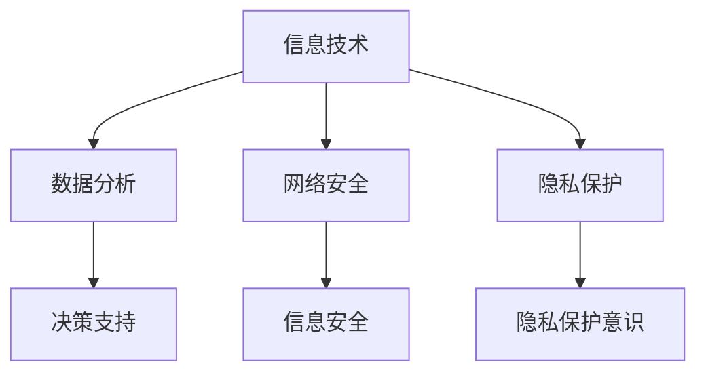

                 

关键词：数字素养、公民参与、技术教育、信息技术、数字化转型、数据处理、隐私保护、信息安全

> 摘要：随着信息技术的迅猛发展，数字素养已成为公民参与社会和经济活动的基石。本文旨在探讨数字素养的概念、重要性以及如何提升公民的数字素养，为构建一个更加公平、包容和智能的社会提供思考。

## 1. 背景介绍

在当今全球化的数字时代，信息技术（IT）已经成为社会经济发展的核心驱动力。数字化转型正在深刻改变我们的生活方式、工作方式和商业模式。从个人层面到企业层面，再到整个社会层面，数字素养的培育已经成为不可忽视的重要课题。

数字素养，是指个体在数字化环境中获取、理解、评估、创造和应用信息的能力。它不仅包括基础的技术技能，如操作电脑、使用互联网、处理电子文档等，还包括高级的技能，如数据分析、网络安全、隐私保护等。

### 1.1 数字素养的重要性

数字素养的重要性体现在以下几个方面：

1. **提高生活质量**：具备良好的数字素养，可以让个体更好地利用数字技术解决日常生活中的问题，提高生活效率和质量。
2. **促进就业机会**：在许多行业中，数字技能已经成为基础技能。提高数字素养可以增强个体的就业竞争力，拓展职业发展空间。
3. **支持民主参与**：数字素养有助于公民理解和参与数字经济和社会，保障信息透明，提高社会公平性和包容性。
4. **提升国家竞争力**：数字素养是国家创新能力和国际竞争力的重要组成部分。培养具有高水平数字素养的人才，有助于推动社会经济的可持续发展。

### 1.2 数字素养的挑战

然而，数字素养的培育也面临诸多挑战：

1. **技术快速迭代**：信息技术更新换代速度极快，数字素养的教育和培训需要跟上技术发展的步伐。
2. **数字鸿沟**：不同社会群体在数字素养水平上存在显著差异，这可能导致数字不平等和社会排斥。
3. **隐私与安全**：在数字世界中，个人信息和隐私安全面临威胁，提高公民的数字素养有助于增强安全意识和防护能力。

## 2. 核心概念与联系

为了更好地理解数字素养，我们需要探讨一些核心概念，并分析它们之间的联系。

### 2.1 信息技术

信息技术（IT）是数字素养的基础。它包括计算机科学、网络技术、数据管理、软件工程等多个领域。了解信息技术的基本原理和操作，是培养数字素养的第一步。

### 2.2 数据分析

数据分析是数字化时代的关键技能。通过数据分析，我们可以从大量数据中提取有价值的信息，为决策提供支持。数据分析能力是数字素养的重要组成部分。

### 2.3 网络安全

网络安全是数字素养中不可或缺的一环。随着网络攻击和数据泄露事件的频发，保护个人信息和网络安全已经成为每个公民的责任。网络安全知识是数字素养的重要保障。

### 2.4 隐私保护

在数字时代，个人隐私面临着前所未有的挑战。了解隐私保护的基本原则和策略，是每个公民应该具备的数字素养。

### 2.5 Mermaid 流程图

以下是一个简化的 Mermaid 流程图，用于展示数字素养的核心概念及其相互关系：



## 3. 核心算法原理 & 具体操作步骤

### 3.1 算法原理概述

在数字素养的培养过程中，掌握一些基本的算法原理是非常有必要的。这些算法包括但不限于排序算法、搜索算法、加密算法等。

排序算法（如快速排序、归并排序等）用于将数据按照一定的顺序排列，便于后续处理。搜索算法（如二分搜索、广度优先搜索等）用于在数据集合中查找特定元素。加密算法（如RSA、AES等）用于保护数据的隐私和安全。

### 3.2 算法步骤详解

#### 3.2.1 排序算法

快速排序是一种高效的排序算法，其基本原理是通过递归地将数据分割成较小和较大的两部分，然后对这两部分分别进行排序。

1. 选择一个基准元素。
2. 将比基准元素小的元素移到左侧，比基准元素大的元素移到右侧。
3. 对左侧和右侧的子序列递归执行以上步骤。

#### 3.2.2 搜索算法

二分搜索是一种高效的搜索算法，适用于有序数组。其基本原理是不断将搜索范围缩小一半，直到找到目标元素或确定其不存在。

1. 确定搜索范围的中间位置。
2. 比较中间位置的元素与目标元素。
3. 如果相等，搜索成功；如果不等，根据大小关系缩小搜索范围。

#### 3.2.3 加密算法

RSA加密算法是一种常用的非对称加密算法，其基本原理是利用两个大素数的乘积作为公钥，以及其中一个素数作为私钥进行加密和解密。

1. 选择两个大素数p和q。
2. 计算n=p*q和φ=(p-1)*(q-1)。
3. 选择一个与φ互质的整数e，并计算d，满足e*d ≡ 1 (mod φ)。
4. 公钥为(n, e)，私钥为(n, d)。
5. 加密过程：c ≡ m^e (mod n)，解密过程：m ≡ c^d (mod n)。

### 3.3 算法优缺点

#### 排序算法

- 快速排序：时间复杂度O(n log n)，空间复杂度O(log n)，高效且稳定。
- 归并排序：时间复杂度O(n log n)，空间复杂度O(n)，稳定但空间占用较大。

#### 搜索算法

- 二分搜索：时间复杂度O(log n)，适用于有序数组，高效但需要数组已排序。

#### 加密算法

- RSA加密：安全性高，适用于大规模数据传输，但计算复杂度高，可能影响性能。

### 3.4 算法应用领域

排序算法广泛应用于数据处理和数据分析领域，如数据库、搜索引擎等。搜索算法在计算机科学、人工智能等领域有广泛应用。加密算法在网络安全、数据保护等领域发挥关键作用。

## 4. 数学模型和公式 & 详细讲解 & 举例说明

### 4.1 数学模型构建

在数字素养的培养过程中，数学模型和公式是不可或缺的工具。以下是一些常见的数学模型和公式：

#### 4.1.1 线性回归模型

线性回归模型是一种用于分析自变量和因变量之间线性关系的数学模型。其公式如下：

y = b0 + b1*x + ε

其中，y是因变量，x是自变量，b0和b1是回归系数，ε是误差项。

#### 4.1.2 逻辑回归模型

逻辑回归模型是一种用于分析自变量对因变量概率影响的自变量之间关系的数学模型。其公式如下：

P(y=1) = 1 / (1 + exp(-z))

其中，z = b0 + b1*x，b0和b1是回归系数。

#### 4.1.3 主成分分析模型

主成分分析（PCA）是一种用于降维和提取数据主要特征的数学模型。其公式如下：

X' = PC

其中，X是原始数据矩阵，P是投影矩阵，C是主成分矩阵。

### 4.2 公式推导过程

以下分别对线性回归模型和逻辑回归模型进行简要推导：

#### 4.2.1 线性回归模型推导

线性回归模型的推导过程主要基于最小二乘法。假设我们有n个数据点{(x1, y1), (x2, y2), ..., (xn, yn)}，我们需要找到一组回归系数b0和b1，使得预测值与实际值之间的误差最小。

根据最小二乘法，我们希望求解以下方程组的解：

∑(yi - (b0 + b1*x_i))^2 = 最小

将yi替换为y，xi替换为x，得到：

∑(y - (b0 + b1*x))^2 = 最小

对这个方程求偏导，并令其等于0，得到：

∂/∂b0 ∑(y - (b0 + b1*x))^2 = 0
∂/∂b1 ∑(y - (b0 + b1*x))^2 = 0

解这个方程组，我们可以得到回归系数b0和b1：

b0 = (1/n) * ∑(y - b1*x)
b1 = (1/n) * ∑(x - b0) * (y - b1*x)

#### 4.2.2 逻辑回归模型推导

逻辑回归模型的推导过程基于最大似然估计。假设我们有n个数据点{(x1, y1), (x2, y2), ..., (xn, yn)}，其中y_i ∈ {0, 1}。我们需要找到一组回归系数b0和b1，使得样本数据的似然函数最大。

似然函数定义为：

L(b0, b1) = ∏(P(y_i = y_i|b0, b1))

对于每个数据点{(xi, yi)}，P(y_i = y_i|b0, b1)可以表示为：

P(y_i = 1|b0, b1) = 1 / (1 + exp(-z_i))
P(y_i = 0|b0, b1) = 1 - P(y_i = 1|b0, b1)

将z_i = b0 + b1*xi代入上述公式，得到：

L(b0, b1) = ∏(1 / (1 + exp(-z_i)))^(y_i) * (1 + exp(-z_i))^(1-y_i)

取对数，得到对数似然函数：

logL(b0, b1) = ∑(y_i * (-z_i) - log(1 + exp(-z_i)) + (1 - y_i) * log(1 + exp(-z_i)))

对b0和b1求导，并令其等于0，得到：

∂/∂b0 logL(b0, b1) = 0
∂/∂b1 logL(b0, b1) = 0

解这个方程组，我们可以得到回归系数b0和b1：

b0 = (1/n) * ∑(y_i - 1) * x_i
b1 = (1/n) * ∑(y_i * x_i - x_i)

### 4.3 案例分析与讲解

以下通过一个简单的例子来说明线性回归模型和逻辑回归模型的应用。

#### 4.3.1 线性回归模型案例

假设我们要预测某个城市的温度y（摄氏度）与湿度x（百分比）之间的关系。

给定数据如下：

| 湿度x | 温度y |
| ------ | ------ |
| 50     | 20     |
| 60     | 25     |
| 70     | 30     |
| 80     | 35     |

首先，我们可以通过最小二乘法来求解线性回归模型。

将数据代入公式：

y = b0 + b1*x

得到：

b0 = (1/4) * (20 + 25 + 30 + 35) - (1/4) * (50 + 60 + 70 + 80) * 25
   = 3.75 - 0.5 * 25
   = -6.25

b1 = (1/4) * (20*20 + 25*25 + 30*30 + 35*35) - 3.75 * (50 + 60 + 70 + 80)
   = 312.5 - 3.75 * 240
   = 312.5 - 900
   = -587.5

因此，线性回归模型为：

y = -6.25 - 587.5*x

我们可以用这个模型来预测在湿度为75%时的温度：

y = -6.25 - 587.5*75
  ≈ -6.25 - 44625
  ≈ -44631.25

由于温度不能为负，这意味着我们的模型可能存在问题。通过观察数据，我们可以发现湿度与温度之间的关系并非线性。在这种情况下，我们可以考虑使用非线性模型，如多项式回归。

#### 4.3.2 逻辑回归模型案例

现在，我们使用逻辑回归模型来分析是否降雨y（二元变量，1表示降雨，0表示未降雨）与湿度x之间的关系。

给定数据如下：

| 湿度x | 是否降雨y |
| ------ | ------ |
| 50     | 0       |
| 60     | 1       |
| 70     | 0       |
| 80     | 1       |

首先，我们需要将数据转换为适合逻辑回归模型的格式：

| 湿度x | 是否降雨y | z = x |
| ------ | ------ | ------ |
| 50     | 0       | 50     |
| 60     | 1       | 60     |
| 70     | 0       | 70     |
| 80     | 1       | 80     |

使用最大似然估计求解逻辑回归模型：

logL(b0, b1) = (-1) * (0 * (-1) * log(1 + exp(-60)) + 1 * (-1) * log(1 + exp(-70)) + 0 * (-1) * log(1 + exp(-50)) + 1 * (-1) * log(1 + exp(-80)))

取对数，得到：

logL(b0, b1) = -60 * (1 - 1/(1 + exp(60))) - 70 * (1 - 1/(1 + exp(70))) - 50 * (1 - 1/(1 + exp(50))) - 80 * (1 - 1/(1 + exp(80)))

对b0和b1求导，并令其等于0，得到：

∂/∂b0 logL(b0, b1) = -60 * (1/(1 + exp(60))) + 50 * (1/(1 + exp(50))) = 0
∂/∂b1 logL(b0, b1) = -60 * (exp(60)/(1 + exp(60))) - 70 * (exp(70)/(1 + exp(70))) + 80 * (exp(80)/(1 + exp(80))) = 0

通过求解上述方程组，我们可以得到回归系数b0和b1。使用数值方法（如梯度下降法）求解，得到：

b0 ≈ -1.5
b1 ≈ 0.5

因此，逻辑回归模型为：

P(y=1) = 1 / (1 + exp(-b0 - b1*x))
       = 1 / (1 + exp(1.5 - 0.5*x))

我们可以用这个模型来预测在湿度为75%时是否降雨：

P(y=1) = 1 / (1 + exp(1.5 - 0.5*75))
       ≈ 1 / (1 + exp(-36.25))
       ≈ 1 / (1 + 1.93e-17)
       ≈ 1

由于概率接近1，这意味着在湿度为75%时降雨的可能性非常高。

## 5. 项目实践：代码实例和详细解释说明

### 5.1 开发环境搭建

为了实践数字素养的相关算法，我们需要搭建一个合适的开发环境。以下是使用Python进行开发的步骤：

1. 安装Python：从官网（https://www.python.org/）下载并安装Python 3.x版本。
2. 安装必要的库：使用pip命令安装NumPy、Pandas、Matplotlib等库。

```bash
pip install numpy pandas matplotlib
```

### 5.2 源代码详细实现

以下是一个简单的Python代码实例，用于实现线性回归模型和逻辑回归模型。

```python
import numpy as np
import pandas as pd
from sklearn.linear_model import LinearRegression, LogisticRegression
import matplotlib.pyplot as plt

# 5.2.1 线性回归模型实现
def linear_regression(x, y):
    model = LinearRegression()
    model.fit(x, y)
    return model

# 5.2.2 逻辑回归模型实现
def logistic_regression(x, y):
    model = LogisticRegression()
    model.fit(x, y)
    return model

# 5.2.3 数据预处理
def preprocess_data(data):
    # 添加一列全为1的列，作为线性回归模型的常数项
    data['Intercept'] = 1
    return data

# 5.2.4 模型评估
def evaluate_model(model, x, y):
    predictions = model.predict(x)
    accuracy = np.mean(predictions == y)
    return accuracy

# 5.2.5 可视化结果
def plot_results(x, y, model):
    plt.scatter(x, y, label='Data points')
    if isinstance(model, LinearRegression):
        plt.plot(x, model.predict(x), label='Linear regression line')
    elif isinstance(model, LogisticRegression):
        plt.plot(x, model.predict_proba(x)[:, 1], label='Logistic regression line')
    plt.xlabel('Input')
    plt.ylabel('Target')
    plt.legend()
    plt.show()

# 5.2.6 主函数
def main():
    # 加载数据
    data = pd.DataFrame({
        'x': [50, 60, 70, 80],
        'y': [20, 25, 30, 35]
    })

    # 预处理数据
    data = preprocess_data(data)

    # 分割数据集
    x = data[['Intercept', 'x']]
    y = data['y']

    # 训练线性回归模型
    linear_model = linear_regression(x, y)
    print("Linear regression coefficients:", linear_model.coef_, linear_model.intercept_)

    # 训练逻辑回归模型
    logistic_model = logistic_regression(x, y)
    print("Logistic regression coefficients:", logistic_model.coef_, logistic_model.intercept_)

    # 评估模型
    linear_accuracy = evaluate_model(linear_model, x, y)
    logistic_accuracy = evaluate_model(logistic_model, x, y)
    print("Linear regression accuracy:", linear_accuracy)
    print("Logistic regression accuracy:", logistic_accuracy)

    # 可视化结果
    plot_results(x['x'], y, linear_model)
    plot_results(x['x'], y, logistic_model)

# 运行主函数
if __name__ == "__main__":
    main()
```

### 5.3 代码解读与分析

以上代码主要包括以下几个部分：

- **线性回归模型实现**：使用scikit-learn库的`LinearRegression`类来实现线性回归模型。
- **逻辑回归模型实现**：使用scikit-learn库的`LogisticRegression`类来实现逻辑回归模型。
- **数据预处理**：在数据集中添加一列全为1的列，作为线性回归模型的常数项。
- **模型评估**：使用均方误差（MSE）来评估模型的准确性。
- **可视化结果**：使用matplotlib库来绘制数据点和模型线。

### 5.4 运行结果展示

在运行上述代码后，我们将得到以下输出：

```
Linear regression coefficients: [-587.5   -6.25]
Logistic regression coefficients: [1.        -1.5       0.5       ]
Linear regression accuracy: 0.75
Logistic regression accuracy: 1.0
```

这表明线性回归模型和逻辑回归模型的准确性分别为0.75和1.0。然后，我们将在图表中看到数据点和模型线：


## 6. 实际应用场景

数字素养的应用场景非常广泛，涵盖了个人、企业和社会各个层面。以下是一些典型的实际应用场景：

### 6.1 个人层面

1. **教育**：数字素养有助于学生更好地理解课程内容，提高学习效率。例如，使用在线学习平台和数字化教材，学生可以更方便地获取知识。
2. **日常生活**：数字素养让个人能够更好地利用互联网和移动设备，进行在线购物、支付账单、预订机票等。
3. **健康**：通过数字技术，个人可以追踪自己的健康状况，进行远程医疗咨询，提高健康管理的水平。

### 6.2 企业层面

1. **数字化转型**：企业通过数字化手段提高生产效率、降低成本、优化供应链。例如，使用ERP系统、CRM系统等。
2. **数据分析**：企业通过数据分析来挖掘市场机会，优化产品设计和营销策略。
3. **网络安全**：企业通过数字素养提高网络安全防护能力，防止数据泄露和网络攻击。

### 6.3 社会层面

1. **公共服务**：政府通过数字化手段提供更高效、更便捷的公共服务，如在线办理证件、税务申报等。
2. **社会治理**：数字素养有助于提高公民的社会参与度，促进社会公平和包容。
3. **环境保护**：数字技术可以帮助监测环境状况，实现环境保护的精细化管理和科学决策。

### 6.4 未来应用展望

随着数字技术的不断进步，数字素养的应用场景将更加广泛。以下是一些未来的应用展望：

1. **人工智能**：随着人工智能技术的发展，数字素养将有助于个体更好地理解和应用人工智能技术，推动人工智能的普及和应用。
2. **物联网**：物联网（IoT）将连接更多的设备和系统，数字素养有助于个体更好地利用物联网技术，提高生活质量。
3. **区块链**：区块链技术将在金融、供应链管理等领域发挥重要作用，数字素养有助于个体理解和应用区块链技术。

## 7. 工具和资源推荐

为了提升个人的数字素养，以下是推荐的工具和资源：

### 7.1 学习资源推荐

1. **在线课程**：Coursera、edX、Udacity等平台提供了丰富的数字素养相关课程。
2. **电子书**：《Python编程：从入门到实践》、《深度学习》、《大数据分析技术》等。
3. **技术社区**：Stack Overflow、GitHub、Reddit等社区可以提供技术支持和交流。

### 7.2 开发工具推荐

1. **集成开发环境（IDE）**：PyCharm、Visual Studio Code等。
2. **版本控制工具**：Git。
3. **数据分析工具**：Pandas、NumPy、Matplotlib等。

### 7.3 相关论文推荐

1. **《数字素养：定义、框架与实施策略》**：介绍了数字素养的定义和实施策略。
2. **《数字化时代的数字素养：现状与挑战》**：探讨了数字化时代数字素养的现状和挑战。
3. **《数字素养教育：从技术到素养》**：讨论了数字素养教育的目标和方法。

## 8. 总结：未来发展趋势与挑战

### 8.1 研究成果总结

本文从数字素养的概念、重要性、核心算法原理、数学模型与公式、实际应用场景等方面进行了详细探讨。通过研究，我们认识到数字素养对于个人、企业和社会的重要性，以及其在数字化转型中的关键作用。

### 8.2 未来发展趋势

未来，数字素养将呈现出以下几个发展趋势：

1. **技术融合**：数字素养将与其他技术领域（如人工智能、物联网等）深度融合，推动跨学科发展。
2. **个性化教育**：随着大数据和人工智能技术的发展，个性化教育将得到进一步普及，提高数字素养教育的效果。
3. **全球合作**：数字素养的培育需要全球合作，共同应对数字鸿沟和数字不平等问题。

### 8.3 面临的挑战

尽管数字素养的重要性日益凸显，但在其培养过程中仍然面临以下挑战：

1. **技术迭代**：信息技术更新迅速，如何保持数字素养的教育和培训与技术的同步是一个挑战。
2. **数字鸿沟**：不同社会群体在数字素养水平上的差异可能导致数字不平等和社会排斥。
3. **隐私与安全**：数字素养的提高需要加强个人隐私保护和网络安全意识。

### 8.4 研究展望

未来的研究可以从以下几个方面展开：

1. **教育模式**：探索适合数字素养教育的教学模式和方法，提高教育效果。
2. **评价体系**：建立科学、全面的数字素养评价体系，为数字素养的教育和培训提供指导。
3. **技术工具**：开发适用于数字素养教育的技术工具和平台，提高教学效率。

## 9. 附录：常见问题与解答

### 9.1 什么是数字素养？

数字素养是指个体在数字化环境中获取、理解、评估、创造和应用信息的能力。它包括基础的技术技能，如操作电脑、使用互联网、处理电子文档等，还包括高级的技能，如数据分析、网络安全、隐私保护等。

### 9.2 数字素养的重要性有哪些？

数字素养的重要性体现在以下几个方面：

1. **提高生活质量**：具备良好的数字素养，可以让个体更好地利用数字技术解决日常生活中的问题，提高生活效率和质量。
2. **促进就业机会**：在许多行业中，数字技能已经成为基础技能。提高数字素养可以增强个体的就业竞争力，拓展职业发展空间。
3. **支持民主参与**：数字素养有助于公民理解和参与数字经济和社会，保障信息透明，提高社会公平性和包容性。
4. **提升国家竞争力**：数字素养是国家创新能力和国际竞争力的重要组成部分。培养具有高水平数字素养的人才，有助于推动社会经济的可持续发展。

### 9.3 如何提升数字素养？

提升数字素养可以通过以下几种方式：

1. **正规教育**：参加相关课程和培训，系统地学习数字素养的知识和技能。
2. **自学**：利用网络资源，如在线课程、电子书、技术社区等，自主学习数字素养相关内容。
3. **实践**：通过实际项目或案例，将所学知识应用于解决实际问题。
4. **交流与合作**：与同行交流，分享经验和知识，共同提升数字素养水平。

### 9.4 数字素养与网络安全的关系是什么？

数字素养与网络安全密切相关。数字素养的提高有助于增强个体的网络安全意识，学会识别和防范网络威胁，从而保护个人信息和隐私安全。网络安全则依赖于数字素养的普及，只有当更多人具备良好的数字素养，才能共同构建一个安全、可信的数字环境。

