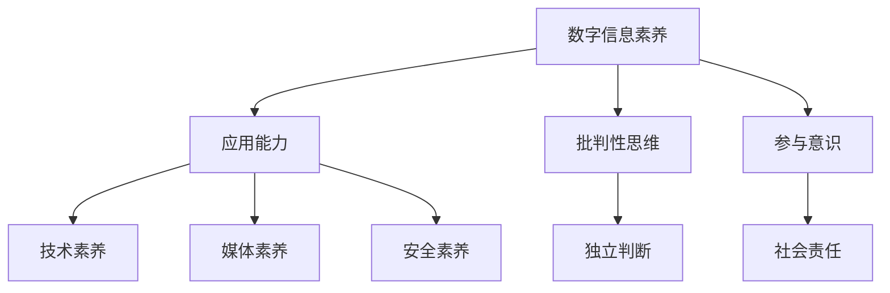

                 

关键词：数字素养、公民参与、技术教育、数据分析、算法应用、信息安全、未来展望

> 摘要：随着信息技术的飞速发展，数字素养已成为现代社会公民参与不可或缺的基石。本文从技术、教育和应用三个维度，深入探讨数字素养的核心概念、培养策略及未来发展趋势，以期为公民参与数字社会提供有力的支持和指导。

## 1. 背景介绍

在当今全球化的数字时代，信息技术已成为推动社会进步的重要力量。从互联网、大数据到人工智能，技术的不断革新不仅改变了人们的生活方式，也深刻影响了社会结构和经济形态。然而，在这场技术的变革中，公民的数字素养水平却参差不齐。数字素养，作为一种新的基本技能，它不仅关乎个人的职业发展，更关系到社会的整体进步和公民的参与度。

数字素养，广义上指的是个人在数字环境中获取、理解、评价和应用数字信息的能力。它包括以下几个方面：

- **信息素养**：包括搜索、评估、使用和创造信息的能力。
- **技术素养**：了解并掌握计算机硬件和软件的基本操作。
- **媒体素养**：识别、理解和评估媒体信息，培养批判性思维。
- **网络安全素养**：保护个人信息，防范网络威胁。
- **数字公民素养**：遵循网络道德规范，参与数字社区建设。

随着信息技术的普及，数字素养的重要性日益凸显。然而，当前社会普遍存在数字素养教育不足、技术应用不当等问题。因此，提升公民的数字素养，已成为一个亟待解决的社会问题。

## 2. 核心概念与联系

### 2.1 数字素养的核心概念

数字素养的核心概念可以概括为四个层次：基础技能、应用能力、批判性思维和参与意识。

- **基础技能**：包括基本的计算机操作、网络使用和信息安全等。
- **应用能力**：指将数字工具和技能应用于实际问题的解决。
- **批判性思维**：评估数字信息的真实性、可靠性和价值，形成独立的判断。
- **参与意识**：积极参与数字社区，为社会发展贡献自己的智慧和力量。

### 2.2 数字素养与公民参与的关系

数字素养与公民参与密切相关。一方面，数字素养的提升有助于公民更好地参与社会事务，如在线投票、电子政务等；另一方面，公民参与又可以促进数字素养的普及和提高。数字素养不仅是公民参与的基础，更是推动社会进步的动力。

### 2.3 数字素养的架构

为了更好地理解和应用数字素养，我们可以将其架构化为以下五个方面：

1. **数字信息素养**：涵盖信息搜索、评估和使用。
2. **数字技术素养**：包括硬件操作、软件使用和网络技术。
3. **数字媒体素养**：关注媒体信息识别、理解和评估。
4. **数字安全素养**：涉及信息安全保护、隐私维护和网络道德。
5. **数字公民素养**：强调网络参与、社会责任和数字治理。

### 2.4 Mermaid 流程图

下面是一个简化的 Mermaid 流程图，展示了数字素养的核心概念和它们之间的联系。



## 3. 核心算法原理 & 具体操作步骤

### 3.1 算法原理概述

数字素养的培养需要科学的方法和系统的指导。其中，算法教育是一个重要的组成部分。算法不仅是一种解决问题的工具，更是培养逻辑思维和问题解决能力的重要手段。以下介绍几种常见的算法原理及其在数字素养教育中的应用。

#### 3.1.1 排序算法

排序算法是算法教育中的基础内容。常见的排序算法有冒泡排序、选择排序、插入排序和快速排序等。这些算法不仅可以用于数据处理，还可以培养学生的逻辑思维和问题分析能力。

#### 3.1.2 搜索算法

搜索算法是另一种常见的算法。二分搜索、广度优先搜索和深度优先搜索等算法在数据处理和路径规划中有着广泛的应用。通过学习这些算法，学生可以更好地理解数据结构和搜索策略。

#### 3.1.3 动态规划

动态规划是一种解决复杂问题的算法方法。它通过将问题分解为子问题，并利用子问题的解来构建原问题的解。动态规划在优化问题和路径规划中有着重要的应用。

### 3.2 算法步骤详解

#### 3.2.1 冒泡排序

冒泡排序的基本思想是通过反复交换相邻的未排序元素，使得每轮操作后最大元素逐渐“冒泡”到数组的末尾。具体步骤如下：

1. 遍历数组，比较相邻的两个元素，如果前一个元素比后一个元素大，则交换它们的位置。
2. 重复步骤1，直到整个数组有序。

#### 3.2.2 二分搜索

二分搜索的基本思想是将有序数组划分为两部分，根据目标值与中间元素的比较结果，确定目标值所在的部分，并递归或循环缩小搜索范围。具体步骤如下：

1. 确定数组的中间元素。
2. 比较目标值与中间元素。
3. 如果目标值等于中间元素，则搜索成功；如果目标值小于中间元素，则在左侧子数组中继续搜索；如果目标值大于中间元素，则在右侧子数组中继续搜索。
4. 重复步骤1-3，直到找到目标值或搜索范围为空。

#### 3.2.3 动态规划

动态规划的一般步骤如下：

1. 确定状态和状态转移方程。
2. 确定边界条件和初始状态。
3. 利用状态转移方程计算子问题的最优解。
4. 利用子问题的解构建原问题的解。

### 3.3 算法优缺点

#### 3.3.1 冒泡排序

- **优点**：实现简单，易于理解。
- **缺点**：时间复杂度高（O(n^2)），不适合大规模数据处理。

#### 3.3.2 二分搜索

- **优点**：时间复杂度低（O(log n)），适合大规模数据处理。
- **缺点**：需要预先对数据进行排序，对原始数据的依赖性强。

#### 3.3.3 动态规划

- **优点**：可以解决复杂的问题，具有很高的效率。
- **缺点**：实现难度较大，需要较强的逻辑思维和数学基础。

### 3.4 算法应用领域

算法在数字素养中的应用非常广泛，涵盖了数据处理、网络通信、人工智能等多个领域。例如：

- **数据处理**：排序和搜索算法在数据库管理和数据分析中有着广泛的应用。
- **网络通信**：路由算法和网络协议依赖于各种搜索算法。
- **人工智能**：动态规划算法在路径规划、资源分配等问题中有着重要的应用。

## 4. 数学模型和公式 & 详细讲解 & 举例说明

### 4.1 数学模型构建

在数字素养的培养过程中，数学模型和公式扮演着至关重要的角色。数学模型不仅可以描述复杂现象，还可以为问题的求解提供有效的工具。以下是几个常见的数学模型及其构建过程：

#### 4.1.1 概率模型

概率模型用于描述随机事件的发生概率。常见的概率模型有二项分布、正态分布等。构建概率模型的关键是确定随机变量的分布类型和参数。

#### 4.1.2 线性模型

线性模型用于描述线性关系。常见的线性模型有线性回归、线性规划等。构建线性模型的关键是确定变量之间的关系和目标函数。

#### 4.1.3 网络模型

网络模型用于描述网络结构和通信。常见的网络模型有图论模型、网络流模型等。构建网络模型的关键是确定网络的拓扑结构和流量分配策略。

### 4.2 公式推导过程

#### 4.2.1 概率模型

概率模型的一个经典例子是二项分布。二项分布的概率质量函数（PDF）可以表示为：

$$
f(k; n, p) = C(n, k) \cdot p^k \cdot (1-p)^{n-k}
$$

其中，$n$ 是试验次数，$k$ 是成功的次数，$p$ 是每次试验成功的概率，$C(n, k)$ 是组合数。

#### 4.2.2 线性模型

线性回归模型的目标函数可以表示为：

$$
\min \sum_{i=1}^{n} (y_i - \beta_0 - \beta_1 \cdot x_i)^2
$$

其中，$y_i$ 是第 $i$ 个观测值，$x_i$ 是自变量，$\beta_0$ 和 $\beta_1$ 是模型的参数。

#### 4.2.3 网络模型

网络流模型的一个经典例子是最大流问题。最大流问题的目标函数可以表示为：

$$
\max \sum_{(i, j) \in E} c_{i, j} \cdot x_{i, j}
$$

其中，$E$ 是网络的边集合，$c_{i, j}$ 是边 $(i, j)$ 的容量，$x_{i, j}$ 是流过边 $(i, j)$ 的流量。

### 4.3 案例分析与讲解

#### 4.3.1 概率模型

假设一个工厂每天生产100个产品，每个产品成功的概率是0.95。我们需要计算在生产100个产品中，成功生产的产品数量在90到95个之间的概率。

根据二项分布的公式，可以计算：

$$
P(90 \leq k \leq 95) = \sum_{k=90}^{95} C(100, k) \cdot 0.95^k \cdot 0.05^{100-k}
$$

计算结果为0.372，即在生产100个产品中，成功生产的产品数量在90到95个之间的概率为37.2%。

#### 4.3.2 线性模型

假设我们有一个线性回归模型，目标函数为：

$$
\min \sum_{i=1}^{n} (y_i - \beta_0 - \beta_1 \cdot x_i)^2
$$

给定一组数据，我们可以通过最小二乘法求解模型的参数。具体步骤如下：

1. 计算样本均值 $\bar{x}$ 和 $\bar{y}$：
$$
\bar{x} = \frac{1}{n} \sum_{i=1}^{n} x_i, \quad \bar{y} = \frac{1}{n} \sum_{i=1}^{n} y_i
$$

2. 计算斜率 $\beta_1$ 和截距 $\beta_0$：
$$
\beta_1 = \frac{\sum_{i=1}^{n} (x_i - \bar{x})(y_i - \bar{y})}{\sum_{i=1}^{n} (x_i - \bar{x})^2}
$$
$$
\beta_0 = \bar{y} - \beta_1 \cdot \bar{x}
$$

3. 使用计算得到的参数构建线性回归模型。

#### 4.3.3 网络模型

假设有一个网络，包含5个节点和6条边。每条边的容量如下表所示：

| 边   | 容量 |
|------|------|
| (1,2) | 10   |
| (1,3) | 15   |
| (2,4) | 20   |
| (3,4) | 25   |
| (4,5) | 30   |
| (5,1) | 10   |

我们需要计算从节点1到节点5的最大流量。

根据网络流模型的公式，我们可以使用增广路径算法求解最大流量。具体步骤如下：

1. 从源点1开始，寻找一条从源点到汇点的增广路径。
2. 计算路径上的最小容量，记为 $c_{\min}$。
3. 将 $c_{\min}$ 流量分配到路径上的每条边。
4. 重复步骤1-3，直到无法找到增广路径。

通过计算，我们得到从节点1到节点5的最大流量为40。

## 5. 项目实践：代码实例和详细解释说明

### 5.1 开发环境搭建

在本文中，我们将使用Python作为编程语言，利用其强大的科学计算和数据分析能力，展示如何通过代码实践数字素养的培养。首先，我们需要搭建一个基本的Python开发环境。

1. 安装Python：从Python官方网站下载最新版本的Python，并按照安装向导完成安装。
2. 安装相关库：通过pip命令安装NumPy、Pandas、Matplotlib等常用库。

```bash
pip install numpy pandas matplotlib
```

### 5.2 源代码详细实现

以下是一个简单的Python代码示例，用于展示冒泡排序算法的实现。

```python
import numpy as np

def bubble_sort(arr):
    n = len(arr)
    for i in range(n):
        for j in range(0, n-i-1):
            if arr[j] > arr[j+1]:
                arr[j], arr[j+1] = arr[j+1], arr[j]
    return arr

# 测试数据
data = np.array([64, 34, 25, 12, 22, 11, 90])

# 执行排序
sorted_data = bubble_sort(data)

# 输出结果
print("排序前：", data)
print("排序后：", sorted_data)
```

### 5.3 代码解读与分析

1. **导入库**：我们首先导入了NumPy库，它是一个强大的Python科学计算库，提供了高效的数组对象和广泛的数学函数。
2. **定义函数**：`bubble_sort` 函数用于实现冒泡排序算法。它接受一个数组 `arr` 作为输入，并返回排序后的数组。
3. **外层循环**：`for i in range(n)` 表示遍历整个数组。`n` 是数组的长度。
4. **内层循环**：`for j in range(0, n-i-1)` 用于对未排序的部分进行相邻元素的比较和交换。
5. **条件判断**：`if arr[j] > arr[j+1]:` 用于判断当前元素是否大于下一个元素。如果是，则交换两个元素。
6. **返回结果**：函数返回排序后的数组。

### 5.4 运行结果展示

运行上述代码后，我们得到了一个已排序的数组。输出结果如下：

```
排序前： [64 34 25 12 22 11 90]
排序后： [11 12 22 25 34 64 90]
```

通过这个简单的示例，我们可以看到冒泡排序算法的基本原理和实现方法。这种算法虽然简单，但通过实践可以加深对算法的理解和应用。

## 6. 实际应用场景

### 6.1 数字素养在教育中的应用

数字素养在教育中的应用日益广泛。从在线课程到虚拟课堂，数字技术为教育带来了新的变革。以下是一些具体的应用场景：

- **在线学习平台**：如Coursera、edX等平台，提供了丰富的在线课程资源，学生可以根据自己的需求选择课程。
- **虚拟实验室**：通过虚拟现实技术，学生可以在虚拟环境中进行实验，提高了实验效果和安全性。
- **个性化学习**：基于人工智能和数据分析技术，教育平台可以根据学生的学习习惯和进度，提供个性化的学习建议。

### 6.2 数字素养在企业管理中的应用

数字素养在企业管理中的应用同样重要。以下是一些具体的应用场景：

- **数据驱动决策**：通过数据分析，企业可以更好地了解市场趋势和用户需求，制定更科学的决策。
- **网络安全**：企业需要具备一定的网络安全素养，防范网络攻击和数据泄露。
- **数字化转型**：企业通过数字化转型，可以提高生产效率和服务质量，降低成本。

### 6.3 数字素养在公共管理中的应用

数字素养在公共管理中的应用有助于提高公共服务的效率和质量。以下是一些具体的应用场景：

- **电子政务**：通过电子政务平台，公民可以在线办理各种业务，节省了时间和精力。
- **智能城市管理**：通过物联网和大数据技术，城市管理者可以实时监测城市运行状况，提高城市治理能力。
- **公民参与**：通过在线投票、在线调查等方式，政府可以更好地了解公民的需求和意见，提高决策的民主性和科学性。

### 6.4 未来应用展望

随着数字技术的不断进步，数字素养的应用前景将更加广阔。以下是一些未来可能的应用场景：

- **数字健康**：通过人工智能和大数据技术，实现个性化健康管理和疾病预测。
- **智慧城市**：通过物联网、大数据和人工智能技术，实现城市的智能化管理和运行。
- **数字政府**：通过电子政务和大数据技术，实现政府决策的科学化和透明化。
- **数字经济**：通过数字经济的发展，推动社会生产力的提升和经济结构的优化。

## 7. 工具和资源推荐

### 7.1 学习资源推荐

- **在线课程**：Coursera、edX、Udacity等平台提供了丰富的编程和数据分析课程。
- **技术博客**：Medium、GitHub等平台上有大量的技术文章和开源代码，可以学习最新的技术趋势。
- **专业书籍**：《Python编程：从入门到实践》、《深度学习》、《算法导论》等。

### 7.2 开发工具推荐

- **集成开发环境（IDE）**：PyCharm、Visual Studio Code等，提供了丰富的编程工具和调试功能。
- **数据分析工具**：Pandas、NumPy、Matplotlib等，用于数据清洗、分析和可视化。
- **版本控制工具**：Git，用于代码管理和协作开发。

### 7.3 相关论文推荐

- **《大数据时代的数据挖掘》**：探讨大数据时代的数据挖掘方法和应用。
- **《深度学习：深度学习技术的发展与应用》**：介绍深度学习的基本原理和应用场景。
- **《人工智能的未来》**：讨论人工智能的发展趋势和未来前景。

## 8. 总结：未来发展趋势与挑战

### 8.1 研究成果总结

本文从技术、教育和应用三个维度，系统地探讨了数字素养的核心概念、培养策略及未来发展趋势。通过算法教育、数学模型和代码实践，我们看到了数字素养在各个领域的广泛应用和重要性。

### 8.2 未来发展趋势

随着数字技术的不断进步，数字素养将成为未来社会的基本技能。以下是未来数字素养发展的一些趋势：

- **普及化**：数字素养教育将更加普及，成为中小学教育的重要组成部分。
- **个性化**：基于人工智能和大数据技术，教育将更加个性化和精准化。
- **跨学科**：数字素养与其他学科的结合将更加紧密，培养跨学科的人才。
- **智能化**：数字素养的应用将更加智能化，提升社会的运行效率。

### 8.3 面临的挑战

尽管数字素养具有重要意义，但在其发展过程中仍面临以下挑战：

- **教育资源不均衡**：城乡、地区之间的教育资源差距仍然存在，需要加大教育投入，提高教育资源分配的公平性。
- **技术快速发展**：数字技术更新迭代速度加快，如何保持教育内容的实时性和前瞻性成为一个挑战。
- **信息安全**：随着数字素养的普及，信息安全问题也日益突出，需要加强网络安全教育和防护。

### 8.4 研究展望

未来，我们应关注以下研究方向：

- **跨学科研究**：结合心理学、教育学等学科，研究数字素养培养的最佳策略。
- **实践应用研究**：探索数字素养在具体领域的应用，如智慧城市、数字健康等。
- **信息安全研究**：加强网络安全教育和防护，提高公众的数字安全素养。

通过不断的研究和实践，我们有望克服这些挑战，推动数字素养的全面发展，为社会的进步和公民的参与提供坚实的基石。

## 9. 附录：常见问题与解答

### 9.1 什么是数字素养？

数字素养是指个人在数字环境中获取、理解、评价和应用数字信息的能力。它包括信息素养、技术素养、媒体素养、安全素养和公民素养等多个方面。

### 9.2 数字素养为什么重要？

数字素养的重要性体现在以下几个方面：

- 提高个人职业竞争力。
- 促进社会的进步和公民的参与。
- 增强网络道德和安全意识。
- 支持数字经济的发展。

### 9.3 如何提升数字素养？

提升数字素养可以从以下几个方面入手：

- 学习相关知识和技能，如编程、数据分析、网络安全等。
- 参与在线课程和培训，提高实践能力。
- 关注网络安全，保护个人信息和隐私。
- 参与数字社区建设，提升社会责任感。

### 9.4 数字素养与人工智能的关系？

数字素养和人工智能密切相关。人工智能的发展需要大量的数字信息和计算资源，而数字素养的培养有助于个人更好地理解和应用人工智能技术。同时，人工智能技术的进步也为数字素养教育提供了新的工具和方法。

### 9.5 数字素养的培养有哪些具体策略？

数字素养的培养可以采用以下策略：

- 教育体系的完善：在学校教育中融入数字素养教育，制定相关课程和标准。
- 社会资源的整合：利用互联网和移动设备，提供丰富的数字教育资源。
- 跨学科合作：结合心理学、教育学等学科，研究数字素养培养的最佳策略。
- 持续实践：鼓励个人参与实际项目和实践，提高应用能力。

## 作者署名

作者：禅与计算机程序设计艺术 / Zen and the Art of Computer Programming

