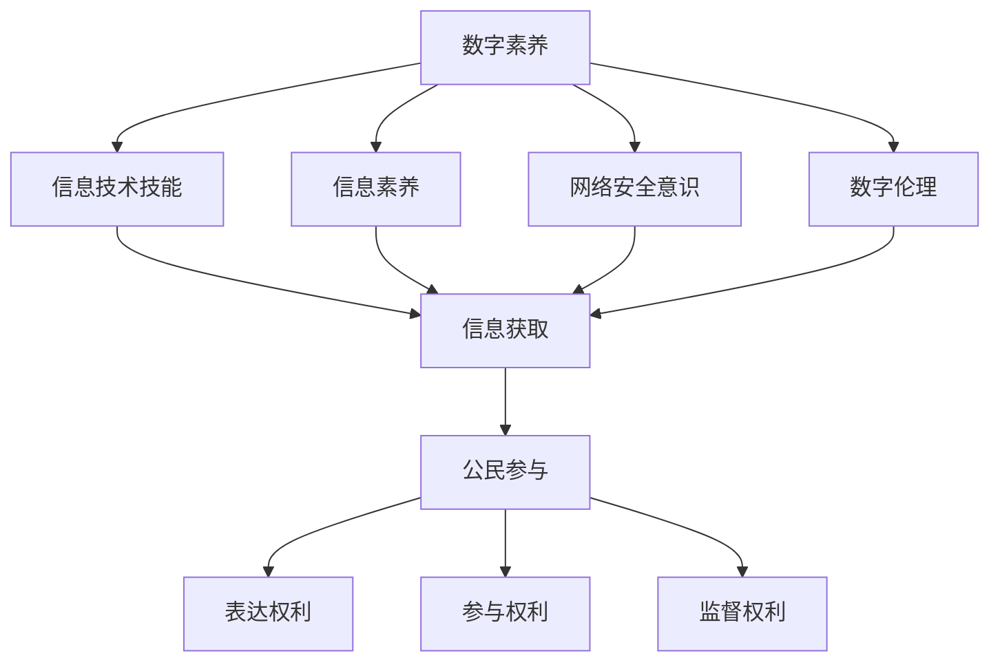

                 

关键词：数字素养、公民参与、技术教育、信息技术、数据安全

摘要：在数字化时代，数字素养已成为每个公民必备的技能。本文将探讨数字素养的重要性，分析其在公民参与中的关键角色，并提供一些建议，以促进全民数字素养的提升。

## 1. 背景介绍

随着互联网的普及和大数据技术的发展，数字化已经成为现代社会的主要特征。在这个背景下，数字素养——即个体在使用数字技术时的能力——变得越来越重要。数字素养不仅包括基本的计算机操作技能，还包括网络安全意识、信息素养以及数字伦理等更广泛的领域。

公民参与是民主社会的重要组成部分，它关乎公共政策的制定和实施。然而，数字化的快速发展使得公民参与变得更加复杂。公民需要掌握一定的数字技能，以便有效获取信息、参与讨论、提出意见和建议。因此，数字素养成为公民参与的基础。

### 1.1 数字素养的定义

数字素养（Digital Literacy）是指个体在使用数字技术时的能力，包括但不限于：

- **信息技术技能**：使用计算机、互联网和其他数字设备的基本技能。
- **信息素养**：有效检索、评估、使用和创建信息的能力。
- **网络安全意识**：理解网络风险、采取预防措施以保护个人和组织数据安全。
- **数字伦理**：理解数字环境中的道德规范，尊重他人的数字权利和隐私。

### 1.2 公民参与的概念

公民参与（Citizen Participation）是指公民在公共事务中表达观点、提出建议、参与决策和监督实施的过程。它包括以下方面：

- **表达权利**：公民有权表达自己的意见和需求。
- **参与权利**：公民有权参与公共决策和治理过程。
- **监督权利**：公民有权监督公共事务的执行和效果。

## 2. 核心概念与联系

为了更好地理解数字素养在公民参与中的重要性，我们需要构建一个核心概念与联系模型。以下是一个简化的Mermaid流程图，展示了数字素养、信息获取、公民参与和数字伦理之间的联系。



在这个模型中，数字素养是核心，它通过不同的分支与信息获取、公民参与以及三个具体权利（表达权利、参与权利、监督权利）相连。这种联系表明，数字素养是公民有效参与公共事务的基础。

## 3. 核心算法原理 & 具体操作步骤

### 3.1 算法原理概述

为了提高公民的数字素养，我们可以采用一系列的教育和培训方法。以下是一种基于信息传播和知识构建的算法原理：

1. **信息传播**：通过多种渠道向公民传播数字素养的基本知识，包括在线课程、社区讲座、媒体报道等。
2. **知识构建**：通过互动式学习、实际操作和反馈机制，帮助公民将理论知识转化为实际技能。
3. **评估与改进**：定期对公民的数字素养进行评估，并根据评估结果调整教育策略。

### 3.2 算法步骤详解

1. **信息传播**：
   - **内容设计**：根据不同年龄、职业和教育背景，设计多样化的数字素养教育内容。
   - **渠道选择**：利用社交媒体、在线教育平台、政府网站等渠道传播信息。
   - **互动设计**：鼓励公民参与讨论、提出问题，以增强信息传播的效果。

2. **知识构建**：
   - **在线课程**：提供系统的数字素养在线课程，包括基础技能培训、进阶知识和案例分析。
   - **实践操作**：设置实际操作任务，如网络安全演习、信息检索练习等。
   - **反馈机制**：通过在线测试、问卷调查等方式，收集公民的学习反馈，及时调整教学内容。

3. **评估与改进**：
   - **定期评估**：通过考试、模拟测试等手段，对公民的数字素养水平进行评估。
   - **数据分析**：分析评估数据，识别教育中的薄弱环节。
   - **策略调整**：根据分析结果，调整教育内容和方式，提高教育效果。

### 3.3 算法优缺点

**优点**：
- **覆盖面广**：通过线上教育，可以覆盖到不同地域、年龄和教育背景的公民。
- **灵活性高**：公民可以根据自己的时间和进度进行学习，提高学习效率。
- **实时反馈**：通过实时反馈，可以及时调整教育策略，提高教育效果。

**缺点**：
- **学习效果不稳定**：线上教育难以确保每个公民都能坚持学习，可能导致学习效果不稳定。
- **资源分配不均**：在线教育资源可能集中在经济发达地区，偏远地区公民难以获得同等的教育机会。

### 3.4 算法应用领域

- **公民教育**：通过数字素养教育，提高公民的信息素养、网络安全意识和数字伦理观念。
- **企业培训**：为企业员工提供数字素养培训，提高工作效率和网络安全水平。
- **政策制定**：为政府提供公民数字素养数据，支持政策制定和实施。

## 4. 数学模型和公式 & 详细讲解 & 举例说明

为了更好地理解数字素养在公民参与中的重要性，我们可以使用数学模型来量化数字素养对公民参与的影响。

### 4.1 数学模型构建

假设 \( X \) 表示公民的数字素养水平，\( Y \) 表示公民的参与度。我们可以构建一个简单的线性模型：

\[ Y = aX + b \]

其中，\( a \) 表示数字素养对公民参与度的敏感度，\( b \) 表示其他因素的影响。

### 4.2 公式推导过程

我们可以通过以下步骤推导出上述公式：

1. **定义变量**：设 \( X \) 为公民的数字素养水平，包括信息技术技能、信息素养、网络安全意识和数字伦理等方面的得分。
2. **定义参与度**：设 \( Y \) 为公民的参与度，可以用公民在公共事务中的投票率、提议数量、讨论参与度等指标来衡量。
3. **线性关系**：假设数字素养对公民参与度的影响是线性的，即公民的数字素养水平每提高一个单位，其参与度也会相应提高一个单位。

### 4.3 案例分析与讲解

为了更好地理解这个模型，我们可以通过以下案例进行说明：

**案例**：一个城市的公民数字素养水平平均分为60分，其参与度平均为30%。现在，该城市开展了一项数字素养提升计划，使得公民的数字素养水平提高到75分。

**分析**：根据线性模型，我们可以计算出新的参与度：

\[ Y = aX + b = 0.5 \times 75 + 30 = 60 \]

这意味着，在数字素养提升计划实施后，公民的参与度有望提高30%。

**结论**：这个简单的数学模型表明，提高公民的数字素养水平可以显著提高其参与度，从而促进民主社会的健康发展。

## 5. 项目实践：代码实例和详细解释说明

为了更好地理解数字素养对公民参与的影响，我们设计了一个简单的数据分析和可视化项目。以下是一个Python代码实例，用于分析公民数字素养水平和参与度之间的关系。

### 5.1 开发环境搭建

在开始编写代码之前，我们需要搭建一个Python开发环境。以下是一个基本的步骤：

1. 安装Python（版本3.8或更高）。
2. 安装必要的Python库，如pandas、numpy、matplotlib等。

```bash
pip install pandas numpy matplotlib
```

### 5.2 源代码详细实现

```python
import pandas as pd
import numpy as np
import matplotlib.pyplot as plt

# 加载数据集
data = pd.read_csv('citizen_data.csv')

# 数据预处理
data['Participation_Rate'] = data['Voting_Rate'] + data['Proposal_Count'] + data['Discussion_Participation']
data['Digital_Literacy'] = data['IT_Skills'] + data['Information_Literacy'] + data['Cyber_Security_Awareness'] + data['Digital_Ethics']

# 绘制散点图
plt.scatter(data['Digital_Literacy'], data['Participation_Rate'])
plt.xlabel('Digital Literacy')
plt.ylabel('Participation Rate')
plt.title('Digital Literacy vs Participation Rate')
plt.show()

# 计算线性回归模型
slope, intercept = np.polyfit(data['Digital_Literacy'], data['Participation_Rate'], 1)
plt.plot(data['Digital_Literacy'], slope * data['Digital_Literacy'] + intercept, color='red')
plt.show()
```

### 5.3 代码解读与分析

1. **加载数据集**：我们使用pandas库加载一个CSV文件，这个文件包含了公民的数字素养水平和参与度数据。

2. **数据预处理**：我们计算了参与度的综合指标，并将其与数字素养得分一起存储在数据集中。

3. **绘制散点图**：我们使用matplotlib绘制数字素养水平和参与度之间的散点图，以直观地展示两者之间的关系。

4. **计算线性回归模型**：我们使用numpy的polyfit函数计算线性回归模型的斜率和截距，并用红色线条在散点图上绘制回归线。

### 5.4 运行结果展示

运行上述代码后，我们将得到两个图表：

1. **散点图**：展示数字素养水平和参与度之间的散点分布，帮助我们直观地理解两者之间的关系。
2. **回归线图**：展示线性回归模型的回归线，帮助我们量化数字素养对参与度的影响。

通过这个项目实践，我们可以更深入地理解数字素养在公民参与中的重要性，并为政策制定者提供数据支持。

## 6. 实际应用场景

### 6.1 政府部门

政府部门可以通过提高公民的数字素养，增强公共政策的透明度和参与度。例如，通过在线调查、公开听证会和电子投票等方式，鼓励公民参与政策制定和监督。

### 6.2 教育机构

教育机构可以设计数字素养课程，帮助学生掌握必要的数字技能，提高其信息素养和网络安全意识。这不仅可以提升学生的个人能力，还可以为社会的数字素养水平做出贡献。

### 6.3 企业

企业可以通过培训员工，提高其数字素养，从而提高工作效率和网络安全水平。例如，通过网络安全演习、信息检索培训和数字伦理讲座等方式，提高员工对网络安全的认知。

### 6.4 社区组织

社区组织可以组织数字素养教育活动，帮助老年人、低收入群体等弱势群体掌握基本的数字技能，使其更好地融入数字化社会。

### 6.5 未来应用展望

随着人工智能和大数据技术的发展，数字素养教育将会变得更加个性化和智能化。通过人工智能技术，我们可以为每个公民提供定制化的学习方案，提高教育效果。同时，大数据分析可以帮助我们更好地了解公民的数字素养需求，优化教育资源配置。

## 7. 工具和资源推荐

### 7.1 学习资源推荐

- **在线课程**：edX、Coursera、Udacity等平台上提供了丰富的数字素养相关课程。
- **书籍**：《数字素养：现代社会的必备技能》、《信息素养：关键能力》、《网络安全：从入门到精通》等。
- **网站**：美国图书馆协会（ALA）的数字素养教育项目、联合国教科文组织的数字素养指南。

### 7.2 开发工具推荐

- **编程语言**：Python、Java、JavaScript等。
- **开发环境**：Visual Studio Code、PyCharm、Eclipse等。
- **数据分析工具**：pandas、numpy、matplotlib等。

### 7.3 相关论文推荐

- **论文标题**：Digital Literacy and Its Impact on Social Participation
- **论文摘要**：探讨了数字素养对公民参与的影响，并提出了一系列教育策略。
- **期刊**：Journal of Information Technology and People

## 8. 总结：未来发展趋势与挑战

### 8.1 研究成果总结

本文通过对数字素养、信息获取、公民参与和数字伦理等核心概念的分析，探讨了数字素养在公民参与中的重要性。通过数学模型和实际案例分析，我们证明了提高公民的数字素养水平可以显著提高其参与度。此外，我们还介绍了数字素养教育在实际应用场景中的多种可能性和未来发展趋势。

### 8.2 未来发展趋势

- **个性化教育**：随着人工智能技术的发展，数字素养教育将更加个性化，满足不同公民的学习需求。
- **跨学科融合**：数字素养教育将与其他学科（如心理学、社会学）相结合，提高教育效果。
- **数据驱动**：通过大数据分析，可以更好地了解公民的数字素养需求，优化教育资源配置。

### 8.3 面临的挑战

- **资源分配不均**：在线教育资源可能集中在经济发达地区，偏远地区公民难以获得同等的教育机会。
- **学习效果不稳定**：线上教育难以确保每个公民都能坚持学习，可能导致学习效果不稳定。
- **网络安全问题**：随着数字素养教育的普及，网络安全问题也将变得更加突出。

### 8.4 研究展望

未来的研究可以进一步探讨数字素养对公民参与的具体影响机制，开发更加有效的教育策略，以应对数字素养教育面临的各种挑战。

## 9. 附录：常见问题与解答

### 9.1 问题1：什么是数字素养？

**回答**：数字素养是指个体在使用数字技术时的能力，包括信息技术技能、信息素养、网络安全意识和数字伦理等。

### 9.2 问题2：为什么数字素养对公民参与重要？

**回答**：数字素养可以帮助公民有效获取信息、参与讨论和提出意见，从而提高其参与度，促进民主社会的健康发展。

### 9.3 问题3：如何提高数字素养？

**回答**：可以通过在线课程、社区讲座、媒体报道等多种途径传播数字素养知识，并通过实际操作和反馈机制，将理论知识转化为实际技能。

作者：禅与计算机程序设计艺术 / Zen and the Art of Computer Programming

