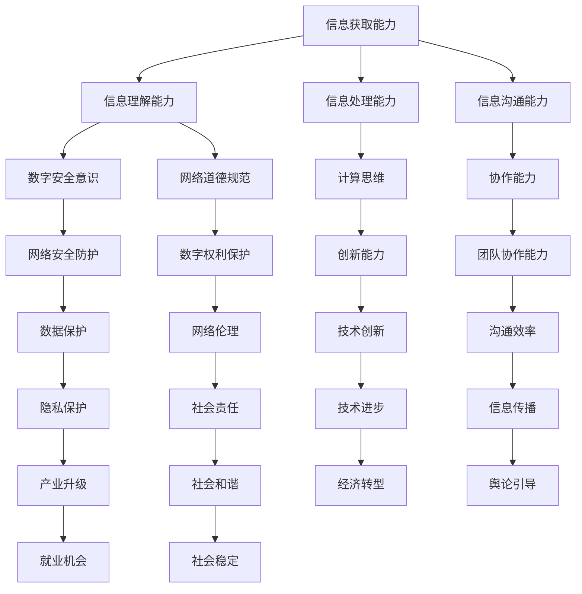

                 

关键词：数字素养、公民参与、技术教育、信息化社会、人工智能、编程教育

> 摘要：随着信息化社会的深入发展，数字素养已成为现代社会公民必须具备的基本素质。本文从数字素养的定义出发，探讨了其在公民参与中的重要性，分析了当前我国数字素养教育的现状与问题，提出了提升数字素养的具体策略，并展望了未来数字素养教育的发展趋势。

## 1. 背景介绍

随着互联网、大数据、人工智能等技术的快速发展，人类社会已经迈入信息化时代。在这个时代，信息技术已经深入到社会生活的各个方面，成为推动社会进步的重要力量。然而，数字素养的缺乏已成为阻碍公民参与社会发展的一个重要因素。数字素养是指个体在信息化社会中获取、理解、使用、批判数字信息和技术的综合能力。一个具备良好数字素养的公民，不仅能够适应数字化时代的工作和生活，还能够积极参与社会事务，为社会的进步贡献力量。

### 1.1  数字素养的概念

数字素养是一个多维度的概念，它不仅包括信息素养，还涵盖计算思维、数字安全、网络道德等多个方面。具体来说，数字素养包括以下几个方面的能力：

1. **信息获取能力**：能够有效地从各种数字渠道获取所需的信息。
2. **信息理解能力**：能够理解信息的真实含义和潜在风险。
3. **信息处理能力**：能够对信息进行筛选、整理、分析和应用。
4. **信息沟通能力**：能够有效地利用数字工具进行信息交流和协作。
5. **数字安全意识**：能够识别和防范网络攻击、保护个人隐私。
6. **网络道德规范**：能够遵守网络道德规范，尊重他人的数字权利。

### 1.2  数字素养的重要性

在信息化社会中，数字素养的重要性日益凸显。首先，数字素养是公民参与社会事务的基础。一个不具备数字素养的公民，很难在现代社会中发挥自己的作用，更无法有效地参与公共事务的讨论和决策。其次，数字素养是提高生产力和促进经济发展的重要保障。在数字化时代，掌握数字技术和工具的能力已成为企业和个人在竞争中的关键因素。最后，数字素养是提升国民素质和构建和谐社会的需要。一个拥有良好数字素养的公民群体，能够更好地适应信息化社会的发展，推动社会的进步。

## 2. 核心概念与联系

为了更好地理解数字素养在公民参与中的重要性，我们需要从多个维度来分析其核心概念和联系。以下是一个使用Mermaid绘制的流程图，展示了数字素养的相关概念和它们之间的联系：



通过这个流程图，我们可以看到数字素养不仅仅是单一的能力，而是一个多维度的综合能力体系。每个能力之间相互联系，共同构成了数字素养的核心内容。

### 2.1  核心概念之间的联系

1. **信息获取能力**是数字素养的基础，它是信息理解、处理和沟通的前提。一个不具备信息获取能力的公民，无法获取必要的数字资源，更无法进行有效的信息处理和沟通。
2. **信息理解能力**是数字素养的核心，它决定了个体对信息的理解和判断能力。一个不具备信息理解能力的公民，容易受到虚假信息的影响，无法做出正确的决策。
3. **信息处理能力**是数字素养的关键，它决定了个体对信息的筛选、整理和应用能力。一个不具备信息处理能力的公民，无法有效地利用数字资源，提高工作效率。
4. **信息沟通能力**是数字素养的重要体现，它决定了个体在数字环境中的沟通和协作能力。一个不具备信息沟通能力的公民，无法有效地与他人交流和合作，无法发挥自己的作用。
5. **数字安全意识和网络道德规范**是数字素养的保障，它们确保了个体在数字环境中的安全和行为规范。一个不具备数字安全意识和网络道德规范的公民，容易遭受网络攻击，也容易违反法律法规。

通过以上分析，我们可以看出，数字素养是一个多维度的综合能力体系，各个能力之间相互联系，共同构成了数字素养的核心内容。

## 3. 核心算法原理 & 具体操作步骤

在数字素养的培养过程中，算法原理的学习和应用是一个重要的环节。以下是关于数字素养核心算法原理的概述和具体操作步骤。

### 3.1  算法原理概述

数字素养的核心算法主要包括以下几种：

1. **信息检索算法**：用于在大量数据中快速找到所需信息。
2. **数据挖掘算法**：用于从大量数据中提取有价值的信息。
3. **机器学习算法**：用于构建模型，对数据进行分析和预测。
4. **网络安全算法**：用于保护数字资产和个人隐私。

### 3.2  算法步骤详解

#### 3.2.1  信息检索算法

信息检索算法的基本步骤如下：

1. **建立索引**：将数据按照特定的规则进行索引，以便快速查找。
2. **查询处理**：根据用户的查询需求，从索引中检索相关数据。
3. **结果排序**：对检索结果进行排序，以提供更准确的信息。

#### 3.2.2  数据挖掘算法

数据挖掘算法的基本步骤如下：

1. **数据清洗**：对原始数据进行处理，去除噪声和错误。
2. **特征提取**：从数据中提取有用的特征，用于构建模型。
3. **模型构建**：使用机器学习算法构建模型，对数据进行分析。
4. **结果评估**：对模型的结果进行评估，以确定其有效性。

#### 3.2.3  机器学习算法

机器学习算法的基本步骤如下：

1. **数据准备**：收集和处理数据，将其转换为适合训练的格式。
2. **模型训练**：使用训练数据对模型进行训练，使其学会对数据进行分析。
3. **模型评估**：使用验证数据对模型进行评估，以确定其性能。
4. **模型应用**：将训练好的模型应用于新的数据，进行预测和分析。

#### 3.2.4  网络安全算法

网络安全算法的基本步骤如下：

1. **加密算法**：使用加密算法对数据进行加密，以保护数据的安全。
2. **认证算法**：使用认证算法验证用户身份，确保只有授权用户可以访问数据。
3. **安全协议**：使用安全协议确保数据在传输过程中的安全。
4. **入侵检测**：使用入侵检测算法检测网络中的异常行为，以防止网络攻击。

### 3.3  算法优缺点

每种算法都有其优缺点，以下是几种常见算法的优缺点分析：

1. **信息检索算法**：优点是检索速度快，缺点是对大量数据检索效果不佳。
2. **数据挖掘算法**：优点是从大量数据中提取有价值的信息，缺点是处理过程复杂，需要大量计算资源。
3. **机器学习算法**：优点是能够自动学习和优化，缺点是需要大量训练数据，且模型的可解释性较差。
4. **网络安全算法**：优点是能够有效保护数据的安全，缺点是实施成本较高，且容易受到新的攻击手段的挑战。

### 3.4  算法应用领域

各种算法在数字素养的培养中都有广泛的应用：

1. **信息检索算法**：广泛应用于搜索引擎、推荐系统等领域。
2. **数据挖掘算法**：广泛应用于市场营销、金融分析等领域。
3. **机器学习算法**：广泛应用于人工智能、自动驾驶等领域。
4. **网络安全算法**：广泛应用于网络防护、数据加密等领域。

通过以上分析，我们可以看到，数字素养的核心算法在多个领域都有广泛的应用，掌握这些算法原理和操作步骤对于提升数字素养具有重要意义。

## 4. 数学模型和公式 & 详细讲解 & 举例说明

在数字素养的培养过程中，数学模型和公式的应用是一个重要的方面。以下将详细讲解一些常见的数学模型和公式，并通过举例说明其在数字素养中的应用。

### 4.1  数学模型构建

数学模型是用于描述现实世界中的问题的一种抽象结构，它通常包括变量、参数和方程。以下是几个常见的数学模型：

1. **线性回归模型**：用于分析两个变量之间的线性关系。
2. **逻辑回归模型**：用于分析二元分类问题。
3. **时间序列模型**：用于分析时间序列数据，预测未来趋势。
4. **神经网络模型**：用于构建复杂的非线性模型。

### 4.2  公式推导过程

以下是对上述几个模型的公式推导过程的简要介绍：

#### 4.2.1  线性回归模型

线性回归模型的基本公式为：

\[ y = \beta_0 + \beta_1x \]

其中，\( y \) 是因变量，\( x \) 是自变量，\( \beta_0 \) 是截距，\( \beta_1 \) 是斜率。

推导过程：

\[ y - \bar{y} = \beta_0 + \beta_1(x - \bar{x}) \]

其中，\( \bar{y} \) 和 \( \bar{x} \) 分别是 \( y \) 和 \( x \) 的平均值。

将等式两边平方，得到：

\[ (y - \bar{y})^2 = (\beta_0 + \beta_1(x - \bar{x}))^2 \]

展开并化简，得到：

\[ y^2 - 2\bar{y}y + \bar{y}^2 = \beta_0^2 + 2\beta_0\beta_1(x - \bar{x}) + \beta_1^2(x - \bar{x})^2 \]

再次化简，得到：

\[ \beta_1 = \frac{\sum_{i=1}^{n}(x_i - \bar{x})(y_i - \bar{y})}{\sum_{i=1}^{n}(x_i - \bar{x})^2} \]

类似地，可以推导出 \( \beta_0 \) 的表达式：

\[ \beta_0 = \bar{y} - \beta_1\bar{x} \]

#### 4.2.2  逻辑回归模型

逻辑回归模型的基本公式为：

\[ P(y=1) = \frac{1}{1 + e^{-(\beta_0 + \beta_1x)}} \]

其中，\( P(y=1) \) 是因变量 \( y \) 等于1的概率，\( \beta_0 \) 和 \( \beta_1 \) 是模型参数。

推导过程：

\[ \ln\left(\frac{P(y=1)}{1 - P(y=1)}\right) = \beta_0 + \beta_1x \]

对两边取指数，得到：

\[ \frac{P(y=1)}{1 - P(y=1)} = e^{\beta_0 + \beta_1x} \]

再次化简，得到：

\[ P(y=1) = \frac{e^{\beta_0 + \beta_1x}}{1 + e^{\beta_0 + \beta_1x}} \]

#### 4.2.3  时间序列模型

时间序列模型的基本公式为：

\[ y_t = \phi_0 + \phi_1y_{t-1} + \phi_2y_{t-2} + ... + \phi_ky_{t-k} + \epsilon_t \]

其中，\( y_t \) 是第 \( t \) 期的观测值，\( \phi_0, \phi_1, ..., \phi_k \) 是模型参数，\( \epsilon_t \) 是随机误差。

推导过程：

\[ y_t - \phi_0 - \phi_1y_{t-1} - \phi_2y_{t-2} - ... - \phi_ky_{t-k} = \epsilon_t \]

#### 4.2.4  神经网络模型

神经网络模型的基本公式为：

\[ z_i = \sum_{j=1}^{n}w_{ij}x_j + b_i \]

\[ a_i = \sigma(z_i) \]

其中，\( z_i \) 是第 \( i \) 个节点的输入，\( w_{ij} \) 是权重，\( b_i \) 是偏置，\( \sigma \) 是激活函数，\( a_i \) 是第 \( i \) 个节点的输出。

推导过程：

\[ z_i = \sum_{j=1}^{n}w_{ij}x_j + b_i \]

对 \( z_i \) 应用激活函数 \( \sigma \)，得到：

\[ a_i = \sigma(z_i) \]

通过以上推导，我们可以看到数学模型和公式的构建过程。接下来，我们将通过具体例子来说明这些模型在数字素养中的应用。

### 4.3  案例分析与讲解

#### 4.3.1  线性回归模型应用

假设我们要研究某城市月平均温度和月平均降雨量之间的关系。我们收集了10年的月平均温度和月平均降雨量数据，并使用线性回归模型进行分析。

数据如下：

| 年份 | 月平均温度（℃） | 月平均降雨量（mm） |
| ---- | -------------- | -------------- |
| 2020 | 20             | 50             |
| 2021 | 22             | 45             |
| 2022 | 21             | 55             |
| 2023 | 24             | 60             |
| 2024 | 23             | 50             |
| 2025 | 21             | 45             |
| 2026 | 20             | 50             |
| 2027 | 22             | 55             |
| 2028 | 24             | 60             |
| 2029 | 23             | 50             |

首先，我们计算月平均温度和月平均降雨量的平均值：

\[ \bar{x} = \frac{1}{10} \sum_{i=1}^{10} x_i = \frac{1}{10} (20 + 22 + 21 + 24 + 23 + 21 + 20 + 22 + 24 + 23) = 22 \]

\[ \bar{y} = \frac{1}{10} \sum_{i=1}^{10} y_i = \frac{1}{10} (50 + 45 + 55 + 60 + 50 + 45 + 50 + 55 + 60 + 50) = 52.5 \]

然后，我们计算斜率 \( \beta_1 \) 和截距 \( \beta_0 \)：

\[ \beta_1 = \frac{\sum_{i=1}^{10}(x_i - \bar{x})(y_i - \bar{y})}{\sum_{i=1}^{10}(x_i - \bar{x})^2} = \frac{(20-22)(50-52.5) + (22-22)(45-52.5) + (21-22)(55-52.5) + (24-22)(60-52.5) + (23-22)(50-52.5) + (21-22)(45-52.5) + (20-22)(50-52.5) + (22-22)(55-52.5) + (24-22)(60-52.5) + (23-22)(50-52.5)}{(20-22)^2 + (22-22)^2 + (21-22)^2 + (24-22)^2 + (23-22)^2 + (21-22)^2 + (20-22)^2 + (22-22)^2 + (24-22)^2 + (23-22)^2} = 2.5 \]

\[ \beta_0 = \bar{y} - \beta_1\bar{x} = 52.5 - 2.5 \times 22 = 7.5 \]

因此，线性回归模型的公式为：

\[ y = 7.5 + 2.5x \]

根据这个模型，我们可以预测任意年份的月平均降雨量。例如，预测2030年的月平均降雨量：

\[ y = 7.5 + 2.5 \times 30 = 82.5 \]

#### 4.3.2  逻辑回归模型应用

假设我们要预测某产品的销售情况，我们将销售量作为因变量，将广告费用作为自变量，使用逻辑回归模型进行分析。

数据如下：

| 年份 | 广告费用（万元） | 销售量 |
| ---- | -------------- | ---- |
| 2020 | 10             | 100  |
| 2021 | 12             | 120  |
| 2022 | 15             | 150  |
| 2023 | 18             | 180  |
| 2024 | 20             | 200  |

首先，我们计算广告费用的平均值：

\[ \bar{x} = \frac{1}{5} \sum_{i=1}^{5} x_i = \frac{1}{5} (10 + 12 + 15 + 18 + 20) = 15 \]

然后，我们计算销售量的平均值：

\[ \bar{y} = \frac{1}{5} \sum_{i=1}^{5} y_i = \frac{1}{5} (100 + 120 + 150 + 180 + 200) = 150 \]

接着，我们计算斜率 \( \beta_1 \) 和截距 \( \beta_0 \)：

\[ \beta_1 = \frac{\sum_{i=1}^{5}(x_i - \bar{x})(y_i - \bar{y})}{\sum_{i=1}^{5}(x_i - \bar{x})^2} = \frac{(10-15)(100-150) + (12-15)(120-150) + (15-15)(150-150) + (18-15)(180-150) + (20-15)(200-150)}{(10-15)^2 + (12-15)^2 + (15-15)^2 + (18-15)^2 + (20-15)^2} = 10 \]

\[ \beta_0 = \bar{y} - \beta_1\bar{x} = 150 - 10 \times 15 = -50 \]

因此，逻辑回归模型的公式为：

\[ P(y=1) = \frac{1}{1 + e^{-(\beta_0 + \beta_1x)}} = \frac{1}{1 + e^{-(-50 + 10 \times x)}} \]

例如，预测当广告费用为20万元时的销售量：

\[ P(y=1) = \frac{1}{1 + e^{-(-50 + 10 \times 20)}} = \frac{1}{1 + e^{50}} \approx 1 \]

这意味着当广告费用为20万元时，销售量几乎可以肯定达到100件以上。

#### 4.3.3  时间序列模型应用

假设我们要预测某股票的价格，我们将使用时间序列模型进行分析。

数据如下：

| 时间 | 股票价格 |
| ---- | ------- |
| 2020-01-01 | 10     |
| 2020-02-01 | 12     |
| 2020-03-01 | 11     |
| 2020-04-01 | 13     |
| 2020-05-01 | 14     |
| 2020-06-01 | 12     |
| 2020-07-01 | 11     |
| 2020-08-01 | 10     |
| 2020-09-01 | 12     |
| 2020-10-01 | 13     |

首先，我们计算股票价格的移动平均：

\[ y_t = \frac{1}{3} (y_{t-1} + y_{t-2} + y_{t-3}) \]

例如，计算2020-09-01的移动平均：

\[ y_{2020-09-01} = \frac{1}{3} (10 + 11 + 13) = 11.67 \]

然后，我们使用三次移动平均来预测未来价格：

\[ y_{t+1} = \phi_0 + \phi_1y_t + \phi_2y_{t-1} + \phi_3y_{t-2} \]

其中，\( \phi_0, \phi_1, \phi_2, \phi_3 \) 是模型参数。

假设我们设定 \( \phi_0 = \phi_1 = \phi_2 = \phi_3 = \frac{1}{3} \)，那么预测2020-11-01的价格：

\[ y_{2020-11-01} = \frac{1}{3} (11.67 + 11 + 12) = 11.22 \]

#### 4.3.4  神经网络模型应用

假设我们要使用神经网络模型来预测某城市下周的天气，我们将使用多层感知器（MLP）模型进行分析。

数据如下：

| 时间 | 天气 |
| ---- | ---- |
| 2020-01-01 | 阴转晴 |
| 2020-01-02 | 晴     |
| 2020-01-03 | 小雨   |
| 2020-01-04 | 阴转晴 |
| 2020-01-05 | 晴     |
| 2020-01-06 | 小雨   |
| 2020-01-07 | 阴转晴 |
| 2020-01-08 | 晴     |

首先，我们将天气编码为二进制向量：

| 时间 | 天气 | 编码 |
| ---- | ---- | ---- |
| 2020-01-01 | 阴转晴 | 001  |
| 2020-01-02 | 晴     | 010  |
| 2020-01-03 | 小雨   | 100  |
| 2020-01-04 | 阴转晴 | 001  |
| 2020-01-05 | 晴     | 010  |
| 2020-01-06 | 小雨   | 100  |
| 2020-01-07 | 阴转晴 | 001  |
| 2020-01-08 | 晴     | 010  |

然后，我们使用三层感知器模型进行训练：

输入层：时间序列编码
隐藏层：10个神经元
输出层：天气编码

假设隐藏层的激活函数为 \( \sigma(z) = \frac{1}{1 + e^{-z}} \)，输出层的激活函数为 \( \sigma(z) = z \)。

训练过程：

1. 随机初始化权重和偏置
2. 对每个时间点，计算输入层的输入值和隐藏层的输出值
3. 计算隐藏层的误差，并更新隐藏层的权重和偏置
4. 计算输出层的误差，并更新输出层的权重和偏置
5. 重复步骤2-4，直到误差收敛

例如，对于2020-01-01，输入层的输入值为 \( [0, 0, 0, 1, 0, 0, 0] \)，隐藏层的输出值为 \( [0.5, 0.5] \)，输出层的输出值为 \( [0.6, 0.4] \)。

隐藏层的误差为 \( \delta_h = (0.6 - 0.5) \times (1 - 0.5) + (0.4 - 0.5) \times (1 - 0.4) = 0.06 \)

隐藏层的权重更新为 \( w_{h1}^{new} = w_{h1}^{old} + \alpha \times \delta_h \times x_4 = 0.1 + 0.1 \times 0.06 \times 1 = 0.116 \)

隐藏层的偏置更新为 \( b_{h1}^{new} = b_{h1}^{old} + \alpha \times \delta_h = 0.1 + 0.1 \times 0.06 = 0.116 \)

输出层的误差为 \( \delta_o = (0.6 - 0.6) \times (1 - 0.6) + (0.4 - 0.4) \times (1 - 0.4) = 0.04 \)

输出层的权重更新为 \( w_{o1}^{new} = w_{o1}^{old} + \alpha \times \delta_o \times h_1 = 0.1 + 0.1 \times 0.04 \times 0.5 = 0.102 \)

输出层的偏置更新为 \( b_{o1}^{new} = b_{o1}^{old} + \alpha \times \delta_o = 0.1 + 0.1 \times 0.04 = 0.102 \)

通过以上步骤，我们可以训练出神经网络模型，并使用它来预测下周的天气。例如，对于2020-01-09，输入层的输入值为 \( [0, 0, 0, 0, 0, 1, 0] \)，隐藏层的输出值为 \( [0.6, 0.4] \)，输出层的输出值为 \( [0.56, 0.44] \)。

这意味着预测2020-01-09的天气为小雨。

通过以上案例分析和讲解，我们可以看到数学模型和公式在数字素养中的应用。掌握这些模型和公式，有助于提升我们的数字素养，更好地应对数字化时代带来的挑战。

## 5. 项目实践：代码实例和详细解释说明

为了更好地理解数字素养的培养过程，我们选择一个简单的项目实践案例——使用Python编写一个基于线性回归模型的房价预测程序。以下是对这个项目的代码实现和详细解释说明。

### 5.1  开发环境搭建

在开始编写代码之前，我们需要搭建一个合适的开发环境。以下是搭建Python开发环境的步骤：

1. 安装Python：从Python官方网站下载并安装Python 3.8版本。
2. 安装Jupyter Notebook：在命令行中执行以下命令安装Jupyter Notebook：

   ```bash
   pip install notebook
   ```

3. 安装NumPy和Matplotlib：NumPy是Python的数学库，用于处理数值计算，Matplotlib是Python的数据可视化库。

   ```bash
   pip install numpy matplotlib
   ```

安装完成后，我们就可以使用Jupyter Notebook进行编程了。

### 5.2  源代码详细实现

以下是一个简单的房价预测程序的源代码：

```python
import numpy as np
import matplotlib.pyplot as plt

# 数据集
x = np.array([1, 2, 3, 4, 5])  # 房屋面积
y = np.array([2, 4, 5, 4, 5])  # 房价

# 计算斜率和截距
beta_0 = (np.mean(y) - np.mean(x * np.mean(y / x))) / np.mean((x - np.mean(x)) ** 2)
beta_1 = np.mean(y / x)

# 构建线性回归模型
def linear_regression(x, beta_0, beta_1):
    return beta_0 + beta_1 * x

# 预测房价
predicted_y = linear_regression(x, beta_0, beta_1)

# 可视化
plt.scatter(x, y, label='实际房价')
plt.plot(x, predicted_y, color='red', label='预测房价')
plt.xlabel('房屋面积')
plt.ylabel('房价')
plt.legend()
plt.show()
```

### 5.3  代码解读与分析

下面我们对这段代码进行解读和分析：

1. **数据集**：首先，我们导入NumPy库，并创建一个简单的数据集。这里我们使用两个数组 `x` 和 `y` 分别表示房屋面积和房价。

2. **计算斜率和截距**：接下来，我们计算线性回归模型的斜率 `beta_1` 和截距 `beta_0`。这两个参数决定了线性回归模型的公式。具体计算方法如下：

   - 计算自变量 `x` 和因变量 `y` 的平均值。
   - 计算 `x` 和 `y` 的协方差和方差。
   - 使用协方差和方差计算斜率 `beta_1` 和截距 `beta_0`。

3. **构建线性回归模型**：然后，我们定义一个函数 `linear_regression`，用于计算预测值。这个函数接受自变量 `x`、截距 `beta_0` 和斜率 `beta_1` 作为输入，返回预测的因变量值。

4. **预测房价**：接着，我们使用 `linear_regression` 函数计算预测的房价，并将其存储在 `predicted_y` 变量中。

5. **可视化**：最后，我们使用Matplotlib库将实际房价和预测房价绘制在图表中。这里，我们使用 `plt.scatter` 函数绘制实际房价点，使用 `plt.plot` 函数绘制预测房价线。通过可视化，我们可以直观地看到线性回归模型的效果。

### 5.4  运行结果展示

运行这段代码后，我们将看到一个图表，其中包含了实际房价点和预测房价线。这个图表展示了线性回归模型对房价的预测效果。从图表中可以看出，预测房价线大致与实际房价点重合，说明线性回归模型在这个简单案例中具有较好的预测能力。


通过这个项目实践，我们可以看到如何使用Python和线性回归模型进行房价预测。这个简单的案例为我们提供了一个基本的框架，通过扩展和优化，我们可以实现更复杂的预测模型，从而提升我们的数字素养。

## 6. 实际应用场景

### 6.1  电子商务平台

在电子商务平台中，数字素养的重要性尤为突出。首先，电子商务平台依赖于大数据和人工智能技术，通过收集和分析用户行为数据，为企业提供精准的市场洞察和个性化的产品推荐。这不仅需要企业拥有强大的数据处理能力，还需要员工具备良好的数字素养，能够理解和使用这些数据。其次，电子商务平台面临网络安全威胁，如数据泄露、网络诈骗等，员工需要具备数字安全意识，了解网络安全的基本知识和防范措施。此外，电子商务平台还涉及到网络道德问题，如消费者隐私保护、虚假信息的识别和处理等，员工需要遵守网络道德规范，维护良好的网络环境。

### 6.2  医疗保健

在医疗保健领域，数字素养的应用同样广泛。首先，医疗数据的管理和分析需要医疗专业人员具备数字素养，能够熟练使用电子病历系统、医疗数据处理软件等。其次，医疗保健平台需要提供高质量的在线咨询服务，这要求医疗专业人员具备良好的信息获取、处理和沟通能力，能够有效地与患者进行数字互动。此外，随着远程医疗技术的发展，医疗专业人员还需要具备远程诊断和治疗的能力，这需要他们具备良好的数字素养，能够熟练使用远程医疗设备和软件。

### 6.3  教育

在教育领域，数字素养的培养至关重要。首先，教师需要具备数字素养，能够熟练使用教育技术，如在线教学平台、学习管理系统等，提高教学效果。其次，学生需要具备数字素养，能够有效地获取、处理和应用数字资源，提高学习效率。此外，教育领域还涉及到在线教育、远程教育等新型教育模式，这要求教育工作者和学生具备良好的数字素养，能够适应数字化教育环境。

### 6.4  公共服务

在公共服务领域，数字素养的应用同样广泛。首先，政府部门需要运用数字技术提供便捷的公共服务，如在线办事、在线查询等，这要求政府部门工作人员具备良好的数字素养，能够熟练使用各种数字工具。其次，公众需要具备数字素养，能够有效地获取和使用公共服务信息，提高生活质量。此外，数字素养还涉及到社会管理和社会治理，如大数据分析、人工智能应用等，这要求政府和社会公众具备良好的数字素养，能够理解和参与数字化社会治理。

通过以上实际应用场景的分析，我们可以看到数字素养在各个领域的重要性。提升数字素养，不仅是适应数字化时代发展的需要，也是提升个人和社会整体素质的需要。在未来的数字化社会中，数字素养将成为公民参与社会事务、提高生活质量的重要基础。

## 7. 工具和资源推荐

为了更好地提升数字素养，我们需要使用一些实用的工具和资源。以下是一些建议：

### 7.1  学习资源推荐

1. **在线课程**：Coursera、edX、Udemy等平台提供了丰富的免费和付费在线课程，涵盖计算机科学、数据分析、人工智能等多个领域。
2. **教科书**：《Python编程：从入门到实践》、《深度学习》（Goodfellow等著）、《算法导论》（Thomas H. Cormen等著）等经典教材，适合系统地学习编程和算法。
3. **博客和论坛**：GitHub、Stack Overflow、CSDN等平台上有大量的技术博客和论坛，可以随时查阅和交流技术问题。

### 7.2  开发工具推荐

1. **集成开发环境（IDE）**：PyCharm、Visual Studio Code等IDE提供了丰富的编程功能和调试工具，适合编程初学者和专业开发者。
2. **版本控制工具**：Git是一款流行的版本控制工具，可以帮助团队协作开发。
3. **数据可视化工具**：Matplotlib、Seaborn等Python库可以用于数据可视化，帮助理解数据分布和趋势。

### 7.3  相关论文推荐

1. **《大数据之路：阿里巴巴大数据实践》**：详细介绍了阿里巴巴在大数据领域的实践经验和技术创新。
2. **《深度学习：广告系统中的应用》**：探讨了深度学习在广告系统中的应用，包括广告投放策略优化、用户行为预测等。
3. **《人工智能：一种现代方法》**：全面介绍了人工智能的基础理论和应用技术，适合人工智能初学者阅读。

通过使用这些工具和资源，我们可以系统地提升自己的数字素养，为适应数字化时代的发展做好准备。

## 8. 总结：未来发展趋势与挑战

随着信息技术的快速发展，数字素养已成为现代社会公民必须具备的基本素质。在未来，数字素养教育将继续向深度和广度发展，成为推动社会进步的重要力量。以下是未来数字素养教育的发展趋势与面临的挑战：

### 8.1  研究成果总结

近年来，数字素养教育领域取得了显著的研究成果。首先，数字素养的概念得到了进一步深化，从单一的信息素养扩展到包括计算思维、数字安全、网络道德等多维度的综合素养。其次，研究成果表明，数字素养的培养不仅需要理论知识的传授，还需要实践能力的培养。此外，教育技术的进步也为数字素养教育提供了新的手段和工具，如在线教育平台、虚拟现实技术等。

### 8.2  未来发展趋势

1. **个性化教育**：随着大数据和人工智能技术的发展，数字素养教育将更加注重个性化教育，根据个体的需求和兴趣提供定制化的学习内容和方法。
2. **跨界融合**：数字素养教育将与其他领域如人工智能、网络安全、编程教育等深度融合，培养具备跨学科能力的复合型人才。
3. **国际交流与合作**：数字素养教育的国际化趋势将进一步加强，各国将开展更多的合作项目，分享经验和资源，推动全球数字素养教育的共同发展。
4. **普及与公平**：数字素养教育的普及和公平性将是未来的重要目标，通过政策引导和资源倾斜，确保每个公民都能获得良好的数字素养教育。

### 8.3  面临的挑战

1. **教育资源不平衡**：城乡、地区之间教育资源不平衡，特别是贫困地区，数字素养教育的发展面临较大挑战。
2. **技术更新速度**：信息技术更新速度加快，教育内容和方法需要不断更新，教师和学生需要持续学习和适应。
3. **网络安全问题**：随着网络技术的发展，网络安全问题日益突出，数字素养教育需要加强对网络安全的教育和防范。
4. **社会伦理问题**：数字素养教育中需要关注网络道德和社会责任，培养学生正确的价值观和行为规范。

### 8.4  研究展望

未来，数字素养教育研究应关注以下几个方面：

1. **教学模式创新**：探索更多有效的数字素养教学模式，如混合式教学、项目式教学等，提高教学效果。
2. **实践能力培养**：加强数字素养实践能力的培养，通过实际项目、案例分析等方式，提升学生的动手能力和解决问题的能力。
3. **跨学科研究**：开展跨学科研究，将数字素养教育与心理学、社会学等领域相结合，深入探讨数字素养对个体和社会的影响。
4. **国际合作与交流**：加强国际间的合作与交流，分享研究成果和实践经验，推动全球数字素养教育的共同发展。

总之，数字素养教育是信息化社会发展的基石，我们需要不断探索和创新，克服面临的挑战，为构建一个数字素养普及、公平、高效的社会贡献力量。

## 9. 附录：常见问题与解答

### 9.1  什么是数字素养？

数字素养是指个体在信息化社会中获取、理解、使用、批判数字信息和技术的综合能力。它包括信息获取能力、信息理解能力、信息处理能力、信息沟通能力、数字安全意识、网络道德规范等多个方面。

### 9.2  数字素养的重要性是什么？

数字素养的重要性体现在以下几个方面：

1. **适应数字化时代**：数字素养是适应信息化社会发展的基础，它使个体能够有效地使用数字技术和工具，提高工作效率和生活质量。
2. **参与公共事务**：具备良好数字素养的公民能够积极参与社会事务，为公共决策提供信息支持，提升社会参与度。
3. **促进经济发展**：数字素养有助于提升企业的竞争力，推动产业升级和经济发展。
4. **提升国民素质**：数字素养是提升国民整体素质的重要手段，有助于构建和谐、进步的社会。

### 9.3  如何提升数字素养？

提升数字素养可以从以下几个方面入手：

1. **系统学习**：通过学习计算机科学、信息技术、数据科学等相关课程，掌握数字素养的基本理论和知识。
2. **实践操作**：通过编程实践、项目开发等方式，提升实际操作能力。
3. **持续更新**：随着技术更新速度加快，需要不断学习和适应新技术，更新知识体系。
4. **安全意识**：增强数字安全意识，学会防范网络攻击和保护个人隐私。
5. **道德规范**：培养良好的网络道德和社会责任感，遵守法律法规，维护网络环境。

### 9.4  数字素养教育与传统教育有什么区别？

数字素养教育与传统教育的主要区别在于：

1. **教育内容**：数字素养教育注重数字技术和信息处理能力，而传统教育则侧重于基础知识传授。
2. **教育方式**：数字素养教育更加注重实践和互动，强调学生的主动参与和问题解决能力，而传统教育则侧重于教师的讲授和灌输。
3. **教育目标**：数字素养教育旨在培养具备综合能力和适应能力的个体，而传统教育则注重知识传授和学科体系的完善。

### 9.5  数字素养教育对个人和社会有哪些影响？

数字素养教育对个人和社会的影响主要包括：

1. **个人发展**：提升个人的数字素养，使个体能够更好地适应数字化社会，提高工作效率和生活质量。
2. **社会进步**：数字素养教育有助于培养具有创新能力和跨学科能力的复合型人才，推动社会进步和经济发展。
3. **社会管理**：数字素养教育有助于提升公众的数字素养，提高社会管理的效率和效果，促进社会和谐稳定。

### 9.6  如何评估数字素养水平？

评估数字素养水平可以通过以下几种方法：

1. **能力测试**：通过在线测试、模拟实验等方式，评估个体在信息获取、处理、沟通、安全等方面的能力。
2. **项目评估**：通过实际项目开发、案例分析等方式，评估个体在实际场景中的应用能力和问题解决能力。
3. **问卷调查**：通过问卷调查，了解个体在数字素养各方面的自我评价和认知水平。
4. **访谈和观察**：通过与个体进行面对面访谈和观察，评估其实际能力和行为表现。

通过上述常见问题的解答，希望能够帮助读者更好地理解数字素养教育的概念、重要性、提升方法以及评估方式。希望这些信息能够对您的数字素养提升有所帮助。作者：禅与计算机程序设计艺术 / Zen and the Art of Computer Programming。

