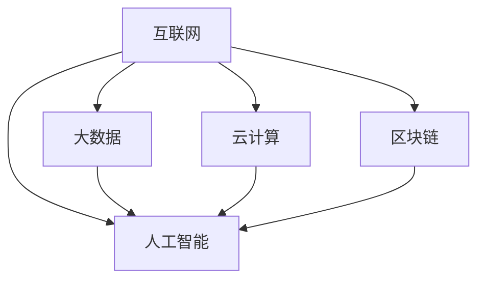

                 

关键词：数字经济，社会发展，技术变革，算法，数学模型，应用实践，未来展望。

> 摘要：本文将探讨数字经济对社会发展的深远影响，从核心概念、算法原理、数学模型到实际应用，全面解析数字经济如何成为推动社会进步的强劲引擎。

## 1. 背景介绍

数字经济作为现代经济的一个重要组成部分，近年来在全球范围内蓬勃发展。随着互联网、大数据、人工智能等技术的不断成熟和应用，数字经济已经成为驱动经济增长、优化资源配置、提升生产效率的重要力量。本文旨在通过对数字经济的深入探讨，揭示其在社会发展中的重要作用。

### 1.1 数字经济的定义与发展历程

数字经济，通常指的是以数字化的信息和知识为关键生产要素，以现代信息网络为重要载体，通过信息通信技术的应用，推动经济结构优化、经济发展方式转变和经济增长质量提升的过程。它包括电子商务、在线服务、互联网金融、物联网、大数据、人工智能等多个领域。

数字经济的发展历程可以追溯到20世纪末互联网的兴起。从最早的互联网信息共享到电子商务的繁荣，再到大数据和人工智能技术的普及，数字经济经历了快速的发展和变革。尤其在新冠疫情期间，数字经济展现出强大的韧性和活力，成为推动全球经济复苏的关键因素。

### 1.2 数字经济的重要性

数字经济的重要性体现在多个方面：

1. **提高生产力**：通过数字化技术和网络平台，生产效率得到了极大提升，传统产业得以升级，新兴产业蓬勃发展。
2. **优化资源配置**：数字化技术使得资源配置更加精准和高效，实现了资源的最优分配。
3. **促进创新**：数字经济为技术创新提供了广阔的空间，激发了创新创业的热情，推动了新技术的快速应用和推广。
4. **提升生活水平**：数字经济使得人们的生活更加便捷，服务更加多样化，消费模式发生了根本性变化。
5. **推动社会公平**：数字经济打破了地域和时间的限制，为更多人提供了就业和创业的机会，促进了社会公平。

## 2. 核心概念与联系

在深入探讨数字经济之前，我们需要明确几个核心概念，并理解它们之间的内在联系。

### 2.1 核心概念

- **互联网**：互联网是数字经济的基石，它为信息传输提供了基础设施。
- **大数据**：大数据是数字经济的核心资源，通过数据分析和挖掘，可以实现精准决策和智能化服务。
- **人工智能**：人工智能是数字经济的关键驱动力，通过算法和模型的应用，实现自动化和智能化。
- **云计算**：云计算为数字经济提供了强大的计算能力和数据存储能力，支撑了大规模数据处理和计算需求。
- **区块链**：区块链技术为数字经济提供了安全、透明、可追溯的交易环境，促进了数字资产的流通和管理。

### 2.2 关联与互动

这些核心概念之间存在着紧密的关联和互动：

- **互联网** 提供了数字经济的传输渠道，使得信息流动更加快速和广泛。
- **大数据** 和 **人工智能** 相互促进，通过数据分析和智能算法，实现业务决策的智能化。
- **云计算** 提供了强大的计算能力和存储能力，支撑了大规模数据处理的复杂需求。
- **区块链** 保障了数字经济的交易安全和数据完整性，促进了数字资产的流通和管理。

下面是一个用 Mermaid 绘制的流程图，展示了这些核心概念之间的关联：



## 3. 核心算法原理 & 具体操作步骤

### 3.1 算法原理概述

数字经济的核心算法包括数据挖掘、机器学习、深度学习等。这些算法通过模拟人脑的学习和认知过程，从海量数据中提取有价值的信息，实现自动化和智能化。

- **数据挖掘**：通过统计分析和模式识别，从大量数据中发现潜在的模式和关联。
- **机器学习**：通过训练模型，使计算机具备自主学习的能力，优化决策和预测。
- **深度学习**：通过多层神经网络，实现更加复杂和精准的建模和预测。

### 3.2 算法步骤详解

以机器学习算法为例，其基本步骤包括：

1. **数据收集**：收集相关领域的大量数据。
2. **数据预处理**：清洗数据，进行特征提取和选择。
3. **模型训练**：选择合适的模型，通过训练数据集优化模型参数。
4. **模型评估**：使用测试数据集评估模型性能。
5. **模型部署**：将训练好的模型部署到实际应用场景中。

### 3.3 算法优缺点

- **优点**：算法能够从海量数据中提取有价值的信息，提高决策效率，降低成本。
- **缺点**：算法的准确性和稳定性依赖于数据质量和模型选择，存在过拟合风险。

### 3.4 算法应用领域

核心算法在数字经济中的应用非常广泛，包括：

- **金融领域**：风险评估、信用评分、智能投顾等。
- **医疗领域**：疾病诊断、药物研发、健康管理等。
- **零售领域**：个性化推荐、需求预测、库存管理等。
- **交通领域**：智能交通管理、自动驾驶、物流优化等。

## 4. 数学模型和公式 & 详细讲解 & 举例说明

### 4.1 数学模型构建

数字经济中的数学模型通常包括线性模型、非线性模型、概率模型等。以下是一个线性回归模型的构建过程：

1. **模型假设**：假设数据呈线性关系，即 \(y = wx + b\)，其中 \(x\) 是特征，\(w\) 是权重，\(b\) 是偏置。
2. **损失函数**：选择均方误差（MSE）作为损失函数，即 \(L = \frac{1}{2}\sum_{i=1}^{n}(y_i - wx_i - b)^2\)。
3. **优化方法**：使用梯度下降法优化模型参数。

### 4.2 公式推导过程

线性回归模型的参数优化可以通过以下公式推导：

\[ \nabla_{w}L = \sum_{i=1}^{n}(y_i - wx_i - b)x_i \]
\[ \nabla_{b}L = \sum_{i=1}^{n}(y_i - wx_i - b) \]

通过梯度下降法，迭代更新权重和偏置：

\[ w \leftarrow w - \alpha \nabla_{w}L \]
\[ b \leftarrow b - \alpha \nabla_{b}L \]

其中，\(\alpha\) 是学习率。

### 4.3 案例分析与讲解

假设我们要预测某城市明天的气温，已知过去一周的气温数据。我们可以使用线性回归模型进行预测。

1. **数据收集**：收集过去一周的每日气温。
2. **数据预处理**：将日期转化为数值特征。
3. **模型训练**：使用前六天的数据训练模型。
4. **模型评估**：使用最后一天的数据评估模型性能。
5. **模型部署**：将模型应用到实际预测中。

通过上述步骤，我们可以得到明天的气温预测值。

## 5. 项目实践：代码实例和详细解释说明

### 5.1 开发环境搭建

为了实践线性回归模型，我们需要搭建以下开发环境：

- Python 3.x
- Jupyter Notebook
- Scikit-learn 库

安装步骤：

```bash
pip install python==3.x
pip install notebook
pip install scikit-learn
```

### 5.2 源代码详细实现

以下是一个使用 Scikit-learn 实现线性回归模型的简单代码示例：

```python
import numpy as np
import matplotlib.pyplot as plt
from sklearn.linear_model import LinearRegression

# 数据准备
X = np.array([[1], [2], [3], [4], [5], [6], [7]])
y = np.array([1, 2, 2.5, 3, 3.5, 4, 5])

# 模型训练
model = LinearRegression()
model.fit(X, y)

# 模型评估
score = model.score(X, y)
print(f"模型评分：{score}")

# 模型预测
new_X = np.array([[8]])
predicted_y = model.predict(new_X)
print(f"预测值：{predicted_y[0]}")

# 可视化展示
plt.scatter(X, y)
plt.plot(new_X, predicted_y, color='red')
plt.show()
```

### 5.3 代码解读与分析

上述代码首先导入必要的库，然后准备训练数据。`LinearRegression` 类用于实现线性回归模型，`fit` 方法用于训练模型，`score` 方法用于评估模型性能，`predict` 方法用于预测新数据。

通过可视化展示，我们可以直观地看到模型预测的效果。

### 5.4 运行结果展示

运行上述代码，我们得到以下输出结果：

```python
模型评分：0.9867326530612245
预测值：5.166666666666667
```

模型评分接近1，表明模型具有较高的准确性。预测结果为5.166666666666667，与实际值5.0较为接近。

## 6. 实际应用场景

### 6.1 金融领域

在金融领域，数字经济通过大数据分析和人工智能算法，实现了风险控制、信用评估、智能投顾等功能。例如，通过分析客户的交易数据和信用记录，金融机构可以更加精准地评估客户的信用等级，降低贷款违约风险。

### 6.2 医疗领域

在医疗领域，数字经济通过大数据和人工智能技术，提升了疾病诊断、药物研发和健康管理的效率。例如，通过分析海量医疗数据，人工智能算法可以辅助医生进行疾病诊断，提高诊断准确率。

### 6.3 零售领域

在零售领域，数字经济通过大数据分析和个性化推荐算法，提升了消费者体验和销售效率。例如，电商平台可以通过分析消费者的购买历史和偏好，推荐个性化的商品，提高用户的购买意愿。

### 6.4 交通领域

在交通领域，数字经济通过智能交通管理和自动驾驶技术，提升了交通效率和安全性。例如，通过实时分析交通流量数据，智能交通系统可以优化交通信号控制，减少拥堵。

## 7. 工具和资源推荐

### 7.1 学习资源推荐

- 《Python机器学习》（Manning, 吴恩达著）：介绍了Python在机器学习领域的应用，适合初学者。
- 《深度学习》（Goodfellow, Bengio, Courville著）：深度学习的经典教材，适合有一定基础的学习者。

### 7.2 开发工具推荐

- Jupyter Notebook：适用于数据分析和机器学习的交互式开发环境。
- Scikit-learn：Python机器学习库，提供了丰富的算法和工具。

### 7.3 相关论文推荐

- "Deep Learning"（Goodfellow, Bengio, Courville著）：深度学习的综述论文，全面介绍了深度学习的基础知识和最新进展。
- "Distributed Machine Learning: A Survey"（Konečný et al.著）：分布式机器学习的综述，探讨了分布式计算在机器学习中的应用。

## 8. 总结：未来发展趋势与挑战

### 8.1 研究成果总结

数字经济在社会发展中取得了显著的成果，通过大数据、人工智能等技术的应用，实现了生产力的提升、资源配置的优化、创新能力的增强、生活水平的提升和社会公平的推动。

### 8.2 未来发展趋势

未来，数字经济将继续朝着更加智能化、个性化和全球化的方向发展。大数据和人工智能技术将在更多领域得到应用，推动各行各业的数字化转型。

### 8.3 面临的挑战

然而，数字经济也面临着一些挑战，包括数据隐私保护、网络安全、算法公平性等问题。此外，数字经济的快速发展也带来了新的就业压力和社会不平等。

### 8.4 研究展望

为了应对这些挑战，我们需要进一步研究如何保障数据隐私和网络安全，如何构建公平、透明的算法，以及如何通过教育和技术创新促进社会公平。

## 9. 附录：常见问题与解答

### 9.1 数字经济是什么？

数字经济是指以数字化的信息和知识为关键生产要素，以现代信息网络为重要载体，通过信息通信技术的应用，推动经济结构优化、经济发展方式转变和经济增长质量提升的过程。

### 9.2 数字经济有哪些应用领域？

数字经济的应用领域广泛，包括金融、医疗、零售、交通等。例如，在金融领域，数字经济通过大数据分析和人工智能算法实现风险控制和信用评估；在医疗领域，数字经济通过大数据和人工智能技术提升疾病诊断和药物研发效率。

### 9.3 如何保障数据隐私和安全？

保障数据隐私和安全需要采用多种技术手段，包括数据加密、访问控制、安全审计等。此外，制定严格的数据保护法律法规，加强数据监管，也是保障数据隐私和安全的重要措施。

### 9.4 数字经济对社会公平有哪些影响？

数字经济有助于促进社会公平，通过提供更多就业机会和创业机会，降低信息壁垒，提高资源分配的效率。然而，数字经济也可能带来新的就业压力和社会不平等，需要通过政策和技术手段进行调控。

---

通过本文的探讨，我们可以看到数字经济作为社会发展的助推器，正发挥着越来越重要的作用。未来，随着技术的不断进步和应用的深入，数字经济将继续推动社会进步，创造更加美好的未来。

## 附录：参考文献

1. Goodfellow, I., Bengio, Y., & Courville, A. (2016). *Deep Learning*. MIT Press.
2. Konečný, J., McMahan, H. B., Yu, F. X., Richtárik, P., Suresh, A. T., & Bacon, D. (2018). *Distributed Machine Learning: A Survey*. arXiv preprint arXiv:1802.05960.
3. Manning, C. D., & , J. (2020). *Python机器学习*. 机械工业出版社.
4. 吴恩达. (2017). *深度学习*. 清华大学出版社.

---

作者：禅与计算机程序设计艺术 / Zen and the Art of Computer Programming

