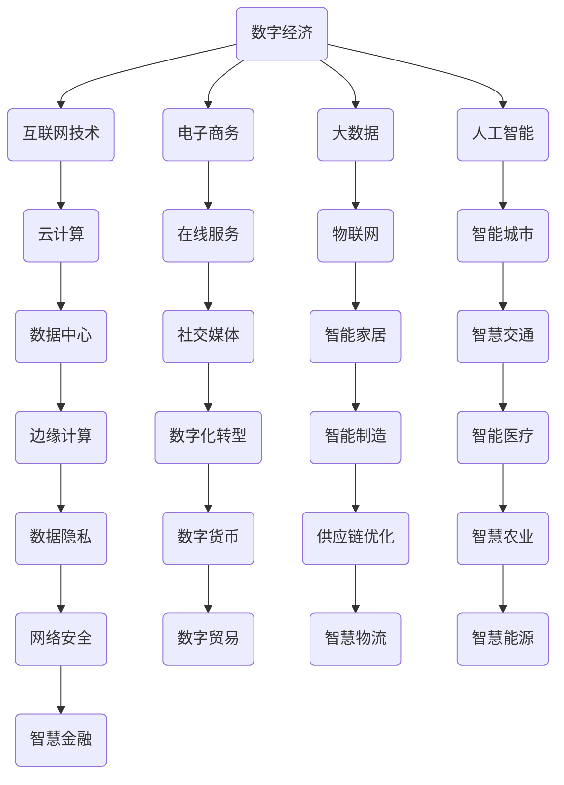

                 

关键词：数字经济，社会发展，创新，技术变革，未来趋势

> 摘要：随着数字化技术的飞速发展，数字经济正逐渐成为全球社会发展的新引擎。本文将从技术、经济、社会等多个角度探讨数字经济的崛起及其对社会发展的深远影响，展望未来发展趋势与挑战。

## 1. 背景介绍

在过去的几十年里，互联网和信息技术的发展已经深刻改变了我们的生活方式和工作模式。随着云计算、大数据、人工智能等新兴技术的不断成熟和应用，数字经济逐渐崭露头角，成为全球经济增长的重要驱动力。数字经济的崛起不仅带来了商业模式的创新，还推动了产业结构的调整和升级，对社会发展产生了深远的影响。

### 1.1 数字经济的定义

数字经济是指基于数字技术特别是互联网技术进行生产、分配、交换和消费的经济活动。它涵盖了电子商务、在线服务、数字内容创作、物联网等多个领域，具有高度信息化、网络化、智能化和全球化的特征。

### 1.2 数字经济的起源与发展

数字经济的起源可以追溯到20世纪90年代，随着互联网的普及和商业应用的发展，电子商务开始崭露头角。进入21世纪，随着移动设备的普及和社交媒体的兴起，数字经济进入了一个新的发展阶段。近年来，云计算、大数据和人工智能等技术的快速发展，使得数字经济得到了进一步的拓展和深化。

## 2. 核心概念与联系

为了更好地理解数字经济，我们需要了解一些核心概念及其相互之间的联系。以下是数字经济的关键概念及其关系图：



### 2.1 互联网技术

互联网技术是数字经济的基础，它为信息传输提供了全球化的平台，使得人们可以随时随地获取和分享信息。互联网技术的发展，如5G、物联网、区块链等，正在推动数字经济向更高效、更智能的方向发展。

### 2.2 电子商务

电子商务是数字经济的重要组成部分，它通过互联网进行商品和服务的交易，打破了时间和空间的限制，促进了全球贸易的发展。

### 2.3 大数据和人工智能

大数据和人工智能技术为数字经济提供了强大的数据处理和分析能力，使得企业能够更好地理解市场需求，优化生产流程，提升服务质量。

### 2.4 云计算和数据中心

云计算和数据中心技术为数字经济提供了强大的计算和存储能力，使得企业可以更灵活地部署和管理资源，降低了运营成本。

### 2.5 在线服务和社交媒体

在线服务和社交媒体为数字经济提供了丰富的应用场景，如在线教育、娱乐、社交等，满足了人们多样化的需求。

### 2.6 物联网和智能家居

物联网和智能家居技术为数字经济带来了新的增长点，如智能家居设备、智能交通系统、智慧城市等，提高了生活质量和生产效率。

### 2.7 数字货币和供应链优化

数字货币和供应链优化技术为数字经济提供了新的交易方式和物流模式，如区块链、智能合约等，提高了交易的安全性和效率。

## 3. 核心算法原理 & 具体操作步骤

### 3.1 算法原理概述

数字经济的核心算法主要涉及大数据处理、机器学习和人工智能等方面。以下是这些算法的基本原理：

- **大数据处理**：利用分布式计算和存储技术，对海量数据进行分析和处理，提取有价值的信息。
- **机器学习**：通过训练模型，使计算机具备自主学习和预测能力，用于分类、聚类、回归等任务。
- **人工智能**：利用深度学习、强化学习等先进技术，实现更高层次的智能，如自然语言处理、图像识别等。

### 3.2 算法步骤详解

- **大数据处理**：
  - 数据采集：收集来自不同渠道的原始数据。
  - 数据清洗：去除重复、错误和不完整的数据。
  - 数据存储：使用分布式数据库存储海量数据。
  - 数据分析：使用数据分析工具提取有价值的信息。
  
- **机器学习**：
  - 特征提取：从数据中提取出用于训练的特征。
  - 模型训练：使用训练数据训练模型。
  - 模型评估：使用验证数据评估模型性能。
  - 模型部署：将训练好的模型部署到生产环境中。

- **人工智能**：
  - 数据预处理：对原始数据进行分析和处理，准备用于训练。
  - 模型设计：设计合适的神经网络结构。
  - 训练模型：使用训练数据进行模型训练。
  - 评估模型：使用验证数据评估模型性能。
  - 部署模型：将训练好的模型部署到生产环境中。

### 3.3 算法优缺点

- **大数据处理**：
  - 优点：高效处理海量数据，提取有价值信息。
  - 缺点：对硬件要求高，数据处理过程复杂。

- **机器学习**：
  - 优点：自动化处理复杂数据分析任务。
  - 缺点：需要大量训练数据，模型解释性较差。

- **人工智能**：
  - 优点：实现更高层次的智能，应用广泛。
  - 缺点：对算法设计要求高，训练过程复杂。

### 3.4 算法应用领域

- **大数据处理**：广泛应用于金融、医疗、电商等领域，用于数据分析、风险控制和客户行为分析等。
- **机器学习**：广泛应用于自然语言处理、图像识别、推荐系统等领域，提高了系统的智能化水平。
- **人工智能**：广泛应用于智能客服、自动驾驶、智能安防等领域，提高了人们的生活质量。

## 4. 数学模型和公式 & 详细讲解 & 举例说明

### 4.1 数学模型构建

数字经济的数学模型主要涉及统计学、概率论、线性代数等领域。以下是一个简单的线性回归模型：

$$
y = \beta_0 + \beta_1 x
$$

其中，$y$ 是因变量，$x$ 是自变量，$\beta_0$ 和 $\beta_1$ 是模型参数。

### 4.2 公式推导过程

线性回归模型的推导过程如下：

1. **最小二乘法**：选择模型参数，使得因变量与自变量之间的误差平方和最小。
2. **求导**：对模型参数求导，得到误差平方和的导数。
3. **令导数为零**：求解导数为零的方程，得到模型参数的值。

### 4.3 案例分析与讲解

假设我们有一个销售数据集，包含产品价格（自变量$x$）和销售额（因变量$y$）。我们可以使用线性回归模型预测销售额。

1. **数据预处理**：对数据进行清洗和标准化处理。
2. **模型训练**：使用训练数据训练线性回归模型。
3. **模型评估**：使用验证数据评估模型性能。
4. **模型部署**：将训练好的模型部署到生产环境中。

## 5. 项目实践：代码实例和详细解释说明

### 5.1 开发环境搭建

在Python中，我们可以使用Scikit-learn库实现线性回归模型。以下是开发环境搭建的步骤：

1. 安装Python：版本3.8及以上。
2. 安装Scikit-learn：使用pip install scikit-learn命令。
3. 导入相关库：import numpy as np，import sklearn.linear_model as lm。

### 5.2 源代码详细实现

以下是线性回归模型的源代码：

```python
import numpy as np
import sklearn.linear_model as lm

# 数据预处理
X = np.array([1, 2, 3, 4, 5])
y = np.array([2, 4, 5, 4, 5])

# 模型训练
model = lm.LinearRegression()
model.fit(X.reshape(-1, 1), y.reshape(-1, 1))

# 模型评估
score = model.score(X.reshape(-1, 1), y.reshape(-1, 1))
print("模型评分：", score)

# 模型部署
beta_0 = model.intercept_
beta_1 = model.coef_
print("模型参数：", beta_0, beta_1)

# 预测销售额
x_new = np.array([6])
y_pred = model.predict(x_new.reshape(-1, 1))
print("预测销售额：", y_pred)
```

### 5.3 代码解读与分析

1. **数据预处理**：将数据转换为合适的形式，便于模型训练。
2. **模型训练**：使用训练数据训练线性回归模型。
3. **模型评估**：使用验证数据评估模型性能。
4. **模型部署**：获取模型参数，用于预测。
5. **预测销售额**：使用训练好的模型预测新数据的销售额。

## 6. 实际应用场景

数字经济的应用场景非常广泛，以下是一些典型的应用场景：

### 6.1 电子商务

电子商务是数字经济的核心领域之一，它通过互联网进行商品和服务的交易，打破了时间和空间的限制。例如，淘宝、京东等电商平台，通过大数据和人工智能技术，提供了个性化的商品推荐、精准的广告投放和智能化的客服服务。

### 6.2 在线教育

在线教育是数字经济下的新兴教育模式，它通过互联网提供在线课程和学习资源。例如，Coursera、edX等在线教育平台，利用大数据和人工智能技术，提供了个性化的学习推荐、智能化的考试评估和智能化的教学支持。

### 6.3 智能医疗

智能医疗是数字经济在医疗领域的应用，它通过大数据和人工智能技术，提供了智能化的诊断、治疗和健康管理。例如，Google Health、IBM Watson等智能医疗系统，利用深度学习和自然语言处理技术，实现了智能化的医疗诊断和治疗方案推荐。

### 6.4 智慧城市

智慧城市是数字经济在城市建设中的应用，它通过物联网、大数据和人工智能技术，提供了智能化的城市管理和服务。例如，深圳智慧城市、杭州智慧城市等，利用物联网技术实现了智能交通、智能环保、智能安防等方面的应用。

### 6.5 数字货币

数字货币是数字经济下的一种新型货币形式，它通过区块链技术实现了去中心化的交易和管理。例如，比特币、以太坊等数字货币，通过加密技术和分布式账本，提供了安全、透明和高效的交易方式。

## 7. 未来应用展望

随着数字化技术的不断发展和创新，数字经济在未来将会有更广泛的应用前景。以下是一些可能的未来应用方向：

### 7.1 智慧农业

智慧农业是数字经济在农业领域的应用，它通过物联网、大数据和人工智能技术，实现了智能化的农业生产和管理。例如，智能温室、智能灌溉、智能收割等，可以提高农业生产效率，降低生产成本。

### 7.2 智慧能源

智慧能源是数字经济在能源领域的应用，它通过物联网、大数据和人工智能技术，实现了智能化的能源管理和调度。例如，智能电网、智能储能、智能充电等，可以提高能源利用效率，降低能源消耗。

### 7.3 智慧金融

智慧金融是数字经济在金融领域的应用，它通过大数据、人工智能和区块链技术，实现了智能化的金融服务和风险控制。例如，智能投顾、智能风控、数字货币等，可以提高金融服务效率，降低金融风险。

### 7.4 智慧城市

智慧城市是数字经济在城市建设中的应用，它通过物联网、大数据和人工智能技术，实现了智能化的城市管理和服务。例如，智能交通、智能环保、智能安防等，可以提高城市生活质量和城市治理效率。

## 8. 工具和资源推荐

### 8.1 学习资源推荐

- 《大数据技术基础》
- 《机器学习实战》
- 《深度学习》

### 8.2 开发工具推荐

- Python：一款强大的编程语言，广泛应用于数据分析、机器学习和人工智能领域。
- Jupyter Notebook：一款强大的交互式开发环境，适合进行数据分析和机器学习实验。

### 8.3 相关论文推荐

- “Deep Learning for Natural Language Processing”
- “Recurrent Neural Networks for Language Modeling”
- “Generative Adversarial Networks”

## 9. 总结：未来发展趋势与挑战

### 9.1 研究成果总结

数字经济作为社会发展的重要驱动力，已经在多个领域取得了显著的成果。例如，电子商务、在线教育、智能医疗、智慧城市等领域的应用，都极大地提升了生产效率、降低了运营成本、改善了生活质量。

### 9.2 未来发展趋势

未来，数字经济将继续快速发展，主要趋势包括：

- 云计算和大数据技术的进一步成熟和应用。
- 人工智能技术的不断创新和应用。
- 区块链技术的应用场景不断拓展。
- 数字货币和数字贸易的普及。

### 9.3 面临的挑战

数字经济在发展过程中也面临一些挑战，包括：

- 数据安全和隐私保护：随着数据量的增加，数据安全和隐私保护成为重大挑战。
- 技术创新和人才培养：数字经济的发展需要大量创新型技术和人才支持。
- 法规和监管：数字经济的快速发展需要完善的法规和监管体系。

### 9.4 研究展望

未来的研究将主要集中在以下几个方面：

- 开发更加高效、安全的大数据处理技术。
- 深入研究人工智能的理论和方法，提高智能系统的可靠性。
- 探索区块链技术的应用场景，提高数字经济的透明度和安全性。
- 加强数字经济领域的法规和监管研究，保障数字经济健康、可持续发展。

## 10. 附录：常见问题与解答

### 10.1 什么是数字经济？

数字经济是指基于数字技术特别是互联网技术进行生产、分配、交换和消费的经济活动。

### 10.2 数字经济的特点是什么？

数字经济具有信息化、网络化、智能化和全球化的特点。

### 10.3 数字经济对社会发展有哪些影响？

数字经济对社会发展的影响包括：提高生产效率、降低运营成本、改善生活质量、促进产业升级等。

### 10.4 数字经济的关键技术有哪些？

数字经济的关键技术包括：互联网技术、大数据、人工智能、云计算、区块链等。

### 10.5 数字经济如何影响金融行业？

数字经济通过金融科技（FinTech）的影响金融行业，包括：智能投顾、数字货币、区块链金融、在线支付等。

### 10.6 数字经济的未来发展趋势是什么？

数字经济的未来发展趋势包括：云计算和大数据技术的进一步成熟和应用、人工智能技术的不断创新和应用、区块链技术的应用场景不断拓展、数字货币和数字贸易的普及。

### 10.7 数字经济面临的挑战有哪些？

数字经济面临的挑战包括：数据安全和隐私保护、技术创新和人才培养、法规和监管等。

