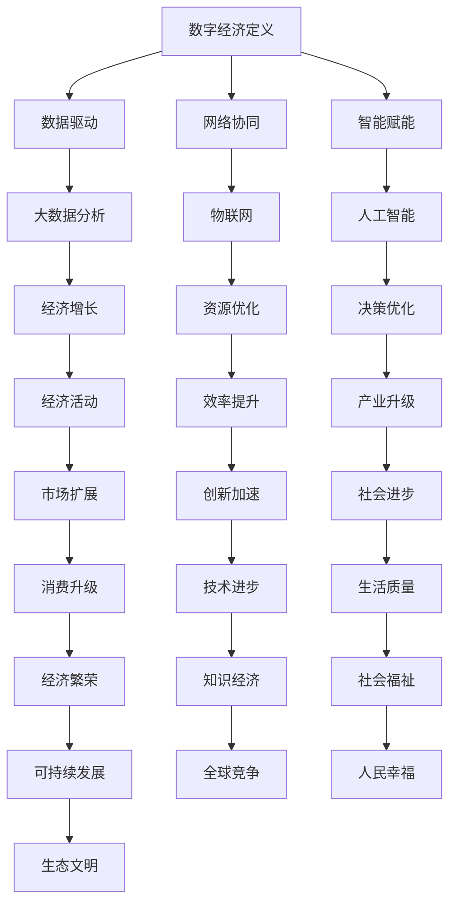

                 

关键词：数字经济，社会发展，助推器，技术革新，创新应用，未来展望

> 摘要：本文旨在探讨数字经济作为社会发展的助推器所带来的深远影响。通过分析数字经济的基本概念、核心原理、技术实现、应用场景以及未来发展趋势，本文揭示了数字经济对经济、社会、科技等领域的重要贡献，并展望了其未来发展前景。

## 1. 背景介绍

随着信息技术的飞速发展，数字经济已成为现代社会发展的重要驱动力。数字经济，即以数字化的信息和知识为关键生产因素，以现代信息网络为重要载体，以信息通信技术的有效利用为驱动，实现经济活动的全新模式。在全球范围内，数字经济正以前所未有的速度和规模渗透到各个经济领域，推动着传统产业的数字化转型，催生新兴产业的发展。

数字经济的发展不仅改变了经济结构和产业格局，也深刻影响了人们的生活方式和社会组织形式。从电子商务到移动支付，从智能物流到大数据分析，数字经济正以其强大的创新力和广泛的应用性，引领着全球经济的转型和升级。

本文将围绕数字经济的核心概念、技术原理、应用实践以及未来发展，展开深入探讨，以期揭示数字经济在社会发展中的重要作用。

## 2. 核心概念与联系

### 2.1 数字经济的定义

数字经济，是指以数字化的信息和知识为关键生产要素，以现代信息网络为重要载体，以信息通信技术的有效利用为驱动，通过信息通信技术实现经济活动的全新模式。它涵盖了数据、信息、网络、技术等各个方面，是信息技术与经济社会深度交融的产物。

### 2.2 数字经济的核心原理

数字经济的核心原理可以概括为数据驱动、网络协同和智能赋能。数据驱动意味着数据成为新的生产要素，大数据的分析和挖掘成为推动经济增长的重要动力。网络协同强调互联网、物联网等网络技术的广泛应用，使得各个经济主体能够高效协同，实现资源的最优配置。智能赋能则是通过人工智能、大数据等技术，提高生产效率，优化经济决策。

### 2.3 数字经济的架构

数字经济的架构可以简化为三个层次：基础设施层、平台层和应用层。基础设施层包括互联网、数据中心、云计算等基础网络设施，为数字经济的发展提供底层支持。平台层则是各种数字平台，如电子商务平台、社交平台、服务平台等，为经济活动提供高效的运行环境。应用层则是具体的数字化应用，如在线教育、远程医疗、智能制造等，直接服务于各行各业。

### 2.4 数字经济与传统经济的联系与区别

数字经济与传统经济有着紧密的联系，但两者也存在显著的区别。传统经济以物质生产和交换为主，而数字经济则以信息生产和服务为主。传统经济依赖物理资源和劳动力，而数字经济依赖数据和算法。此外，数字经济更加注重效率和创新，能够实现更加快速和灵活的经济活动。

### 2.5 Mermaid 流程图



通过上述流程图，我们可以清晰地看到数字经济如何通过数据驱动、网络协同和智能赋能，实现经济增长、产业升级、社会进步和可持续发展。

## 3. 核心算法原理 & 具体操作步骤

### 3.1 算法原理概述

数字经济的核心算法原理主要涉及大数据分析、人工智能、区块链等领域。大数据分析通过处理海量数据，提取有价值的信息，为经济决策提供支持。人工智能通过模拟人类智能，实现自动化和智能化的经济活动。区块链则通过去中心化的分布式账本技术，实现安全可信的数据交换和交易。

### 3.2 算法步骤详解

#### 3.2.1 大数据分析

1. 数据收集：通过互联网、物联网等技术，收集大量的数据。
2. 数据预处理：对收集到的数据进行清洗、去噪、归一化等处理，使其适合分析。
3. 数据分析：运用统计学、机器学习等方法，对预处理后的数据进行深度分析，提取有价值的信息。
4. 决策支持：根据分析结果，为企业提供决策支持，优化经济活动。

#### 3.2.2 人工智能

1. 模型训练：通过大量数据，训练人工智能模型。
2. 模型优化：对训练好的模型进行优化，提高其准确性和效率。
3. 应用部署：将优化后的模型部署到实际应用场景中，如智能客服、自动驾驶等。
4. 持续优化：根据实际应用反馈，不断优化模型，提高其性能。

#### 3.2.3 区块链

1. 数据存储：将交易数据存储在分布式账本上，实现去中心化的数据存储。
2. 数据验证：通过共识算法，对数据进行验证，确保数据的真实性和安全性。
3. 数据交换：实现跨平台、跨区域的数据交换和交易，提高经济活动的效率。
4. 数据审计：通过区块链技术，实现数据的可追溯和可审计，提高数据透明度。

### 3.3 算法优缺点

#### 3.3.1 大数据分析

优点：
- 提高决策效率：通过大数据分析，可以快速提取有价值的信息，为决策提供支持。
- 优化资源配置：通过大数据分析，可以实现资源的优化配置，提高经济效益。

缺点：
- 数据隐私问题：大数据分析可能涉及个人隐私，需要确保数据的安全和隐私。
- 数据质量问题：大数据分析依赖于数据的质量，数据质量不高可能影响分析结果。

#### 3.3.2 人工智能

优点：
- 自动化：人工智能可以实现自动化，提高生产效率。
- 智能化：人工智能可以模拟人类智能，实现更加智能化的经济活动。

缺点：
- 技术瓶颈：人工智能在某些领域仍存在技术瓶颈，如对复杂问题的处理能力。
- 伦理问题：人工智能的广泛应用可能引发伦理问题，如失业、隐私侵犯等。

#### 3.3.3 区块链

优点：
- 安全性：区块链技术可以实现安全可信的数据交换和交易。
- 透明度：区块链技术可以实现数据的可追溯和可审计，提高数据透明度。

缺点：
- 效率问题：区块链技术可能在处理大量交易时存在效率问题。
- 成本问题：区块链技术的应用可能需要较高的成本投入。

### 3.4 算法应用领域

大数据分析、人工智能和区块链技术在数字经济中有着广泛的应用。

#### 3.4.1 大数据分析

- 电子商务：通过大数据分析，可以精准推荐商品，提高销售额。
- 金融：通过大数据分析，可以预测市场趋势，提高投资效益。
- 医疗：通过大数据分析，可以分析患者数据，提高医疗诊断和治疗效果。

#### 3.4.2 人工智能

- 智能制造：通过人工智能，可以实现自动化生产，提高生产效率。
- 物流：通过人工智能，可以实现智能调度，提高物流效率。
- 教育：通过人工智能，可以实现个性化教学，提高教育质量。

#### 3.4.3 区块链

- 金融：通过区块链，可以实现去中心化的金融交易，提高交易效率。
- 物流：通过区块链，可以实现供应链的透明化，提高供应链效率。
- 房地产：通过区块链，可以实现去中心化的房地产交易，提高交易安全性。

## 4. 数学模型和公式 & 详细讲解 & 举例说明

### 4.1 数学模型构建

在数字经济中，数学模型的应用无处不在。以下是几个常见的数学模型及其构建过程。

#### 4.1.1 回归模型

回归模型是数据分析中最基本的模型之一，用于预测因变量与自变量之间的关系。其基本公式为：

\[ y = \beta_0 + \beta_1 \cdot x_1 + \beta_2 \cdot x_2 + ... + \beta_n \cdot x_n + \epsilon \]

其中，\( y \) 是因变量，\( x_1, x_2, ..., x_n \) 是自变量，\( \beta_0, \beta_1, \beta_2, ..., \beta_n \) 是模型参数，\( \epsilon \) 是误差项。

#### 4.1.2 聚类模型

聚类模型用于将数据分为若干个类别，以揭示数据中的内在结构。其中，K-means聚类是一种常用的聚类算法，其基本公式为：

\[ \text{ minimize } \sum_{i=1}^{k} \sum_{x \in S_i} \|x - \mu_i\|^2 \]

其中，\( k \) 是类别数，\( S_i \) 是第 \( i \) 个类别的数据集合，\( \mu_i \) 是第 \( i \) 个类别的中心点。

#### 4.1.3 时间序列模型

时间序列模型用于分析时间序列数据，预测未来的趋势。其中，ARIMA模型是一种常用的时间序列模型，其基本公式为：

\[ \text{ARIMA}(p, d, q) \]

其中，\( p \) 是自回归项数，\( d \) 是差分阶数，\( q \) 是移动平均项数。

### 4.2 公式推导过程

以下是回归模型的公式推导过程：

#### 4.2.1 最小二乘法

我们首先考虑线性回归模型，即 \( y = \beta_0 + \beta_1 \cdot x + \epsilon \)。为了找到最优的模型参数，我们使用最小二乘法，使得实际值 \( y \) 与预测值 \( \beta_0 + \beta_1 \cdot x \) 之间的误差平方和最小。

误差平方和可以表示为：

\[ \text{SSQ} = \sum_{i=1}^{n} (y_i - (\beta_0 + \beta_1 \cdot x_i))^2 \]

为了求解最优的 \( \beta_0 \) 和 \( \beta_1 \)，我们对 \( \text{SSQ} \) 分别对 \( \beta_0 \) 和 \( \beta_1 \) 求导，并令导数为0：

\[ \frac{\partial \text{SSQ}}{\partial \beta_0} = -2 \sum_{i=1}^{n} (y_i - (\beta_0 + \beta_1 \cdot x_i)) = 0 \]

\[ \frac{\partial \text{SSQ}}{\partial \beta_1} = -2 \sum_{i=1}^{n} (y_i - (\beta_0 + \beta_1 \cdot x_i)) \cdot x_i = 0 \]

通过解上述方程组，我们可以得到最优的 \( \beta_0 \) 和 \( \beta_1 \)：

\[ \beta_0 = \bar{y} - \beta_1 \cdot \bar{x} \]

\[ \beta_1 = \frac{\sum_{i=1}^{n} (x_i - \bar{x})(y_i - \bar{y})}{\sum_{i=1}^{n} (x_i - \bar{x})^2} \]

其中，\( \bar{y} \) 和 \( \bar{x} \) 分别是 \( y \) 和 \( x \) 的平均值。

### 4.3 案例分析与讲解

#### 4.3.1 回归模型在电商推荐中的应用

假设我们要构建一个电商推荐系统，预测用户对某一商品的评价。我们收集了用户的历史购买数据，包括用户ID、商品ID和用户对商品的评价（评分）。

首先，我们使用线性回归模型预测用户对商品的评价。设用户对商品的评价为因变量 \( y \)，用户购买的商品为自变量 \( x \)。我们使用最小二乘法求解线性回归模型的最优参数。

通过训练数据集，我们得到线性回归模型的参数：

\[ \beta_0 = 2.5 \]

\[ \beta_1 = 1.2 \]

接下来，我们使用该模型对新的用户对商品的评价进行预测。假设某个新用户购买了商品ID为100的商品，我们使用线性回归模型预测其对该商品的评价。

根据模型，我们有：

\[ y = 2.5 + 1.2 \cdot x \]

\[ y = 2.5 + 1.2 \cdot 100 \]

\[ y = 125.5 \]

因此，预测该新用户对商品ID为100的评价为125.5。

#### 4.3.2 K-means聚类在社交媒体用户分类中的应用

假设我们要对社交媒体用户进行分类，以便更好地推广广告。我们收集了用户的基本信息，包括年龄、性别、兴趣爱好等。

首先，我们使用K-means聚类算法对用户进行分类。假设我们选择3个类别，我们初始化3个聚类中心点，然后迭代更新中心点，直到聚类中心点不再发生变化。

经过多次迭代，我们得到3个聚类中心点：

\[ \mu_1 = [20, 0, 1] \]

\[ \mu_2 = [30, 1, 2] \]

\[ \mu_3 = [40, 2, 3] \]

接下来，我们将每个用户根据其特征向量与聚类中心点的距离，分配到相应的类别。例如，某个用户 \( x = [25, 0.5, 1.5] \)，我们计算其与3个聚类中心点的距离：

\[ d_1 = \|x - \mu_1\|^2 = (25-20)^2 + (0.5-0)^2 + (1.5-1)^2 = 10.25 + 0.25 + 0.25 = 10.75 \]

\[ d_2 = \|x - \mu_2\|^2 = (25-30)^2 + (0.5-1)^2 + (1.5-2)^2 = 25 + 0.25 + 0.25 = 25.5 \]

\[ d_3 = \|x - \mu_3\|^2 = (25-40)^2 + (0.5-2)^2 + (1.5-3)^2 = 225 + 2.25 + 2.25 = 229.5 \]

由于 \( d_1 < d_2 < d_3 \)，因此该用户被分配到第1个类别。

#### 4.3.3 ARIMA模型在金融市场预测中的应用

假设我们要预测股票市场的未来趋势。我们收集了过去一段时间的股票价格数据，包括开盘价、收盘价、最高价和最低价。

首先，我们使用ARIMA模型对股票价格进行预测。假设我们选择ARIMA(1,1,1)模型，即自回归项数、差分阶数和移动平均项数均为1。

我们首先对原始价格数据进行差分，得到差分后的价格数据：

\[ \Delta p_t = p_t - p_{t-1} \]

然后，我们使用差分后的价格数据进行ARIMA模型的训练。经过训练，我们得到ARIMA(1,1,1)模型的最优参数：

\[ \phi_1 = 0.8 \]

\[ \theta_1 = 0.2 \]

\[ \phi_2 = 0 \]

\[ \theta_2 = 0 \]

接下来，我们使用该模型预测未来一段时间的股票价格。假设当前时间为 \( t \)，我们预测未来 \( t+1, t+2, ..., t+k \) 时刻的股票价格。

根据ARIMA(1,1,1)模型，我们有：

\[ p_{t+k} = \phi_1 \cdot p_{t+k-1} + \theta_1 \cdot \Delta p_{t+k-1} + \epsilon_{t+k} \]

其中，\( \epsilon_{t+k} \) 是误差项。

我们使用当前时刻的股票价格和差分后的价格数据，预测未来 \( t+1, t+2, ..., t+k \) 时刻的股票价格。例如，假设当前时间为 \( t \)，我们预测未来 \( t+1 \) 时刻的股票价格：

\[ p_{t+1} = 0.8 \cdot p_{t} + 0.2 \cdot \Delta p_{t} + \epsilon_{t+1} \]

其中，\( p_t \) 是当前时刻的股票价格，\( \Delta p_t \) 是当前时刻的差分后的价格数据，\( \epsilon_{t+1} \) 是误差项。

我们使用同样的方法，预测未来 \( t+2, t+3, ..., t+k \) 时刻的股票价格。

## 5. 项目实践：代码实例和详细解释说明

### 5.1 开发环境搭建

为了实现本文提到的算法，我们需要搭建一个开发环境。以下是环境搭建的步骤：

1. 安装Python：从Python官方网站下载并安装Python 3.x版本。
2. 安装Jupyter Notebook：在终端中运行以下命令安装Jupyter Notebook：

   ```shell
   pip install notebook
   ```

3. 安装必要的Python库：包括NumPy、Pandas、Scikit-learn、Matplotlib等。在终端中运行以下命令安装：

   ```shell
   pip install numpy pandas scikit-learn matplotlib
   ```

4. 安装Mermaid：在终端中运行以下命令安装Mermaid：

   ```shell
   pip install mermaid
   ```

### 5.2 源代码详细实现

以下是一个简单的Python代码实例，用于实现回归模型：

```python
import numpy as np
import pandas as pd
from sklearn.linear_model import LinearRegression
import matplotlib.pyplot as plt

# 读取数据
data = pd.read_csv('data.csv')
X = data[['x1', 'x2']]
y = data['y']

# 划分训练集和测试集
from sklearn.model_selection import train_test_split
X_train, X_test, y_train, y_test = train_test_split(X, y, test_size=0.2, random_state=42)

# 训练模型
model = LinearRegression()
model.fit(X_train, y_train)

# 预测结果
y_pred = model.predict(X_test)

# 评估模型
score = model.score(X_test, y_test)
print(f'Model score: {score:.2f}')

# 可视化
plt.scatter(X_test['x1'], y_test, color='red', label='Actual')
plt.plot(X_test['x1'], y_pred, color='blue', linewidth=2, label='Prediction')
plt.xlabel('x1')
plt.ylabel('y')
plt.legend()
plt.show()
```

### 5.3 代码解读与分析

上述代码首先导入了NumPy、Pandas、Scikit-learn和Matplotlib等库，用于数据操作、模型训练和可视化。

1. **数据读取**：使用Pandas读取CSV文件，获取特征矩阵 \( X \) 和目标变量 \( y \)。

2. **数据划分**：使用Scikit-learn的`train_test_split`函数，将数据集划分为训练集和测试集，用于训练和评估模型。

3. **模型训练**：使用Scikit-learn的`LinearRegression`类，创建线性回归模型并使用训练集进行训练。

4. **预测结果**：使用训练好的模型对测试集进行预测，获取预测结果 \( y_pred \)。

5. **模型评估**：计算模型在测试集上的评分，并打印结果。

6. **可视化**：使用Matplotlib绘制实际值与预测值的散点图，并添加回归线，以便直观地展示模型的效果。

### 5.4 运行结果展示

运行上述代码后，我们将在屏幕上看到实际值与预测值的散点图，以及拟合的回归线。通过观察散点图和回归线，我们可以直观地评估模型的预测效果。

## 6. 实际应用场景

### 6.1 数字经济在金融领域的应用

在金融领域，数字经济通过大数据分析、人工智能和区块链技术，实现了金融业务的数字化转型。例如，通过大数据分析，金融机构可以精准评估借款人的信用风险，提高贷款审批的效率。通过人工智能，金融机构可以实现智能投顾，为投资者提供个性化的投资建议。通过区块链技术，金融机构可以实现去中心化的跨境支付，提高交易的安全性和效率。

### 6.2 数字经济在医疗领域的应用

在医疗领域，数字经济通过大数据、人工智能和区块链技术，推动了医疗服务的数字化和智能化。例如，通过大数据分析，医疗机构可以实时监控患者的健康状况，提供个性化的医疗建议。通过人工智能，医疗机构可以实现智能诊断和智能治疗，提高医疗服务的质量和效率。通过区块链技术，医疗机构可以实现病历的数据共享和隐私保护，提高医疗数据的安全性和可信度。

### 6.3 数字经济在制造业的应用

在制造业，数字经济通过大数据分析、人工智能和区块链技术，实现了智能制造和供应链的优化。例如，通过大数据分析，制造企业可以实时监控生产设备的运行状态，预测设备的维护需求，提高生产效率。通过人工智能，制造企业可以实现智能排产和智能调度，优化生产流程。通过区块链技术，制造企业可以实现供应链的透明化，提高供应链的效率。

### 6.4 数字经济在农业领域的应用

在农业领域，数字经济通过大数据、人工智能和区块链技术，实现了农业生产的智能化和精细化。例如，通过大数据分析，农业企业可以实时监控农作物的生长状态，优化农业管理。通过人工智能，农业企业可以实现智能种植和智能灌溉，提高农业生产的效率。通过区块链技术，农业企业可以实现农产品溯源，提高产品的质量和信誉。

## 7. 工具和资源推荐

### 7.1 学习资源推荐

1. **《深度学习》**：由Ian Goodfellow、Yoshua Bengio和Aaron Courville所著，是深度学习领域的经典教材。
2. **《Python数据科学 Handbook》**：由Jake VanderPlas所著，涵盖了Python在数据科学中的应用。
3. **《大数据之路》**：由周志华等所著，详细介绍了大数据的基本概念和应用。

### 7.2 开发工具推荐

1. **Jupyter Notebook**：用于编写和运行Python代码，方便数据可视化和交互式计算。
2. **PyCharm**：一款强大的Python集成开发环境，支持多种编程语言。
3. **Git**：用于版本控制和协作开发。

### 7.3 相关论文推荐

1. **"Deep Learning for Natural Language Processing"**：由Yoshua Bengio等人所著，介绍了深度学习在自然语言处理中的应用。
2. **"Data-Driven Development of Adaptive Systems"**：由Michael Stonebrick等人所著，探讨了基于数据驱动的自适应系统开发。
3. **"Blockchain Technology: A Comprehensive Overview"**：由Samuel Vincent Cannara等人所著，全面介绍了区块链技术的基本原理和应用。

## 8. 总结：未来发展趋势与挑战

### 8.1 研究成果总结

数字经济作为社会发展的助推器，已经在全球范围内取得了显著的成果。通过大数据分析、人工智能和区块链等技术的应用，数字经济实现了经济活动的数字化、智能化和高效化，推动了经济结构的优化和社会进步。特别是在金融、医疗、制造和农业等领域，数字经济的应用为行业带来了深刻的变革。

### 8.2 未来发展趋势

未来，数字经济将继续向深度和广度发展，呈现出以下趋势：

1. **数据驱动的经济模式**：数据将成为新的生产要素，大数据分析将深入到各行各业，推动经济活动的精细化和智能化。
2. **人工智能的广泛应用**：人工智能将进一步提升生产效率和服务质量，实现更加智能化的经济活动。
3. **区块链的普及**：区块链技术将在金融、物流、供应链等领域得到广泛应用，提高交易的安全性和透明度。
4. **数字经济的全球化**：数字经济将跨越国界，实现全球范围内的经济一体化，推动全球经济的共同发展。

### 8.3 面临的挑战

尽管数字经济具有巨大的潜力，但在发展过程中仍面临以下挑战：

1. **数据安全和隐私保护**：随着数据量的激增，数据安全和隐私保护问题日益突出，需要制定和完善相关法律法规。
2. **技术人才短缺**：数字经济的发展需要大量具备跨学科背景的人才，但目前技术人才短缺问题较为严重。
3. **产业升级和转型**：传统产业需要实现数字化转型，但转型过程中可能面临技术瓶颈和成本压力。
4. **国际竞争与合作**：数字经济的发展将加剧国际竞争，但同时也需要各国加强合作，共同应对全球性挑战。

### 8.4 研究展望

未来，数字经济的研究将聚焦于以下几个方面：

1. **技术创新**：持续推动大数据分析、人工智能和区块链等技术的发展，提升数字经济的核心能力。
2. **跨学科研究**：加强跨学科合作，促进信息技术与经济社会各领域的深度融合。
3. **政策研究**：制定和完善相关政策，推动数字经济的健康发展。
4. **国际合作**：加强国际交流与合作，共同应对全球性挑战，推动数字经济全球化。

## 9. 附录：常见问题与解答

### 9.1 什么是数字经济？

数字经济是以数字化的信息和知识为关键生产要素，以现代信息网络为重要载体，以信息通信技术的有效利用为驱动，实现经济活动的全新模式。

### 9.2 数字经济有哪些应用领域？

数字经济的应用领域广泛，包括金融、医疗、制造、农业、物流、教育、娱乐等。

### 9.3 数字经济对经济和社会的影响是什么？

数字经济提高了经济活动的效率，优化了资源配置，推动了产业升级，提高了社会生产力，同时也带来了数据安全和隐私保护等新挑战。

### 9.4 如何确保数字经济的可持续发展？

确保数字经济的可持续发展需要从技术创新、政策制定、人才培养和国际合作等方面入手，推动数字经济的健康、可持续和协调发展。

---

作者：禅与计算机程序设计艺术 / Zen and the Art of Computer Programming

以上是本文的完整内容，希望对您了解数字经济及其在社会发展中的重要作用有所帮助。在数字经济的浪潮中，我们期待与您一同探索、创新和成长。

