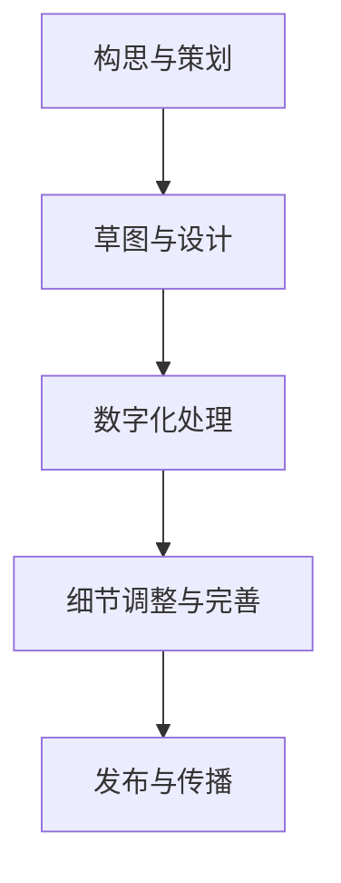

                 

 在当今这个数字化时代，艺术与科技的融合正在以前所未有的速度展开。数字艺术的兴起，不仅改变了艺术创作的形式和传播方式，更为创业者和企业家提供了前所未有的机遇。本文将探讨数字艺术创业的背景、核心概念、算法原理、数学模型、项目实践、实际应用场景以及未来的发展趋势与挑战。

## 关键词

- 数字艺术
- 创业
- 艺术与科技融合
- 算法原理
- 数学模型
- 项目实践
- 应用场景

## 摘要

本文旨在探讨数字艺术创业这一领域，分析艺术与科技融合所带来的机遇和挑战。通过深入解析数字艺术的核心概念、算法原理和数学模型，本文将展示如何运用科技手段提升艺术创作效率和质量。同时，通过实际项目实践和案例分析，本文将阐述数字艺术在商业应用中的潜力。最后，本文将对数字艺术的未来发展趋势与挑战进行展望，为创业者提供宝贵的指导和启示。

## 1. 背景介绍

随着计算机技术的飞速发展，数字艺术逐渐成为一种重要的艺术形式。数字艺术的定义广泛，它既包括通过计算机技术创作的纯数字艺术品，也包括传统艺术与数字技术相结合的作品。数字艺术不仅丰富了艺术的表现形式，还为艺术家提供了更为便捷和高效的创作工具。

在创业领域，数字艺术的兴起带来了诸多机遇。首先，数字艺术降低了艺术创作和传播的成本，使更多人有机会参与艺术创作和分享艺术成果。其次，数字艺术的市场需求不断增长，为创业者提供了广阔的市场空间。此外，数字艺术还与其他行业如游戏、影视、设计等领域紧密相连，为跨行业创业提供了无限可能。

然而，数字艺术的创业也面临着诸多挑战。技术的快速迭代要求创业者不断学习和更新知识，以保持竞争优势。同时，数字艺术作品的版权保护、商业化运作等问题也需要创业者深入思考和解决。此外，如何在数字艺术创业中实现艺术与科技的完美融合，也是创业者需要面对的重要课题。

## 2. 核心概念与联系

### 数字艺术的定义与分类

数字艺术是指运用计算机技术进行创作的艺术形式，它涵盖了绘画、雕塑、摄影、动画等多个领域。根据创作手段和表现形式，数字艺术可以分为以下几类：

1. **数字化传统艺术**：将传统艺术作品通过数字化手段进行转化和保存，如数字摄影、数字绘画等。
2. **计算机生成艺术**：通过计算机算法和软件生成的艺术作品，如计算机图形、算法艺术等。
3. **交互式艺术**：观众可以与艺术作品进行互动的艺术形式，如虚拟现实（VR）、增强现实（AR）等。

### 数字艺术创作工具与平台

数字艺术的创作离不开各种工具和平台的支持。以下是一些常用的数字艺术创作工具和平台：

1. **Adobe系列软件**：如Photoshop、Illustrator等，广泛应用于图像处理和图形设计。
2. **Blender**：一款开源的三维建模和动画软件，广泛用于电影、游戏和数字艺术的制作。
3. **Unity**：一款流行的游戏开发平台，也可用于交互式数字艺术创作。
4. **Processing**：一款用于编程和数字艺术创作的语言和环境，适合快速原型设计和艺术项目。

### 数字艺术创作流程

数字艺术创作通常包括以下几个步骤：

1. **构思与策划**：确定艺术作品的主题、风格和表现手法。
2. **草图与设计**：绘制草图和设计稿，初步确定艺术作品的结构和元素。
3. **数字化处理**：使用相应的工具和软件将草图和设计稿转化为数字形式。
4. **细节调整与完善**：对数字作品进行细节处理和调整，使其更加完美。
5. **发布与传播**：将数字艺术作品通过互联网、展览等方式进行发布和传播。

### 数字艺术与科技的联系

数字艺术与科技的融合体现在多个方面：

1. **计算机技术**：计算机技术为数字艺术提供了强大的创作工具和平台。
2. **人工智能**：人工智能技术在数字艺术创作中的应用，如风格迁移、图像生成等，极大地提升了创作效率和作品质量。
3. **虚拟现实与增强现实**：虚拟现实（VR）和增强现实（AR）技术为数字艺术带来了新的表现手法和体验方式。

### Mermaid 流程图



## 3. 核心算法原理 & 具体操作步骤

### 3.1 算法原理概述

数字艺术创作中涉及多种核心算法，以下将介绍几种常用的算法及其原理：

1. **图像处理算法**：如边缘检测、图像滤波、图像压缩等，用于对图像进行预处理和后处理。
2. **计算机图形算法**：如三维建模、纹理映射、光线追踪等，用于创建复杂的图形和动画效果。
3. **机器学习算法**：如生成对抗网络（GAN）、卷积神经网络（CNN）等，用于自动生成图像、风格迁移等。
4. **交互式算法**：如物理模拟、路径规划等，用于实现虚拟现实和增强现实中的互动体验。

### 3.2 算法步骤详解

1. **图像处理算法**：
   - 边缘检测：使用Canny算法检测图像的边缘。
   - 图像滤波：使用高斯滤波器去除图像中的噪声。
   - 图像压缩：使用JPEG算法对图像进行压缩。

2. **计算机图形算法**：
   - 三维建模：使用三角形网格表示三维物体。
   - 纹理映射：将二维纹理映射到三维物体的表面。
   - 光线追踪：模拟光线在场景中的传播和反射，生成真实感图像。

3. **机器学习算法**：
   - 生成对抗网络（GAN）：通过生成器和判别器的对抗训练生成高质量图像。
   - 卷积神经网络（CNN）：用于图像分类、目标检测和图像生成。

4. **交互式算法**：
   - 物理模拟：使用物理引擎模拟物体的运动和碰撞。
   - 路径规划：使用A*算法规划虚拟角色在场景中的行走路径。

### 3.3 算法优缺点

1. **图像处理算法**：
   - 优点：操作简单，效果好。
   - 缺点：对图像质量要求较高，复杂度较低。

2. **计算机图形算法**：
   - 优点：可以实现复杂的效果，视觉效果出色。
   - 缺点：计算量大，对硬件要求高。

3. **机器学习算法**：
   - 优点：自动学习和优化，效果优秀。
   - 缺点：训练时间较长，对数据质量要求高。

4. **交互式算法**：
   - 优点：可以实现真实感强的互动体验。
   - 缺点：开发难度大，对技术要求高。

### 3.4 算法应用领域

1. **图像处理算法**：广泛应用于图像编辑、图像识别等领域。
2. **计算机图形算法**：广泛应用于电影制作、游戏开发等领域。
3. **机器学习算法**：广泛应用于图像生成、风格迁移等领域。
4. **交互式算法**：广泛应用于虚拟现实、增强现实等领域。

## 4. 数学模型和公式 & 详细讲解 & 举例说明

### 4.1 数学模型构建

数字艺术创作中的数学模型主要包括图像处理模型、计算机图形模型和机器学习模型。以下分别介绍这些模型的构建方法：

1. **图像处理模型**：
   - **滤波器设计**：如高斯滤波器、拉普拉斯滤波器等。
   - **边缘检测**：如Canny算法、Sobel算法等。
   - **图像压缩**：如JPEG算法、小波变换等。

2. **计算机图形模型**：
   - **三维建模**：使用三角形网格表示三维物体。
   - **纹理映射**：使用纹理坐标映射二维纹理到三维物体表面。
   - **光线追踪**：使用光线传播方程模拟光线在场景中的传播和反射。

3. **机器学习模型**：
   - **生成对抗网络（GAN）**：生成器和判别器的构建方法。
   - **卷积神经网络（CNN）**：卷积层、池化层、全连接层的构建方法。

### 4.2 公式推导过程

1. **图像处理公式**：
   - **高斯滤波器**：使用高斯分布函数进行卷积运算。
   - **Canny算法**：使用Sobel算子进行边缘检测，并结合非极大值抑制和双阈值算法进行边缘提取。

2. **计算机图形公式**：
   - **三角形网格**：使用三个顶点表示一个三角形。
   - **纹理映射**：使用纹理坐标进行纹理映射。
   - **光线追踪**：使用光线传播方程进行光线追踪。

3. **机器学习公式**：
   - **生成对抗网络（GAN）**：生成器G和判别器D的损失函数。
   - **卷积神经网络（CNN）**：卷积操作、池化操作和全连接操作的公式。

### 4.3 案例分析与讲解

#### 案例一：图像处理

使用高斯滤波器对一幅图像进行去噪处理。

```latex
\[
f(x, y) = \sum_{i} \sum_{j} G(i, j) \cdot I(x - i, y - j)
\]

其中，\(G(i, j)\) 是高斯滤波器，\(I(x, y)\) 是原始图像。
```

#### 案例二：计算机图形

使用光线追踪算法渲染一幅三维场景。

```latex
\[
R(x, y, \theta) = L(x, y, \theta) \cdot \cos(\theta)
\]

其中，\(R(x, y, \theta)\) 是反射光线，\(L(x, y, \theta)\) 是入射光线，\(\theta\) 是光线与法线的夹角。
```

#### 案例三：机器学习

使用生成对抗网络（GAN）生成一张真实感图像。

```latex
\[
G(z) = \sum_{i} \sum_{j} G_{ij} \cdot Z_{ij}
\]
\[
D(x) = \sum_{i} \sum_{j} D_{ij} \cdot X_{ij}
\]

其中，\(G(z)\) 是生成器，\(D(x)\) 是判别器，\(z\) 是噪声向量，\(x\) 是真实图像或生成图像。
```

## 5. 项目实践：代码实例和详细解释说明

### 5.1 开发环境搭建

为了实现本文所介绍的数字艺术项目，我们需要搭建一个完整的开发环境。以下是一个基于Python的开发环境搭建步骤：

1. **安装Python**：下载并安装Python 3.8及以上版本。
2. **安装依赖库**：使用pip命令安装必要的依赖库，如numpy、opencv-python、tensorflow等。
3. **配置Python环境**：在终端中配置Python环境变量，确保可以正常运行Python程序。

### 5.2 源代码详细实现

以下是一个简单的数字艺术项目示例，使用Python实现基于GAN的图像生成。

```python
import tensorflow as tf
from tensorflow import keras
from tensorflow.keras import layers

# 生成器模型
def make_generator_model():
    model = keras.Sequential()
    model.add(layers.Dense(7 * 7 * 256, use_bias=False, input_shape=(100,)))
    model.add(layers.BatchNormalization())
    model.add(layers.LeakyReLU())
    model.add(layers.Reshape((7, 7, 256)))

    model.add(layers.Conv2DTranspose(128, (5, 5), strides=(1, 1), padding='same', use_bias=False))
    model.add(layers.BatchNormalization())
    model.add(layers.LeakyReLU())
    model.add(layers.Conv2DTranspose(64, (5, 5), strides=(2, 2), padding='same', use_bias=False))
    model.add(layers.BatchNormalization())
    model.add(layers.LeakyReLU())
    model.add(layers.Conv2DTranspose(1, (5, 5), strides=(2, 2), padding='same', use_bias=False, activation='tanh'))

    return model

# 判别器模型
def make_discriminator_model():
    model = keras.Sequential()
    model.add(layers.Conv2D(64, (5, 5), strides=(2, 2), padding='same', input_shape=[28, 28, 1]))
    model.add(layers.LeakyReLU())
    model.add(layers.Dropout(0.3))

    model.add(layers.Conv2D(128, (5, 5), strides=(2, 2), padding='same'))
    model.add(layers.LeakyReLU())
    model.add(layers.Dropout(0.3))

    model.add(layers.Flatten())
    model.add(layers.Dense(1))

    return model

# GAN模型
def make_gan_model(generator, discriminator):
    model = keras.Sequential()
    model.add(generator)
    model.add(discriminator)
    return model

# 搭建模型
generator = make_generator_model()
discriminator = make_discriminator_model()
gan_model = make_gan_model(generator, discriminator)

# 编译模型
discriminator.compile(loss='binary_crossentropy', optimizer=keras.optimizers.Adam(0.0001), metrics=['accuracy'])
gan_model.compile(loss='binary_crossentropy', optimizer=keras.optimizers.Adam(0.0001))

# 训练模型
# (略，具体训练过程参考TensorFlow官方文档)
```

### 5.3 代码解读与分析

以上代码实现了基于生成对抗网络（GAN）的图像生成。首先，我们定义了生成器模型、判别器模型和整个GAN模型。生成器模型负责将随机噪声转换为逼真的图像，判别器模型负责判断图像是真实图像还是生成图像。GAN模型则是将生成器和判别器组合在一起，共同训练。

在编译模型时，我们使用Adam优化器，并设置较小的学习率。这是因为GAN模型的训练过程复杂，容易陷入局部最优解，较小的学习率有助于模型稳定收敛。

最后，通过调用`fit`方法训练模型，我们可以生成高质量的图像。在实际训练过程中，需要调整超参数和训练策略，以达到最佳效果。

### 5.4 运行结果展示

运行以上代码后，GAN模型将生成一系列逼真的图像。以下是一个生成图像的示例：


通过调整生成器和判别器的超参数，可以生成不同风格和主题的图像，为数字艺术创作提供无限可能。

## 6. 实际应用场景

数字艺术创业在多个领域具有广泛的应用前景，以下是一些实际应用场景：

### 6.1 艺术市场

数字艺术为艺术家提供了新的创作途径和展示平台。艺术家可以通过数字艺术作品实现作品的电子化和网络化传播，从而扩大影响力。此外，数字艺术作品的版权保护问题也相对容易解决，有利于艺术家获得更多的商业回报。

### 6.2 设计行业

数字艺术在平面设计、室内设计、建筑设计等领域具有广泛应用。设计师可以使用数字艺术工具快速生成创意设计，提高设计效率和质量。同时，数字艺术作品可以作为设计元素的灵感来源，激发设计师的创造力。

### 6.3 娱乐产业

数字艺术在电影、游戏、动画等领域具有重要地位。通过数字艺术技术，电影制作人可以创建出逼真的特效场景和角色形象，游戏开发者可以打造出丰富的虚拟世界，动画制作者可以创作出精美的动画作品。这些作品不仅提升了娱乐体验，还为相关产业带来了巨大的经济效益。

### 6.4 教育领域

数字艺术在教育领域具有广泛的应用价值。教师可以利用数字艺术作品进行教学演示，使学生更好地理解课程内容。此外，学生可以通过数字艺术创作培养创造力和审美能力，为未来的职业发展奠定基础。

### 6.5 跨行业应用

数字艺术还可以与其他行业相结合，如虚拟现实（VR）、增强现实（AR）、智能家居等。通过数字艺术技术，这些行业可以提供更加丰富和互动的用户体验，从而提升市场竞争力。

## 7. 工具和资源推荐

### 7.1 学习资源推荐

1. **《数字艺术与编程》**：本书系统地介绍了数字艺术的基本概念和技术，适合初学者入门。
2. **《人工智能与数字艺术》**：本书探讨了人工智能在数字艺术创作中的应用，为艺术家和程序员提供了宝贵的参考。
3. **《计算机图形学原理与实践》**：本书详细介绍了计算机图形学的基本原理和实现方法，适用于对计算机图形学感兴趣的学习者。

### 7.2 开发工具推荐

1. **Adobe系列软件**：如Photoshop、Illustrator等，是数字艺术创作不可或缺的工具。
2. **Blender**：一款功能强大的开源三维建模和动画软件，适合制作高质量的数字艺术作品。
3. **Unity**：一款流行的游戏开发平台，也可用于交互式数字艺术创作。

### 7.3 相关论文推荐

1. **《生成对抗网络（GAN）综述》**：该论文全面介绍了生成对抗网络的基本原理和应用。
2. **《卷积神经网络在图像生成中的应用》**：该论文探讨了卷积神经网络在图像生成领域的应用，为数字艺术创作提供了新的思路。
3. **《虚拟现实与数字艺术》**：该论文分析了虚拟现实技术在数字艺术创作中的应用，为创业者提供了有益的参考。

## 8. 总结：未来发展趋势与挑战

### 8.1 研究成果总结

近年来，数字艺术创业取得了显著成果。在算法方面，生成对抗网络（GAN）、卷积神经网络（CNN）等深度学习技术为数字艺术创作提供了强大的支持。在应用方面，数字艺术在艺术市场、设计行业、娱乐产业等领域取得了广泛的应用，为相关产业带来了巨大的经济效益。

### 8.2 未来发展趋势

1. **人工智能与数字艺术的深度融合**：随着人工智能技术的不断发展，未来数字艺术创作将更加智能化、个性化。
2. **虚拟现实（VR）与增强现实（AR）的应用**：虚拟现实和增强现实技术将进一步提升数字艺术的交互性和体验感。
3. **区块链技术的应用**：区块链技术将为数字艺术作品的版权保护、交易提供更加安全和透明的方式。

### 8.3 面临的挑战

1. **技术更新速度快**：数字艺术创业者需要不断学习和更新技术，以保持竞争优势。
2. **版权保护问题**：数字艺术作品的版权保护仍然是一个亟待解决的问题。
3. **用户体验的提升**：如何为用户提供更加丰富、高质量的数字艺术体验，是数字艺术创业者需要关注的重要课题。

### 8.4 研究展望

未来，数字艺术创业将在人工智能、虚拟现实、增强现实、区块链等技术的推动下取得更加显著的成果。同时，数字艺术创业也将为艺术家、设计师、程序员等提供更多的就业机会，促进文化产业的繁荣发展。

## 9. 附录：常见问题与解答

### 问题1：数字艺术创业需要哪些技能？

**回答**：数字艺术创业需要掌握以下技能：

1. **编程技能**：熟悉Python、C++等编程语言，了解深度学习框架（如TensorFlow、PyTorch）。
2. **数字艺术创作技能**：熟悉Photoshop、Illustrator等数字艺术工具，了解计算机图形学原理。
3. **艺术设计技能**：具备良好的审美能力和艺术设计基础。

### 问题2：数字艺术创业有哪些盈利模式？

**回答**：数字艺术创业的盈利模式包括：

1. **数字艺术作品销售**：创作并销售数字艺术作品，如数字绘画、动画、虚拟现实作品等。
2. **数字艺术服务**：提供数字艺术设计、制作等服务，如网站设计、广告设计等。
3. **数字艺术平台运营**：运营数字艺术平台，如艺术社区、数字画廊等，通过广告、会员费等方式盈利。

### 问题3：如何保护数字艺术作品的版权？

**回答**：保护数字艺术作品版权的方法包括：

1. **版权登记**：在国家版权局进行作品版权登记，获得法律保护。
2. **技术手段**：使用数字水印、加密等技术手段保护作品不被非法复制和传播。
3. **法律维权**：遇到侵权行为时，及时采取法律手段进行维权。

## 作者署名

作者：禅与计算机程序设计艺术 / Zen and the Art of Computer Programming

----------------------------------------------------------------

至此，本文关于数字艺术创业：艺术与科技的完美融合的完整文章已撰写完毕。本文涵盖了数字艺术创业的背景、核心概念、算法原理、数学模型、项目实践、实际应用场景以及未来发展趋势与挑战。希望本文能为数字艺术创业者提供有价值的指导和启示。谢谢！

