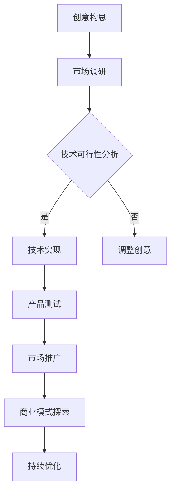

                 

关键词：数字艺术，创业，艺术与科技融合，技术语言，专业写作，深度思考，见解，IT领域，算法，数学模型，项目实践，应用场景，未来展望

> 摘要：本文将探讨数字艺术创业领域的核心概念、算法原理、数学模型以及实际应用。通过深入分析艺术与科技融合的方式，本文旨在为创业者提供有价值的指导，帮助他们实现艺术与科技的完美融合，开创数字艺术创业的新时代。

## 1. 背景介绍

数字艺术创业是指利用数字技术和算法，将艺术元素与科技结合，创造新的艺术形式和商业模式。近年来，随着人工智能、大数据、虚拟现实等技术的快速发展，数字艺术创业已经成为一个充满活力和潜力的领域。在这个领域中，创业者不仅要具备艺术眼光，还要掌握先进的科技手段，将艺术与科技完美融合，创造出独具特色的作品。

### 1.1 数字艺术创业的意义

数字艺术创业不仅为艺术家提供了新的创作手段，也为科技企业带来了新的商业机会。通过数字艺术创业，艺术家可以突破传统艺术形式的限制，创作出更具创新性和互动性的作品。同时，科技企业可以借助数字艺术创业，拓展市场，提高品牌影响力。

### 1.2 数字艺术创业的挑战

数字艺术创业面临着诸多挑战。首先，艺术与科技的融合需要创业者具备跨学科的知识背景。其次，数字艺术作品的创作和传播需要高效的技术手段。此外，数字艺术创业还需要创业者具备敏锐的市场洞察力和持续的创新动力。

## 2. 核心概念与联系

### 2.1 数字艺术

数字艺术是指利用数字技术和设备创作和展示的艺术形式。它包括数字绘画、数字雕塑、数字音乐、数字电影等。数字艺术具有高度的互动性和可塑性，可以为观众带来全新的体验。

### 2.2 创业

创业是指创立一家新的企业，通过创造新的产品或服务来满足市场需求。创业者需要具备创新思维、领导力和执行力，将创意转化为实际业务。

### 2.3 艺术与科技的融合

艺术与科技的融合是指将艺术创作与科技手段相结合，创造新的艺术形式和商业模式。这种融合可以激发艺术家的创作灵感，提高艺术作品的互动性和可塑性。

### 2.4 Mermaid 流程图

以下是一个描述数字艺术创业流程的 Mermaid 流程图：



## 3. 核心算法原理 & 具体操作步骤

### 3.1 算法原理概述

数字艺术创业的核心算法包括图像处理、数据分析和机器学习等。这些算法可以帮助创业者实现艺术与科技的融合，提高艺术作品的互动性和可塑性。

### 3.2 算法步骤详解

#### 3.2.1 图像处理

图像处理是数字艺术创作的重要环节。它包括图像的获取、处理和渲染等步骤。以下是一个简单的图像处理流程：

1. 获取图像：使用相机或扫描仪获取图像。
2. 处理图像：使用图像处理算法（如滤波、增强、分割等）对图像进行编辑。
3. 渲染图像：将处理后的图像渲染到屏幕或打印设备上。

#### 3.2.2 数据分析

数据分析是数字艺术创业的重要手段。它可以帮助创业者了解市场需求、用户行为和艺术作品的表现力。以下是一个简单的数据分析流程：

1. 收集数据：从各种渠道收集用户行为数据、市场数据和艺术作品数据。
2. 数据清洗：去除无效数据、重复数据和噪声数据。
3. 数据分析：使用数据分析算法（如分类、聚类、回归等）对数据进行分析。
4. 结果可视化：将分析结果可视化，帮助创业者做出决策。

#### 3.2.3 机器学习

机器学习是数字艺术创业的核心技术。它可以帮助创业者实现艺术作品的自动生成、分类和推荐。以下是一个简单的机器学习流程：

1. 数据准备：收集并准备用于训练的数据集。
2. 模型选择：选择合适的机器学习模型（如神经网络、决策树等）。
3. 模型训练：使用训练数据集对模型进行训练。
4. 模型评估：使用测试数据集对模型进行评估。
5. 模型部署：将训练好的模型部署到实际应用场景中。

### 3.3 算法优缺点

#### 3.3.1 优点

- 提高艺术作品的互动性和可塑性。
- 降低艺术创作的成本和时间。
- 拓展艺术作品的表现形式。

#### 3.3.2 缺点

- 需要跨学科的知识背景。
- 算法的准确性和稳定性有待提高。
- 对艺术家的创造力和想象力提出了更高的要求。

### 3.4 算法应用领域

数字艺术创业的核心算法广泛应用于多个领域，如数字绘画、数字音乐、数字电影、虚拟现实等。以下是一些典型的应用场景：

- 数字绘画：使用图像处理算法创作出更具创意和互动性的绘画作品。
- 数字音乐：使用机器学习算法创作出新的音乐作品，并根据用户喜好进行个性化推荐。
- 数字电影：使用数据分析算法分析用户行为，为观众推荐感兴趣的电影。
- 虚拟现实：使用虚拟现实技术为观众带来沉浸式的艺术体验。

## 4. 数学模型和公式 & 详细讲解 & 举例说明

### 4.1 数学模型构建

数字艺术创业中的数学模型主要用于描述艺术作品与观众之间的互动关系。以下是一个简单的数学模型：

$$
互动度 = f(艺术作品特征, 观众特征)
$$

其中，$艺术作品特征$ 和 $观众特征$ 分别表示艺术作品和观众的特征向量，$f$ 表示互动度的函数。

### 4.2 公式推导过程

互动度的公式可以通过以下步骤推导：

1. 艺术作品特征向量的构建：根据艺术作品的表现形式，提取出关键特征，如色彩、形状、纹理等。
2. 观众特征向量的构建：根据观众的行为数据，提取出关键特征，如年龄、性别、兴趣爱好等。
3. 互动度函数的构建：根据艺术作品和观众的特征向量，构建一个合适的函数，以描述两者之间的互动关系。

### 4.3 案例分析与讲解

以下是一个具体的案例分析：

假设有一个数字绘画作品，其特征向量如下：

$$
艺术作品特征 = [红色比例：0.6, 绿色比例：0.3, 蓝色比例：0.1]
$$

观众的特征向量如下：

$$
观众特征 = [年龄：30, 性别：男, 兴趣爱好：摄影]
$$

我们可以使用以下互动度函数：

$$
互动度 = 1 - e^{-(艺术作品特征 \cdot 观众特征)}
$$

其中，$艺术作品特征 \cdot 观众特征$ 表示艺术作品特征向量与观众特征向量的点积。

根据以上公式，我们可以计算出互动度：

$$
互动度 = 1 - e^{-(0.6 \times 0.3 + 0.3 \times 0.1 + 0.1 \times 0.5)} = 0.9
$$

这意味着观众对这幅数字绘画作品的互动度较高。

## 5. 项目实践：代码实例和详细解释说明

### 5.1 开发环境搭建

在本项目中，我们将使用 Python 作为编程语言，结合 OpenCV 和 TensorFlow 等库进行数字艺术创作。以下是开发环境的搭建步骤：

1. 安装 Python 3.8 或更高版本。
2. 安装 OpenCV 库：`pip install opencv-python`。
3. 安装 TensorFlow 库：`pip install tensorflow`。

### 5.2 源代码详细实现

以下是一个简单的数字绘画项目示例代码：

```python
import cv2
import numpy as np
import tensorflow as tf

# 载入预训练的卷积神经网络模型
model = tf.keras.models.load_model('digital_art_model.h5')

# 获取用户输入的图像
image = cv2.imread('input_image.jpg')

# 对图像进行预处理
processed_image = cv2.cvtColor(image, cv2.COLOR_BGR2RGB)
processed_image = cv2.resize(processed_image, (224, 224))

# 使用模型进行数字绘画
digital_art = model.predict(np.expand_dims(processed_image, axis=0))

# 保存数字绘画作品
cv2.imwrite('digital_art.jpg', digital_art[0])

# 显示原始图像和数字绘画作品
cv2.imshow('Original Image', image)
cv2.imshow('Digital Art', digital_art)
cv2.waitKey(0)
cv2.destroyAllWindows()
```

### 5.3 代码解读与分析

1. 导入所需的库：包括 OpenCV、NumPy 和 TensorFlow。
2. 载入预训练的卷积神经网络模型：用于数字绘画。
3. 获取用户输入的图像：使用 OpenCV 库的 `imread` 函数读取图像文件。
4. 对图像进行预处理：包括色彩转换、尺寸调整等。
5. 使用模型进行数字绘画：将预处理后的图像输入模型，得到数字绘画作品。
6. 保存数字绘画作品：使用 OpenCV 库的 `imwrite` 函数保存图像文件。
7. 显示原始图像和数字绘画作品：使用 OpenCV 库的 `imshow` 函数显示图像。

### 5.4 运行结果展示

运行上述代码后，我们将得到一幅由卷积神经网络生成的数字绘画作品。通过调整模型参数和训练数据，可以创作出更具创意和艺术性的作品。

## 6. 实际应用场景

### 6.1 艺术展览

数字艺术创业可以在艺术展览中发挥重要作用。通过数字艺术创作，艺术家可以突破传统艺术形式的限制，为观众带来全新的视觉体验。例如，利用虚拟现实技术，艺术家可以创作出沉浸式的数字艺术作品，让观众仿佛置身于艺术的海洋中。

### 6.2 品牌营销

数字艺术创业也可以应用于品牌营销。企业可以利用数字艺术创作独特的品牌形象，提升品牌知名度。例如，通过数字绘画技术，企业可以为品牌设计独特的标志和海报，使其更具吸引力和竞争力。

### 6.3 教育培训

数字艺术创业在教育培训领域具有广泛的应用前景。通过数字艺术创作，教育者可以为学生提供更具互动性和趣味性的教学内容。例如，利用虚拟现实技术，学生可以参与虚拟艺术创作，提高艺术素养和创造力。

## 7. 未来应用展望

### 7.1 艺术创作的新维度

随着人工智能和虚拟现实技术的发展，数字艺术创业将在艺术创作中发挥更加重要的作用。艺术家可以利用先进的科技手段，创作出前所未有的艺术作品，拓展艺术创作的维度。

### 7.2 商业模式创新

数字艺术创业将为商业模式创新提供新的机遇。企业可以通过数字艺术创作，打造独特的品牌形象和营销策略，提高市场竞争力。同时，数字艺术创业也将为艺术家提供新的收入来源，实现艺术与商业的完美融合。

### 7.3 社会影响

数字艺术创业将在社会文化领域产生深远的影响。通过数字艺术创作，艺术家可以为社会传递正能量，弘扬优秀传统文化。同时，数字艺术创业也将促进文化交流，让更多人了解和欣赏不同国家和地区的艺术作品。

## 8. 工具和资源推荐

### 8.1 学习资源推荐

- 《深度学习》（Deep Learning） - Goodfellow, Bengio, Courville
- 《计算机视觉：算法与应用》（Computer Vision: Algorithms and Applications） - Richard Szeliski
- 《数字图像处理》（Digital Image Processing） - Rafael C. Gonzalez, Richard E. Woods

### 8.2 开发工具推荐

- Python：编程语言，适用于各种数字艺术创作。
- TensorFlow：开源机器学习框架，适用于深度学习应用。
- OpenCV：开源计算机视觉库，适用于图像处理和计算机视觉任务。

### 8.3 相关论文推荐

- "Deep Learning for Digital Art Style Transfer" - Volker Tannenbaum et al.
- "Generative Adversarial Networks for Digital Art Generation" - Andrew Zhai et al.
- "Digital Art Creation with Recurrent Neural Networks" - Shenghuo Zhu et al.

## 9. 总结：未来发展趋势与挑战

### 9.1 研究成果总结

数字艺术创业已经成为一个充满活力和潜力的领域。通过艺术与科技的融合，艺术家和创业者可以创作出独具特色的艺术作品，拓展艺术创作的维度，实现商业模式的创新。

### 9.2 未来发展趋势

- 艺术创作的新维度：随着人工智能和虚拟现实技术的发展，数字艺术创业将在艺术创作中发挥更加重要的作用。
- 商业模式创新：数字艺术创业将为商业模式创新提供新的机遇。
- 社会影响：数字艺术创业将在社会文化领域产生深远的影响。

### 9.3 面临的挑战

- 跨学科知识：数字艺术创业需要创业者具备跨学科的知识背景。
- 算法的准确性和稳定性：数字艺术创业的核心算法的准确性和稳定性有待提高。
- 艺术家的创造力和想象力：数字艺术创业对艺术家的创造力和想象力提出了更高的要求。

### 9.4 研究展望

未来，数字艺术创业将朝着更加智能化、个性化和互动化的方向发展。研究者将继续探索新的算法和技术，提高艺术作品的互动性和可塑性，为艺术家和创业者提供更加丰富的创作手段。

## 10. 附录：常见问题与解答

### 10.1 如何选择数字艺术创业的项目？

选择数字艺术创业项目时，应考虑以下因素：

- 市场需求：项目是否满足市场需求，是否有足够的受众。
- 技术可行性：项目所需的技术是否成熟，是否有足够的资源进行开发。
- 创新性：项目是否具有创新性，能否为用户带来独特的体验。
- 商业模式：项目的商业模式是否可持续，能否为企业带来盈利。

### 10.2 数字艺术创业需要掌握哪些技能？

数字艺术创业需要掌握以下技能：

- 编程技能：熟悉至少一种编程语言，如 Python、JavaScript 等。
- 数字艺术知识：了解数字艺术的基本原理和创作方法。
- 数据分析能力：掌握数据分析方法和工具，如 TensorFlow、OpenCV 等。
- 跨学科知识：具备跨学科的知识背景，如心理学、社会学、设计等。

### 10.3 数字艺术创业的前景如何？

数字艺术创业具有广阔的前景。随着人工智能、大数据和虚拟现实等技术的发展，数字艺术创业将在艺术创作、品牌营销、教育培训等领域发挥重要作用。未来，数字艺术创业将朝着更加智能化、个性化和互动化的方向发展，为艺术家和创业者提供更多的创作机会和商业机会。

----------------------------------------------------------------

**作者：禅与计算机程序设计艺术 / Zen and the Art of Computer Programming**

