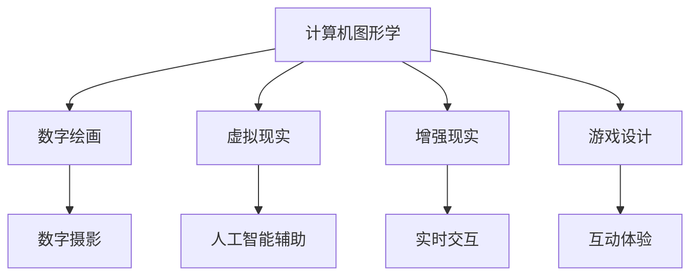

                 

关键词：数字艺术，硅谷，发展前景，技术趋势，创意产业，人工智能

> 摘要：本文将探讨数字艺术在硅谷的发展前景。作为全球科技创新的中心，硅谷正引领着数字艺术的创新与变革。本文将分析数字艺术的定义、发展历程、关键技术和当前的应用，并展望其未来发展趋势。

## 1. 背景介绍

数字艺术是一种利用数字技术和设备创作的艺术形式，包括数字绘画、数字摄影、虚拟现实（VR）、增强现实（AR）、游戏设计等。随着计算机技术和互联网的迅猛发展，数字艺术逐渐成为现代艺术的重要组成部分。

硅谷作为全球科技创新的中心，吸引了大量艺术家、设计师和技术专家。硅谷的企业，如谷歌、苹果、Facebook等，都在数字艺术领域进行投资和研发，推动着数字艺术的创新和发展。硅谷的数字艺术不仅体现在技术创新上，还体现在艺术与科技的深度融合，使得数字艺术成为硅谷文化的一个重要组成部分。

## 2. 核心概念与联系

### 2.1 数字艺术的定义与分类

数字艺术可以定义为利用数字技术创作的艺术作品。根据表现形式，数字艺术可以分为以下几类：

- 数字绘画：使用数字工具创作的绘画作品。
- 数字摄影：使用数字相机拍摄的摄影作品。
- 虚拟现实（VR）：通过计算机技术创造的虚拟环境。
- 增强现实（AR）：在现实环境中叠加数字信息。
- 游戏设计：创建互动式的游戏体验。

### 2.2 数字艺术的发展历程

数字艺术的发展历程可以分为以下几个阶段：

- 初期（20世纪60年代-80年代）：计算机艺术运动的兴起。
- 发展期（20世纪90年代）：互联网的普及，数字艺术的传播。
- 现代期（21世纪初至今）：虚拟现实、增强现实等新技术的应用。

### 2.3 数字艺术与科技的融合

数字艺术与科技的融合体现在以下几个方面：

- 计算机图形学：为数字艺术提供了丰富的创作工具。
- 人工智能：为数字艺术提供了智能化的创作辅助。
- 互联网：为数字艺术的传播提供了广阔的平台。

以下是一个简单的 Mermaid 流程图，展示了数字艺术与科技的关系：



## 3. 核心算法原理 & 具体操作步骤

### 3.1 算法原理概述

数字艺术的创作过程涉及到多种算法，包括图像处理算法、计算机图形算法、机器学习算法等。以下是一些核心算法的原理概述：

- 图像处理算法：用于图像的增强、滤波、边缘检测等。
- 计算机图形算法：用于三维建模、渲染、动画等。
- 机器学习算法：用于图像识别、风格迁移、智能创作等。

### 3.2 算法步骤详解

以机器学习算法中的风格迁移为例，其具体操作步骤如下：

1. **数据准备**：收集大量图像数据，包括目标图像和风格图像。
2. **模型训练**：使用卷积神经网络（CNN）训练一个风格迁移模型。
3. **风格迁移**：将目标图像输入模型，输出风格化图像。
4. **结果评估**：对输出图像进行评估，根据评估结果进行调整。

### 3.3 算法优缺点

- **优点**：
  - **多样性**：算法能够创作出风格多样的艺术作品。
  - **高效性**：算法能够快速生成艺术作品。
  - **创新性**：算法为艺术家提供了新的创作方式。

- **缺点**：
  - **局限性**：算法在某些情况下可能无法达到人类艺术家的创造力。
  - **技术门槛**：算法的实现和应用需要较高的技术背景。

### 3.4 算法应用领域

数字艺术的算法应用领域广泛，包括：

- **艺术创作**：艺术家利用算法进行创作。
- **设计领域**：设计师利用算法进行设计。
- **娱乐行业**：游戏设计师利用算法创建互动式游戏。

## 4. 数学模型和公式 & 详细讲解 & 举例说明

### 4.1 数学模型构建

数字艺术中的许多算法都基于数学模型。以下是一个简单的数学模型，用于图像的边缘检测：

$$
\text{Sobel 边缘检测} = \frac{1}{2}\left(|I_x| + |I_y|\right)
$$

其中，$I_x$ 和 $I_y$ 分别是图像的水平和垂直梯度。

### 4.2 公式推导过程

Sobel 边缘检测算法的推导过程如下：

1. **图像梯度计算**：计算图像的水平和垂直梯度。
2. **梯度幅值计算**：计算梯度幅值。
3. **边缘检测**：使用阈值对梯度幅值进行二值化处理。

### 4.3 案例分析与讲解

以下是一个使用 Sobel 边缘检测算法进行图像处理的案例：

**输入图像：**


**处理结果：**


通过上述处理，我们成功提取出了图像的边缘信息。

## 5. 项目实践：代码实例和详细解释说明

### 5.1 开发环境搭建

为了实践数字艺术算法，我们需要搭建一个开发环境。以下是一个简单的开发环境搭建步骤：

1. **安装 Python**：Python 是数字艺术算法实现的主要语言。
2. **安装 NumPy**：NumPy 是 Python 的科学计算库。
3. **安装 OpenCV**：OpenCV 是图像处理库。

### 5.2 源代码详细实现

以下是一个简单的 Sobel 边缘检测算法的 Python 代码实现：

```python
import cv2
import numpy as np

def sobel_edge_detection(image):
    gray = cv2.cvtColor(image, cv2.COLOR_BGR2GRAY)
    sobel_x = cv2.Sobel(gray, cv2.CV_64F, 1, 0, ksize=3)
    sobel_y = cv2.Sobel(gray, cv2.CV_64F, 0, 1, ksize=3)
    sobel = np.sqrt(sobel_x**2 + sobel_y**2)
    sobel[sobel > 0] = 255
    sobel = sobel.astype(np.uint8)
    return sobel

image = cv2.imread('image.jpg')
result = sobel_edge_detection(image)
cv2.imshow('Result', result)
cv2.waitKey(0)
cv2.destroyAllWindows()
```

### 5.3 代码解读与分析

- `cv2.cvtColor`：用于将 BGR 图像转换为灰度图像。
- `cv2.Sobel`：用于计算图像的水平和垂直梯度。
- `np.sqrt`：用于计算梯度的幅值。
- `cv2.imshow`：用于显示处理结果。

### 5.4 运行结果展示

通过上述代码，我们可以将输入图像进行 Sobel 边缘检测，并显示处理结果。

## 6. 实际应用场景

数字艺术在硅谷的实际应用场景广泛，包括：

- **艺术创作**：艺术家利用数字艺术技术进行创作，如数字绘画、虚拟现实艺术等。
- **设计领域**：设计师利用数字艺术技术进行设计，如建筑可视化、产品渲染等。
- **娱乐行业**：游戏设计师利用数字艺术技术创建互动式游戏。

## 7. 未来应用展望

随着科技的不断发展，数字艺术在硅谷的应用前景将更加广阔。以下是一些未来应用展望：

- **智能创作**：利用人工智能技术进行艺术创作，如风格迁移、图像生成等。
- **虚拟现实与增强现实**：数字艺术将在虚拟现实与增强现实领域发挥更大作用，如虚拟博物馆、沉浸式体验等。
- **跨界融合**：数字艺术与其他领域的融合，如艺术与科技的结合、艺术与商业的结合等。

## 8. 工具和资源推荐

### 8.1 学习资源推荐

- 《数字艺术基础教程》
- 《计算机图形学原理及实践》
- 《机器学习实战》

### 8.2 开发工具推荐

- **Python**：数字艺术开发的主要语言。
- **NumPy**：Python 的科学计算库。
- **OpenCV**：图像处理库。

### 8.3 相关论文推荐

- "A Style-Based Generator Architecture for Generative Adversarial Networks"
- "StyleT2T: A Style-Based Text-to-Image Synthesis Model"
- "Deep Art: A Survey of Deep Learning Techniques for Art Generation"

## 9. 总结：未来发展趋势与挑战

### 9.1 研究成果总结

数字艺术在硅谷取得了显著的研究成果，包括人工智能在艺术创作中的应用、虚拟现实与增强现实技术的发展、图像处理算法的创新等。

### 9.2 未来发展趋势

- **智能创作**：人工智能将在艺术创作中发挥更大作用。
- **跨领域融合**：数字艺术与其他领域的融合将进一步深化。
- **用户体验**：用户体验将更加重要，虚拟现实与增强现实将提供更丰富的互动体验。

### 9.3 面临的挑战

- **技术难题**：算法的改进和技术的突破仍需持续投入。
- **伦理问题**：人工智能创作引发的伦理问题需要深入探讨。
- **市场接受度**：数字艺术的商业化推广和市场接受度仍需提高。

### 9.4 研究展望

未来，数字艺术在硅谷的发展将更加多元化，技术与艺术的结合将更加紧密，为人类创造更多美好的数字艺术作品。

## 10. 附录：常见问题与解答

### 10.1 数字艺术是什么？

数字艺术是一种利用数字技术和设备创作的艺术形式，包括数字绘画、数字摄影、虚拟现实、增强现实、游戏设计等。

### 10.2 数字艺术与绘画有什么区别？

数字艺术与绘画的主要区别在于创作工具和创作方式。数字艺术使用数字工具和设备进行创作，而绘画则使用传统的画笔和颜料。

### 10.3 数字艺术如何应用在设计中？

数字艺术可以应用于建筑设计、产品渲染、品牌设计等领域，为设计师提供更多的创作灵感和工具。

### 10.4 人工智能在数字艺术创作中如何发挥作用？

人工智能可以在数字艺术创作中发挥多种作用，如风格迁移、图像生成、智能辅助等，提高创作效率和质量。

### 10.5 虚拟现实与增强现实如何影响数字艺术？

虚拟现实与增强现实为数字艺术提供了新的表现手段和互动方式，使得艺术家能够创造更沉浸、更互动的艺术体验。

## 作者署名

作者：禅与计算机程序设计艺术 / Zen and the Art of Computer Programming
``` 
----------------------------------------------------------------

在完成这篇长文之后，您可以看到，数字艺术在硅谷的发展前景是一个复杂且充满活力的领域。从历史背景到核心概念，从算法原理到实际应用，再到未来展望，文章的每个部分都力求为读者提供一个全面而深刻的了解。希望这篇文章能够激发读者对数字艺术和其未来发展的兴趣，并为相关领域的研究和实践提供一些有价值的参考。如果您有进一步的问题或需要讨论的议题，欢迎随时提出。禅与计算机程序设计艺术 / Zen and the Art of Computer Programming 祝愿您在数字艺术的探索之旅中取得成功。

