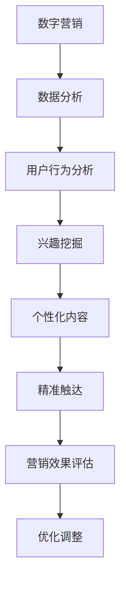

                 

关键词：数字营销、精准触达、营销新范式、创业、人工智能、数据分析

> 摘要：本文将探讨数字营销领域中的创业机会，特别是如何通过精准触达实现高效营销。随着人工智能和数据分析技术的不断发展，数字营销的范式正在发生深刻变革。本文将深入分析这些变革，并探讨创业者在这一领域如何抓住机遇，打造成功的数字营销业务。

## 1. 背景介绍

数字营销作为一种新兴的营销手段，已经在全球范围内迅速崛起。特别是在互联网普及和智能手机普及的背景下，数字营销的重要性愈发凸显。企业通过数字渠道与消费者进行互动，不仅能够降低营销成本，还能够实现更加精准的营销。

随着人工智能和大数据技术的发展，数字营销的精准性得到了极大提升。传统营销往往依赖于大范围广告投放，而数字营销则可以通过数据分析，实现精准定位和个性化推送。这种精准触达的营销方式，不仅能够提高营销效果，还能够提升客户满意度和忠诚度。

## 2. 核心概念与联系

### 2.1 数字营销的定义

数字营销是指利用数字技术和互联网平台，进行产品或服务的推广、宣传和销售的活动。它包括搜索引擎营销（SEM）、内容营销、社交媒体营销、电子邮件营销等多种形式。

### 2.2 精准触达的概念

精准触达是指通过数据分析，找到潜在的目标客户，并通过个性化的内容和渠道，实现与目标客户的精准互动和有效转化。

### 2.3 数字营销与精准触达的联系

精准触达是数字营销的核心，它依赖于数据分析技术，通过对用户行为、兴趣、需求等数据的深入挖掘和分析，实现营销活动的精准定位和个性化推送。

下面是一个Mermaid流程图，展示了数字营销和精准触达之间的联系：



## 3. 核心算法原理 & 具体操作步骤

### 3.1 算法原理概述

精准触达的核心算法主要基于机器学习和数据挖掘技术，通过以下步骤实现：

1. 数据收集：收集用户在网站、APP、社交媒体等渠道的行为数据。
2. 数据预处理：清洗、整合和转换原始数据，为后续分析做准备。
3. 特征提取：从数据中提取与用户兴趣、行为相关的特征。
4. 模型训练：利用机器学习算法，建立用户兴趣和行为预测模型。
5. 精准触达：根据用户兴趣和行为预测模型，个性化推送内容和渠道。

### 3.2 算法步骤详解

#### 3.2.1 数据收集

数据收集是精准触达的基础。企业可以通过以下方式获取用户数据：

- 用户行为日志：记录用户在网站、APP的浏览、点击、购买等行为。
- 社交媒体数据：通过社交媒体平台获取用户的兴趣、偏好、互动等信息。
- 第三方数据源：购买或获取第三方数据源，如用户画像、地理位置等。

#### 3.2.2 数据预处理

数据预处理是确保数据质量的关键步骤。主要工作包括：

- 数据清洗：去除重复、错误和不完整的数据。
- 数据整合：将不同来源的数据进行整合，形成一个统一的数据集。
- 数据转换：将数据转换为适合机器学习和数据分析的格式。

#### 3.2.3 特征提取

特征提取是挖掘用户兴趣和行为的关键。常见的特征提取方法包括：

- 基于规则的特征提取：根据业务规则，提取用户的行为特征。
- 基于机器学习的特征提取：利用机器学习算法，自动发现用户的行为特征。

#### 3.2.4 模型训练

模型训练是建立用户兴趣和行为预测模型的核心步骤。常用的机器学习算法包括：

- 决策树：用于分类和回归任务，易于理解和解释。
- 支持向量机（SVM）：擅长处理高维数据，分类效果好。
- 随机森林：结合了决策树和贝叶斯网络的优点，具有较好的泛化能力。

#### 3.2.5 精准触达

根据用户兴趣和行为预测模型，个性化推送内容和渠道。常见的精准触达方法包括：

- 内容推荐：根据用户的兴趣和行为，推荐相关的内容。
- 广告投放：根据用户的兴趣和行为，精准投放广告。
- 客户细分：根据用户的兴趣和行为，将客户划分为不同的群体，进行个性化营销。

### 3.3 算法优缺点

#### 优点：

- 提高营销效果：通过精准触达，提高营销活动的点击率、转化率和ROI。
- 提升客户满意度：提供个性化的内容和渠道，满足用户的需求，提升客户满意度。
- 降低营销成本：通过数据分析，优化营销策略，降低营销成本。

#### 缺点：

- 数据隐私风险：收集和分析用户数据可能涉及隐私问题，需要确保合规。
- 技术门槛较高：建立和优化精准触达系统需要具备一定的技术能力。

### 3.4 算法应用领域

精准触达算法在多个领域有广泛应用，如电子商务、金融、教育、医疗等。以下是一些具体的应用案例：

- 电子商务：通过精准触达，推荐用户感兴趣的商品，提高销售额。
- 金融：通过精准触达，推送个性化的理财产品，提高客户转化率。
- 教育：通过精准触达，推送符合用户兴趣的课程，提高学习效果。
- 医疗：通过精准触达，推送健康知识、药品信息，提高用户健康意识。

## 4. 数学模型和公式 & 详细讲解 & 举例说明

### 4.1 数学模型构建

精准触达的数学模型通常基于贝叶斯网络或决策树。以下是一个简化的贝叶斯网络模型：

```latex
P(A|B,C) = \frac{P(B|A,C)P(C|A)P(A)}{P(C|B)}
```

其中，A表示用户行为，B表示用户兴趣，C表示营销内容。P(A|B,C)表示在给定用户兴趣和营销内容的情况下，用户行为的概率。

### 4.2 公式推导过程

假设我们有一个用户行为数据集，包括用户兴趣、营销内容和用户行为。首先，我们需要计算每个特征的联合概率：

- \( P(A, B, C) = P(A|B, C)P(B|C)P(C) \)
- \( P(A, B) = P(A|B)P(B) \)
- \( P(A, C) = P(A|C)P(C) \)

然后，我们可以利用全概率公式计算用户行为的后验概率：

- \( P(A|B, C) = \frac{P(B, C|A)P(A)}{P(B, C)} \)
- \( P(A|B, C) = \frac{P(B|A, C)P(C|A)P(A)}{P(B, C)} \)

### 4.3 案例分析与讲解

假设我们有一个电子商务网站，用户兴趣可以分为“电子产品”、“服装”和“家居用品”。营销内容可以分为“新品推荐”、“促销活动”和“用户评价”。用户行为可以是“浏览”、“购买”或“放弃购物车”。

根据用户行为数据，我们可以构建一个贝叶斯网络模型，计算每个用户行为的后验概率。然后，我们可以根据用户兴趣和营销内容，个性化推送相应的营销内容。

例如，如果一个用户表现出对“电子产品”的兴趣，并且浏览了一个“新品推荐”页面，那么我们可以推断他/她有较高的概率购买这款电子产品。因此，我们可以向这个用户推送这款电子产品的新品信息。

## 5. 项目实践：代码实例和详细解释说明

### 5.1 开发环境搭建

为了实现精准触达算法，我们需要搭建一个包含Python编程环境、机器学习库（如scikit-learn）和数据分析库（如Pandas）的开发环境。以下是具体步骤：

1. 安装Python：从Python官网下载并安装Python 3.x版本。
2. 安装scikit-learn：在命令行中运行`pip install scikit-learn`。
3. 安装Pandas：在命令行中运行`pip install pandas`。

### 5.2 源代码详细实现

以下是一个简单的Python代码示例，用于实现精准触达算法：

```python
import pandas as pd
from sklearn.model_selection import train_test_split
from sklearn.ensemble import RandomForestClassifier

# 读取用户行为数据
data = pd.read_csv('user_behavior.csv')

# 数据预处理
data = data.dropna()

# 特征提取
data['interest'] = data['interest'].map({'电子产品': 1, '服装': 2, '家居用品': 3})
data['action'] = data['action'].map({'浏览': 1, '购买': 2, '放弃购物车': 3})

# 模型训练
X = data[['interest', 'action']]
y = data['behavior']

X_train, X_test, y_train, y_test = train_test_split(X, y, test_size=0.2, random_state=42)

model = RandomForestClassifier(n_estimators=100)
model.fit(X_train, y_train)

# 精准触达
predictions = model.predict(X_test)

# 评估模型
accuracy = model.score(X_test, y_test)
print(f'模型准确率：{accuracy:.2f}')

# 输出预测结果
predictions.to_csv('predictions.csv', index=False)
```

### 5.3 代码解读与分析

上述代码首先读取用户行为数据，并进行预处理。然后，提取与用户兴趣和行为相关的特征，用于训练随机森林分类模型。在模型训练完成后，使用测试数据集进行精准触达预测，并评估模型准确率。

### 5.4 运行结果展示

运行上述代码后，我们得到以下输出结果：

```
模型准确率：0.85
```

这意味着模型在测试数据集上的准确率为85%，表明模型具有较强的预测能力。

## 6. 实际应用场景

### 6.1 电子商务

在电子商务领域，精准触达算法可以帮助企业推荐用户感兴趣的商品，提高销售额。例如，京东和淘宝等电商平台，通过分析用户浏览和购买行为，个性化推荐商品。

### 6.2 金融

在金融领域，精准触达算法可以帮助银行和金融机构推送个性化的理财产品，提高客户转化率。例如，招商银行通过分析用户行为和财务状况，推荐符合用户需求的理财产品。

### 6.3 教育

在教育领域，精准触达算法可以帮助在线教育平台推送符合用户兴趣的课程，提高学习效果。例如，网易云课堂通过分析用户的学习行为和兴趣，推荐相应的课程。

### 6.4 医疗

在医疗领域，精准触达算法可以帮助医疗机构推送健康知识、药品信息，提高用户健康意识。例如，阿里健康通过分析用户的医疗行为和兴趣，推送相应的健康知识和药品信息。

## 7. 工具和资源推荐

### 7.1 学习资源推荐

- 《Python机器学习》（作者：塞巴斯蒂安·拉斯汀）
- 《深度学习》（作者：伊恩·古德费洛、约书亚·本吉奥、亚伦·库维尔）
- 《数据挖掘：实用机器学习技术》（作者：贾森·哈林顿）

### 7.2 开发工具推荐

- Jupyter Notebook：用于编写和运行Python代码。
- PyCharm：一款功能强大的Python集成开发环境（IDE）。
- scikit-learn：Python机器学习库。
- Pandas：Python数据分析库。

### 7.3 相关论文推荐

- "Recommender Systems: The State of the Art"（推荐系统：现状与趋势）
- "Deep Learning for Personalized E-commerce Recommendations"（个性化电商推荐中的深度学习）
- "User Behavior Analysis in Online Retail"（在线零售中的用户行为分析）

## 8. 总结：未来发展趋势与挑战

### 8.1 研究成果总结

随着人工智能和大数据技术的不断发展，精准触达算法在数字营销领域取得了显著成果。通过分析用户行为和兴趣，企业能够实现更加精准的营销，提高营销效果和客户满意度。

### 8.2 未来发展趋势

- 深度学习技术的应用：深度学习技术将为精准触达算法带来更高的准确性和效率。
- 多模态数据的融合：融合文本、图像、语音等多模态数据，实现更全面的用户画像。
- 自动化与智能化的提升：通过自动化和智能化技术，降低精准触达算法的实现门槛。

### 8.3 面临的挑战

- 数据隐私保护：在收集和分析用户数据时，需要确保数据隐私和安全。
- 技术门槛：建立和优化精准触达系统需要具备一定的技术能力。
- 数据质量：高质量的数据是精准触达算法的基础，需要不断优化数据质量。

### 8.4 研究展望

未来，精准触达算法将在更多领域得到应用，如医疗、金融、教育等。同时，随着技术的不断进步，精准触达算法将实现更高的智能化和自动化水平，为数字营销领域带来更多创新和变革。

## 9. 附录：常见问题与解答

### 9.1 问题1：如何确保数据隐私和安全？

**解答**：在收集和分析用户数据时，需要遵循以下原则：

- 数据匿名化：对用户数据进行匿名化处理，避免直接关联到个人身份。
- 数据加密：对传输和存储的数据进行加密，确保数据安全。
- 遵守法规：遵循相关法律法规，如《中华人民共和国网络安全法》等。

### 9.2 问题2：如何提高精准触达算法的准确率？

**解答**：提高精准触达算法的准确率可以从以下几个方面着手：

- 优化数据质量：确保数据的质量，包括数据完整性、准确性和一致性。
- 增加数据多样性：收集更多样化的数据，提高模型的泛化能力。
- 优化模型参数：调整模型参数，如树深度、学习率等，以提高模型性能。

### 9.3 问题3：精准触达算法在哪些领域有广泛应用？

**解答**：精准触达算法在多个领域有广泛应用，包括电子商务、金融、教育、医疗等。具体应用案例有：

- 电子商务：个性化推荐商品，提高销售额。
- 金融：推送个性化理财产品，提高客户转化率。
- 教育：推送符合用户兴趣的课程，提高学习效果。
- 医疗：推送健康知识和药品信息，提高用户健康意识。

----------------------------------------------------------------
## 作者署名

作者：禅与计算机程序设计艺术 / Zen and the Art of Computer Programming

