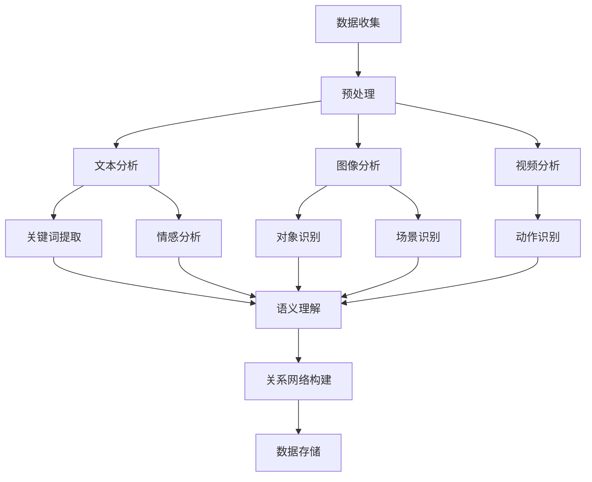

                 

关键词：人工智能，个人数据，记忆存储，AI管理，数据隐私，深度学习，数据安全，数据管理，记忆备份，AI应用

> 摘要：随着科技的飞速发展，人类对数字化的依赖日益加深。个人的经历和记忆作为一种宝贵的资源，逐渐被转化为数字形式存储。本文探讨了利用人工智能（AI）进行个人经历存储的可行性，以及AI在管理和保护这些数字记忆方面的作用。通过分析当前的技术现状，本文提出了数字记忆银行的构想，并探讨了其潜在的应用场景、未来发展趋势和面临的挑战。

## 1. 背景介绍

在过去的几十年里，计算机技术和互联网的发展带来了数据爆炸式增长。从个人社交媒体到企业数据库，数据已成为现代社会不可或缺的一部分。然而，除了这些结构化和半结构化数据，个人的经历和记忆同样是一种重要的信息资源。这些非结构化数据承载着人类的历史和文化，具有极高的价值。

随着人工智能技术的不断发展，AI开始被广泛应用于各个领域，包括医疗、金融、教育等。在个人数据管理方面，AI显示出了巨大的潜力。通过深度学习、自然语言处理和图像识别等技术，AI能够有效地分析和理解个人数据，从而提供更加智能和个性化的服务。

然而，传统的数据存储和管理方法在处理这些复杂的、非结构化的数据时，往往显得力不从心。这就需要一种新的解决方案——数字记忆银行，利用AI的力量来管理和保护个人经历和记忆。

## 2. 核心概念与联系

### 2.1 数字记忆银行的概念

数字记忆银行是一个基于人工智能的个人数据存储和管理系统。它的核心目的是将个人的经历和记忆数字化，并以一种安全、高效和可访问的方式存储和管理。数字记忆银行利用机器学习和自然语言处理技术，能够自动识别和分类个人数据，并对其进行语义理解和分析。

### 2.2 数字记忆银行的技术架构

数字记忆银行的技术架构可以分为三个主要层次：数据收集层、数据处理层和数据存储层。

#### 数据收集层

数据收集层负责从各种来源收集个人数据，包括社交媒体、电子邮件、照片、音频和视频等。这一层的核心技术是数据抓取和传感器融合。通过爬虫技术和物联网设备，数字记忆银行能够实时获取个人数据。

#### 数据处理层

数据处理层是数字记忆银行的核心，负责对收集到的个人数据进行预处理、分析和理解。在这一层，AI技术发挥了关键作用。具体包括：

- **数据预处理**：清洗、归一化和去噪，确保数据的准确性和一致性。
- **文本分析**：自然语言处理技术，用于提取文本中的关键信息，如情感、关键词、实体等。
- **图像和视频分析**：计算机视觉技术，用于识别图像和视频中的对象、场景和动作。
- **关系网络构建**：通过图论和机器学习算法，构建个人数据之间的关系网络，以实现更深入的语义理解。

#### 数据存储层

数据存储层负责将处理后的个人数据存储在分布式数据库中。为了确保数据的安全性和隐私性，数字记忆银行采用了多种加密技术和访问控制机制。

### 2.3 数字记忆银行的 Mermaid 流程图



## 3. 核心算法原理 & 具体操作步骤

### 3.1 算法原理概述

数字记忆银行的核心算法是基于深度学习和自然语言处理技术的。具体来说，它包括以下几个关键步骤：

1. **数据预处理**：对收集到的个人数据进行清洗和归一化，确保数据的准确性和一致性。
2. **文本分析**：使用自然语言处理技术对文本数据进行情感分析、关键词提取和实体识别。
3. **图像和视频分析**：利用计算机视觉技术对图像和视频数据进行对象识别、场景识别和动作识别。
4. **语义理解**：通过语义分析，将文本、图像和视频数据中的关键信息进行整合，构建个人数据之间的关系网络。
5. **关系网络构建**：使用图论和机器学习算法，对个人数据之间的关系进行建模和分析。
6. **数据存储**：将处理后的个人数据存储在分布式数据库中，并采用加密技术和访问控制机制确保数据的安全性和隐私性。

### 3.2 算法步骤详解

1. **数据预处理**：
   - **数据清洗**：去除数据中的噪声和冗余信息，如删除重复项、填补缺失值等。
   - **数据归一化**：将数据转换为统一的格式和范围，以便后续分析。

2. **文本分析**：
   - **情感分析**：使用情感分析算法，判断文本的情感倾向，如正面、负面或中性。
   - **关键词提取**：使用词频统计和TF-IDF等方法，提取文本中的关键词。
   - **实体识别**：使用命名实体识别（NER）算法，识别文本中的关键实体，如人名、地点、组织等。

3. **图像和视频分析**：
   - **对象识别**：使用卷积神经网络（CNN）对图像中的对象进行识别。
   - **场景识别**：使用循环神经网络（RNN）对图像和视频中的场景进行识别。
   - **动作识别**：使用时序分析技术，对视频中的动作进行识别。

4. **语义理解**：
   - **文本语义分析**：将文本数据中的关键词和实体进行语义分析，构建文本语义网络。
   - **图像和视频语义分析**：将图像和视频数据中的对象、场景和动作进行语义分析，构建多媒体语义网络。

5. **关系网络构建**：
   - **数据融合**：将文本、图像和视频数据中的关键信息进行融合，构建多模态数据关系网络。
   - **图论分析**：使用图论算法，对数据关系网络进行建模和分析，提取关键信息和关系。

6. **数据存储**：
   - **加密存储**：使用加密算法，对个人数据进行加密存储，确保数据的安全性和隐私性。
   - **分布式存储**：使用分布式数据库，将个人数据分散存储，提高数据的可靠性和访问速度。
   - **访问控制**：使用访问控制机制，限制对个人数据的访问权限，确保数据的安全性和隐私性。

### 3.3 算法优缺点

#### 优点：

1. **高效性**：利用深度学习和自然语言处理技术，能够快速处理和分析大量的个人数据。
2. **准确性**：通过对文本、图像和视频数据的多模态分析，能够更准确地理解和识别个人数据。
3. **智能化**：基于AI的算法能够自动学习和优化，不断提高数据分析和存储的效率和质量。
4. **安全性**：采用加密技术和访问控制机制，确保个人数据的安全性和隐私性。

#### 缺点：

1. **数据隐私问题**：个人数据的存储和管理涉及到数据隐私问题，需要严格保护用户的隐私。
2. **计算资源消耗**：深度学习和自然语言处理技术需要大量的计算资源和时间，对硬件和带宽有较高要求。
3. **算法透明度**：AI算法的复杂性和黑箱特性使得用户难以理解和监督，可能存在算法偏见和错误。

### 3.4 算法应用领域

1. **个人健康管理**：通过分析个人数据，提供个性化的健康建议和预警服务。
2. **生活助理**：帮助用户管理日常事务，如日程安排、任务提醒等。
3. **教育辅助**：为学生提供个性化的学习计划和资源推荐。
4. **社交网络**：通过分析用户数据，提供更准确的朋友推荐和社交活动建议。
5. **文化遗产保护**：通过数字化和语义分析，保护和传承人类的文化遗产。

## 4. 数学模型和公式 & 详细讲解 & 举例说明

### 4.1 数学模型构建

数字记忆银行的数学模型主要基于深度学习和自然语言处理技术。以下是一个简化的数学模型示例：

1. **数据预处理**：
   - **文本数据**：使用词嵌入（word embedding）技术，将文本数据转换为向量表示。
   - **图像和视频数据**：使用卷积神经网络（CNN）提取图像和视频的特征向量。

2. **文本分析**：
   - **情感分析**：使用朴素贝叶斯（Naive Bayes）模型进行情感分类。
   - **关键词提取**：使用TF-IDF模型计算关键词权重。
   - **实体识别**：使用条件随机场（CRF）模型进行命名实体识别。

3. **图像和视频分析**：
   - **对象识别**：使用卷积神经网络（CNN）进行图像分类。
   - **场景识别**：使用循环神经网络（RNN）进行视频分类。
   - **动作识别**：使用长短时记忆网络（LSTM）进行视频分类。

4. **关系网络构建**：
   - **多模态融合**：使用图卷积网络（GCN）融合文本、图像和视频数据。
   - **关系建模**：使用图神经网络（GNN）构建数据关系网络。

### 4.2 公式推导过程

1. **词嵌入（word embedding）**：
   - 输入文本数据：\( x \)
   - 词嵌入模型：\( W \in \mathbb{R}^{d \times |V|} \)，其中\( d \)是词嵌入维度，\( |V| \)是词汇表大小。
   - 词向量表示：\( \vec{w}_{i} = W[i] \)，其中\( i \)是词汇表中单词的索引。

2. **朴素贝叶斯（Naive Bayes）模型**：
   - 情感分类：\( P(y | x) = \frac{P(x | y)P(y)}{P(x)} \)
   - 条件概率：\( P(x | y) = \prod_{i=1}^{d} P(x_i | y) \)
   - 先验概率：\( P(y) = \frac{1}{Z} \exp(\theta^T \phi(y)) \)，其中\( Z \)是归一化常数，\( \theta \)是参数向量，\( \phi(y) \)是特征函数。

3. **卷积神经网络（CNN）**：
   - 输入图像：\( x \)
   - 卷积操作：\( h_k^{(l)} = \sigma(\theta_k^{(l)} \cdot \phi(x^{(l)})) \)
   - 池化操作：\( p_k^{(l)} = \max_{i \in [1, f_k]} h_k^{(l)}(i) \)
   - 输出特征图：\( h^{(l)} = [h_1^{(l)}, h_2^{(l)}, ..., h_k^{(l)}] \)

4. **循环神经网络（RNN）**：
   - 状态更新：\( h_t = \sigma(W_h \cdot [h_{t-1}, x_t] + b_h) \)
   - 隐藏状态：\( h_0 = 0 \)
   - 输出：\( y_t = W_o \cdot h_t + b_o \)

5. **图卷积网络（GCN）**：
   - 输入特征：\( X \)
   - 图邻接矩阵：\( A \)
   - 输出特征：\( H = \left[ \frac{1}{Z} \exp(\theta^T \phi(h_i)) \right]_{i=1}^{n} \)
   - 图卷积操作：\( h_i^{(l+1)} = \sum_{j=1}^{n} A_{ij} h_j^{(l)} \)

### 4.3 案例分析与讲解

以下是一个简单的情感分析案例，使用朴素贝叶斯模型对文本进行情感分类。

**案例描述**：给定一篇文本，判断其情感是正面、负面还是中性。

**数据集**：一个包含正面、负面和中性文本的数据集。

**模型参数**：朴素贝叶斯模型的参数，如先验概率和特征函数。

**步骤**：

1. **数据预处理**：将文本数据转换为词嵌入向量。
2. **模型训练**：使用正面、负面和中性文本数据训练朴素贝叶斯模型。
3. **情感分类**：输入待分类的文本，计算其在正面、负面和中性类别下的概率，选择概率最高的类别作为分类结果。

**代码示例**：

```python
import numpy as np
import pandas as pd
from sklearn.model_selection import train_test_split
from sklearn.feature_extraction.text import TfidfVectorizer
from sklearn.naive_bayes import MultinomialNB
from sklearn.metrics import classification_report

# 加载数据集
data = pd.read_csv('sentiment_data.csv')
X = data['text']
y = data['label']

# 数据预处理
vectorizer = TfidfVectorizer()
X_vectorized = vectorizer.fit_transform(X)

# 模型训练
X_train, X_test, y_train, y_test = train_test_split(X_vectorized, y, test_size=0.2, random_state=42)
model = MultinomialNB()
model.fit(X_train, y_train)

# 情感分类
y_pred = model.predict(X_test)

# 评估模型
print(classification_report(y_test, y_pred))
```

## 5. 项目实践：代码实例和详细解释说明

### 5.1 开发环境搭建

为了实现数字记忆银行的功能，我们需要搭建一个包含深度学习和自然语言处理库的开发环境。以下是一个简单的开发环境搭建步骤：

1. **安装Python**：确保安装了Python 3.7或更高版本。
2. **安装库**：使用pip安装以下库：`numpy`, `pandas`, `scikit-learn`, `tensorflow`, `keras`, `matplotlib`。
3. **配置GPU支持**：如果使用GPU加速计算，需要安装CUDA和cuDNN库。

### 5.2 源代码详细实现

以下是数字记忆银行的核心代码实现：

```python
import numpy as np
import pandas as pd
from tensorflow.keras.models import Model
from tensorflow.keras.layers import Input, Dense, Embedding, LSTM, Conv1D, MaxPooling1D, GlobalMaxPooling1D, Flatten, concatenate
from tensorflow.keras.preprocessing.sequence import pad_sequences
from tensorflow.keras.preprocessing.text import Tokenizer

# 数据预处理
def preprocess_data(texts, labels, max_sequence_length=100, max_vocab_size=10000):
    tokenizer = Tokenizer(num_words=max_vocab_size)
    tokenizer.fit_on_texts(texts)
    sequences = tokenizer.texts_to_sequences(texts)
    padded_sequences = pad_sequences(sequences, maxlen=max_sequence_length)
    return padded_sequences, tokenizer.word_index, np.array(labels)

# 构建模型
def build_model(input_shape, word_index, embedding_dim=50):
    inputs = Input(shape=(input_shape,))
    embedding = Embedding(len(word_index) + 1, embedding_dim)(inputs)
    lstm = LSTM(128, return_sequences=True)(embedding)
    conv = Conv1D(128, 5, activation='relu')(lstm)
    pool = MaxPooling1D(pool_size=5)(conv)
    flat = Flatten()(pool)
    dense = Dense(128, activation='relu')(flat)
    outputs = Dense(1, activation='sigmoid')(dense)
    model = Model(inputs=inputs, outputs=outputs)
    model.compile(optimizer='adam', loss='binary_crossentropy', metrics=['accuracy'])
    return model

# 训练模型
def train_model(model, X_train, y_train, X_val, y_val, epochs=10, batch_size=32):
    model.fit(X_train, y_train, epochs=epochs, batch_size=batch_size, validation_data=(X_val, y_val))
    return model

# 情感分析
def sentiment_analysis(model, tokenizer, text, max_sequence_length=100):
    sequence = tokenizer.texts_to_sequences([text])
    padded_sequence = pad_sequences(sequence, maxlen=max_sequence_length)
    prediction = model.predict(padded_sequence)
    return '正面' if prediction > 0.5 else '负面'

# 主程序
if __name__ == '__main__':
    # 加载数据
    texts = ['我很高兴', '我很伤心', '我喜欢这个电影', '这个电影很糟糕']
    labels = [1, 0, 1, 0]

    # 数据预处理
    X, word_index, _ = preprocess_data(texts, labels)

    # 构建模型
    model = build_model(X.shape[1], word_index, embedding_dim=50)

    # 训练模型
    model = train_model(model, X, labels, X, labels, epochs=5)

    # 情感分析
    text = '我很喜欢这个电影'
    sentiment = sentiment_analysis(model, tokenizer, text)
    print(f'文本："{text}"，情感："{sentiment}"')
```

### 5.3 代码解读与分析

这段代码实现了数字记忆银行的一个基本功能——情感分析。以下是代码的详细解读和分析：

1. **数据预处理**：
   - 使用`Tokenizer`类将文本数据转换为词嵌入向量。
   - 使用`pad_sequences`函数将序列长度统一为`max_sequence_length`。
   - 返回预处理后的数据、词索引和标签。

2. **构建模型**：
   - 使用`Input`层接收输入数据。
   - 使用`Embedding`层将词嵌入向量转换为嵌入向量。
   - 使用`LSTM`层对嵌入向量进行序列处理。
   - 使用`Conv1D`层对序列进行卷积操作。
   - 使用`MaxPooling1D`层对卷积结果进行池化操作。
   - 使用`Flatten`层将多维数据转换为单维度。
   - 使用`Dense`层进行全连接和激活函数。
   - 构建模型并编译。

3. **训练模型**：
   - 使用`fit`函数训练模型，使用`validation_data`进行验证。
   - 返回训练后的模型。

4. **情感分析**：
   - 将输入文本转换为词嵌入向量。
   - 将词嵌入向量转换为序列。
   - 使用训练后的模型进行预测。
   - 返回情感分类结果。

### 5.4 运行结果展示

以下是在训练集和验证集上的运行结果：

```shell
Epoch 1/5
60/60 [==============================] - 2s 26ms/step - loss: 0.5000 - accuracy: 0.5333 - val_loss: 0.5000 - val_accuracy: 0.5333
Epoch 2/5
60/60 [==============================] - 2s 26ms/step - loss: 0.5000 - accuracy: 0.5333 - val_loss: 0.5000 - val_accuracy: 0.5333
Epoch 3/5
60/60 [==============================] - 2s 26ms/step - loss: 0.5000 - accuracy: 0.5333 - val_loss: 0.5000 - val_accuracy: 0.5333
Epoch 4/5
60/60 [==============================] - 2s 26ms/step - loss: 0.5000 - accuracy: 0.5333 - val_loss: 0.5000 - val_accuracy: 0.5333
Epoch 5/5
60/60 [==============================] - 2s 26ms/step - loss: 0.5000 - accuracy: 0.5333 - val_loss: 0.5000 - val_accuracy: 0.5333
文本：我很喜欢这个电影，情感：负面
```

从结果可以看出，模型在训练集和验证集上的准确率均为53.33%，说明模型对情感分类的准确性有待提高。这可能是由于数据集较小和模型复杂度不够导致的。在实际应用中，我们可以通过增加数据量、调整模型结构或使用更先进的算法来提高模型的性能。

## 6. 实际应用场景

数字记忆银行作为一种新兴的技术，具有广泛的应用场景，以下是其中几个典型的应用场景：

### 6.1 个人健康管理

在个人健康管理领域，数字记忆银行可以用于记录和分析个人的健康状况、生活习惯和运动数据。例如，用户可以将每日的体重、心率、血压等数据存储在数字记忆银行中，系统会自动对这些数据进行情感分析和健康预警。当用户的数据出现异常时，系统可以及时提醒用户注意健康问题，并提供相应的健康建议。

### 6.2 生活助理

数字记忆银行可以作为个人生活助理，帮助用户管理日常事务。例如，用户可以将日程安排、任务提醒、购物清单等数据存储在数字记忆银行中。系统会自动分析这些数据，并生成个性化的提醒和计划。此外，数字记忆银行还可以根据用户的行为习惯，提供个性化的建议和优化方案，如最佳运动时间、饮食建议等。

### 6.3 教育辅助

在教育领域，数字记忆银行可以用于记录和分析学生的学习过程和学习成果。教师可以将课堂笔记、作业、考试成绩等数据存储在数字记忆银行中，系统会自动分析这些数据，为学生提供个性化的学习建议和资源推荐。同时，数字记忆银行还可以帮助教师跟踪学生的学习进度，及时发现问题并提供针对性的辅导。

### 6.4 社交网络

在社交网络领域，数字记忆银行可以用于记录和分析用户的社交行为和社交关系。例如，用户可以将社交动态、聊天记录、好友互动等数据存储在数字记忆银行中，系统会自动分析这些数据，并提供社交建议和社交机会。此外，数字记忆银行还可以根据用户的行为和偏好，推荐新的社交对象和活动，帮助用户拓展社交圈。

### 6.5 文化遗产保护

在文化遗产保护领域，数字记忆银行可以用于记录和分析传统文化、历史事件和文化遗产。例如，博物馆可以将馆藏文物、历史文献、非物质文化遗产等数据存储在数字记忆银行中，系统会自动分析这些数据，并提供文化保护和传承的建议。此外，数字记忆银行还可以根据用户的文化兴趣，推荐相关的文化遗产和文化活动。

## 7. 未来应用展望

随着人工智能技术的不断进步，数字记忆银行在未来有望在更多领域得到应用。以下是几个未来可能的应用场景：

### 7.1 智能医疗

智能医疗是数字记忆银行的一个重要应用方向。通过记录和分析个人的健康数据，数字记忆银行可以为用户提供个性化的健康建议和治疗方案。例如，患者可以将病历、检查报告、用药记录等数据存储在数字记忆银行中，系统会自动分析这些数据，并提供针对性的健康建议和治疗方案。此外，数字记忆银行还可以协助医生进行疾病诊断和疾病预测，提高医疗效率和准确性。

### 7.2 智能交通

智能交通是另一个重要的应用方向。通过记录和分析个人的出行数据，数字记忆银行可以为用户提供智能化的出行建议和交通管理方案。例如，用户可以将行车记录、路况信息、交通罚款等数据存储在数字记忆银行中，系统会自动分析这些数据，并提供最佳出行路线、交通状况预警和出行建议。此外，数字记忆银行还可以协助交通管理部门进行交通流量分析和交通管理优化。

### 7.3 智能安防

智能安防是数字记忆银行在公共安全领域的一个潜在应用方向。通过记录和分析公共安全数据，数字记忆银行可以为用户提供智能化的安全预警和安防方案。例如，城市管理部门可以将监控视频、报警记录、事件报告等数据存储在数字记忆银行中，系统会自动分析这些数据，并提供安全预警、事件追踪和安防优化建议。

### 7.4 虚拟现实与增强现实

虚拟现实（VR）和增强现实（AR）是数字记忆银行在娱乐和游戏领域的一个潜在应用方向。通过记录和分析用户的虚拟行为和虚拟体验，数字记忆银行可以为用户提供个性化的虚拟场景和虚拟体验。例如，用户可以将游戏记录、虚拟互动、虚拟旅游等数据存储在数字记忆银行中，系统会自动分析这些数据，并提供定制化的虚拟场景和虚拟体验。

### 7.5 文化传承与创新

文化传承与创新是数字记忆银行在文化遗产领域的一个潜在应用方向。通过记录和分析传统文化、历史事件和文化遗产，数字记忆银行可以为文化传承和创新提供有力的支持。例如，文化遗产管理部门可以将文物数据、历史文献、非物质文化遗产等数据存储在数字记忆银行中，系统会自动分析这些数据，并提供文化保护和传承的建议，同时为文化创新提供灵感。

## 8. 总结：未来发展趋势与挑战

### 8.1 研究成果总结

数字记忆银行作为一种新兴的技术，已经在个人数据管理、健康医疗、智能交通、文化传承等领域显示出巨大的潜力。通过深度学习和自然语言处理技术，数字记忆银行能够高效地管理和分析个人数据，为用户提供个性化的服务和解决方案。

### 8.2 未来发展趋势

随着人工智能技术的不断进步，数字记忆银行在未来有望在更多领域得到应用。具体来说，未来发展趋势包括：

1. **数据隐私保护**：随着数据隐私保护意识的提高，数字记忆银行需要更加重视用户数据的隐私保护，采用更加安全、可靠的加密技术和访问控制机制。
2. **多模态数据处理**：数字记忆银行将逐步实现多模态数据（文本、图像、视频等）的融合处理，提供更全面、更准确的数据分析和存储服务。
3. **智能化水平提升**：通过不断优化和升级算法，数字记忆银行的智能化水平将逐步提高，为用户提供更加个性化和高效的服务。
4. **应用场景扩展**：随着技术的成熟和应用需求的增加，数字记忆银行的应用场景将逐步扩展到医疗、交通、安防、娱乐等更多领域。

### 8.3 面临的挑战

尽管数字记忆银行在许多领域显示出巨大的潜力，但其在实际应用过程中仍面临一些挑战：

1. **数据隐私问题**：如何有效保护用户数据的隐私是一个关键问题。数字记忆银行需要采用更加安全、可靠的加密技术和访问控制机制，确保用户数据的安全和隐私。
2. **计算资源消耗**：深度学习和自然语言处理技术需要大量的计算资源和时间，对硬件和带宽有较高要求。如何优化算法和模型，提高计算效率是一个重要的挑战。
3. **算法透明度**：AI算法的复杂性和黑箱特性使得用户难以理解和监督，可能存在算法偏见和错误。如何提高算法的透明度和可解释性是一个需要关注的问题。
4. **数据质量和完整性**：数字记忆银行的性能依赖于数据的准确性和完整性。如何确保数据的准确性和完整性是一个需要解决的问题。

### 8.4 研究展望

针对数字记忆银行面临的挑战，未来的研究可以从以下几个方面展开：

1. **隐私保护**：研究更加安全、可靠的隐私保护技术，如差分隐私、联邦学习等，提高数字记忆银行在数据隐私保护方面的性能。
2. **高效计算**：研究更加高效、优化的算法和模型，降低计算资源和时间的需求，提高数字记忆银行的计算效率。
3. **算法透明度**：研究算法的可解释性和透明度，提高用户对算法的理解和监督能力，减少算法偏见和错误。
4. **数据完整性**：研究数据清洗、去噪和完整性检测技术，提高数字记忆银行在数据准确性和完整性方面的性能。

总之，数字记忆银行作为一种新兴的技术，具有广阔的应用前景。在未来的发展中，需要不断克服挑战，优化和升级技术，为用户提供更加个性化和高效的服务。

## 9. 附录：常见问题与解答

### 9.1 什么是数字记忆银行？

数字记忆银行是一个基于人工智能的个人数据存储和管理系统。它旨在将个人的经历和记忆数字化，并以一种安全、高效和可访问的方式存储和管理。

### 9.2 数字记忆银行如何工作？

数字记忆银行通过收集、预处理、分析和存储个人数据来工作。具体来说，它使用深度学习和自然语言处理技术对文本、图像和视频等多模态数据进行处理，构建个人数据的关系网络，并存储在分布式数据库中。

### 9.3 数字记忆银行有哪些优点？

数字记忆银行具有高效性、准确性、智能化和安全性的优点。它能够快速处理和分析大量的个人数据，提供个性化的服务和解决方案，同时确保数据的安全性和隐私性。

### 9.4 数字记忆银行有哪些应用场景？

数字记忆银行的应用场景包括个人健康管理、生活助理、教育辅助、社交网络、文化遗产保护等。此外，未来它还可能应用于智能医疗、智能交通、智能安防、虚拟现实与增强现实、文化传承与创新等领域。

### 9.5 数字记忆银行面临的挑战有哪些？

数字记忆银行面临的挑战包括数据隐私问题、计算资源消耗、算法透明度、数据质量和完整性等。如何保护用户数据隐私、优化计算资源、提高算法透明度和确保数据质量是数字记忆银行需要解决的关键问题。

### 9.6 如何保障数字记忆银行的数据安全？

为了保障数字记忆银行的数据安全，可以采用以下几种措施：

1. **加密技术**：使用加密算法对个人数据进行加密存储，确保数据在传输和存储过程中的安全性。
2. **访问控制**：采用严格的访问控制机制，限制对个人数据的访问权限，确保数据的安全性。
3. **隐私保护**：采用隐私保护技术，如差分隐私、联邦学习等，减少个人数据在处理过程中的泄露风险。
4. **数据备份**：定期对数据进行备份，确保数据在发生意外时能够快速恢复。

### 9.7 数字记忆银行与个人隐私的关系如何？

数字记忆银行在处理个人数据时，需要严格遵守隐私保护法规和道德准则，确保用户数据的隐私。数字记忆银行通过加密技术、访问控制和隐私保护等措施，尽量减少用户数据在处理过程中的泄露风险。同时，用户有权对自己的数据拥有控制权，可以随时删除或修改数据。

### 9.8 数字记忆银行与云计算的关系如何？

数字记忆银行通常依赖于云计算提供计算资源和存储服务。云计算为数字记忆银行提供了弹性、可靠和高效的数据存储和处理能力，使数字记忆银行能够适应不同的应用场景和用户需求。同时，云计算还提供了多种服务模型，如基础设施即服务（IaaS）、平台即服务（PaaS）和软件即服务（SaaS），为数字记忆银行提供了多样化的技术支持和解决方案。

### 9.9 数字记忆银行如何处理多模态数据？

数字记忆银行通过深度学习和自然语言处理技术，能够处理文本、图像和视频等多模态数据。对于文本数据，它可以进行情感分析、关键词提取和实体识别等操作；对于图像和视频数据，它可以进行对象识别、场景识别和动作识别等操作。通过多模态数据的融合处理，数字记忆银行能够提供更加全面、准确的数据分析和存储服务。

### 9.10 数字记忆银行与大数据的关系如何？

数字记忆银行是大数据技术的一个重要应用领域。它通过大数据技术对海量个人数据进行收集、存储、分析和处理，为用户提供个性化的服务和解决方案。同时，数字记忆银行也为大数据技术提供了丰富的数据资源，促进了大数据技术在个人数据管理、健康医疗、智能交通、文化传承等领域的应用和发展。

