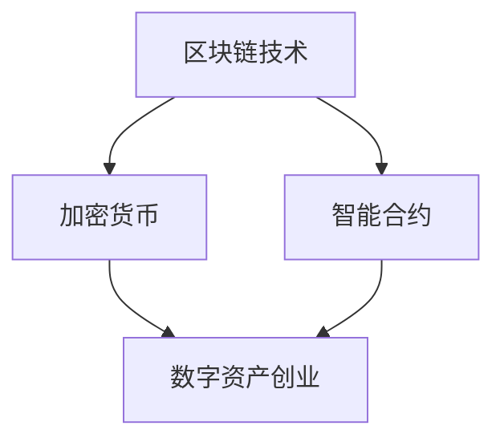

                 

关键词：数字资产、虚拟财产、区块链、加密货币、创业、价值挖掘、加密算法、去中心化、安全性、智能合约、代币经济、用户体验

> 摘要：本文旨在探讨数字资产创业中虚拟财产的价值挖掘，通过分析区块链技术、加密货币、智能合约等核心概念及其应用，探讨如何在数字资产市场中创造价值，并展望未来的发展前景和挑战。

## 1. 背景介绍

随着互联网技术的发展，数字经济已成为全球经济的重要组成部分。数字资产作为一种新型的资产形式，逐渐成为投资和创业的热点。数字资产是指以数字形式存在的资产，包括加密货币、代币、数字身份等。虚拟财产是数字资产的重要组成部分，具有去中心化、安全性高、可追溯等特点。

在数字资产创业中，虚拟财产的价值挖掘成为关键问题。如何有效地利用区块链技术、加密货币、智能合约等工具，提升虚拟财产的价值，成为创业者需要深入思考的问题。本文将围绕这一主题进行探讨，为数字资产创业提供一些有价值的思路和启示。

## 2. 核心概念与联系

### 2.1 区块链技术

区块链技术是一种分布式数据库技术，通过多个节点共同维护一个数据库，实现数据的不可篡改和可追溯。区块链的核心特点包括去中心化、安全性高、透明性高。在数字资产创业中，区块链技术主要用于构建去中心化应用（DApps），确保数据的可信性和安全性。

### 2.2 加密货币

加密货币是一种使用密码学原理来确保交易安全及控制交易单位创造的交易媒介。比特币是第一种加密货币，其成功激发了加密货币市场的繁荣。加密货币具有去中心化、匿名性、稀缺性等特点，使其成为数字资产创业的重要工具。

### 2.3 智能合约

智能合约是一种在区块链上执行的计算机程序，其源代码在区块链上公开透明。智能合约可以在满足特定条件时自动执行，从而实现去中心化的交易和管理。在数字资产创业中，智能合约用于确保交易的合法性和安全性。

### 2.4 核心概念联系

数字资产创业的核心概念包括区块链技术、加密货币和智能合约。这三者相互关联，共同构成了数字资产创业的基础。区块链技术为加密货币提供了安全的交易环境，而智能合约则确保了交易的自动化和可追溯性。以下是一个简单的 Mermaid 流程图，展示了这些核心概念之间的联系。



## 3. 核心算法原理 & 具体操作步骤

### 3.1 算法原理概述

在数字资产创业中，核心算法主要包括加密算法、共识算法和智能合约算法。这些算法共同保障了数字资产的安全性、可靠性和透明性。

- **加密算法**：用于保护数字资产的安全性，常见的加密算法有 RSA、AES 等。
- **共识算法**：用于区块链网络中的节点达成一致，常见的共识算法有 PoW（工作量证明）和 PoS（权益证明）。
- **智能合约算法**：用于实现智能合约的自动执行，常见的编程语言有 Solidity、Vyper 等。

### 3.2 算法步骤详解

#### 3.2.1 加密算法

1. **密钥生成**：生成一对密钥（公钥和私钥）。
2. **加密过程**：使用公钥对数据进行加密。
3. **解密过程**：使用私钥对加密数据进行解密。

#### 3.2.2 共识算法

1. **网络节点**：区块链网络中的各个节点参与共识过程。
2. **区块生成**：节点生成区块，并包含交易信息。
3. **区块验证**：其他节点验证区块的有效性。
4. **达成共识**：通过共识算法（如 PoW 或 PoS），网络节点达成一致，将区块添加到区块链。

#### 3.2.3 智能合约算法

1. **编写合约**：使用 Solidity 等编程语言编写智能合约。
2. **部署合约**：将智能合约部署到区块链上。
3. **执行合约**：满足触发条件时，自动执行智能合约代码。

### 3.3 算法优缺点

#### 3.3.1 加密算法

- 优点：安全性高，可以保护数字资产免受非法访问。
- 缺点：加密过程和解密过程较为复杂，对计算资源有一定要求。

#### 3.3.2 共识算法

- 优点：确保区块链网络中的节点达成一致，提高数据可信度。
- 缺点：部分共识算法（如 PoW）能耗较高，可能导致环境污染。

#### 3.3.3 智能合约算法

- 优点：自动化执行，提高交易效率，降低交易成本。
- 缺点：智能合约一旦部署，难以修改，可能存在漏洞风险。

### 3.4 算法应用领域

- **加密算法**：广泛应用于数字货币、数字身份等领域。
- **共识算法**：应用于区块链网络中的去中心化应用。
- **智能合约算法**：应用于智能合约平台，如以太坊、波卡等。

## 4. 数学模型和公式 & 详细讲解 & 举例说明

### 4.1 数学模型构建

在数字资产创业中，数学模型主要用于分析和预测市场趋势、评估风险等。以下是一个简单的数学模型，用于分析加密货币的价格走势。

#### 4.1.1 加密货币价格预测模型

假设加密货币价格 \(P(t)\) 与时间 \(t\) 有关，可以使用以下公式进行预测：

\[ P(t) = P(0) \times e^{rt} \]

其中：
- \(P(0)\) 是初始价格。
- \(r\) 是年利率。
- \(t\) 是时间（以年为单位）。

#### 4.1.2 风险评估模型

假设加密货币的风险 \(R(t)\) 与时间 \(t\) 有关，可以使用以下公式进行评估：

\[ R(t) = \frac{1}{P(t)} \times \frac{dP(t)}{dt} \]

其中：
- \(P(t)\) 是加密货币的价格。
- \(\frac{dP(t)}{dt}\) 是价格的变化率。

### 4.2 公式推导过程

#### 4.2.1 加密货币价格预测模型

加密货币价格预测模型基于指数函数，可以描述价格随时间的变化。指数函数的特点是增长速度逐渐加快，因此适合描述加密货币价格的快速上涨。

#### 4.2.2 风险评估模型

风险评估模型基于价格变化率，可以衡量加密货币的价格波动程度。价格变化率越大，风险越高。该模型可以帮助投资者评估加密货币的投资风险。

### 4.3 案例分析与讲解

假设某种加密货币的初始价格为 1000 美元，年利率为 10%。使用上述数学模型，可以预测其未来价格和风险。

#### 4.3.1 价格预测

根据加密货币价格预测模型，未来价格 \(P(t)\) 为：

\[ P(t) = 1000 \times e^{0.1t} \]

当 \(t = 1\) 时，价格 \(P(1)\) 为：

\[ P(1) = 1000 \times e^{0.1 \times 1} = 1000 \times e^{0.1} \approx 1105.17 \text{ 美元} \]

#### 4.3.2 风险评估

根据风险评估模型，未来风险 \(R(t)\) 为：

\[ R(t) = \frac{1}{1000 \times e^{0.1t}} \times \frac{dP(t)}{dt} \]

其中，\(\frac{dP(t)}{dt} = 1000 \times 0.1 \times e^{0.1t}\)。

代入 \(t = 1\)，得到未来风险 \(R(1)\) 为：

\[ R(1) = \frac{1}{1000 \times e^{0.1 \times 1}} \times 1000 \times 0.1 \times e^{0.1 \times 1} = 0.1 \approx 10\% \]

## 5. 项目实践：代码实例和详细解释说明

### 5.1 开发环境搭建

为了实现数字资产创业项目，需要搭建一个适合开发的环境。以下是开发环境搭建的步骤：

1. 安装区块链节点软件（如比特币节点、以太坊节点等）。
2. 安装智能合约开发工具（如 Truffle、Hardhat 等）。
3. 安装编程语言（如 Solidity、Vyper 等）。

### 5.2 源代码详细实现

以下是一个简单的以太坊智能合约示例，用于实现数字资产发行和交易功能。

```solidity
// SPDX-License-Identifier: MIT
pragma solidity ^0.8.0;

contract DigitalAsset {
    mapping(address => uint256) public balanceOf;
    mapping(address => mapping(address => uint256)) public allowance;
    uint256 public totalSupply;
    string public name;
    string public symbol;
    uint8 public decimals;

    event Transfer(address indexed from, address indexed to, uint256 value);
    event Approval(address indexed owner, address indexed spender, uint256 value);

    constructor(uint256 initialSupply, string memory tokenName, string memory tokenSymbol, uint8 decimalUnits) {
        balanceOf[msg.sender] = initialSupply;
        totalSupply = initialSupply;
        name = tokenName;
        symbol = tokenSymbol;
        decimals = decimalUnits;
    }

    function transfer(address _to, uint256 _value) public returns (bool success) {
        require(_to != address(0));
        require(balanceOf[msg.sender] >= _value);

        balanceOf[msg.sender] -= _value;
        balanceOf[_to] += _value;
        emit Transfer(msg.sender, _to, _value);
        return true;
    }

    function approve(address _spender, uint256 _value) public returns (bool success) {
        allowance[msg.sender][_spender] = _value;
        emit Approval(msg.sender, _spender, _value);
        return true;
    }

    function transferFrom(address _from, address _to, uint256 _value) public returns (bool success) {
        require(_to != address(0));
        require(balanceOf[_from] >= _value);
        require(allowance[_from][msg.sender] >= _value);

        balanceOf[_from] -= _value;
        balanceOf[_to] += _value;
        allowance[_from][msg.sender] -= _value;
        emit Transfer(_from, _to, _value);
        return true;
    }
}
```

### 5.3 代码解读与分析

上述智能合约实现了以下功能：

1. **数字资产发行**：在构造函数中，将初始供应量分配给合约创建者。
2. **数字资产转账**：通过 `transfer` 函数实现数字资产转账功能。
3. **数字资产授权**：通过 `approve` 函数实现数字资产授权功能。
4. **数字资产代理转账**：通过 `transferFrom` 函数实现数字资产代理转账功能。

该智能合约符合 ERC-20 标准，是数字资产创业项目的基础。在实际开发过程中，可以根据项目需求对智能合约进行扩展和优化。

### 5.4 运行结果展示

在开发环境中，可以使用 Truffle 或 Hardhat 等工具对智能合约进行编译、部署和调试。以下是一个简单的运行结果展示：

1. **编译智能合约**：使用 Truffle 编译智能合约，生成ABI文件。
2. **部署智能合约**：使用 Truffle 部署智能合约，生成合约地址。
3. **调用智能合约**：通过 Remix 等工具调用智能合约，查看运行结果。

## 6. 实际应用场景

### 6.1 数字货币交易所

数字货币交易所是数字资产创业的主要场景之一。交易所通过提供数字资产交易服务，帮助投资者进行买卖操作，实现数字资产的价值挖掘。交易所可以分为去中心化交易所（DEX）和中心化交易所（CEX）两种类型。

- **去中心化交易所**：基于区块链技术，实现去中心化的交易模式。去中心化交易所具有安全性高、手续费低等优点，但交易速度较慢。
- **中心化交易所**：基于中心化平台，实现集中化的交易模式。中心化交易所具有交易速度快、用户体验好等优点，但存在安全性风险。

### 6.2 游戏行业

游戏行业是数字资产创业的重要领域之一。游戏玩家可以通过购买、交换和交易虚拟道具、角色等虚拟财产，实现虚拟财产的价值挖掘。以下是一些游戏行业中的数字资产应用案例：

1. **虚拟道具交易**：玩家可以通过购买虚拟道具，提升游戏角色属性，实现虚拟财产的价值提升。
2. **游戏币交易**：游戏币是一种虚拟货币，玩家可以通过交易游戏币，实现游戏币的价值挖掘。
3. **数字身份认证**：通过数字身份认证，确保游戏玩家的真实性和诚信度，提高虚拟财产的价值。

### 6.3 社交网络

社交网络是数字资产创业的另一重要领域。社交网络平台可以通过提供虚拟财产交易服务，帮助用户实现虚拟财产的价值挖掘。以下是一些社交网络中的数字资产应用案例：

1. **虚拟礼物**：用户可以通过购买虚拟礼物，送给好友或偶像，实现虚拟财产的价值提升。
2. **虚拟形象**：用户可以通过购买虚拟形象，提升个人形象和知名度，实现虚拟财产的价值挖掘。
3. **数字身份认证**：通过数字身份认证，确保社交网络用户的真实性和诚信度，提高虚拟财产的价值。

## 7. 工具和资源推荐

### 7.1 学习资源推荐

1. **《区块链技术指南》**：一本全面的区块链入门教材，适合初学者了解区块链基础知识。
2. **《智能合约编程》**：一本深入讲解智能合约编程的教材，适合开发者学习智能合约开发。
3. **《加密货币投资策略》**：一本介绍加密货币投资策略的书籍，适合投资者了解加密货币市场。

### 7.2 开发工具推荐

1. **Truffle**：一个用于以太坊智能合约开发的工具，提供编译、部署和调试等功能。
2. **Hardhat**：一个轻量级的以太坊开发框架，具有高性能和易用性。
3. **Remix**：一个在线智能合约开发工具，支持 Solidity、Vyper 等编程语言。

### 7.3 相关论文推荐

1. **《区块链：分布式账本技术》**：一篇介绍区块链技术的经典论文，详细阐述了区块链的原理和应用。
2. **《智能合约：安全性和隐私性》**：一篇探讨智能合约安全性和隐私性的论文，分析了智能合约的潜在风险。
3. **《加密货币市场动态》**：一篇分析加密货币市场动态的论文，为投资者提供市场趋势分析。

## 8. 总结：未来发展趋势与挑战

### 8.1 研究成果总结

数字资产创业已成为数字经济的重要驱动力，推动了区块链技术、加密货币和智能合约等领域的快速发展。在数字资产创业中，虚拟财产的价值挖掘成为关键问题，通过加密算法、共识算法和智能合约算法等核心技术的应用，实现了数字资产的安全性和可靠性。

### 8.2 未来发展趋势

未来，数字资产创业将继续保持高速发展，以下发展趋势值得关注：

1. **区块链技术的普及**：随着区块链技术的不断成熟，更多行业将采用区块链技术，推动数字经济的发展。
2. **加密货币市场的繁荣**：加密货币市场将继续扩大，更多投资者将关注和参与加密货币投资。
3. **智能合约的应用拓展**：智能合约将在更多领域得到应用，推动去中心化应用的普及。

### 8.3 面临的挑战

数字资产创业在发展过程中也面临一些挑战：

1. **技术风险**：区块链技术仍处于发展阶段，可能存在技术漏洞和安全隐患。
2. **监管风险**：各国监管政策不同，数字资产创业可能面临监管风险。
3. **市场波动**：加密货币市场波动较大，投资者需要具备一定的风险承受能力。

### 8.4 研究展望

未来，数字资产创业的研究将重点关注以下几个方面：

1. **区块链技术的优化**：持续优化区块链技术，提高性能和安全性。
2. **智能合约的标准化**：制定智能合约标准，提高智能合约的可信度和易用性。
3. **数字资产监管**：研究数字资产监管政策，确保数字资产市场的健康发展。

## 9. 附录：常见问题与解答

### 9.1 数字资产创业的关键技术是什么？

数字资产创业的关键技术包括区块链技术、加密货币、智能合约等。

### 9.2 如何确保数字资产的安全性？

确保数字资产的安全性需要采用多种技术手段，如加密算法、共识算法、智能合约安全等。

### 9.3 数字资产创业的主要应用领域是什么？

数字资产创业的主要应用领域包括数字货币交易所、游戏行业、社交网络等。

### 9.4 数字资产创业面临哪些挑战？

数字资产创业面临的挑战包括技术风险、监管风险、市场波动等。

### 9.5 如何降低数字资产创业的风险？

降低数字资产创业的风险可以通过以下措施实现：深入研究区块链技术、遵循法律法规、合理配置投资组合等。

[作者：禅与计算机程序设计艺术 / Zen and the Art of Computer Programming]

