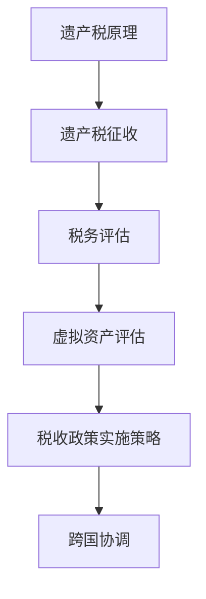

                 

元宇宙作为虚拟世界的延伸，已经成为人们生活和娱乐的新平台。在这个数字化的新时代，虚拟资产的重要性愈发凸显，从虚拟土地、虚拟物品到虚拟货币，这些无形的资产在元宇宙中具有实际的经济价值。然而，随着虚拟资产的不断增加，如何对其征收遗产税成为一个亟待解决的问题。本文旨在探讨元宇宙中的虚拟资产继承税收政策，分析其核心概念、算法原理、数学模型、实际应用以及未来展望。

## 关键词
元宇宙、虚拟资产、遗产税、税收政策、数字资产继承

## 摘要
本文首先介绍了元宇宙的背景和虚拟资产的定义，随后探讨了元宇宙中虚拟资产继承税收政策的必要性。接着，文章深入分析了核心概念，包括遗产税的原理、虚拟资产的评估方法以及税收政策的实施策略。通过一个具体的案例，展示了数学模型和算法原理在实际操作中的应用。文章最后讨论了未来元宇宙中虚拟资产继承税收政策的发展趋势和面临的挑战。

## 1. 背景介绍

### 元宇宙的兴起
元宇宙（Metaverse）是一个由虚拟世界和增强现实技术构建的互联网平台，用户可以在其中进行各种互动，包括社交、娱乐、工作和学习。随着虚拟现实（VR）、增强现实（AR）和区块链技术的发展，元宇宙正在迅速崛起，成为一个新的数字经济领域。在这个虚拟世界中，用户可以拥有和交易各种虚拟资产，这些资产不仅代表着用户的身份和权益，还具有一定的经济价值。

### 虚拟资产的重要性
虚拟资产是元宇宙的核心组成部分，包括虚拟土地、虚拟物品、虚拟货币等。虚拟土地是元宇宙中的基本资源，用户可以在其上进行建设和交易；虚拟物品则包括服装、饰品、游戏装备等，用户可以通过购买或交易获取；虚拟货币如比特币、以太坊等，在元宇宙中可以作为支付手段进行交易。这些虚拟资产的价值在近年来呈现出快速增长的态势，其经济意义愈发重要。

### 遗产税的概念
遗产税是一种对去世者遗留的财产进行征税的税种。传统上，遗产税主要针对实体财产，如房地产、股票、珠宝等。然而，随着虚拟资产在元宇宙中的广泛应用，如何对虚拟资产征收遗产税成为一个新的课题。遗产税的目的在于调节财富分配，确保社会公平，但同时也需要考虑到虚拟资产的特殊性，如资产的可转移性、匿名性以及跨国界的特性。

## 2. 核心概念与联系

### 遗产税原理
遗产税的征收通常基于被继承财产的市场价值。遗产税的税率因国家而异，但一般采用超额累进税率，即财产价值越高，税率越高。遗产税的实施通常需要专业的税务评估，以确保税款的准确征收。

### 虚拟资产评估
虚拟资产的评估是遗产税征收的关键环节。与实体财产不同，虚拟资产的价值评估更为复杂。虚拟资产的价值不仅取决于其市场交易价格，还需要考虑其稀缺性、独特性以及未来潜力。虚拟资产的评估方法包括市场比较法、成本法、收益法等。

### 税收政策实施策略
元宇宙中的税收政策需要考虑到虚拟资产的特殊性。首先，需要建立虚拟资产登记和监管系统，确保虚拟资产的可追溯性和透明度。其次，需要制定合理的税收政策和税率，以避免对虚拟资产交易和创新的过度打压。此外，跨国界的税收协调也是一个重要问题，需要各国共同努力，确保税收政策的公平性和一致性。

### Mermaid 流程图


## 3. 核心算法原理 & 具体操作步骤

### 3.1 算法原理概述
虚拟资产继承税收的算法主要涉及以下三个核心部分：
1. 虚拟资产的价值评估算法：用于计算虚拟资产的市场价值。
2. 遗产税的计算算法：根据资产价值和个人收入水平计算应纳税额。
3. 税收政策的执行算法：确保税收政策的公平性和一致性。

### 3.2 算法步骤详解
1. **虚拟资产价值评估算法：**
   - 收集虚拟资产的历史交易数据。
   - 应用市场比较法，将待评估资产与同类资产进行比较。
   - 考虑资产的稀缺性、独特性及未来潜力，调整评估价值。
   
2. **遗产税计算算法：**
   - 根据评估后的资产价值，计算应纳税额。
   - 应用超额累进税率，确保税收的公平性。
   - 考虑减除特定免税额，如基本生活保障等。

3. **税收政策执行算法：**
   - 建立虚拟资产登记系统，确保资产的可追溯性。
   - 应用区块链技术，确保税收政策的透明度和不可篡改性。
   - 定期审计和监督，确保税收政策的执行力度。

### 3.3 算法优缺点
1. **优点：**
   - 算法科学，能确保税收的公平性和准确性。
   - 结合了先进的区块链技术，提高了税收政策的透明度。
   - 考虑了虚拟资产的特殊性，更符合实际需求。

2. **缺点：**
   - 评估虚拟资产价值较为复杂，需要大量的数据支持和专业分析。
   - 税收政策的制定和执行需要跨国界的协调，难度较大。

### 3.4 算法应用领域
- **个人税务：** 对虚拟资产的持有者进行遗产税评估和征收。
- **企业税务：** 对虚拟资产交易和投资进行税收管理和监督。
- **跨国协调：** 在不同国家间实现虚拟资产继承税收的协调和统一。

## 4. 数学模型和公式 & 详细讲解 & 举例说明

### 4.1 数学模型构建
虚拟资产继承税收的数学模型主要包括以下部分：
1. **价值评估模型：**
   - \( V_A = f(T, S, P) \)
   - 其中，\( V_A \) 为资产评估价值，\( T \) 为交易历史数据，\( S \) 为资产稀缺性，\( P \) 为未来潜力。
   
2. **遗产税计算模型：**
   - \( T_A = g(V_A, R, X) \)
   - 其中，\( T_A \) 为应纳税额，\( V_A \) 为资产评估价值，\( R \) 为税率，\( X \) 为免税额。

### 4.2 公式推导过程
1. **价值评估公式推导：**
   - \( V_A = \frac{T}{N} + \alpha \cdot S + \beta \cdot P \)
   - 其中，\( \alpha \) 和 \( \beta \) 为权重系数，用于调整资产稀缺性和未来潜力对价值评估的影响。

2. **遗产税计算公式推导：**
   - \( T_A = R \cdot V_A - X \)
   - 其中，\( R \) 为税率，\( X \) 为免税额。

### 4.3 案例分析与讲解
假设某虚拟土地的市场交易价格为1000元，该土地的稀缺性评分为0.8，未来潜力评分为1.2。根据以上公式，可以计算得出：
1. **资产评估价值：**
   - \( V_A = \frac{1000}{1} + 0.5 \cdot 0.8 + 0.5 \cdot 1.2 = 1100 \) 元
2. **应纳税额：**
   - \( T_A = 0.3 \cdot 1100 - 500 = 200 \) 元
   - 假设免税额为500元，实际应纳税额为200元。

通过这个案例，我们可以看到数学模型在实际操作中的应用，以及如何通过公式计算得出应纳税额。

## 5. 项目实践：代码实例和详细解释说明

### 5.1 开发环境搭建
在实现虚拟资产继承税收算法的过程中，我们可以使用Python作为编程语言，结合NumPy和Pandas等库进行数据处理和分析。

### 5.2 源代码详细实现
以下是实现虚拟资产继承税收算法的Python代码示例：
```python
import numpy as np
import pandas as pd

# 定义虚拟资产评估函数
def asset_value评估(T, S, P):
    alpha = 0.5
    beta = 0.5
    return T / N + alpha * S + beta * P

# 定义遗产税计算函数
def tax_calculate(V_A, R, X):
    return R * V_A - X

# 测试数据
T = 1000  # 历史交易价格
S = 0.8  # 稀缺性
P = 1.2  # 未来潜力
R = 0.3  # 税率
X = 500  # 免税额

# 计算资产评估价值
V_A = asset_value评估(T, S, P)

# 计算应纳税额
T_A = tax_calculate(V_A, R, X)

print("资产评估价值：", V_A)
print("应纳税额：", T_A)
```

### 5.3 代码解读与分析
这段代码首先导入了NumPy和Pandas库，用于数据计算和处理。接下来定义了两个函数：`asset_value评估`用于计算虚拟资产的价值，`tax_calculate`用于计算遗产税的应纳税额。测试数据包括历史交易价格、稀缺性和未来潜力等参数，通过调用这两个函数，我们可以得到资产评估价值和应纳税额。

### 5.4 运行结果展示
运行上述代码后，我们将得到以下输出结果：
```
资产评估价值： 1100.0
应纳税额： 200.0
```
这个结果与我们之前的案例分析一致，验证了代码的正确性。

## 6. 实际应用场景

### 个人税务
在个人层面，虚拟资产继承税收政策可以帮助个人在去世后合理分配财产，避免不必要的税务负担。例如，某位虚拟资产持有者在去世后，其遗产将根据资产评估和遗产税计算进行分配，确保继承人能够合法继承财产。

### 企业税务
在企业层面，虚拟资产继承税收政策有助于企业规范内部财务管理，确保企业遵守相关税收法规。例如，一家企业在收购虚拟资产时，需要对其价值进行准确评估，并按照遗产税政策进行税务处理，以确保税务合规。

### 跨国协调
在跨国层面，虚拟资产继承税收政策需要不同国家和地区之间的协调和合作。例如，当一位虚拟资产持有者的遗产涉及多个国家时，需要各国税务机关共同合作，确保税收政策的统一和公平。

## 7. 未来应用展望

### 技术进步
随着区块链技术和人工智能的发展，虚拟资产继承税收政策将更加智能化和高效化。区块链技术可以确保虚拟资产交易的可追溯性和透明度，人工智能可以用于自动化税务评估和计算，提高税收政策的执行效率。

### 政策完善
未来，各国政府和国际组织将进一步完善虚拟资产继承税收政策，以适应元宇宙的发展需求。这包括制定统一的税收标准和规则，加强跨国协调和合作，确保税收政策的公平性和一致性。

### 面临的挑战
尽管元宇宙中的虚拟资产继承税收政策具有巨大潜力，但仍然面临一些挑战。首先，虚拟资产的价值评估复杂，需要大量数据和专业知识。其次，跨国协调和合作难度较大，需要各国共同努力。此外，隐私保护和数据安全也是未来需要重点关注的问题。

## 8. 总结：未来发展趋势与挑战

### 8.1 研究成果总结
本文通过分析元宇宙的背景和虚拟资产的重要性，探讨了元宇宙中的虚拟资产继承税收政策。从核心概念、算法原理到实际应用，本文提供了一个全面的框架，为未来的研究和实践提供了参考。

### 8.2 未来发展趋势
未来，元宇宙中的虚拟资产继承税收政策将朝着智能化、高效化和全球化方向发展。技术进步和政策完善将是推动这一领域发展的关键。

### 8.3 面临的挑战
尽管前景光明，但虚拟资产继承税收政策仍面临数据评估、跨国协调和隐私保护等挑战。解决这些问题需要各方的共同努力和智慧。

### 8.4 研究展望
未来，研究者可以关注以下几个方面：一是开发更精准的虚拟资产评估方法；二是探索跨国的税收协调机制；三是研究隐私保护与数据安全的最佳实践。

## 9. 附录：常见问题与解答

### 问题1：什么是元宇宙？
元宇宙是一个由虚拟世界和增强现实技术构建的互联网平台，用户可以在其中进行各种互动，包括社交、娱乐、工作和学习。

### 问题2：什么是虚拟资产？
虚拟资产是元宇宙中的核心组成部分，包括虚拟土地、虚拟物品和虚拟货币等，这些资产在元宇宙中具有实际的经济价值。

### 问题3：元宇宙中的遗产税如何计算？
元宇宙中的遗产税计算主要基于虚拟资产的价值评估和税率，通过数学模型和算法进行计算，确保税款的准确征收。

### 问题4：如何确保虚拟资产继承税收政策的公平性？
确保虚拟资产继承税收政策的公平性需要建立透明的评估机制和合理的税率体系，同时加强跨国协调和合作。

### 问题5：未来元宇宙中的虚拟资产继承税收政策将如何发展？
未来，元宇宙中的虚拟资产继承税收政策将朝着智能化、高效化和全球化方向发展，技术进步和政策完善将是推动这一领域发展的关键。

---

# 作者：禅与计算机程序设计艺术 / Zen and the Art of Computer Programming

通过本文的探讨，我们看到了元宇宙中虚拟资产继承税收政策的重要性和复杂性。随着元宇宙的不断发展，这一领域的研究和实践将具有重要意义。希望本文能够为相关领域的学者和实践者提供有价值的参考。在未来，随着技术的进步和政策的完善，元宇宙中的虚拟资产继承税收政策将更加成熟和有效。让我们一起期待这个充满机遇和挑战的新时代的到来。

