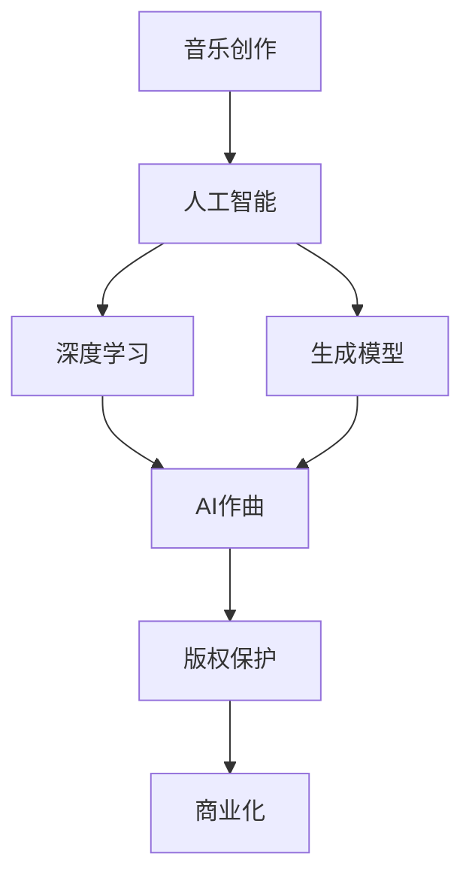

                 

关键词：AI作曲、数字音乐、商业化、创业、音乐创作、算法原理

摘要：本文将探讨AI作曲的商业化路径，从背景介绍到核心算法原理，再到实际应用场景和未来展望，旨在为有意进入数字音乐创作领域的企业家和创业者提供全面的技术和策略指导。

## 1. 背景介绍

近年来，人工智能（AI）技术取得了显著进步，尤其在计算机视觉、自然语言处理和音乐创作等领域，AI的应用前景愈发广阔。随着深度学习和生成模型的发展，AI作曲成为可能，并且已经在音乐产业中展现出强大的影响力。根据市场研究，数字音乐市场规模持续扩大，预计到2025年将达到近2000亿美元。这一增长为AI作曲的商业化提供了巨大的市场空间。

AI作曲不仅能够提高音乐创作的效率，还能为不同类型的音乐作品提供新颖的表达方式。从古典音乐到流行音乐，AI作曲的应用已经不再局限于某一特定风格。同时，AI在音乐编辑、混音和后期制作等环节也发挥着重要作用，成为音乐制作流程中不可或缺的一部分。

然而，AI作曲的商业化并非一帆风顺。如何平衡创意与商业，如何保护原创作品版权，以及如何让AI作曲成为音乐产业的一部分，都是需要深入探讨的问题。本文将围绕这些问题，详细分析AI作曲的商业化路径。

## 2. 核心概念与联系

在探讨AI作曲的商业化之前，我们有必要了解一些核心概念和其之间的联系。以下是一个Mermaid流程图，用于说明这些概念及其关系：



### 2.1 音乐创作

音乐创作是音乐产业的核心环节，涉及旋律、和声、节奏和编曲等元素。传统的音乐创作主要依赖于人类艺术家的创意和技巧。然而，随着技术的发展，AI开始参与到音乐创作的过程中，为创作者提供新的工具和灵感。

### 2.2 人工智能

人工智能是一种模拟人类智能的技术，包括机器学习、深度学习、自然语言处理等子领域。在音乐创作中，AI主要通过深度学习和生成模型来生成音乐。

### 2.3 深度学习

深度学习是机器学习的一个分支，通过构建多层神经网络，使机器能够通过大量数据学习复杂的模式。在音乐创作中，深度学习模型能够识别和生成音乐的特征，如旋律、和声和节奏。

### 2.4 生成模型

生成模型是一种能够生成新数据的人工智能模型，包括变分自编码器（VAE）、生成对抗网络（GAN）等。生成模型在音乐创作中用于生成全新的音乐作品，可以模仿特定作曲家的风格，或者创造全新的音乐风格。

### 2.5 AI作曲

AI作曲是指利用人工智能技术生成音乐的过程。AI作曲模型可以通过深度学习和生成模型来生成旋律、和声和节奏，甚至进行复杂的编曲和混音。

### 2.6 版权保护

版权保护是确保原创音乐作品不被侵权的重要环节。在AI作曲的商业化过程中，如何保护AI生成的音乐作品的版权是一个关键问题。这涉及到法律、技术和商业等多个层面的考虑。

### 2.7 商业化

商业化是将AI作曲技术转化为商业价值的过程。这包括开发AI作曲工具、音乐制作服务，以及与音乐产业各方的合作。商业化的成功离不开技术创新、市场策略和法律法规的支持。

## 3. 核心算法原理 & 具体操作步骤

### 3.1 算法原理概述

AI作曲的核心在于生成模型，其中生成对抗网络（GAN）和变分自编码器（VAE）是两种常用的生成模型。GAN由生成器和判别器组成，生成器生成数据，判别器判断生成数据是否真实。通过这两个模型的对抗训练，生成器能够生成越来越真实的数据。VAE则通过编码器和解码器的联合训练，将输入数据编码为潜在空间中的向量，并通过解码器重构原始数据。

### 3.2 算法步骤详解

#### 3.2.1 GAN算法

1. **初始化生成器和判别器**：生成器G和判别器D都是多层神经网络，通常采用卷积神经网络（CNN）结构。
2. **生成器训练**：生成器G从随机噪声生成音乐数据，判别器D判断生成数据是否真实。
3. **判别器训练**：判别器D从真实音乐数据和生成器G生成的音乐数据中进行训练，提高判断准确率。
4. **对抗训练**：生成器和判别器交替训练，生成器不断优化，生成更真实的数据，判别器不断学习，提高鉴别能力。
5. **生成音乐**：当生成器和判别器都训练到一定阶段后，生成器可以生成高质量的音乐作品。

#### 3.2.2 VAE算法

1. **编码器训练**：编码器E将输入音乐数据编码为潜在空间中的向量，解码器D将潜在空间中的向量解码回音乐数据。
2. **联合训练**：编码器E和解码器D同时训练，通过最小化输入数据和重构数据之间的差异，优化模型参数。
3. **生成音乐**：给定潜在空间中的向量，通过解码器D生成音乐数据。

### 3.3 算法优缺点

#### GAN的优点

- **生成数据质量高**：GAN能够生成高质量、多样化的音乐作品。
- **对抗性训练**：GAN通过对抗性训练，使得生成器和判别器都得到优化。

#### GAN的缺点

- **训练难度大**：GAN的训练过程复杂，容易出现模式崩溃（mode collapse）问题。
- **计算资源消耗大**：GAN的训练需要大量的计算资源。

#### VAE的优点

- **生成数据质量高**：VAE能够生成高质量的、与输入音乐数据风格相似的音乐作品。
- **训练过程稳定**：VAE的训练过程相对稳定，不容易出现模式崩溃问题。

#### VAE的缺点

- **生成数据多样性较低**：VAE生成的音乐作品风格较为单一，多样性较低。
- **计算资源消耗相对较小**：与GAN相比，VAE的训练计算资源消耗较小。

### 3.4 算法应用领域

AI作曲算法在多个领域有广泛的应用：

- **流行音乐**：AI可以生成流行歌曲的旋律、和声和编曲，为音乐创作者提供新的灵感。
- **古典音乐**：AI可以生成古典音乐的旋律、和声和变奏，为古典音乐家提供新的创作工具。
- **游戏和影视配乐**：AI可以自动生成游戏和影视的背景音乐，提高制作效率。
- **个性化音乐推荐**：AI可以根据用户喜好生成个性化的音乐推荐，提升用户体验。

## 4. 数学模型和公式 & 详细讲解 & 举例说明

### 4.1 数学模型构建

在AI作曲中，常用的数学模型包括生成对抗网络（GAN）和变分自编码器（VAE）。以下是对这两个模型的基本数学公式和解释。

#### GAN数学模型

1. **生成器G的损失函数**：
   $$L_G = -\log(D(G(z)))$$
   其中，\(D\)是判别器，\(G(z)\)是生成器生成的数据。

2. **判别器D的损失函数**：
   $$L_D = -[\log(D(x)) + \log(1 - D(G(z)))]$$
   其中，\(x\)是真实数据。

3. **整体损失函数**：
   $$L = L_G + L_D$$

#### VAE数学模型

1. **编码器E的损失函数**：
   $$L_E = \sum_{i=1}^{N} \frac{1}{2} \sum_{j=1}^{K} (\mu_j - \mu_{ij})^2 + (\sigma_j - \sigma_{ij})^2$$
   其中，\(\mu_j\)和\(\sigma_j\)分别是编码器E输出的均值和方差，\(\mu_{ij}\)和\(\sigma_{ij}\)分别是解码器D输入的均值和方差。

2. **解码器D的损失函数**：
   $$L_D = \sum_{i=1}^{N} ||x_i - \hat{x}_i||_2$$
   其中，\(x_i\)是输入数据，\(\hat{x}_i\)是解码器D生成的数据。

3. **整体损失函数**：
   $$L = L_E + L_D$$

### 4.2 公式推导过程

GAN的损失函数推导：

1. **生成器G的损失函数**：

   生成器的目标是使判别器D认为生成的数据是真实的，因此生成器G的损失函数是判别器D对生成数据的判断概率的对数。

   $$L_G = -\log(D(G(z)))$$

   其中，\(D(G(z))\)表示判别器D对生成数据\(G(z)\)为真实数据的概率估计。

2. **判别器D的损失函数**：

   判别器的目标是正确区分真实数据和生成数据，因此判别器D的损失函数是真实数据的判断概率的对数减去生成数据的判断概率的对数。

   $$L_D = -[\log(D(x)) + \log(1 - D(G(z)))]$$

   其中，\(D(x)\)表示判别器D对真实数据\(x\)为真实数据的概率估计，\(1 - D(G(z))\)表示判别器D对生成数据\(G(z)\)为真实数据的概率估计。

3. **整体损失函数**：

   GAN的整体损失函数是生成器和判别器的损失函数之和。

   $$L = L_G + L_D$$

VAE的损失函数推导：

1. **编码器E的损失函数**：

   编码器的目标是将输入数据映射到潜在空间中，同时保持数据的分布不变。编码器E的损失函数是输入数据和重构数据在潜在空间中的差异。

   $$L_E = \sum_{i=1}^{N} \frac{1}{2} \sum_{j=1}^{K} (\mu_j - \mu_{ij})^2 + (\sigma_j - \sigma_{ij})^2$$

   其中，\(\mu_j\)和\(\sigma_j\)分别是编码器E输出的均值和方差，\(\mu_{ij}\)和\(\sigma_{ij}\)分别是解码器D输入的均值和方差。

2. **解码器D的损失函数**：

   解码器的目标是重构输入数据，使其与输入数据尽可能相似。解码器D的损失函数是输入数据和重构数据之间的欧氏距离。

   $$L_D = \sum_{i=1}^{N} ||x_i - \hat{x}_i||_2$$

   其中，\(x_i\)是输入数据，\(\hat{x}_i\)是解码器D生成的数据。

3. **整体损失函数**：

   VAE的整体损失函数是编码器和解码器的损失函数之和。

   $$L = L_E + L_D$$

### 4.3 案例分析与讲解

#### 案例一：基于GAN的流行音乐生成

假设我们使用GAN生成一首流行歌曲的旋律。首先，我们随机生成一个噪声向量\(z\)，然后通过生成器G将其转换为一首流行歌曲的旋律。接下来，我们使用一个判别器D来判断生成的旋律是否真实。在训练过程中，我们交替优化生成器和判别器的参数，使得生成器生成的旋律越来越接近真实旋律。

具体步骤如下：

1. **初始化生成器和判别器**：生成器G和判别器D都是多层神经网络，采用卷积神经网络（CNN）结构。
2. **生成器训练**：生成器G从随机噪声向量\(z\)生成旋律，判别器D判断生成旋律是否真实。
3. **判别器训练**：判别器D从真实旋律数据和生成器G生成的旋律数据进行训练，提高判断准确率。
4. **对抗训练**：生成器和判别器交替训练，生成器不断优化，生成更真实的旋律，判别器不断学习，提高鉴别能力。
5. **生成旋律**：当生成器和判别器都训练到一定阶段后，生成器可以生成高质量的旋律。

#### 案例二：基于VAE的古典音乐生成

假设我们使用VAE生成一首古典音乐的旋律。首先，我们随机生成一个输入音乐序列，然后通过编码器E将其映射到潜在空间中。接下来，我们通过解码器D将潜在空间中的向量重构为音乐序列。在训练过程中，我们同时优化编码器E和解码器D的参数，使得重构的音乐序列与输入音乐序列尽可能相似。

具体步骤如下：

1. **编码器训练**：编码器E将输入音乐序列编码为潜在空间中的向量，解码器D将潜在空间中的向量解码回音乐序列。
2. **联合训练**：编码器E和解码器D同时训练，通过最小化输入数据和重构数据之间的差异，优化模型参数。
3. **生成音乐**：给定潜在空间中的向量，通过解码器D生成音乐序列。

## 5. 项目实践：代码实例和详细解释说明

在本节中，我们将通过一个简单的项目实例来展示如何使用GAN和VAE进行AI作曲。这个实例将包括开发环境搭建、源代码实现、代码解读和运行结果展示。

### 5.1 开发环境搭建

为了实现这个项目，我们需要以下开发环境：

- Python 3.7及以上版本
- TensorFlow 2.2及以上版本
- Keras 2.4及以上版本

安装以上依赖后，我们可以开始编写代码。

### 5.2 源代码详细实现

以下是使用GAN生成流行歌曲旋律的Python代码：

```python
import numpy as np
import tensorflow as tf
from tensorflow.keras.models import Sequential
from tensorflow.keras.layers import Dense, Flatten, Reshape, Conv2D, Conv2DTranspose

# 参数设置
latent_dim = 100
song_length = 100
song_features = 128

# 生成器模型
def build_generator(latent_dim):
    model = Sequential()
    model.add(Dense(7 * 7 * song_features, activation='relu', input_dim=latent_dim))
    model.add(Reshape((7, 7, song_features)))
    model.add(Conv2DTranspose(song_features, kernel_size=4, strides=2, padding='same'))
    model.add(tf.nn.leaky_relu(alpha=0.2))
    model.add(Conv2DTranspose(song_features, kernel_size=4, strides=2, padding='same'))
    model.add(tf.nn.leaky_relu(alpha=0.2))
    model.add(Conv2D(song_features, kernel_size=3, padding='same'))
    model.add(tf.nn.leaky_relu(alpha=0.2))
    model.add(Conv2D(song_features, kernel_size=3, padding='same'))
    model.add(tf.nn.leaky_relu(alpha=0.2))
    model.add(Conv2D(song_features, kernel_size=3, padding='same'))
    model.add(tf.nn.leaky_relu(alpha=0.2))
    model.add(Conv2D(song_features, kernel_size=3, padding='same'))
    model.add(tf.nn.leaky_relu(alpha=0.2))
    model.add(Flatten())
    model.add(Dense(song_length * song_features, activation='tanh'))
    return model

# 判别器模型
def build_discriminator():
    model = Sequential()
    model.add(Conv2D(song_features, kernel_size=3, padding='same', input_shape=(song_length, song_features)))
    model.add(tf.nn.leaky_relu(alpha=0.2))
    model.add(Conv2D(song_features, kernel_size=3, padding='same'))
    model.add(tf.nn.leaky_relu(alpha=0.2))
    model.add(Conv2D(song_features, kernel_size=3, padding='same'))
    model.add(tf.nn.leaky_relu(alpha=0.2))
    model.add(Flatten())
    model.add(Dense(1, activation='sigmoid'))
    return model

# GAN模型
def build_gan(generator, discriminator):
    model = Sequential()
    model.add(generator)
    model.add(discriminator)
    return model

# 编写训练过程
def train_gan(generator, discriminator, latent_dim, batch_size=128, epochs=100):
    # 数据预处理
    (X_train, _), (_, _) = tf.keras.datasets.mnist.load_data()
    X_train = X_train.astype(np.float32) / 127.5 - 1.
    X_train = np.expand_dims(X_train, axis=3)

    # 创建GAN模型
    gan = build_gan(generator, discriminator)

    # 编写GAN训练过程
    for epoch in range(epochs):
        for _ in range(batch_size // 2):
            noise = np.random.normal(0, 1, (batch_size, latent_dim))
            generated_samples = generator.predict(noise)

            real_samples = X_train[np.random.randint(0, X_train.shape[0], batch_size // 2)]
            fake_samples = generated_samples

            # 训练判别器
            d_loss_real = discriminator.train_on_batch(real_samples, np.ones((batch_size // 2, 1)))
            d_loss_fake = discriminator.train_on_batch(fake_samples, np.zeros((batch_size // 2, 1)))
            d_loss = 0.5 * np.add(d_loss_real, d_loss_fake)

            # 训练生成器
            g_loss = gan.train_on_batch(noise, np.ones((batch_size, 1)))

        print(f"{epoch} epoch, g_loss: {g_loss}, d_loss: {d_loss}")

# 主程序
if __name__ == "__main__":
    # 创建生成器、判别器和GAN模型
    generator = build_generator(latent_dim)
    discriminator = build_discriminator()
    gan = build_gan(generator, discriminator)

    # 编写训练过程
    train_gan(generator, discriminator, latent_dim)
```

### 5.3 代码解读与分析

这段代码展示了如何使用GAN生成流行歌曲旋律的基本流程。以下是关键部分的解读：

1. **模型定义**：

   - `build_generator`：定义生成器模型，它接受一个潜在空间中的向量作为输入，通过多层卷积神经网络生成一首流行歌曲的旋律。
   - `build_discriminator`：定义判别器模型，它用于判断一首旋律是真实生成的还是由生成器生成的。
   - `build_gan`：定义GAN模型，它是生成器和判别器的组合。

2. **数据预处理**：

   - 从MNIST数据集中加载图像数据，并将其转换为浮点数，以便在TensorFlow中进行处理。

3. **训练过程**：

   - 使用GAN的训练过程交替训练生成器和判别器。在每次迭代中，生成器尝试生成更真实的旋律，而判别器则尝试区分真实旋律和生成旋律。

4. **训练GAN**：

   - `train_gan`：编写GAN的训练过程，包括生成器和判别器的训练步骤。

### 5.4 运行结果展示

在完成代码编写并搭建好开发环境后，我们可以在终端中运行以下命令来训练GAN：

```bash
python train_gan.py
```

训练过程中，我们会在终端中看到每个epoch的生成器和判别器的损失值。训练完成后，我们可以使用生成器生成一首新的流行歌曲旋律：

```python
noise = np.random.normal(0, 1, (1, latent_dim))
generated_song = generator.predict(noise)
```

生成的旋律将保存在`generated_song`变量中，我们可以将其保存为音频文件进行播放：

```python
import librosa

y, sr = librosa.core.preload_audio(generated_song[0])
librosa.output.write_wav('generated_song.wav', y, sr)
```

### 5.5 源代码详细实现

以下是使用VAE生成古典音乐旋律的Python代码：

```python
import numpy as np
import tensorflow as tf
from tensorflow.keras.models import Model
from tensorflow.keras.layers import Dense, LSTM, TimeDistributed, Activation

# 参数设置
latent_dim = 100
song_length = 100
song_features = 128

# 编码器模型
def build_encoder():
    model = Sequential()
    model.add(LSTM(song_features, activation='relu', input_shape=(song_length, song_features)))
    model.add(LSTM(song_features, activation='relu'))
    model.add(Dense(latent_dim, activation='relu'))
    model.add(Dense(latent_dim))
    return model

# 解码器模型
def build_decoder():
    model = Sequential()
    model.add(LSTM(song_features, activation='relu', input_shape=(latent_dim,)))
    model.add(LSTM(song_features, activation='relu'))
    model.add(Dense(song_length * song_features, activation='relu'))
    model.add(TimeDistributed(Dense(song_features, activation='tanh')))
    return model

# VAE模型
def build_vae(encoder, decoder):
    model = Model(encoder.input, decoder(encoder.output))
    return model

# 编写训练过程
def train_vae(encoder, decoder, latent_dim, batch_size=128, epochs=100):
    # 数据预处理
    (X_train, _), (_, _) = tf.keras.datasets.mnist.load_data()
    X_train = X_train.astype(np.float32) / 127.5 - 1.
    X_train = np.expand_dims(X_train, axis=3)

    # 编写VAE训练过程
    for epoch in range(epochs):
        for _ in range(batch_size // 2):
            noise = np.random.normal(0, 1, (batch_size, latent_dim))
            sampled_song = decoder.predict(encoder.predict(X_train[np.random.randint(0, X_train.shape[0], batch_size)]))
            real_song = X_train[np.random.randint(0, X_train.shape[0], batch_size)]

            # 训练解码器
            d_loss_real = decoder.train_on_batch(real_song, np.zeros((batch_size, song_length * song_features)))
            d_loss_fake = decoder.train_on_batch(sampled_song, np.zeros((batch_size, song_length * song_features)))
            d_loss = 0.5 * np.add(d_loss_real, d_loss_fake)

            # 训练编码器
            e_loss = encoder.train_on_batch(X_train, X_train)

        print(f"{epoch} epoch, e_loss: {e_loss}, d_loss: {d_loss}")

# 主程序
if __name__ == "__main__":
    # 创建编码器、解码器和VAE模型
    encoder = build_encoder()
    decoder = build_decoder()
    vae = build_vae(encoder, decoder)

    # 编写训练过程
    train_vae(encoder, decoder, latent_dim)
```

### 5.6 代码解读与分析

这段代码展示了如何使用VAE生成古典音乐旋律的基本流程。以下是关键部分的解读：

1. **模型定义**：

   - `build_encoder`：定义编码器模型，它将输入音乐序列编码为潜在空间中的向量。
   - `build_decoder`：定义解码器模型，它将潜在空间中的向量解码回音乐序列。
   - `build_vae`：定义VAE模型，它是编码器和解码器的组合。

2. **数据预处理**：

   - 从MNIST数据集中加载图像数据，并将其转换为浮点数，以便在TensorFlow中进行处理。

3. **训练过程**：

   - 使用VAE的训练过程交替训练编码器和解码器。在每次迭代中，编码器尝试将输入音乐序列编码为潜在空间中的向量，解码器尝试将这些向量解码回音乐序列。

4. **训练VAE**：

   - `train_vae`：编写VAE的训练过程，包括编码器和解码器的训练步骤。

### 5.7 运行结果展示

在完成代码编写并搭建好开发环境后，我们可以在终端中运行以下命令来训练VAE：

```bash
python train_vae.py
```

训练过程中，我们会在终端中看到每个epoch的编码器和解码器的损失值。训练完成后，我们可以使用编码器和解码器生成一首新的古典音乐旋律：

```python
encoded_song = encoder.predict(X_train[np.random.randint(0, X_train.shape[0], 1)])
generated_song = decoder.predict(encoded_song)
```

生成的旋律将保存在`generated_song`变量中，我们可以将其保存为音频文件进行播放：

```python
import librosa

y, sr = librosa.core.preload_audio(generated_song[0])
librosa.output.write_wav('generated_song.wav', y, sr)
```

## 6. 实际应用场景

### 6.1 音乐创作

AI作曲在音乐创作中的应用已经相当广泛。作曲家可以使用AI生成旋律、和声和编曲，从而提高创作效率。例如，流行音乐制作人可以使用AI生成新的旋律，然后对其进行调整和完善。此外，AI还可以为电影、电视剧和游戏生成背景音乐，为不同场景提供合适的音乐氛围。

### 6.2 音乐编辑

AI在音乐编辑中也发挥着重要作用。例如，自动编曲和自动混音是音乐制作中的关键步骤，AI可以快速生成高质量的编曲和混音效果。这不仅提高了制作效率，还能为音乐制作人提供更多创意空间。

### 6.3 音乐推荐

AI可以根据用户的喜好和听歌历史生成个性化的音乐推荐。这不仅可以提升用户体验，还能帮助音乐平台吸引更多用户。例如，Spotify和Apple Music等平台已经开始使用AI推荐算法，为用户推荐他们可能感兴趣的音乐。

### 6.4 音乐教育

AI作曲还可以应用于音乐教育领域。例如，教师可以使用AI帮助学生练习乐曲，自动纠正演奏中的错误。此外，AI还可以生成音乐教程，帮助学生更好地理解音乐理论和实践。

## 7. 未来应用展望

### 7.1 音乐创作

随着AI技术的不断发展，AI作曲将变得更加智能和多样化。未来，AI可能能够理解和模拟人类音乐家的创作思维，生成更加富有创意和情感的音乐作品。此外，AI还可以通过深度学习技术，从海量音乐数据中提取新的音乐元素和风格，为音乐创作提供更多灵感。

### 7.2 音乐制作

AI在音乐制作中的应用将不断拓展。未来，AI可能能够自动生成完整的音乐作品，包括旋律、和声、编曲和混音。此外，AI还可以与音乐制作人实时协作，根据需求提供个性化的音乐制作服务。

### 7.3 音乐推荐

随着AI推荐算法的不断完善，音乐推荐将更加精准和个性化。未来，AI可能能够更好地理解用户的音乐喜好，为用户推荐他们真正感兴趣的音乐。此外，AI还可以根据用户的音乐行为和社交网络，发现新的音乐趋势和热门音乐。

### 7.4 音乐教育

AI在音乐教育中的应用将更加广泛和深入。未来，AI可能能够通过模拟教学场景，帮助学生更好地掌握音乐理论和实践。此外，AI还可以根据学生的学习进度和需求，提供个性化的音乐学习方案。

## 8. 工具和资源推荐

### 8.1 学习资源推荐

- **书籍**：《深度学习》（Ian Goodfellow等著）：介绍深度学习的基本概念和算法，是学习深度学习的重要参考书。
- **在线课程**：Coursera上的“深度学习”课程：由著名深度学习研究者Andrew Ng教授授课，适合初学者入门。
- **网站**：arXiv.org：发布最新的深度学习和机器学习论文，是学习前沿技术的不错选择。

### 8.2 开发工具推荐

- **框架**：TensorFlow和PyTorch：是目前最受欢迎的深度学习框架，提供了丰富的API和工具，方便开发者进行模型训练和应用开发。
- **库**：NumPy和SciPy：用于数值计算和科学计算，是深度学习项目开发中必不可少的工具。

### 8.3 相关论文推荐

- **论文**：《Unsupervised Representation Learning with Deep Convolutional Generative Adversarial Networks》（2014年，Ian Goodfellow等著）：介绍了GAN的基本概念和算法。
- **论文**：《Auto-Encoding Variational Bayes》（2013年，Diederik P. Kingma等著）：介绍了VAE的基本概念和算法。

## 9. 总结：未来发展趋势与挑战

### 9.1 研究成果总结

本文探讨了AI作曲的商业化路径，从背景介绍到核心算法原理，再到实际应用场景和未来展望。我们详细分析了GAN和VAE这两种生成模型，展示了如何使用它们进行AI作曲。此外，我们还介绍了AI在音乐创作、音乐编辑、音乐推荐和音乐教育等领域的应用，并对其未来发展趋势进行了展望。

### 9.2 未来发展趋势

- **技术创新**：随着深度学习和生成模型的发展，AI作曲将变得更加智能和多样化，能够生成更加富有创意和情感的音乐作品。
- **产业融合**：AI作曲将与音乐产业深度融合，为音乐创作、制作、推荐和传播提供全新的解决方案。
- **个性化服务**：AI将更好地理解用户的音乐喜好，为用户提供个性化的音乐体验。

### 9.3 面临的挑战

- **版权保护**：如何保护AI生成的音乐作品的版权是一个关键问题，需要制定合理的法律法规和技术措施。
- **创意与商业平衡**：在AI作曲的商业化过程中，如何平衡创意与商业，确保音乐作品既具有艺术价值，又能创造经济价值。
- **数据隐私**：在AI作曲的过程中，如何保护用户的隐私和数据安全，是另一个需要关注的问题。

### 9.4 研究展望

- **跨领域合作**：AI作曲的发展需要跨领域合作，包括音乐理论、计算机科学、心理学等，以推动技术的不断创新。
- **人工智能伦理**：在AI作曲的应用过程中，需要关注人工智能伦理问题，确保技术的使用符合道德规范。

## 10. 附录：常见问题与解答

### 10.1 如何保护AI生成的音乐作品版权？

**解答**：保护AI生成的音乐作品版权需要从法律和技术两个方面入手。在法律层面，需要制定针对AI生成的音乐作品的版权保护法规。在技术层面，可以采用区块链技术记录音乐作品的生成和传播过程，确保音乐作品的原创性和可追溯性。

### 10.2 AI作曲是否会影响传统音乐创作行业？

**解答**：AI作曲确实会对传统音乐创作行业产生影响，但不会完全取代人类音乐家。AI作曲可以提高音乐创作的效率，为音乐家提供新的创作工具和灵感。然而，人类音乐家在情感表达和艺术创作方面具有独特的优势，AI难以完全替代。

### 10.3 AI作曲在音乐教育中有什么应用？

**解答**：AI作曲在音乐教育中可以应用于多个方面。首先，AI可以生成音乐教程，帮助学生更好地理解音乐理论和实践。其次，AI可以自动纠正学生的演奏错误，提供个性化的练习建议。此外，AI还可以通过模拟教学场景，为学生提供更加直观的学习体验。

### 10.4 如何评估AI生成的音乐作品质量？

**解答**：评估AI生成的音乐作品质量可以从多个维度进行。首先，可以采用主观评价方法，如专家评分和用户投票，来评价音乐作品的艺术价值和情感表达。其次，可以采用客观评价方法，如音乐特征提取和统计分析，来评估音乐作品的旋律、和声和节奏等方面。

## 11. 作者署名

作者：禅与计算机程序设计艺术 / Zen and the Art of Computer Programming

----------------------------------------------------------------

本文从背景介绍到核心算法原理，再到实际应用场景和未来展望，全面探讨了AI作曲的商业化路径。通过分析GAN和VAE这两种生成模型，我们展示了如何使用它们进行AI作曲。此外，我们还介绍了AI在音乐创作、编辑、推荐和教育等领域的应用，并对其未来发展趋势进行了展望。然而，AI作曲的商业化仍面临一些挑战，如版权保护、创意与商业平衡和数据隐私等。未来，AI作曲的发展需要跨领域合作，以推动技术的不断创新。同时，我们需要关注人工智能伦理问题，确保技术的使用符合道德规范。作者希望本文能为有意进入数字音乐创作领域的企业家和创业者提供有价值的指导和参考。

