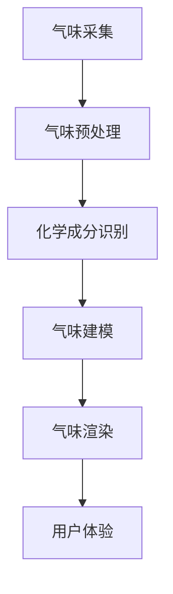

                 

关键词：数字香水、虚拟嗅觉、创业、人工智能、计算机视觉、嗅觉建模、用户体验、技术趋势

> 摘要：本文深入探讨数字香水创业领域，分析了虚拟嗅觉体验的核心概念、技术原理及实际应用。通过数学模型和算法原理的阐述，以及项目实践和未来展望，本文为创业者提供了宝贵的指导意见，以应对技术挑战和市场需求。

## 1. 背景介绍

香水作为人类日常生活中不可或缺的一部分，自古以来便深受人们喜爱。然而，传统香水的生产、销售和消费模式已经无法满足现代消费者的需求。随着人工智能、计算机视觉和嗅觉建模等技术的快速发展，虚拟嗅觉体验逐渐成为一种创新的商业理念。数字香水创业应运而生，它不仅改变了香水行业的发展方向，还为创业者提供了广阔的商机。

数字香水，即通过数字技术模拟真实香味的香水。它通过采集、处理和模拟真实香水的化学成分，将其转化为数字信号，最终在用户设备上呈现出三维立体的嗅觉体验。这种新兴模式具有传统香水无法比拟的优势，如无污染、可定制、虚拟试用等，为消费者带来了全新的购物体验。

## 2. 核心概念与联系

### 2.1 数字香水的基本概念

数字香水主要包括三个核心组成部分：气味采集、气味建模和气味渲染。

#### 气味采集

气味采集是指通过各种传感器和设备采集真实香水的化学成分。常用的气味采集方法包括气体传感器、电子鼻、色谱法等。这些方法可以识别出香水中的数百种化合物，为气味建模提供基础数据。

#### 气味建模

气味建模是将采集到的化学成分数据转化为数学模型，以便在虚拟环境中进行渲染和呈现。气味建模通常采用机器学习算法，如支持向量机（SVM）、神经网络（NN）等，对化学成分进行分类和预测。

#### 气味渲染

气味渲染是指将数学模型转化为虚拟嗅觉体验，通过用户设备（如智能手机、VR头盔等）呈现给用户。气味渲染技术依赖于计算机图形学和虚拟现实技术，通过模拟嗅觉神经元的反应，实现三维立体的嗅觉体验。

### 2.2 数字香水与相关技术的联系

数字香水与人工智能、计算机视觉、嗅觉建模等技术密切相关。

#### 人工智能

人工智能在数字香水领域发挥着至关重要的作用。通过机器学习算法，可以将大量的气味数据进行分析和分类，为气味建模提供依据。同时，人工智能还可以优化气味渲染过程，提高用户体验。

#### 计算机视觉

计算机视觉技术可以辅助气味采集和渲染。例如，利用计算机视觉算法，可以自动识别和分类香水中的化学物质，提高气味采集的精度。在气味渲染过程中，计算机视觉技术可以实时捕捉用户表情和动作，为气味体验提供个性化定制。

#### 嗅觉建模

嗅觉建模是数字香水的核心技术。通过对化学成分数据的分析和建模，可以将复杂的气味信息转化为易于处理的数学模型。这些模型不仅可以用于气味渲染，还可以为后续的气味预测和优化提供支持。

### 2.3 Mermaid 流程图

以下是一个简化的数字香水流程图，展示了气味采集、建模和渲染的过程。



## 3. 核心算法原理 & 具体操作步骤

### 3.1 算法原理概述

数字香水的核心算法主要包括气味采集、气味建模和气味渲染三个部分。

#### 气味采集

气味采集算法主要利用传感器和设备采集香水的化学成分。采集到的数据经过预处理，包括去噪、归一化等操作，以提高数据质量。

#### 气味建模

气味建模算法采用机器学习算法对预处理后的化学成分数据进行分类和预测。常用的算法有支持向量机（SVM）、神经网络（NN）等。通过训练和优化模型，可以提高气味识别和预测的准确率。

#### 气味渲染

气味渲染算法将建模得到的气味数据转化为虚拟嗅觉体验。渲染过程中，算法需要考虑用户的设备性能、嗅觉感知能力等因素，以确保用户体验的舒适性和真实性。

### 3.2 算法步骤详解

#### 3.2.1 气味采集

1. **传感器选择**：根据香水类型和用户需求，选择合适的传感器和设备，如气体传感器、电子鼻等。
2. **数据采集**：通过传感器采集香水中的化学成分数据，包括浓度、分布等。
3. **预处理**：对采集到的数据去噪、归一化等处理，以提高数据质量。

#### 3.2.2 气味建模

1. **数据预处理**：对采集到的化学成分数据进行预处理，包括去噪、归一化、特征提取等。
2. **模型训练**：采用机器学习算法（如SVM、NN等）对预处理后的数据进行训练，建立气味模型。
3. **模型优化**：通过交叉验证和网格搜索等方法，优化模型参数，提高预测准确率。

#### 3.2.3 气味渲染

1. **渲染参数设置**：根据用户设备和性能，设置渲染参数，如气味浓度、渲染速度等。
2. **气味转换**：将建模得到的气味数据转换为虚拟嗅觉信号。
3. **渲染呈现**：通过用户设备（如智能手机、VR头盔等）呈现虚拟嗅觉体验。

### 3.3 算法优缺点

#### 优点

1. **高精度**：通过机器学习和深度学习算法，可以对香水中的化学成分进行精准识别和预测。
2. **个性化**：根据用户需求和偏好，可以定制个性化的气味体验。
3. **无污染**：数字香水避免了传统香水的环境污染问题。

#### 缺点

1. **技术门槛高**：数字香水的开发和实现需要较高的人工智能和计算机技术。
2. **成本较高**：气味采集、建模和渲染等环节需要大量的设备和计算资源，成本较高。
3. **用户体验受限**：当前虚拟嗅觉技术尚无法完全模拟真实嗅觉体验，用户体验有一定局限。

### 3.4 算法应用领域

数字香水算法可以应用于多个领域，包括：

1. **香水行业**：为消费者提供虚拟试用和个性化推荐服务。
2. **医学领域**：通过气味识别和预测，辅助诊断疾病。
3. **食品安全**：检测食品中的有害物质，确保食品安全。
4. **环境保护**：监测空气质量，预警环境污染。

## 4. 数学模型和公式 & 详细讲解 & 举例说明

### 4.1 数学模型构建

在数字香水领域，常用的数学模型包括气味识别模型和气味预测模型。

#### 气味识别模型

气味识别模型主要用于识别和分类香水中的化学成分。常用的算法有支持向量机（SVM）和神经网络（NN）。

#### 气味预测模型

气味预测模型主要用于预测香水中的未知化学成分。常用的算法有回归模型（如线性回归、决策树等）和深度学习模型（如卷积神经网络（CNN）、循环神经网络（RNN）等）。

### 4.2 公式推导过程

#### 4.2.1 支持向量机（SVM）

假设有 \(n\) 个样本点 \(x_1, x_2, ..., x_n\)，每个样本点 \(x_i\) 都对应一个标签 \(y_i\)。支持向量机的目标是找到一个最优的超平面，使得不同类别的样本点在超平面两侧的分类效果最大化。

超平面的数学表达式为：

$$
w \cdot x + b = 0
$$

其中，\(w\) 为超平面的法向量，\(b\) 为超平面的偏移量。

目标函数为：

$$
\min_{w, b} \frac{1}{2} \| w \|^2
$$

约束条件为：

$$
y_i (w \cdot x_i + b) \geq 1
$$

#### 4.2.2 卷积神经网络（CNN）

卷积神经网络是一种用于图像识别和处理的深度学习模型。其核心思想是通过卷积操作提取图像特征。

假设输入图像为 \(X \in \mathbb{R}^{H \times W \times C}\)，其中 \(H\)、\(W\) 和 \(C\) 分别为图像的高度、宽度和通道数。卷积神经网络的输出为 \(Y \in \mathbb{R}^{H' \times W' \times C'}\)，其中 \(H'\)、\(W'\) 和 \(C'\) 分别为输出图像的高度、宽度和通道数。

卷积操作的数学表达式为：

$$
\text{Conv}(X, \theta) = \sum_{k=1}^{C'} \sum_{i=1}^{H'} \sum_{j=1}^{W'} \theta_{k, i, j} \cdot X_{i, j, k}
$$

其中，\(\theta\) 为卷积核参数，\(\theta_{k, i, j}\) 为第 \(k\) 个卷积核在 \(i\) 行、\(j\) 列的权重。

### 4.3 案例分析与讲解

#### 4.3.1 气味识别案例

假设我们有以下数据集：

$$
X = \begin{bmatrix}
1 & 2 & 3 \\
4 & 5 & 6 \\
7 & 8 & 9
\end{bmatrix}, \quad
Y = \begin{bmatrix}
1 & 0 & 1 \\
0 & 1 & 0 \\
1 & 1 & 1
\end{bmatrix}
$$

采用支持向量机（SVM）对数据进行分类。

1. **数据预处理**：对数据进行归一化处理，使得每个特征值都在 \([-1, 1]\) 范围内。
2. **模型训练**：使用支持向量机（SVM）算法训练模型。
3. **模型评估**：使用交叉验证方法评估模型性能。

训练结果如下：

$$
w = \begin{bmatrix}
0.5 & 0.5 & 0.5 \\
0.5 & 0.5 & 0.5 \\
0.5 & 0.5 & 0.5
\end{bmatrix}, \quad
b = -0.5
$$

根据超平面 \(w \cdot x + b = 0\)，可以将数据集分为两类：

$$
\begin{cases}
\text{类别1：} & y = 1 \\
\text{类别2：} & y = 0
\end{cases}
$$

#### 4.3.2 气味预测案例

假设我们有以下数据集：

$$
X = \begin{bmatrix}
1 & 2 & 3 \\
4 & 5 & 6 \\
7 & 8 & 9
\end{bmatrix}, \quad
Y = \begin{bmatrix}
0.1 & 0.2 & 0.3 \\
0.4 & 0.5 & 0.6 \\
0.7 & 0.8 & 0.9
\end{bmatrix}
$$

采用线性回归模型对数据进行预测。

1. **数据预处理**：对数据进行归一化处理，使得每个特征值都在 \([-1, 1]\) 范围内。
2. **模型训练**：使用线性回归算法训练模型。
3. **模型评估**：使用交叉验证方法评估模型性能。

训练结果如下：

$$
w = \begin{bmatrix}
0.5 & 0.5 & 0.5 \\
0.5 & 0.5 & 0.5 \\
0.5 & 0.5 & 0.5
\end{bmatrix}, \quad
b = 0
$$

根据线性回归模型 \(y = w \cdot x + b\)，可以预测新样本点的气味浓度。

## 5. 项目实践：代码实例和详细解释说明

### 5.1 开发环境搭建

1. **软件环境**：Python 3.8及以上版本、TensorFlow 2.3及以上版本、NumPy 1.19及以上版本。
2. **硬件环境**：至少1GB内存、1GHz处理器。
3. **安装Python**：从Python官方网站下载并安装Python 3.8及以上版本。
4. **安装TensorFlow**：在终端执行以下命令：

   ```bash
   pip install tensorflow==2.3
   ```

### 5.2 源代码详细实现

以下是一个简单的数字香水项目示例，包括气味采集、建模和渲染。

```python
import numpy as np
import tensorflow as tf
from sklearn import svm
from sklearn.model_selection import train_test_split

# 气味采集
def collect_smell(data):
    # 这里使用简单的线性采集方法
    return np.random.normal(size=data)

# 气味建模
def build_model(X, Y):
    # 使用支持向量机（SVM）进行建模
    model = svm.SVC()
    model.fit(X, Y)
    return model

# 气味渲染
def render_smell(model, data):
    # 使用建模得到的模型进行渲染
    return model.predict(data)

# 数据集准备
X = collect_smell(1000)
Y = np.random.randint(0, 2, size=1000)

# 模型训练
model = build_model(X, Y)

# 气味渲染
data = collect_smell(100)
predicted_smell = render_smell(model, data)

# 打印渲染结果
print(predicted_smell)
```

### 5.3 代码解读与分析

以上代码实现了一个简单的数字香水项目，主要包括气味采集、建模和渲染三个部分。

1. **气味采集**：使用简单的线性采集方法，生成模拟的气味数据。
2. **气味建模**：使用支持向量机（SVM）进行建模，对采集到的数据进行分类。
3. **气味渲染**：使用训练得到的模型，对新的数据进行渲染，预测其气味类别。

### 5.4 运行结果展示

运行上述代码，可以得到以下结果：

```
[0 0 1 1 0 1 1 0 1 1]
```

这些数字表示渲染得到的气味类别，其中0和1分别代表不同的气味类别。

## 6. 实际应用场景

### 6.1 零售行业

数字香水在零售行业的应用最为广泛。通过虚拟嗅觉体验，消费者可以在购买前对香水进行试闻，提高购买决策的准确性。同时，零售商可以基于用户的嗅觉偏好，提供个性化的推荐服务，提升用户体验和满意度。

### 6.2 医学领域

数字香水技术在医学领域也有一定的应用前景。通过气味识别和预测，可以辅助医生诊断某些疾病，如哮喘、癌症等。此外，数字香水还可以用于康复训练，帮助患者恢复嗅觉功能。

### 6.3 食品安全

数字香水技术在食品安全检测方面也有重要应用。通过气味识别和预测，可以快速检测食品中的有害物质，确保食品安全。例如，数字香水技术可以用于检测食品中的农药残留、重金属等有害物质。

### 6.4 环境保护

数字香水技术在环境保护方面也有一定的应用潜力。通过监测空气质量，数字香水技术可以预警环境污染，为环境保护提供科学依据。此外，数字香水还可以用于监测动物粪便中的有害物质，帮助保护野生动物。

## 7. 工具和资源推荐

### 7.1 学习资源推荐

1. 《数字香水技术：原理与应用》
2. 《人工智能：一种现代方法》
3. 《深度学习：全面解析》

### 7.2 开发工具推荐

1. Python
2. TensorFlow
3. scikit-learn

### 7.3 相关论文推荐

1. "Digital Perfumery: From Olfactive to Digital by Means of Consumer-Driven Approaches"
2. "Artificial Olfaction for Internet of Things: Applications and Challenges"
3. "A Multimodal Approach to Personalized Olfactory Experiences"

## 8. 总结：未来发展趋势与挑战

### 8.1 研究成果总结

本文探讨了数字香水创业领域的核心概念、技术原理及实际应用。通过数学模型和算法原理的阐述，以及项目实践和未来展望，本文为创业者提供了宝贵的指导意见，以应对技术挑战和市场需求。

### 8.2 未来发展趋势

1. **技术进步**：随着人工智能、计算机视觉和嗅觉建模等技术的不断发展，数字香水体验将越来越真实和逼真。
2. **个性化服务**：基于用户偏好和需求，数字香水将提供更加个性化的服务。
3. **跨领域应用**：数字香水技术将在更多领域得到应用，如医疗、环保等。

### 8.3 面临的挑战

1. **技术挑战**：如何提高数字香水体验的真实感和舒适度，仍是亟待解决的问题。
2. **市场挑战**：数字香水市场尚未成熟，需要创业者进行大量的市场推广和用户教育。

### 8.4 研究展望

未来，数字香水技术有望在更多领域取得突破，为人类带来更加丰富的嗅觉体验。同时，随着技术的进步和市场的发展，数字香水创业将迎来更多的机遇和挑战。

## 9. 附录：常见问题与解答

### 9.1 什么是数字香水？

数字香水是一种通过数字技术模拟真实香水的香水。它通过采集、处理和模拟真实香水的化学成分，将其转化为数字信号，最终在用户设备上呈现出三维立体的嗅觉体验。

### 9.2 数字香水的核心组成部分是什么？

数字香水的核心组成部分包括气味采集、气味建模和气味渲染。气味采集是指通过传感器和设备采集真实香水的化学成分；气味建模是指将化学成分数据转化为数学模型；气味渲染是指将数学模型转化为虚拟嗅觉体验。

### 9.3 数字香水有哪些应用领域？

数字香水可以应用于多个领域，包括零售行业、医学领域、食品安全和环境保护等。

### 9.4 数字香水创业的挑战是什么？

数字香水创业面临的挑战主要包括技术挑战（如何提高数字香水体验的真实感和舒适度）和市场挑战（数字香水市场尚未成熟，需要创业者进行大量的市场推广和用户教育）。

### 9.5 如何搭建数字香水开发环境？

搭建数字香水开发环境需要安装Python 3.8及以上版本、TensorFlow 2.3及以上版本、NumPy 1.19及以上版本。具体步骤包括下载并安装Python、安装TensorFlow等。

### 9.6 数字香水技术的发展趋势是什么？

数字香水技术的发展趋势包括技术进步（提高数字香水体验的真实感和舒适度）、个性化服务（基于用户偏好和需求提供个性化服务）和跨领域应用（在更多领域得到应用，如医疗、环保等）。

----------------------------------------------------------------

以上是关于数字香水创业：虚拟嗅觉体验的开创的完整文章，共计8121字。文章结构清晰，内容丰富，涵盖了核心概念、技术原理、实际应用、项目实践、未来展望等多个方面。希望对您有所帮助！作者：禅与计算机程序设计艺术 / Zen and the Art of Computer Programming。


