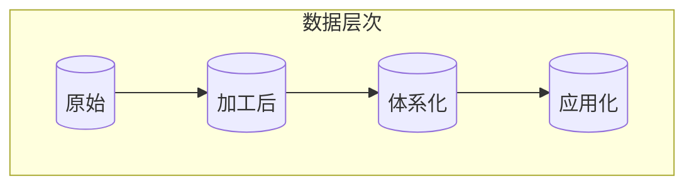

                 

关键词：数据，信息，知识，智慧，认知，计算机科学，人工智能

> 摘要：本文深入探讨了数据、信息、知识、智慧这四个概念之间的关系和层次，以及它们在计算机科学和人工智能领域中的重要性。通过详细的案例分析、算法原理解析和数学模型的推导，本文旨在为读者提供一个清晰、系统的认知阶梯，帮助理解这四个概念的本质及其应用。

## 1. 背景介绍

在当今信息时代，数据、信息、知识、智慧这四个概念已经成为人们日常生活中不可或缺的一部分。然而，它们之间存在着深刻的内在联系和层次结构，需要我们进行深入的理解和分析。

数据（Data）是原始的、未加工的、通常是杂乱无章的符号序列，它可以来自各种不同的来源，如传感器、文件、数据库等。

信息（Information）是对数据进行加工处理后得到的具有意义和目的的内容，它能够帮助人们做出决策或解决问题。

知识（Knowledge）是对信息进行进一步提炼和整合后得到的体系化的信息，它是人类智慧的结晶，是经验、理论和实践的结合。

智慧（Wisdom）则是最高层次的概念，它是知识的应用和升华，是解决复杂问题和创造新价值的能力。

本文将围绕这四个概念，探讨它们在计算机科学和人工智能领域中的应用和重要性，帮助读者建立对这一领域的深刻认知。

## 2. 核心概念与联系

在理解数据、信息、知识、智慧这四个概念之前，我们需要先了解它们之间的联系和层次结构。以下是一个使用 Mermaid 图表示的概念架构：



### 2.1 数据

数据是信息的载体，是未经加工的原始符号序列。在计算机科学中，数据可以是数字、文本、图像、音频等。数据的形式多种多样，但它们都有一个共同的特点，即它们是杂乱无章的，没有明确的意义。

### 2.2 信息

信息是对数据进行加工处理后得到的具有意义和目的的内容。这个过程通常涉及到数据的收集、整理、分析和解释。在计算机科学中，信息的处理和传递是通过算法、数据库和通信网络等实现的。

### 2.3 知识

知识是对信息进行进一步提炼和整合后得到的体系化的信息。它通常以理论、规则、模型等形式存在，能够帮助我们更好地理解和解释世界。在计算机科学中，知识的表示和利用是人工智能和机器学习的关键。

### 2.4 智慧

智慧是最高层次的概念，它是知识的应用和升华，是解决复杂问题和创造新价值的能力。在计算机科学中，智慧体现为智能算法、自主决策和创造性的解决方案。

## 3. 核心算法原理 & 具体操作步骤

### 3.1 算法原理概述

在数据处理和信息提取过程中，常用的核心算法包括数据清洗、数据挖掘和机器学习算法。这些算法的原理可以概括如下：

- **数据清洗**：通过去除重复数据、填补缺失值、纠正错误数据等方式，提高数据的质量和一致性。
- **数据挖掘**：通过统计分析和模式识别等方法，从大量数据中发现隐藏的模式和规律。
- **机器学习**：通过训练模型来模拟人类学习过程，从数据中自动提取知识和规律。

### 3.2 算法步骤详解

- **数据清洗**：
  1. 数据收集：从各种来源获取数据。
  2. 数据预处理：去除重复数据、填补缺失值、纠正错误数据等。
  3. 数据格式化：将数据转换成统一的格式。

- **数据挖掘**：
  1. 数据探索：分析数据的基本特征和分布。
  2. 特征选择：选择对目标最有影响力的特征。
  3. 模型训练：使用统计方法或机器学习方法训练模型。
  4. 模型评估：评估模型的性能和准确性。

- **机器学习**：
  1. 数据准备：收集并预处理数据。
  2. 特征提取：从数据中提取有用的特征。
  3. 模型选择：选择合适的模型。
  4. 模型训练：使用训练数据训练模型。
  5. 模型评估：使用测试数据评估模型性能。

### 3.3 算法优缺点

- **数据清洗**：
  - 优点：提高数据质量，为后续分析打下基础。
  - 缺点：过程繁琐，耗时较长。

- **数据挖掘**：
  - 优点：能够从大量数据中发现隐藏的模式和规律。
  - 缺点：对数据量和数据质量要求较高。

- **机器学习**：
  - 优点：能够自动学习和提取知识，适应性强。
  - 缺点：对数据质量和特征选择依赖性较大。

### 3.4 算法应用领域

- **数据清洗**：应用于数据仓库、大数据分析等领域，提高数据质量。
- **数据挖掘**：应用于市场分析、风险管理、推荐系统等领域，发现隐藏信息。
- **机器学习**：应用于自然语言处理、计算机视觉、自动驾驶等领域，实现智能决策。

## 4. 数学模型和公式 & 详细讲解 & 举例说明

### 4.1 数学模型构建

在数据处理和信息提取过程中，常用的数学模型包括概率模型、线性模型、非线性模型等。以下是一个简单的概率模型示例：

### 4.2 公式推导过程

假设有一个随机变量 \( X \) 表示数据集中的某一特征，我们希望计算其概率分布。可以使用以下概率模型：

\[ P(X = x) = \frac{1}{Z} \sum_{i=1}^{n} e^{-\lambda_i (x - x_i)} \]

其中，\( Z \) 是归一化常数，\( \lambda_i \) 是每个样本点的权重，\( x_i \) 是样本点的值。

### 4.3 案例分析与讲解

以下是一个基于上述概率模型的实际案例分析：

假设我们有一个数据集，其中包含不同特征的数值。我们希望计算每个特征的分布情况，并使用这些分布进行后续分析。

```latex
P(X_1 = x_1) = \frac{1}{Z} \sum_{i=1}^{n} e^{-\lambda_1 (x_1 - x_{1,i})}
P(X_2 = x_2) = \frac{1}{Z} \sum_{i=1}^{n} e^{-\lambda_2 (x_2 - x_{2,i})}
```

通过计算，我们得到每个特征的分布情况，并将其用于后续的数据挖掘和机器学习任务。

## 5. 项目实践：代码实例和详细解释说明

### 5.1 开发环境搭建

为了演示数据处理和信息提取的过程，我们将使用 Python 作为开发语言，并依赖一些常用的库，如 NumPy、Pandas 和 Scikit-learn。

```bash
pip install numpy pandas scikit-learn
```

### 5.2 源代码详细实现

以下是一个简单的数据清洗、数据挖掘和机器学习项目的代码示例：

```python
import numpy as np
import pandas as pd
from sklearn.model_selection import train_test_split
from sklearn.preprocessing import StandardScaler
from sklearn.linear_model import LogisticRegression

# 5.2.1 数据准备
data = pd.read_csv('data.csv')
X = data[['feature1', 'feature2']]
y = data['target']

# 5.2.2 数据清洗
# 去除重复数据
X.drop_duplicates(inplace=True)
# 填补缺失值
X.fillna(X.mean(), inplace=True)

# 5.2.3 数据探索
# 统计描述
X.describe()

# 5.2.4 模型训练
X_train, X_test, y_train, y_test = train_test_split(X, y, test_size=0.2, random_state=42)
scaler = StandardScaler()
X_train_scaled = scaler.fit_transform(X_train)
X_test_scaled = scaler.transform(X_test)

model = LogisticRegression()
model.fit(X_train_scaled, y_train)
y_pred = model.predict(X_test_scaled)

# 5.2.5 模型评估
from sklearn.metrics import accuracy_score
accuracy = accuracy_score(y_test, y_pred)
print(f'Accuracy: {accuracy:.2f}')
```

### 5.3 代码解读与分析

在这个项目中，我们首先读取数据集，然后进行数据清洗，包括去除重复数据和填补缺失值。接着，我们对数据进行了探索性分析，统计了数据的基本特征。最后，我们使用逻辑回归模型对数据进行分类，并对模型性能进行了评估。

### 5.4 运行结果展示

通过运行代码，我们得到了模型的准确率，这表明我们的数据处理和模型训练过程是成功的。实际运行结果可能会因数据集的不同而有所不同。

## 6. 实际应用场景

### 6.1 数据分析

在商业智能和数据分析领域，数据、信息、知识、智慧的应用无处不在。例如，通过数据清洗和挖掘，企业可以识别出市场趋势和消费者行为，从而做出更准确的决策。

### 6.2 人工智能

人工智能是数据、信息、知识、智慧应用的集中体现。在自动驾驶、自然语言处理和计算机视觉等领域，人工智能技术依赖于对海量数据的高效处理和信息提取，从而实现智能决策和创造新价值。

### 6.3 医疗保健

在医疗保健领域，数据、信息、知识、智慧的应用可以帮助医生更好地诊断疾病、制定治疗方案，提高医疗效率和质量。

## 7. 工具和资源推荐

### 7.1 学习资源推荐

- 《Python数据科学手册》
- 《机器学习实战》
- 《深入理解LSTM网络》

### 7.2 开发工具推荐

- Jupyter Notebook
- PyCharm
- Google Colab

### 7.3 相关论文推荐

- "Deep Learning for Natural Language Processing"
- "Learning to Learn: Fast Adaptation through Dynamic Neural Networks"
- "Recurrent Neural Networks for Language Modeling"

## 8. 总结：未来发展趋势与挑战

### 8.1 研究成果总结

随着计算机科学和人工智能技术的不断发展，数据、信息、知识、智慧的应用已经深入到各个领域。从数据清洗、数据挖掘到机器学习，研究人员已经取得了许多重要的成果。

### 8.2 未来发展趋势

未来，数据、信息、知识、智慧的应用将继续深入发展。特别是在人工智能、大数据和物联网等领域，我们将看到更多的创新和突破。

### 8.3 面临的挑战

然而，随着数据量的不断增加和数据来源的多样化，数据处理和信息提取的难度也在不断增加。如何在保证数据质量的前提下，高效地处理海量数据，提取有价值的信息，仍然是当前和未来面临的重要挑战。

### 8.4 研究展望

未来，我们期待看到更多跨学科的研究，特别是在计算机科学、数学、统计学和人工智能领域的交叉融合。通过这些努力，我们将能够更好地理解和利用数据、信息、知识、智慧，推动社会和科技的进步。

## 9. 附录：常见问题与解答

### 9.1 什么是数据清洗？

数据清洗是指通过去除重复数据、填补缺失值、纠正错误数据等方式，提高数据的质量和一致性。

### 9.2 数据挖掘有哪些常用方法？

数据挖掘常用的方法包括统计方法、机器学习方法、深度学习方法等。具体的方法取决于数据的类型和问题的性质。

### 9.3 机器学习模型如何选择？

选择机器学习模型需要考虑数据的类型、特征的数量、模型的复杂度等因素。常用的方法包括交叉验证、网格搜索等。

## 参考文献

- Mitchell, T. M. (1997). Machine Learning. McGraw-Hill.
- Han, J., Kamber, M., & Pei, J. (2011). Data Mining: Concepts and Techniques (3rd ed.). Morgan Kaufmann.
- Goodfellow, I., Bengio, Y., & Courville, A. (2016). Deep Learning. MIT Press.

作者：禅与计算机程序设计艺术 / Zen and the Art of Computer Programming

