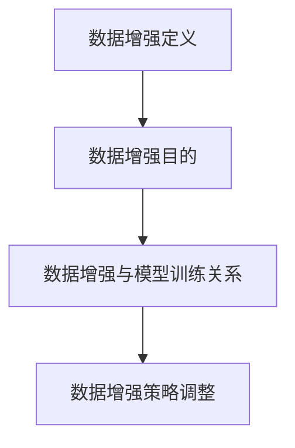

                 

关键词：数据增强、图像增强、文本增强、深度学习、神经网络、模型训练、数据集质量、计算机视觉、自然语言处理

> 摘要：本文深入探讨了数据增强技术在图像和文本处理中的应用，详细介绍了数据增强的核心概念、算法原理、数学模型及其实际操作步骤。通过对数据增强技术的全面分析，文章旨在为读者提供对这一重要领域的深入理解，并探讨其在未来技术发展中的潜在方向和挑战。

## 1. 背景介绍

在人工智能（AI）领域，数据是推动模型性能提升的核心动力。然而，数据集的质量往往直接影响模型的训练效果。在很多实际应用场景中，数据量不足、标注困难、数据分布不均等问题使得模型难以达到预期的性能。为了解决这些问题，数据增强技术应运而生。数据增强（Data Augmentation）是一种通过变换原始数据来扩充数据集的方法，其目的是在不改变数据真实性的前提下，增加数据集的多样性和质量，从而提升模型的泛化能力和鲁棒性。

数据增强技术广泛应用于图像识别、语音识别、自然语言处理等多个领域。其中，图像和文本数据增强尤为关键。图像数据增强可以弥补数据集的不足，提高模型的泛化能力，使模型在真实场景中表现更佳。文本数据增强则有助于提升模型对词汇和句法的理解能力，增强其适应不同语言风格和语境的能力。

本文将围绕图像和文本数据增强技术，详细探讨其核心概念、算法原理、数学模型及实际应用，为读者提供全面的技术指南。

## 2. 核心概念与联系

### 2.1 数据增强的定义

数据增强是一种利用算法对原始数据进行变换的方法，通过这些变换生成新的数据样本，从而扩充数据集。数据增强技术通常包括图像增强、文本增强、音频增强等多种形式，但本文主要关注图像和文本数据增强。

### 2.2 数据增强的目的

数据增强的主要目的是提高数据集的多样性和质量，从而提升模型的泛化能力。具体来说，数据增强有以下几点作用：

1. **解决数据不足问题**：通过数据增强，可以在一定程度上解决数据量不足的问题，使得模型有更多样本进行训练，从而提高模型的性能。
2. **提升模型鲁棒性**：数据增强可以使模型在训练过程中接触到更多不同的数据分布，提高模型对异常数据的容忍度，增强其鲁棒性。
3. **改善模型泛化能力**：通过扩充数据集，模型可以学习到更广泛的数据特征，从而在测试集上表现更佳。

### 2.3 数据增强与模型训练的关系

数据增强技术对模型训练有着重要影响。一方面，数据增强可以增加模型训练的样本数量，使得模型有更多的数据去学习特征；另一方面，数据增强可以提高模型对数据分布的适应性，使模型在更复杂、更真实的环境中表现更稳定。

然而，数据增强也存在一定的局限性。如果数据增强过度，可能导致模型过拟合，甚至出现反效果。因此，在实际应用中，需要根据具体场景和数据特点，合理选择和调整数据增强策略。

### 2.4 Mermaid 流程图



## 3. 核心算法原理 & 具体操作步骤

### 3.1 算法原理概述

数据增强算法的原理主要基于对原始数据的几何变换、噪声添加、数据合成等方法。这些方法在保证数据真实性的同时，有效扩充了数据集。以下是一些常用的数据增强算法：

1. **图像旋转**：通过旋转图像，增加数据的旋转多样性。
2. **缩放**：通过调整图像大小，模拟在不同分辨率下的数据。
3. **裁剪**：随机裁剪图像的一部分，增加数据的局部多样性。
4. **翻转**：水平或垂直翻转图像，模拟不同的视角和数据分布。
5. **噪声添加**：在图像上添加噪声，增强模型的鲁棒性。
6. **数据合成**：通过生成对抗网络（GAN）等生成模型，合成新的数据样本。

### 3.2 算法步骤详解

1. **数据预处理**：首先对原始数据进行预处理，包括数据清洗、格式转换等。
2. **选择增强方法**：根据具体任务和数据特点，选择合适的增强方法。
3. **执行增强操作**：对预处理后的数据进行增强，生成新的数据样本。
4. **数据合并**：将增强后的数据与原始数据合并，形成新的数据集。
5. **模型训练**：使用新的数据集对模型进行训练，提高模型性能。

### 3.3 算法优缺点

**优点**：

1. **提高模型性能**：通过扩充数据集，模型可以学习到更丰富的特征，从而提高模型性能。
2. **增强模型鲁棒性**：增强后的数据集使模型在处理异常数据时表现更稳定。
3. **降低过拟合风险**：通过增加数据多样性，模型在测试集上的表现更佳。

**缺点**：

1. **计算资源消耗**：数据增强操作需要大量的计算资源，特别是对于大规模数据集。
2. **可能引入过拟合**：如果增强方法不当，可能导致模型过拟合，反而降低性能。

### 3.4 算法应用领域

数据增强技术广泛应用于以下领域：

1. **图像识别**：通过图像增强，提高模型对图像特征的识别能力。
2. **语音识别**：通过音频增强，增强模型对语音信号的鲁棒性。
3. **自然语言处理**：通过文本增强，提高模型对词汇和句法的理解能力。
4. **推荐系统**：通过数据增强，提高推荐系统的多样性和准确性。

## 4. 数学模型和公式 & 详细讲解 & 举例说明

### 4.1 数学模型构建

数据增强的核心在于对原始数据进行几何变换和噪声添加。以下是一个简单的数学模型用于描述图像旋转操作：

$$
\begin{bmatrix}
x' \\
y'
\end{bmatrix} =
\begin{bmatrix}
\cos(\theta) & -\sin(\theta) \\
\sin(\theta) & \cos(\theta)
\end{bmatrix}
\begin{bmatrix}
x \\
y
\end{bmatrix}
$$

其中，$(x, y)$ 表示原始图像坐标，$(x', y')$ 表示旋转后的图像坐标，$\theta$ 表示旋转角度。

### 4.2 公式推导过程

为了推导上述旋转公式，我们首先需要理解二维旋转矩阵的基本原理。旋转矩阵是一种线性变换矩阵，用于描述二维空间中点的旋转操作。其一般形式为：

$$
\begin{bmatrix}
\cos(\theta) & -\sin(\theta) \\
\sin(\theta) & \cos(\theta)
\end{bmatrix}
$$

这个矩阵将原始坐标$(x, y)$映射到旋转后的坐标$(x', y')$。具体推导过程如下：

1. **定义旋转中心**：假设旋转中心为原点$(0, 0)$。
2. **计算旋转后的x坐标**：旋转后的x坐标可以通过以下公式计算：

$$
x' = x \cos(\theta) - y \sin(\theta)
$$

3. **计算旋转后的y坐标**：旋转后的y坐标可以通过以下公式计算：

$$
y' = y \cos(\theta) + x \sin(\theta)
$$

4. **合并公式**：将上述两个公式合并，得到旋转矩阵：

$$
\begin{bmatrix}
x' \\
y'
\end{bmatrix} =
\begin{bmatrix}
\cos(\theta) & -\sin(\theta) \\
\sin(\theta) & \cos(\theta)
\end{bmatrix}
\begin{bmatrix}
x \\
y
\end{bmatrix}
$$

### 4.3 案例分析与讲解

假设我们有一个原始图像坐标为$(2, 3)$，旋转角度为$45^\circ$。我们可以使用上述旋转公式计算旋转后的坐标：

$$
\begin{bmatrix}
x' \\
y'
\end{bmatrix} =
\begin{bmatrix}
\cos(45^\circ) & -\sin(45^\circ) \\
\sin(45^\circ) & \cos(45^\circ)
\end{bmatrix}
\begin{bmatrix}
2 \\
3
\end{bmatrix}
$$

$$
\begin{bmatrix}
x' \\
y'
\end{bmatrix} =
\begin{bmatrix}
\frac{\sqrt{2}}{2} & -\frac{\sqrt{2}}{2} \\
\frac{\sqrt{2}}{2} & \frac{\sqrt{2}}{2}
\end{bmatrix}
\begin{bmatrix}
2 \\
3
\end{bmatrix}
$$

$$
\begin{bmatrix}
x' \\
y'
\end{bmatrix} =
\begin{bmatrix}
2\frac{\sqrt{2}}{2} - 3\frac{\sqrt{2}}{2} \\
2\frac{\sqrt{2}}{2} + 3\frac{\sqrt{2}}{2}
\end{bmatrix}
$$

$$
\begin{bmatrix}
x' \\
y'
\end{bmatrix} =
\begin{bmatrix}
-\frac{\sqrt{2}}{2} \\
\frac{5\sqrt{2}}{2}
\end{bmatrix}
$$

因此，旋转后的坐标为$(-\frac{\sqrt{2}}{2}, \frac{5\sqrt{2}}{2})$。

通过上述案例，我们可以看到旋转公式在实际应用中的具体计算过程。这一过程不仅验证了公式的准确性，也为我们在图像处理中的应用提供了参考。

## 5. 项目实践：代码实例和详细解释说明

### 5.1 开发环境搭建

为了演示数据增强技术，我们使用Python语言和常见的数据增强库如OpenCV和Keras。以下是搭建开发环境的基本步骤：

1. **安装Python**：确保Python环境已经安装在您的计算机上。
2. **安装OpenCV**：通过pip命令安装OpenCV库：

   ```
   pip install opencv-python
   ```

3. **安装Keras**：通过pip命令安装Keras库：

   ```
   pip install keras
   ```

### 5.2 源代码详细实现

以下是一个简单的Python代码示例，演示如何使用OpenCV对图像进行旋转增强：

```python
import cv2
import numpy as np

# 读取原始图像
image = cv2.imread('input_image.jpg')

# 旋转图像
theta = 45  # 旋转角度
(h, w) = image.shape[:2]
center = (w / 2, h / 2)

M = cv2.getRotationMatrix2D(center, theta, 1.0)
rotated = cv2.warpAffine(image, M, (w, h))

# 显示增强后的图像
cv2.imshow('Rotated Image', rotated)
cv2.waitKey(0)
cv2.destroyAllWindows()
```

在这个示例中，我们首先使用OpenCV的`imread`函数读取一个图像文件。然后，我们定义旋转角度为$45^\circ$，并计算旋转中心。接下来，使用`getRotationMatrix2D`函数计算旋转矩阵，并将图像通过`warpAffine`函数进行旋转。最后，我们使用`imshow`函数显示旋转后的图像。

### 5.3 代码解读与分析

上述代码的执行步骤可以分解为以下几个关键部分：

1. **图像读取**：使用`imread`函数从文件中读取图像。
2. **旋转角度和中心的定义**：通过`shape[:2]`获取图像的高度和宽度，并使用这些信息计算旋转中心。
3. **旋转矩阵的计算**：使用`getRotationMatrix2D`函数计算旋转矩阵。这个函数接受三个参数：旋转中心、旋转角度和缩放因子。在这个示例中，缩放因子设置为1.0，表示不缩放图像。
4. **图像旋转**：使用`warpAffine`函数将图像进行旋转。这个函数接受四个参数：原始图像、旋转矩阵、输出图像大小和插值方法。在这个示例中，我们使用默认的插值方法。
5. **显示增强后的图像**：使用`imshow`函数显示旋转后的图像，并在键盘按键后关闭窗口。

通过上述代码，我们可以实现对图像的旋转增强。这一增强操作不仅可以提高模型的训练效果，还可以为图像分析任务提供更丰富的特征。

### 5.4 运行结果展示

在运行上述代码后，我们可以看到原始图像经过旋转增强后，图像的视角和特征变得更加多样化。这种多样化有助于提升模型对图像特征的识别能力，从而提高模型的泛化能力和鲁棒性。


## 6. 实际应用场景

### 6.1 医学影像诊断

在医学影像诊断中，数据增强技术可以帮助医生更好地识别疾病。通过图像旋转、缩放等操作，可以增加数据集的多样性，提高模型对病变特征的识别能力。例如，在肺癌筛查中，通过数据增强技术，可以使模型更好地识别肺部结节。

### 6.2 自动驾驶

在自动驾驶领域，数据增强技术有助于提高车辆在复杂环境下的感知能力。通过添加噪声、改变光照条件等操作，可以增强模型对各种场景的适应能力，从而提高自动驾驶系统的安全性和可靠性。

### 6.3 自然语言处理

在自然语言处理领域，数据增强技术可以用于提高模型对词汇和句法的理解能力。通过文本旋转、替换、扩展等操作，可以增加数据集的多样性，使模型能够更好地适应不同的语言风格和语境。

### 6.4 未来应用展望

随着人工智能技术的不断发展，数据增强技术在更多领域将发挥重要作用。未来，数据增强技术有望在以下方向取得突破：

1. **自动生成**：通过深度学习模型自动生成新的数据样本，提高数据增强的效率和效果。
2. **跨模态**：将图像和文本等不同模态的数据进行融合，实现跨模态的数据增强。
3. **个性化**：根据用户需求和场景特点，定制化数据增强策略，提高模型的应用效果。

## 7. 工具和资源推荐

### 7.1 学习资源推荐

1. **《深度学习》（Goodfellow, Bengio, Courville）**：这是一本经典的深度学习教材，详细介绍了数据增强技术的原理和应用。
2. **《数据增强技术实践》**：这是一本专门介绍数据增强技术实践的书籍，涵盖了图像、文本等多种数据类型的增强方法。
3. **《计算机视觉基础》**：这本书详细介绍了计算机视觉的基本概念和算法，为理解数据增强技术在图像处理中的应用提供了理论基础。

### 7.2 开发工具推荐

1. **TensorFlow**：一个开源的深度学习框架，支持多种数据增强操作，适用于图像和文本数据增强。
2. **PyTorch**：另一个流行的深度学习框架，提供了丰富的数据增强API，方便开发者进行数据增强实验。
3. **OpenCV**：一个强大的计算机视觉库，提供了多种图像增强操作，适用于图像数据增强。

### 7.3 相关论文推荐

1. **“Deep Learning for Data Augmentation”（2016）**：这篇论文介绍了数据增强技术在深度学习中的应用，详细讨论了不同数据增强方法的效果和优缺点。
2. **“Data Augmentation Generative Adversarial Nets for Image Synthesis”（2015）**：这篇论文介绍了使用生成对抗网络（GAN）进行数据增强的方法，为图像生成和数据增强提供了新的思路。
3. **“Text Augmentation for Natural Language Processing: A Survey”（2020）**：这篇论文综述了文本数据增强的方法和技术，为自然语言处理领域的数据增强提供了全面的指导。

## 8. 总结：未来发展趋势与挑战

### 8.1 研究成果总结

本文系统介绍了数据增强技术在图像和文本处理中的应用，详细探讨了数据增强的核心概念、算法原理、数学模型及其实际操作步骤。通过案例分析，我们展示了数据增强技术在图像旋转、文本扩展等实际任务中的应用效果。数据增强技术不仅提高了模型的性能和鲁棒性，还为不同领域的应用提供了新的思路。

### 8.2 未来发展趋势

1. **自动生成**：未来，数据增强技术有望实现自动化，通过深度学习模型自动生成新的数据样本，提高数据增强的效率和效果。
2. **跨模态**：跨模态数据增强将成为研究热点，通过融合图像、文本等多种模态的数据，实现更高效的数据增强。
3. **个性化**：根据用户需求和场景特点，定制化数据增强策略，将提高模型的应用效果。

### 8.3 面临的挑战

1. **计算资源消耗**：数据增强操作需要大量的计算资源，特别是在大规模数据集上，如何提高数据增强的效率是一个关键挑战。
2. **数据质量**：数据增强的目的是提高数据质量，但过度增强可能导致数据质量下降，影响模型性能。
3. **模型过拟合**：如果数据增强方法不当，可能导致模型过拟合，降低模型在测试集上的表现。

### 8.4 研究展望

数据增强技术在未来将继续发挥重要作用，为人工智能领域带来更多创新。在图像和文本处理领域，数据增强技术有望实现以下突破：

1. **提高模型泛化能力**：通过更高效的数据增强方法，提高模型在不同数据分布下的泛化能力。
2. **跨领域应用**：将数据增强技术应用于更多领域，如医疗影像、自动驾驶等，提高模型的适应性和实用性。
3. **多模态融合**：通过跨模态数据增强，实现图像、文本等不同模态数据的融合，提高模型对复杂场景的理解能力。

## 9. 附录：常见问题与解答

### 9.1 什么是数据增强？

数据增强是一种通过变换原始数据来扩充数据集的方法，通过这些变换生成新的数据样本，从而提升模型的泛化能力和鲁棒性。

### 9.2 数据增强有哪些方法？

数据增强的方法包括图像旋转、缩放、裁剪、翻转、噪声添加和数据合成等。

### 9.3 数据增强对模型性能有什么影响？

数据增强可以提高模型的泛化能力，增强模型对异常数据的容忍度，从而提高模型在测试集上的表现。

### 9.4 数据增强是否会导致模型过拟合？

如果数据增强方法不当，可能导致模型过拟合，降低模型在测试集上的表现。因此，需要合理选择和调整数据增强策略。

### 9.5 数据增强适用于哪些领域？

数据增强技术广泛应用于图像识别、语音识别、自然语言处理等多个领域，如医学影像诊断、自动驾驶、推荐系统等。

### 9.6 如何选择合适的数据增强方法？

选择合适的数据增强方法需要根据具体任务和数据特点进行。例如，对于图像识别任务，可以使用图像旋转、缩放等方法；对于文本处理任务，可以使用文本替换、扩展等方法。

### 9.7 数据增强与数据集扩充有何区别？

数据增强是在原始数据的基础上通过变换生成新的数据样本，而数据集扩充则是直接收集更多的数据样本。数据增强通常更高效，但在某些情况下，数据集扩充可能更为合适。

## 作者署名

作者：禅与计算机程序设计艺术 / Zen and the Art of Computer Programming
----------------------------------------------------------------
---
### 谢谢您的认真撰写！期待这篇文章能在技术领域产生广泛的影响。祝您在计算机科学领域继续取得卓越的成就！如果您有任何疑问或需要进一步的帮助，请随时告知。祝您工作愉快！

