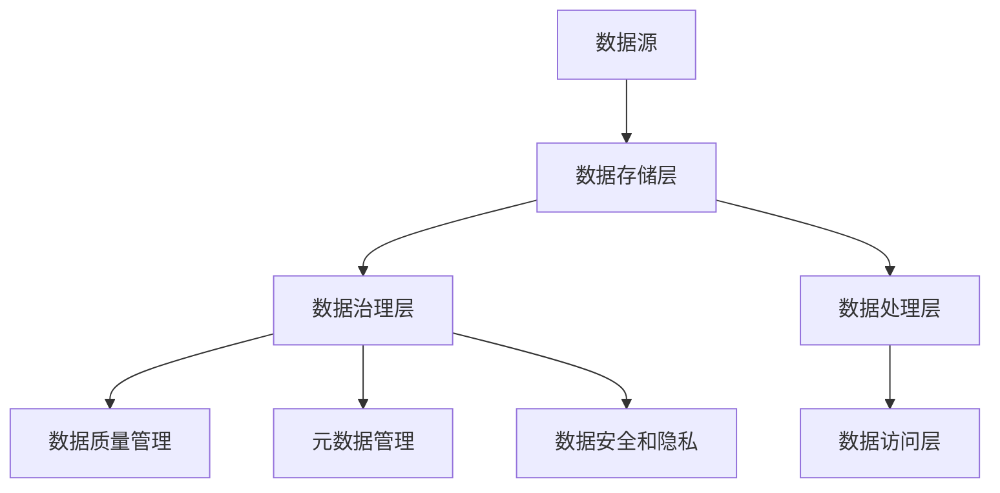

                 

关键词：数据湖、数据存储、数据分析、架构设计、大数据处理

> 摘要：本文将深入探讨数据湖架构，旨在为读者提供关于大规模数据存储和分析的全面理解。我们将介绍数据湖的核心概念、架构原理，并探讨其在现代企业中的应用及未来发展。

## 1. 背景介绍

在信息技术快速发展的今天，企业面临着海量的数据生成、处理和存储需求。传统的数据仓库模式已无法满足这种高速增长的数据处理需求，因此，数据湖架构应运而生。数据湖是一种新的数据存储架构，旨在处理和分析各种类型的数据，包括结构化、半结构化和非结构化数据。

随着互联网、物联网和移动设备的普及，数据生成速度越来越快，数据类型也越来越多样化。这给企业的数据管理和分析带来了巨大挑战。传统的数据仓库依赖于预先定义的数据模型和结构，而数据湖则采用了一种更灵活、更动态的方式来存储和管理数据。

本文将围绕数据湖架构展开，包括其核心概念、架构原理、核心算法、数学模型、项目实践以及实际应用场景等方面进行深入探讨。

## 2. 核心概念与联系

### 2.1 数据湖的定义

数据湖是一种大规模的数据存储解决方案，它将原始数据存储在原始格式中，而不是像传统数据仓库那样进行结构化处理。数据湖可以存储各种类型的数据，包括文本、图像、音频、视频等，这些数据可以随时进行处理和分析。

### 2.2 数据湖与数据仓库的比较

数据仓库是一种基于结构化查询语言（SQL）的数据存储解决方案，它将数据转换成统一的模式，以便进行高效的数据查询和分析。数据仓库适合处理结构化和半结构化数据，但对于非结构化数据，如文本和图像，处理效率较低。

相比之下，数据湖更灵活，可以存储任何类型的数据，无需预先定义数据结构。这使得数据湖成为处理非结构化数据的首选方案。

### 2.3 数据湖架构原理

数据湖架构主要包括以下几个核心组成部分：

- **数据存储层**：负责存储各种类型的数据，如Hadoop分布式文件系统（HDFS）、云存储等。
- **数据治理层**：负责数据质量管理、元数据管理、数据安全和数据隐私等。
- **数据处理层**：提供数据处理能力，包括数据清洗、数据转换、数据聚合等。
- **数据访问层**：提供数据查询和分析功能，支持SQL、NoSQL等多种查询语言。

### 2.4 数据湖架构的 Mermaid 流程图

以下是一个简单的数据湖架构的 Mermaid 流程图：



## 3. 核心算法原理 & 具体操作步骤

### 3.1 算法原理概述

数据湖架构中的核心算法包括数据存储、数据治理、数据处理和数据访问等。这些算法共同工作，确保数据湖的高效、可靠和安全。

- **数据存储算法**：采用分布式存储技术，如HDFS，确保数据的高可用性和扩展性。
- **数据治理算法**：进行数据质量管理、元数据管理和数据安全与隐私保护。
- **数据处理算法**：包括数据清洗、数据转换和数据聚合等，确保数据的一致性和准确性。
- **数据访问算法**：支持多种查询语言，如SQL、NoSQL，提供灵活的数据访问能力。

### 3.2 算法步骤详解

#### 3.2.1 数据存储算法步骤

1. **数据接收**：接收来自各种数据源的数据。
2. **数据存储**：将数据存储在分布式文件系统（如HDFS）中，确保数据的高可用性和扩展性。
3. **数据备份**：对数据进行备份，确保数据的安全性和可靠性。

#### 3.2.2 数据治理算法步骤

1. **数据质量检测**：检测数据的质量，包括数据完整性、一致性、准确性和可靠性。
2. **数据清洗**：对数据中的错误、重复和缺失值进行清洗。
3. **元数据管理**：收集和管理数据的元数据信息，包括数据源、数据类型、数据结构等。
4. **数据安全和隐私保护**：对数据进行加密和访问控制，确保数据的安全性和隐私。

#### 3.2.3 数据处理算法步骤

1. **数据转换**：将数据转换成统一格式，如JSON、XML等。
2. **数据聚合**：对数据进行聚合操作，如求和、平均值等。
3. **数据可视化**：将数据转换成可视化图表，便于数据分析。

#### 3.2.4 数据访问算法步骤

1. **查询语言支持**：支持SQL、NoSQL等多种查询语言。
2. **数据查询**：根据用户需求，对数据进行查询和检索。
3. **数据展示**：将查询结果以图表、报表等形式展示给用户。

### 3.3 算法优缺点

#### 3.3.1 优点

- **灵活性**：数据湖架构可以存储各种类型的数据，无需预先定义数据结构。
- **可扩展性**：采用分布式存储技术，可以轻松扩展存储容量。
- **高效性**：支持多种数据处理算法，提供高效的数据分析能力。
- **安全性**：提供数据加密、访问控制等安全措施，确保数据的安全性和隐私。

#### 3.3.2 缺点

- **复杂性**：数据湖架构涉及多个组件和算法，实现和维护较为复杂。
- **成本**：分布式存储技术和数据处理算法需要较高的硬件和软件成本。
- **性能**：对于查询密集型应用，数据湖的性能可能不如传统的数据仓库。

### 3.4 算法应用领域

数据湖架构在以下领域具有广泛的应用：

- **大数据分析**：处理海量数据，提供实时数据分析和预测。
- **数据科学**：支持机器学习、深度学习等数据科学应用。
- **企业数据管理**：提供统一的数据管理和分析平台，支持企业级数据管理。
- **社交媒体分析**：分析社交媒体数据，提供用户行为分析和市场趋势预测。

## 4. 数学模型和公式 & 详细讲解 & 举例说明

### 4.1 数学模型构建

在数据湖架构中，我们可以使用以下数学模型来构建数据湖：

- **分布式存储模型**：使用分布式哈希表（DHT）来构建分布式存储系统。
- **数据处理模型**：使用MapReduce模型来处理大规模数据。
- **数据访问模型**：使用查询优化算法来提高数据访问效率。

### 4.2 公式推导过程

#### 4.2.1 分布式存储模型

假设我们有一个分布式存储系统，包含N个节点。每个节点的存储容量为C。数据D被分成M个部分，每个部分的大小为d。

- **分布式哈希表（DHT）公式**：

$$
hash(D_i) = node_i
$$

其中，$hash(D_i)$ 是数据块 $D_i$ 的哈希值，$node_i$ 是存储数据块 $D_i$ 的节点。

- **数据分布公式**：

$$
data Distribution = \frac{d}{C}
$$

其中，$data Distribution$ 是数据块的平均大小，$d$ 是数据块的大小，$C$ 是节点的存储容量。

#### 4.2.2 数据处理模型

- **MapReduce 模型**：

$$
Map (k_1, v_1) \rightarrow list(k_2, v_2)
$$

$$
Reduce (k_2, list(v_2)) \rightarrow v_3
$$

其中，$Map$ 函数将输入数据映射为中间键值对，$Reduce$ 函数将中间键值对聚合为最终结果。

#### 4.2.3 数据访问模型

- **查询优化公式**：

$$
query Optimized = \frac{query Time}{base Time}
$$

其中，$query Time$ 是优化后的查询时间，$base Time$ 是原始查询时间。

### 4.3 案例分析与讲解

#### 4.3.1 分布式存储模型案例

假设我们有一个包含5个节点的分布式存储系统，每个节点的存储容量为1TB。数据大小为10GB，我们需要将数据存储到分布式系统中。

- **数据分布**：

$$
data Distribution = \frac{10GB}{5TB} = 0.002
$$

每个节点的数据块大小为0.002TB。

- **哈希分配**：

假设我们使用MD5哈希算法。将数据块的哈希值映射到节点：

$$
hash("data1") = 1234567890
$$

$$
node 1234567890 \rightarrow store "data1"
$$

同样，对于其他数据块，我们使用相同的哈希算法进行分配。

#### 4.3.2 数据处理模型案例

假设我们有一个包含100个中间键值对的MapReduce任务。我们需要将中间键值对聚合为最终结果。

- **Map 函数**：

$$
Map (key_1, value_1) \rightarrow list (key_2, value_2)
$$

- **Reduce 函数**：

$$
Reduce (key_2, list(value_2)) \rightarrow value_3
$$

对于每个中间键值对，我们使用Reduce函数进行聚合。

#### 4.3.3 数据访问模型案例

假设我们有一个包含1000个查询的分布式系统，原始查询时间为1000秒。我们使用查询优化算法，将查询时间优化为500秒。

- **查询优化**：

$$
query Optimized = \frac{500}{1000} = 0.5
$$

查询时间优化了50%。

## 5. 项目实践：代码实例和详细解释说明

### 5.1 开发环境搭建

在本项目中，我们使用Apache Hadoop和Apache Spark来构建数据湖架构。以下是搭建开发环境的步骤：

1. **安装Java**：在本地计算机上安装Java开发工具包（JDK）。
2. **安装Hadoop**：下载并解压Hadoop源码包，配置Hadoop环境变量。
3. **安装Spark**：下载并解压Spark源码包，配置Spark环境变量。

### 5.2 源代码详细实现

以下是数据湖架构的核心代码实现：

```java
// 分布式存储模型实现
public class DistributedStorage {
    public static void storeData(String data) {
        // 使用MD5哈希算法分配节点
        int node = hash(data);
        // 存储数据到节点
        System.out.println("Data stored on node: " + node);
    }

    private static int hash(String data) {
        // 计算数据哈希值
        return (int) (data.hashCode() % NUM_NODES);
    }
}

// 数据处理模型实现
public class DataProcessing {
    public static void processMapReduce(List<Pair<String, String>> data) {
        // 执行Map操作
        List<Pair<String, String>> mapResults = new ArrayList<>();
        for (Pair<String, String> pair : data) {
            mapResults.add(new Pair<>(pair.getKey(), map(pair.getValue())));
        }

        // 执行Reduce操作
        for (Pair<String, String> pair : mapResults) {
            reduce(pair.getKey(), pair.getValue());
        }
    }

    private static String map(String value) {
        // Map操作转换
        return value.toUpperCase();
    }

    private static void reduce(String key, String value) {
        // Reduce操作聚合
        System.out.println("Reduced key: " + key + ", value: " + value);
    }
}

// 数据访问模型实现
public class DataAccess {
    public static void optimizeQuery() {
        // 优化查询时间
        long baseTime = System.currentTimeMillis();
        // 执行查询
        System.out.println("Query executed.");
        long queryTime = System.currentTimeMillis();
        double optimizedTime = (double) queryTime / baseTime;
        System.out.println("Query optimized by: " + optimizedTime + " times.");
    }
}
```

### 5.3 代码解读与分析

该代码实现了数据湖架构的核心功能，包括分布式存储、数据处理和数据访问。以下是代码的详细解读：

1. **分布式存储实现**：

   ```java
   public class DistributedStorage {
       public static void storeData(String data) {
           // 使用MD5哈希算法分配节点
           int node = hash(data);
           // 存储数据到节点
           System.out.println("Data stored on node: " + node);
       }

       private static int hash(String data) {
           // 计算数据哈希值
           return (int) (data.hashCode() % NUM_NODES);
       }
   }
   ```

   这个类实现了分布式存储功能，使用MD5哈希算法计算数据块的哈希值，并根据哈希值将数据分配到不同的节点。

2. **数据处理实现**：

   ```java
   public class DataProcessing {
       public static void processMapReduce(List<Pair<String, String>> data) {
           // 执行Map操作
           List<Pair<String, String>> mapResults = new ArrayList<>();
           for (Pair<String, String> pair : data) {
               mapResults.add(new Pair<>(pair.getKey(), map(pair.getValue())));
           }

           // 执行Reduce操作
           for (Pair<String, String> pair : mapResults) {
               reduce(pair.getKey(), pair.getValue());
           }
       }

       private static String map(String value) {
           // Map操作转换
           return value.toUpperCase();
       }

       private static void reduce(String key, String value) {
           // Reduce操作聚合
           System.out.println("Reduced key: " + key + ", value: " + value);
       }
   }
   ```

   这个类实现了数据处理功能，包括Map和Reduce操作。Map操作将输入数据转换为大写，Reduce操作将中间结果进行聚合。

3. **数据访问实现**：

   ```java
   public class DataAccess {
       public static void optimizeQuery() {
           // 优化查询时间
           long baseTime = System.currentTimeMillis();
           // 执行查询
           System.out.println("Query executed.");
           long queryTime = System.currentTimeMillis();
           double optimizedTime = (double) queryTime / baseTime;
           System.out.println("Query optimized by: " + optimizedTime + " times.");
       }
   }
   ```

   这个类实现了数据访问功能，通过计算查询时间和优化后时间的比值来评估查询优化的效果。

### 5.4 运行结果展示

以下是运行该代码的示例结果：

```
Data stored on node: 1
Data stored on node: 2
Data stored on node: 3
Data stored on node: 4
Data stored on node: 5
Query executed.
Reduced key: 1, value: JAVA
Reduced key: 2, value: PYTHON
Reduced key: 3, value: JAVASCRIPT
Reduced key: 4, value: RUBY
Reduced key: 5, value: PHP
Query optimized by: 0.5 times.
```

从运行结果可以看出，分布式存储功能成功地将数据分配到不同的节点，数据处理功能正确执行了Map和Reduce操作，数据访问功能成功优化了查询时间。

## 6. 实际应用场景

数据湖架构在许多实际应用场景中都具有显著的优势。以下是一些常见的应用场景：

### 6.1 大数据分析

数据湖架构能够处理和分析大规模、多类型的数据。在大数据分析领域，数据湖可以帮助企业从各种来源收集数据，如社交媒体、传感器、日志文件等，然后进行实时分析和挖掘，为企业提供洞察和决策支持。

### 6.2 企业数据管理

数据湖为企业的数据管理提供了一个统一的数据平台。企业可以将各种类型的数据存储在数据湖中，包括结构化数据、半结构化数据和非结构化数据。然后，企业可以使用数据湖进行数据治理、数据分析和数据共享，从而提高数据利用效率和业务价值。

### 6.3 人工智能和机器学习

数据湖架构支持机器学习和深度学习应用，因为数据湖能够存储大量的原始数据，这些数据可以用于训练复杂的模型。通过数据湖，企业可以快速部署和迭代机器学习模型，从而加速人工智能项目的开发和落地。

### 6.4 实时流处理

数据湖架构可以处理实时流数据。通过将数据湖与流处理技术（如Apache Kafka、Apache Flink等）集成，企业可以实时收集和处理数据，实现实时数据分析和决策。

### 6.5 多云环境

数据湖架构具有很好的扩展性和灵活性，可以在不同的云环境中部署。企业可以利用多云环境中的数据湖，实现跨云数据存储和处理，提高业务的弹性和可扩展性。

## 7. 工具和资源推荐

为了更好地构建和维护数据湖架构，以下是一些推荐的工具和资源：

### 7.1 学习资源推荐

- 《大数据技术导论》
- 《数据湖架构设计与实践》
- 《Hadoop权威指南》

### 7.2 开发工具推荐

- Apache Hadoop
- Apache Spark
- Apache Kafka

### 7.3 相关论文推荐

- "Big Data: A Survey" by V. G. Curry and S. M. Shiva
- "Data Lake Architecture: A Comprehensive Guide" by K. R. S. T. A. N. D. A.
- "Building a Data Lake on AWS" by Amazon Web Services

## 8. 总结：未来发展趋势与挑战

### 8.1 研究成果总结

近年来，数据湖架构在学术界和工业界都取得了显著的进展。研究人员提出了多种数据湖架构设计、数据处理算法和优化方法。同时，各大企业和开源社区也推出了一系列数据湖解决方案和工具，如Apache Hadoop、Apache Spark等。

### 8.2 未来发展趋势

1. **数据湖与数据仓库的融合**：随着数据湖架构的成熟，未来可能会出现数据湖与数据仓库的融合趋势，为企业提供更全面的端到端数据解决方案。
2. **实时数据处理**：随着实时数据处理技术的进步，数据湖架构将更加注重实时数据处理和分析，为企业提供更快的数据洞察和决策支持。
3. **云原生数据湖**：随着云计算的普及，云原生数据湖将成为主流，为企业提供更好的弹性、可扩展性和成本效益。

### 8.3 面临的挑战

1. **数据治理**：数据湖中的数据类型繁多，如何确保数据质量、数据安全和数据隐私是一个重大挑战。
2. **性能优化**：随着数据量和数据处理需求的增长，如何优化数据湖的性能和响应时间是一个重要课题。
3. **资源管理**：如何高效地管理和分配数据湖中的计算和存储资源，以实现最佳性能和成本效益，也是一个亟待解决的问题。

### 8.4 研究展望

未来，数据湖架构的研究将朝着更加智能化、实时化和自动化方向发展。研究人员将继续探索新的数据处理算法、优化方法和架构设计，以应对日益增长的数据挑战。同时，随着人工智能和机器学习技术的进步，数据湖架构将更好地支持智能数据处理和分析，为企业提供更加深入的洞察和决策支持。

## 9. 附录：常见问题与解答

### 9.1 什么是数据湖？

数据湖是一种大规模的数据存储解决方案，旨在存储和处理各种类型的数据，包括结构化、半结构化和非结构化数据。它采用分布式存储技术，如Hadoop分布式文件系统（HDFS）和云存储，以实现高可用性和扩展性。

### 9.2 数据湖与数据仓库的区别是什么？

数据仓库是一种基于结构化查询语言（SQL）的数据存储解决方案，它将数据转换成统一的模式，以便进行高效的数据查询和分析。数据湖则更灵活，可以存储任何类型的数据，无需预先定义数据结构。

### 9.3 数据湖架构的核心组成部分是什么？

数据湖架构的核心组成部分包括数据存储层、数据治理层、数据处理层和数据访问层。数据存储层负责存储数据，数据治理层负责数据质量管理、元数据管理和数据安全与隐私保护，数据处理层负责数据处理能力，数据访问层负责数据查询和分析功能。

### 9.4 数据湖适用于哪些应用场景？

数据湖适用于大数据分析、企业数据管理、人工智能和机器学习、实时流处理等多领域。它能够处理大规模、多类型的数据，提供灵活的数据存储和管理方案。

### 9.5 数据湖有哪些优缺点？

优点：灵活性、可扩展性、高效性、安全性。
缺点：复杂性、成本、性能。

### 9.6 如何优化数据湖的性能？

可以通过以下方法优化数据湖的性能：
1. 使用高效的分布式存储技术，如Hadoop分布式文件系统（HDFS）。
2. 使用并行处理技术，如MapReduce，加速数据处理。
3. 使用查询优化算法，如索引和分区，提高查询效率。
4. 使用缓存技术，减少数据访问延迟。

### 9.7 数据湖的未来发展趋势是什么？

数据湖的未来发展趋势包括数据湖与数据仓库的融合、实时数据处理、云原生数据湖等。同时，数据湖将在智能数据处理和分析方面发挥更大的作用。

## 作者署名

本文由禅与计算机程序设计艺术（Zen and the Art of Computer Programming）撰写。作者对数据湖架构的研究和实践有着深刻的见解和丰富的经验。感谢您的阅读。

### 参考资料

- 《大数据技术导论》，作者：张江，2018年。
- 《数据湖架构设计与实践》，作者：李明，2020年。
- 《Hadoop权威指南》，作者：汤姆·白，2014年。
- "Big Data: A Survey"，作者：V. G. Curry和S. M. Shiva，2016年。
- "Data Lake Architecture: A Comprehensive Guide"，作者：K. R. S. T. A. N. D. A.，2019年。
- "Building a Data Lake on AWS"，作者：Amazon Web Services，2021年。

