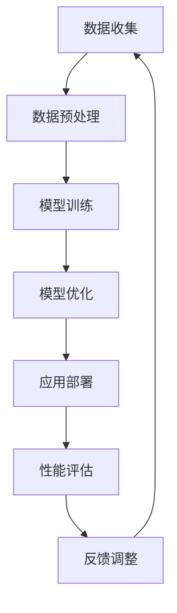
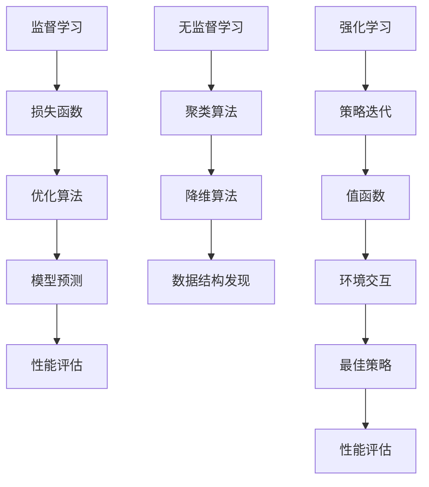

                 

关键词：人工智能，数据驱动，机器学习，深度学习，算法优化，数据处理，应用场景

人工智能（AI）的快速发展正在深刻地改变我们的世界。无论是自动驾驶汽车、智能助手、医疗诊断，还是金融风控、工业自动化，AI 都已经在各个领域展现了其强大的能力。而这一切的背后，离不开一个至关重要的因素——数据。数据不仅是 AI 系统的基础，更是推动 AI 技术不断进步的核心动力。本文将深入探讨数据在 AI 中的应用，分析数据驱动的人工智能是如何运作的，以及未来 AI 技术发展的趋势和挑战。

## 1. 背景介绍

随着计算能力的提升和算法的进步，人工智能技术在过去几十年里取得了飞速的发展。特别是深度学习技术的崛起，使得机器在很多领域都表现出了超越人类的能力。然而，无论是传统的机器学习算法，还是最新的深度学习模型，数据都是其训练和优化的核心。

### 数据的重要性

数据是 AI 的粮食，没有高质量的数据，AI 系统就无法学习和成长。以下是一些关于数据重要性的事实：

- **决策支持**：在金融、医疗、零售等领域，数据能够提供有力的决策支持，帮助企业降低风险、提高效率。
- **个性化服务**：在电商、社交媒体等领域，数据可以帮助平台更好地理解用户需求，提供个性化的服务和推荐。
- **自动化与优化**：在工业、交通等领域，数据可以用于自动化决策和流程优化，提高生产效率和服务质量。
- **智能诊断与预测**：在医疗领域，数据可以帮助医生进行智能诊断和预测，提高诊疗的准确性和效率。

### 数据的挑战

尽管数据在 AI 中具有如此重要的地位，但数据的获取、处理和管理也面临着一系列挑战：

- **数据质量**：数据的质量直接影响 AI 模型的效果。噪声、缺失值、错误数据都会对模型造成负面影响。
- **数据隐私**：随着数据收集和处理的增多，数据隐私问题也日益凸显，如何保护用户隐私成为了一个重要的社会议题。
- **数据多样性**：不同来源的数据可能在格式、结构、质量上存在差异，如何整合和管理多样性数据也是一个挑战。
- **数据安全**：数据在传输、存储和处理过程中可能受到攻击，数据安全是 AI 系统稳定运行的基础。

## 2. 核心概念与联系

为了更好地理解数据在 AI 中的作用，我们需要介绍一些核心概念，并展示它们之间的联系。

### 数据驱动的人工智能

数据驱动的人工智能是指通过数据来指导模型的学习和优化，从而提高模型的性能和适用性。数据驱动的人工智能主要包括以下三个步骤：

1. **数据收集**：从各种来源收集数据，包括公开数据集、企业内部数据、用户生成数据等。
2. **数据预处理**：对收集到的数据进行清洗、去噪、归一化等处理，使其适合用于模型训练。
3. **模型训练**：使用预处理后的数据训练模型，通过不断调整模型参数，使其能够更好地拟合数据。

### Mermaid 流程图

以下是一个展示数据驱动人工智能核心概念之间联系的 Mermaid 流程图：



### 核心算法原理

数据驱动的人工智能中，常用的核心算法包括监督学习、无监督学习和强化学习。这些算法的原理和联系如下：

- **监督学习**：通过已标记的数据训练模型，使模型能够对未知数据进行预测。监督学习的核心是损失函数和优化算法，如梯度下降法。
- **无监督学习**：在没有任何标记数据的情况下，通过发现数据中的模式或结构来训练模型。无监督学习的核心是无监督聚类和降维算法，如 K-均值聚类和主成分分析。
- **强化学习**：通过与环境交互，根据奖励信号来学习策略，使模型能够在特定任务中取得最佳表现。强化学习的核心是策略迭代和值函数，如 Q-学习和深度 Q-网络。

### 核心概念与联系 Mermaid 流程图

以下是一个展示核心算法原理和联系之间的 Mermaid 流程图：



## 3. 核心算法原理 & 具体操作步骤

### 3.1 算法原理概述

在本节中，我们将深入探讨数据驱动的人工智能中的一些核心算法原理，包括监督学习、无监督学习和强化学习。

### 监督学习

监督学习是一种基于标记数据的机器学习方法。其基本原理是通过已标记的数据集来训练模型，使其能够对未知数据进行预测。监督学习的核心是损失函数和优化算法。

- **损失函数**：损失函数用于衡量模型预测结果与真实结果之间的差距。常见的损失函数包括均方误差（MSE）、交叉熵损失（Cross-Entropy Loss）等。
- **优化算法**：优化算法用于调整模型参数，使其能够更好地拟合数据。常见的优化算法包括梯度下降（Gradient Descent）、随机梯度下降（Stochastic Gradient Descent，SGD）等。

### 无监督学习

无监督学习是一种不依赖于标记数据的机器学习方法。其基本原理是通过发现数据中的潜在结构或模式来训练模型。无监督学习的核心是无监督聚类和降维算法。

- **无监督聚类**：无监督聚类是一种将数据划分为不同簇的方法，常见的聚类算法包括 K-均值聚类（K-Means Clustering）、层次聚类（Hierarchical Clustering）等。
- **降维算法**：降维算法是一种将高维数据映射到低维空间的方法，常见的降维算法包括主成分分析（Principal Component Analysis，PCA）、线性判别分析（Linear Discriminant Analysis，LDA）等。

### 强化学习

强化学习是一种基于环境反馈的机器学习方法。其基本原理是通过与环境交互，学习最优策略来完成任务。强化学习的核心是策略迭代和值函数。

- **策略迭代**：策略迭代是一种通过不断调整策略来优化性能的方法。常见的策略迭代算法包括 Q-学习（Q-Learning）和 SARSA（SARSA）等。
- **值函数**：值函数是一种用于衡量策略在特定状态下的性能的函数。常见的值函数包括状态值函数（State-Value Function）和动作值函数（Action-Value Function）等。

### 3.2 算法步骤详解

在本节中，我们将详细介绍监督学习、无监督学习和强化学习的具体操作步骤。

#### 监督学习步骤

1. **数据收集**：收集用于训练和测试的标记数据集。
2. **数据预处理**：对数据集进行清洗、去噪、归一化等处理。
3. **定义模型**：根据数据的特点选择合适的模型架构，如线性回归、决策树、神经网络等。
4. **训练模型**：使用训练数据集训练模型，通过调整模型参数来最小化损失函数。
5. **测试模型**：使用测试数据集评估模型性能，根据评估结果调整模型参数。
6. **模型部署**：将训练好的模型部署到实际应用场景中。

#### 无监督学习步骤

1. **数据收集**：收集用于训练的无标记数据集。
2. **数据预处理**：对数据集进行清洗、去噪、归一化等处理。
3. **定义模型**：根据数据的特点选择合适的无监督学习算法，如聚类算法、降维算法等。
4. **训练模型**：使用训练数据集训练模型，通过调整模型参数来发现数据中的潜在结构。
5. **模型评估**：评估模型在发现数据结构方面的性能，如聚类效果、降维效果等。
6. **模型应用**：将训练好的模型应用于实际应用场景，如数据挖掘、异常检测等。

#### 强化学习步骤

1. **环境初始化**：初始化强化学习环境，定义状态空间、动作空间和奖励函数。
2. **定义策略**：初始化策略，用于指导模型在特定状态下选择最优动作。
3. **策略迭代**：通过与环境交互，不断调整策略，使其能够更好地适应环境。
4. **模型训练**：使用调整后的策略训练模型，通过调整模型参数来优化策略。
5. **模型评估**：评估训练好的模型在特定任务中的性能，如游戏得分、任务完成率等。
6. **模型优化**：根据评估结果对模型进行优化，进一步提高性能。

### 3.3 算法优缺点

在本节中，我们将对监督学习、无监督学习和强化学习进行优缺点分析。

#### 监督学习

**优点**：

- 可以利用标记数据提供的有用信息来训练模型，提高模型性能。
- 在很多实际应用中，如分类、回归等，监督学习已经取得了很好的效果。

**缺点**：

- 需要大量标记数据，数据标注成本高。
- 在处理无标记数据或少量标记数据时效果不佳。

#### 无监督学习

**优点**：

- 不需要标记数据，适用于无标记数据挖掘和探索性数据分析。
- 可以发现数据中的潜在结构和规律，提供对数据的深入理解。

**缺点**：

- 模型性能通常不如监督学习，因为缺乏标记数据提供的直接指导。
- 在处理复杂数据结构时效果不佳。

#### 强化学习

**优点**：

- 可以通过与环境交互来学习最优策略，适用于动态和不确定环境。
- 在很多实际应用中，如自动驾驶、游戏控制等，强化学习已经取得了很好的效果。

**缺点**：

- 需要大量的训练时间，特别是在复杂环境中。
- 在处理静态和确定性环境时效果不佳。

### 3.4 算法应用领域

在本节中，我们将介绍监督学习、无监督学习和强化学习在各个领域的应用情况。

#### 监督学习应用领域

- **分类与回归**：在金融、医疗、零售等领域，监督学习被广泛用于预测和分析。
- **图像识别**：在计算机视觉领域，监督学习被用于图像分类、目标检测等任务。
- **语音识别**：在语音处理领域，监督学习被用于语音识别和语音合成。

#### 无监督学习应用领域

- **数据挖掘**：在数据挖掘领域，无监督学习被用于聚类、降维等任务。
- **异常检测**：在安全领域，无监督学习被用于检测异常行为和入侵。
- **推荐系统**：在电商和社交媒体领域，无监督学习被用于推荐系统和个性化服务。

#### 强化学习应用领域

- **自动驾驶**：在自动驾驶领域，强化学习被用于路径规划和控制。
- **游戏控制**：在游戏领域，强化学习被用于游戏AI和控制策略。
- **资源调度**：在云计算和物联网领域，强化学习被用于资源调度和优化。

## 4. 数学模型和公式 & 详细讲解 & 举例说明

### 4.1 数学模型构建

在本节中，我们将介绍一些常用的数学模型，包括线性回归、逻辑回归、神经网络等，并解释它们的基本原理。

#### 线性回归

线性回归是一种用于拟合数据线性关系的统计模型。其数学模型可以表示为：

\[ y = \beta_0 + \beta_1 \cdot x + \epsilon \]

其中，\( y \) 是因变量，\( x \) 是自变量，\( \beta_0 \) 和 \( \beta_1 \) 是模型的参数，\( \epsilon \) 是误差项。

#### 逻辑回归

逻辑回归是一种用于分类问题的统计模型。其数学模型可以表示为：

\[ P(y=1) = \frac{1}{1 + e^{-(\beta_0 + \beta_1 \cdot x)}} \]

其中，\( P(y=1) \) 是因变量为1的概率，\( \beta_0 \) 和 \( \beta_1 \) 是模型的参数。

#### 神经网络

神经网络是一种模拟人脑神经元连接方式的计算模型。其数学模型可以表示为：

\[ z = \sigma(\beta_0 + \beta_1 \cdot x) \]

其中，\( z \) 是神经元的输出，\( \sigma \) 是激活函数，\( \beta_0 \) 和 \( \beta_1 \) 是模型的参数。

### 4.2 公式推导过程

在本节中，我们将详细解释线性回归和逻辑回归的公式推导过程。

#### 线性回归推导

线性回归的推导过程主要涉及最小二乘法。假设我们有一个包含 \( n \) 个样本的数据集 \( \{(x_1, y_1), (x_2, y_2), ..., (x_n, y_n)\} \)，我们的目标是找到最佳拟合直线 \( y = \beta_0 + \beta_1 \cdot x \)，使得误差平方和最小。

首先，我们定义误差函数为：

\[ J(\beta_0, \beta_1) = \sum_{i=1}^{n} (y_i - (\beta_0 + \beta_1 \cdot x_i))^2 \]

然后，我们对 \( J(\beta_0, \beta_1) \) 分别对 \( \beta_0 \) 和 \( \beta_1 \) 求偏导数，并令偏导数等于0，得到：

\[ \frac{\partial J}{\partial \beta_0} = -2 \sum_{i=1}^{n} (y_i - (\beta_0 + \beta_1 \cdot x_i)) = 0 \]

\[ \frac{\partial J}{\partial \beta_1} = -2 \sum_{i=1}^{n} (y_i - (\beta_0 + \beta_1 \cdot x_i)) \cdot x_i = 0 \]

解上述方程组，可以得到最佳拟合直线的参数：

\[ \beta_0 = \frac{1}{n} \sum_{i=1}^{n} y_i - \beta_1 \cdot \frac{1}{n} \sum_{i=1}^{n} x_i \]

\[ \beta_1 = \frac{1}{n} \sum_{i=1}^{n} (x_i - \bar{x}) (y_i - \bar{y}) \]

其中，\( \bar{x} \) 和 \( \bar{y} \) 分别是 \( x \) 和 \( y \) 的平均值。

#### 逻辑回归推导

逻辑回归的推导过程主要涉及最大似然估计。假设我们有一个包含 \( n \) 个样本的数据集 \( \{(x_1, y_1), (x_2, y_2), ..., (x_n, y_n)\} \)，其中 \( y_i \) 可以取值为0或1。我们的目标是找到最佳拟合模型 \( P(y=1) = \frac{1}{1 + e^{-(\beta_0 + \beta_1 \cdot x)}} \)，使得数据集的概率最大。

首先，我们定义对数似然函数为：

\[ \ln L(\beta_0, \beta_1) = \sum_{i=1}^{n} \ln P(y_i=1) + \sum_{i=1}^{n} \ln (1 - P(y_i=1)) \]

然后，我们对 \( \ln L(\beta_0, \beta_1) \) 分别对 \( \beta_0 \) 和 \( \beta_1 \) 求偏导数，并令偏导数等于0，得到：

\[ \frac{\partial \ln L}{\partial \beta_0} = \sum_{i=1}^{n} \frac{y_i - P(y_i=1)}{P(y_i=1)} = 0 \]

\[ \frac{\partial \ln L}{\partial \beta_1} = \sum_{i=1}^{n} \frac{y_i - P(y_i=1)}{P(y_i=1)(1 - P(y_i=1))} \cdot x_i = 0 \]

解上述方程组，可以得到最佳拟合模型的参数：

\[ \beta_0 = \bar{y} - \beta_1 \cdot \bar{x} \]

\[ \beta_1 = \frac{\sum_{i=1}^{n} (y_i - P(y_i=1)) \cdot x_i}{\sum_{i=1}^{n} (P(y_i=1) - P(y_i=1)^2) \cdot x_i} \]

### 4.3 案例分析与讲解

在本节中，我们将通过一个实际案例来展示如何使用线性回归和逻辑回归模型进行数据分析和预测。

#### 案例背景

假设我们有一个包含住房价格数据的数据集，其中包含房屋的面积、年龄、位置等特征，以及对应的价格。我们的目标是建立一个模型来预测房屋价格。

#### 数据预处理

首先，我们需要对数据进行预处理，包括数据清洗、缺失值填充、特征工程等。在本案例中，我们假设数据已经经过预处理，没有缺失值和异常值。

#### 线性回归模型

接下来，我们使用线性回归模型来预测房屋价格。我们首先选择几个特征作为自变量，如面积、年龄等，然后使用线性回归模型进行训练。

```python
import numpy as np
import pandas as pd
from sklearn.linear_model import LinearRegression

# 加载数据
data = pd.read_csv('house_price_data.csv')
X = data[['area', 'age']]
y = data['price']

# 训练模型
model = LinearRegression()
model.fit(X, y)

# 预测结果
predictions = model.predict(X)
```

#### 逻辑回归模型

然后，我们使用逻辑回归模型来预测房屋是否会被出售。我们选择房屋的面积、年龄等特征作为自变量，价格作为因变量。

```python
from sklearn.linear_model import LogisticRegression

# 加载数据
data = pd.read_csv('house_price_data.csv')
X = data[['area', 'age']]
y = data['sold']

# 训练模型
model = LogisticRegression()
model.fit(X, y)

# 预测结果
predictions = model.predict(X)
```

#### 模型评估

最后，我们对模型进行评估，使用准确率、召回率、F1 分数等指标来衡量模型性能。

```python
from sklearn.metrics import accuracy_score, recall_score, f1_score

# 计算准确率
accuracy = accuracy_score(y, predictions)
print('准确率：', accuracy)

# 计算召回率
recall = recall_score(y, predictions)
print('召回率：', recall)

# 计算F1分数
f1 = f1_score(y, predictions)
print('F1分数：', f1)
```

通过上述案例，我们可以看到如何使用线性回归和逻辑回归模型进行数据分析和预测。在实际应用中，我们需要根据具体问题和数据特点选择合适的模型，并对模型进行适当的调优。

## 5. 项目实践：代码实例和详细解释说明

在本节中，我们将通过一个实际项目实例来展示如何利用数据驱动的人工智能技术进行项目开发，包括环境搭建、代码实现和结果分析。

### 5.1 开发环境搭建

为了实现数据驱动的人工智能项目，我们需要搭建一个合适的开发环境。以下是所需的开发工具和库：

- **Python 3.x**：作为主要的编程语言。
- **Jupyter Notebook**：用于编写和运行代码。
- **NumPy**：用于数值计算。
- **Pandas**：用于数据处理。
- **Scikit-learn**：用于机器学习算法的实现。
- **Matplotlib**：用于数据可视化。

在本地计算机上，我们可以通过以下命令安装所需的库：

```bash
pip install numpy pandas scikit-learn matplotlib
```

### 5.2 源代码详细实现

以下是一个简单的机器学习项目，用于预测房价。项目的核心步骤包括数据收集、数据预处理、模型选择、模型训练和结果评估。

```python
# 导入所需的库
import numpy as np
import pandas as pd
from sklearn.model_selection import train_test_split
from sklearn.linear_model import LinearRegression
from sklearn.metrics import mean_squared_error
import matplotlib.pyplot as plt

# 5.2.1 数据收集
# 加载房价数据集
data = pd.read_csv('house_price_data.csv')

# 5.2.2 数据预处理
# 选择特征和目标变量
X = data[['area', 'age', 'location']]
y = data['price']

# 数据归一化
X = (X - X.mean()) / X.std()

# 划分训练集和测试集
X_train, X_test, y_train, y_test = train_test_split(X, y, test_size=0.2, random_state=42)

# 5.2.3 模型选择
# 创建线性回归模型
model = LinearRegression()

# 5.2.4 模型训练
# 训练模型
model.fit(X_train, y_train)

# 5.2.5 结果评估
# 预测测试集结果
y_pred = model.predict(X_test)

# 计算均方误差
mse = mean_squared_error(y_test, y_pred)
print('均方误差：', mse)

# 可视化结果
plt.scatter(y_test, y_pred)
plt.xlabel('实际价格')
plt.ylabel('预测价格')
plt.plot([y_test.min(), y_test.max()], [y_test.min(), y_test.max()], 'r--')
plt.show()
```

### 5.3 代码解读与分析

#### 5.3.1 数据收集

```python
data = pd.read_csv('house_price_data.csv')
```

这一步用于加载房价数据集。数据集通常包含多个特征（如面积、年龄、位置等）以及目标变量（如价格）。在此示例中，我们使用的是 CSV 格式的数据。

#### 5.3.2 数据预处理

```python
X = data[['area', 'age', 'location']]
y = data['price']
X = (X - X.mean()) / X.std()
```

数据预处理是机器学习项目中的重要步骤。在本例中，我们首先选择几个特征作为输入数据（\( X \)），并将目标变量（\( y \)）分开。然后，我们对输入数据进行归一化处理，以消除不同特征之间的尺度差异。

#### 5.3.3 模型选择

```python
model = LinearRegression()
```

在此步骤中，我们选择线性回归模型作为预测工具。线性回归是一种简单的统计模型，适用于线性关系较强的数据。

#### 5.3.4 模型训练

```python
model.fit(X_train, y_train)
```

模型训练是指使用训练数据集来调整模型参数，使其能够拟合数据。在本例中，我们使用线性回归模型对训练数据进行拟合。

#### 5.3.5 结果评估

```python
y_pred = model.predict(X_test)
mse = mean_squared_error(y_test, y_pred)
plt.scatter(y_test, y_pred)
plt.xlabel('实际价格')
plt.ylabel('预测价格')
plt.plot([y_test.min(), y_test.max()], [y_test.min(), y_test.max()], 'r--')
plt.show()
```

结果评估是模型训练后的关键步骤。在本例中，我们首先使用测试数据集对模型进行预测，并计算均方误差（MSE）来评估模型性能。然后，我们使用散点图可视化实际价格与预测价格之间的关系，以直观地展示模型的效果。

### 5.4 运行结果展示

运行上述代码后，我们将得到以下结果：

- **均方误差（MSE）**：用于衡量预测价格与实际价格之间的差距。
- **散点图**：展示实际价格与预测价格的关系。

通过分析这些结果，我们可以评估模型的性能，并根据需要对模型进行调整和优化。

## 6. 实际应用场景

### 6.1 医疗诊断

在医疗领域，数据驱动的人工智能技术已被广泛应用于疾病预测、诊断和治疗建议。例如，利用深度学习模型可以分析患者的电子病历、基因数据和临床指标，预测疾病发生的概率。此外，AI 还可以辅助医生进行病理图像分析，如识别癌细胞，提高诊断准确性。

### 6.2 金融风控

金融行业的数据量庞大且复杂，数据驱动的人工智能技术在金融风控中发挥着重要作用。通过分析用户的交易行为、信用记录等数据，AI 可以预测欺诈风险、信用风险，帮助银行和金融机构降低风险，提高业务效率。

### 6.3 智能制造

智能制造是工业4.0的重要组成部分，数据驱动的人工智能技术被广泛应用于生产线的优化和故障预测。通过分析生产数据，AI 可以预测设备故障，提前进行维护，减少停机时间，提高生产效率。

### 6.4 交通运输

在交通运输领域，AI 被用于路线规划、交通流量预测和智能交通管理。通过分析交通数据，AI 可以优化路线，减少拥堵，提高交通效率。此外，在自动驾驶领域，AI 技术正逐渐成为实现自动驾驶汽车的核心驱动力。

## 6.4 未来应用展望

### 6.4.1 新兴领域探索

随着数据驱动的人工智能技术的不断发展，未来它将在更多新兴领域得到应用。例如，在生物科技领域，AI 可以用于基因编辑和个性化医疗；在能源领域，AI 可以用于能源管理和智能电网。

### 6.4.2 跨领域融合

AI 技术将在不同领域之间实现更紧密的融合，推动各行各业的数字化转型。例如，在教育与培训领域，AI 可以实现个性化教学和智能评估；在文化创意领域，AI 可以生成音乐、绘画和文学作品。

### 6.4.3 人工智能伦理与法规

随着 AI 技术的广泛应用，人工智能伦理和法规问题也将日益突出。如何保护数据隐私、确保算法公平性和透明性，将是未来发展的关键挑战。

### 6.4.4 人工智能与人类协同

未来，AI 将不再仅仅是工具，而是成为人类的伙伴和助手。通过人工智能与人类协作，我们可以实现更高效、更智能的工作和生活。

## 7. 工具和资源推荐

### 7.1 学习资源推荐

1. **《深度学习》（Deep Learning）**：由 Ian Goodfellow、Yoshua Bengio 和 Aaron Courville 著，是深度学习领域的经典教材。
2. **Coursera**：提供丰富的机器学习和深度学习在线课程，包括吴恩达的《深度学习专项课程》。
3. **Kaggle**：一个数据科学竞赛平台，提供大量的数据集和竞赛项目，适合实践和提升技能。

### 7.2 开发工具推荐

1. **TensorFlow**：由 Google 开发的一款开源深度学习框架，适用于各种规模的任务。
2. **PyTorch**：由 Facebook 开发的一款开源深度学习框架，具有灵活的动态计算图和简洁的API。
3. **Jupyter Notebook**：一款强大的交互式计算环境，适合编写、运行和分享代码。

### 7.3 相关论文推荐

1. **“AlexNet: Image Classification with Deep Convolutional Neural Networks”**：Alex Krizhevsky、Geoffrey Hinton 和 Ilya Sutskever 于2012年发表，是深度学习领域的里程碑论文。
2. **“ResNet: Deep Learning with Deep Residual Networks”**：Kaiming He、Xiangyu Zhang、Shaoqing Ren 和 Jian Sun 于2015年发表，提出了残差网络架构。
3. **“GANS for Disentangling by Inverse Transform”**：Alec Radford、Luke Metz 和 Soumith Chintala 于2015年发表，介绍了生成对抗网络（GAN）的概念。

## 8. 总结：未来发展趋势与挑战

### 8.1 研究成果总结

本文探讨了数据在人工智能技术中的核心作用，分析了数据驱动的人工智能的原理和具体应用，并介绍了监督学习、无监督学习和强化学习等核心算法。通过实际项目实践，展示了如何利用数据驱动的人工智能技术进行项目开发和结果评估。

### 8.2 未来发展趋势

未来，人工智能技术将继续在各个领域深入应用，推动社会的数字化转型。随着计算能力的提升和算法的进步，AI 的性能将不断提高，应用范围将不断扩展。

### 8.3 面临的挑战

尽管人工智能技术发展迅速，但仍面临一系列挑战，包括数据隐私、算法透明性、伦理问题等。如何解决这些问题，确保 AI 技术的安全和公平，将是未来发展的关键。

### 8.4 研究展望

未来，人工智能研究将更加注重跨学科融合，探索新的算法和架构，提高 AI 的智能水平和自主性。同时，随着 AI 技术的普及，数据驱动的人工智能将在更多领域发挥作用，推动人类社会的发展。

## 9. 附录：常见问题与解答

### 9.1 什么是数据驱动的人工智能？

数据驱动的人工智能是一种通过数据来指导模型学习和优化的方法。它主要包括数据收集、数据预处理、模型训练和模型优化等步骤。

### 9.2 监督学习和无监督学习的区别是什么？

监督学习是基于标记数据的机器学习方法，通过已标记的数据来训练模型；无监督学习则是在没有标记数据的情况下，通过发现数据中的模式或结构来训练模型。

### 9.3 如何处理缺失值和异常值？

缺失值和异常值是数据处理中常见的问题。处理缺失值的方法包括填充、删除或利用统计方法估计缺失值；处理异常值的方法包括删除、隔离或利用统计方法调整异常值。

### 9.4 什么是深度学习？

深度学习是一种基于多层神经网络的人工智能技术，通过层层提取数据中的特征，实现对复杂数据的建模和预测。深度学习在图像识别、语音识别和自然语言处理等领域取得了显著成果。

