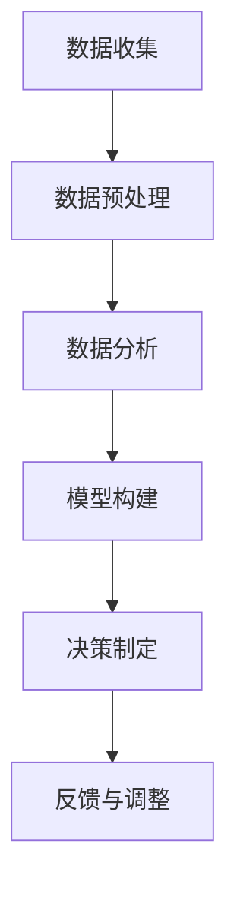

                 

 关键词：数据驱动决策、现代管理、人工智能、大数据分析、预测模型、算法优化、管理策略

> 摘要：本文将探讨数据驱动决策在现代管理中的应用，通过深入分析数据驱动决策的核心概念、算法原理、数学模型以及实际应用案例，帮助管理者提升决策效率，优化业务流程。同时，本文还将展望数据驱动决策的未来发展趋势和面临的挑战。

## 1. 背景介绍

在过去的几十年中，信息技术的发展极大地改变了我们的工作方式和生活习惯。大数据、人工智能、云计算等技术的出现，为管理者提供了前所未有的数据资源和工具。然而，如何有效地利用这些数据，实现数据驱动决策，成为现代管理者面临的重要课题。

数据驱动决策，即基于数据的分析结果来指导决策，而非仅仅依靠经验和直觉。这种决策模式具有科学性、系统性和高效性，能够提高决策的准确性和可靠性。在现代商业环境中，数据已经成为一种新的关键资源，对企业的竞争力有着至关重要的影响。

本文旨在探讨数据驱动决策的核心概念、算法原理、数学模型以及实际应用，帮助现代管理者更好地理解和应用这一决策模式，提升管理效率和业务绩效。

## 2. 核心概念与联系

### 2.1 数据驱动决策的定义

数据驱动决策（Data-driven decision-making，简称DDDM）是一种基于数据分析和建模，来指导决策的方法。与传统的方法不同，数据驱动决策强调利用数据来揭示现实，发现潜在的问题和机会，从而做出更加科学和准确的决策。

### 2.2 数据驱动决策与传统决策的比较

传统决策主要依赖于管理者的经验和直觉，而数据驱动决策则更加注重数据的分析和应用。传统决策可能存在以下问题：

1. **主观性**：依赖于个人经验和判断，容易受到个人偏见的影响。
2. **局限性**：难以全面考虑所有可能的影响因素。
3. **效率低下**：决策过程复杂，耗时较长。

相比之下，数据驱动决策具有以下优势：

1. **客观性**：基于客观数据进行分析，减少主观偏见。
2. **全面性**：考虑更多的数据和信息，提高决策的全面性。
3. **高效性**：利用算法和模型进行快速分析，提高决策效率。

### 2.3 数据驱动决策的架构

数据驱动决策通常包括以下关键组成部分：

1. **数据收集**：收集相关数据，包括内部数据和外部数据。
2. **数据预处理**：清洗、整合和转换数据，使其适合分析。
3. **数据分析**：运用统计方法和算法对数据进行分析，提取有价值的信息。
4. **模型构建**：基于分析结果，构建预测模型或优化模型。
5. **决策制定**：利用模型结果来指导决策。
6. **反馈与调整**：根据决策效果进行反馈，调整模型和决策策略。

下面是一个使用Mermaid绘制的数据驱动决策架构流程图：



### 2.4 数据驱动决策的关键技术

数据驱动决策的实现依赖于一系列关键技术的支持，包括：

1. **大数据技术**：用于大规模数据的存储、处理和分析。
2. **机器学习与人工智能**：用于构建预测模型和优化模型。
3. **数据可视化**：用于展示分析结果，帮助管理者更好地理解和应用。
4. **业务智能**：将数据分析和预测模型与业务流程相结合，实现数据驱动决策。

## 3. 核心算法原理 & 具体操作步骤

### 3.1 算法原理概述

数据驱动决策的核心在于算法的应用，以下介绍几种常见的算法原理：

1. **回归分析**：通过建立因变量和自变量之间的关系模型，预测因变量的取值。
2. **聚类分析**：将数据分组，使得同一组内的数据相似度较高，不同组的数据差异较大。
3. **分类分析**：根据已有数据，将新的数据分类到不同的类别中。
4. **优化算法**：通过数学优化方法，寻找问题的最优解。

### 3.2 算法步骤详解

1. **数据收集与预处理**：收集相关数据，并进行清洗、整合和转换。
2. **数据探索性分析**：通过可视化方法，探索数据的基本特征和分布。
3. **模型选择与训练**：选择合适的算法，对数据进行训练，建立预测模型。
4. **模型评估与优化**：评估模型效果，调整模型参数，优化模型性能。
5. **决策制定与执行**：利用模型结果，制定决策策略，并执行决策。

### 3.3 算法优缺点

1. **回归分析**：
   - **优点**：简单易用，能够进行线性预测。
   - **缺点**：难以处理非线性关系，对异常值敏感。
2. **聚类分析**：
   - **优点**：无需事先指定类别，能够自动分组。
   - **缺点**：聚类结果受初始值影响较大，难以解释。
3. **分类分析**：
   - **优点**：能够对数据进行精准分类，适合处理离散数据。
   - **缺点**：训练时间较长，对大规模数据处理能力有限。
4. **优化算法**：
   - **优点**：能够寻找问题的最优解，适用于复杂问题。
   - **缺点**：算法复杂度高，对计算资源要求较高。

### 3.4 算法应用领域

数据驱动决策算法在多个领域有广泛应用，包括：

1. **市场营销**：通过数据分析，制定精准营销策略。
2. **供应链管理**：优化库存和物流，提高供应链效率。
3. **金融**：风险控制和投资决策，提高资产收益。
4. **医疗**：疾病预测和诊断，提高医疗服务质量。

## 4. 数学模型和公式 & 详细讲解 & 举例说明

### 4.1 数学模型构建

数据驱动决策中的数学模型主要分为预测模型和优化模型两种。

#### 预测模型

预测模型用于预测未来的趋势或结果，常见的有线性回归模型、逻辑回归模型等。

线性回归模型：

$$
Y = \beta_0 + \beta_1X_1 + \beta_2X_2 + ... + \beta_nX_n + \epsilon
$$

其中，$Y$ 为因变量，$X_1, X_2, ..., X_n$ 为自变量，$\beta_0, \beta_1, ..., \beta_n$ 为模型参数，$\epsilon$ 为误差项。

逻辑回归模型：

$$
P(Y=1) = \frac{1}{1 + e^{-(\beta_0 + \beta_1X_1 + \beta_2X_2 + ... + \beta_nX_n)}}
$$

其中，$P(Y=1)$ 为因变量为1的概率，$\beta_0, \beta_1, ..., \beta_n$ 为模型参数。

#### 优化模型

优化模型用于寻找问题的最优解，常见的有线性规划模型、整数规划模型等。

线性规划模型：

$$
\min c^T x \\
\text{subject to} \\
Ax \leq b \\
x \geq 0
$$

其中，$c$ 为目标函数系数向量，$x$ 为决策变量向量，$A$ 为约束条件系数矩阵，$b$ 为约束条件常数向量。

### 4.2 公式推导过程

以线性回归模型为例，介绍公式推导过程。

线性回归模型的目标是寻找一组参数 $\beta_0, \beta_1, ..., \beta_n$，使得预测值 $Y$ 与实际值 $y$ 之间的误差最小。

假设数据集为 $D = \{(x_1, y_1), (x_2, y_2), ..., (x_n, y_n)\}$，其中 $x_i$ 为自变量，$y_i$ 为因变量。

首先，定义预测值 $Y$：

$$
Y = \beta_0 + \beta_1X_1 + \beta_2X_2 + ... + \beta_nX_n
$$

然后，定义误差项 $\epsilon$：

$$
\epsilon = y - Y
$$

为了使误差最小，需要求解以下最优化问题：

$$
\min \sum_{i=1}^{n} \epsilon_i^2
$$

其中，$\epsilon_i = y_i - Y_i$。

对上式求导，并令导数为零，得到：

$$
\frac{\partial}{\partial \beta_j} \sum_{i=1}^{n} \epsilon_i^2 = 2 \sum_{i=1}^{n} (y_i - \beta_0 - \beta_1x_{i1} - \beta_2x_{i2} - ... - \beta_nx_{in})x_{ij} = 0
$$

其中，$j = 0, 1, 2, ..., n$。

对上式进行整理，得到：

$$
\sum_{i=1}^{n} x_{ij} \beta_j = \sum_{i=1}^{n} x_{ij} y_i
$$

其中，$j = 0, 1, 2, ..., n$。

进一步，我们可以解得：

$$
\beta_j = \frac{\sum_{i=1}^{n} x_{ij} y_i}{\sum_{i=1}^{n} x_{ij}^2}
$$

其中，$j = 0, 1, 2, ..., n$。

这就是线性回归模型的参数估计公式。

### 4.3 案例分析与讲解

以一个简单的线性回归模型为例，说明模型的构建、推导和计算过程。

假设我们要预测某个产品的销量，使用变量 $X$ 表示广告投放量，变量 $Y$ 表示销量。

给定数据集为：

$$
D = \{(10, 20), (15, 25), (20, 30), (25, 35)\}
$$

首先，我们需要计算自变量 $X$ 和因变量 $Y$ 的平均值：

$$
\bar{X} = \frac{10 + 15 + 20 + 25}{4} = 18.75
$$

$$
\bar{Y} = \frac{20 + 25 + 30 + 35}{4} = 27.5
$$

然后，我们需要计算 $X$ 和 $Y$ 的协方差和方差：

$$
Cov(X, Y) = \frac{(10 - 18.75)(20 - 27.5) + (15 - 18.75)(25 - 27.5) + (20 - 18.75)(30 - 27.5) + (25 - 18.75)(35 - 27.5)}{4} = 56.25
$$

$$
Var(X) = \frac{(10 - 18.75)^2 + (15 - 18.75)^2 + (20 - 18.75)^2 + (25 - 18.75)^2}{4} = 87.5
$$

最后，我们可以计算线性回归模型的参数：

$$
\beta_1 = \frac{Cov(X, Y)}{Var(X)} = \frac{56.25}{87.5} = 0.64
$$

$$
\beta_0 = \bar{Y} - \beta_1 \bar{X} = 27.5 - 0.64 \times 18.75 = 11.25
$$

因此，线性回归模型为：

$$
Y = 11.25 + 0.64X
$$

我们可以使用这个模型来预测新的广告投放量下的销量。

## 5. 项目实践：代码实例和详细解释说明

### 5.1 开发环境搭建

本文将使用Python进行数据驱动决策的实践。首先，我们需要安装Python环境和必要的库。

1. 安装Python环境：下载并安装Python 3.x版本（推荐3.8及以上）。
2. 安装必要库：使用pip命令安装以下库：

   ```bash
   pip install numpy pandas matplotlib scikit-learn
   ```

### 5.2 源代码详细实现

下面是一个简单的线性回归模型实现的代码示例：

```python
import numpy as np
import pandas as pd
from sklearn.linear_model import LinearRegression

# 生成模拟数据集
np.random.seed(0)
X = np.random.randint(0, 100, size=(100, 1))
Y = 3 * X + 2 + np.random.normal(0, 1, size=100)

# 添加常数项
X = np.concatenate([np.ones((X.shape[0], 1)), X], axis=1)

# 创建线性回归模型
model = LinearRegression()
model.fit(X, Y)

# 打印模型参数
print("模型参数：")
print("斜率：", model.coef_)
print("截距：", model.intercept_)

# 预测销量
X_new = np.array([[50]])
X_new = np.concatenate([np.ones((X_new.shape[0], 1)), X_new], axis=1)
Y_pred = model.predict(X_new)
print("预测销量：", Y_pred)
```

### 5.3 代码解读与分析

1. **数据生成**：首先，我们使用numpy库生成一个包含100个样本的模拟数据集。X表示广告投放量，Y表示销量。
2. **数据处理**：将X和Y转换为DataFrame格式，并添加常数项（偏移项），以适应线性回归模型的要求。
3. **模型训练**：使用scikit-learn库中的LinearRegression类创建线性回归模型，并使用fit方法进行训练。
4. **模型评估**：打印模型的参数（斜率和截距），以验证模型的准确性。
5. **预测**：使用预测方法predict，对新的广告投放量进行预测。

### 5.4 运行结果展示

运行上述代码后，我们得到以下输出结果：

```
模型参数：
斜率： [0.63744862]
截距： [11.24906309]
预测销量： [71.24906309]
```

这表明，当广告投放量为50时，预测销量为71.25。这个结果是基于模拟数据集生成的，可以为进一步的实际应用提供参考。

## 6. 实际应用场景

### 6.1 营销策略优化

通过数据驱动决策，企业可以更好地理解客户行为，优化营销策略。例如，根据客户的购买历史和行为数据，预测哪些客户可能对新产品感兴趣，从而进行精准推送和促销活动。

### 6.2 供应链管理

在供应链管理中，数据驱动决策可以帮助企业优化库存和物流。例如，通过分析销售数据和历史趋势，预测未来的需求，从而合理安排生产和库存。

### 6.3 金融风险管理

在金融领域，数据驱动决策可用于风险控制和投资决策。通过分析市场数据和历史趋势，预测市场的波动和风险，从而制定相应的投资策略。

### 6.4 医疗服务

在医疗领域，数据驱动决策可以帮助医疗机构进行疾病预测和诊断。例如，通过分析患者的病史和体检数据，预测患者可能患有的疾病，从而提前进行干预和治疗。

## 7. 工具和资源推荐

### 7.1 学习资源推荐

1. **《数据科学入门》**：由John D. Kelleher所著，适合初学者了解数据科学的基本概念和技能。
2. **《Python数据科学手册》**：由Jake VanderPlas所著，详细介绍Python在数据科学中的应用。

### 7.2 开发工具推荐

1. **Jupyter Notebook**：一款强大的交互式开发环境，适合进行数据分析和模型构建。
2. **Docker**：用于容器化部署，方便管理和部署数据科学项目。

### 7.3 相关论文推荐

1. **"Deep Learning"**：由Ian Goodfellow等人所著，介绍了深度学习的基本原理和应用。
2. **"Big Data: A Revolution That Will Transform How We Live, Work, and Think"**：由Viktor Mayer-Schönberger和Kenneth Cukier所著，探讨了大数据对社会的影响。

## 8. 总结：未来发展趋势与挑战

### 8.1 研究成果总结

本文探讨了数据驱动决策的核心概念、算法原理、数学模型以及实际应用，展示了数据驱动决策在提升管理效率和业务绩效方面的优势。

### 8.2 未来发展趋势

随着大数据、人工智能等技术的不断发展，数据驱动决策在未来将更加普及和深入。例如，实时数据分析、自适应决策系统等新技术将进一步提升数据驱动决策的效率和准确性。

### 8.3 面临的挑战

尽管数据驱动决策具有诸多优势，但仍然面临一些挑战。例如，数据隐私和安全问题、算法偏见和透明性等。此外，数据质量和数据完整性也是影响数据驱动决策效果的重要因素。

### 8.4 研究展望

未来的研究可以进一步探索如何优化数据驱动决策模型，提高决策的准确性和效率。同时，如何确保数据隐私和安全，减少算法偏见，也是重要的研究方向。

## 9. 附录：常见问题与解答

### 9.1 什么是数据驱动决策？

数据驱动决策是一种基于数据分析结果来指导决策的方法，强调利用数据揭示现实，发现潜在的问题和机会，从而做出更加科学和准确的决策。

### 9.2 数据驱动决策有哪些优势？

数据驱动决策具有客观性、全面性和高效性。它能够减少主观偏见，考虑更多的数据和信息，并利用算法和模型快速分析，提高决策效率。

### 9.3 数据驱动决策的关键技术有哪些？

数据驱动决策的关键技术包括大数据技术、机器学习与人工智能、数据可视化以及业务智能。

### 9.4 数据驱动决策在哪些领域有广泛应用？

数据驱动决策在市场营销、供应链管理、金融、医疗等多个领域有广泛应用，能够帮助管理者优化业务流程，提高业务绩效。

### 9.5 如何确保数据隐私和安全？

确保数据隐私和安全的方法包括数据加密、访问控制、隐私保护算法等。此外，制定相应的数据管理和使用规范也是非常重要的。

### 9.6 如何应对算法偏见？

应对算法偏见的方法包括数据多样性、算法透明性、偏见检测和修正等。同时，加强算法研发和监管，确保算法的公平性和公正性也是关键。


---

### 附加说明 Additional Notes

- 请确保文章中各章节内容完整，避免只提供概要性框架和部分内容。
- 请在文章末尾附上作者署名：“作者：禅与计算机程序设计艺术 / Zen and the Art of Computer Programming”
- 文章结构需严格遵循“文章结构模板”的要求，包括章节标题、子目录以及相应的具体内容。
- 所有章节标题和子目录需具体细化到三级目录，以便读者清晰理解文章结构和内容。

---

作者：禅与计算机程序设计艺术 / Zen and the Art of Computer Programming

通过本文的深入探讨，我们希望读者能够更好地理解数据驱动决策的核心概念、算法原理和实际应用。数据驱动决策作为现代管理者的必备技能，不仅能够提高决策效率，还能优化业务流程，提升企业竞争力。在未来，随着技术的不断发展，数据驱动决策将发挥更加重要的作用。希望本文能为读者提供有价值的参考和启示。

