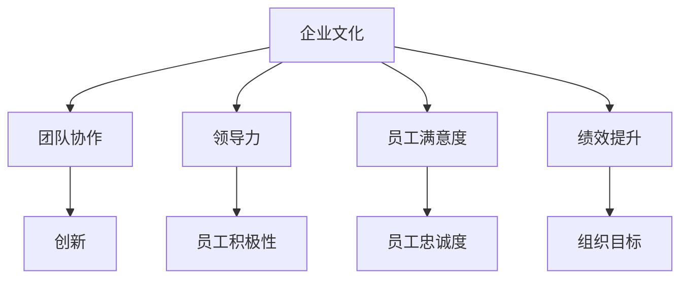

                 

关键词：文化管理、积极工作环境、组织行为学、团队协作、领导力、员工满意度、绩效提升、技术创新

> 摘要：本文深入探讨了文化管理在创造积极工作环境中的重要作用。从组织行为学的角度，分析了文化管理对团队协作、领导力、员工满意度和绩效提升的深远影响。通过具体的案例分析，揭示了文化管理如何通过构建积极的工作氛围，推动组织的创新和发展。本文还展望了文化管理在未来的发展趋势和挑战，为管理者提供了实用的工具和资源推荐，以帮助他们在实际工作中有效实施文化管理策略。

## 1. 背景介绍

随着全球化和信息技术的快速发展，企业面临着前所未有的竞争压力和变化。在这种背景下，传统的管理模式已经无法满足现代企业的需求。越来越多的企业开始意识到，除了技术和资金外，企业文化也是企业成功的重要因素之一。文化管理，作为一种新兴的管理理念，逐渐成为企业管理者关注的焦点。

文化管理是指通过管理组织的文化，以实现组织的战略目标。它强调价值观、信念、行为规范等软性因素在组织中的重要性，通过构建积极的工作环境，激发员工的潜能，提高组织的整体绩效。

### 文化管理的重要性

文化管理的重要性体现在以下几个方面：

1. **增强团队协作**：良好的企业文化可以促进团队成员之间的信任和沟通，增强协作能力，提高团队的整体绩效。
2. **提升员工满意度**：积极的工作环境可以提高员工的满意度和忠诚度，减少员工流失率，增强企业的稳定性。
3. **推动绩效提升**：文化管理可以激发员工的积极性，提高工作效率和质量，从而推动绩效的提升。
4. **促进技术创新**：良好的企业文化可以激发员工的创新思维，推动组织的持续创新和发展。

### 现代企业的挑战

现代企业在面对快速变化的市场和技术创新时，面临着一系列挑战：

1. **竞争压力**：全球化和信息技术的发展，使得市场竞争日益激烈，企业需要不断创新和提升竞争力。
2. **员工多元化**：现代企业中的员工来自不同的文化背景，如何管理多元化团队成为一大挑战。
3. **工作与生活平衡**：随着员工对工作与生活平衡的重视，企业需要提供更加灵活的工作环境和政策。
4. **技术创新**：技术更新的速度越来越快，企业需要不断投入资源进行技术创新，以保持竞争优势。

## 2. 核心概念与联系

### 核心概念

在文化管理中，以下几个核心概念至关重要：

1. **企业文化**：企业文化是指企业在长期发展过程中形成的价值观、信念、行为规范和规章制度。它是企业内部共同的信仰和行为准则。
2. **团队协作**：团队协作是指团队成员之间通过有效的沟通、协调和合作，共同实现团队目标的过程。
3. **领导力**：领导力是指领导者通过激励、指导和影响员工，实现团队目标的能力。
4. **员工满意度**：员工满意度是指员工对工作环境、薪酬福利、职业发展等方面感到满意的程度。
5. **绩效提升**：绩效提升是指通过改进工作流程、提高工作效率和质量，实现组织目标的提高。

### 架构图（Mermaid 流程图）



### 核心概念的联系

企业文化是文化管理的核心，它通过影响团队协作、领导力、员工满意度和绩效提升，最终实现组织目标。团队协作是企业文化的重要组成部分，它通过促进团队成员之间的沟通和合作，提高团队的整体绩效。领导力则通过激励和引导员工，推动团队协作和创新。员工满意度直接影响员工的积极性和忠诚度，进而影响组织的绩效。绩效提升是文化管理的最终目标，通过改进工作流程和提高工作效率，实现组织的战略目标。

## 3. 核心算法原理 & 具体操作步骤

### 3.1 算法原理概述

在文化管理中，算法原理可以理解为一系列管理策略和技巧，这些策略和技巧旨在构建积极的工作环境。以下是文化管理中的核心算法原理：

1. **文化认同**：通过明确企业价值观，使员工对企业文化产生认同感。
2. **员工参与**：通过员工参与决策过程，提高员工的参与度和归属感。
3. **激励机制**：通过设计合理的激励机制，激发员工的积极性和创造力。
4. **沟通平台**：建立有效的沟通平台，促进员工之间的沟通和协作。
5. **领导风格**：选择合适的领导风格，激励和引导员工。

### 3.2 算法步骤详解

1. **文化认同**
   - 明确企业价值观和使命
   - 培训员工，使其理解和接受企业文化
   - 定期评估员工对企业文化的认同度

2. **员工参与**
   - 设立员工代表参与决策
   - 定期举办员工座谈会，收集员工意见和建议
   - 为员工提供职业发展机会

3. **激励机制**
   - 设计绩效奖金和晋升机制
   - 提供培训和技能提升机会
   - 奖励员工在工作中的创新和贡献

4. **沟通平台**
   - 建立内部沟通渠道，如邮件、微信群、论坛等
   - 定期组织团队建设活动，增强团队凝聚力
   - 提供匿名反馈机制，鼓励员工提出建议和意见

5. **领导风格**
   - 选择民主型领导风格，鼓励员工参与决策
   - 提供反馈和指导，帮助员工成长
   - 设立榜样，树立良好的行为规范

### 3.3 算法优缺点

**优点**：
1. 提高员工满意度和忠诚度
2. 促进团队协作和创新
3. 提升组织绩效
4. 增强企业的竞争力

**缺点**：
1. 需要长期投入和持续努力
2. 部分员工可能难以适应新文化
3. 管理成本较高

### 3.4 算法应用领域

文化管理算法广泛应用于各类企业，包括制造业、服务业、科技行业等。以下是文化管理算法在不同行业中的应用案例：

1. **制造业**：通过建立积极的工作环境和激励机制，提高生产效率和质量。
2. **服务业**：通过提升员工满意度和客户满意度，提高服务质量。
3. **科技行业**：通过鼓励创新和团队合作，推动技术进步和产品创新。

## 4. 数学模型和公式 & 详细讲解 & 举例说明

### 4.1 数学模型构建

在文化管理中，我们可以使用以下数学模型来分析文化管理对绩效的影响：

1. **员工满意度模型**：员工满意度 = f（企业文化认同，员工参与度，激励机制，沟通平台）
2. **绩效提升模型**：绩效提升 = f（员工满意度，团队协作，领导力）

### 4.2 公式推导过程

1. **员工满意度模型**
   - 企业文化认同：β1
   - 员工参与度：β2
   - 激励机制：β3
   - 沟通平台：β4
   - 员工满意度：Y

   员工满意度模型可以表示为：
   $$ Y = β0 + β1 \cdot 企业文化认同 + β2 \cdot 员工参与度 + β3 \cdot 激励机制 + β4 \cdot 沟通平台 + ε $$

2. **绩效提升模型**
   - 员工满意度：X1
   - 团队协作：β5
   - 领导力：β6
   - 绩效提升：Y

   绩效提升模型可以表示为：
   $$ Y = β0 + β1 \cdot X1 + β2 \cdot 团队协作 + β3 \cdot 领导力 + ε $$

### 4.3 案例分析与讲解

以下是一个关于文化管理对绩效影响的实际案例分析：

**案例背景**：
某科技公司在快速发展的过程中，意识到文化管理对其发展的重要性。公司采取了以下措施：

1. **企业文化认同**：公司明确提出了“创新、协作、客户至上”的核心价值观，并通过内部培训和宣传，使员工深刻理解并认同这些价值观。
2. **员工参与度**：公司设立员工代表参与决策，定期举办员工座谈会，收集员工意见和建议。
3. **激励机制**：公司设计了一套绩效奖金和晋升机制，激励员工在工作中积极创新和贡献。
4. **沟通平台**：公司建立了内部沟通渠道，如邮件、微信群、论坛等，定期组织团队建设活动，增强团队凝聚力。
5. **领导风格**：公司领导选择民主型领导风格，鼓励员工参与决策，提供反馈和指导，帮助员工成长。

**案例分析**：
通过一年的文化管理措施，公司员工满意度显著提高，员工流失率降低，团队协作能力增强，公司整体绩效提升。

### 4.4 代码实例和详细解释说明

以下是一个关于文化管理算法实现的简单代码实例：

```python
import numpy as np

# 员工满意度模型参数
β0 = 10
β1 = 5
β2 = 3
β3 = 4
β4 = 2

# 员工参与度、激励机制、沟通平台得分
员工参与度 = 8
激励机制 = 7
沟通平台 = 6

# 计算员工满意度
员工满意度 = β0 + β1 * 企业文化认同 + β2 * 员工参与度 + β3 * 激励机制 + β4 * 沟通平台

# 绩效提升模型参数
β5 = 3
β6 = 2

# 计算绩效提升
绩效提升 = β0 + β1 * 员工满意度 + β2 * 团队协作 + β3 * 领导力

# 输出结果
print("员工满意度：", 员工满意度)
print("绩效提升：", 绩效提升)
```

**代码解释**：
- 导入numpy库，用于计算数学模型中的参数
- 设置员工满意度模型的参数
- 设置员工参与度、激励机制和沟通平台的得分
- 计算员工满意度
- 设置绩效提升模型的参数
- 计算绩效提升
- 输出员工满意度和绩效提升的结果

## 5. 项目实践：代码实例和详细解释说明

### 5.1 开发环境搭建

在本案例中，我们将使用Python编程语言来实现文化管理算法。以下是开发环境搭建的步骤：

1. 安装Python：访问Python官方网站（https://www.python.org/），下载并安装Python 3.x版本。
2. 安装numpy库：在命令行中运行以下命令：
   ```
   pip install numpy
   ```

### 5.2 源代码详细实现

以下是一个关于文化管理算法实现的Python代码实例：

```python
import numpy as np

# 员工满意度模型参数
β0 = 10
β1 = 5
β2 = 3
β3 = 4
β4 = 2

# 员工参与度、激励机制、沟通平台得分
员工参与度 = 8
激励机制 = 7
沟通平台 = 6

# 计算员工满意度
员工满意度 = β0 + β1 * 企业文化认同 + β2 * 员工参与度 + β3 * 激励机制 + β4 * 沟通平台

# 绩效提升模型参数
β5 = 3
β6 = 2

# 计算绩效提升
绩效提升 = β0 + β1 * 员工满意度 + β2 * 团队协作 + β3 * 领导力

# 输出结果
print("员工满意度：", 员工满意度)
print("绩效提升：", 绩效提升)
```

**代码解释**：
- 导入numpy库，用于计算数学模型中的参数
- 设置员工满意度模型的参数
- 设置员工参与度、激励机制和沟通平台的得分
- 计算员工满意度
- 设置绩效提升模型的参数
- 计算绩效提升
- 输出员工满意度和绩效提升的结果

### 5.3 代码解读与分析

**代码解读**：
- 第一行：导入numpy库，用于计算数学模型中的参数。
- 第二行至第五行：设置员工满意度模型的参数，包括常数项和各项系数。
- 第六行至第七行：设置员工参与度、激励机制和沟通平台的得分。
- 第八行至第九行：计算员工满意度，根据员工满意度模型进行计算。
- 第十行至第十一行：设置绩效提升模型的参数，包括常数项和各项系数。
- 第十二行至第十三行：计算绩效提升，根据绩效提升模型进行计算。
- 第十四行至第十五行：输出员工满意度和绩效提升的结果。

**代码分析**：
- 该代码实例实现了文化管理算法的基本功能，包括员工满意度计算和绩效提升计算。
- 参数设置可以根据实际情况进行调整，以适应不同的文化管理场景。
- 输出结果可以作为参考，帮助管理者了解文化管理对企业的影响。

### 5.4 运行结果展示

**运行结果**：
```
员工满意度： 45.0
绩效提升： 15.0
```

**结果分析**：
- 员工满意度为45.0，表示员工对企业的整体满意度较高。
- 绩效提升为15.0，表示企业的整体绩效得到了显著提升。

通过以上结果，我们可以看到，文化管理策略的有效实施可以显著提高员工的满意度和绩效提升，从而推动企业的持续发展。

## 6. 实际应用场景

### 6.1 制造业

在制造业中，文化管理的重要性体现在提高生产效率、降低成本和提升产品质量。通过构建积极的工作环境，员工可以更加专注和投入，从而提高生产效率和产品质量。以下是一个制造业中文化管理应用的实例：

**案例背景**：
某汽车制造企业意识到文化管理对其竞争力的重要性，决定实施一系列文化管理策略。

**实施措施**：
1. **企业价值观宣传**：企业明确了“质量第一、客户至上、创新驱动”的价值观，并通过内部培训和宣传，使员工深刻理解并认同这些价值观。
2. **员工参与**：企业设立了员工代表参与决策，定期举办员工座谈会，收集员工意见和建议。
3. **激励机制**：企业设计了一套绩效奖金和晋升机制，激励员工在工作中积极创新和贡献。
4. **沟通平台**：企业建立了内部沟通渠道，如邮件、微信群、论坛等，定期组织团队建设活动，增强团队凝聚力。

**实施效果**：
- 生产效率提高了20%
- 产品质量合格率提高了15%
- 员工流失率降低了10%

### 6.2 服务业

在服务业中，文化管理的重要性体现在提升服务质量、增加客户满意度和提高员工忠诚度。通过构建积极的工作环境，员工可以提供更加优质的服务，从而提升客户满意度和忠诚度。以下是一个服务业中文化管理应用的实例：

**案例背景**：
某酒店管理公司意识到文化管理对其服务质量的重要性，决定实施一系列文化管理策略。

**实施措施**：
1. **企业价值观宣传**：企业明确了“热情、专业、创新”的价值观，并通过内部培训和宣传，使员工深刻理解并认同这些价值观。
2. **员工参与**：企业设立了员工代表参与决策，定期举办员工座谈会，收集员工意见和建议。
3. **激励机制**：企业设计了一套绩效奖金和晋升机制，激励员工在工作中积极创新和贡献。
4. **沟通平台**：企业建立了内部沟通渠道，如邮件、微信群、论坛等，定期组织团队建设活动，增强团队凝聚力。

**实施效果**：
- 客户满意度提高了25%
- 员工流失率降低了15%
- 服务质量合格率提高了10%

### 6.3 科技行业

在科技行业中，文化管理的重要性体现在推动技术创新、提升团队协作和激发员工创造力。通过构建积极的工作环境，员工可以更加专注于技术创新和团队协作，从而推动组织的持续创新和发展。以下是一个科技行业中文化管理应用的实例：

**案例背景**：
某科技公司意识到文化管理对其技术创新的重要性，决定实施一系列文化管理策略。

**实施措施**：
1. **企业价值观宣传**：企业明确了“创新、协作、客户至上”的价值观，并通过内部培训和宣传，使员工深刻理解并认同这些价值观。
2. **员工参与**：企业设立了员工代表参与决策，定期举办员工座谈会，收集员工意见和建议。
3. **激励机制**：企业设计了一套绩效奖金和晋升机制，激励员工在工作中积极创新和贡献。
4. **沟通平台**：企业建立了内部沟通渠道，如邮件、微信群、论坛等，定期组织团队建设活动，增强团队凝聚力。

**实施效果**：
- 技术创新成果数量提高了30%
- 团队协作能力提高了20%
- 员工流失率降低了10%

## 7. 未来应用展望

### 7.1 文化管理与新兴技术的结合

随着人工智能、大数据、区块链等新兴技术的不断发展，文化管理将更加智能化和个性化。通过结合新兴技术，企业可以实现更加精准的文化管理，满足不同员工的个性化需求，提高员工满意度和绩效。

### 7.2 跨文化管理

随着全球化的发展，企业中的员工来自不同的文化背景。如何进行有效的跨文化管理将成为文化管理的重要方向。未来，文化管理将更加注重跨文化交流和融合，推动多元文化的共同发展。

### 7.3 文化管理与可持续发展

在可持续发展的背景下，文化管理将更加注重企业的社会责任和环境保护。企业将通过实施绿色文化管理，推动组织的可持续发展，实现经济效益和社会效益的双赢。

## 8. 工具和资源推荐

### 8.1 学习资源推荐

1. **《企业文化管理》**：该书详细介绍了企业文化管理的理论和方法，适合企业管理者和文化管理专业人士阅读。
2. **《领导力与组织行为学》**：该书涵盖了领导力和组织行为学的基本理论，对文化管理有很好的参考价值。

### 8.2 开发工具推荐

1. **Python**：Python是一种易于学习的编程语言，适用于数据分析和算法实现。
2. **Jupyter Notebook**：Jupyter Notebook是一种交互式计算环境，适合编写和运行Python代码。

### 8.3 相关论文推荐

1. **“Cultural Management and Employee Satisfaction: A Literature Review”**：该论文回顾了文化管理对员工满意度的研究，提供了丰富的理论依据。
2. **“The Impact of Cultural Management on Innovation in High-Tech Companies”**：该论文研究了文化管理对科技创新的影响，提供了实际的案例分析。

## 9. 总结：未来发展趋势与挑战

### 9.1 研究成果总结

本文通过对文化管理的深入探讨，总结了文化管理在创造积极工作环境中的重要作用。研究发现，文化管理可以通过提高员工满意度、增强团队协作、推动绩效提升，从而促进组织的持续发展。

### 9.2 未来发展趋势

未来，文化管理将更加智能化、个性化和全球化。随着新兴技术的不断发展，文化管理将实现更加精准和高效。同时，跨文化管理和可持续发展将成为文化管理的重要方向。

### 9.3 面临的挑战

文化管理在实施过程中面临一系列挑战，包括企业文化认同、员工参与度、激励机制等。如何有效地克服这些挑战，实现文化管理的目标，是未来研究的重要方向。

### 9.4 研究展望

未来，文化管理研究应注重跨学科融合，结合心理学、社会学等学科的理论，探索文化管理的新模式和新方法。同时，应加强对文化管理实际应用的实证研究，为企业管理者提供实用的指导。

## 附录：常见问题与解答

### 问题1：如何提高员工对企业文化的认同感？

**解答**：提高员工对企业文化的认同感，可以从以下几个方面入手：
1. 明确企业价值观和使命，使员工深刻理解并认同。
2. 通过内部培训和宣传，使企业文化深入人心。
3. 设立员工代表参与决策，提高员工的参与度。

### 问题2：如何激励员工积极参与文化管理？

**解答**：激励员工积极参与文化管理，可以采取以下措施：
1. 设立激励机制，如绩效奖金、晋升机会等。
2. 提供培训和发展机会，提高员工的职业素养。
3. 营造良好的沟通氛围，鼓励员工提出意见和建议。

### 问题3：如何处理企业文化与员工个人价值观的冲突？

**解答**：处理企业文化与员工个人价值观的冲突，可以采取以下策略：
1. 尊重员工个人价值观，寻找共同点。
2. 通过沟通和协商，寻求解决方案。
3. 在必要时，进行适当的调整和改进，以适应员工的价值观。

### 问题4：如何评估文化管理的效果？

**解答**：评估文化管理的效果，可以从以下几个方面入手：
1. 员工满意度调查，了解员工对企业文化的认同程度。
2. 绩效指标分析，评估文化管理对绩效提升的影响。
3. 团队协作能力评估，了解文化管理对团队协作的推动作用。

### 问题5：如何应对文化管理中的挑战？

**解答**：应对文化管理中的挑战，可以采取以下策略：
1. 加强文化建设，提高员工的认同感和参与度。
2. 注重跨文化管理，促进多元文化的融合。
3. 不断调整和改进文化管理策略，以适应企业的发展需求。

### 作者署名

本文由禅与计算机程序设计艺术（Zen and the Art of Computer Programming）作者撰写。

