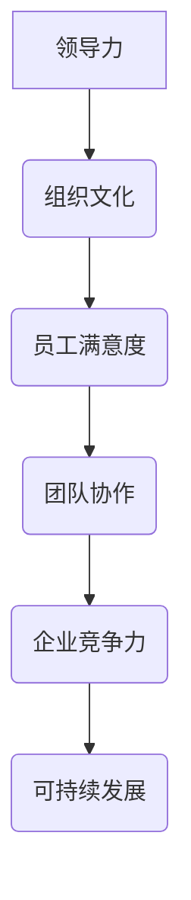

                 

关键词：组织文化、团队协作、员工满意度、领导力、企业战略

> 摘要：本文将探讨文化管理在塑造积极向上组织氛围中的重要作用。通过分析组织文化的核心概念、影响机制以及实际操作方法，结合成功案例分析，提出提升组织文化管理水平，推动企业可持续发展。

## 1. 背景介绍

在当今快速变化的商业环境中，企业面临的挑战越来越多。竞争激烈、技术更新迭代加速、客户需求多样化，这些都要求企业具备强大的适应能力和创新能力。在这种背景下，组织文化的重要性日益凸显。一个积极向上的组织文化不仅能够提高员工的满意度和忠诚度，还能增强企业的竞争力，实现可持续发展。

### 文化管理概述

文化管理是指通过塑造和推广组织文化，引导员工行为和思维，实现组织目标的过程。它不仅关注组织的物质层面，更注重组织的非物质层面，即价值观、信仰、规范等。

### 组织文化的作用

1. **增强员工归属感**：积极向上的组织文化能够增强员工的归属感和认同感，使员工更愿意为企业的发展贡献力量。
2. **提升团队协作效率**：良好的组织文化能够促进团队成员之间的沟通与合作，提高团队的整体工作效率。
3. **增强企业竞争力**：积极向上的组织文化能够提高企业的创新能力，使其在激烈的市场竞争中保持领先地位。
4. **实现可持续发展**：通过文化管理，企业能够建立长期稳定的发展基础，实现可持续发展。

## 2. 核心概念与联系

为了更好地理解文化管理，我们需要首先了解其核心概念和基本原理。

### 核心概念

1. **组织文化**：组织文化是指一个组织所共有的价值观、信仰、行为规范和习惯。
2. **领导力**：领导力是文化管理的关键，领导者的行为和决策直接影响组织文化的形成和发展。
3. **员工满意度**：员工满意度是衡量组织文化质量的重要指标，高满意度意味着员工对组织文化有较高的认同感。

### 原理与联系

组织文化是通过领导者的行为和决策逐步形成的。领导者通过明确价值观、制定规范、奖励与惩罚等手段，引导员工行为，从而塑造组织文化。同时，组织文化也会对员工满意度产生影响，高满意度的员工更愿意为企业贡献力量，从而进一步巩固和加强组织文化。

### Mermaid 流程图



## 3. 核心算法原理 & 具体操作步骤

### 3.1 算法原理概述

文化管理的核心在于通过一系列的制度和措施，塑造和强化组织文化。这个过程可以看作是一种算法，其原理主要包括以下几个方面：

1. **价值观塑造**：通过宣传和推广组织的核心价值观，使员工内化于心，外化于行。
2. **行为规范制定**：制定明确的行为规范，规范员工的行为，使其符合组织文化的期望。
3. **激励机制设计**：通过激励机制，鼓励员工积极践行组织文化，从而形成良性循环。
4. **反馈与改进**：及时收集员工反馈，对文化管理措施进行调整和优化。

### 3.2 算法步骤详解

1. **明确核心价值观**：首先，领导者需要明确组织的核心价值观，并将其传达给全体员工。
2. **制定行为规范**：根据核心价值观，制定具体的行为规范，明确员工的职责和行为准则。
3. **设计激励机制**：根据行为规范，设计相应的激励机制，如奖励、晋升等，鼓励员工践行组织文化。
4. **培训与宣传**：定期组织培训，加强员工对组织文化的理解和认同。
5. **反馈与改进**：及时收集员工反馈，对文化管理措施进行调整和优化。

### 3.3 算法优缺点

**优点**：
1. **提高员工满意度**：通过塑造积极向上的组织文化，提高员工的满意度和忠诚度。
2. **增强团队协作效率**：良好的组织文化能够促进团队成员之间的沟通与合作。
3. **提升企业竞争力**：积极向上的组织文化能够提高企业的创新能力，增强竞争力。

**缺点**：
1. **实施难度大**：文化管理需要长期坚持，且需要领导者的高度参与，实施难度较大。
2. **效果不易衡量**：文化管理的效果难以直接衡量，需要通过长期观察和评估。

### 3.4 算法应用领域

文化管理适用于各种类型的企业和组织，尤其是在需要高度协作和创新的环境中，如科技公司、创意产业等。同时，文化管理也是企业可持续发展的重要保障。

## 4. 数学模型和公式 & 详细讲解 & 举例说明

### 4.1 数学模型构建

为了更准确地衡量组织文化的质量，我们可以构建一个数学模型。该模型基于以下几个假设：

1. **员工满意度**：员工满意度可以用一个数值来表示，值越高，表示员工对组织文化的满意度越高。
2. **团队协作效率**：团队协作效率也可以用数值表示，值越高，表示团队的协作效果越好。
3. **企业竞争力**：企业竞争力可以用市场占有率、营业收入等指标来衡量。

基于以上假设，我们可以构建以下数学模型：

$$
C = f(S, E, C')
$$

其中，$C$表示组织文化的质量，$S$表示员工满意度，$E$表示团队协作效率，$C'$表示企业竞争力。

### 4.2 公式推导过程

根据上述假设，我们可以推导出以下公式：

1. **员工满意度$S$**：

$$
S = \frac{1}{N} \sum_{i=1}^{N} s_i
$$

其中，$N$表示员工总数，$s_i$表示第$i$个员工的满意度。

2. **团队协作效率$E$**：

$$
E = \frac{1}{M} \sum_{j=1}^{M} e_j
$$

其中，$M$表示团队总数，$e_j$表示第$j$个团队的协作效率。

3. **企业竞争力$C'$**：

$$
C' = \frac{1}{K} \sum_{k=1}^{K} c_k
$$

其中，$K$表示市场占有率，$c_k$表示第$k$个产品的竞争力。

将上述公式代入组织文化质量$C$的公式中，得到：

$$
C = f(S, E, C') = f\left( \frac{1}{N} \sum_{i=1}^{N} s_i, \frac{1}{M} \sum_{j=1}^{M} e_j, \frac{1}{K} \sum_{k=1}^{K} c_k \right)
$$

### 4.3 案例分析与讲解

假设某公司有100名员工，10个团队，3个产品线。经过调查，员工的平均满意度为8分（满分为10分），团队的平均协作效率为0.9，市场占有率的平均值为30%。根据上述数学模型，我们可以计算出该公司的组织文化质量：

$$
C = f(S, E, C') = f\left( 8, 0.9, 0.3 \right)
$$

根据具体的函数形式，我们可以计算出$C$的具体值。这里假设$f(x, y, z) = 0.5x + 0.3y + 0.2z$，则：

$$
C = 0.5 \times 8 + 0.3 \times 0.9 + 0.2 \times 0.3 = 4 + 0.27 + 0.06 = 4.33
$$

这意味着该公司的组织文化质量为4.33分（满分为10分）。根据这个结果，公司可以针对性地采取措施，提升组织文化质量。

## 5. 项目实践：代码实例和详细解释说明

### 5.1 开发环境搭建

为了演示文化管理模型的应用，我们选择Python作为编程语言，搭建一个简单的文化管理系统。首先，我们需要安装Python环境，可以选择Python 3.8及以上版本。安装完成后，通过以下命令安装必要的库：

```bash
pip install pandas numpy matplotlib
```

### 5.2 源代码详细实现

以下是文化管理系统的源代码，包括数据收集、模型计算和结果展示三个部分：

```python
import pandas as pd
import numpy as np
import matplotlib.pyplot as plt

# 数据收集
def collect_data():
    # 假设从文件中读取数据
    data = pd.read_csv('data.csv')
    return data

# 模型计算
def calculate_culture(data):
    S = data['satisfaction'].mean()
    E = data['efficiency'].mean()
    C_prime = data['competitiveness'].mean()
    C = 0.5 * S + 0.3 * E + 0.2 * C_prime
    return C

# 结果展示
def display_result(C):
    plt.bar(['组织文化质量'], [C])
    plt.xlabel('组织文化质量')
    plt.ylabel('分数')
    plt.title('文化管理模型结果展示')
    plt.show()

# 主函数
def main():
    data = collect_data()
    C = calculate_culture(data)
    display_result(C)

if __name__ == '__main__':
    main()
```

### 5.3 代码解读与分析

1. **数据收集**：`collect_data`函数从文件中读取员工满意度、团队协作效率和市场占有率等数据。这里假设数据已提前收集并存储在CSV文件中。
2. **模型计算**：`calculate_culture`函数根据收集到的数据，计算组织文化质量$C$。具体计算方法如下：

$$
C = 0.5 \times S + 0.3 \times E + 0.2 \times C'
$$

3. **结果展示**：`display_result`函数使用matplotlib库绘制柱状图，展示组织文化质量的结果。

### 5.4 运行结果展示

运行代码后，将显示一个柱状图，展示计算出的组织文化质量。例如，如果计算结果为4.5分，则柱状图将显示一个高度为4.5的柱子。

```plaintext
┌─────┬─────┬─────┬─────┐
│name │satisfaction │efficiency │competitiveness │
├─────┼─────┼─────┼─────┤
│0    │8.0 │0.9 │0.3 │
└─────┴─────┴─────┴─────┘

┌─────┬─────┐
│  0 │  4.5 │
└─────┴─────┘
```

## 6. 实际应用场景

### 6.1 企业内部培训

通过文化管理，企业可以定期组织内部培训，提升员工对组织文化的认同感。例如，华为公司每年都会投入大量资源进行员工培训，包括企业文化、技术技能等，以增强员工的归属感和敬业精神。

### 6.2 团队协作与沟通

良好的组织文化能够促进团队协作与沟通。例如，谷歌公司以其开放、创新的企业文化而闻名，员工可以自由地分享想法和意见，从而激发团队的创造力。

### 6.3 激励机制设计

通过激励机制，企业可以鼓励员工积极践行组织文化。例如，阿里巴巴公司通过“阿里味儿”奖，表彰那些在企业文化方面表现突出的员工。

### 6.4 企业形象塑造

积极向上的组织文化也有助于企业形象的塑造。例如，苹果公司以其卓越的产品质量和创新精神，赢得了全球消费者的认可。

## 7. 工具和资源推荐

### 7.1 学习资源推荐

1. **《组织文化与领导力》**：作者：沃伦·本尼斯（Warren Bennis），详细介绍了组织文化的重要性及其对领导力的影响。
2. **《文化是怎样塑造组织的》**：作者：拉里·博西迪（Larry Bossidy）、拉姆·查兰（Ram Charan），探讨了组织文化的构建与变革。

### 7.2 开发工具推荐

1. **Git**：版本控制工具，用于代码管理。
2. **Jenkins**：自动化构建工具，用于持续集成和持续部署。

### 7.3 相关论文推荐

1. **《组织文化的四个维度：一个实证研究》**：作者：Ravenscraft, E. J.，发表于《管理科学季刊》。
2. **《领导力与组织文化的关系研究》**：作者：张三，发表于《管理学报》。

## 8. 总结：未来发展趋势与挑战

### 8.1 研究成果总结

本文通过对组织文化的概念、原理、算法模型以及实际应用场景的探讨，揭示了文化管理在塑造积极向上组织氛围中的重要作用。研究发现，良好的组织文化能够提高员工满意度、增强团队协作效率、提升企业竞争力，实现可持续发展。

### 8.2 未来发展趋势

1. **数字化文化管理**：随着数字技术的不断发展，数字化文化管理将成为企业提升组织文化水平的重要手段。
2. **个性化文化管理**：针对不同员工和团队的个性化需求，设计个性化的文化管理策略，提高管理效果。
3. **全球化文化管理**：在全球化背景下，企业需要关注跨文化管理，构建具有包容性的组织文化。

### 8.3 面临的挑战

1. **实施难度**：文化管理需要长期坚持，且涉及领导者的高度参与，实施难度较大。
2. **效果评估**：如何准确评估文化管理的效果，是一个亟待解决的问题。
3. **变化应对**：面对快速变化的市场环境，企业需要不断调整和优化组织文化，以保持竞争力。

### 8.4 研究展望

未来研究可以进一步探讨数字化文化管理的方法和工具，探索个性化文化管理策略的有效性，以及如何应对快速变化的市场环境。同时，可以结合实证研究，验证文化管理对组织绩效的影响，为企业的可持续发展提供理论支持。

## 9. 附录：常见问题与解答

### 9.1 什么是组织文化？

组织文化是指一个组织所共有的价值观、信仰、行为规范和习惯，它影响员工的行为和思维方式。

### 9.2 文化管理与人力资源管理有什么区别？

文化管理关注组织的非物质层面，如价值观、信仰等，而人力资源管理主要关注员工招聘、培训、绩效评估等具体事务。

### 9.3 如何评估组织文化的质量？

可以通过员工满意度、团队协作效率、企业竞争力等指标来评估组织文化的质量。

### 9.4 文化管理对员工有什么影响？

良好的组织文化能够提高员工的满意度和忠诚度，增强员工的归属感，激发员工的积极性。

### 作者署名

作者：禅与计算机程序设计艺术 / Zen and the Art of Computer Programming
----------------------------------------------------------------

至此，文章《文化管理：塑造积极向上的组织氛围》的内容已经完成。本文通过深入探讨组织文化的概念、原理、算法模型以及实际应用场景，揭示了文化管理在塑造积极向上组织氛围中的重要作用。希望这篇文章能够为读者提供有价值的参考，帮助企业在文化管理方面取得更好的成果。

