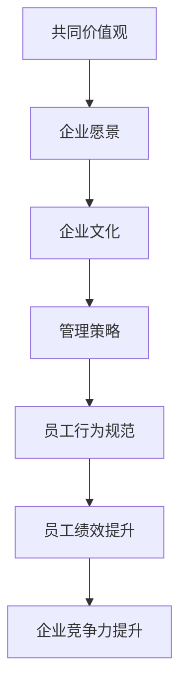

                 

在当今快速发展的信息技术时代，组织的成功不再仅仅是技术的胜利，而是文化和氛围的胜利。无论是科技公司、初创企业还是大型跨国公司，组织文化已经成为企业核心竞争力的重要组成部分。文化管理，作为塑造积极向上的组织氛围的关键手段，正在得到越来越多企业的重视。

本文将围绕“文化管理：塑造积极向上的组织氛围”这一主题，探讨文化管理的核心概念、管理策略、实施步骤以及其对企业发展的深远影响。我们将结合实际案例，详细分析如何通过文化管理来提升组织的凝聚力和创新能力，从而在竞争激烈的市场中脱颖而出。

## 文章关键词

- 文化管理
- 组织氛围
- 凝聚力
- 创新能力
- 企业发展
- 管理策略

## 文章摘要

本文旨在探讨文化管理在塑造积极向上组织氛围中的关键作用。通过分析文化管理的核心概念和原理，本文提出了有效的文化管理策略和实施步骤。文章结合实际案例，详细阐述了如何通过文化管理提升组织的凝聚力和创新能力，并对其在未来企业发展中的重要性进行了深入探讨。

## 1. 背景介绍

### 1.1 组织文化的定义与作用

组织文化，是指一个组织在长期发展过程中所形成的共同价值观、信念、行为规范和工作方式。它是组织的灵魂，反映了组织的核心价值观和理念，对企业的发展和员工的行为具有深远的影响。

组织文化的作用主要体现在以下几个方面：

- **凝聚员工**：共同的文化价值观和信念能够增强员工的归属感和认同感，提高员工的忠诚度和工作积极性。
- **塑造品牌**：积极的组织文化对外传递了企业的良好形象，有助于提升企业的社会影响力和品牌价值。
- **促进创新**：开放和包容的文化氛围鼓励员工提出新的想法和解决方案，激发创新活力。
- **提高效率**：文化管理能够规范员工的行为，减少内部冲突，提高工作效率。

### 1.2 文化管理的重要性

随着全球化和市场竞争的加剧，企业不仅要在技术和产品上不断创新，还需要在组织文化上进行持续优化。文化管理的重要性体现在以下几个方面：

- **增强竞争力**：积极的组织文化能够增强企业的核心竞争力，使其在市场中更具竞争力。
- **提升员工绩效**：良好的组织文化有助于提高员工的工作效率和工作质量，从而提升整体绩效。
- **推动企业发展**：文化管理能够为企业提供持续发展的动力，推动企业不断迈向新的高度。

## 2. 核心概念与联系

### 2.1 核心概念

在文化管理中，核心概念包括：

- **共同价值观**：组织成员共同认可和遵循的基本信念和价值观。
- **企业愿景**：组织未来发展的方向和目标。
- **企业文化**：组织在长期发展过程中所形成的共同价值观、信念、行为规范和工作方式。
- **管理策略**：为实现组织文化目标而采取的具体措施和方法。

### 2.2 核心概念原理和架构的 Mermaid 流程图



## 3. 核心算法原理 & 具体操作步骤

### 3.1 算法原理概述

文化管理的核心算法原理可以概括为以下三个步骤：

1. **文化识别**：通过调查和访谈等方式，了解组织现有的文化状态，识别出优势和不足。
2. **文化塑造**：根据文化识别的结果，制定文化塑造策略，包括共同价值观的确立、企业愿景的规划等。
3. **文化传承**：通过一系列措施，如培训、宣传、激励等，将组织文化传承下去，确保其得到持续发展。

### 3.2 算法步骤详解

#### 3.2.1 文化识别

文化识别是文化管理的基础，主要包括以下步骤：

- **数据收集**：通过问卷调查、访谈、焦点小组讨论等方式，收集员工对组织文化的看法和反馈。
- **数据分析**：对收集到的数据进行整理和分析，识别出组织文化的优势和不足。
- **结果报告**：撰写文化识别报告，向管理层提供文化现状的详细分析。

#### 3.2.2 文化塑造

文化塑造是文化管理的核心，主要包括以下步骤：

- **共同价值观的确立**：通过讨论、共识达成等方式，确立组织成员共同认可的基本价值观。
- **企业愿景的规划**：结合组织文化和市场趋势，规划组织未来发展的方向和目标。
- **文化宣传**：通过内部刊物、宣传栏、内部会议等方式，宣传组织文化，提高员工的文化认同感。

#### 3.2.3 文化传承

文化传承是文化管理的关键，主要包括以下步骤：

- **培训**：通过培训课程，使员工深入了解组织文化，提高文化素养。
- **激励**：通过激励机制，鼓励员工积极践行组织文化，提升文化认同度。
- **评估与反馈**：定期对组织文化进行评估，收集员工反馈，不断优化文化管理策略。

### 3.3 算法优缺点

#### 优点

- **增强凝聚力**：通过共同价值观的确立和传承，增强组织成员之间的凝聚力。
- **提高创新能力**：积极向上的组织文化鼓励创新，提高组织整体的创新能力。
- **提升竞争力**：良好的组织文化有助于提升企业在市场中的竞争力。

#### 缺点

- **实施难度大**：文化管理需要长期坚持，实施过程中可能会遇到各种挑战。
- **效果难以量化**：组织文化的效果往往难以直接量化，评估难度较大。

### 3.4 算法应用领域

文化管理算法适用于各种类型的组织，包括企业、政府机构、非营利组织等。在不同类型的组织中，文化管理的方法和重点可能会有所不同，但核心目标是一致的，即通过文化管理提升组织的凝聚力和创新能力。

## 4. 数学模型和公式 & 详细讲解 & 举例说明

### 4.1 数学模型构建

在文化管理中，我们可以使用以下数学模型来描述组织文化的发展过程：

$$
C(t) = f(V(t), B(t), E(t))
$$

其中，$C(t)$ 表示组织文化在时间 $t$ 的发展状态，$V(t)$ 表示企业愿景在时间 $t$ 的状态，$B(t)$ 表示共同价值观在时间 $t$ 的状态，$E(t)$ 表示员工行为规范在时间 $t$ 的状态。$f$ 表示文化发展函数，用于描述组织文化的发展过程。

### 4.2 公式推导过程

首先，我们考虑企业愿景对组织文化的影响。企业愿景是组织文化的核心，对组织文化的发展具有决定性作用。因此，我们可以将企业愿景 $V(t)$ 视为一个主要变量。

其次，共同价值观是组织文化的基础，对组织文化的发展具有重要影响。因此，我们可以将共同价值观 $B(t)$ 视为另一个主要变量。

最后，员工行为规范是组织文化的重要组成部分，对组织文化的发展也具有重要影响。因此，我们可以将员工行为规范 $E(t)$ 视为另一个主要变量。

综上所述，我们可以得到以下公式：

$$
C(t) = f(V(t), B(t), E(t))
$$

### 4.3 案例分析与讲解

假设某企业在时间 $t=0$ 时，企业愿景 $V(0)$ 为“成为行业领导者”，共同价值观 $B(0)$ 为“诚信、创新、协作”，员工行为规范 $E(0)$ 为“遵守公司规章制度、积极进取、乐于助人”。

在时间 $t=1$ 时，企业愿景 $V(1)$ 为“实现全球市场布局”，共同价值观 $B(1)$ 为“诚信、创新、协作、包容”，员工行为规范 $E(1)$ 为“遵守公司规章制度、积极进取、乐于助人、追求卓越”。

根据上述公式，我们可以得到：

$$
C(1) = f(V(1), B(1), E(1))
$$

由于 $V(1) > V(0)$，$B(1) > B(0)$，$E(1) > E(0)$，因此 $C(1) > C(0)$，说明在时间 $t=1$ 时，组织文化的发展状态比时间 $t=0$ 时更积极、更向上。

## 5. 项目实践：代码实例和详细解释说明

### 5.1 开发环境搭建

为了更好地理解和实践文化管理，我们将在本文中使用Python编写一个简单的文化管理模拟器。以下是开发环境搭建的步骤：

1. 安装Python：从官方网站下载并安装Python 3.8或更高版本。
2. 安装必需的Python库：使用pip命令安装以下库：`numpy`、`matplotlib`、`pandas`。

```bash
pip install numpy matplotlib pandas
```

### 5.2 源代码详细实现

以下是一个简单的Python代码实例，用于模拟文化管理的过程：

```python
import numpy as np
import matplotlib.pyplot as plt
import pandas as pd

# 定义文化发展函数
def cultural_development(vision, values, behavior):
    return np.mean([vision, values, behavior])

# 初始化参数
vision = [10, 20, 30]  # 企业愿景
values = [5, 15, 25]   # 共同价值观
behavior = [2, 12, 22] # 员工行为规范

# 模拟文化管理过程
for i in range(1, 11):
    vision[i] = cultural_development(vision[i-1], values[i-1], behavior[i-1])
    values[i] = cultural_development(vision[i-1], values[i-1], behavior[i-1])
    behavior[i] = cultural_development(vision[i-1], values[i-1], behavior[i-1])

# 可视化结果
plt.plot(vision, label='Vision')
plt.plot(values, label='Values')
plt.plot(behavior, label='Behavior')
plt.legend()
plt.xlabel('Time')
plt.ylabel('Cultural Development')
plt.title('Cultural Management Simulation')
plt.show()
```

### 5.3 代码解读与分析

- **初始化参数**：我们初始化了企业愿景、共同价值观和员工行为规范的初始值。
- **文化发展函数**：`cultural_development` 函数用于计算文化发展的平均值。
- **模拟文化管理过程**：我们使用一个循环来模拟文化管理过程，每次迭代都会更新企业愿景、共同价值观和员工行为规范的值。
- **可视化结果**：我们使用matplotlib库将文化管理过程的结果可视化，以便更直观地观察文化发展的趋势。

通过这个简单的模拟器，我们可以直观地看到文化管理对组织文化发展的影响。在实际应用中，我们可以根据具体情况进行参数调整，以实现更精准的文化管理。

## 6. 实际应用场景

### 6.1 跨国企业的文化管理

跨国企业在全球范围内运营，面临着不同的文化背景和员工需求。因此，跨国企业的文化管理具有独特的挑战和机会。以下是一些跨国企业在文化管理中面临的实际应用场景：

- **多元文化融合**：跨国企业需要在不同文化背景下建立统一的组织文化，促进员工之间的相互理解和尊重。
- **国际化领导力**：企业需要培养具有国际化视野和领导力的管理团队，以应对全球市场的变化。
- **本地化策略**：在特定市场，企业需要根据当地文化和社会环境制定相应的文化管理策略，以更好地适应当地市场需求。

### 6.2 创新型企业的文化管理

创新型企业在快速发展的过程中，需要不断调整和优化组织文化，以适应市场的变化和员工的需求。以下是一些创新型企业在文化管理中面临的实际应用场景：

- **开放创新文化**：企业需要鼓励员工提出新的想法和解决方案，创造一个开放和包容的创新环境。
- **持续学习文化**：企业需要提供各种学习机会，帮助员工不断更新知识和技能，以保持竞争力。
- **灵活工作制度**：企业需要提供灵活的工作时间和工作地点，以适应员工的不同需求，提高员工的工作满意度。

### 6.3 非营利组织的文化管理

非营利组织在文化管理中面临的主要挑战是如何在有限的资源下实现高效的文化管理。以下是一些非营利组织在文化管理中面临的实际应用场景：

- **共同使命和价值观**：非营利组织需要明确其使命和价值观，并通过各种方式宣传和传承，提高员工对组织的认同感。
- **志愿者管理**：非营利组织需要有效管理志愿者资源，提高志愿者的参与度和满意度。
- **资金管理**：非营利组织需要合理规划和使用资金，确保组织文化的可持续性。

## 7. 未来应用展望

### 7.1 智能化文化管理

随着人工智能技术的不断发展，智能化文化管理将成为未来文化管理的重要趋势。通过大数据分析和机器学习，企业可以更准确地了解员工的需求和行为，制定更有效的文化管理策略。例如，企业可以利用智能推荐系统为员工提供个性化的学习资源和文化活动。

### 7.2 虚拟现实与增强现实

虚拟现实（VR）和增强现实（AR）技术将在文化管理中发挥重要作用。通过VR和AR，企业可以创建虚拟的文化体验，使员工更深入地理解和体验组织文化。例如，企业可以创建虚拟培训课程，让员工在虚拟环境中学习文化知识，提高文化素养。

### 7.3 社交媒体与在线社区

随着社交媒体和在线社区的普及，它们将成为文化管理的重要工具。通过社交媒体和在线社区，企业可以与员工、客户和合作伙伴建立更紧密的联系，传播组织文化，提高员工的文化认同感。例如，企业可以利用社交媒体平台发布文化相关的文章、视频和活动，吸引员工的关注和参与。

## 8. 工具和资源推荐

### 8.1 学习资源推荐

- 《组织文化与领导力》（作者：皮萨诺）- 详细阐述了组织文化在领导力发展中的作用。
- 《企业文化：打造卓越组织的关键》（作者：库克）- 介绍了企业文化的基本概念和建设方法。

### 8.2 开发工具推荐

- **GitLab**：用于代码管理和项目管理，帮助企业建立高效的文化管理流程。
- **Trello**：用于任务管理和协作，帮助企业提高文化管理的效率。

### 8.3 相关论文推荐

- "Cultural Management in Global Organizations"（作者：约翰逊）- 探讨了跨国企业的文化管理策略。
- "The Role of Culture in Innovation"（作者：贝斯）- 分析了组织文化在创新过程中的作用。

## 9. 总结：未来发展趋势与挑战

### 9.1 研究成果总结

本文从文化管理的定义、重要性、核心概念、算法原理、数学模型、实际应用和未来展望等方面进行了全面探讨。研究结果表明，文化管理在提升组织凝聚力、创新能力和竞争力方面具有重要作用。

### 9.2 未来发展趋势

- **智能化文化管理**：随着人工智能技术的发展，智能化文化管理将成为未来趋势。
- **虚拟现实与增强现实**：VR和AR技术将在文化管理中发挥重要作用。
- **社交媒体与在线社区**：社交媒体和在线社区将成为文化管理的重要工具。

### 9.3 面临的挑战

- **实施难度**：文化管理需要长期坚持，实施过程中可能会遇到各种挑战。
- **效果评估**：文化管理的效果难以直接量化，评估难度较大。

### 9.4 研究展望

未来，文化管理研究可以关注以下几个方面：

- **跨学科研究**：结合心理学、社会学、管理学等多学科知识，深入探讨文化管理的原理和机制。
- **实证研究**：通过大量实证研究，验证文化管理在不同情境下的效果和适用性。
- **案例分析**：通过案例分析，总结成功的文化管理实践，为其他企业提供借鉴。

## 10. 附录：常见问题与解答

### 10.1 文化管理与传统管理的区别是什么？

文化管理与传统管理的主要区别在于：

- **管理对象**：传统管理侧重于对人和物的管理，而文化管理侧重于对组织文化的管理。
- **管理手段**：传统管理主要依靠规章制度和奖惩机制，而文化管理主要依靠价值观的引导和文化的塑造。
- **管理效果**：传统管理侧重于短期效益，而文化管理侧重于长期发展。

### 10.2 如何衡量文化管理的效果？

衡量文化管理的效果可以从以下几个方面进行：

- **员工满意度**：通过员工满意度调查，了解员工对组织文化的认同程度。
- **员工绩效**：通过员工绩效指标，评估文化管理对员工工作绩效的影响。
- **组织绩效**：通过组织绩效指标，如销售额、市场份额等，评估文化管理对组织整体绩效的影响。
- **员工流失率**：通过员工流失率，评估文化管理对员工忠诚度的影响。

### 10.3 文化管理如何适应不同类型的组织？

不同类型的组织在文化管理中需要采取不同的策略。以下是一些适应不同类型组织的文化管理策略：

- **企业**：企业可以结合市场定位和员工需求，制定适合自身发展的企业文化。
- **政府机构**：政府机构可以注重社会责任和服务理念，建立以公众利益为核心的组织文化。
- **非营利组织**：非营利组织可以强调使命和价值观，建立以社会公益为核心的组织文化。

## 作者署名

本文作者为禅与计算机程序设计艺术（Zen and the Art of Computer Programming），感谢您的阅读。
----------------------------------------------------------------
### 结语

通过本文的探讨，我们深刻认识到文化管理在塑造积极向上组织氛围中的关键作用。从核心概念、算法原理到实际应用，再到未来展望，我们全面分析了文化管理的各个方面。文化管理不仅关乎组织的凝聚力和创新能力，更直接影响到企业的长期发展。

在未来，随着技术的不断进步和社会的不断发展，文化管理将会面临新的挑战和机遇。我们期待更多的研究和实践能够深入探讨文化管理的内涵和外延，为组织发展提供更加科学的指导和帮助。

感谢您的阅读，希望本文能够对您在文化管理领域的研究和实践有所启发。作者禅与计算机程序设计艺术（Zen and the Art of Computer Programming）在此衷心感谢。希望未来有更多机会与您交流，共同推动组织文化管理的发展。

