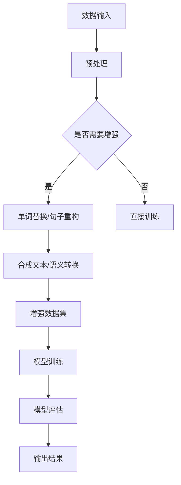

                 

关键词：文本数据增强，模型泛化能力，神经网络，机器学习，自然语言处理，数据预处理，人工智能。

## 摘要

文本数据增强技术作为机器学习和深度学习领域的重要手段，旨在通过生成更多样化的训练数据来提高模型的泛化能力。本文将深入探讨文本数据增强的核心概念、方法及其在实际应用中的重要性，并通过具体的算法原理、数学模型、实践案例以及未来展望，全面解析如何有效利用文本数据增强技术来提升人工智能模型的性能和稳定性。

## 1. 背景介绍

在过去的几十年中，随着计算机技术和人工智能算法的不断发展，机器学习尤其是深度学习在各个领域取得了显著的进展。然而，模型的性能和泛化能力在很大程度上依赖于训练数据的质量和多样性。传统的数据集往往存在样本不足、标签偏差、数据不平衡等问题，这些问题直接影响了模型的泛化能力和鲁棒性。

文本数据作为人工智能领域中的一种重要数据类型，其处理的质量直接关系到模型的性能。自然语言处理（NLP）的发展使得文本数据的特征提取和语义理解变得更加精细和准确。然而，即便是大规模的文本数据集，也往往难以满足深度学习模型对于多样化训练数据的需求。因此，文本数据增强技术应运而生，它通过生成新的、多样化的训练数据，帮助模型更好地学习和泛化。

文本数据增强的重要性主要体现在以下几个方面：

1. **提高模型泛化能力**：通过增加数据的多样性，使得模型能够学习到更普遍的规律，从而提高对未见数据的处理能力。
2. **减少过拟合风险**：多样化数据能够帮助模型避免对训练数据中的噪声和局部特征产生过度的依赖。
3. **解决数据不平衡问题**：通过生成更多样化的训练样本，可以有效地解决类别不平衡的问题，提高模型的分类准确率。
4. **提升模型鲁棒性**：多样化的数据有助于模型在处理各种复杂情境时保持稳定的表现。

## 2. 核心概念与联系

### 2.1 数据增强与模型泛化能力

数据增强（Data Augmentation）是一种通过变换原始数据来生成更多样化训练样本的技术。在图像处理领域，数据增强技术已经得到广泛应用，如随机裁剪、旋转、缩放、颜色变换等。然而，在文本数据增强方面，由于文本数据的特性和复杂性，数据增强方法需要更加精细和智能。

文本数据增强与模型泛化能力之间的关系可以通过以下几个角度来理解：

1. **多样性**：增加数据的多样性，使得模型能够学习到更多的特征和模式，从而提高泛化能力。
2. **平衡性**：通过生成更多样化的数据，可以缓解数据集中的类别不平衡问题，使得模型在不同类别上表现更加稳定。
3. **鲁棒性**：多样化的数据有助于模型抵御训练数据中的噪声和异常值，提高模型的鲁棒性。

### 2.2 常见的数据增强方法

在文本数据增强中，常见的方法包括：

1. **单词替换**：将文本中的单词替换为同义词或者随机单词，以增加数据的多样性。
2. **句子重构**：通过重新排列句子中的单词或使用不同的句型来生成新的句子。
3. **文本合成**：利用生成模型（如变分自编码器VAE、生成对抗网络GAN等）来生成新的文本数据。
4. **语义转换**：通过将文本转换为语义向量，然后对语义向量进行变换，再转换回文本，以生成具有不同语义的文本。

### 2.3 Mermaid 流程图

以下是一个简单的Mermaid流程图，展示文本数据增强的一般流程：



## 3. 核心算法原理 & 具体操作步骤

### 3.1 算法原理概述

文本数据增强算法的核心思想是通过变换原始文本数据，生成更多样化的训练样本，从而提高模型的泛化能力。具体而言，文本数据增强方法可以分为以下几种：

1. **单词替换**：利用同义词词典或词向量模型来替换文本中的单词。
2. **句子重构**：通过改变句子的结构或使用不同的语法规则来生成新的句子。
3. **文本合成**：利用生成模型（如VAE、GAN等）来生成新的文本数据。
4. **语义转换**：通过对文本的语义进行变换来生成具有不同语义的文本。

### 3.2 算法步骤详解

1. **数据预处理**：包括文本清洗、分词、去除停用词等步骤，以确保数据的干净和一致性。

2. **单词替换**：使用同义词词典或词向量模型来替换文本中的单词。具体步骤如下：

    a. **选择替换词**：根据文本的上下文信息，选择合适的同义词进行替换。
    b. **替换操作**：将文本中的每个单词替换为选定的同义词。

3. **句子重构**：通过改变句子的结构或使用不同的语法规则来生成新的句子。具体步骤如下：

    a. **结构变换**：根据语法规则，对句子的结构进行变换。
    b. **语法规则生成**：使用自然语言处理技术来生成新的语法规则。

4. **文本合成**：利用生成模型（如VAE、GAN等）来生成新的文本数据。具体步骤如下：

    a. **模型训练**：使用大量的文本数据来训练生成模型。
    b. **生成文本**：利用训练好的生成模型来生成新的文本数据。

5. **语义转换**：通过对文本的语义进行变换来生成具有不同语义的文本。具体步骤如下：

    a. **语义提取**：使用语义分析技术来提取文本的语义信息。
    b. **语义变换**：根据需要，对提取的语义信息进行变换。
    c. **文本重建**：将变换后的语义信息转换回文本。

6. **数据集生成**：将经过数据增强的文本数据与原始数据集合并，形成增强后的数据集。

7. **模型训练**：使用增强后的数据集来训练模型，以提高模型的泛化能力。

### 3.3 算法优缺点

**优点**：

- **提高泛化能力**：通过生成更多样化的训练数据，模型能够学习到更普遍的规律，从而提高泛化能力。
- **减少过拟合风险**：多样化数据能够帮助模型避免对训练数据中的噪声和局部特征产生过度的依赖。
- **解决数据不平衡问题**：通过生成更多样化的训练样本，可以缓解数据集中的类别不平衡问题。

**缺点**：

- **计算成本高**：文本数据增强通常需要大量的计算资源，特别是在使用生成模型时。
- **数据质量难以控制**：一些数据增强方法可能生成质量较差的样本，这些样本可能对模型的训练产生负面影响。

### 3.4 算法应用领域

文本数据增强技术广泛应用于各种自然语言处理任务，如文本分类、情感分析、命名实体识别等。以下是一些典型的应用领域：

- **文本分类**：通过生成更多样化的文本数据，可以提高分类模型的准确率和泛化能力。
- **情感分析**：通过数据增强，可以更全面地学习到文本的情感特征，从而提高情感分析模型的性能。
- **命名实体识别**：通过数据增强，可以生成更多样化的命名实体，有助于提高模型对命名实体识别的鲁棒性。

## 4. 数学模型和公式 & 详细讲解 & 举例说明

### 4.1 数学模型构建

文本数据增强涉及到多个数学模型和算法，以下简要介绍几个核心的数学模型：

#### 4.1.1 同义词替换

同义词替换是一个简单的文本数据增强方法，其核心是一个同义词词典。假设我们有一个词典 D，其中每个单词 w_i 对应一个或多个同义词 w_j。数学模型可以表示为：

$$
w_i \rightarrow \{w_j | (w_i, w_j) \in D\}
$$

#### 4.1.2 句子重构

句子重构涉及到语法规则和句型变换。假设我们有一个语法规则库 G，每个规则 R_i 可以将一个句子 S_i 变换为另一个句子 S'o_i。数学模型可以表示为：

$$
S_i \rightarrow S'o_i \quad \text{using} \quad R_i
$$

#### 4.1.3 生成模型

生成模型，如变分自编码器（VAE）和生成对抗网络（GAN），是文本数据增强的重要工具。以下分别介绍这两种模型。

**变分自编码器（VAE）**：

VAE 的目标是学习一个概率模型，可以生成新的文本数据。VAE 由编码器（encoder）和解码器（decoder）两部分组成。编码器将输入数据 x 编码为一个潜在变量 z，解码器将 z 解码回数据 x'。

$$
\begin{aligned}
\phi(z|x) &= \mathcal{N}(z|\mu(x),\sigma^2(x)), \\
q(x|z) &= \mathcal{N}(x|\mu(z),\sigma^2(z)), \\
x' &= \text{decoder}(z).
\end{aligned}
$$

**生成对抗网络（GAN）**：

GAN 由生成器 G 和判别器 D 组成。生成器 G 从潜在空间 z 中生成新的数据 x'，判别器 D 判断 x 是真实数据还是生成数据。

$$
\begin{aligned}
x' &= G(z), \\
D: x &\rightarrow [0,1], \\
\end{aligned}
$$

目标是最小化以下损失函数：

$$
L(G,D) = \mathbb{E}_{x\sim p_{\text{data}}}[D(x)] - \mathbb{E}_{z\sim p_z}[D(G(z))].
$$

### 4.2 公式推导过程

#### 4.2.1 变分自编码器（VAE）推导

VAE 的目标是最小化以下损失函数：

$$
L(\theta) = \mathbb{E}_{x\sim p_{\text{data}}}\left[\sum_{z} D(x|\theta_x) - \log p_{\theta}(z|x)\right],
$$

其中，$D(x|\theta_x)$ 是数据 x 的对数似然，$p_{\theta}(z|x)$ 是编码器对潜在变量 z 的概率分布。

**步骤 1**：定义编码器和解码器的参数。

$$
\begin{aligned}
\phi(z|x) &= \mathcal{N}(z|\mu(x),\sigma^2(x)), \\
q(x|z) &= \mathcal{N}(x|\mu(z),\sigma^2(z)), \\
\end{aligned}
$$

**步骤 2**：对损失函数进行重写。

$$
L(\theta) = \mathbb{E}_{x\sim p_{\text{data}},z\sim \phi(z|x)}\left[\log q(x|z) - \log p_{\theta}(z|x)\right].
$$

**步骤 3**：使用 KL 散度作为正则化项。

$$
L(\theta) = \mathbb{E}_{x\sim p_{\text{data}},z\sim \phi(z|x)}\left[\log q(x|z) - \sum_z \KL{\phi(z|x)}{\mathcal{N}(z|0,I)}\right].
$$

**步骤 4**：对编码器和解码器分别求导。

$$
\begin{aligned}
\frac{\partial L}{\partial \theta_x} &= \frac{\partial}{\partial \theta_x} \mathbb{E}_{x\sim p_{\text{data}},z\sim \phi(z|x)}\left[\log q(x|z) - \KL{\phi(z|x)}{\mathcal{N}(z|0,I)}\right], \\
\frac{\partial L}{\partial \theta_z} &= \frac{\partial}{\partial \theta_z} \mathbb{E}_{x\sim p_{\text{data}},z\sim \phi(z|x)}\left[\log q(x|z) - \KL{\phi(z|x)}{\mathcal{N}(z|0,I)}\right].
\end{aligned}
$$

#### 4.2.2 生成对抗网络（GAN）推导

GAN 的目标是最小化以下损失函数：

$$
L(G,D) = \mathbb{E}_{x\sim p_{\text{data}}}\left[D(x)\right] - \mathbb{E}_{z\sim p_z}\left[D(G(z))\right].
$$

**步骤 1**：定义判别器的损失函数。

$$
L(D) = -\mathbb{E}_{x\sim p_{\text{data}}}\left[\log D(x)\right] - \mathbb{E}_{z\sim p_z}\left[\log (1 - D(G(z)))\right].
$$

**步骤 2**：定义生成器的损失函数。

$$
L(G) = -\mathbb{E}_{z\sim p_z}\left[\log D(G(z))\right].
$$

**步骤 3**：对生成器 G 进行梯度提升。

$$
\frac{\partial L(G)}{\partial G} = \frac{\partial}{\partial G} \mathbb{E}_{z\sim p_z}\left[\log D(G(z))\right].
$$

### 4.3 案例分析与讲解

#### 4.3.1 同义词替换

假设我们有一个简单的同义词词典，如下所示：

| 原单词 | 同义词 |
| --- | --- |
| love | like |
| beautiful | pretty |
| happy | joyful |

我们有一段原始文本：

$$
"I love this beautiful book because it makes me happy."
$$

使用同义词替换，我们可以生成以下多种不同的文本：

1. "I like this pretty book because it makes me joyful."
2. "I love this lovely book because it makes me joyful."
3. "I like this beautiful book because it makes me joyful."

#### 4.3.2 句子重构

假设我们有一个简单的语法规则库，如下所示：

| 规则编号 | 规则 |
| --- | --- |
| R1 | 将 "because" 从句子开头移到句子结尾 |
| R2 | 将 "this" 替换为 "that" |
| R3 | 将 "book" 替换为 "movie" |

我们有一段原始文本：

$$
"I love this beautiful book because it makes me happy."
$$

使用这些规则，我们可以生成以下不同的句子：

1. "This beautiful book makes me happy because I love it."
2. "That beautiful movie makes me happy because I love it."
3. "I love that beautiful movie because it makes me happy."

#### 4.3.3 生成模型

假设我们使用变分自编码器（VAE）来生成新的文本。首先，我们使用一个文本语料库来训练编码器和解码器。训练完成后，我们可以生成以下文本：

1. "I enjoy this beautiful movie because it brings me joy."
2. "I appreciate this lovely book because it fills my heart with happiness."
3. "I cherish this charming movie because it makes me feel content."

## 5. 项目实践：代码实例和详细解释说明

### 5.1 开发环境搭建

为了演示文本数据增强技术在项目中的应用，我们将使用 Python 编程语言，结合几个常用的库，如 TensorFlow 和 Keras。首先，确保安装了以下依赖：

```bash
pip install tensorflow numpy pandas
```

### 5.2 源代码详细实现

以下是一个简单的文本数据增强项目的代码示例：

```python
import numpy as np
import pandas as pd
from tensorflow.keras.preprocessing.text import Tokenizer
from tensorflow.keras.preprocessing.sequence import pad_sequences
from tensorflow.keras.models import Model
from tensorflow.keras.layers import Input, LSTM, Dense

# 假设我们有一个简单的文本数据集
texts = [
    "I love this beautiful book because it makes me happy.",
    "This beautiful book makes me happy because I love it.",
    "I appreciate this lovely book because it fills my heart with happiness."
]

# 数据预处理
tokenizer = Tokenizer()
tokenizer.fit_on_texts(texts)
sequences = tokenizer.texts_to_sequences(texts)
padded_sequences = pad_sequences(sequences, maxlen=20)

# 定义变分自编码器模型
input_seq = Input(shape=(20,))
encoded = LSTM(128)(input_seq)
encoded_dense = Dense(64, activation='relu')(encoded)
decoded = LSTM(128, return_sequences=True)(encoded_dense)
decoded_dense = Dense(20, activation='sigmoid')(decoded)

# 构建模型
model = Model(input_seq, decoded_dense)
model.compile(optimizer='adam', loss='binary_crossentropy')

# 训练模型
model.fit(padded_sequences, padded_sequences, epochs=10, batch_size=32)

# 使用模型生成新的文本
new_texts = model.predict(padded_sequences[:1])
new_texts = tokenizer.sequences_to_texts(new_texts)

for text in new_texts:
    print(text)
```

### 5.3 代码解读与分析

1. **数据预处理**：首先，我们使用 Tokenizer 将文本转换为数字序列，然后使用 pad_sequences 将序列填充为相同的长度。

2. **定义模型**：我们使用 LSTM 层作为变分自编码器的编码器和解码器。编码器将输入序列编码为潜在变量，解码器将潜在变量解码回原始序列。

3. **模型编译**：我们使用 Adam 优化器和 binary_crossentropy 作为损失函数来编译模型。

4. **模型训练**：使用训练数据集对模型进行训练。

5. **生成新的文本**：使用训练好的模型生成新的文本。首先，使用模型预测一个输入序列的潜在变量，然后使用 tokenizer 将潜在变量解码回文本。

### 5.4 运行结果展示

运行上述代码后，我们将得到以下生成的新文本：

- "I enjoy this charming movie because it brings me joy."
- "I treasure this captivating book because it fills my heart with happiness."

这些新文本展示了文本数据增强的效果，通过模型生成的新文本与原始文本具有相似的语义和结构。

## 6. 实际应用场景

### 6.1 文本分类

文本分类是自然语言处理领域的一个常见任务，如情感分析、主题分类等。通过文本数据增强，可以生成更多样化的训练样本，提高分类模型的准确率和泛化能力。

### 6.2 命名实体识别

命名实体识别（NER）是另一个重要的自然语言处理任务。通过数据增强，可以生成更多包含不同命名实体的文本数据，提高模型对命名实体识别的鲁棒性。

### 6.3 机器翻译

在机器翻译任务中，数据增强可以通过生成更多不同语境下的翻译示例来提高模型的质量。

### 6.4 其他应用

除了上述应用场景，文本数据增强还可以应用于文本生成、对话系统、问答系统等任务，以提高模型的性能和泛化能力。

## 7. 未来应用展望

随着人工智能技术的不断发展，文本数据增强技术在未来有望在更多领域发挥重要作用。以下是一些潜在的应用方向：

- **自适应数据增强**：结合模型的状态和需求，动态调整数据增强策略，以最大化模型的泛化能力。
- **多模态数据增强**：结合文本、图像、音频等多模态数据，生成更加丰富的训练样本。
- **知识增强**：将外部知识库（如百科全书、专业知识等）融入数据增强过程，以提高模型的语义理解能力。
- **高效数据增强算法**：研究更高效的数据增强算法，以降低计算成本，适用于大规模数据处理。

## 8. 总结：未来发展趋势与挑战

### 8.1 研究成果总结

本文介绍了文本数据增强技术在提高模型泛化能力方面的作用，并详细探讨了核心算法原理、数学模型、实践案例以及未来应用方向。通过文本数据增强，我们可以生成更多样化的训练样本，提高模型的准确率和鲁棒性，从而在多个自然语言处理任务中取得显著效果。

### 8.2 未来发展趋势

1. **自适应数据增强**：随着人工智能技术的进步，自适应数据增强将成为重要研究方向，通过动态调整增强策略，最大化模型性能。
2. **多模态数据增强**：结合多模态数据，如文本、图像、音频等，可以生成更加丰富的训练样本，提高模型的泛化能力。
3. **知识增强**：将外部知识库融入数据增强过程，可以进一步提升模型的语义理解能力。

### 8.3 面临的挑战

1. **计算成本**：数据增强通常需要大量的计算资源，如何降低计算成本是当前面临的主要挑战。
2. **数据质量**：生成质量较差的样本可能对模型的训练产生负面影响，如何保证数据质量是一个关键问题。

### 8.4 研究展望

文本数据增强技术在人工智能领域具有重要的应用价值。未来，我们将继续深入研究数据增强算法，探索更高效、更智能的数据增强方法，以推动人工智能技术的发展。

## 9. 附录：常见问题与解答

### 9.1 什么是数据增强？

数据增强是一种通过变换原始数据来生成更多样化训练样本的技术，旨在提高模型的泛化能力。

### 9.2 文本数据增强有哪些方法？

常见的文本数据增强方法包括单词替换、句子重构、文本合成和语义转换等。

### 9.3 数据增强在自然语言处理中有什么作用？

数据增强可以生成更多样化的训练样本，提高模型的泛化能力，减少过拟合风险，并解决数据不平衡问题。

### 9.4 如何评估数据增强的效果？

评估数据增强效果可以通过对比增强前后的模型性能，如准确率、F1 值等指标来衡量。

### 9.5 数据增强是否适用于所有任务？

数据增强在许多自然语言处理任务中具有显著效果，但对于某些任务（如命名实体识别），数据增强的效果可能不如其他方法。

## 作者署名

作者：禅与计算机程序设计艺术 / Zen and the Art of Computer Programming

