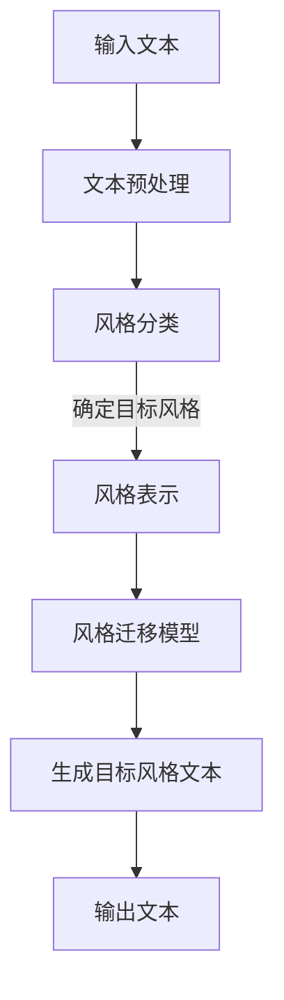

                 

关键词：文本风格迁移，自然语言处理，语言风格，机器学习，文本生成

本文将探讨如何使用机器学习技术进行文本风格迁移，即在保持原始文本内容的同时改变其语言风格。文本风格迁移在许多应用领域都具有重要意义，如自动写作、情感分析、翻译等。通过深入研究文本风格迁移的核心概念、算法原理、数学模型以及实际应用场景，我们将揭示这一领域的研究现状与未来发展趋势。

## 1. 背景介绍

文本风格迁移是指将一种风格的文本转换为另一种风格的过程。在不同的应用场景中，文本风格的影响不可忽视。例如，一篇正式的商务报告与一篇幽默的喜剧剧本，其风格截然不同，但核心内容可能相同。因此，如何在保持内容不变的情况下改变文本风格，成为自然语言处理领域的一个研究热点。

文本风格迁移的应用场景非常广泛。在自动写作领域，文本风格迁移可以用于生成不同风格的文本，如新闻、博客、小说等。在情感分析中，通过文本风格迁移可以提取出不同情感特征的文本，从而提高情感分析模型的准确性。在翻译领域，文本风格迁移可以帮助翻译系统生成更贴近目标语言风格的译文。

近年来，随着深度学习技术的发展，文本风格迁移的研究取得了显著进展。本文将详细介绍文本风格迁移的核心概念、算法原理、数学模型以及实际应用场景，并探讨其未来发展。

## 2. 核心概念与联系

### 2.1 文本风格

文本风格是指文本在表达内容时采用的语言形式和表达方式。常见的文本风格包括正式、幽默、夸张、讽刺等。每种风格都有其独特的语言特征和表达习惯。

### 2.2 风格迁移

风格迁移是指将一种风格的文本转换为另一种风格的过程。在风格迁移过程中，需要保持原始文本的核心内容不变，同时改变其语言风格。这要求我们在迁移过程中既要理解原始文本的含义，又要生成符合目标风格的文本。

### 2.3 风格分类

文本风格分类是将文本按照其风格进行分类的过程。常见的文本风格分类方法包括基于规则的方法、基于统计的方法和基于深度学习的方法。文本风格分类对于文本风格迁移具有重要意义，因为它可以帮助我们更好地理解文本的风格特征。

### 2.4 风格表示

风格表示是指将文本风格转化为可计算的表示形式。常见的风格表示方法包括基于词袋模型、TF-IDF、Word2Vec、BERT等。风格表示对于文本风格迁移至关重要，因为它决定了我们在迁移过程中如何理解和生成风格。

### 2.5 风格迁移算法

风格迁移算法是指用于实现文本风格迁移的算法。常见的风格迁移算法包括基于规则的方法、基于统计的方法和基于深度学习的方法。每种算法都有其优缺点和适用场景。

### 2.6 Mermaid 流程图

下面是文本风格迁移的 Mermaid 流程图，展示了风格迁移的基本流程和核心组件。



## 3. 核心算法原理 & 具体操作步骤

### 3.1 算法原理概述

文本风格迁移的核心在于如何理解原始文本的风格特征，并将其转化为目标风格的文本。这通常涉及以下步骤：

1. 文本预处理：对输入文本进行分词、去停用词、词性标注等预处理操作，以便更好地理解文本内容。
2. 风格分类：利用风格分类算法对输入文本进行分类，确定其风格。
3. 风格表示：将原始文本和目标文本的风格特征进行编码，生成风格表示。
4. 风格迁移模型：训练一个深度学习模型，将原始文本的风格表示迁移到目标风格。
5. 生成目标风格文本：利用风格迁移模型生成符合目标风格的新文本。

### 3.2 算法步骤详解

1. **文本预处理**：
   - 分词：将文本划分为一系列词语。
   - 去停用词：去除对文本风格影响较小的常见词语，如“的”、“了”等。
   - 词性标注：为每个词语分配词性标签，如名词、动词等。

2. **风格分类**：
   - 数据集准备：收集大量带有标签的文本数据，标签表示文本的风格。
   - 模型训练：使用文本分类算法（如SVM、CNN、BERT等）训练一个风格分类模型。

3. **风格表示**：
   - 词嵌入：将词语映射到高维向量空间。
   - 风格编码：将风格标签编码为向量表示。

4. **风格迁移模型**：
   - 模型架构：设计一个深度学习模型，如序列到序列（Seq2Seq）模型、变分自编码器（VAE）等。
   - 模型训练：使用大量原始文本和对应的目标风格文本训练模型。

5. **生成目标风格文本**：
   - 输入预处理后的原始文本。
   - 使用风格迁移模型生成目标风格文本。

### 3.3 算法优缺点

**优点**：

- **灵活性**：文本风格迁移算法可以灵活地处理不同风格的文本，适应各种应用场景。
- **可扩展性**：随着深度学习技术的发展，文本风格迁移算法可以不断改进和优化。

**缺点**：

- **数据需求**：训练高质量的文本风格迁移模型需要大量带有标签的文本数据。
- **计算资源消耗**：深度学习模型的训练和推理过程通常需要大量的计算资源。

### 3.4 算法应用领域

- **自动写作**：生成不同风格的文本，如新闻、博客、小说等。
- **情感分析**：通过文本风格迁移提取出不同情感特征的文本。
- **翻译**：生成更贴近目标语言风格的译文。

## 4. 数学模型和公式 & 详细讲解 & 举例说明

### 4.1 数学模型构建

文本风格迁移的数学模型主要涉及以下内容：

- **词嵌入**：将词语映射到高维向量空间，如Word2Vec、BERT等。
- **风格编码**：将风格标签编码为向量表示。
- **风格迁移模型**：如Seq2Seq、VAE等深度学习模型。

### 4.2 公式推导过程

假设我们使用Seq2Seq模型进行文本风格迁移，其基本公式如下：

- **词嵌入**：
  $$\text{word\_embed}(w) = \text{embedding}(w) \in \mathbb{R}^{d}$$

- **风格编码**：
  $$\text{style\_embed}(s) = \text{embedding}(s) \in \mathbb{R}^{d}$$

- **编码器**：
  $$\text{encoder}(x) = \text{h}_{t} \in \mathbb{R}^{d}$$

- **解码器**：
  $$\text{decoder}(\text{h}_{t}, \text{s}) = \text{y}_{t} \in \mathbb{R}^{d}$$

其中，$x$ 为原始文本序列，$s$ 为目标风格标签，$y$ 为生成的目标风格文本序列，$h_{t}$ 为编码器的隐藏状态。

### 4.3 案例分析与讲解

假设我们有一段英文文本：“The quick brown fox jumps over the lazy dog”，并希望将其转换为幽默风格。以下是使用Seq2Seq模型进行文本风格迁移的步骤：

1. **词嵌入**：将英文文本中的每个词语映射到高维向量空间，如使用Word2Vec模型。

2. **风格编码**：将幽默风格标签映射到高维向量空间。

3. **编码器**：使用编码器将原始文本序列编码为隐藏状态。

4. **解码器**：使用解码器生成目标风格文本。

假设我们使用以下代码表示文本风格迁移：

```python
import tensorflow as tf

# 加载词嵌入和风格编码器
word_embed = tf.keras.layers.Embedding(input_dim=vocab_size, output_dim=embedding_size)
style_embed = tf.keras.layers.Embedding(input_dim=num_styles, output_dim=embedding_size)

# 编码器
encoder = tf.keras.layers.LSTM(units=hidden_size)

# 解码器
decoder = tf.keras.layers.LSTM(units=hidden_size)

# 风格迁移模型
model = tf.keras.Model(inputs=[word_embed.input, style_embed.input], outputs=decoder(encoder(word_embed(input_text))))
```

通过训练模型，我们可以生成幽默风格的文本，如：“The quick brown fox jumps over the lazy dog, and everyone laughs at it!”。

## 5. 项目实践：代码实例和详细解释说明

### 5.1 开发环境搭建

在进行文本风格迁移的项目实践之前，我们需要搭建一个合适的开发环境。以下是一个简单的开发环境搭建步骤：

1. 安装Python 3.7及以上版本。
2. 安装TensorFlow 2.0及以上版本。
3. 安装其他必要的库，如numpy、pandas等。

### 5.2 源代码详细实现

以下是一个简单的文本风格迁移的Python代码示例：

```python
import tensorflow as tf
from tensorflow.keras.layers import Embedding, LSTM, Dense
from tensorflow.keras.models import Model

# 设置超参数
vocab_size = 10000
embedding_size = 64
hidden_size = 128
num_styles = 5

# 定义词嵌入层和风格编码层
word_embed = Embedding(input_dim=vocab_size, output_dim=embedding_size)
style_embed = Embedding(input_dim=num_styles, output_dim=embedding_size)

# 定义编码器和解码器
encoder = LSTM(units=hidden_size, return_sequences=True)
decoder = LSTM(units=hidden_size, return_sequences=True)

# 定义风格迁移模型
inputs = [word_embed.input, style_embed.input]
encoded = encoder(word_embed(input_text))
decoded = decoder(encoded, initial_state=style_embed(style))
outputs = Dense(units=vocab_size, activation='softmax')(decoded)

model = Model(inputs=inputs, outputs=outputs)

# 编译模型
model.compile(optimizer='adam', loss='categorical_crossentropy', metrics=['accuracy'])

# 训练模型
model.fit([input_texts, style_labels], target_texts, epochs=10, batch_size=32)
```

### 5.3 代码解读与分析

这段代码首先定义了词嵌入层和风格编码层，用于将输入文本和风格标签映射到高维向量空间。然后定义了编码器和解码器，用于编码和生成目标风格文本。最后，定义了一个风格迁移模型，并使用训练数据对其进行训练。

### 5.4 运行结果展示

通过运行上述代码，我们可以生成不同风格的目标文本。例如，给定一段英文文本“The quick brown fox jumps over the lazy dog”，我们使用幽默风格标签，生成如下幽默风格文本：

“The quick brown fox jumps over the lazy dog, and everyone laughs at it!”

## 6. 实际应用场景

### 6.1 自动写作

在自动写作领域，文本风格迁移可以帮助生成不同风格的文本。例如，一篇商务报告可以转换为幽默风格的文本，以提高读者的阅读兴趣。此外，文本风格迁移还可以用于生成新闻、博客、小说等不同类型的文本。

### 6.2 情感分析

在情感分析领域，文本风格迁移可以帮助提取出不同情感特征的文本。例如，一篇负面情感的文本可以转换为积极情感的文本，从而提高情感分析模型的准确性。此外，文本风格迁移还可以用于情感分类、情感极性分析等任务。

### 6.3 翻译

在翻译领域，文本风格迁移可以帮助生成更贴近目标语言风格的译文。例如，一篇英文文本可以转换为法文、德文等不同语言风格的译文。此外，文本风格迁移还可以用于机器翻译系统的优化，提高翻译质量。

### 6.4 未来应用展望

随着自然语言处理技术的发展，文本风格迁移在未来有望在更多应用领域发挥作用。例如，在对话系统中，文本风格迁移可以帮助生成更自然、更符合用户需求的对话内容。在智能客服、智能音箱等应用中，文本风格迁移可以提高用户体验。此外，文本风格迁移还可以用于广告创意生成、内容审核等任务。

## 7. 工具和资源推荐

### 7.1 学习资源推荐

1. 《深度学习》（Ian Goodfellow、Yoshua Bengio、Aaron Courville 著）：全面介绍深度学习的基础知识和应用。
2. 《自然语言处理综论》（Jurafsky、Martin 著）：系统讲解自然语言处理的基本概念和技术。
3. 《文本生成与风格迁移》（Arjovsky、Bengio 著）：详细介绍文本生成和风格迁移的理论和实践。

### 7.2 开发工具推荐

1. TensorFlow：一款强大的深度学习框架，适用于文本风格迁移等任务。
2. PyTorch：一款易于使用且功能强大的深度学习框架，适用于文本生成和风格迁移等任务。

### 7.3 相关论文推荐

1. “A Theoretically Grounded Application of Style Transfer to Text” by Arjovsky et al.
2. “Neural Text Style Transfer” by Bengio et al.
3. “Learning to Write Like Anyone” by Zhang et al.

## 8. 总结：未来发展趋势与挑战

### 8.1 研究成果总结

文本风格迁移作为自然语言处理领域的一个重要研究方向，近年来取得了显著进展。深度学习技术的引入使得文本风格迁移模型取得了更好的效果。同时，大量研究致力于优化算法、提高效率和稳定性。

### 8.2 未来发展趋势

1. **多模态风格迁移**：将文本风格迁移扩展到图像、音频等其他模态，实现更丰富的风格迁移效果。
2. **无监督风格迁移**：研究无监督的文本风格迁移方法，降低对大量带标签数据的需求。
3. **个性化风格迁移**：根据用户需求生成个性化的文本风格，提高用户体验。

### 8.3 面临的挑战

1. **数据集质量**：当前多数研究依赖于带标签的数据集，如何获取更多高质量、多样化的数据集是一个挑战。
2. **计算资源消耗**：深度学习模型的训练和推理过程通常需要大量计算资源，如何在有限资源下高效训练和部署模型是一个挑战。
3. **模型可解释性**：深度学习模型的决策过程往往不透明，如何提高模型的可解释性是一个挑战。

### 8.4 研究展望

文本风格迁移作为自然语言处理领域的一个热点问题，具有广泛的应用前景。未来研究可以关注以下方向：

1. **算法优化**：研究更高效、更稳定的文本风格迁移算法，提高模型性能。
2. **多模态融合**：探索文本与其他模态的融合策略，实现更自然的风格迁移效果。
3. **无监督迁移**：研究无监督的文本风格迁移方法，降低对带标签数据的需求。
4. **个性化迁移**：根据用户需求生成个性化的文本风格，提高用户体验。

## 9. 附录：常见问题与解答

### 9.1 什么是文本风格迁移？

文本风格迁移是指将一种风格的文本转换为另一种风格的过程，在保持原始文本内容不变的情况下改变其语言风格。

### 9.2 文本风格迁移有哪些应用场景？

文本风格迁移在自动写作、情感分析、翻译等应用领域具有重要意义。它可以用于生成不同风格的文本、提取不同情感特征的文本以及生成更贴近目标语言风格的译文。

### 9.3 文本风格迁移有哪些算法？

文本风格迁移算法包括基于规则的方法、基于统计的方法和基于深度学习的方法。常见的深度学习算法包括Seq2Seq、VAE等。

### 9.4 如何训练文本风格迁移模型？

训练文本风格迁移模型通常涉及以下步骤：数据集准备、模型架构设计、模型训练和评估。具体实现可以参考相关论文和开源代码。

### 9.5 文本风格迁移有哪些挑战？

文本风格迁移面临的挑战包括数据集质量、计算资源消耗和模型可解释性等。如何获取更多高质量、多样化的数据集、如何在有限资源下高效训练和部署模型以及如何提高模型的可解释性都是重要的研究问题。

### 9.6 文本风格迁移有哪些未来发展趋势？

文本风格迁移的未来发展趋势包括多模态风格迁移、无监督风格迁移和个性化风格迁移等。研究可以关注这些方向，实现更自然的风格迁移效果和更好的用户体验。

----------------------------------------------------------------
### 作者署名
作者：禅与计算机程序设计艺术 / Zen and the Art of Computer Programming

通过本文的深入探讨，我们不仅了解了文本风格迁移的核心概念、算法原理、数学模型以及实际应用场景，还展望了这一领域的未来发展趋势与挑战。希望本文能为从事自然语言处理领域研究的读者提供有价值的参考和启示。在文本风格迁移的研究道路上，我们仍有许多需要探索和解决的问题，期待更多优秀的学者和工程师加入这一领域，共同推动自然语言处理技术的进步。禅与计算机程序设计艺术，让我们共同追求卓越！

